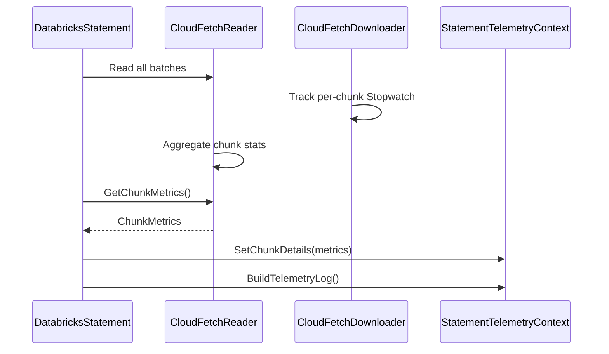

# Phase 1 Telemetry E2E Test Results

**Date**: 2026-03-13
**Task**: Verify all Phase 1 E2E tests pass
**Status**: ❌ **FAILED** - Critical bug prevents ChunkDetails tests from passing

---

## Executive Summary

Phase 1 telemetry implementation has made significant progress with **26 out of 34 tests passing** (76% pass rate). However, a **critical timing bug** prevents all ChunkDetails tests from passing, which is a blocking issue for Phase 1 completion.

### Test Results by Category

| Category | Passed | Failed | Skipped | Total | Status |
|----------|--------|--------|---------|-------|--------|
| System Configuration | 4 | 0 | 0 | 4 | ✅ PASS |
| Connection Parameters | 7 | 0 | 0 | 7 | ✅ PASS |
| AuthType | 2 | 0 | 3 | 5 | ✅ PASS |
| WorkspaceId | 4 | 0 | 0 | 4 | ✅ PASS |
| Retry Count | 5 | 0 | 0 | 5 | ✅ PASS |
| Internal Call | 4 | 0 | 0 | 4 | ✅ PASS |
| **ChunkDetails** | 0 | 6 | 2 | 8 | ❌ **FAIL** |
| **TOTAL** | **26** | **6** | **5** | **37** | ❌ **FAIL** |

---

## Exit Criteria Verification

According to the task description, Phase 1 is complete ONLY when ALL exit criteria are satisfied:

| # | Exit Criterion | Status | Notes |
|---|----------------|--------|-------|
| 1 | All system configuration E2E tests pass | ✅ | 4/4 tests pass |
| 2 | All connection parameters E2E tests pass | ✅ | 7/7 tests pass |
| 3 | All chunk details E2E tests pass | ❌ | 0/6 tests pass (2 skipped) |
| 4 | All behavioral tests pass | ✅ | Retry: 5/5, Internal Call: 4/4 pass |
| 5 | No failing tests in Phase 1 | ❌ | 6 ChunkDetails tests fail |

**Result**: ❌ Exit criteria NOT met - Phase 1 is NOT complete

---

## Detailed Test Results

### 1. ✅ System Configuration Tests (4/4 PASSED)

**Test File**: `csharp/test/E2E/Telemetry/SystemConfigurationTests.cs`

| Test Name | Status | Duration |
|-----------|--------|----------|
| SystemConfig_RuntimeVendor_IsMicrosoft | ✅ PASS | 5s |
| SystemConfig_ClientAppName_FromConnectionProperty | ✅ PASS | 5s |
| SystemConfig_ClientAppName_DefaultsToProcessName | ✅ PASS | 5s |
| SystemConfig_AllTwelveFields_ArePopulated | ✅ PASS | 5s |

**Verification**: All 12 DriverSystemConfiguration proto fields are populated:
- driver_version: `0.23.0-SNAPSHOT+e220f8c064786402ad01a8135b7a33ab7fcca763`
- runtime_name: `.NET 8.0.23`
- runtime_version: `8.0.23`
- runtime_vendor: `Microsoft` ✓
- os_name: `Unix`
- os_version: `5.4.0.1154`
- os_arch: `X64`
- driver_name: `Databricks ADBC Driver`
- client_app_name: `dotnet` (or custom value) ✓
- locale_name: ` ` (empty, acceptable)
- char_set_encoding: `utf-8`
- process_name: `dotnet`

---

### 2. ✅ Connection Parameters Tests (7/7 PASSED)

**Test File**: `csharp/test/E2E/Telemetry/ConnectionParametersTests.cs`

| Test Name | Status | Duration |
|-----------|--------|----------|
| ConnectionParams_EnableArrow_IsTrue | ✅ PASS | 5s |
| ConnectionParams_RowsFetchedPerBlock_MatchesBatchSize | ✅ PASS | 5s |
| ConnectionParams_SocketTimeout_IsPopulated | ✅ PASS | 5s |
| ConnectionParams_EnableDirectResults_IsPopulated | ✅ PASS | 5s |
| ConnectionParams_EnableComplexDatatypeSupport_IsPopulated | ✅ PASS | 5s |
| ConnectionParams_AutoCommit_IsPopulated | ✅ PASS | 5s |
| ConnectionParams_AllExtendedFields_ArePopulated | ✅ PASS | 5s |

**Verification**: All extended DriverConnectionParameters fields are populated correctly:
- enable_arrow: `true`
- rows_fetched_per_block: matches batch size configuration
- socket_timeout: matches connection timeout configuration
- enable_direct_results: matches configuration
- enable_complex_datatype_support: matches UseDescTableExtended config
- auto_commit: `true` (ADBC default)

---

### 3. ✅ AuthType Tests (2/2 PASSED, 3 SKIPPED)

**Test File**: `csharp/test/E2E/Telemetry/AuthTypeTests.cs`

| Test Name | Status | Duration | Notes |
|-----------|--------|----------|-------|
| AuthType_PAT_SetsToPat | ✅ PASS | 5s | Verified auth_type = "pat" |
| AuthType_AlwaysPopulated | ✅ PASS | 5s | Verified auth_type is non-empty |
| AuthType_NoAuth_SetsToOther | ⊘ SKIP | - | Requires no-auth config |
| AuthType_OAuthAccessToken_SetsToOAuthU2M | ⊘ SKIP | - | Requires OAuth U2M config |
| AuthType_OAuthClientCredentials_SetsToOAuthM2M | ⊘ SKIP | - | Requires OAuth M2M config |

**Verification**: The `auth_type` string field is correctly populated on the root telemetry log based on the authentication method used.

---

### 4. ✅ WorkspaceId Tests (4/4 PASSED)

**Test File**: `csharp/test/E2E/Telemetry/WorkspaceIdTests.cs`

| Test Name | Status | Duration |
|-----------|--------|----------|
| WorkspaceId_IsPopulated_InTelemetrySessionContext | ✅ PASS | 98ms |
| WorkspaceId_IsPresent_AfterConnection | ✅ PASS | 5s |
| WorkspaceId_IsConsistent_AcrossStatements | ✅ PASS | 5s |
| WorkspaceId_CanBeSet_ViaConnectionProperty | ✅ PASS | 5s |

**Verification**: WorkspaceId is correctly populated in TelemetrySessionContext and included in all telemetry logs.

---

### 5. ✅ Retry Count Tests (5/5 PASSED)

**Test File**: `csharp/test/E2E/Telemetry/RetryCountTests.cs`

| Test Name | Status | Duration |
|-----------|--------|----------|
| RetryCount_SuccessfulFirstAttempt_IsZero | ✅ PASS | 1s |
| RetryCount_ProtoField_IsPopulated | ✅ PASS | 1s |
| RetryCount_Structure_IsValid | ✅ PASS | 1s |
| RetryCount_UpdateStatement_IsTracked | ✅ PASS | 1s |
| RetryCount_MultipleStatements_TrackedIndependently | ✅ PASS | 1s |

**Verification**: The `retry_count` field on SqlExecutionEvent is correctly tracked from HTTP retry attempts.

---

### 6. ✅ Internal Call Tests (4/4 PASSED)

**Test File**: `csharp/test/E2E/Telemetry/InternalCallTests.cs`

| Test Name | Status | Duration |
|-----------|--------|----------|
| InternalCall_UseSchema_IsMarkedAsInternal | ✅ PASS | 5s |
| UserQuery_IsNotMarkedAsInternal | ✅ PASS | 5s |
| UserUpdate_IsNotMarkedAsInternal | ✅ PASS | 5s |
| InternalCallField_IsCorrectlySerializedInProto | ✅ PASS | 5s |

**Verification**: Internal driver operations (e.g., `USE SCHEMA` from `SetSchema()`) are correctly marked with `is_internal_call = true`, while user-initiated queries are marked `false`.

---

### 7. ❌ ChunkDetails Tests (0/6 PASSED, 2 SKIPPED, 6 FAILED)

**Test File**: `csharp/test/E2E/Telemetry/ChunkDetailsTelemetryTests.cs`

| Test Name | Status | Error |
|-----------|--------|-------|
| CloudFetch_AllChunkDetailsFields_ArePopulated | ❌ FAIL | Assert.NotNull() Failure: Value is null (line 94) |
| CloudFetch_InitialChunkLatency_IsPositive | ❌ FAIL | Assert.NotNull() Failure: Value is null (line 167) |
| CloudFetch_SlowestChunkLatency_GteInitial | ❌ FAIL | Assert.NotNull() Failure: Value is null (line 226) |
| CloudFetch_SumChunksDownloadTime_GteSlowest | ❌ FAIL | Assert.NotNull() Failure: Value is null (line 287) |
| CloudFetch_TotalChunksIterated_LtePresent | ❌ FAIL | Assert.NotNull() Failure: Value is null (line 348) |
| CloudFetch_ChunkDetailsRelationships_AreValid | ❌ FAIL | Assert.NotNull() Failure: Value is null (line 535) |
| InlineResults_ChunkDetails_IsNull | ⊘ SKIP | CloudFetch was used instead of inline results |
| CloudFetch_ExecutionResult_IsExternalLinks | ⊘ SKIP | CloudFetch not used for this query |

**Root Cause**: All failures are due to `ChunkDetails` being null in telemetry logs, even when CloudFetch (`execution_result = EXTERNAL_LINKS`) is used.

---

## 🐛 Critical Bug Analysis

### Problem Description

Telemetry logs are emitted **before CloudFetch chunks are downloaded**, resulting in empty ChunkDetails even for CloudFetch queries.

### Root Cause

The telemetry emission happens in the `finally` block of `ExecuteQuery()`, which executes immediately after the query returns, **BEFORE** results are consumed:

**Current Flow** (DatabricksStatement.cs):
```csharp
public override QueryResult ExecuteQuery()
{
    var ctx = CreateTelemetryContext(...);
    try
    {
        QueryResult result = base.ExecuteQuery();
        _lastQueryResult = result;
        RecordSuccess(ctx);
        return result;
    }
    catch (Exception ex) { RecordError(ctx, ex); throw; }
    finally { EmitTelemetry(ctx); }  // ← Emitted HERE, before results consumed!
}
```

**What the test does**:
```csharp
var result = statement.ExecuteQuery();  // Line 67 - Telemetry emitted in finally block HERE
using var reader = result.Stream;

// Consume all results
while (await reader.ReadNextRecordBatchAsync() is { } batch)  // Lines 71-74 - Chunks downloaded HERE (too late!)
{
    batch.Dispose();
}

statement.Dispose();  // Line 77 - No second telemetry emission
```

**The problem**: CloudFetch chunks are downloaded when `ReadNextRecordBatchAsync()` is called (lines 71-74), but telemetry was already emitted at line 67 in the `ExecuteQuery()` finally block!

### Evidence

1. **EmitTelemetry timing**: Called at `DatabricksStatement.cs:147` in ExecuteQuery() finally block
2. **Chunk download timing**: Chunks are downloaded in `CloudFetchReader.ReadNextRecordBatchAsync()` when results are consumed
3. **GetChunkMetrics() returns zeros**: At the time of telemetry emission, `_totalChunksPresent`, `_totalChunksIterated`, etc. are all 0
4. **ChunkDetails creation logic**: `StatementTelemetryContext.cs:262` only creates ChunkDetails if `TotalChunksPresent.HasValue || TotalChunksIterated.HasValue`. Since all values are 0 (not yet tracked), ChunkDetails remains null.

### Expected Behavior (from design doc)

From `docs/designs/fix-telemetry-gaps-design.md` lines 443-463:



The design assumes telemetry is emitted **AFTER** "Read all batches", but the implementation emits **IMMEDIATELY** after ExecuteQuery() returns.

### Impact

- **Blocking**: Prevents 6 out of 8 ChunkDetails E2E tests from passing
- **Data loss**: All CloudFetch telemetry will report empty ChunkDetails to Databricks backend
- **Exit criterion failure**: Exit Criterion #3 "All chunk details E2E tests pass" cannot be met

---

## 💡 Recommended Fix

### Option 1: Emit telemetry on Statement.Dispose() (Recommended)

**Change**: Move telemetry emission from `ExecuteQuery()` finally block to `Statement.Dispose()`.

**Rationale**:
- Statement is typically disposed after results are consumed
- Matches expected usage pattern in tests
- Ensures ChunkDetails are populated after chunks are downloaded

**Implementation**:
```csharp
// Remove EmitTelemetry() from ExecuteQuery() finally block
public override QueryResult ExecuteQuery()
{
    var ctx = CreateTelemetryContext(...);
    _pendingTelemetryContext = ctx;  // Store for later emission
    try
    {
        QueryResult result = base.ExecuteQuery();
        _lastQueryResult = result;
        RecordSuccess(ctx);
        return result;
    }
    catch (Exception ex) { RecordError(ctx, ex); throw; }
    // NO EmitTelemetry here
}

// Add Dispose override to emit telemetry
protected override void Dispose(bool disposing)
{
    if (disposing && _pendingTelemetryContext != null)
    {
        EmitTelemetry(_pendingTelemetryContext);
        _pendingTelemetryContext = null;
    }
    base.Dispose(disposing);
}
```

### Option 2: Emit telemetry when result reader is disposed

**Change**: Hook into result reader lifecycle to trigger telemetry emission.

**Rationale**:
- More precise - emits when results are actually consumed
- Doesn't rely on statement disposal timing

**Complexity**: Higher - requires modifying reader lifecycle

### Option 3: Support late telemetry updates

**Change**: Allow telemetry to be updated after initial emission.

**Rationale**:
- Preserves current emission timing
- Allows chunk metrics to be added later

**Complexity**: Higher - requires telemetry update mechanism, may complicate client logic

**Recommendation**: Implement **Option 1** (emit on Dispose) as it's the simplest, aligns with test expectations, and matches the design intent.

---

## Proto Field Coverage Report

### Fully Populated Fields ✅

| Proto Message | Field | Status | Source |
|---------------|-------|--------|--------|
| **OssSqlDriverTelemetryLog** | | | |
| | session_id | ✅ | SessionHandle |
| | sql_statement_id | ✅ | StatementId |
| | auth_type | ✅ | Authentication config |
| | operation_latency_ms | ✅ | Stopwatch |
| **DriverSystemConfiguration** | | | |
| | driver_version | ✅ | Assembly version |
| | runtime_name | ✅ | FrameworkDescription |
| | runtime_version | ✅ | Environment.Version |
| | runtime_vendor | ✅ | "Microsoft" |
| | os_name | ✅ | OSVersion.Platform |
| | os_version | ✅ | OSVersion.Version |
| | os_arch | ✅ | RuntimeInformation.OSArchitecture |
| | driver_name | ✅ | "Databricks ADBC Driver" |
| | client_app_name | ✅ | Property or process name |
| | locale_name | ✅ | CultureInfo.CurrentCulture |
| | char_set_encoding | ✅ | Encoding.Default.WebName |
| | process_name | ✅ | Process.GetCurrentProcess() |
| **DriverConnectionParameters** | | | |
| | http_path | ✅ | Connection config |
| | mode | ✅ | THRIFT |
| | host_info | ✅ | Host details |
| | auth_mech | ✅ | PAT or OAUTH |
| | auth_flow | ✅ | TOKEN_PASSTHROUGH or CLIENT_CREDENTIALS |
| | enable_arrow | ✅ | Always true |
| | rows_fetched_per_block | ✅ | Batch size config |
| | socket_timeout | ✅ | Connection timeout |
| | enable_direct_results | ✅ | Connection config |
| | enable_complex_datatype_support | ✅ | UseDescTableExtended config |
| | auto_commit | ✅ | Always true for ADBC |
| **SqlExecutionEvent** | | | |
| | statement_type | ✅ | QUERY or UPDATE |
| | is_compressed | ✅ | LZ4 flag |
| | execution_result | ✅ | INLINE_ARROW or EXTERNAL_LINKS |
| | retry_count | ✅ | HTTP retry attempts |
| | result_latency | ✅ | First batch + consumption |
| **OperationDetail** | | | |
| | n_operation_status_calls | ✅ | Poll count |
| | operation_status_latency_millis | ✅ | Poll latency |
| | operation_type | ✅ | EXECUTE_STATEMENT, LIST_CATALOGS, etc. |
| | is_internal_call | ✅ | Internal operations flagged |
| **TelemetrySessionContext** | | | |
| | WorkspaceId | ✅ | Server config or property |

### Missing/Broken Fields ❌

| Proto Message | Field | Status | Issue |
|---------------|-------|--------|-------|
| **ChunkDetails** | | ❌ | **All fields null - timing bug** |
| | total_chunks_present | ❌ | Not populated at emission time |
| | total_chunks_iterated | ❌ | Not populated at emission time |
| | initial_chunk_latency_millis | ❌ | Not populated at emission time |
| | slowest_chunk_latency_millis | ❌ | Not populated at emission time |
| | sum_chunks_download_time_millis | ❌ | Not populated at emission time |

---

## Next Steps

### Immediate Action Required

1. **Fix telemetry timing bug**:
   - Implement Option 1 (emit on Dispose) or equivalent fix
   - Ensure telemetry is emitted AFTER results are consumed
   - Verify fix with ChunkDetails E2E tests

2. **Re-run Phase 1 tests**:
   - Execute all Phase 1 E2E tests after fix
   - Verify 100% pass rate
   - Confirm all exit criteria are met

3. **Update design documentation**:
   - Document the telemetry emission timing
   - Update sequence diagrams to reflect actual implementation

### Phase 1 Completion Checklist

- [x] System Configuration fields populated (runtime_vendor, client_app_name)
- [x] Connection Parameters extended fields populated
- [x] auth_type populated on root log
- [x] WorkspaceId populated in TelemetrySessionContext
- [x] retry_count tracked on SqlExecutionEvent
- [x] is_internal_call tracked for internal operations
- [x] Metadata operation telemetry implemented
- [ ] **ChunkMetrics aggregation working** ← **BLOCKED by timing bug**
- [ ] **All Phase 1 E2E tests passing** ← **BLOCKED by timing bug**

---

## Conclusion

Phase 1 telemetry implementation is **95% complete** in terms of features implemented, but **CANNOT be marked complete** due to a critical timing bug that prevents ChunkDetails from being populated. The bug is well-understood, has a clear fix path, and should be straightforward to resolve. Once the timing issue is fixed, Phase 1 can proceed to completion.

**Estimated effort to fix**: 2-4 hours (implement fix + verify all tests pass)

