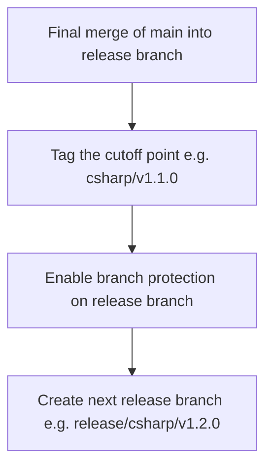
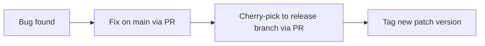

# C# Driver Release Process

## Overview

The C# driver uses a release branch model to provide stable, hotfixable releases. Downstream consumers (e.g., PowerBI) pin to a specific version and receive cherry-picked fixes without pulling in all new development work.

## Branch Naming

```
release/csharp/vX.Y.Z
```

Examples: `release/csharp/v1.0.0`, `release/csharp/v1.1.0`

## Lifecycle

### Full Release Lifecycle

```mermaid
gitGraph
    commit id: "A"
    commit id: "B"
    branch release/csharp/v1.1.0
    checkout main
    commit id: "C"
    checkout release/csharp/v1.1.0
    merge main id: "merge C"
    checkout main
    commit id: "D"
    checkout release/csharp/v1.1.0
    merge main id: "merge D (final)" tag: "csharp/v1.1.0"
    checkout main
    commit id: "E"
    commit id: "F"
    checkout release/csharp/v1.1.0
    commit id: "cherry-pick fix A" tag: "csharp/v1.1.1"
    commit id: "cherry-pick fix B" tag: "csharp/v1.1.2"
```

### Phase 1: Pre-Cutoff (Active Development)

- All new commits go to `main` as usual.
- The release branch is created early from `main`.
- Periodically merge `main` into the release branch to keep it current.
- **Never commit directly to the release branch during this phase.**

### Phase 2: Cutoff

When the release is ready to freeze:



### Phase 3: Post-Cutoff (Maintenance)

- Only cherry-picks allowed, with PR review.
- Fixes go to `main` first, then cherry-picked to the release branch.
- Each cherry-pick batch gets a new patch tag (e.g., `csharp/v1.1.1`, `csharp/v1.1.2`).



## Scope

This applies **only to the C# driver**. Other drivers in the monorepo are unaffected:

| Driver | Release Mechanism | Status |
|--------|------------------|--------|
| **C#** | Release branches + tags | Current |
| **Go** | Tags on `main` (`go/v0.1.x`) | Existing |
| **Rust** | None | — |

The release branch contains the full monorepo (Git doesn't support partial branches), but only C# changes are cherry-picked and built from it.

## Tag Convention

```
csharp/vX.Y.Z
```

Consistent with the existing Go convention (`go/vX.Y.Z`).

## Branch Protection Rules (Post-Cutoff)

Apply to `release/csharp/*`:

- Require pull request with at least 1 approval
- Enforce for administrators
- Restrict who can push (release managers only)
- No direct merges from `main` after cutoff

## CI/CD

Scope the C# build/publish workflow to trigger on the release branch:

```yaml
on:
  push:
    branches: ['release/csharp/*']
    paths: ['csharp/**']
```

## Consumer Mapping (e.g., PowerBI)

PowerBI (or any consumer) tracks which C# driver version they ship. The mapping is their responsibility. They can:

- Pin to a specific tag (e.g., `csharp/v1.1.0`)
- Reference the release branch for ongoing fixes (e.g., `release/csharp/v1.1.0`)
- Check the driver version via: `git show csharp/v1.1.0:csharp/path/to/Version.props`
