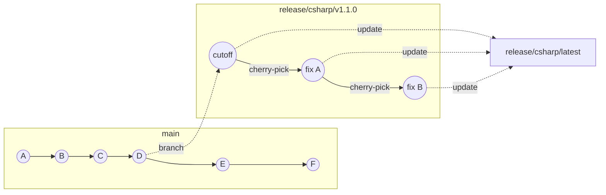

<!--
  Copyright (c) 2025 ADBC Drivers Contributors

  Licensed under the Apache License, Version 2.0 (the "License");
  you may not use this file except in compliance with the License.
  You may obtain a copy of the License at

          http://www.apache.org/licenses/LICENSE-2.0

  Unless required by applicable law or agreed to in writing, software
  distributed under the License is distributed on an "AS IS" BASIS,
  WITHOUT WARRANTIES OR CONDITIONS OF ANY KIND, either express or implied.
  See the License for the specific language governing permissions and
  limitations under the License.
-->

# C# Driver Release Process

## Overview

The C# driver uses a release branch model because downstream consumers (e.g., PowerBI) ship a specific driver version and cannot freely upgrade. When PowerBI ships `v1.0.0`, they may remain on that version for months. If a bug is found, they need a `v1.0.1` hotfix delivered to their `v1.0.0` release line — without being forced to take new features from `v1.1.x` or later.

This means **multiple release branches coexist simultaneously**, each independently maintainable via cherry-picks:

```
release/csharp/v1.0.0:  [v1.0.0] → cherry-pick fix → [v1.0.1] → cherry-pick fix → [v1.0.2]
release/csharp/v1.1.0:  [v1.1.0] → cherry-pick fix → [v1.1.1]
release/csharp/v1.2.0:  [v1.2.0]
```

This differs from the Go and Rust drivers, which tag directly on `main` and cannot hotfix a specific past version — consumers must upgrade to get fixes.

The ADBC driver version is included in the user agent string sent to Databricks, making it visible in query history for tracing exactly which version a consumer is running.

## Branch Naming

| Artifact | Pattern | Example |
|----------|---------|---------|
| Release branch | `release/csharp/vX.Y.Z` | `release/csharp/v1.1.0` |
| Latest branch | `release/csharp/latest` | — |

## Versioning Rules

- **New release branch** (cutoff): bump the **minor** version — `v1.1.0` → `v1.2.0`
- **Hotfix on existing release branch**: bump the **patch** version — `v1.1.0` → `v1.1.1` → `v1.1.2`

The major version is reserved for breaking changes.

## Lifecycle



### Cutoff

When ready to release, branch off `main`:

1. Create `release/csharp/v1.1.0` from the desired commit on `main`
2. Update `release/csharp/latest`: `git push origin release/csharp/v1.1.0:release/csharp/latest --force`

### Post-Cutoff (Maintenance)

- Fixes go to `main` first, then cherry-picked to the release branch via PR.
- Update `release/csharp/latest` after each patch: `git push origin release/csharp/v1.1.0:release/csharp/latest --force`

## Branch Protection

All `release/csharp/*` branches (including `release/csharp/latest`) are protected by a single branch protection rule with pattern `release/csharp/*`:

- Deletion blocked
- 1 PR approval required
- Force pushes allowed (required for updating `release/csharp/latest`)

## Scope

This applies **only to the C# driver**. Other drivers in the monorepo are unaffected:

| Driver | Release Mechanism | Can hotfix old patch? |
|--------|------------------|-----------------------|
| **C#** | Release branches | Yes — each minor version has its own branch |
| **Go** | Tags on `main` (`go/v0.1.x`) | No — consumers must upgrade |
| **Rust** | None | — |

The release branch contains the full monorepo (Git doesn't support partial branches), but only C# changes are cherry-picked and built from it.

## Latest Branch

`release/csharp/latest` always points to the latest release. It exists for consumers that want to track the latest release without knowing the specific version branch name.

## CI/CD

The `csharp.yml` workflow currently triggers on `main` and `maint-*` branches. To run CI on release branches, add `release/csharp/*` to the trigger:

```yaml
on:
  pull_request:
    branches:
      - main
      - 'release/csharp/*'
    paths:
      - 'csharp/**'
  push:
    branches:
      - main
      - 'release/csharp/*'
    paths:
      - 'csharp/**'
```

## Consumer Mapping (e.g., PowerBI)

- **Track a release branch** (e.g., `release/csharp/v1.1.0`) — receives cherry-picks automatically, pinned to a specific minor version
- **Track `release/csharp/latest`** — always tracks the latest release
