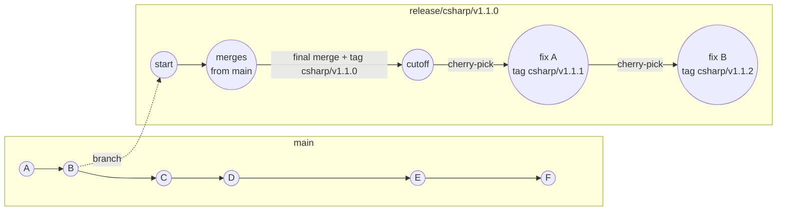
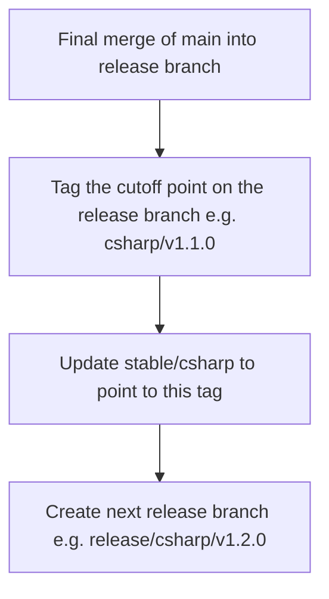
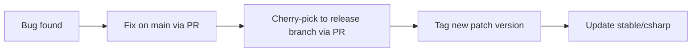

<!--
  Copyright (c) 2025 ADBC Drivers Contributors

  Licensed under the Apache License, Version 2.0 (the "License");
  you may not use this file except in compliance with the License.
  You may obtain a copy of the License at

          http://www.apache.org/licenses/LICENSE-2.0

  Unless required by applicable law or agreed to in writing, software
  distributed under the License is distributed on an "AS IS" BASIS,
  WITHOUT WARRANTIES OR CONDITIONS OF ANY KIND, either express or implied.
  See the License for the specific language governing permissions and
  limitations under the License.
-->

# C# Driver Release Process

## Overview

The C# driver uses a release branch model because downstream consumers (e.g., PowerBI) ship a specific driver version and cannot freely upgrade. When PowerBI ships `v1.0.0`, they may remain on that version for months. If a bug is found, they need a `v1.0.1` hotfix delivered to their `v1.0.0` release line — without being forced to take any new features from `v1.1.x` or later.

This means **multiple release branches coexist simultaneously**, each independently maintainable via cherry-picks:

```
release/csharp/v1.0.0:  [v1.0.0] → cherry-pick fix → [v1.0.1] → cherry-pick fix → [v1.0.2]
release/csharp/v1.1.0:  [v1.1.0] → cherry-pick fix → [v1.1.1]
release/csharp/v1.2.0:  [v1.2.0]
```

This differs from the Go and Rust drivers, which tag directly on `main` and cannot hotfix a specific past version — consumers on those drivers must upgrade to get fixes.

The ADBC driver version is included in the user agent string sent to Databricks, making it visible in query history. This allows tracing exactly which driver version a consumer is running when investigating issues.

## Branch Naming

```
release/csharp/vX.Y.Z
```

Examples: `release/csharp/v1.0.0`, `release/csharp/v1.1.0`

## Lifecycle

### Full Release Lifecycle



### Phase 1: Pre-Cutoff (Active Development)

- All new commits go to `main` as usual.
- The release branch is created early from `main`.
- Periodically merge `main` into the release branch to keep it current.
- **Never commit directly to the release branch during this phase.**

### Phase 2: Cutoff

When the release is ready to freeze:



Opening the next release branch immediately gives the team a landing place for new work, reducing the temptation to commit directly to the frozen branch.

### Phase 3: Post-Cutoff (Maintenance)

- Only cherry-picks allowed, with PR review.
- Fixes go to `main` first, then cherry-picked to the release branch.
- Each cherry-pick batch gets a new patch tag (e.g., `csharp/v1.1.1`, `csharp/v1.1.2`).
- Update `stable/csharp` after each patch tag.



## Scope

This applies **only to the C# driver**. Other drivers in the monorepo are unaffected:

| Driver | Release Mechanism | Can hotfix old patch? |
|--------|------------------|-----------------------|
| **C#** | Release branches + tags | Yes — each minor version has its own branch |
| **Go** | Tags on `main` (`go/v0.1.x`) | No — consumers must upgrade |
| **Rust** | None | — |

The release branch contains the full monorepo (Git doesn't support partial branches), but only C# changes are cherry-picked and built from it.

## Tag Convention

```
csharp/vX.Y.Z
```

Consistent with the existing Go convention (`go/vX.Y.Z`).

## Stable Branch

A `stable/csharp` branch always points to the HEAD of the current release branch. It is updated as part of the cutoff process and after each patch tag.

This is for consumers that cannot specify a branch name (e.g., systems that run a plain `git clone` with no `--branch` flag). All other consumers should pin to a specific tag or release branch directly.

Update `stable/csharp` after each tag:

```bash
git push origin release/csharp/v1.1.0:stable/csharp --force
```

## Branch Protection

Release branches follow the same protection rules as `main`:

- Require pull request to merge
- CI must pass

Cutoff is enforced by team convention (stop merging `main`, only cherry-pick), not by additional branch restrictions.

## CI/CD

The C# build workflow triggers on both the release branch and `stable/csharp`:

```yaml
on:
  push:
    branches:
      - 'release/csharp/*'
      - 'stable/csharp'
    paths: ['csharp/**']
  push:
    tags:
      - 'csharp/v*'
```

On tag push, the workflow publishes the NuGet package to NuGet.org in addition to running build and tests.

## Consumer Mapping (e.g., PowerBI)

PowerBI (or any consumer) tracks which C# driver version they ship. The mapping is their responsibility. They can:

- Pin to a specific tag (e.g., `csharp/v1.1.0`) — most stable, no automatic updates
- Reference the release branch for ongoing fixes (e.g., `release/csharp/v1.1.0`) — gets cherry-picks automatically
- Clone `stable/csharp` with a plain `git clone` — always tracks the latest release, no branch name needed
- Check the driver version via: `git show csharp/v1.1.0:csharp/path/to/Version.props`
