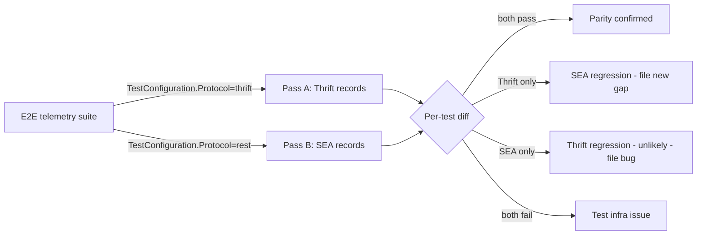

# Gap Report — PECO-3022 SEA Telemetry E2E Coverage

**Report date:** 2026-05-15
**Branch under review:** `stack/pr-phase5-sea-statement-telemetry`
**Companion to:** [`gap-report-PECO-3022-sea-telemetry-2026-05-14.md`](./gap-report-PECO-3022-sea-telemetry-2026-05-14.md) (G1–G3, D1–D4)
**Design doc:** [`docs/designs/PECO-3022-sea-telemetry-integration-design.md`](../../docs/designs/PECO-3022-sea-telemetry-integration-design.md)
**Jira:** [PECO-3022](https://databricks.atlassian.net/browse/PECO-3022)

---

## 1. Bottom line

After the gap-fill commits (`gap-1` through `gap-5`) wired all 8 observer hookpoints in `StatementExecutionStatement`, the production code path is functionally complete. However, **end-to-end test coverage for the SEA telemetry path remains gated off**. The existing E2E telemetry test suite is already protocol-parameterized via `TestConfiguration.Protocol` but every SEA-touching test is guarded by `Skip.If(Protocol == "rest", ...)` with reasons that no longer apply.

This is the **G4 gap**: shipped code with stale skip-guards equals zero comparator coverage. We currently cannot detect regressions between the Thrift and SEA telemetry paths.

Closing G4 is mechanical (one-line skip removals) and immediately turns the existing 12-file Thrift test suite into a Thrift-vs-SEA comparator — exactly the validation needed before declaring the sprint goal met.

---

## 2. Existing E2E infrastructure (what we get to reuse)

| Component | Path | Note |
|---|---|---|
| Capture-side telemetry exporter | `csharp/test/E2E/Telemetry/CapturingTelemetryExporter.cs` | Local in-process capture; no lumberjack dependency |
| Test helpers | `csharp/test/E2E/Telemetry/TelemetryTestHelpers.cs` | Shared utilities (assertion helpers, factories) |
| Protocol-parameterized harness | `TestConfiguration.Protocol` | Test runs over `"thrift"` and `"rest"` based on configuration |

The harness was designed for cross-protocol parity from the start. Each test file checks `TestConfiguration.Protocol` and skips when it can't run — meaning once the skip is removed, the same test exercises both transports without any further plumbing.

---

## 3. The G4 gap — 12 files, all gated off for SEA

### Category A — Drop skip immediately ("PECO-3010: telemetry not wired for SEA")

Seven files carry the marker `PECO-3010 - telemetry not wired for SEA protocol`. PECO-3022 has now wired the telemetry, so the marker is stale. Drop the skip.

| File | Skip line | What it tests |
|---|---|---|
| `TelemetryBaselineTests.cs` | 43 | Smoke: any record produced, basic fields present |
| `AuthTypeTests.cs` | 40 | `auth_type` field correctness across PAT / OAuth-M2M / OAuth-U2M |
| `SystemConfigurationTests.cs` | 41 | `system_configuration` — driver_version, OS, runtime, locale |
| `ClientTelemetryE2ETests.cs` | 44 | End-to-end record content for typical SELECT |
| `StatementMetadataTelemetryTests.cs` | 51 | `statement_type` + metadata operation tagging |
| `MetadataOperationTests.cs` | 41 | GetObjects / GetTableTypes / GetInfo telemetry |
| `InternalCallTests.cs` | 42 | `is_internal_call` flag for internal-driver SQL |

### Category B — Drop skip, observe what fails ("Thrift-only" but likely runnable on SEA)

Four files carry "Thrift-only" reasons that are not strictly true post-PECO-3022. They depend on plumbing this design either delivered (`DriverMode.Sea`, `chunk_details`) or stubbed gracefully (`ChunkMetrics.Empty` fallback). Drop the skip and see which assertions actually fail — those failures are the next real gaps.

| File | Skip line | Why it might pass now | Risk if it fails |
|---|---|---|---|
| `ConnectionParametersTests.cs` | 41 | `driver_connection_params.mode = DRIVER_MODE_SEA` is now set per design §10; field-population should match Thrift modulo `socket_timeout` (D1 still open) | D1 (`socket_timeout` mislabeled) — fix flagged in previous gap report |
| `ChunkDetailsTelemetryTests.cs` | 44 | `OnChunksDownloaded` is wired with `_cloudFetchReader.GetChunkMetrics() ?? new ChunkMetrics()` | Empty `ChunkMetrics` when gap-fix plumbing absent — assertions may need a tolerance check |
| `ChunkMetricsReaderTests.cs` | 41 | Same as above | Same |
| `ChunkMetricsAggregationTests.cs` | 39 | Same as above | Same |

### Category C — Keep skipped (out of PECO-3022 scope)

| File | Skip line | Reason |
|---|---|---|
| `RetryCountTests.cs` | 43 | `retry_count` not wired for SEA. This is in the gap-fix workstream's scope, not PECO-3022. |

---

## 4. Comparator-testing strategy

The skip removal effectively turns each existing Thrift telemetry test into a Thrift-vs-SEA parity check. Run the suite in two passes:

**Comparison fields** (per design §6 + §15):
- `session_id`, `sql_statement_id`
- `driver_connection_params.mode` (THRIFT vs SEA — the *only* expected diff)
- `sql_operation.statement_type`, `operation_type`
- `sql_operation.execution_result.format`
- `sql_operation.result_latency.result_set_ready_latency_millis`
- `sql_operation.result_latency.result_set_consumption_latency_millis`
- `sql_operation.operation_detail.n_operation_status_calls` (poll count — may differ by transport since SEA polls via `GetStatementAsync`, Thrift via `GetOperationStatus`)
- `sql_operation.chunk_details.*` (may be empty on SEA until gap-fix lands)
- `error_info.error_name`
- `system_configuration.*`, `driver_connection_params.*`

The expected diffs are bounded and known. Anything outside the expected-diff set is a bug.

---

## 5. Action plan (ordered)

| Step | Action | Effort | Outcome |
|---|---|---|---|
| 1 | **Category A: drop 7 PECO-3010 skips** — one-line edit per file. Group as a single commit `[gap-fill][gap-6] Enable SEA-mode for PECO-3010-gated telemetry E2E tests`. | 30 min | 7 test files become Thrift-vs-SEA comparators |
| 2 | **Run E2E suite, protocol=rest**: `dotnet test --filter "Telemetry" -- TestConfiguration.Protocol=rest`. Capture pass/fail per test. | 30 min (CI) | Baseline SEA pass/fail picture |
| 3 | **Run E2E suite, protocol=thrift**: same command with `=thrift`. Compare to step 2. | 30 min (CI) | Comparator diff |
| 4 | **Category B: experimentally drop 4 "Thrift-only" skips** — separate commit per file so partial failures stay revertible. | 30 min | Reveal whether chunk-metrics path works end-to-end with `ChunkMetrics.Empty` fallback |
| 5 | **Triage failures** — for each SEA-failing test from steps 2–4, classify as: (a) D1 / known divergence, (b) genuinely new bug, (c) test expectation needs SEA branch (e.g. expected `EXECUTE_STATEMENT_ASYNC` instead of `EXECUTE_STATEMENT`). | 1–2 hours | Updated gap list with concrete failure modes |
| 6 | **Author final SEA-specific E2E tests** per design §15 for gaps the existing suite doesn't cover: error path, telemetry-disabled-by-feature-flag, concurrent statements. | 1 day | Coverage parity with design §15 |
| 7 | **Sprint demo evidence** — capture two side-by-side records from `CapturingTelemetryExporter` (Thrift + SEA for the same query) and include in the demo. | 1 hour | Visible parity confirmation |

**Critical path:** Steps 1 → 2 → 3 (≈1.5 hours) gives us a Thrift-vs-SEA comparator baseline. The rest is triage and follow-up.

---

## 6. Concrete expected diffs (so failures can be classified fast)

| Field | Thrift | SEA | Status |
|---|---|---|---|
| `driver_connection_params.mode` | `DRIVER_MODE_THRIFT` | `DRIVER_MODE_SEA` | **Expected** |
| `operation_detail.operation_type` | `EXECUTE_STATEMENT` | `EXECUTE_STATEMENT_ASYNC` | **Expected** — SEA is always async on wire (design §17 open question #3) |
| `operation_detail.n_operation_status_calls` | counts `GetOperationStatusAsync` | counts `GetStatementAsync` | **Expected** — design §17 open question #1 |
| `driver_connection_params.socket_timeout` | actual connect timeout | mislabeled as `_waitTimeoutSeconds` | **Known divergence — D1** |
| `chunk_details.*` | populated when CloudFetch active | may be zero/null until gap-fix `ChunkMetrics` plumbing lands | **Expected — bounded** |
| `error_info.error_name` | exception type name | exception type name | should match |
| `system_configuration.*` | driver/OS/runtime info | same | should match |
| `auth_type` | resolved auth | resolved auth | should match (T5 wired identically) |
| `sql_statement_id` | populated | populated | should match (gap-1 OnFinalized + gap-2 mapper) |

Anything outside this table that diverges → file as a new gap.

---

## 7. Risks

- **CI flake** — real-warehouse E2E tests are slow and prone to transient failures. Mitigate by running each protocol twice on first execution and treating only consistent failures as real.
- **Hidden Thrift-only assertions** — some tests in Category B may make assertions on fields where SEA simply does not emit (e.g. `retry_count` if accidentally asserted alongside chunk details). Expect ~25% of Category B to need a small SEA branch in the assertion rather than a wholesale revert.
- **Skip-removal collateral** — dropping skips on tests authored when SEA was completely absent means we may surface assumptions buried in test fixtures (auth setup, warehouse selection). Allocate buffer time in step 5.
- **Gap-fix `ChunkMetrics` dependency** — Category B tests for chunk details may exercise the `ChunkMetrics.Empty` fallback path. The tests should be updated to tolerate empty / unset chunk fields on SEA until the gap-fix workstream's `CloudFetchDownloader → CloudFetchReader.GetChunkMetrics()` plumbing surfaces real values.

---

## 8. Definition of done for G4

- All seven Category A skip guards removed.
- E2E suite passes on both `Protocol=thrift` and `Protocol=rest` (Category B failures triaged into either fix or kept-skipped with documented reason).
- Sprint demo includes side-by-side Thrift and SEA telemetry records for the same query.
- Any new failures surfaced by skip removal are either fixed in this sprint or filed as follow-up gaps with concrete repro steps.
