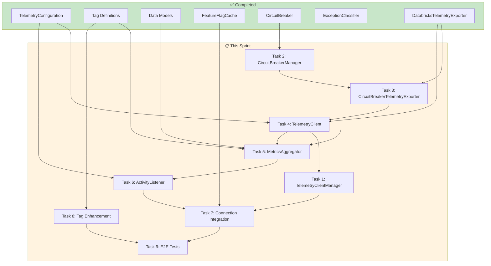

<!--
Copyright (c) 2025 ADBC Drivers Contributors

Licensed under the Apache License, Version 2.0 (the "License");
you may not use this file except in compliance with the License.
You may obtain a copy of the License at

        http://www.apache.org/licenses/LICENSE-2.0

Unless required by applicable law or agreed to in writing, software
distributed under the License is distributed on an "AS IS" BASIS,
WITHOUT WARRANTIES OR CONDITIONS OF ANY KIND, either express or implied.
See the License for the specific language governing permissions and
limitations under the License.
-->

# Sprint Plan: Complete Telemetry Implementation

**Sprint Start Date**: 2026-03-03
**Sprint Duration**: 2 weeks
**Sprint Goal**: Complete all remaining telemetry components and integrate into DatabricksConnection

---

## Executive Summary

This sprint completes the Activity-based telemetry implementation for the C# Databricks ADBC driver. The foundation (configuration, tag definitions, data models, feature flag cache, circuit breaker, exception classifier, and telemetry exporter) is already in place. This sprint delivers the remaining components to create a fully functional telemetry pipeline.

---

## Current State Summary

### Completed Components

| Component | File Location | Status |
|-----------|---------------|--------|
| TelemetryConfiguration | `src/Telemetry/TelemetryConfiguration.cs` | ✅ Complete |
| Tag Definition System | `src/Telemetry/TagDefinitions/*` | ✅ Complete |
| Telemetry Data Models | `src/Telemetry/Models/*` | ✅ Complete |
| FeatureFlagCache | `src/FeatureFlagCache.cs`, `src/FeatureFlagContext.cs` | ✅ Complete |
| CircuitBreaker | `src/Telemetry/CircuitBreaker.cs` | ✅ Complete |
| ExceptionClassifier | `src/Telemetry/ExceptionClassifier.cs` | ✅ Complete |
| DatabricksTelemetryExporter | `src/Telemetry/DatabricksTelemetryExporter.cs` | ✅ Complete |
| ITelemetryExporter | `src/Telemetry/ITelemetryExporter.cs` | ✅ Complete |
| Proto Schema | `src/Telemetry/Proto/sql_driver_telemetry.proto` | ✅ Complete |

### Remaining Components (This Sprint)

| Component | Priority | Estimated Days |
|-----------|----------|----------------|
| TelemetryClientManager | P0 | 1 |
| CircuitBreakerManager | P0 | 0.5 |
| CircuitBreakerTelemetryExporter | P0 | 1 |
| TelemetryClient (ITelemetryClient) | P0 | 1.5 |
| MetricsAggregator | P0 | 2 |
| DatabricksActivityListener | P0 | 1.5 |
| DatabricksConnection Integration | P0 | 2 |
| Activity Tag Enhancement | P1 | 1.5 |
| E2E Tests (completion) | P1 | 2 |

**Total Estimated Effort**: ~13 days

---

## Sprint Tasks

### Task 1: TelemetryClientManager

**Description**: Singleton that manages one telemetry client per host to prevent rate limiting from concurrent connections.

**Status**: 🔲 Not Started

**Location**: `src/Telemetry/TelemetryClientManager.cs`

**Dependencies**: TelemetryClient (can be developed in parallel with interfaces)

**Implementation Details**:
- Create singleton pattern with `GetInstance()`
- Implement `ConcurrentDictionary<string, TelemetryClientHolder>` for per-host clients
- Implement `GetOrCreateClient(host, exporterFactory, config)` method
- Implement `ReleaseClientAsync(host)` with reference counting
- Thread-safe client lifecycle management

**Acceptance Criteria**:
- [ ] Same host returns same client instance
- [ ] Reference counting increments on GetOrCreateClient
- [ ] Reference counting decrements on ReleaseClientAsync
- [ ] Client disposed when ref count reaches zero
- [ ] Thread-safe for concurrent access from multiple connections

**Test Expectations**:

| Test Name | Input | Expected Output |
|-----------|-------|-----------------|
| `GetOrCreateClient_NewHost_CreatesClient` | "host1.databricks.com" | New client with RefCount=1 |
| `GetOrCreateClient_ExistingHost_ReturnsSameClient` | Same host twice | Same client instance, RefCount=2 |
| `ReleaseClientAsync_LastReference_ClosesClient` | Single reference, then release | Client.CloseAsync() called, removed from cache |
| `ReleaseClientAsync_MultipleReferences_KeepsClient` | Two references, release one | RefCount=1, client still active |
| `GetOrCreateClient_ThreadSafe_NoDuplicates` | Concurrent calls from 10 threads | Single client instance created |

---

### Task 2: CircuitBreakerManager

**Description**: Singleton that manages circuit breakers per host.

**Status**: 🔲 Not Started

**Location**: `src/Telemetry/CircuitBreakerManager.cs`

**Dependencies**: CircuitBreaker (✅ Complete)

**Implementation Details**:
- Create singleton pattern with `GetInstance()`
- Implement `ConcurrentDictionary<string, CircuitBreaker>` for per-host breakers
- Implement `GetCircuitBreaker(host)` method

**Acceptance Criteria**:
- [ ] Same host returns same circuit breaker instance
- [ ] Different hosts get separate circuit breakers
- [ ] Thread-safe for concurrent access

**Test Expectations**:

| Test Name | Input | Expected Output |
|-----------|-------|-----------------|
| `GetCircuitBreaker_NewHost_CreatesBreaker` | "host1.databricks.com" | New CircuitBreaker instance |
| `GetCircuitBreaker_SameHost_ReturnsSameBreaker` | Same host twice | Same CircuitBreaker instance |
| `GetCircuitBreaker_DifferentHosts_CreatesSeparateBreakers` | "host1", "host2" | Different CircuitBreaker instances |

---

### Task 3: CircuitBreakerTelemetryExporter

**Description**: Wrapper that protects telemetry exporter with circuit breaker pattern.

**Status**: 🔲 Not Started

**Location**: `src/Telemetry/CircuitBreakerTelemetryExporter.cs`

**Dependencies**: CircuitBreaker (✅), CircuitBreakerManager, ITelemetryExporter (✅)

**Implementation Details**:
- Implement ITelemetryExporter interface
- Wrap inner exporter with circuit breaker protection
- Drop events gracefully when circuit is open (no exception)
- Log dropped events at DEBUG level

**Acceptance Criteria**:
- [ ] Delegates to inner exporter when circuit closed
- [ ] Returns false (no export) when circuit open
- [ ] No exceptions thrown to caller
- [ ] Circuit breaker tracks failures from inner exporter

**Test Expectations**:

| Test Name | Input | Expected Output |
|-----------|-------|-----------------|
| `CircuitClosed_ExportsMetrics` | Metrics list, circuit closed | Inner exporter called, returns true |
| `CircuitOpen_DropsMetrics` | Metrics list, circuit open | No export, returns false, no exception |
| `InnerExporterFails_CircuitBreakerTracksFailure` | Inner exporter throws | Circuit breaker failure count incremented |

---

### Task 4: TelemetryClient (ITelemetryClient)

**Description**: Main telemetry client that batches events from multiple connections and exports periodically.

**Status**: 🔲 Not Started

**Location**: `src/Telemetry/ITelemetryClient.cs`, `src/Telemetry/TelemetryClient.cs`

**Dependencies**: ITelemetryExporter (✅), TelemetryConfiguration (✅)

**Implementation Details**:
- Define ITelemetryClient interface with Enqueue, FlushAsync, CloseAsync
- Implement TelemetryClient with ConcurrentQueue for batching
- Implement periodic flush timer (default: 5 seconds)
- Implement batch size threshold flush
- Implement graceful shutdown with final flush
- All exceptions swallowed internally

**Acceptance Criteria**:
- [ ] Enqueue is non-blocking and thread-safe
- [ ] Flush triggers when batch size reached
- [ ] Flush triggers on timer interval
- [ ] CloseAsync flushes remaining events
- [ ] No exceptions propagated to caller

**Test Expectations**:

| Test Name | Input | Expected Output |
|-----------|-------|-----------------|
| `Enqueue_AddsToQueue_NonBlocking` | TelemetryFrontendLog | Event added to queue, returns immediately |
| `Enqueue_BatchSizeReached_TriggersFlush` | 100 events (batch size) | ExportAsync called |
| `FlushTimer_Elapses_ExportsEvents` | Wait for flush interval | ExportAsync called |
| `CloseAsync_FlushesRemainingEvents` | Events in queue, then close | All events exported |
| `Exception_Swallowed_NoThrow` | Exporter throws | No exception propagated |

---

### Task 5: MetricsAggregator

**Description**: Aggregates Activity data by statement_id, builds proto messages, handles exception buffering.

**Status**: 🔲 Not Started

**Location**: `src/Telemetry/MetricsAggregator.cs`, `src/Telemetry/StatementTelemetryContext.cs`

**Dependencies**: Tag Definitions (✅), Data Models (✅), ExceptionClassifier (✅), ITelemetryClient

**Implementation Details**:

**StatementTelemetryContext class**:
- Holds aggregated data for a single statement
- Fields: SessionId, StatementId, OperationLatencyMs, StatementType, ChunkDetails, OperationDetail, ErrorInfo
- `MergeFrom(Activity)` method to merge activity data

**MetricsAggregator class**:
- `ConcurrentDictionary<string, StatementTelemetryContext>` keyed by statement_id
- `ProcessActivity(Activity)` method
- Detect root activity completion to emit proto
- Filter tags using TelemetryTagRegistry
- Handle exception classification for immediate vs deferred flush

**Acceptance Criteria**:
- [ ] Activities aggregated by statement_id
- [ ] Root activity completion triggers proto emission
- [ ] Sensitive tags filtered out
- [ ] Terminal exceptions trigger immediate flush
- [ ] All exceptions swallowed internally

**Test Expectations**:

| Test Name | Input | Expected Output |
|-----------|-------|-----------------|
| `ProcessActivity_ConnectionOpen_EmitsImmediately` | Connection.Open activity | Metric queued for export |
| `ProcessActivity_Statement_AggregatesByStatementId` | Multiple activities with same statement_id | Single aggregated metric |
| `RootActivityComplete_EmitsAggregatedMetric` | Root activity stops | Queues aggregated metric |
| `FiltersTags_UsingRegistry` | Activity with sensitive tags | Only safe tags in metric |
| `TerminalException_FlushesImmediately` | Terminal exception | Immediately exports error metric |
| `RetryableException_BuffersUntilComplete` | Retryable exception | Buffers, exports on statement complete |

---

### Task 6: DatabricksActivityListener

**Description**: Listens to Activity events from the driver and delegates to MetricsAggregator.

**Status**: 🔲 Not Started

**Location**: `src/Telemetry/DatabricksActivityListener.cs`

**Dependencies**: MetricsAggregator, TelemetryConfiguration (✅)

**Implementation Details**:
- Create ActivityListener subscribing to "Databricks.Adbc.Driver" ActivitySource
- Implement Sample callback based on TelemetryConfiguration.Enabled
- Implement ActivityStopped callback to delegate to MetricsAggregator
- Implement Start/Stop methods for lifecycle
- All exceptions swallowed internally

**Acceptance Criteria**:
- [ ] Listens only to Databricks.Adbc.Driver ActivitySource
- [ ] Sampling controlled by config.Enabled
- [ ] ActivityStopped triggers ProcessActivity
- [ ] StopAsync flushes aggregator
- [ ] All exceptions swallowed

**Test Expectations**:

| Test Name | Input | Expected Output |
|-----------|-------|-----------------|
| `Start_ListensToDatabricksActivitySource` | N/A | ShouldListenTo returns true for "Databricks.Adbc.Driver" |
| `ActivityStopped_ProcessesActivity` | Activity stops | MetricsAggregator.ProcessActivity called |
| `ActivityStopped_ExceptionSwallowed` | Aggregator throws | No exception propagated |
| `Sample_FeatureFlagDisabled_ReturnsNone` | Config.Enabled=false | ActivitySamplingResult.None |
| `Sample_FeatureFlagEnabled_ReturnsAllData` | Config.Enabled=true | ActivitySamplingResult.AllDataAndRecorded |
| `StopAsync_FlushesAndDisposes` | N/A | Aggregator.FlushAsync called, resources disposed |

---

### Task 7: DatabricksConnection Integration

**Description**: Integrate telemetry components into DatabricksConnection lifecycle.

**Status**: 🔲 Not Started

**Location**: Modify `src/DatabricksConnection.cs`

**Dependencies**: TelemetryClientManager, MetricsAggregator, DatabricksActivityListener, FeatureFlagCache (✅)

**Implementation Details**:
- Add telemetry fields: ITelemetryClient, MetricsAggregator, DatabricksActivityListener
- In OpenAsync: Check feature flag, initialize telemetry if enabled
- Create per-connection MetricsAggregator and ActivityListener
- Get shared TelemetryClient from TelemetryClientManager
- In Dispose: Stop listener, flush aggregator, release client
- Add TestExporterFactory for test injection

**Acceptance Criteria**:
- [ ] Telemetry initialized when feature flag enabled
- [ ] Telemetry skipped when feature flag disabled
- [ ] Telemetry client shared across connections to same host
- [ ] Resources properly released on dispose
- [ ] Test injection supported via TestExporterFactory

**Test Expectations**:

| Test Name | Input | Expected Output |
|-----------|-------|-----------------|
| `OpenAsync_InitializesTelemetry` | Telemetry enabled | TelemetryClientManager.GetOrCreateClient called |
| `OpenAsync_FeatureFlagDisabled_NoTelemetry` | Feature flag false | No telemetry client created |
| `Dispose_ReleasesTelemetryClient` | Connection dispose | TelemetryClientManager.ReleaseClientAsync called |
| `Dispose_FlushesMetricsBeforeRelease` | Connection with pending metrics | Metrics flushed before client release |
| `MultipleConnections_SameHost_ShareClient` | Two connections to same host | Same ITelemetryClient instance |

---

### Task 8: Activity Tag Enhancement

**Description**: Add telemetry-specific tags to existing driver activities.

**Status**: 🔲 Not Started

**Location**: Modify `src/DatabricksConnection.cs`, `src/DatabricksStatement.cs`, `src/Reader/*`

**Dependencies**: Tag Definitions (✅)

**Implementation Details**:

**Connection activities**:
- Add `session.id` tag
- Add `driver.version`, `driver.os`, `driver.runtime` tags
- Add `feature.cloudfetch`, `feature.lz4` tags

**Statement activities**:
- Add `statement.id` tag to all statement/metadata activities
- Propagate `session.id` and `statement.id` to child activities
- Add `result.format` (inline/cloudfetch)
- Add `result.chunk_count`, `result.bytes_downloaded`
- Add `poll.count`, `poll.latency_ms`

**CloudFetch activities**:
- Add `chunk.initial_latency_ms`
- Add `chunk.slowest_latency_ms`

**Acceptance Criteria**:
- [ ] All root activities have session.id
- [ ] All statement activities have statement.id
- [ ] Child activities inherit routing tags
- [ ] CloudFetch metrics captured in chunk tags
- [ ] Polling metrics captured

**Test Expectations**:

| Test Name | Input | Expected Output |
|-----------|-------|-----------------|
| `ConnectionActivity_HasSessionIdTag` | Open connection | Activity has "session.id" tag |
| `StatementActivity_HasStatementIdTag` | Execute query | Activity has "statement.id" tag |
| `StatementActivity_HasResultFormatTag` | CloudFetch query | Activity has "result.format"="cloudfetch" |
| `StatementActivity_HasChunkCountTag` | Query with 5 chunks | Activity has "result.chunk_count"=5 |
| `ChildActivity_InheritsRoutingTags` | Child activity | Has session.id and statement.id from parent |

---

### Task 9: E2E Telemetry Tests

**Description**: Comprehensive end-to-end tests for the complete telemetry flow.

**Status**: 🔲 Not Started (partial exists in `test/E2E/Telemetry/`)

**Location**: `test/E2E/Telemetry/TelemetryE2ETests.cs`

**Dependencies**: All previous tasks

**Implementation Details**:
- Create CapturingTelemetryExporter for test capture
- Create TelemetryTestHelpers for connection setup
- Test connection events, statement events, error events
- Test CloudFetch metrics, multi-connection scenarios
- Test circuit breaker behavior, graceful shutdown

**Acceptance Criteria**:
- [ ] Connection event exported on open
- [ ] Statement event exported with execution latency
- [ ] CloudFetch metrics captured (chunk_count, bytes)
- [ ] Error event exported with error_type
- [ ] Multiple connections share telemetry client
- [ ] Circuit breaker stops exporting on failures
- [ ] Graceful shutdown flushes all events

**Test Expectations**:

| Test Name | Input | Expected Output |
|-----------|-------|-----------------|
| `Telemetry_Connection_ExportsConnectionEvent` | Open connection | Connection event exported |
| `Telemetry_Statement_ExportsStatementEvent` | Execute SELECT 1 | Statement event with latency |
| `Telemetry_CloudFetch_ExportsChunkMetrics` | Large query | Event with chunk_count, bytes_downloaded |
| `Telemetry_Error_ExportsErrorEvent` | Invalid SQL | Error event with error.type |
| `Telemetry_FeatureFlagDisabled_NoExport` | Feature flag off | No events exported |
| `Telemetry_MultipleConnections_SharesClient` | 3 connections to same host | Single telemetry client |
| `Telemetry_CircuitBreaker_StopsOnFailure` | Endpoint unavailable | After threshold, events dropped |
| `Telemetry_GracefulShutdown_FlushesEvents` | Close with pending events | All events flushed |

---

## Implementation Dependencies



---

## File Structure (After Sprint)

```
csharp/src/
├── Telemetry/
│   ├── TelemetryConfiguration.cs          ✅
│   ├── TelemetryClient.cs                 📋 NEW
│   ├── ITelemetryClient.cs                📋 NEW
│   ├── TelemetryClientManager.cs          📋 NEW
│   ├── TelemetryClientHolder.cs           📋 NEW
│   │
│   ├── TagDefinitions/                    ✅
│   │   ├── TelemetryTag.cs
│   │   ├── TelemetryTagRegistry.cs
│   │   ├── TelemetryEventType.cs
│   │   ├── ConnectionOpenEvent.cs
│   │   ├── StatementExecutionEvent.cs
│   │   └── ErrorEvent.cs
│   │
│   ├── Models/                            ✅
│   │   ├── TelemetryRequest.cs
│   │   ├── TelemetryFrontendLog.cs
│   │   └── ...
│   │
│   ├── Proto/                             ✅
│   │   └── sql_driver_telemetry.proto
│   │
│   ├── CircuitBreaker.cs                  ✅
│   ├── CircuitBreakerConfig.cs            ✅
│   ├── CircuitBreakerManager.cs           📋 NEW
│   ├── CircuitBreakerTelemetryExporter.cs 📋 NEW
│   │
│   ├── ExceptionClassifier.cs             ✅
│   │
│   ├── DatabricksActivityListener.cs      📋 NEW
│   ├── MetricsAggregator.cs               📋 NEW
│   ├── StatementTelemetryContext.cs       📋 NEW
│   └── DatabricksTelemetryExporter.cs     ✅

csharp/test/
├── Unit/Telemetry/
│   ├── TelemetryConfigurationTests.cs     ✅
│   ├── CircuitBreakerTests.cs             ✅
│   ├── CircuitBreakerManagerTests.cs      📋 NEW
│   ├── ExceptionClassifierTests.cs        ✅
│   ├── TelemetryClientTests.cs            📋 NEW
│   ├── TelemetryClientManagerTests.cs     📋 NEW
│   ├── MetricsAggregatorTests.cs          📋 NEW
│   └── DatabricksActivityListenerTests.cs 📋 NEW
│
└── E2E/Telemetry/
    ├── ClientTelemetryE2ETests.cs         ✅ (partial)
    └── TelemetryE2ETests.cs               📋 NEW/ENHANCED
```

---

## Success Criteria

1. ✅ All unit tests pass with > 90% code coverage for new components
2. ✅ All integration tests pass against live Databricks environment
3. ✅ Performance overhead < 1% on query execution
4. ✅ Zero exceptions propagated to driver operations
5. ✅ Telemetry events successfully exported to Databricks service
6. ✅ Circuit breaker correctly isolates failing endpoints
7. ✅ Graceful shutdown flushes all pending metrics
8. ✅ Multiple connections to same host share telemetry client

---

## Risk Mitigation

| Risk | Mitigation |
|------|------------|
| Feature Flag Endpoint Not Available | Default to telemetry disabled if check fails |
| Telemetry Endpoint Rate Limiting | Per-host client sharing, circuit breaker |
| Memory Pressure from Buffered Metrics | Bounded buffer size, aggressive flush on close |
| Thread Safety Issues | ConcurrentDictionary, atomic operations, unit tests |
| Performance Impact | Non-blocking operations, lazy initialization |

---

## References

- [telemetry-design.md](./telemetry-design.md) - Detailed design document
- [telemetry-sprint-plan.md](./telemetry-sprint-plan.md) - Original sprint plan with completed items
- [JDBC TelemetryClient.java](https://github.com/databricks/databricks-jdbc) - Reference implementation
- [.NET Activity API](https://learn.microsoft.com/en-us/dotnet/core/diagnostics/distributed-tracing)
