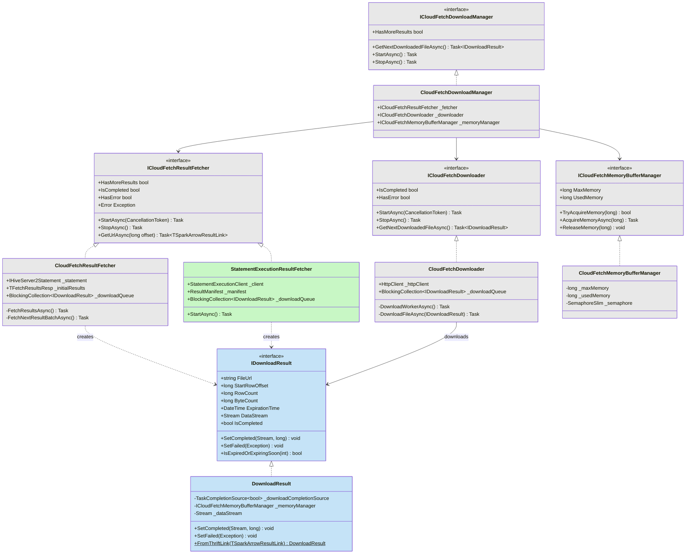

<!---
  Copyright (c) 2025 ADBC Drivers Contributors

  This file has been modified from its original version, which is
  under the Apache License:

  Licensed to the Apache Software Foundation (ASF) under one
  or more contributor license agreements.  See the NOTICE file
  distributed with this work for additional information
  regarding copyright ownership.  The ASF licenses this file
  to you under the Apache License, Version 2.0 (the
  "License"); you may not use this file except in compliance
  with the License.  You may obtain a copy of the License at

      http://www.apache.org/licenses/LICENSE-2.0

  Unless required by applicable law or agreed to in writing, software
  distributed under the License is distributed on an "AS IS" BASIS,
  WITHOUT WARRANTIES OR CONDITIONS OF ANY KIND, either express or implied.
  See the License for the specific language governing permissions and
  limitations under the License.
-->

# Databricks Statement Execution API Integration Design

## Executive Summary

This document outlines the design for adding Databricks Statement Execution API support as an alternative to the current Thrift-based protocol in the Databricks ADBC driver.

**Key Benefits**:
- **Simpler Protocol**: Standard REST/JSON vs complex Thrift binary protocol
- **Code Reuse**: Leverage existing CloudFetch pipeline with minimal refactoring
- **Backward Compatible**: Existing Thrift implementation continues to work

**Implementation Scope**:
- **New**: REST API client, statement executor, API models, readers
- **Modified**: Minimal CloudFetch interface refactoring for protocol independence
- **Reused**: Authentication, tracing, retry logic, download pipeline, memory management

## Overview

### Complete Architecture Overview


## Background

### Current Implementation (Thrift Protocol)
- Uses Apache Hive Server 2 (HS2) Thrift protocol over HTTP
- Inherits from `SparkHttpConnection` and `SparkStatement`
- Supports CloudFetch for large result sets via Thrift's `DownloadResult` capability
- Direct results for small result sets via Thrift's `GetDirectResults`
- Complex HTTP handler chain: tracing → retry → OAuth → token exchange

### Statement Execution API
- RESTful HTTP API using JSON/Arrow formats
- Endpoints:
  - **Session Management**:
    - `POST /api/2.0/sql/sessions` - Create session
    - `DELETE /api/2.0/sql/sessions/{session_id}` - Delete session
  - **Statement Execution**:
    - `POST /api/2.0/sql/statements` - Execute statement
    - `GET /api/2.0/sql/statements/{statement_id}` - Get statement status/results
    - `GET /api/2.0/sql/statements/{statement_id}/result/chunks/{chunk_index}` - Get result chunk
    - `POST /api/2.0/sql/statements/{statement_id}/cancel` - Cancel statement
    - `DELETE /api/2.0/sql/statements/{statement_id}` - Close statement

### Key Advantages of Statement Execution API
1. **Simpler Protocol**: Standard REST/JSON vs complex Thrift binary protocol
2. **Better Performance**: Optimized for large result sets with presigned S3/Azure URLs
3. **Modern Authentication**: Built for OAuth 2.0 and service principals
4. **Flexible Disposition**: INLINE (≤25 MiB), EXTERNAL_LINKS (≤100 GiB), or INLINE_OR_EXTERNAL_LINKS (hybrid)
5. **Session Support**: Explicit session management with session-level configuration

## Design Goals

1. **Backward Compatibility**: Existing Thrift-based code continues to work
2. **Configuration-Driven**: Users choose protocol via connection parameters
3. **Code Reuse**: Leverage existing CloudFetch prefetch pipeline for EXTERNAL_LINKS
4. **Minimal Duplication**: Share authentication, tracing, retry logic
5. **ADBC Compliance**: Maintain full ADBC API compatibility

## Architecture

### High-Level Components


**Color Coding Legend:**

| Color | Meaning | Examples |
|-------|---------|----------|
| 🟩 **Green** `#c8f7c5` | New classes/interfaces to be implemented | `StatementExecutionClient`, `StatementExecutionStatement`, `StatementExecutionResultFetcher`, All REST API models |
| 🔵 **Blue** `#c5e3f7` | Modified classes/interfaces (refactored) | `IDownloadResult`, `DownloadResult` |
| ⬜ **Gray** `#e8e8e8` | Existing classes/interfaces (reused as-is) | `CloudFetchDownloader`, `CloudFetchDownloadManager`, `ICloudFetchDownloader` |
| 🟥 **Red** `#f7c5c5` | Deprecated/removed (before state) | `IDownloadResult_Before` with `TSparkArrowResultLink` |

### Class Diagram: Core Components (Connection & Statement Layer)


### Class Diagram: REST API Models (Request/Response Layer)



### Class Diagram: REST API Models


### Class Diagram: Reader Components


### Class Diagram: Refactoring IDownloadResult

This diagram shows the before and after state of the `IDownloadResult` interface refactoring:

```mermaid
classDiagram
    class IDownloadResult_Before {
        <<interface - BEFORE>>
        +TSparkArrowResultLink Link ❌
        +Stream DataStream
        +long Size
        +bool IsCompleted
        +UpdateWithRefreshedLink(TSparkArrowResultLink) ❌
    }

    class IDownloadResult_After {
        <<interface - AFTER>>
        +string FileUrl ✅
        +long StartRowOffset ✅
        +long RowCount ✅
        +long ByteCount ✅
        +DateTime ExpirationTime ✅
        +Stream DataStream
        +long Size
        +bool IsCompleted
        +UpdateWithRefreshedLink(string, DateTime) ✅
    }

    class DownloadResult_After {
        -string _fileUrl
        -long _startRowOffset
        -long _rowCount
        -long _byteCount
        -DateTime _expirationTime
        +FromThriftLink(TSparkArrowResultLink)$ ✅
        +DownloadResult(fileUrl, startRowOffset, ...)
    }

    IDownloadResult_After <|.. DownloadResult_After

    note for IDownloadResult_Before "Thrift-specific\nTightly coupled to TSparkArrowResultLink"
    note for IDownloadResult_After "Protocol-agnostic\nWorks with both Thrift and REST"
    note for DownloadResult_After "Factory method for backward compatibility\nwith existing Thrift code"

    %% Styling: Red for old (removed), Blue for modified
    style IDownloadResult_Before fill:#f7c5c5
    style IDownloadResult_After fill:#c5e3f7
    style DownloadResult_After fill:#c5e3f7
```



### Component Design

#### 1. **New Configuration Parameters**

```csharp
// In DatabricksParameters.cs

/// <summary>
/// The protocol to use for statement execution.
/// Supported values:
/// - "thrift": Use Thrift/HiveServer2 protocol (default)
/// - "rest": Use Statement Execution REST API
/// </summary>
public const string Protocol = "adbc.databricks.protocol";

/// <summary>
/// Result disposition for Statement Execution API.
/// Supported values:
/// - "inline": Results returned directly in response (≤25 MiB)
/// - "external_links": Results via presigned URLs (≤100 GiB)
/// - "inline_or_external_links": Hybrid mode - server decides based on size (default, recommended)
/// </summary>
public const string ResultDisposition = "adbc.databricks.rest.result_disposition";

/// <summary>
/// Result format for Statement Execution API.
/// Supported values:
/// - "arrow_stream": Apache Arrow IPC format (default, recommended)
/// - "json_array": JSON array format
/// - "csv": CSV format
/// </summary>
public const string ResultFormat = "adbc.databricks.rest.result_format";

/// <summary>
/// Result compression codec for Statement Execution API.
/// Supported values:
/// - "lz4": LZ4 compression (default for external_links)
/// - "gzip": GZIP compression
/// - "none": No compression (default for inline)
/// </summary>
public const string ResultCompression = "adbc.databricks.rest.result_compression";

/// <summary>
/// Wait timeout for statement execution in seconds.
/// - 0: Async mode, return immediately
/// - 5-50: Sync mode up to timeout
/// Default: 10 seconds
/// Note: When enable_direct_results=true, this parameter is not set (server waits until complete)
/// </summary>
public const string WaitTimeout = "adbc.databricks.rest.wait_timeout";

/// <summary>
/// Enable direct results mode for Statement Execution API.
/// When true, server waits until query completes before returning (no polling needed).
/// When false, may need to poll for completion based on wait_timeout.
/// Default: false
/// </summary>
public const string EnableDirectResults = "adbc.databricks.enable_direct_results";

/// <summary>
/// Statement polling interval in milliseconds for async execution.
/// Default: 1000ms (1 second)
/// </summary>
public const string PollingInterval = "adbc.databricks.rest.polling_interval_ms";

/// <summary>
/// Enable session management for Statement Execution API.
/// When true, creates and reuses session across statements in a connection.
/// When false, each statement executes without session context.
/// Default: true
/// </summary>
public const string EnableSessionManagement = "adbc.databricks.enable_session_management";
```

#### 2. **StatementExecutionClient** (New)

Handles REST API communication:

```csharp
internal class StatementExecutionClient
{
    private readonly HttpClient _httpClient;
    private readonly string _baseUrl;

    // Session Management
    Task<CreateSessionResponse> CreateSessionAsync(CreateSessionRequest request, ...);
    Task DeleteSessionAsync(string sessionId, ...);

    // Statement Execution
    Task<ExecuteStatementResponse> ExecuteStatementAsync(ExecuteStatementRequest request, ...);
    Task<GetStatementResponse> GetStatementAsync(string statementId, ...);
    Task<ResultData> GetResultChunkAsync(string statementId, long chunkIndex, ...);
    Task CancelStatementAsync(string statementId, ...);
    Task CloseStatementAsync(string statementId, ...);
}
```

**Key API Endpoints:**
- `POST /api/2.0/sql/sessions` - Create session
- `POST /api/2.0/sql/statements` - Execute statement
- `GET /api/2.0/sql/statements/{id}` - Get status/results
- `GET /api/2.0/sql/statements/{id}/result/chunks/{index}` - Get chunk (incremental fetching)

**Key Models:**

```csharp
// Session Management Models

public class CreateSessionRequest
{
    [JsonPropertyName("warehouse_id")]
    public string WarehouseId { get; set; }

    [JsonPropertyName("catalog")]
    public string? Catalog { get; set; }

    [JsonPropertyName("schema")]
    public string? Schema { get; set; }

    [JsonPropertyName("session_confs")]
    public Dictionary<string, string>? SessionConfigs { get; set; }
}

public class CreateSessionResponse
{
    [JsonPropertyName("session_id")]
    public string SessionId { get; set; }
}

// Statement Execution Models

public class ExecuteStatementRequest
{
    [JsonPropertyName("warehouse_id")]
    public string? WarehouseId { get; set; }

    [JsonPropertyName("session_id")]
    public string? SessionId { get; set; }

    [JsonPropertyName("statement")]
    public string Statement { get; set; }

    [JsonPropertyName("catalog")]
    public string? Catalog { get; set; }

    [JsonPropertyName("schema")]
    public string? Schema { get; set; }

    [JsonPropertyName("parameters")]
    public List<StatementParameter>? Parameters { get; set; }

    [JsonPropertyName("disposition")]
    public string Disposition { get; set; } // "inline", "external_links", or "inline_or_external_links"

    [JsonPropertyName("format")]
    public string Format { get; set; } // "arrow_stream", "json_array", "csv"

    [JsonPropertyName("result_compression")]
    public string? ResultCompression { get; set; } // "lz4", "gzip", "none"

    [JsonPropertyName("wait_timeout")]
    public string? WaitTimeout { get; set; } // "10s" - omit for direct results mode

    [JsonPropertyName("on_wait_timeout")]
    public string? OnWaitTimeout { get; set; } // "CONTINUE" or "CANCEL"

    [JsonPropertyName("row_limit")]
    public long? RowLimit { get; set; }

    [JsonPropertyName("byte_limit")]
    public long? ByteLimit { get; set; }
}

public class ExecuteStatementResponse
{
    [JsonPropertyName("statement_id")]
    public string StatementId { get; set; }

    [JsonPropertyName("status")]
    public StatementStatus Status { get; set; }

    [JsonPropertyName("manifest")]
    public ResultManifest? Manifest { get; set; }

    [JsonPropertyName("result")]
    public StatementResult? Result { get; set; }
}

public class StatementStatus
{
    [JsonPropertyName("state")]
    public string State { get; set; } // "PENDING", "RUNNING", "SUCCEEDED", "FAILED", "CANCELED"

    [JsonPropertyName("error")]
    public StatementError? Error { get; set; }
}

public class ResultManifest
{
    [JsonPropertyName("format")]
    public string Format { get; set; }

    [JsonPropertyName("schema")]
    public ResultSchema Schema { get; set; }

    [JsonPropertyName("total_chunk_count")]
    public int TotalChunkCount { get; set; }

    [JsonPropertyName("chunks")]
    public List<ResultChunk>? Chunks { get; set; }

    [JsonPropertyName("total_row_count")]
    public long TotalRowCount { get; set; }

    [JsonPropertyName("total_byte_count")]
    public long TotalByteCount { get; set; }

    [JsonPropertyName("result_compression")]
    public string? ResultCompression { get; set; } // "lz4", "gzip", "none"

    [JsonPropertyName("truncated")]
    public bool? Truncated { get; set; } // true if results were truncated by row_limit or byte_limit

    [JsonPropertyName("is_volume_operation")]
    public bool? IsVolumeOperation { get; set; } // true for Unity Catalog Volume operations
}

public class ResultChunk
{
    [JsonPropertyName("chunk_index")]
    public int ChunkIndex { get; set; }

    [JsonPropertyName("row_count")]
    public long RowCount { get; set; }

    [JsonPropertyName("row_offset")]
    public long RowOffset { get; set; }

    [JsonPropertyName("byte_count")]
    public long ByteCount { get; set; }

    // For EXTERNAL_LINKS disposition
    [JsonPropertyName("external_links")]
    public List<ExternalLink>? ExternalLinks { get; set; }

    // For INLINE disposition
    [JsonPropertyName("data_array")]
    public List<List<object>>? DataArray { get; set; }

    // Binary attachment (for special result types)
    [JsonPropertyName("attachment")]
    public byte[]? Attachment { get; set; }

    // Next chunk navigation
    [JsonPropertyName("next_chunk_index")]
    public long? NextChunkIndex { get; set; }

    [JsonPropertyName("next_chunk_internal_link")]
    public string? NextChunkInternalLink { get; set; }
}

public class ExternalLink
{
    [JsonPropertyName("external_link")]
    public string ExternalLinkUrl { get; set; }

    [JsonPropertyName("expiration")]
    public string Expiration { get; set; } // ISO 8601 timestamp

    [JsonPropertyName("chunk_index")]
    public long ChunkIndex { get; set; }

    [JsonPropertyName("row_count")]
    public long RowCount { get; set; }

    [JsonPropertyName("row_offset")]
    public long RowOffset { get; set; }

    [JsonPropertyName("byte_count")]
    public long ByteCount { get; set; }

    [JsonPropertyName("http_headers")]
    public Dictionary<string, string>? HttpHeaders { get; set; } // Required for some cloud storage auth

    [JsonPropertyName("next_chunk_index")]
    public long? NextChunkIndex { get; set; }

    [JsonPropertyName("next_chunk_internal_link")]
    public string? NextChunkInternalLink { get; set; }
}

public class ResultSchema
{
    [JsonPropertyName("column_count")]
    public long? ColumnCount { get; set; }

    [JsonPropertyName("columns")]
    public List<ColumnInfo>? Columns { get; set; }
}

public class ColumnInfo
{
    [JsonPropertyName("name")]
    public string? Name { get; set; }

    [JsonPropertyName("position")]
    public long? Position { get; set; }

    [JsonPropertyName("type_interval_type")]
    public string? TypeIntervalType { get; set; }

    [JsonPropertyName("type_name")]
    public string? TypeName { get; set; }

    [JsonPropertyName("type_precision")]
    public long? TypePrecision { get; set; }

    [JsonPropertyName("type_scale")]
    public long? TypeScale { get; set; }

    [JsonPropertyName("type_text")]
    public string? TypeText { get; set; }
}

public class ServiceError
{
    [JsonPropertyName("error_code")]
    public string? ErrorCode { get; set; }

    [JsonPropertyName("message")]
    public string? Message { get; set; }
}

public class ResultData
{
    [JsonPropertyName("byte_count")]
    public long? ByteCount { get; set; }

    [JsonPropertyName("chunk_index")]
    public long? ChunkIndex { get; set; }

    [JsonPropertyName("data_array")]
    public List<List<string>>? DataArray { get; set; }

    [JsonPropertyName("external_links")]
    public List<ExternalLink>? ExternalLinks { get; set; }

    [JsonPropertyName("next_chunk_index")]
    public long? NextChunkIndex { get; set; }

    [JsonPropertyName("next_chunk_internal_link")]
    public string? NextChunkInternalLink { get; set; }

    [JsonPropertyName("row_count")]
    public long? RowCount { get; set; }

    [JsonPropertyName("row_offset")]
    public long? RowOffset { get; set; }

    [JsonPropertyName("attachment")]
    public byte[]? Attachment { get; set; }
}

public class GetStatementResponse
{
    [JsonPropertyName("manifest")]
    public ResultManifest? Manifest { get; set; }

    [JsonPropertyName("result")]
    public ResultData? Result { get; set; }

    [JsonPropertyName("statement_id")]
    public string StatementId { get; set; }

    [JsonPropertyName("status")]
    public StatementStatus Status { get; set; }
}
```

**Note on Model Definitions**: The above model definitions for `ResultSchema`, `ColumnInfo`, `ServiceError`, `ResultData`, and `GetStatementResponse` are based on the Databricks JDBC driver implementation and match the actual Statement Execution API response structure.

#### 3. **StatementExecutionConnection** (New)

Manages connections using Statement Execution API:

```csharp
internal class StatementExecutionConnection : AdbcConnection
{
    private readonly StatementExecutionClient _client;
    private readonly DatabricksConfiguration _config;
    private readonly string _warehouseId;
    private string? _sessionId;
    private bool _enableSessionManagement;

    public StatementExecutionConnection(IReadOnlyDictionary<string, string> properties)
    {
        // Parse properties
        _warehouseId = ParseWarehouseId(properties);
        _enableSessionManagement = ParseEnableSessionManagement(properties); // default: true

        // Create HttpClient with existing handler chain (auth, retry, tracing)
        _client = new StatementExecutionClient(_httpClient, baseUrl);

        // Create session if enabled
        if (_enableSessionManagement)
        {
            var sessionRequest = new CreateSessionRequest
            {
                WarehouseId = _warehouseId,
                Catalog = properties.GetValueOrDefault(DatabricksParameters.Catalog),
                Schema = properties.GetValueOrDefault(DatabricksParameters.Schema),
                SessionConfigs = ParseSessionConfigs(properties)
            };

            var sessionResponse = _client.CreateSessionAsync(sessionRequest, CancellationToken.None)
                .GetAwaiter().GetResult();
            _sessionId = sessionResponse.SessionId;
        }
    }

    public override AdbcStatement CreateStatement()
    {
        return new StatementExecutionStatement(this, _client, _sessionId);
    }

    public override void Dispose()
    {
        // Delete session if it was created
        if (_enableSessionManagement && _sessionId != null)
        {
            try
            {
                _client.DeleteSessionAsync(_sessionId, CancellationToken.None)
                    .GetAwaiter().GetResult();
            }
            catch (Exception ex)
            {
                // Log but don't throw on cleanup
                Logger.Warn($"Failed to delete session {_sessionId}: {ex.Message}");
            }
        }

        base.Dispose();
    }

    // ADBC metadata methods implemented via SQL queries
    // See detailed implementation in "Metadata Implementation via SQL" section below
}
```

#### 4. **StatementExecutionStatement** (New)

Executes queries via Statement Execution API:

```csharp
internal class StatementExecutionStatement : AdbcStatement
{
    private readonly StatementExecutionConnection _connection;
    private readonly StatementExecutionClient _client;
    private readonly string? _sessionId;
    private string? _statementId;
    private ExecuteStatementResponse? _response;

    protected override async Task<QueryResult> ExecuteQueryInternalAsync(
        CancellationToken cancellationToken)
    {
        // Build ExecuteStatementRequest
        var request = new ExecuteStatementRequest
        {
            Statement = SqlQuery,
            Disposition = _connection.ResultDisposition, // "inline", "external_links", or "inline_or_external_links"
            Format = _connection.ResultFormat,
            Parameters = ConvertParameters()
        };

        // Set warehouse_id or session_id (mutually exclusive)
        if (_sessionId != null)
        {
            request.SessionId = _sessionId;
        }
        else
        {
            request.WarehouseId = _connection.WarehouseId;
            request.Catalog = CatalogName;
            request.Schema = SchemaName;
        }

        // Set compression (skip for inline results)
        if (request.Disposition != "inline")
        {
            request.ResultCompression = _connection.ResultCompression ?? "lz4";
        }

        // Set wait_timeout (skip if direct results mode is enabled)
        if (!_connection.EnableDirectResults)
        {
            request.WaitTimeout = _connection.WaitTimeout ?? "10s";
            request.OnWaitTimeout = "CONTINUE";
        }

        // Set row/byte limits
        if (MaxRows > 0)
        {
            request.RowLimit = MaxRows;
        }
        if (_connection.ByteLimit > 0)
        {
            request.ByteLimit = _connection.ByteLimit;
        }

        // Execute statement
        _response = await _client.ExecuteStatementAsync(request, cancellationToken);
        _statementId = _response.StatementId;

        // Poll until completion if async
        if (_response.Status.State == "PENDING" || _response.Status.State == "RUNNING")
        {
            _response = await PollUntilCompleteAsync(cancellationToken);
        }

        // Handle errors
        if (_response.Status.State == "FAILED")
        {
            throw new DatabricksException(
                _response.Status.Error.Message,
                _response.Status.Error.SqlState);
        }

        // Check if results were truncated
        if (_response.Manifest?.Truncated == true)
        {
            Logger.Warn($"Results truncated by row_limit or byte_limit for statement {_statementId}");
        }

        // Create reader based on actual disposition in response
        IArrowArrayStream reader = CreateReader(_response);

        return new QueryResult(
            _response.Manifest.TotalRowCount,
            reader);
    }

    private async Task<ExecuteStatementResponse> PollUntilCompleteAsync(
        CancellationToken cancellationToken)
    {
        int pollCount = 0;

        while (true)
        {
            // First poll happens immediately (no delay)
            if (pollCount > 0)
            {
                await Task.Delay(_connection.PollingInterval, cancellationToken);
            }

            // Check timeout
            if (QueryTimeout > 0 && pollCount * _connection.PollingInterval > QueryTimeout * 1000)
            {
                await _client.CancelStatementAsync(_statementId, cancellationToken);
                throw new DatabricksTimeoutException(
                    $"Query timeout exceeded ({QueryTimeout}s) for statement {_statementId}");
            }

            var status = await _client.GetStatementAsync(_statementId, cancellationToken);

            if (status.Status.State == "SUCCEEDED" ||
                status.Status.State == "FAILED" ||
                status.Status.State == "CANCELED" ||
                status.Status.State == "CLOSED")
            {
                return status;
            }

            pollCount++;
        }
    }

    private IArrowArrayStream CreateReader(ExecuteStatementResponse response)
    {
        // Determine actual disposition from response
        var hasExternalLinks = response.Manifest?.Chunks?
            .Any(c => c.ExternalLinks != null && c.ExternalLinks.Any()) == true;
        var hasInlineData = response.Manifest?.Chunks?
            .Any(c => c.DataArray != null) == true;

        if (hasExternalLinks)
        {
            // External links - use CloudFetch pipeline
            return CreateExternalLinksReader(response);
        }
        else if (hasInlineData)
        {
            // Inline data - parse directly
            return CreateInlineReader(response);
        }
        else
        {
            // Empty result set
            return new EmptyArrowArrayStream(response.Manifest.Schema);
        }
    }

    public override void Dispose()
    {
        // Close statement if it was created
        if (_statementId != null)
        {
            try
            {
                _client.CloseStatementAsync(_statementId, CancellationToken.None)
                    .GetAwaiter().GetResult();
            }
            catch (Exception ex)
            {
                // Log but don't throw on cleanup
                Logger.Warn($"Failed to close statement {_statementId}: {ex.Message}");
            }
        }

        base.Dispose();
    }
}
```

#### 5. **CloudFetchReader** (Reuse Existing!)

**Key Insight**: The existing `CloudFetchReader` is already protocol-agnostic! It just needs:
- `ICloudFetchDownloadManager` - works with any fetcher
- Compression codec - both protocols support this
- Schema - both protocols provide this

**No new reader needed!** Both Thrift and REST can use the same reader:

```csharp
// Existing CloudFetchReader works for BOTH protocols
internal class CloudFetchReader : IArrowArrayStream
{
    private readonly ICloudFetchDownloadManager _downloadManager;
    private readonly string? _compressionCodec;

    // Works for both Thrift and REST!
    public async ValueTask<RecordBatch?> ReadNextRecordBatchAsync(...)
    {
        var downloadResult = await _downloadManager.GetNextDownloadedFileAsync(...);

        // Decompress if needed (LZ4/GZIP)
        Stream stream = Decompress(downloadResult.DataStream, _compressionCodec);

        // Parse Arrow IPC
        using var reader = new ArrowStreamReader(stream);
        return await reader.ReadNextRecordBatchAsync(...);
    }
}
```

**Usage for REST**:
```csharp
// In StatementExecutionStatement.CreateReader()
var fetcher = new StatementExecutionResultFetcher(...); // REST-specific
var downloadManager = new CloudFetchDownloadManager(fetcher, ...); // Reuse
var reader = new CloudFetchReader(downloadManager, compressionCodec, schema); // Reuse!
```

**Usage for Thrift** (existing):
```csharp
var fetcher = new CloudFetchResultFetcher(...); // Thrift-specific
var downloadManager = new CloudFetchDownloadManager(fetcher, ...); // Reuse
var reader = new CloudFetchReader(downloadManager, compressionCodec, schema); // Reuse!
```

#### 6. **StatementExecutionResultFetcher** (New)

Implements `ICloudFetchResultFetcher` for Statement Execution API:

```csharp
internal class StatementExecutionResultFetcher : ICloudFetchResultFetcher
{
    private readonly StatementExecutionClient _client;
    private readonly string _statementId;
    private readonly ResultManifest _manifest;
    private readonly BlockingCollection<IDownloadResult> _downloadQueue;
    private readonly ICloudFetchMemoryBufferManager _memoryManager;
    private bool _isCompleted;
    private Exception? _error;

    public StatementExecutionResultFetcher(
        StatementExecutionClient client,
        string statementId,
        ResultManifest manifest,
        BlockingCollection<IDownloadResult> downloadQueue,
        ICloudFetchMemoryBufferManager memoryManager)
    {
        _client = client;
        _statementId = statementId;
        _manifest = manifest;
        _downloadQueue = downloadQueue;
        _memoryManager = memoryManager;
    }

    public async Task StartAsync(CancellationToken cancellationToken)
    {
        try
        {
            // Process all chunks
            foreach (var chunk in _manifest.Chunks)
            {
                // If chunk has external links in manifest, use them
                if (chunk.ExternalLinks != null && chunk.ExternalLinks.Any())
                {
                    foreach (var link in chunk.ExternalLinks)
                    {
                        await AddDownloadResultAsync(link, cancellationToken);
                    }
                }
                else
                {
                    // Incremental chunk fetching: fetch external links for this chunk
                    // This handles cases where manifest doesn't contain all links upfront
                    var resultData = await _client.GetResultChunkAsync(
                        _statementId,
                        chunk.ChunkIndex,
                        cancellationToken);

                    if (resultData.ExternalLinks != null)
                    {
                        foreach (var link in resultData.ExternalLinks)
                        {
                            await AddDownloadResultAsync(link, cancellationToken);
                        }
                    }
                }
            }

            // Add end of results guard
            _downloadQueue.Add(EndOfResultsGuard.Instance, cancellationToken);
            _isCompleted = true;
        }
        catch (Exception ex)
        {
            _error = ex;
            _isCompleted = true;
            _downloadQueue.TryAdd(EndOfResultsGuard.Instance, 0);
        }
    }

    private async Task AddDownloadResultAsync(
        ExternalLink link,
        CancellationToken cancellationToken)
    {
        // Create download result from REST API link
        var downloadResult = new DownloadResult(
            fileUrl: link.ExternalLink,
            startRowOffset: link.RowOffset,
            rowCount: link.RowCount,
            byteCount: link.ByteCount,
            expirationTime: DateTime.Parse(link.Expiration),
            httpHeaders: link.HttpHeaders, // Pass custom headers if present
            memoryManager: _memoryManager);

        _downloadQueue.Add(downloadResult, cancellationToken);
    }

    public Task StopAsync() => Task.CompletedTask;

    public bool HasMoreResults => false; // All links available from manifest
    public bool IsCompleted => _isCompleted;
    public bool HasError => _error != null;
    public Exception? Error => _error;

    // URL refresh not needed for REST (presigned URLs are long-lived)
    public Task<TSparkArrowResultLink?> GetUrlAsync(long offset, CancellationToken cancellationToken)
    {
        throw new NotSupportedException("URL refresh not supported for Statement Execution API");
    }
}
```

### Protocol Selection Logic

```csharp
// In DatabricksConnection constructor

if (properties.TryGetValue(DatabricksParameters.Protocol, out string? protocol))
{
    switch (protocol.ToLowerInvariant())
    {
        case "thrift":
            // Use existing Thrift-based implementation
            _implementation = new ThriftConnectionImpl(this, properties);
            break;

        case "rest":
            // Use new Statement Execution API implementation
            _implementation = new StatementExecutionConnectionImpl(this, properties);
            break;

        default:
            throw new ArgumentException(
                $"Unsupported protocol: {protocol}. " +
                $"Supported values: 'thrift', 'rest'");
    }
}
else
{
    // Default to Thrift for backward compatibility
    _implementation = new ThriftConnectionImpl(this, properties);
}
```

## Metadata Implementation via SQL

Since we're using the Statement Execution API (which doesn't have dedicated metadata Thrift calls), we implement ADBC metadata operations using SQL SHOW commands. This approach leverages Databricks SQL capabilities and Unity Catalog metadata.

### Metadata Query Flow


### Metadata Query Mapping

**Implemented SQL Commands:**

| ADBC Method | SQL Command | Pattern Support | Notes |
|-------------|-------------|-----------------|-------|
| `GetObjects()` (catalogs) | `SHOW CATALOGS [LIKE 'pattern']` | ✅ | Uses ADBC pattern → Databricks glob |
| `GetObjects()` (schemas) | `SHOW SCHEMAS IN {catalog \| ALL CATALOGS} [LIKE 'pattern']` | ✅ | NULL catalog → IN ALL CATALOGS |
| `GetObjects()` (tables) | `SHOW TABLES IN CATALOG catalog [SCHEMA LIKE 'pattern'] [LIKE 'pattern']` | ✅ | Schema and table patterns |
| `GetObjects()` (columns) | `SHOW COLUMNS IN CATALOG catalog [SCHEMA LIKE 'pattern'] [TABLE LIKE 'pattern'] [LIKE 'pattern']` | ✅ | Full pattern support |
| `GetTableTypes()` | Static list: `TABLE`, `VIEW`, `LOCAL TEMPORARY` | N/A | No query needed |
| `GetTableSchema()` | `SHOW COLUMNS IN CATALOG catalog SCHEMA LIKE 'schema' TABLE LIKE 'table'` | ✅ | More accurate nullable info than DESCRIBE |
| `GetPrimaryKeys()` | `SHOW KEYS IN CATALOG catalog IN SCHEMA schema IN TABLE table` | ❌ | Exact identifiers only |
| `GetImportedKeys()` | `SHOW FOREIGN KEYS IN CATALOG catalog IN SCHEMA schema IN TABLE table` | ❌ | Exact identifiers only |
| `GetColumnsExtended()` | `DESC TABLE EXTENDED catalog.schema.table AS JSON` | ❌ | JSON parsing for PK/FK info |

**Key Implementation Components:**
- `SqlCommandBuilder` - Fluent API for building metadata queries
- `MetadataUtilities` - Pattern conversion (ADBC `%_` → Databricks glob) and identifier quoting
- `DatabricksTypeMapper` - Maps Databricks types to XDBC types for column metadata

### Implementation Details

The actual implementation uses a two-level approach:
1. **Core metadata methods** - Execute SQL queries and return ADBC-formatted Arrow streams
2. **Flat metadata methods** - Transform ADBC schemas to Thrift/JDBC-compatible schemas for statement-based queries

#### 1. **SQL Command Builder Usage**

```csharp
// Pattern-based queries (SHOW CATALOGS/SCHEMAS/TABLES/COLUMNS)
var commandBuilder = new SqlCommandBuilder()
    .WithCatalog(catalog)
    .WithSchemaPattern(schemaPattern)
    .WithTablePattern(tablePattern)
    .WithColumnPattern(columnPattern);

string sql = commandBuilder.BuildShowColumns(catalog);
// Output: SHOW COLUMNS IN CATALOG `main` SCHEMA LIKE 'default%' TABLE LIKE 'sales%' LIKE 'amount%'

// Exact-identifier queries (SHOW KEYS/FOREIGN KEYS)
var commandBuilder = new SqlCommandBuilder()
    .WithCatalog("main")
    .WithSchema("default")
    .WithTable("orders");

string sql = commandBuilder.BuildShowPrimaryKeys();
// Output: SHOW KEYS IN CATALOG `main` IN SCHEMA `default` IN TABLE `orders`
```

#### 2. **GetObjects Implementation - Minimal Network Calls**

The GetObjects implementation is optimized to make **minimal network calls** by leveraging server-side pattern matching:

**Network Calls by Depth:**

| Depth | Network Calls | SQL Commands Executed |
|-------|---------------|----------------------|
| **Catalogs** | **1** | `SHOW CATALOGS [LIKE 'pattern']` |
| **DbSchemas** | **2** | 1. `SHOW CATALOGS [LIKE 'pattern']`<br>2. `SHOW SCHEMAS IN ALL CATALOGS [LIKE 'pattern']` |
| **Tables** | **3** | 1. `SHOW CATALOGS [LIKE 'pattern']`<br>2. `SHOW SCHEMAS IN ALL CATALOGS [LIKE 'pattern']`<br>3. `SHOW TABLES IN CATALOG catalog [SCHEMA LIKE 'pattern'] [LIKE 'pattern']` |
| **All** | **4** | 1. `SHOW CATALOGS [LIKE 'pattern']`<br>2. `SHOW SCHEMAS IN ALL CATALOGS [LIKE 'pattern']`<br>3. `SHOW TABLES IN CATALOG catalog [SCHEMA LIKE 'pattern'] [LIKE 'pattern']`<br>4. `SHOW COLUMNS IN CATALOG catalog [SCHEMA/TABLE/COLUMN patterns]` |

> **Key insight**: Maximum 4 network calls regardless of result size (whether 10 or 10,000 tables)

**Key Optimizations:**

1. **Server-side filtering**: Patterns are sent to the server, which filters results efficiently
   ```csharp
   // Instead of fetching all columns and filtering client-side:
   // ❌ Bad: Fetch all columns → Filter 10,000 columns in client

   // ✅ Good: Let server filter with LIKE patterns
   SHOW COLUMNS IN CATALOG `main` SCHEMA LIKE 'analytics%' TABLE LIKE 'fact_%' LIKE 'created_%'
   // Server returns only matching columns (e.g., 50 columns)
   ```

2. **Single query per level**: Uses `IN ALL CATALOGS` to fetch all schemas in one query
   ```csharp
   // Instead of N queries for N catalogs:
   // ❌ Bad: SHOW SCHEMAS IN `catalog1`
   //        SHOW SCHEMAS IN `catalog2`
   //        ... (N network calls)

   // ✅ Good: SHOW SCHEMAS IN ALL CATALOGS LIKE 'prod_%'
   // (1 network call, server returns schemas with catalog info)
   ```

3. **Unified result assembly**: Parse all results once, build hierarchy in-memory
   ```csharp
   var catalogMap = new Dictionary<string, Dictionary<string, Dictionary<string, (string, List<ColumnInfo>)>>>();

   // 1. Fetch all catalogs → Add to catalogMap
   // 2. Fetch all schemas → Merge into catalogMap by catalog
   // 3. Fetch all tables → Merge into catalogMap by catalog.schema
   // 4. Fetch all columns → Merge into catalogMap by catalog.schema.table

   // Then build nested Arrow structure from catalogMap
   ```

4. **Early exit for shallow depths**: Only fetch what's needed
   ```csharp
   if (depth == GetObjectsDepth.Catalogs)
   {
       // Only 1 query: SHOW CATALOGS
       // Skip schemas, tables, columns
   }
   ```

**Performance Comparison:**

| Scenario | Network Calls (Old Thrift Approach) | Network Calls (SEA Optimized) |
|----------|--------------------------------------|-------------------------------|
| Get 3 catalogs | 1 call | 1 call |
| Get schemas in 3 catalogs | 3 calls | **1 call** (IN ALL CATALOGS) |
| Get tables in 10 schemas | 10 calls | **1 call** (with patterns) |
| Get columns for 100 tables | 100 calls | **1 call** (with patterns) |
| **GetObjects(All) total** | **114 calls** | **4 calls** |

#### 3. **Pattern Conversion**

ADBC patterns use SQL LIKE syntax (`%` = any sequence, `_` = single char) which is converted to Databricks glob patterns:

```csharp
// MetadataUtilities.ConvertAdbcPatternToDatabricksGlob()
"sales%" → "sales*"     // Prefix match
"%sales" → "*sales"     // Suffix match
"sales_2024" → "sales?2024"  // Single char wildcard
"test\\_table" → "test_table"  // Escaped underscore (literal)
```

#### 4. **Type Mapping**

Column types are mapped using `DatabricksTypeMapper`:

```csharp
// Example type mappings (from actual implementation)
"INT" → XDBC type 4 (SQL_INTEGER)
"BIGINT" → XDBC type -5 (SQL_BIGINT)
"DECIMAL(10,2)" → XDBC type 3 (SQL_DECIMAL), precision 10, scale 2
"STRING" → XDBC type 12 (SQL_VARCHAR)
"TIMESTAMP" → XDBC type 93 (SQL_TYPE_TIMESTAMP)
"ARRAY<INT>" → XDBC type 2003 (SQL_ARRAY)
"STRUCT<f1: INT, f2: STRING>" → XDBC type 2002 (SQL_STRUCT)
```

#### 5. **Dual Schema Support**

Each metadata method has two implementations:
- **Core method** (`GetColumnsMetadataAsync`) - Returns ADBC schema (lowercase field names, 17 columns)
- **Flat method** (`GetColumnsFlat`) - Returns Thrift/JDBC schema (uppercase field names, 24 columns)

```csharp
// ADBC schema (17 columns, lowercase)
catalog_name, db_schema_name, table_name, column_name, type_name,
ordinal_position, is_nullable, remarks, xdbc_data_type, xdbc_type_name,
xdbc_column_size, xdbc_decimal_digits, xdbc_num_prec_radix, xdbc_buffer_length,
xdbc_char_octet_length, xdbc_sql_data_type, xdbc_datetime_sub

// Thrift/JDBC schema (24 columns, uppercase)
TABLE_CAT, TABLE_SCHEM, TABLE_NAME, COLUMN_NAME, DATA_TYPE, TYPE_NAME,
COLUMN_SIZE, BUFFER_LENGTH, DECIMAL_DIGITS, NUM_PREC_RADIX, NULLABLE, REMARKS,
COLUMN_DEF, SQL_DATA_TYPE, SQL_DATETIME_SUB, CHAR_OCTET_LENGTH, ORDINAL_POSITION,
IS_NULLABLE, SCOPE_CATALOG, SCOPE_SCHEMA, SCOPE_TABLE, SOURCE_DATA_TYPE,
IS_AUTO_INCREMENT, BASE_TYPE_NAME
```

#### 6. **Constraint Metadata**

**Primary Keys:**
```csharp
// GetPrimaryKeysAsync uses SqlCommandBuilder
var commandBuilder = new SqlCommandBuilder()
    .WithCatalog(catalog)
    .WithSchema(dbSchema)
    .WithTable(tableName);
string sql = commandBuilder.BuildShowPrimaryKeys();
// Generates: SHOW KEYS IN CATALOG `main` IN SCHEMA `default` IN TABLE `orders`

// Returns ADBC schema: catalog_name, db_schema_name, table_name, column_name, key_sequence, constraint_name
// GetPrimaryKeysFlat() transforms to Thrift schema: TABLE_CAT, TABLE_SCHEM, TABLE_NAME, COLUMN_NAME, KEY_SEQ, PK_NAME
```

**Foreign Keys:**
```csharp
// GetImportedKeysAsync uses SqlCommandBuilder
var commandBuilder = new SqlCommandBuilder()
    .WithCatalog(catalog)
    .WithSchema(dbSchema)
    .WithTable(tableName);
string sql = commandBuilder.BuildShowForeignKeys();
// Generates: SHOW FOREIGN KEYS IN CATALOG `main` IN SCHEMA `default` IN TABLE `orders`

// Returns ADBC schema with 14 columns including pk_catalog_name, pk_db_schema_name, fk_catalog_name, etc.
// GetImportedKeys() (internal) returns same schema for Thrift protocol compatibility
```

**Extended Columns (with PK/FK annotations):**
```csharp
// GetColumnsExtendedAsync uses DESC TABLE EXTENDED
string fullTableName = MetadataUtilities.BuildQualifiedTableName(catalog, dbSchema, tableName);
string sql = $"DESC TABLE EXTENDED {fullTableName} AS JSON";

// Parses JSON result using DescTableExtendedResult class
// Merges constraint info (primaryKeys, foreignKeys) into column metadata
// Returns 24-column Thrift schema plus: is_primary_key, is_foreign_key, num_key_cols, parent_catalog, etc.
// GetColumnsExtendedFlat() provides direct access for statement-based queries
```

### Comparison: SQL vs Thrift Metadata

| Aspect | Thrift Calls | SQL SHOW Commands |
|--------|--------------|-------------------|
| **Latency** | Lower (single RPC) | Slightly higher (execute query) |
| **Flexibility** | Fixed schema | Can use WHERE, LIKE, filters |
| **Versioning** | Protocol changes | SQL is stable |
| **Result Size** | Optimized | May return more data |
| **Compatibility** | All DBR versions | Requires SQL support (all versions) |
| **Error Handling** | Thrift exceptions | SQL exceptions |

### SQL Command Reference

Databricks supports these metadata commands:

- `SHOW CATALOGS [LIKE 'pattern']`
- `SHOW SCHEMAS [IN catalog] [LIKE 'pattern']`
- `SHOW SCHEMAS`
- `SHOW TABLES [IN (CATALOG catalog | ALL CATALOGS)][SCHEMA LIKE 'schema'][LIKE 'pattern']`
- `SHOW VIEWS [IN catalog.schema] [LIKE 'pattern']`
- `SHOW COLUMNS [IN (CATALOG catalog | ALL CATALOGS)][SCHEMA LIKE 'schema'][TABLE LIKE 'table'] [LIKE 'pattern']`
- `SHOW TBLPROPERTIES table`
- `SHOW PARTITIONS table`
- `DESCRIBE TABLE [EXTENDED] table [AS JSON]`
- `DESCRIBE SCHEMA schema`
- `DESCRIBE CATALOG catalog`

## Statement Execution Flow

### REST API Execution Flow


### Comparison: Thrift vs REST Fetching Patterns


**Key Takeaways**:

| Aspect | Thrift | REST | Similarity |
|--------|--------|------|------------|
| **Fetching Pattern** | Always incremental (RPC loop) | Usually manifest, occasionally incremental | Both can fetch incrementally |
| **Knows total upfront?** | No (HasMoreRows flag only) | Yes (manifest has chunk list) | Both discover links incrementally |
| **Fetching Mechanism** | `FetchNextResultBatchAsync()` | `GetResultChunkAsync(chunkIndex)` | Different APIs, same concept |
| **Result** | TSparkArrowResultLink objects | ExternalLink objects | Protocol-specific links |
| **After Fetching** | → CloudFetch pipeline | → CloudFetch pipeline | **100% same** |
| **Download** | CloudFetchDownloader | CloudFetchDownloader | **Reused** |
| **Reader** | CloudFetchReader | CloudFetchReader | **Reused** |
| **Decompression** | LZ4 | LZ4/GZIP | **Reused** |

## CloudFetch Pipeline Reuse

**Good news!** The existing CloudFetch pipeline is ALREADY well-abstracted with interfaces and can be reused directly with minimal changes.

### Existing Interfaces (Already Implemented!)

✅ `ICloudFetchResultFetcher` - Interface for fetching result chunks
✅ `ICloudFetchDownloader` - Interface for downloading files
✅ `ICloudFetchMemoryBufferManager` - Memory management
✅ `ICloudFetchDownloadManager` - Overall pipeline management
✅ `IDownloadResult` - Represents a downloadable file

### Current Implementation (Thrift)
```
CloudFetchDownloadManager (reuse as-is)
├── CloudFetchResultFetcher (implements ICloudFetchResultFetcher - Thrift-based)
├── CloudFetchDownloader (reuse as-is - already downloads from URLs!)
├── CloudFetchMemoryBufferManager (reuse as-is)
└── DownloadResult (needs small refactor - currently uses TSparkArrowResultLink)
```

### Key Insight: `CloudFetchDownloader` Already Works!

Looking at the code, `CloudFetchDownloader` already downloads from HTTP URLs:
- Line 363: `await _httpClient.GetAsync(url, ...)`
- It doesn't care if the URL comes from Thrift or REST!
- All it needs is a URL and metadata about the file

### Minimal Refactoring Needed

**1. `DownloadResult` Refactor** (Minor)

Current: Uses `TSparkArrowResultLink` (Thrift-specific)
```csharp
internal interface IDownloadResult
{
    TSparkArrowResultLink Link { get; } // Thrift-specific!
    Stream DataStream { get; }
    long Size { get; }
    // ...
}
```

**Solution**: Make it protocol-agnostic
```csharp
internal interface IDownloadResult
{
    string FileUrl { get; } // Generic URL
    long StartRowOffset { get; }
    long RowCount { get; }
    long ByteCount { get; }
    DateTime? ExpirationTime { get; } // Nullable for REST (no expiration in presigned URLs)
    Stream DataStream { get; }
    // ...
}
```

**2. Create `StatementExecutionResultFetcher`** (New)

Implements `ICloudFetchResultFetcher` but uses Statement Execution REST API:

```csharp
internal class StatementExecutionResultFetcher : ICloudFetchResultFetcher
{
    private readonly StatementExecutionClient _client;
    private readonly string _statementId;
    private readonly ResultManifest _manifest;
    private readonly Queue<ExternalLink> _remainingLinks;

    public StatementExecutionResultFetcher(
        StatementExecutionClient client,
        string statementId,
        ResultManifest manifest)
    {
        _client = client;
        _statementId = statementId;
        _manifest = manifest;

        // Extract all external links from manifest
        _remainingLinks = new Queue<ExternalLink>(
            manifest.Chunks
                .SelectMany(c => c.ExternalLinks ?? Enumerable.Empty<ExternalLink>())
        );
    }

    public async Task StartAsync(CancellationToken cancellationToken)
    {
        // Process manifest and populate download queue
        foreach (var link in _remainingLinks)
        {
            var downloadResult = new DownloadResult(
                fileUrl: link.ExternalLinkUrl,
                startRowOffset: link.ChunkIndex * chunkRowSize, // Calculate offset
                rowCount: manifest.Chunks[link.ChunkIndex].RowCount,
                byteCount: manifest.Chunks[link.ChunkIndex].ByteCount,
                expirationTime: DateTime.Parse(link.Expiration));

            _downloadQueue.Add(downloadResult, cancellationToken);
        }

        // Mark as completed (all links already available from manifest)
        _downloadQueue.Add(EndOfResultsGuard.Instance, cancellationToken);
        _isCompleted = true;
    }

    public Task<TSparkArrowResultLink?> GetUrlAsync(long offset, CancellationToken cancellationToken)
    {
        // For REST API: URLs don't expire (presigned URLs are long-lived)
        // If needed, could call GetStatement API to get fresh manifest
        throw new NotSupportedException("URL refresh not needed for Statement Execution API");
    }
}
```

**Key Differences vs Thrift**:
- **Thrift**: Fetches result chunks incrementally via `TFetchResultsReq` RPCs - ALWAYS incremental
- **REST**: Manifest typically contains all external links upfront, but may need incremental fetching via `GetResultChunkAsync()` for very large result sets
- **Common Pattern**: Both implementations follow similar background fetching with queue management - see "Refactoring Common Fetching Logic" section below

**3. Reuse Everything Else**

✅ `CloudFetchDownloadManager` - No changes needed
✅ `CloudFetchDownloader` - No changes needed (already downloads from URLs!)
✅ `CloudFetchMemoryBufferManager` - No changes needed
✅ All prefetch logic, parallel downloads, retry logic - Reuse as-is!

### Updated Architecture

```
Statement Execution API Flow:
1. Execute statement → Get manifest with ALL external links upfront
2. Create StatementExecutionResultFetcher (populates queue immediately)
3. CloudFetchDownloadManager starts
   ├── StatementExecutionResultFetcher → Adds all links to download queue
   ├── CloudFetchDownloader (reused!) → Downloads from URLs in parallel
   ├── CloudFetchMemoryBufferManager (reused!) → Manages memory
   └── Returns DownloadResults to reader
4. StatementExecutionReader reads Arrow data from downloaded streams
```

### Comparison: Thrift vs REST

| Component | Thrift Implementation | REST Implementation | Can Reuse? |
|-----------|----------------------|---------------------|------------|
| **ResultFetcher** | Incremental Thrift RPCs | Manifest with all links | ❌ New impl |
| **Downloader** | Downloads from URLs | Downloads from URLs | ✅ Yes! |
| **MemoryManager** | Manages buffer | Manages buffer | ✅ Yes! |
| **DownloadManager** | Orchestrates pipeline | Orchestrates pipeline | ✅ Yes! |
| **URL Refresh** | Complex (expiring URLs) | Not needed (long-lived) | ✅ Simpler! |

### Work Required

#### 1. Refactor `IDownloadResult` Interface

**Current (Thrift-specific)**:
```csharp
// ICloudFetchInterfaces.cs:30-87
internal interface IDownloadResult : IDisposable
{
    TSparkArrowResultLink Link { get; } // ❌ Thrift-specific!
    Stream DataStream { get; }
    long Size { get; }
    Task DownloadCompletedTask { get; }
    bool IsCompleted { get; }
    int RefreshAttempts { get; }
    void SetCompleted(Stream dataStream, long size);
    void SetFailed(Exception exception);
    void UpdateWithRefreshedLink(TSparkArrowResultLink refreshedLink); // ❌ Thrift-specific!
    bool IsExpiredOrExpiringSoon(int expirationBufferSeconds = 60);
}
```

**Proposed (Protocol-agnostic)**:
```csharp
internal interface IDownloadResult : IDisposable
{
    // Generic properties replacing TSparkArrowResultLink
    string FileUrl { get; }
    long StartRowOffset { get; }
    long RowCount { get; }
    long ByteCount { get; }
    DateTime? ExpirationTime { get; }

    // Existing properties (keep as-is)
    Stream DataStream { get; }
    long Size { get; }
    Task DownloadCompletedTask { get; }
    bool IsCompleted { get; }
    int RefreshAttempts { get; }

    // Existing methods (keep as-is)
    void SetCompleted(Stream dataStream, long size);
    void SetFailed(Exception exception);
    bool IsExpiredOrExpiringSoon(int expirationBufferSeconds = 60);

    // Updated method (protocol-agnostic)
    void UpdateWithRefreshedLink(string newUrl, DateTime? newExpirationTime);
}
```

**Implementation Changes**:

File: `DownloadResult.cs:28-157`
- Line 41: Constructor - Accept generic parameters instead of `TSparkArrowResultLink`
- Line 46: Store `ByteCount` instead of `Link.BytesNum`
- Line 50: Replace `Link` property with individual fields
- Line 88: Update `IsExpiredOrExpiringSoon()` to use `ExpirationTime` field
- Line 98: Update `UpdateWithRefreshedLink()` signature

**Backward Compatibility**:
- Create adapter method to construct from `TSparkArrowResultLink` for Thrift code
- Example:
```csharp
public static DownloadResult FromThriftLink(
    TSparkArrowResultLink link,
    ICloudFetchMemoryBufferManager memoryManager)
{
    return new DownloadResult(
        fileUrl: link.Url,
        startRowOffset: link.StartRowOffset,
        rowCount: link.RowCount,
        byteCount: link.BytesNum,
        expirationTime: DateTimeOffset.FromUnixTimeMilliseconds(link.ExpiryTime).UtcDateTime,
        memoryManager: memoryManager);
}
```

#### 2. Update `CloudFetchResultFetcher`

**File**: `CloudFetchResultFetcher.cs:34-390`

**Changes Needed**:
- Line 186: Replace `new DownloadResult(refreshedLink, ...)` with `DownloadResult.FromThriftLink(...)`
- Line 325: Replace `new DownloadResult(link, ...)` with `DownloadResult.FromThriftLink(...)`
- Line 373: Replace `new DownloadResult(link, ...)` with `DownloadResult.FromThriftLink(...)`

**No other changes needed!** The interface methods remain the same.

#### 3. Implement `StatementExecutionResultFetcher`

**New File**: `Reader/CloudFetch/StatementExecutionResultFetcher.cs`

```csharp
internal class StatementExecutionResultFetcher : ICloudFetchResultFetcher
{
    private readonly StatementExecutionClient _client;
    private readonly string _statementId;
    private readonly ResultManifest _manifest;
    private readonly BlockingCollection<IDownloadResult> _downloadQueue;
    private readonly ICloudFetchMemoryBufferManager _memoryManager;
    private bool _isCompleted;
    private Exception? _error;

    public StatementExecutionResultFetcher(
        StatementExecutionClient client,
        string statementId,
        ResultManifest manifest,
        BlockingCollection<IDownloadResult> downloadQueue,
        ICloudFetchMemoryBufferManager memoryManager)
    {
        _client = client;
        _statementId = statementId;
        _manifest = manifest;
        _downloadQueue = downloadQueue;
        _memoryManager = memoryManager;
    }

    public async Task StartAsync(CancellationToken cancellationToken)
    {
        try
        {
            // Process all external links from manifest
            foreach (var chunk in _manifest.Chunks)
            {
                if (chunk.ExternalLinks == null) continue;

                foreach (var link in chunk.ExternalLinks)
                {
                    // Create download result from REST API link
                    var downloadResult = new DownloadResult(
                        fileUrl: link.ExternalLinkUrl,
                        startRowOffset: chunk.RowOffset,
                        rowCount: chunk.RowCount,
                        byteCount: chunk.ByteCount,
                        expirationTime: DateTime.Parse(link.Expiration),
                        memoryManager: _memoryManager);

                    _downloadQueue.Add(downloadResult, cancellationToken);
                }
            }

            // Add end of results guard
            _downloadQueue.Add(EndOfResultsGuard.Instance, cancellationToken);
            _isCompleted = true;
        }
        catch (Exception ex)
        {
            _error = ex;
            _isCompleted = true;
            _downloadQueue.TryAdd(EndOfResultsGuard.Instance, 0);
        }
    }

    public Task StopAsync() => Task.CompletedTask;

    public bool HasMoreResults => false; // All links available upfront
    public bool IsCompleted => _isCompleted;
    public bool HasError => _error != null;
    public Exception? Error => _error;

    // URL refresh not needed for REST (presigned URLs are long-lived)
    public Task<TSparkArrowResultLink?> GetUrlAsync(long offset, CancellationToken cancellationToken)
    {
        throw new NotSupportedException("URL refresh not supported for Statement Execution API");
    }
}
```

**Key Differences from Thrift**:
- **Simpler**: No background polling loop, no incremental fetching
- **Synchronous**: All links available immediately from manifest
- **No URL Refresh**: Presigned URLs are long-lived (hours)

#### 4. Integration

**File**: `DatabricksStatement.cs` or new `StatementExecutionStatement.cs`

Wire up the REST-based fetcher:
```csharp
private ICloudFetchDownloadManager CreateDownloadManager(
    ExecuteStatementResponse response)
{
    var memoryManager = new CloudFetchMemoryBufferManager(
        _config.CloudFetchMemoryBufferSizeMb);

    var downloadQueue = new BlockingCollection<IDownloadResult>();

    var fetcher = new StatementExecutionResultFetcher(
        _client,
        response.StatementId,
        response.Manifest,
        downloadQueue,
        memoryManager);

    return new CloudFetchDownloadManager(
        fetcher,
        new CloudFetchDownloader(_httpClient, downloadQueue, _config),
        memoryManager,
        downloadQueue,
        _config.CloudFetchParallelDownloads,
        _config.CloudFetchPrefetchCount);
}
```

## Refactoring Common Fetching Logic

### Motivation

Both Thrift and REST result fetchers share common patterns:
- Background task that populates download queue
- Error handling and completion signaling
- Queue management with `BlockingCollection<IDownloadResult>`
- Memory management via `ICloudFetchMemoryBufferManager`

**Key Difference**: Only the *fetching mechanism* differs:
- **Thrift**: Incremental RPC calls (`FetchNextResultBatchAsync`)
- **REST**: Manifest iteration with on-demand chunk fetching (`GetResultChunkAsync`)

### Refactoring Approach

Extract common logic into `BaseResultFetcher` abstract base class:

```csharp
internal abstract class BaseResultFetcher : ICloudFetchResultFetcher
{
    protected readonly BlockingCollection<IDownloadResult> _downloadQueue;
    protected readonly ICloudFetchMemoryBufferManager _memoryManager;
    protected volatile bool _isCompleted;
    protected Exception? _error;

    public Task StartAsync(CancellationToken ct)
    {
        // Start background task that calls FetchAllResultsAsync()
        // Wrap with error handling and completion signaling
    }

    public Task StopAsync()
    {
        // Cancel background task and cleanup
    }

    // Protocol-specific: implemented by subclasses
    protected abstract Task FetchAllResultsAsync(CancellationToken ct);

    // Helper for subclasses
    protected void AddDownloadResult(IDownloadResult result, CancellationToken ct)
    {
        _downloadQueue.Add(result, ct);
    }
}
```

**Thrift Implementation** (~60 lines, down from 200):
```csharp
internal class CloudFetchResultFetcher : BaseResultFetcher
{
    protected override async Task FetchAllResultsAsync(CancellationToken ct)
    {
        // Process initial results
        foreach (var link in _initialResults.ResultLinks)
            AddDownloadResult(DownloadResult.FromThriftLink(link), ct);

        // Loop: fetch more batches via RPC
        while (hasMoreResults && !_stopRequested)
        {
            var batch = await _statement.FetchNextResultBatchAsync(ct);
            foreach (var link in batch.ResultLinks)
                AddDownloadResult(DownloadResult.FromThriftLink(link), ct);
        }
    }
}
```

**REST Implementation** (~50 lines, down from 180):
```csharp
internal class StatementExecutionResultFetcher : BaseResultFetcher
{
    protected override async Task FetchAllResultsAsync(CancellationToken ct)
    {
        // Iterate manifest chunks
        foreach (var chunk in _manifest.Chunks)
        {
            if (chunk.ExternalLinks != null)
            {
                // Links in manifest - use directly
                foreach (var link in chunk.ExternalLinks)
                    AddDownloadResult(CreateFromRestLink(link, chunk), ct);
            }
            else
            {
                // Incremental fetch: get links for this chunk
                var data = await _client.GetResultChunkAsync(_statementId, chunk.Index, ct);
                foreach (var link in data.ExternalLinks)
                    AddDownloadResult(CreateFromRestLink(link, chunk), ct);
            }
        }
    }
}
```

### Benefits

| **Metric** | **Before** | **After** | **Savings** |
|------------|------------|-----------|-------------|
| Lines of Code | Thrift: 200<br/>REST: 180 | Base: 80<br/>Thrift: 60<br/>REST: 50 | ~150 lines |
| Duplication | High | None | All common logic in base |
| Maintainability | Changes in 2 places | Changes in 1 place | 50% reduction |
| Testability | Test both separately | Test base once | Fewer tests needed |

## Migration Path

### Phase 1: Core Implementation (MVP)
- [ ] Add Statement Execution API configuration parameters
- [ ] Implement `StatementExecutionClient` with basic REST calls
- [ ] Implement `StatementExecutionStatement` for query execution
- [ ] Support `EXTERNAL_LINKS` disposition with `ARROW_STREAM` format
- [ ] Basic polling for async execution

### Phase 2: CloudFetch Integration & Refactoring
- [ ] Create `BaseResultFetcher` abstract base class
- [ ] Refactor `CloudFetchResultFetcher` to extend `BaseResultFetcher`
- [ ] Refactor `IDownloadResult` interface to be protocol-agnostic
- [ ] Update `DownloadResult` with `FromThriftLink()` factory method
- [ ] Implement `StatementExecutionResultFetcher` extending `BaseResultFetcher`
- [ ] Enable prefetch and parallel downloads for REST API
- [ ] Add support for HTTP headers in `CloudFetchDownloader`

### Phase 3: Feature Parity
- [ ] Support `INLINE` disposition for small results
- [ ] Implement parameterized queries
- [ ] Support `JSON_ARRAY` and `CSV` formats
- [ ] Implement statement cancellation
- [ ] ADBC metadata operations via SQL queries

### Phase 4: Optimization & Testing
- [ ] Performance tuning (polling intervals, chunk sizes)
- [ ] Comprehensive unit tests
- [ ] E2E tests with live warehouse
- [ ] Load testing and benchmarking vs Thrift
- [ ] Documentation and migration guide

## Configuration Examples

### Using Statement Execution API (Recommended Configuration)

```json
{
  "adbc.databricks.protocol": "rest",
  "adbc.databricks.warehouse_id": "abc123def456",
  "adbc.databricks.rest.result_disposition": "inline_or_external_links",
  "adbc.databricks.rest.result_format": "arrow_stream",
  "adbc.databricks.rest.result_compression": "lz4",
  "adbc.databricks.enable_session_management": "true",
  "adbc.databricks.enable_direct_results": "false",
  "adbc.databricks.rest.wait_timeout": "10",
  "adbc.databricks.rest.polling_interval_ms": "1000",
  "adbc.connection.catalog": "main",
  "adbc.connection.db_schema": "default",
  "adbc.spark.auth_type": "oauth",
  "adbc.spark.oauth.access_token": "dapi..."
}
```

### Advanced Configuration Options

```json
{
  "adbc.databricks.protocol": "rest",
  "adbc.databricks.warehouse_id": "abc123def456",

  // Session management (recommended: true)
  "adbc.databricks.enable_session_management": "true",

  // Hybrid disposition - server chooses based on result size (recommended)
  "adbc.databricks.rest.result_disposition": "inline_or_external_links",

  // Force external links for all results
  // "adbc.databricks.rest.result_disposition": "external_links",

  // Force inline for all results (max 25 MiB)
  // "adbc.databricks.rest.result_disposition": "inline",

  // Result compression (default: lz4 for external_links, none for inline)
  "adbc.databricks.rest.result_compression": "lz4",

  // Direct results mode - server waits until complete (no polling)
  "adbc.databricks.enable_direct_results": "false",

  // Wait timeout (ignored if enable_direct_results=true)
  "adbc.databricks.rest.wait_timeout": "10",

  // Polling interval for async queries
  "adbc.databricks.rest.polling_interval_ms": "1000",

  // CloudFetch configuration
  "adbc.databricks.cloudfetch.parallel_downloads": "3",
  "adbc.databricks.cloudfetch.prefetch_count": "2",
  "adbc.databricks.cloudfetch.memory_buffer_mb": "200"
}
```

### Backward Compatible (Thrift - Default)

```json
{
  "adbc.databricks.protocol": "thrift",
  "adbc.spark.host": "abc-def-123.cloud.databricks.com",
  "adbc.spark.path": "/sql/1.0/warehouses/abc123def456",
  "adbc.spark.auth_type": "oauth",
  "adbc.spark.oauth.access_token": "dapi..."
}
```

## Benefits vs Current Thrift Implementation

| Aspect | Thrift (Current) | Statement Execution API |
|--------|------------------|-------------------------|
| **Protocol** | Binary Thrift over HTTP | REST/JSON over HTTP |
| **Result Format** | Thrift Arrow batches | Native Arrow IPC |
| **Large Results** | CloudFetch (Thrift links) | EXTERNAL_LINKS (presigned URLs) |
| **Authentication** | OAuth via HTTP headers | Same, but simpler |
| **Polling** | Custom Thrift ops | Standard REST GET |
| **Cancellation** | Thrift CancelOperation | REST POST /cancel |
| **Complexity** | High (Thrift + HTTP) | Lower (pure HTTP) |
| **Performance** | Good with CloudFetch | Better (12x per docs) |
| **Future-Proof** | Legacy protocol | Modern, actively developed |

## Open Questions & Decisions

1. **Warehouse ID vs HTTP Path**:
   - Statement Execution API requires `warehouse_id`
   - Thrift uses `/sql/1.0/warehouses/{id}` path
   - **Decision**: Add `adbc.databricks.warehouse_id` parameter, extract from path if needed

2. **Metadata Operations**:
   - Thrift has dedicated Thrift calls (GetSchemas, GetTables, etc.)
   - Statement Execution API needs SQL queries (SHOW TABLES, etc.)
   - **Decision**: ✅ Implement metadata via SQL queries using SHOW commands

3. **Session Management**:
   - ~~Initially thought: Statement Execution API is stateless~~
   - **CORRECTED**: API supports explicit session management via `/api/2.0/sql/sessions`
   - **Decision**: ✅ Implement session creation/deletion with configurable enable_session_management parameter (default: true)

4. **Direct Results Mode**:
   - Thrift has `GetDirectResults` in execute response
   - Statement Execution API uses `wait_timeout` parameter behavior
   - **Decision**: Add `enable_direct_results` parameter - when true, omit `wait_timeout` to let server wait until completion

5. **Result Compression**:
   - Statement Execution API supports `result_compression` (lz4, gzip, none)
   - **Decision**: ✅ Support compression with default "lz4" for external_links, "none" for inline
   - Reuse existing LZ4 decompression from CloudFetch

6. **Hybrid Results Disposition**:
   - API supports `inline_or_external_links` where server decides based on result size
   - **Decision**: ✅ Use as default disposition (best practice from JDBC implementation)

7. **Error Handling**:
   - Thrift has structured `TStatus` with SqlState
   - Statement Execution API has JSON error objects with SqlState field
   - **Decision**: Parse JSON errors, extract SqlState directly from error response

8. **Incremental Chunk Fetching**:
   - Manifest may not contain all external links upfront for very large result sets
   - API supports `GET /statements/{id}/result/chunks/{index}` to fetch links on-demand
   - **Decision**: ✅ Support incremental fetching in StatementExecutionResultFetcher as fallback

## Testing Strategy

### Unit Tests
- `StatementExecutionClient` with mocked HTTP responses
- `StatementExecutionStatement` with fake client
- `StatementExecutionReader` with sample Arrow data
- Configuration parsing and validation

### Integration Tests
- Execute simple queries via Statement Execution API
- Test INLINE vs EXTERNAL_LINKS dispositions
- Test ARROW_STREAM, JSON_ARRAY, CSV formats
- Test error handling and cancellation
- Compare results with Thrift implementation

### E2E Tests
- Run full test suite with live Databricks warehouse
- Performance benchmarks: Statement Execution API vs Thrift
- Large result set tests (>1GB)
- Concurrent query execution

## Documentation Requirements

1. **User Guide**: How to configure and use Statement Execution API
2. **Migration Guide**: Moving from Thrift to Statement Execution API
3. **Configuration Reference**: All new parameters
4. **Performance Guide**: When to use which protocol
5. **Troubleshooting**: Common issues and solutions


## Success Criteria

1. ✅ Statement Execution API successfully executes queries
2. ✅ Arrow results correctly parsed and returned to ADBC consumers
3. ✅ EXTERNAL_LINKS with prefetch pipeline performs ≥ Thrift CloudFetch
4. ✅ All ADBC metadata operations work via SQL queries
5. ✅ Existing Thrift code continues to work (backward compatibility)
6. ✅ Comprehensive test coverage (unit + integration + E2E)
7. ✅ Complete documentation for users and developers

## Quick Reference: Files to Modify/Create

### Files to Modify (Minimal Changes)

1. **`ICloudFetchInterfaces.cs`** (IDownloadResult.cs:30-87)
   - [ ] Update `IDownloadResult` interface to be protocol-agnostic
   - [ ] Replace `TSparkArrowResultLink Link` with generic properties: `FileUrl`, `RowOffset`, `RowCount`, `ByteCount`, `ExpirationTime`
   - [ ] Add `HttpHeaders` property for custom headers
   - [ ] Update `UpdateWithRefreshedLink()` signature

2. **`DownloadResult.cs`** (DownloadResult.cs:28-157)
   - [ ] Update constructor to accept generic parameters
   - [ ] Replace `Link` property with individual fields
   - [ ] Add `FromThriftLink()` static factory method for backward compatibility
   - [ ] Update `IsExpiredOrExpiringSoon()` implementation
   - [ ] Update `UpdateWithRefreshedLink()` implementation
   - [ ] Add support for `httpHeaders` parameter

3. **`CloudFetchResultFetcher.cs`** (CloudFetchResultFetcher.cs:34-390)
   - [ ] Refactor to extend `BaseResultFetcher` abstract class
   - [ ] Remove duplicated background task, error handling, and queue management code
   - [ ] Implement abstract method `FetchAllResultsAsync()` with Thrift-specific logic
   - [ ] Line 186: Use `DownloadResult.FromThriftLink()` instead of constructor
   - [ ] Line 325: Use `DownloadResult.FromThriftLink()` instead of constructor
   - [ ] Line 373: Use `DownloadResult.FromThriftLink()` instead of constructor
   - [ ] Net result: ~140 lines removed, common logic in base class

4. **`CloudFetchDownloader.cs`**
   - [ ] Add support for custom HTTP headers from `IDownloadResult.HttpHeaders`
   - [ ] Pass headers when downloading from presigned URLs

5. **`DatabricksParameters.cs`**
   - [ ] Add `Protocol` parameter (thrift/rest)
   - [ ] Add `ResultDisposition` parameter (inline/external_links/inline_or_external_links)
   - [ ] Add `ResultFormat` parameter (arrow_stream/json_array/csv)
   - [ ] Add `ResultCompression` parameter (lz4/gzip/none)
   - [ ] Add `EnableDirectResults` parameter
   - [ ] Add `EnableSessionManagement` parameter
   - [ ] Add `WaitTimeout` parameter
   - [ ] Add `PollingInterval` parameter
   - [ ] Add `WarehouseId` parameter

6. **`DatabricksConnection.cs`**
   - [ ] Add protocol selection logic in constructor
   - [ ] Wire up `StatementExecutionConnection` for REST protocol

### Files to Create (New Implementation)

7. **`csharp/src/StatementExecution/StatementExecutionClient.cs`** (NEW) ✅ **COMPLETED (PECO-2789)**
   - [x] Implement REST API client
   - [x] Session management methods: `CreateSessionAsync()`, `DeleteSessionAsync()`
   - [x] Statement execution methods: `ExecuteStatementAsync()`, `GetStatementAsync()`
   - [x] Result fetching: `GetResultChunkAsync()` (for incremental chunk fetching)
   - [x] Statement control: `CancelStatementAsync()`, `CloseStatementAsync()`
   - [x] Proper error handling with JSON error parsing
   - [x] Interface `IStatementExecutionClient` for testability

8. **`csharp/src/StatementExecution/StatementExecutionModels.cs`** (NEW) ✅ **COMPLETED (PECO-2789)**
   - [x] Session models: `CreateSessionRequest`, `CreateSessionResponse`
   - [x] Request models: `ExecuteStatementRequest`
   - [x] Response models: `ExecuteStatementResponse`, `GetStatementResponse`
   - [x] Result models: `StatementStatus`, `StatementError`, `ServiceError`
   - [x] Manifest models: `ResultManifest`, `ResultChunk`, `ExternalLink`, `ResultData`, `ResultSchema`, `ColumnInfo`
   - [x] Parameter models: `StatementParameter`
   - [x] **All fields implemented**:
     - `ResultManifest`: `result_compression`, `truncated`, `is_volume_operation`
     - `ExternalLink`: `row_count`, `row_offset`, `byte_count`, `http_headers`
     - `ResultChunk`: `attachment`, `next_chunk_index`, `next_chunk_internal_link`
     - `ExecuteStatementRequest`: `session_id`, `result_compression`, `row_limit`, `byte_limit`, `wait_timeout`, `on_wait_timeout`

9. **`StatementExecutionConnection.cs`** (NEW)
   - [ ] Implement `AdbcConnection` for REST protocol
   - [ ] Session lifecycle management (create on connect, delete on dispose)
   - [ ] Configurable session management via `enable_session_management`
   - [ ] Metadata operations via SQL queries
   - [ ] Pass session_id to statements

10. **`StatementExecutionStatement.cs`** (NEW)
    - [ ] Implement `AdbcStatement` for REST protocol
    - [ ] Query execution with compression support
    - [ ] Polling with timeout handling (skip first delay optimization)
    - [ ] Support direct results mode (omit wait_timeout when enabled)
    - [ ] Create readers based on actual response disposition
    - [ ] Handle truncated results warning
    - [ ] Statement cleanup (close on dispose)

11. **`Reader/CloudFetch/BaseResultFetcher.cs`** (NEW)
    - [ ] Create abstract base class for common fetching logic
    - [ ] Implement background task management
    - [ ] Implement queue management with `BlockingCollection<IDownloadResult>`
    - [ ] Implement common error handling and completion signaling
    - [ ] Define abstract method `FetchAllResultsAsync()` for protocol-specific logic
    - [ ] Provide helper method `AddDownloadResult()` for subclasses

12. **`Reader/CloudFetch/StatementExecutionResultFetcher.cs`** (NEW)
    - [ ] Extend `BaseResultFetcher` abstract class
    - [ ] Implement `FetchAllResultsAsync()` with REST-specific logic
    - [ ] Process manifest and populate download queue
    - [ ] Support incremental chunk fetching via `GetResultChunkAsync()`
    - [ ] Handle http_headers from ExternalLink
    - [ ] Simpler than Thrift (manifest-based vs continuous fetching)

13. **`Reader/CloudFetchReader.cs`** (REUSE - No changes needed!)
    - ✅ Already protocol-agnostic!
    - ✅ Works with any `ICloudFetchDownloadManager`
    - ✅ Supports LZ4/GZIP decompression
    - ✅ Parses Arrow IPC streams
    - **No new code needed** - just use existing reader for both Thrift and REST

14. **`Reader/InlineReader.cs`** (NEW)
    - [ ] Implement `IArrowArrayStream` for INLINE disposition
    - [ ] Parse inline Arrow data from data_array
    - [ ] Handle inline JSON/CSV formats

### Test Files to Create

14. **`csharp/test/Unit/StatementExecution/StatementExecutionClientTests.cs`** (NEW) ✅ **COMPLETED (PECO-2789)**
    - [x] Unit tests with mocked HTTP responses (37 tests)
    - [x] Test session management (create/delete)
    - [x] Test statement execution with all methods
    - [x] Test incremental chunk fetching
    - [x] Test error handling (HTTP errors, invalid parameters)
    - [x] Test cancellation token propagation
    - [x] Test constructor validation

15. **`csharp/test/E2E/StatementExecution/StatementExecutionClientE2ETests.cs`** (NEW) ✅ **COMPLETED (PECO-2789)**
    - [x] E2E tests with mock/real environment switch
    - [x] Environment variable `USE_REAL_DATABRICKS_ENDPOINT` for toggling
    - [x] Test session lifecycle (create/delete)
    - [x] Test statement execution (simple queries, parameterized queries)
    - [x] Test result fetching and status polling
    - [x] Test statement cancellation
    - [x] Test statement closure
    - [x] Test error handling with invalid SQL
    - [x] Test full workflow (session → execute → close)

16. **`StatementExecutionStatementTests.cs`** (FUTURE)
    - [ ] Unit tests with fake client
    - [ ] Test compression handling
    - [ ] Test hybrid disposition handling
    - [ ] Test truncation detection

### Documentation to Update

17. **`readme.md`**
    - [ ] Document all new configuration parameters
    - [ ] Add Statement Execution API usage examples
    - [ ] Add migration guide from Thrift
    - [ ] Document session management
    - [ ] Document compression options

18. **`CLAUDE.md`** (root level)
    - [ ] Document Statement Execution API architecture
    - [ ] Add session management details

---

## Key Insights from JDBC Implementation Review

### ✅ **Critical Discoveries**

1. **Session Management** - API DOES support sessions (initially missed)
   - Enables connection pooling and session-level configuration
   - Default catalog/schema context
   - Better resource management

2. **Hybrid Results Mode** - `inline_or_external_links` is the recommended default
   - Server intelligently chooses based on result size
   - Best practice from production JDBC implementation

3. **Result Compression** - Essential for performance
   - LZ4 compression for external_links (default)
   - Already supported by existing CloudFetch decompression!

4. **HTTP Headers in ExternalLink** - Required for some cloud storage scenarios
   - Must be passed when downloading presigned URLs

5. **Incremental Chunk Fetching** - Fallback for very large results
   - `GET /statements/{id}/result/chunks/{index}` endpoint
   - Handles cases where manifest doesn't contain all links upfront

### 📋 **Important Model Enhancements**

- **ResultManifest**: `result_compression`, `truncated`, `is_volume_operation`
- **ExternalLink**: `row_count`, `row_offset`, `byte_count`, `http_headers`
- **ResultChunk**: `attachment`, chunk navigation fields
- **ExecuteStatementRequest**: `session_id`, `result_compression`, `row_limit`

### 🎯 **Implementation Optimizations**

- Skip delay on first poll (polling optimization)
- Timeout handling during polling loop
- Direct results mode to skip polling entirely
- Compression detection and automatic decompression

### 🔧 **CloudFetch Reuse Strategy**

Thanks to excellent abstraction, we can reuse almost everything:
- ✅ `CloudFetchDownloadManager` - No changes
- ✅ `CloudFetchDownloader` - Minor enhancement for http_headers
- ✅ `CloudFetchMemoryBufferManager` - No changes
- ✅ `CloudFetchReader` - No changes, works for both protocols!
- ✅ LZ4/GZIP decompression - Already exists!
- ✅ Prefetch pipeline - Full reuse

Only need to implement:
- 🆕 `BaseResultFetcher` (extract common logic)
- 🆕 `StatementExecutionResultFetcher` (simpler than Thrift version)
- 🔵 Refactor `IDownloadResult` (protocol-agnostic interface)

---

**Key Takeaway**: JDBC implementation revealed critical API features (sessions, compression, hybrid mode) that significantly improve the design. The CloudFetch abstraction proves its value - minimal changes needed for REST API support!
