<!--
Copyright (c) 2025 ADBC Drivers Contributors

Licensed under the Apache License, Version 2.0 (the "License");
you may not use this file except in compliance with the License.
You may obtain a copy of the License at

        http://www.apache.org/licenses/LICENSE-2.0

Unless required by applicable law or agreed to in writing, software
distributed under the License is distributed on an "AS IS" BASIS,
WITHOUT WARRANTIES OR CONDITIONS OF ANY KIND, either express or implied.
See the License for the specific language governing permissions and
limitations under the License.
-->

# Databricks ADBC Driver: Activity-Based Telemetry Design V2

## Executive Summary

This document outlines an **Activity-based telemetry design** that leverages the existing Activity/ActivitySource infrastructure in the Databricks ADBC driver. Instead of creating a parallel telemetry system, we extend the current tracing infrastructure to collect metrics and export them to Databricks telemetry service.

**Key Objectives:**
- Reuse existing Activity instrumentation points
- Add metrics collection without duplicating code
- Export aggregated metrics to Databricks service
- Maintain server-side feature flag control
- Preserve backward compatibility with OpenTelemetry

**Design Principles:**
- **Build on existing infrastructure**: Leverage ActivitySource/ActivityListener
- **Single instrumentation point**: Don't duplicate tracing and metrics
- **Non-blocking**: All operations async and non-blocking
- **Privacy-first**: No PII or query data collected
- **Server-controlled**: Feature flag support for enable/disable

**Enhanced Production Requirements** (from JDBC driver experience):
- **Feature flag caching**: Per-host caching to avoid rate limiting
- **Circuit breaker**: Protect against telemetry endpoint failures
- **Exception swallowing**: All telemetry exceptions caught with minimal logging
- **Per-host telemetry client**: One client per host to prevent rate limiting
- **Graceful shutdown**: Proper cleanup with reference counting
- **Smart exception flushing**: Only flush terminal exceptions immediately

---

## Table of Contents

1. [Background & Motivation](#1-background--motivation)
2. [Architecture Overview](#2-architecture-overview)
3. [Core Components](#3-core-components)
    - 3.1 [FeatureFlagCache (Per-Host)](#31-featureflagcache-per-host)
    - 3.2 [TelemetryClientManager (Per-Host)](#32-telemetryclientmanager-per-host)
    - 3.3 [Circuit Breaker](#33-circuit-breaker)
    - 3.4 [DatabricksActivityListener](#34-databricksactivitylistener)
    - 3.5 [MetricsAggregator](#35-metricsaggregator)
    - 3.6 [DatabricksTelemetryExporter](#36-databrickstelemetryexporter)
4. [Data Collection](#4-data-collection)
5. [Export Mechanism](#5-export-mechanism)
6. [Configuration](#6-configuration)
7. [Privacy & Compliance](#7-privacy--compliance)
8. [Error Handling](#8-error-handling)
    - 8.1 [Exception Swallowing Strategy](#81-exception-swallowing-strategy)
    - 8.2 [Terminal vs Retryable Exceptions](#82-terminal-vs-retryable-exceptions)
9. [Graceful Shutdown](#9-graceful-shutdown)
10. [Testing Strategy](#10-testing-strategy)
11. [Alternatives Considered](#11-alternatives-considered)
12. [Implementation Checklist](#12-implementation-checklist)
13. [Open Questions](#13-open-questions)
14. [References](#14-references)

---

## 1. Background & Motivation

### 1.1 Current State

The Databricks ADBC driver already has:
- ✅ **ActivitySource**: `DatabricksAdbcActivitySource`
- ✅ **Activity instrumentation**: Connection, statement execution, result fetching
- ✅ **W3C Trace Context**: Distributed tracing support
- ✅ **ActivityTrace utility**: Helper for creating activities

### 1.2 Design Opportunity

The driver already has comprehensive Activity instrumentation for distributed tracing. This presents an opportunity to:
- Leverage existing Activity infrastructure for both tracing and metrics
- Avoid duplicate instrumentation points in the driver code
- Use a single data model (Activity) for both observability concerns
- Maintain automatic correlation between traces and metrics
- Reduce overall system complexity and maintenance burden

### 1.3 The Approach

**Extend Activity infrastructure** with metrics collection:
- ✅ Single instrumentation point (Activity)
- ✅ Custom ActivityListener for metrics aggregation
- ✅ Export aggregated data to Databricks service
- ✅ Reuse Activity context, correlation, and timing
- ✅ Seamless integration with OpenTelemetry ecosystem

---

## 2. Architecture Overview

### 2.1 High-Level Architecture

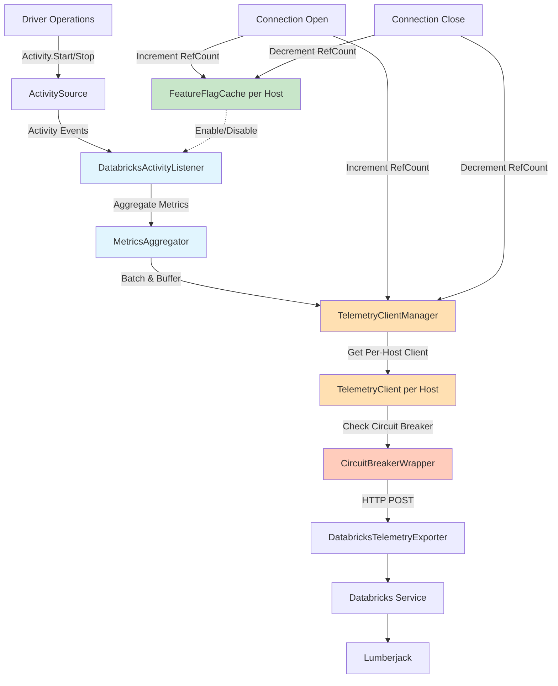

**Key Components:**
1. **ActivitySource** (existing): Emits activities for all operations
2. **FeatureFlagCache** (new): Per-host caching of feature flags with reference counting
3. **TelemetryClientManager** (new): Manages one telemetry client per host with reference counting
4. **CircuitBreakerWrapper** (new): Protects against failing telemetry endpoint
5. **DatabricksActivityListener** (new): Listens to activities, extracts metrics
6. **MetricsAggregator** (new): Aggregates by statement, batches events
7. **DatabricksTelemetryExporter** (new): Exports to Databricks service

### 2.2 Activity Flow

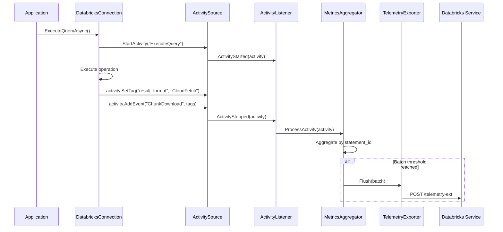

---

## 3. Core Components

### 3.1 FeatureFlagCache (Per-Host)

**Purpose**: Cache **all** feature flag values at the host level to avoid repeated API calls and rate limiting. This is a generic cache that can be used for any driver configuration controlled by server-side feature flags, not just telemetry.

**Location**: `AdbcDrivers.Databricks.FeatureFlagCache` (note: not in Telemetry namespace - this is a general-purpose component)

#### Rationale
- **Generic feature flag support**: Cache returns all flags, allowing any driver feature to be controlled server-side
- **Per-host caching**: Feature flags cached by host (not per connection) to prevent rate limiting
- **Reference counting**: Tracks number of connections per host for proper cleanup
- **Server-controlled TTL**: Refresh interval controlled by server-provided `ttl_seconds` (default: 15 minutes)
- **Background refresh**: Scheduled refresh at server-specified intervals
- **Thread-safe**: Uses ConcurrentDictionary for concurrent access from multiple connections

#### Configuration Priority Order

Feature flags are integrated directly into the existing ADBC driver property parsing logic as an **extra layer** in the property value resolution. The priority order is:

```
1. User-specified properties (highest priority)
2. Feature flags from server
3. Driver default values (lowest priority)
```

**Integration Approach**: Feature flags are merged into the `Properties` dictionary at connection initialization time. This means:
- The existing `Properties.TryGetValue()` pattern continues to work unchanged
- Feature flags are transparently available as properties
- No changes needed to existing property parsing code

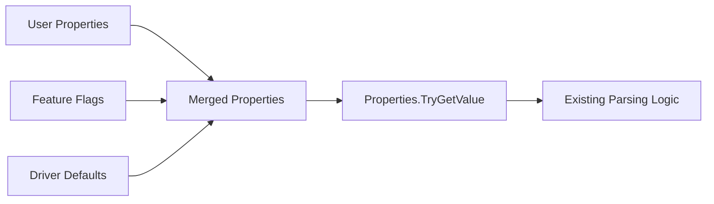

**Merge Logic** (in `DatabricksConnection` initialization):
```csharp
// Current flow:
// 1. User properties from connection string/config
// 2. Environment properties from DATABRICKS_CONFIG_FILE

// New flow with feature flags:
// 1. User properties from connection string/config (highest priority)
// 2. Feature flags from server (middle priority)
// 3. Environment properties / driver defaults (lowest priority)

private Dictionary<string, string> MergePropertiesWithFeatureFlags(
    Dictionary<string, string> userProperties,
    IReadOnlyDictionary<string, string> featureFlags)
{
    var merged = new Dictionary<string, string>(StringComparer.OrdinalIgnoreCase);

    // Start with feature flags as base (lower priority)
    foreach (var flag in featureFlags)
    {
        // Map feature flag names to property names if needed
        string propertyName = MapFeatureFlagToPropertyName(flag.Key);
        if (propertyName != null)
        {
            merged[propertyName] = flag.Value;
        }
    }

    // Override with user properties (higher priority)
    foreach (var prop in userProperties)
    {
        merged[prop.Key] = prop.Value;
    }

    return merged;
}
```

**Feature Flag to Property Name Mapping**:
```csharp
// Feature flags have long names, map to driver property names
private static readonly Dictionary<string, string> FeatureFlagToPropertyMap = new()
{
    ["databricks.partnerplatform.clientConfigsFeatureFlags.enableTelemetryForAdbc"] = "telemetry.enabled",
    ["databricks.partnerplatform.clientConfigsFeatureFlags.enableCloudFetch"] = "cloudfetch.enabled",
    // ... more mappings
};
```

This approach:
- **Preserves existing code**: All `Properties.TryGetValue()` calls work unchanged
- **Transparent integration**: Feature flags appear as regular properties after merge
- **Clear priority**: User settings always win over server flags
- **Single merge point**: Feature flag integration happens once at connection initialization
- **Fresh values per connection**: Each new connection uses the latest cached feature flag values

#### Per-Connection Property Resolution

Each new connection applies property merging with the **latest** cached feature flag values:

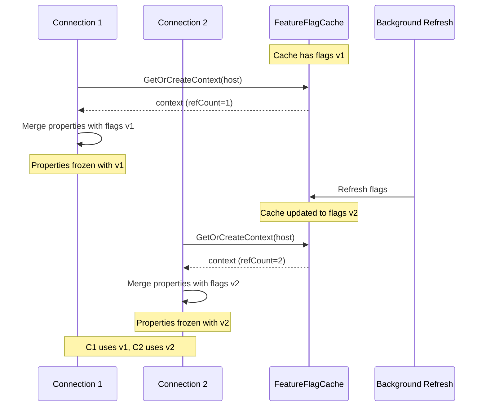

**Key Points**:
- **Shared cache, per-connection merge**: The `FeatureFlagCache` is shared (per-host), but property merging happens at each connection initialization
- **Latest values for new connections**: When a new connection is created, it reads the current cached values (which may have been updated by background refresh)
- **Stable within connection**: Once merged, a connection's `Properties` are stable for its lifetime (no mid-connection changes)
- **Background refresh benefits new connections**: The scheduled refresh ensures new connections get up-to-date flag values without waiting for a fetch

#### Feature Flag API

**Endpoint**: `GET /api/2.0/connector-service/feature-flags/OSS_JDBC/{driver_version}`

> **Note**: Currently using the JDBC endpoint (`OSS_JDBC`) until the ADBC endpoint (`OSS_ADBC`) is configured server-side. The feature flag name will still use `enableTelemetryForAdbc` to distinguish ADBC telemetry from JDBC telemetry.

Where `{driver_version}` is the driver version (e.g., `1.0.0`).

**Request Headers**:
- `Authorization`: Bearer token (same as connection auth)
- `User-Agent`: Custom user agent for connector service

**Response Format** (JSON):
```json
{
  "flags": [
    {
      "name": "databricks.partnerplatform.clientConfigsFeatureFlags.enableTelemetryForAdbc",
      "value": "true"
    },
    {
      "name": "databricks.partnerplatform.clientConfigsFeatureFlags.enableCloudFetch",
      "value": "true"
    },
    {
      "name": "databricks.partnerplatform.clientConfigsFeatureFlags.maxDownloadThreads",
      "value": "10"
    }
  ],
  "ttl_seconds": 900
}
```

**Response Fields**:
- `flags`: Array of feature flag entries with `name` and `value` (string). Names can be mapped to driver property names.
- `ttl_seconds`: Server-controlled refresh interval in seconds (default: 900 = 15 minutes)

**JDBC Reference**: See `DatabricksDriverFeatureFlagsContext.java:30-33` for endpoint format.

#### Refresh Strategy

The feature flag cache follows the JDBC driver pattern:

1. **Initial Blocking Fetch**: On connection open, make a blocking HTTP call to fetch all feature flags
2. **Cache All Flags**: Store all returned flags in a local cache (Guava Cache in JDBC, ConcurrentDictionary in C#)
3. **Scheduled Background Refresh**: Start a daemon thread that refreshes flags at intervals based on `ttl_seconds`
4. **Dynamic TTL**: If server returns a different `ttl_seconds`, reschedule the refresh interval

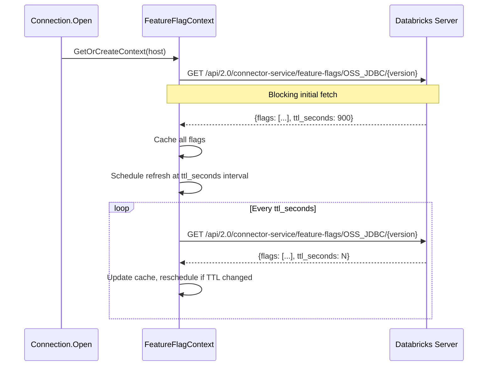

**JDBC Reference**: See `DatabricksDriverFeatureFlagsContext.java:48-58` for initial fetch and scheduling.

#### HTTP Client Pattern

The feature flag cache does **not** use a separate dedicated HTTP client. Instead, it reuses the connection's existing HTTP client infrastructure:

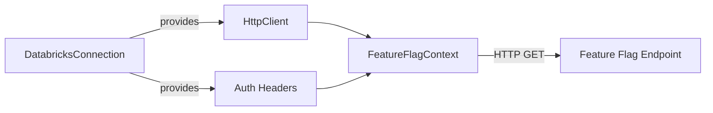

**Key Points**:
1. **Reuse connection's HttpClient**: The `FeatureFlagContext` receives the connection's `HttpClient` (already configured with base address, timeouts, etc.)
2. **Reuse connection's authentication**: Auth headers (Bearer token) come from the connection's authentication mechanism
3. **Custom User-Agent**: Set a connector-service-specific User-Agent header for the feature flag requests

**JDBC Implementation** (`DatabricksDriverFeatureFlagsContext.java:89-105`):
```java
// Get shared HTTP client from connection
IDatabricksHttpClient httpClient =
    DatabricksHttpClientFactory.getInstance().getClient(connectionContext);

// Create request
HttpGet request = new HttpGet(featureFlagEndpoint);

// Set custom User-Agent for connector service
request.setHeader("User-Agent",
    UserAgentManager.buildUserAgentForConnectorService(connectionContext));

// Add auth headers from connection's auth config
DatabricksClientConfiguratorManager.getInstance()
    .getConfigurator(connectionContext)
    .getDatabricksConfig()
    .authenticate()
    .forEach(request::addHeader);
```

**C# Equivalent Pattern**:
```csharp
// In DatabricksConnection - create HttpClient for feature flags
private HttpClient CreateFeatureFlagHttpClient()
{
    var handler = HiveServer2TlsImpl.NewHttpClientHandler(TlsOptions, _proxyConfigurator);
    var httpClient = new HttpClient(handler);

    // Set base address
    httpClient.BaseAddress = new Uri($"https://{_host}");

    // Set auth header (reuse connection's token)
    if (Properties.TryGetValue(SparkParameters.Token, out string? token))
    {
        httpClient.DefaultRequestHeaders.Authorization =
            new AuthenticationHeaderValue("Bearer", token);
    }

    // Set custom User-Agent for connector service
    httpClient.DefaultRequestHeaders.UserAgent.ParseAdd(
        BuildConnectorServiceUserAgent());

    return httpClient;
}

// Pass to FeatureFlagContext
var context = featureFlagCache.GetOrCreateContext(_host, CreateFeatureFlagHttpClient());
```

This approach:
- Avoids duplicating HTTP client configuration
- Ensures consistent authentication across all API calls
- Allows proper resource cleanup when connection closes

#### Interface

```csharp
namespace AdbcDrivers.Databricks
{
    /// <summary>
    /// Singleton that manages feature flag cache per host.
    /// Prevents rate limiting by caching feature flag responses.
    /// This is a generic cache for all feature flags, not just telemetry.
    /// </summary>
    internal sealed class FeatureFlagCache
    {
        private static readonly FeatureFlagCache s_instance = new FeatureFlagCache();
        public static FeatureFlagCache GetInstance() => s_instance;

        /// <summary>
        /// Gets or creates a feature flag context for the host.
        /// Increments reference count.
        /// Makes initial blocking fetch if context is new.
        /// </summary>
        public FeatureFlagContext GetOrCreateContext(string host, HttpClient httpClient, string driverVersion);

        /// <summary>
        /// Decrements reference count for the host.
        /// Removes context and stops refresh scheduler when ref count reaches zero.
        /// </summary>
        public void ReleaseContext(string host);
    }

    /// <summary>
    /// Holds feature flag state and reference count for a host.
    /// Manages background refresh scheduling.
    /// Uses the HttpClient provided by the connection for API calls.
    /// </summary>
    internal sealed class FeatureFlagContext : IDisposable
    {
        /// <summary>
        /// Creates a new context with the given HTTP client.
        /// Makes initial blocking fetch to populate cache.
        /// Starts background refresh scheduler.
        /// </summary>
        /// <param name="host">The Databricks host.</param>
        /// <param name="httpClient">
        /// HttpClient from the connection, pre-configured with:
        /// - Base address (https://{host})
        /// - Auth headers (Bearer token)
        /// - Custom User-Agent for connector service
        /// </param>
        public FeatureFlagContext(string host, HttpClient httpClient);

        public int RefCount { get; }
        public TimeSpan RefreshInterval { get; }  // From server ttl_seconds

        /// <summary>
        /// Gets a feature flag value by name.
        /// Returns null if the flag is not found.
        /// </summary>
        public string? GetFlagValue(string flagName);

        /// <summary>
        /// Checks if a feature flag is enabled (value is "true").
        /// Returns false if flag is not found or value is not "true".
        /// </summary>
        public bool IsFeatureEnabled(string flagName);

        /// <summary>
        /// Gets all cached feature flags as a dictionary.
        /// Can be used to merge with user properties.
        /// </summary>
        public IReadOnlyDictionary<string, string> GetAllFlags();

        /// <summary>
        /// Stops the background refresh scheduler.
        /// </summary>
        public void Shutdown();

        public void Dispose();
    }

    /// <summary>
    /// Response model for feature flags API.
    /// </summary>
    internal sealed class FeatureFlagsResponse
    {
        public List<FeatureFlagEntry>? Flags { get; set; }
        public int? TtlSeconds { get; set; }
    }

    internal sealed class FeatureFlagEntry
    {
        public string Name { get; set; } = string.Empty;
        public string Value { get; set; } = string.Empty;
    }
}
```

#### Usage Example

```csharp
// In DatabricksConnection constructor/initialization
// This runs for EACH new connection, using LATEST cached feature flags

// Step 1: Get or create feature flag context
// - If context exists: returns existing context with latest cached flags
// - If new: creates context, does initial blocking fetch, starts background refresh
var featureFlagCache = FeatureFlagCache.GetInstance();
var featureFlagContext = featureFlagCache.GetOrCreateContext(_host, CreateFeatureFlagHttpClient());

// Step 2: Merge feature flags into properties using LATEST cached values
// Each new connection gets a fresh merge with current flag values
Properties = MergePropertiesWithFeatureFlags(
    userProperties,
    featureFlagContext.GetAllFlags());  // Returns current cached flags

// Step 3: Existing property parsing works unchanged!
// Feature flags are now transparently available as properties
bool IsTelemetryEnabled()
{
    // This works whether the value came from:
    // - User property (highest priority)
    // - Feature flag (merged in)
    // - Or falls back to driver default
    if (Properties.TryGetValue("telemetry.enabled", out var value))
    {
        return bool.TryParse(value, out var result) && result;
    }
    return true; // Driver default
}

// Same pattern for all other properties - no changes needed!
if (Properties.TryGetValue(DatabricksParameters.CloudFetchEnabled, out var cfValue))
{
    // Value could be from user OR from feature flag - transparent!
}
```

**Key Benefits**:
- Existing code like `Properties.TryGetValue()` continues to work unchanged
- Each new connection uses the **latest** cached feature flag values
- Feature flag integration is a one-time merge at connection initialization
- Properties are stable for the lifetime of the connection (no mid-connection changes)

**JDBC Reference**: `DatabricksDriverFeatureFlagsContextFactory.java:27` maintains per-compute (host) feature flag contexts with reference counting. `DatabricksDriverFeatureFlagsContext.java` implements the caching, refresh scheduling, and API calls.

---

### 3.2 TelemetryClientManager (Per-Host)

**Purpose**: Manage one telemetry client per host to prevent rate limiting from concurrent connections.

**Location**: `Apache.Arrow.Adbc.Drivers.Databricks.Telemetry.TelemetryClientManager`

#### Rationale
- **One client per host**: Large customers (e.g., Celonis) open many parallel connections to the same host
- **Prevents rate limiting**: Shared client batches events from all connections, avoiding multiple concurrent flushes
- **Reference counting**: Tracks active connections, only closes client when last connection closes
- **Thread-safe**: Safe for concurrent access from multiple connections

#### Interface

```csharp
namespace AdbcDrivers.Databricks.Telemetry
{
    /// <summary>
    /// Singleton factory that manages one telemetry client per host.
    /// Prevents rate limiting by sharing clients across connections.
    /// </summary>
    internal sealed class TelemetryClientManager
    {
        private static readonly TelemetryClientManager Instance = new();
        public static TelemetryClientManager GetInstance() => Instance;

        /// <summary>
        /// Gets or creates a telemetry client for the host.
        /// Increments reference count.
        /// </summary>
        public ITelemetryClient GetOrCreateClient(
            string host,
            HttpClient httpClient,
            TelemetryConfiguration config);

        /// <summary>
        /// Decrements reference count for the host.
        /// Closes and removes client when ref count reaches zero.
        /// </summary>
        public Task ReleaseClientAsync(string host);
    }

    /// <summary>
    /// Holds a telemetry client and its reference count.
    /// </summary>
    internal sealed class TelemetryClientHolder
    {
        public ITelemetryClient Client { get; }
        public int RefCount { get; set; }
    }
}
```

**JDBC Reference**: `TelemetryClientFactory.java:27` maintains `ConcurrentHashMap<String, TelemetryClientHolder>` with per-host clients and reference counting.

---

### 3.3 Circuit Breaker

**Purpose**: Implement circuit breaker pattern to protect against failing telemetry endpoint.

**Location**: `Apache.Arrow.Adbc.Drivers.Databricks.Telemetry.CircuitBreaker`

#### Rationale
- **Endpoint protection**: The telemetry endpoint itself may fail or become unavailable
- **Not just rate limiting**: Protects against 5xx errors, timeouts, network failures
- **Resource efficiency**: Prevents wasting resources on a failing endpoint
- **Auto-recovery**: Automatically detects when endpoint becomes healthy again

#### States
1. **Closed**: Normal operation, requests pass through
2. **Open**: After threshold failures, all requests rejected immediately (drop events)
3. **Half-Open**: After timeout, allows test requests to check if endpoint recovered

#### Interface

```csharp
namespace AdbcDrivers.Databricks.Telemetry
{
    /// <summary>
    /// Wraps telemetry exporter with circuit breaker pattern.
    /// </summary>
    internal sealed class CircuitBreakerTelemetryExporter : ITelemetryExporter
    {
        public CircuitBreakerTelemetryExporter(string host, ITelemetryExporter innerExporter);

        public Task ExportAsync(
            IReadOnlyList<TelemetryMetric> metrics,
            CancellationToken ct = default);
    }

    /// <summary>
    /// Singleton that manages circuit breakers per host.
    /// </summary>
    internal sealed class CircuitBreakerManager
    {
        private static readonly CircuitBreakerManager Instance = new();
        public static CircuitBreakerManager GetInstance() => Instance;

        public CircuitBreaker GetCircuitBreaker(string host);
    }

    internal sealed class CircuitBreaker
    {
        public CircuitBreakerConfig Config { get; }
        public Task ExecuteAsync(Func<Task> action);
    }

    internal class CircuitBreakerConfig
    {
        public int FailureThreshold { get; set; } = 5; // Open after 5 failures
        public TimeSpan Timeout { get; set; } = TimeSpan.FromMinutes(1); // Try again after 1 min
        public int SuccessThreshold { get; set; } = 2; // Close after 2 successes
    }
}
```

**JDBC Reference**: `CircuitBreakerTelemetryPushClient.java:15` and `CircuitBreakerManager.java:25`

---

### 3.4 DatabricksActivityListener

**Purpose**: Listen to Activity events and extract metrics for Databricks telemetry.

**Location**: `Apache.Arrow.Adbc.Drivers.Databricks.Telemetry.DatabricksActivityListener`

#### Interface

```csharp
namespace AdbcDrivers.Databricks.Telemetry
{
    /// <summary>
    /// Custom ActivityListener that aggregates metrics from Activity events
    /// and exports them to Databricks telemetry service.
    /// All exceptions are swallowed to prevent impacting driver operations.
    /// </summary>
    public sealed class DatabricksActivityListener : IDisposable
    {
        public DatabricksActivityListener(
            string host,
            ITelemetryClient telemetryClient,
            TelemetryConfiguration config);

        // Start listening to activities
        public void Start();

        // Stop listening and flush pending metrics
        public Task StopAsync();

        public void Dispose();
    }
}
```

**Constructor Change**: Takes `string host` and shared `ITelemetryClient` instead of `DatabricksConnection`.

#### Activity Listener Configuration

```csharp
// Internal setup
private ActivityListener CreateListener()
{
    return new ActivityListener
    {
        ShouldListenTo = source =>
            source.Name == "Databricks.Adbc.Driver",

        ActivityStarted = OnActivityStarted,
        ActivityStopped = OnActivityStopped,

        Sample = (ref ActivityCreationOptions<ActivityContext> options) =>
            _config.Enabled ? ActivitySamplingResult.AllDataAndRecorded
                            : ActivitySamplingResult.None
    };
}
```

#### Contracts

**Activity Filtering**:
- Only listen to `"Databricks.Adbc.Driver"` ActivitySource
- Respects feature flag via `Sample` callback

**Metric Extraction**:
- Extract metrics from Activity tags
- Aggregate by `statement_id` tag
- Aggregate by `session_id` tag

**Non-Blocking**:
- All processing async
- Never blocks Activity completion
- All exceptions swallowed (logged at TRACE level only)

**Exception Handling**:
- Wraps all callbacks in try-catch
- Never throws exceptions to Activity infrastructure
- Logs at TRACE level only to avoid customer anxiety

---

### 3.5 MetricsAggregator

**Purpose**: Aggregate Activity data into metrics suitable for Databricks telemetry.

**Location**: `Apache.Arrow.Adbc.Drivers.Databricks.Telemetry.MetricsAggregator`

**Key Design**: Aggregates metrics by `statement_id`, with each aggregated event including both `statement_id` and `session_id` for correlation. This follows the JDBC driver pattern where aggregation happens at the statement level, but exported events contain both IDs.

**JDBC References**:
- `TelemetryCollector.java:29-30` - Per-statement aggregation using `ConcurrentHashMap<String, StatementTelemetryDetails>`
- `TelemetryEvent.java:8-12` - Both `session_id` and `sql_statement_id` fields in exported events
- `TelemetryHelper.java:104-106` - Sets both session_id and statement_id when exporting
- See PRs: [#1163](https://github.com/databricks/databricks-jdbc/pull/1163), [#1082](https://github.com/databricks/databricks-jdbc/pull/1082), [#1079](https://github.com/databricks/databricks-jdbc/pull/1079)

#### Interface

```csharp
namespace AdbcDrivers.Databricks.Telemetry
{
    /// <summary>
    /// Aggregates metrics from activities by statement_id and includes session_id.
    /// Follows JDBC driver pattern: aggregation by statement, export with both IDs.
    /// </summary>
    internal sealed class MetricsAggregator : IDisposable
    {
        public MetricsAggregator(
            ITelemetryExporter exporter,
            TelemetryConfiguration config);

        // Process completed activity
        public void ProcessActivity(Activity activity);

        // Mark statement complete and emit aggregated metrics
        public void CompleteStatement(string statementId);

        // Flush all pending metrics
        public Task FlushAsync(CancellationToken ct = default);

        public void Dispose();
    }
}
```

#### Aggregation Logic

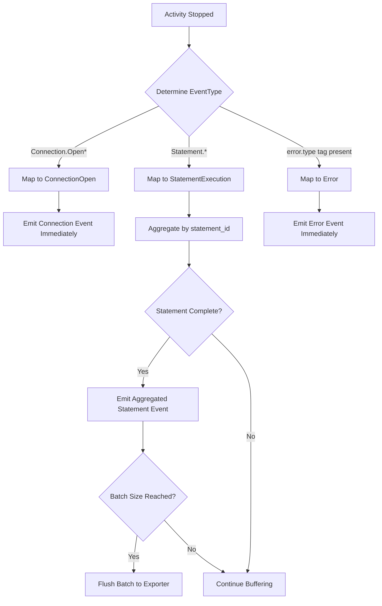

**Key Behaviors:**
- **Connection events**: Emitted immediately (no aggregation needed)
- **Statement events**: Aggregated by `statement_id` until statement completes
- **Error events**: Emitted immediately
- **Child activities** (CloudFetch.Download, etc.): Metrics rolled up to parent statement activity

#### Contracts

**Statement Aggregation**:
- Activities with same `statement_id` tag aggregated together in a `ConcurrentHashMap<string, StatementTelemetryDetails>`
- Aggregation includes: execution latency, chunk downloads, poll count, result format
- Each aggregated event includes both `statement_id` (aggregation key) and `session_id` (connection correlation)
- Emitted when statement marked complete via `CompleteStatement(statementId)`

**Session-Level Correlation**:
- `session_id` is captured from activities and included in all exported events
- Multiple statements from the same connection share the same `session_id`
- Allows correlation of all statements within a single connection/session
- Follows JDBC pattern: aggregate by statement, correlate by session

**Connection-Level Events**:
- Connection.Open emitted immediately (not aggregated)
- Driver configuration collected once per connection
- Contains `session_id` for correlation with subsequent statement events

**Error Handling**:
- Activity errors (tags with `error.type`) captured
- Never throws exceptions
- All exceptions swallowed (logged at TRACE level only)

**Terminal vs Retryable Exceptions**:
- **Terminal exceptions**: Flush immediately (auth failures, syntax errors, etc.)
- **Retryable exceptions**: Buffer until statement completes (network errors, 429, 503, etc.)
- Only flush retryable exceptions if statement ultimately fails

---

### 3.6 DatabricksTelemetryExporter

**Purpose**: Export aggregated metrics to Databricks telemetry service.

**Location**: `AdbcDrivers.Databricks.Telemetry.DatabricksTelemetryExporter`

**Status**: Implemented (WI-3.4)

#### Interface

```csharp
namespace AdbcDrivers.Databricks.Telemetry
{
    public interface ITelemetryExporter
    {
        /// <summary>
        /// Export telemetry frontend logs to the backend service.
        /// Never throws exceptions (all swallowed and logged at TRACE level).
        /// </summary>
        Task ExportAsync(
            IReadOnlyList<TelemetryFrontendLog> logs,
            CancellationToken ct = default);
    }

    internal sealed class DatabricksTelemetryExporter : ITelemetryExporter
    {
        // Authenticated telemetry endpoint
        internal const string AuthenticatedEndpoint = "/telemetry-ext";

        // Unauthenticated telemetry endpoint
        internal const string UnauthenticatedEndpoint = "/telemetry-unauth";

        public DatabricksTelemetryExporter(
            HttpClient httpClient,
            string host,
            bool isAuthenticated,
            TelemetryConfiguration config);

        public Task ExportAsync(
            IReadOnlyList<TelemetryFrontendLog> logs,
            CancellationToken ct = default);

        // Creates TelemetryRequest wrapper with uploadTime and protoLogs
        internal TelemetryRequest CreateTelemetryRequest(IReadOnlyList<TelemetryFrontendLog> logs);
    }
}
```

**Implementation Details**:
- Creates `TelemetryRequest` with `uploadTime` (Unix ms) and `protoLogs` (JSON-serialized `TelemetryFrontendLog` array)
- Uses `/telemetry-ext` for authenticated requests
- Uses `/telemetry-unauth` for unauthenticated requests
- Implements retry logic for transient failures (configurable via `MaxRetries` and `RetryDelayMs`)
- Uses `ExceptionClassifier` to identify terminal vs retryable errors
- Never throws exceptions (all caught and logged at TRACE level)
- Cancellation is propagated (not swallowed)

---

## 4. Data Collection

### 4.1 Tag Definition System

To ensure maintainability and explicit control over what data is collected and exported, all Activity tags are defined in a centralized tag definition system.

#### Tag Definition Structure

**Location**: `Telemetry/TagDefinitions/`

```
Telemetry/
└── TagDefinitions/
    ├── TelemetryTag.cs              # Tag metadata and annotations
    ├── TelemetryEvent.cs            # Event definitions with associated tags
    ├── ConnectionOpenEvent.cs       # Connection event tag definitions
    ├── StatementExecutionEvent.cs   # Statement event tag definitions
    └── ErrorEvent.cs                # Error event tag definitions
```

#### TelemetryTag Annotation

**File**: `TagDefinitions/TelemetryTag.cs`

```csharp
namespace AdbcDrivers.Databricks.Telemetry.TagDefinitions
{
    /// <summary>
    /// Defines export scope for telemetry tags.
    /// </summary>
    [Flags]
    internal enum TagExportScope
    {
        None = 0,
        ExportLocal = 1,      // Export to local diagnostics (file listener, etc.)
        ExportDatabricks = 2, // Export to Databricks telemetry service
        ExportAll = ExportLocal | ExportDatabricks
    }

    /// <summary>
    /// Attribute to annotate Activity tag definitions.
    /// </summary>
    [AttributeUsage(AttributeTargets.Field, AllowMultiple = false)]
    internal sealed class TelemetryTagAttribute : Attribute
    {
        public string TagName { get; }
        public TagExportScope ExportScope { get; set; }
        public string? Description { get; set; }
        public bool Required { get; set; }

        public TelemetryTagAttribute(string tagName)
        {
            TagName = tagName;
            ExportScope = TagExportScope.ExportAll;
        }
    }
}
```

#### Event Tag Definitions

**File**: `TagDefinitions/ConnectionOpenEvent.cs`

```csharp
namespace AdbcDrivers.Databricks.Telemetry.TagDefinitions
{
    /// <summary>
    /// Tag definitions for Connection.Open events.
    /// </summary>
    internal static class ConnectionOpenEvent
    {
        public const string EventName = "Connection.Open";

        // Standard tags
        [TelemetryTag("workspace.id",
            ExportScope = TagExportScope.ExportDatabricks,
            Description = "Databricks workspace ID",
            Required = true)]
        public const string WorkspaceId = "workspace.id";

        [TelemetryTag("session.id",
            ExportScope = TagExportScope.ExportDatabricks,
            Description = "Connection session ID",
            Required = true)]
        public const string SessionId = "session.id";

        // Driver configuration tags
        [TelemetryTag("driver.version",
            ExportScope = TagExportScope.ExportAll,
            Description = "ADBC driver version")]
        public const string DriverVersion = "driver.version";

        [TelemetryTag("driver.os",
            ExportScope = TagExportScope.ExportAll,
            Description = "Operating system")]
        public const string DriverOS = "driver.os";

        [TelemetryTag("driver.runtime",
            ExportScope = TagExportScope.ExportAll,
            Description = ".NET runtime version")]
        public const string DriverRuntime = "driver.runtime";

        // Feature flags
        [TelemetryTag("feature.cloudfetch",
            ExportScope = TagExportScope.ExportDatabricks,
            Description = "CloudFetch enabled")]
        public const string FeatureCloudFetch = "feature.cloudfetch";

        [TelemetryTag("feature.lz4",
            ExportScope = TagExportScope.ExportDatabricks,
            Description = "LZ4 compression enabled")]
        public const string FeatureLz4 = "feature.lz4";

        // Sensitive tags - NOT exported to Databricks
        [TelemetryTag("server.address",
            ExportScope = TagExportScope.ExportLocal,
            Description = "Workspace host (local diagnostics only)")]
        public const string ServerAddress = "server.address";

        /// <summary>
        /// Get all tags that should be exported to Databricks.
        /// </summary>
        public static IReadOnlySet<string> GetDatabricksExportTags()
        {
            return new HashSet<string>
            {
                WorkspaceId,
                SessionId,
                DriverVersion,
                DriverOS,
                DriverRuntime,
                FeatureCloudFetch,
                FeatureLz4
            };
        }
    }
}
```

**File**: `TagDefinitions/StatementExecutionEvent.cs`

```csharp
namespace AdbcDrivers.Databricks.Telemetry.TagDefinitions
{
    /// <summary>
    /// Tag definitions for Statement execution events.
    /// </summary>
    internal static class StatementExecutionEvent
    {
        public const string EventName = "Statement.Execute";

        // Statement identification
        [TelemetryTag("statement.id",
            ExportScope = TagExportScope.ExportDatabricks,
            Description = "Statement execution ID",
            Required = true)]
        public const string StatementId = "statement.id";

        [TelemetryTag("session.id",
            ExportScope = TagExportScope.ExportDatabricks,
            Description = "Connection session ID",
            Required = true)]
        public const string SessionId = "session.id";

        // Result format tags
        [TelemetryTag("result.format",
            ExportScope = TagExportScope.ExportDatabricks,
            Description = "Result format: inline, cloudfetch")]
        public const string ResultFormat = "result.format";

        [TelemetryTag("result.chunk_count",
            ExportScope = TagExportScope.ExportDatabricks,
            Description = "Number of CloudFetch chunks")]
        public const string ResultChunkCount = "result.chunk_count";

        [TelemetryTag("result.bytes_downloaded",
            ExportScope = TagExportScope.ExportDatabricks,
            Description = "Total bytes downloaded")]
        public const string ResultBytesDownloaded = "result.bytes_downloaded";

        [TelemetryTag("result.compression_enabled",
            ExportScope = TagExportScope.ExportDatabricks,
            Description = "Compression enabled for results")]
        public const string ResultCompressionEnabled = "result.compression_enabled";

        // Polling metrics
        [TelemetryTag("poll.count",
            ExportScope = TagExportScope.ExportDatabricks,
            Description = "Number of status poll requests")]
        public const string PollCount = "poll.count";

        [TelemetryTag("poll.latency_ms",
            ExportScope = TagExportScope.ExportDatabricks,
            Description = "Total polling latency")]
        public const string PollLatencyMs = "poll.latency_ms";

        // Chunk latency metrics (from CloudFetch download summary)
        [TelemetryTag("chunk.initial_latency_ms",
            ExportScope = TagExportScope.ExportDatabricks,
            Description = "Latency of first chunk download in milliseconds")]
        public const string ChunkInitialLatencyMs = "chunk.initial_latency_ms";

        [TelemetryTag("chunk.slowest_latency_ms",
            ExportScope = TagExportScope.ExportDatabricks,
            Description = "Latency of slowest chunk download in milliseconds")]
        public const string ChunkSlowestLatencyMs = "chunk.slowest_latency_ms";

        // Sensitive tags - NOT exported to Databricks
        [TelemetryTag("db.statement",
            ExportScope = TagExportScope.ExportLocal,
            Description = "SQL query text (local diagnostics only)")]
        public const string DbStatement = "db.statement";

        /// <summary>
        /// Get all tags that should be exported to Databricks.
        /// </summary>
        public static IReadOnlySet<string> GetDatabricksExportTags()
        {
            return new HashSet<string>
            {
                StatementId,
                SessionId,
                ResultFormat,
                ResultChunkCount,
                ResultBytesDownloaded,
                ResultCompressionEnabled,
                PollCount,
                PollLatencyMs,
                ChunkInitialLatencyMs,
                ChunkSlowestLatencyMs
            };
        }
    }
}
```

#### Tag Registry

**File**: `TagDefinitions/TelemetryTagRegistry.cs`

```csharp
namespace AdbcDrivers.Databricks.Telemetry.TagDefinitions
{
    /// <summary>
    /// Central registry for all telemetry tags and events.
    /// </summary>
    internal static class TelemetryTagRegistry
    {
        /// <summary>
        /// Get all tags allowed for Databricks export by event type.
        /// </summary>
        public static IReadOnlySet<string> GetDatabricksExportTags(TelemetryEventType eventType)
        {
            return eventType switch
            {
                TelemetryEventType.ConnectionOpen => ConnectionOpenEvent.GetDatabricksExportTags(),
                TelemetryEventType.StatementExecution => StatementExecutionEvent.GetDatabricksExportTags(),
                TelemetryEventType.Error => ErrorEvent.GetDatabricksExportTags(),
                _ => new HashSet<string>()
            };
        }

        /// <summary>
        /// Check if a tag should be exported to Databricks for a given event type.
        /// </summary>
        public static bool ShouldExportToDatabricks(TelemetryEventType eventType, string tagName)
        {
            var allowedTags = GetDatabricksExportTags(eventType);
            return allowedTags.Contains(tagName);
        }
    }
}
```

#### Usage in Activity Tag Filtering

The `MetricsAggregator` uses the tag registry for filtering:

```csharp
private TelemetryMetric ProcessActivity(Activity activity)
{
    var eventType = DetermineEventType(activity);
    var metric = new TelemetryMetric
    {
        EventType = eventType,
        Timestamp = activity.StartTimeUtc
    };

    // Filter tags using the registry
    foreach (var tag in activity.Tags)
    {
        if (TelemetryTagRegistry.ShouldExportToDatabricks(eventType, tag.Key))
        {
            // Export this tag
            SetMetricProperty(metric, tag.Key, tag.Value);
        }
        // Tags not in registry are silently dropped
    }

    return metric;
}
```

#### Benefits

1. **Centralized Control**: All tags defined in one place
2. **Explicit Export Scope**: Clear annotation of what goes where
3. **Type Safety**: Constants prevent typos
4. **Self-Documenting**: Descriptions embedded in code
5. **Easy Auditing**: Simple to review what data is exported
6. **Future-Proof**: New tags just require adding to definition files

### 4.2 Activity Tags by Event Type

#### Activity Operation Name to MetricType Mapping

The `ActivityListener` maps Activity operation names to Databricks `TelemetryEventType` enum:

| Activity Operation Name | TelemetryEventType | Notes |
|------------------------|-------------------|-------|
| `Connection.Open` | `ConnectionOpen` | Emitted immediately when connection opens |
| `Connection.OpenAsync` | `ConnectionOpen` | Same as above |
| `Statement.Execute` | `StatementExecution` | Main statement execution activity |
| `Statement.ExecuteQuery` | `StatementExecution` | Query execution variant |
| `Statement.ExecuteUpdate` | `StatementExecution` | Update execution variant |
| `CloudFetch.Download` | _(aggregated into parent)_ | Child activity, metrics rolled up to statement |
| `CloudFetch.ChunkDownload` | _(aggregated into parent)_ | Child activity, metrics rolled up to statement |
| `Results.Fetch` | _(aggregated into parent)_ | Child activity, metrics rolled up to statement |
| _(any activity with `error.type` tag)_ | `Error` | Error events based on tag presence |

**Mapping Logic** (in `MetricsAggregator`):
```csharp
private TelemetryEventType DetermineEventType(Activity activity)
{
    // Check for errors first
    if (activity.GetTagItem("error.type") != null)
        return TelemetryEventType.Error;

    // Map based on operation name
    var operationName = activity.OperationName;
    if (operationName.StartsWith("Connection."))
        return TelemetryEventType.ConnectionOpen;

    if (operationName.StartsWith("Statement."))
        return TelemetryEventType.StatementExecution;

    // Default for unknown operations
    return TelemetryEventType.StatementExecution;
}
```

**New Tags for Metrics** (add to existing activities):
- `result.format`: "inline" | "cloudfetch"
- `result.chunk_count`: Number of CloudFetch chunks
- `result.bytes_downloaded`: Total bytes downloaded
- `result.compression_enabled`: true/false
- `poll.count`: Number of status poll requests
- `poll.latency_ms`: Total polling latency

**Driver Configuration Tags** (Connection.Open activity):
- `driver.version`: Driver version string
- `driver.os`: Operating system
- `driver.runtime`: .NET runtime version
- `feature.cloudfetch`: CloudFetch enabled?
- `feature.lz4`: LZ4 decompression enabled?
- `feature.direct_results`: Direct results enabled?

### 4.2 Activity Events for Fine-Grained Data

Use `Activity.AddEvent()` for per-chunk metrics:

```csharp
activity?.AddEvent(new ActivityEvent("CloudFetch.ChunkDownloaded",
    tags: new ActivityTagsCollection
    {
        { "chunk.index", chunkIndex },
        { "chunk.latency_ms", latency.TotalMilliseconds },
        { "chunk.bytes", bytesDownloaded },
        { "chunk.compressed", compressed }
    }));
```

### 4.3 Collection Points

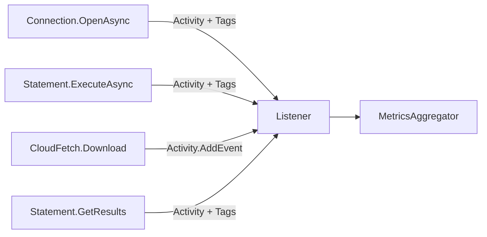

**Key Point**: No new instrumentation code! Just add tags to existing activities.

### 4.4 Activity Tag to Proto Schema Mapping

This section defines how Activity tags are mapped to the proto-generated `OssSqlDriverTelemetryLog` message structure. The `MetricsAggregator` is responsible for this conversion.

#### 4.4.1 Proto Schema Overview

The telemetry data is serialized using the proto schema defined in `Telemetry/Proto/sql_driver_telemetry.proto`. The main message is `OssSqlDriverTelemetryLog`:

```protobuf
message OssSqlDriverTelemetryLog {
  string session_id = 1;
  string sql_statement_id = 2;
  DriverSystemConfiguration system_configuration = 3;
  DriverConnectionParameters driver_connection_params = 4;
  string auth_type = 5;
  VolumeOperationEvent vol_operation = 6;
  SqlExecutionEvent sql_operation = 7;
  DriverErrorInfo error_info = 8;
  int64 operation_latency_ms = 9;
}
```

#### 4.4.2 Common Field Mappings

These fields are mapped for all event types:

| Activity Property | Proto Field | Notes |
|-------------------|-------------|-------|
| `activity.Duration` | `operation_latency_ms` | Converted to milliseconds (int64) |
| Tag: `session.id` | `session_id` | Connection session identifier |
| Tag: `statement.id` | `sql_statement_id` | Statement execution identifier |

#### 4.4.3 ConnectionOpen Event Mapping

**Activity Operation Names**: `Connection.Open`, `Connection.OpenAsync`, `OpenAsync`, `OpenConnection`

| Activity Tag | Proto Location | Proto Field | Type/Notes |
|--------------|----------------|-------------|------------|
| `driver.version` | `system_configuration` | `driver_version` | string |
| `driver.os` | `system_configuration` | `os_name` | string |
| `driver.runtime` | `system_configuration` | `runtime_version` | string |
| _(hardcoded)_ | `system_configuration` | `driver_name` | "Databricks ADBC Driver" |
| _(hardcoded)_ | `system_configuration` | `runtime_name` | ".NET" |
| `feature.direct_results` | `driver_connection_params` | `enable_direct_results` | bool |
| `feature.arrow` | `driver_connection_params` | `enable_arrow` | bool |

**MetricsAggregator Implementation**:
```csharp
private static DriverSystemConfiguration? ExtractSystemConfiguration(Activity activity)
{
    return new DriverSystemConfiguration
    {
        DriverName = "Databricks ADBC Driver",
        DriverVersion = GetTagValue(activity, "driver.version") ?? string.Empty,
        OsName = GetTagValue(activity, "driver.os") ?? string.Empty,
        RuntimeName = ".NET",
        RuntimeVersion = GetTagValue(activity, "driver.runtime") ?? string.Empty
    };
}
```

#### 4.4.4 StatementExecution Event Mapping

**Activity Operation Names**: `Statement.Execute`, `Statement.ExecuteQuery`, `Statement.ExecuteUpdate`, or any activity with `statement.id` tag

| Activity Tag | Proto Location | Proto Field | Type/Transformation |
|--------------|----------------|-------------|---------------------|
| `result.format` | `sql_operation` | `execution_result` | See enum mapping below |
| `result.compression_enabled` | `sql_operation` | `is_compressed` | bool |
| `result.chunk_count` | `sql_operation.chunk_details` | `total_chunks_present` | int32 |
| `result.bytes_downloaded` | `sql_operation.chunk_details` | `sum_chunks_download_time_millis` | int64 (repurposed for bytes) |
| `chunk.initial_latency_ms` | `sql_operation.chunk_details` | `initial_chunk_latency_millis` | int64 (see note below) |
| `chunk.slowest_latency_ms` | `sql_operation.chunk_details` | `slowest_chunk_latency_millis` | int64 (see note below) |
| `poll.count` | `sql_operation.operation_detail` | `n_operation_status_calls` | int32 |

**Chunk Latency Collection** (CloudFetchDownloader):

The `chunk.initial_latency_ms` and `chunk.slowest_latency_ms` values are tracked in `CloudFetchDownloader` during the download process:

```csharp
// In CloudFetchDownloader - track latency for each chunk download
private long _initialChunkLatencyMs = -1;
private long _slowestChunkLatencyMs = 0;

// After each successful chunk download:
lock (_latencyLock)
{
    long latencyMs = stopwatch.ElapsedMilliseconds;

    // First chunk sets initial latency
    if (_initialChunkLatencyMs < 0)
    {
        _initialChunkLatencyMs = latencyMs;
    }

    // Track max latency for slowest chunk
    if (latencyMs > _slowestChunkLatencyMs)
    {
        _slowestChunkLatencyMs = latencyMs;
    }
}

// Emitted in cloudfetch.download_summary Activity event:
activity?.AddEvent("cloudfetch.download_summary", [
    // ... other metrics ...
    new("initial_chunk_latency_ms", _initialChunkLatencyMs),
    new("slowest_chunk_latency_ms", _slowestChunkLatencyMs),
]);
```

The `MetricsAggregator` processes these Activity events and aggregates them into the `StatementTelemetryContext` for the statement.

| Activity Tag | Proto Location | Proto Field | Type/Transformation |
|--------------|----------------|-------------|---------------------|
| `poll.latency_ms` | `sql_operation.operation_detail` | `operation_status_latency_millis` | int64 |
| `statement.type` | `sql_operation` | `statement_type` | See enum mapping below |

**ExecutionResultFormat Enum Mapping**:

| Tag Value | Proto Enum Value |
|-----------|------------------|
| `"cloudfetch"` | `EXECUTION_RESULT_EXTERNAL_LINKS` |
| `"external_links"` | `EXECUTION_RESULT_EXTERNAL_LINKS` |
| `"arrow"` | `EXECUTION_RESULT_INLINE_ARROW` |
| `"inline_arrow"` | `EXECUTION_RESULT_INLINE_ARROW` |
| `"json"` | `EXECUTION_RESULT_INLINE_JSON` |
| `"inline_json"` | `EXECUTION_RESULT_INLINE_JSON` |
| _(other)_ | `EXECUTION_RESULT_FORMAT_UNSPECIFIED` |

**StatementType Enum Mapping**:

| Tag Value | Proto Enum Value |
|-----------|------------------|
| `"query"` | `STATEMENT_QUERY` |
| `"sql"` | `STATEMENT_SQL` |
| `"update"` | `STATEMENT_UPDATE` |
| `"metadata"` | `STATEMENT_METADATA` |
| _(other)_ | `STATEMENT_TYPE_UNSPECIFIED` |

**MetricsAggregator Implementation**:
```csharp
private OssSqlDriverTelemetryLog CreateTelemetryEvent(StatementTelemetryContext context)
{
    var telemetryLog = new OssSqlDriverTelemetryLog
    {
        SessionId = context.SessionId ?? string.Empty,
        SqlStatementId = context.StatementId,
        OperationLatencyMs = context.TotalLatencyMs,
        SqlOperation = new SqlExecutionEvent
        {
            IsCompressed = context.CompressionEnabled ?? false,
            ChunkDetails = new ChunkDetails
            {
                TotalChunksPresent = context.ChunkCount ?? 0,
                SumChunksDownloadTimeMillis = context.BytesDownloaded ?? 0,
                InitialChunkLatencyMillis = context.InitialChunkLatencyMs ?? 0,
                SlowestChunkLatencyMillis = context.SlowestChunkLatencyMs ?? 0
            },
            OperationDetail = new OperationDetail
            {
                NOperationStatusCalls = context.PollCount ?? 0,
                OperationStatusLatencyMillis = context.PollLatencyMs ?? 0
            }
        }
    };

    // Map result.format tag to ExecutionResultFormat enum
    if (!string.IsNullOrEmpty(context.ResultFormat))
    {
        telemetryLog.SqlOperation.ExecutionResult = context.ResultFormat.ToLowerInvariant() switch
        {
            "cloudfetch" or "external_links" => ExecutionResultFormat.ExecutionResultExternalLinks,
            "arrow" or "inline_arrow" => ExecutionResultFormat.ExecutionResultInlineArrow,
            "json" or "inline_json" => ExecutionResultFormat.ExecutionResultInlineJson,
            _ => ExecutionResultFormat.Unspecified
        };
    }

    return telemetryLog;
}
```

#### 4.4.5 Error Event Mapping

**Trigger**: Any activity with `error.type` tag present, or exceptions recorded via `RecordException()`

| Activity Tag / Property | Proto Location | Proto Field | Notes |
|-------------------------|----------------|-------------|-------|
| `error.type` | `error_info` | `error_name` | Exception type name |
| `Exception.Message` | `error_info` | `stack_trace` | Truncated to 200 chars |
| Tag: `session.id` | _(root)_ | `session_id` | Connection identifier |
| Tag: `statement.id` | _(root)_ | `sql_statement_id` | Statement identifier |

**Important Proto Schema Limitation**:
The proto `DriverErrorInfo` message only supports two fields:
- `error_name`: Maps to exception type (e.g., "HttpExceptionWithStatusCode")
- `stack_trace`: Used for truncated error message (proto field `error_message` is pending LPP review)

The following Activity tags are **NOT** mapped to proto (proto schema doesn't support them):
- `error.message` - No direct proto field (use `stack_trace` for truncated message)
- `error.http_status` - No `http_status_code` field in proto
- `error.code` - No generic error code field in proto

**MetricsAggregator Implementation**:
```csharp
private OssSqlDriverTelemetryLog CreateErrorTelemetryEvent(
    string? sessionId,
    string statementId,
    Exception exception)
{
    return new OssSqlDriverTelemetryLog
    {
        SessionId = sessionId ?? string.Empty,
        SqlStatementId = statementId,
        ErrorInfo = new DriverErrorInfo
        {
            ErrorName = exception.GetType().Name,
            StackTrace = TruncateErrorMessage(exception.Message) // Max 200 chars
        }
    };
}
```

#### 4.4.6 Nested Proto Message Reference

**ChunkDetails** (part of SqlExecutionEvent):
```protobuf
message ChunkDetails {
  int64 initial_chunk_latency_millis = 1;   // ← Maps from chunk.initial_latency_ms
  int64 slowest_chunk_latency_millis = 2;   // ← Maps from chunk.slowest_latency_ms
  int32 total_chunks_present = 3;           // ← Maps from result.chunk_count
  int32 total_chunks_iterated = 4;
  int64 sum_chunks_download_time_millis = 5;  // ← Maps from result.bytes_downloaded (repurposed)
}
```

**OperationDetail** (part of SqlExecutionEvent):
```protobuf
message OperationDetail {
  int32 n_operation_status_calls = 1;    // ← Maps from poll.count
  int64 operation_status_latency_millis = 2;  // ← Maps from poll.latency_ms
  OperationType operation_type = 3;
  bool is_internal_call = 4;
}
```

**ResultLatency** (part of SqlExecutionEvent, currently not mapped):
```protobuf
message ResultLatency {
  int64 result_set_ready_latency_millis = 1;
  int64 result_set_consumption_latency_millis = 2;
}
```

#### 4.4.7 Future Tag Extensions

When adding new Activity tags, ensure they map to existing proto fields. If a proto field doesn't exist, the tag data will be silently dropped for Databricks export.

**Proto Fields Not Currently Mapped** (available for future use):
- `OssSqlDriverTelemetryLog.auth_type` - Could map from `auth.type` tag
- `DriverSystemConfiguration.runtime_vendor` - Could map from `driver.runtime_vendor` tag
- `DriverSystemConfiguration.os_version` - Could map from `driver.os_version` tag
- `DriverSystemConfiguration.os_arch` - Could map from `driver.os_arch` tag
- `DriverSystemConfiguration.client_app_name` - Could map from `client.app_name` tag
- `DriverConnectionParameters.*` - Many connection parameters available
- `SqlExecutionEvent.retry_count` - Could map from `retry.count` tag
- `ChunkDetails.total_chunks_iterated` - Could map from `chunk.iterated_count` tag
- `ResultLatency.*` - Could map from `result.ready_latency_ms` and `result.consumption_latency_ms` tags

---

## 5. Export Mechanism

### 5.1 Export Flow

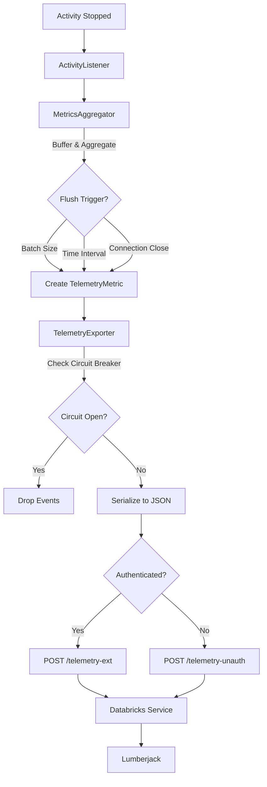

### 5.2 Data Model

**TelemetryMetric** (aggregated from multiple activities):

```csharp
public sealed class TelemetryMetric
{
    // Common fields
    public string MetricType { get; set; }  // "connection", "statement", "error"
    public DateTimeOffset Timestamp { get; set; }
    public long WorkspaceId { get; set; }

    // Correlation IDs (both included in every event)
    public string SessionId { get; set; }      // Connection-level ID (all statements in connection share this)
    public string StatementId { get; set; }    // Statement-level ID (unique per statement)

    // Statement metrics (aggregated from activities with same statement_id)
    public long ExecutionLatencyMs { get; set; }
    public string ResultFormat { get; set; }
    public int ChunkCount { get; set; }
    public long TotalBytesDownloaded { get; set; }
    public int PollCount { get; set; }

    // Driver config (from connection activity)
    public DriverConfiguration DriverConfig { get; set; }
}
```

**Derived from Activity**:
- `Timestamp`: `activity.StartTimeUtc`
- `ExecutionLatencyMs`: `activity.Duration.TotalMilliseconds`
- `SessionId`: `activity.GetTagItem("session.id")` - Shared across all statements in a connection
- `StatementId`: `activity.GetTagItem("statement.id")` - Unique per statement, used as aggregation key
- `ResultFormat`: `activity.GetTagItem("result.format")`

**Aggregation Pattern** (following JDBC):
- Multiple activities with the same `statement_id` are aggregated into a single `TelemetryMetric`
- The aggregated metric includes both `statement_id` (for statement tracking) and `session_id` (for connection correlation)
- This allows querying: "Show me all statements for session X" or "Show me details for statement Y"

### 5.3 Batching Strategy

Same as original design:
- **Batch size**: Default 100 metrics
- **Flush interval**: Default 5 seconds
- **Force flush**: On connection close

---

## 6. Configuration

### 6.1 Configuration Model

```csharp
public sealed class TelemetryConfiguration
{
    // Enable/disable
    public bool Enabled { get; set; } = true;

    // Batching
    public int BatchSize { get; set; } = 100;
    public int FlushIntervalMs { get; set; } = 5000;

    // Export
    public int MaxRetries { get; set; } = 3;
    public int RetryDelayMs { get; set; } = 100;

    // Circuit breaker
    public bool CircuitBreakerEnabled { get; set; } = true;
    public int CircuitBreakerThreshold { get; set; } = 5;
    public TimeSpan CircuitBreakerTimeout { get; set; } = TimeSpan.FromMinutes(1);

    // Feature flag name to check in the cached flags
    public const string FeatureFlagName =
        "databricks.partnerplatform.clientConfigsFeatureFlags.enableTelemetryForAdbc";

    // Feature flag endpoint (relative to host)
    // {0} = driver version without OSS suffix
    // NOTE: Using OSS_JDBC endpoint until OSS_ADBC is configured server-side
    public const string FeatureFlagEndpointFormat =
        "/api/2.0/connector-service/feature-flags/OSS_JDBC/{0}";
}
```

### 6.2 Initialization

```csharp
// In DatabricksConnection.OpenAsync()
if (_telemetryConfig.Enabled && serverFeatureFlag.Enabled)
{
    _activityListener = new DatabricksActivityListener(
        connection: this,
        exporter: new DatabricksTelemetryExporter(_httpClient, this, _telemetryConfig),
        config: _telemetryConfig);

    _activityListener.Start();
}
```

### 6.3 Feature Flag Integration

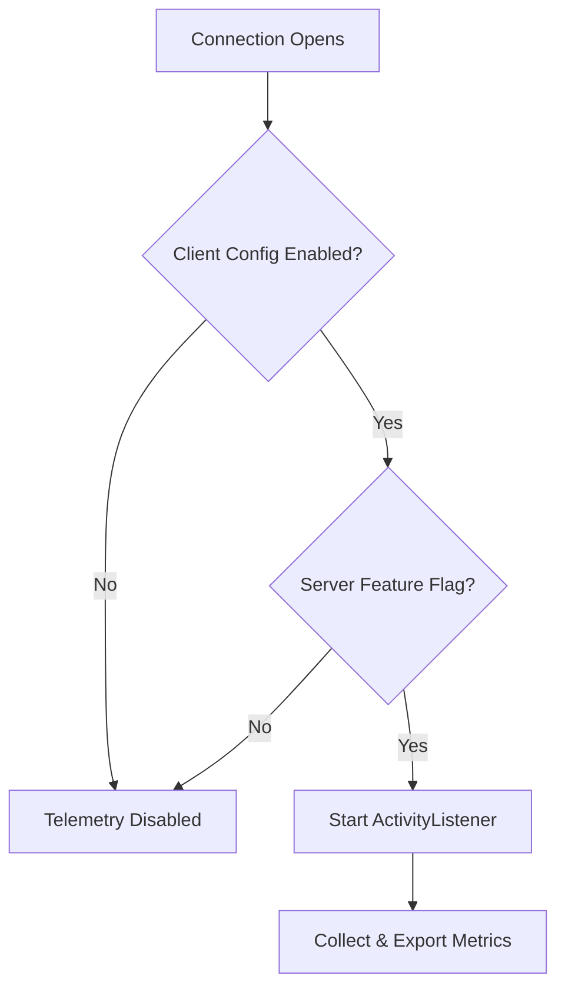

**Priority Order**:
1. Server feature flag (highest)
2. Client connection string
3. Environment variable
4. Default value

---

## 7. Privacy & Compliance

### 7.1 Data Privacy

**Never Collected from Activities**:
- ❌ SQL query text (only statement ID)
- ❌ Query results or data values
- ❌ Table/column names from queries
- ❌ User identities (only workspace ID)

**Always Collected**:
- ✅ Operation latency (from `Activity.Duration`)
- ✅ Error codes (from `activity.GetTagItem("error.type")`)
- ✅ Feature flags (boolean settings)
- ✅ Statement IDs (UUIDs)

### 7.2 Activity Tag Filtering

The listener filters tags using the centralized tag definition system:

```csharp
private TelemetryMetric ProcessActivity(Activity activity)
{
    var eventType = DetermineEventType(activity);
    var metric = new TelemetryMetric { EventType = eventType };

    foreach (var tag in activity.Tags)
    {
        // Use tag registry to determine if tag should be exported
        if (TelemetryTagRegistry.ShouldExportToDatabricks(eventType, tag.Key))
        {
            // Export this tag
            SetMetricProperty(metric, tag.Key, tag.Value);
        }
        // Tags not in registry are silently dropped for Databricks export
        // But may still be exported to local diagnostics if marked ExportLocal
    }

    return metric;
}
```

**Tag Export Examples:**

| Tag Name | ExportLocal | ExportDatabricks | Reason |
|----------|-------------|------------------|--------|
| `statement.id` | ✅ | ✅ | Safe UUID, needed for correlation |
| `result.format` | ✅ | ✅ | Safe enum value |
| `result.chunk_count` | ✅ | ✅ | Numeric metric |
| `driver.version` | ✅ | ✅ | Safe version string |
| `server.address` | ✅ | ❌ | May contain PII (workspace host) |
| `db.statement` | ✅ | ❌ | SQL query text (sensitive) |
| `user.name` | ❌ | ❌ | Personal information |

This approach ensures:
- **Compile-time safety**: Tag names are constants
- **Explicit control**: Each tag's export scope is clearly defined
- **Easy auditing**: Single file to review for compliance
- **Future-proof**: New tags must be added to definitions (prevents accidental leaks)

### 7.3 Compliance

Same as original design:
- **GDPR**: No personal data
- **CCPA**: No personal information
- **SOC 2**: Encrypted in transit
- **Data Residency**: Regional control plane

---

## 8. Error Handling

### 8.1 Exception Swallowing Strategy

**Core Principle**: Every telemetry exception must be swallowed with minimal logging to avoid customer anxiety.

**Rationale** (from JDBC experience):
- Customers become anxious when they see error logs, even if telemetry is non-blocking
- Telemetry failures should never impact the driver's core functionality
- **Critical**: Circuit breaker must catch errors **before** swallowing, otherwise it won't work

#### Logging Levels
- **TRACE**: Use for most telemetry errors (default)
- **DEBUG**: Use only for circuit breaker state changes
- **WARN/ERROR**: Never use for telemetry errors

#### Exception Handling Layers

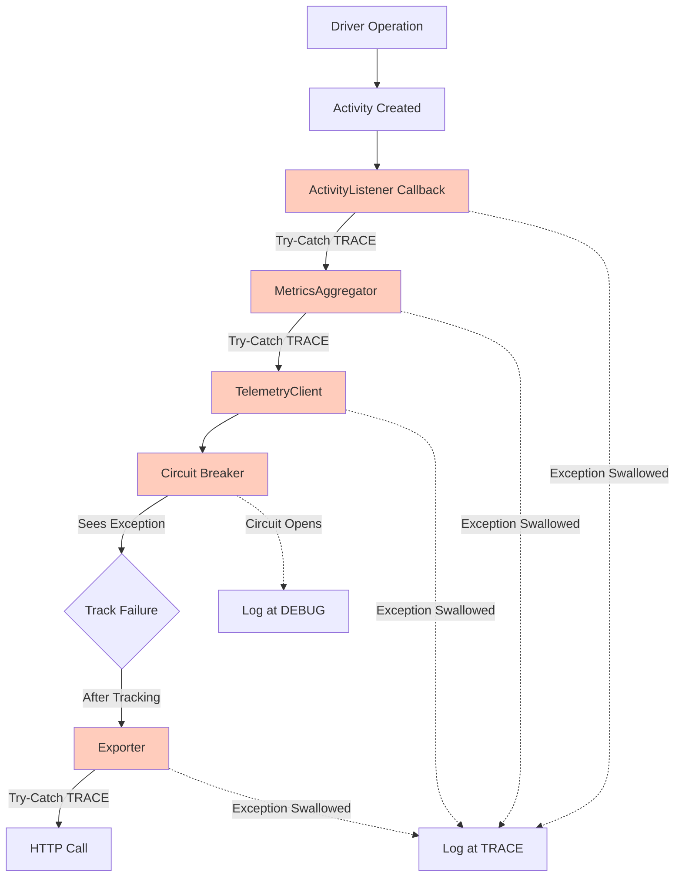

#### Activity Listener Error Handling

```csharp
private void OnActivityStopped(Activity activity)
{
    try
    {
        _aggregator.ProcessActivity(activity);
    }
    catch (Exception ex)
    {
        // Swallow ALL exceptions per requirement
        // Use TRACE level to avoid customer anxiety
        Debug.WriteLine($"[TRACE] Telemetry listener error: {ex.Message}");
    }
}
```

#### MetricsAggregator Error Handling

```csharp
public void ProcessActivity(Activity activity)
{
    try
    {
        // Extract metrics, buffer, flush if needed
    }
    catch (Exception ex)
    {
        Debug.WriteLine($"[TRACE] Telemetry aggregator error: {ex.Message}");
    }
}
```

#### Circuit Breaker Error Handling

**Important**: Circuit breaker MUST see exceptions before they are swallowed!

```csharp
public async Task ExportAsync(IReadOnlyList<TelemetryMetric> metrics)
{
    try
    {
        // Circuit breaker tracks failures BEFORE swallowing
        await _circuitBreaker.ExecuteAsync(async () =>
        {
            await _innerExporter.ExportAsync(metrics);
        });
    }
    catch (CircuitBreakerOpenException)
    {
        // Circuit is open, drop events silently
        Debug.WriteLine($"[DEBUG] Circuit breaker OPEN - dropping telemetry");
    }
    catch (Exception ex)
    {
        // All other exceptions swallowed AFTER circuit breaker saw them
        Debug.WriteLine($"[TRACE] Telemetry export error: {ex.Message}");
    }
}
```

**JDBC Reference**: `TelemetryPushClient.java:86-94` - Re-throws exception if circuit breaker enabled, allowing it to track failures before swallowing.

---

### 8.2 Terminal vs Retryable Exceptions

**Requirement**: Do not flush exceptions immediately when they occur. Flush immediately only for **terminal exceptions**.

#### Exception Classification

**Terminal Exceptions** (flush immediately):
- Authentication failures (401, 403)
- Invalid SQL syntax errors
- Permission denied errors
- Resource not found errors (404)
- Invalid request format errors (400)

**Retryable Exceptions** (buffer until statement completes):
- Network timeouts
- Connection errors
- Rate limiting (429)
- Service unavailable (503)
- Internal server errors (500, 502, 504)

#### Rationale
- Some exceptions are retryable and may succeed on retry
- If a retryable exception is thrown twice but succeeds the third time, we'd flush twice unnecessarily
- Only terminal (non-retryable) exceptions should trigger immediate flush
- Statement completion should trigger flush for accumulated exceptions

#### Exception Classifier

```csharp
internal static class ExceptionClassifier
{
    public static bool IsTerminalException(Exception ex)
    {
        return ex switch
        {
            HttpRequestException httpEx when IsTerminalHttpStatus(httpEx) => true,
            AuthenticationException => true,
            UnauthorizedAccessException => true,
            SqlException sqlEx when IsSyntaxError(sqlEx) => true,
            _ => false
        };
    }

    private static bool IsTerminalHttpStatus(HttpRequestException ex)
    {
        if (ex.StatusCode.HasValue)
        {
            var statusCode = (int)ex.StatusCode.Value;
            return statusCode is 400 or 401 or 403 or 404;
        }
        return false;
    }
}
```

#### Exception Buffering in MetricsAggregator

```csharp
public void RecordException(string statementId, Exception ex)
{
    try
    {
        if (ExceptionClassifier.IsTerminalException(ex))
        {
            // Terminal exception: flush immediately
            var errorMetric = CreateErrorMetric(statementId, ex);
            _ = _telemetryClient.ExportAsync(new[] { errorMetric });
        }
        else
        {
            // Retryable exception: buffer until statement completes
            _statementContexts[statementId].Exceptions.Add(ex);
        }
    }
    catch (Exception aggregatorEx)
    {
        Debug.WriteLine($"[TRACE] Error recording exception: {aggregatorEx.Message}");
    }
}

public void CompleteStatement(string statementId, bool failed)
{
    try
    {
        if (_statementContexts.TryRemove(statementId, out var context))
        {
            // Only flush exceptions if statement ultimately failed
            if (failed && context.Exceptions.Any())
            {
                var errorMetrics = context.Exceptions
                    .Select(ex => CreateErrorMetric(statementId, ex))
                    .ToList();
                _ = _telemetryClient.ExportAsync(errorMetrics);
            }
        }
    }
    catch (Exception ex)
    {
        Debug.WriteLine($"[TRACE] Error completing statement: {ex.Message}");
    }
}
```

#### Usage Example

```csharp
string statementId = GetStatementId();

try
{
    var result = await ExecuteStatementAsync(statementId);
    _aggregator.CompleteStatement(statementId, failed: false);
}
catch (Exception ex)
{
    // Record exception (classified as terminal or retryable)
    _aggregator.RecordException(statementId, ex);
    _aggregator.CompleteStatement(statementId, failed: true);
    throw; // Re-throw for application handling
}
```

---

### 8.3 Failure Modes

| Failure | Behavior |
|---------|----------|
| Listener throws | Caught, logged at TRACE, activity continues |
| Aggregator throws | Caught, logged at TRACE, skip this activity |
| Exporter fails | Circuit breaker tracks failure, then caught and logged at TRACE |
| Circuit breaker open | Drop metrics immediately, log at DEBUG |
| Out of memory | Disable listener, stop collecting |
| Terminal exception | Flush immediately, log at TRACE |
| Retryable exception | Buffer until statement completes |

---

## 9. Graceful Shutdown

**Requirement**: Every telemetry client and HTTP client must be closed gracefully. Maintain reference counting properly to determine when to close shared resources.

### 9.1 Shutdown Sequence

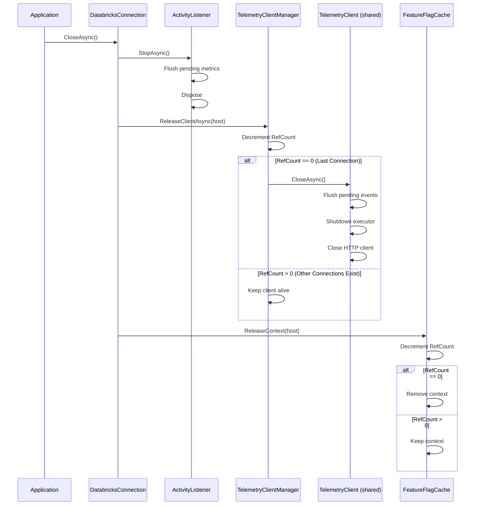

### 9.2 Connection Close Implementation

```csharp
public sealed class DatabricksConnection : AdbcConnection
{
    private string? _host;
    private DatabricksActivityListener? _activityListener;

    protected override async ValueTask DisposeAsyncCore()
    {
        if (_host == null) return;

        try
        {
            // Step 1: Stop activity listener and flush pending metrics
            if (_activityListener != null)
            {
                await _activityListener.StopAsync();
                _activityListener.Dispose();
                _activityListener = null;
            }

            // Step 2: Release telemetry client (decrements ref count, closes if last)
            await TelemetryClientManager.GetInstance().ReleaseClientAsync(_host);

            // Step 3: Release feature flag context (decrements ref count)
            FeatureFlagCache.GetInstance().ReleaseContext(_host);
        }
        catch (Exception ex)
        {
            // Swallow all exceptions per requirement
            Debug.WriteLine($"[TRACE] Error during telemetry cleanup: {ex.Message}");
        }

        // Continue with normal connection cleanup
        await base.DisposeAsyncCore();
    }
}
```

### 9.3 TelemetryClient Close Implementation

```csharp
public sealed class TelemetryClient : ITelemetryClient
{
    private readonly ITelemetryExporter _exporter;
    private readonly CancellationTokenSource _cts = new();
    private readonly Task _backgroundFlushTask;

    public async Task CloseAsync()
    {
        try
        {
            // Step 1: Cancel background flush task
            _cts.Cancel();

            // Step 2: Flush all pending metrics synchronously
            await FlushAsync(force: true);

            // Step 3: Wait for background task to complete (with timeout)
            await _backgroundFlushTask.WaitAsync(TimeSpan.FromSeconds(5));
        }
        catch (Exception ex)
        {
            // Swallow per requirement
            Debug.WriteLine($"[TRACE] Error closing telemetry client: {ex.Message}");
        }
        finally
        {
            _cts.Dispose();
        }
    }
}
```

### 9.4 Reference Counting Example

**TelemetryClientHolder with Reference Counting**:

```csharp
// Connection 1 opens
var client1 = TelemetryClientManager.GetInstance()
    .GetOrCreateClient("host1", httpClient, config);
// RefCount for "host1" = 1

// Connection 2 opens (same host)
var client2 = TelemetryClientManager.GetInstance()
    .GetOrCreateClient("host1", httpClient, config);
// RefCount for "host1" = 2
// client1 == client2 (same instance)

// Connection 1 closes
await TelemetryClientManager.GetInstance().ReleaseClientAsync("host1");
// RefCount for "host1" = 1
// Client NOT closed (other connection still using it)

// Connection 2 closes
await TelemetryClientManager.GetInstance().ReleaseClientAsync("host1");
// RefCount for "host1" = 0
// Client IS closed and removed from cache
```

**Same logic applies to FeatureFlagCache**.

### 9.5 Shutdown Contracts

**TelemetryClientManager**:
- `GetOrCreateClient()`: Atomically increments ref count
- `ReleaseClientAsync()`: Atomically decrements ref count, closes client if zero
- Thread-safe for concurrent access

**FeatureFlagCache**:
- `GetOrCreateContext()`: Atomically increments ref count
- `ReleaseContext()`: Atomically decrements ref count, removes context if zero
- Thread-safe for concurrent access

**TelemetryClient.CloseAsync()**:
- Synchronously flushes all pending metrics (blocks until complete)
- Cancels background flush task
- Disposes resources (HTTP client, executors, etc.)
- Never throws exceptions

**JDBC Reference**: `TelemetryClient.java:105-139` - Synchronous close with flush and executor shutdown.

---

## 10. Testing Strategy

### 10.1 Unit Tests

**DatabricksActivityListener Tests**:
- `Listener_FiltersCorrectActivitySource`
- `Listener_ExtractsTagsFromActivity`
- `Listener_HandlesActivityWithoutTags`
- `Listener_DoesNotThrowOnError`
- `Listener_RespectsFeatureFlag`

**MetricsAggregator Tests**:
- `Aggregator_CombinesActivitiesByStatementId`
- `Aggregator_EmitsOnStatementComplete`
- `Aggregator_HandlesConnectionActivity`
- `Aggregator_FlushesOnBatchSize`
- `Aggregator_FlushesOnTimeInterval`

**TelemetryExporter Tests**:
- Same as original design (endpoints, retry, circuit breaker)

**New Component Tests** (per-host management):
- `FeatureFlagCache_CachesPerHost`
- `FeatureFlagCache_ExpiresAfter15Minutes`
- `FeatureFlagCache_RefCountingWorks`
- `TelemetryClientManager_OneClientPerHost`
- `TelemetryClientManager_RefCountingWorks`
- `TelemetryClientManager_ClosesOnLastRelease`
- `CircuitBreaker_OpensAfterFailures`
- `CircuitBreaker_ClosesAfterSuccesses`
- `CircuitBreaker_PerHostIsolation`
- `ExceptionClassifier_IdentifiesTerminal`
- `ExceptionClassifier_IdentifiesRetryable`
- `MetricsAggregator_BuffersRetryableExceptions`
- `MetricsAggregator_FlushesTerminalImmediately`

### 10.2 Integration Tests

**End-to-End with Activity**:
- `ActivityBased_ConnectionOpen_ExportedSuccessfully`
- `ActivityBased_StatementWithChunks_AggregatedCorrectly`
- `ActivityBased_ErrorActivity_CapturedInMetrics`
- `ActivityBased_FeatureFlagDisabled_NoExport`

**Compatibility Tests**:
- `ActivityBased_CoexistsWithOpenTelemetry`
- `ActivityBased_CorrelationIdPreserved`
- `ActivityBased_ParentChildSpansWork`

**New Integration Tests** (production requirements):
- `MultipleConnections_SameHost_SharesClient`
- `FeatureFlagCache_SharedAcrossConnections`
- `CircuitBreaker_StopsFlushingWhenOpen`
- `GracefulShutdown_LastConnection_ClosesClient`
- `TerminalException_FlushedImmediately`
- `RetryableException_BufferedUntilComplete`

### 10.3 Performance Tests

**Overhead Measurement**:
- `ActivityListener_Overhead_LessThan1Percent`
- `MetricExtraction_Completes_UnderOneMicrosecond`

Compare:
- Baseline: Activity with no listener
- With listener but disabled: Should be ~0% overhead
- With listener enabled: Should be < 1% overhead

### 10.4 Test Coverage Goals

| Component | Unit Test Coverage | Integration Test Coverage |
|-----------|-------------------|---------------------------|
| DatabricksActivityListener | > 90% | > 80% |
| MetricsAggregator | > 90% | > 80% |
| TelemetryExporter | > 90% | > 80% |
| Activity Tag Filtering | 100% | N/A |
| FeatureFlagCache | > 90% | > 80% |
| TelemetryClientManager | > 90% | > 80% |
| CircuitBreaker | > 90% | > 80% |
| ExceptionClassifier | 100% | N/A |

---

## 11. Alternatives Considered

### 11.1 Alternative 1: Separate Telemetry System

**Description**: Create a dedicated telemetry collection system parallel to Activity infrastructure, with explicit TelemetryCollector and TelemetryExporter classes.

**Approach**:
- Add `TelemetryCollector.RecordXXX()` calls at each driver operation
- Maintain separate `TelemetryEvent` data model
- Export via dedicated `TelemetryExporter`
- Manual correlation with distributed traces

**Pros**:
- Independent from Activity API
- Direct control over data collection
- Matches JDBC driver design pattern

**Cons**:
- Duplicate instrumentation at every operation point
- Two parallel data models (Activity + TelemetryEvent)
- Manual correlation between traces and metrics required
- Higher maintenance burden (two systems)
- Increased code complexity

**Why Not Chosen**: The driver already has comprehensive Activity instrumentation. Creating a parallel system would duplicate this effort and increase maintenance complexity without providing significant benefits.

---

### 11.2 Alternative 2: OpenTelemetry Metrics API Directly

**Description**: Use OpenTelemetry's Metrics API (`Meter` and `Counter`/`Histogram`) directly in driver code.

**Approach**:
- Create `Meter` instance for the driver
- Add `Counter.Add()` and `Histogram.Record()` calls at each operation
- Export via OpenTelemetry SDK to Databricks backend

**Pros**:
- Industry standard metrics API
- Built-in aggregation and export
- Native OTEL ecosystem support

**Cons**:
- Still requires separate instrumentation alongside Activity
- Introduces new dependency (OpenTelemetry.Api.Metrics)
- Metrics and traces remain separate systems
- Manual correlation still needed
- Databricks export requires custom OTLP exporter

**Why Not Chosen**: This still creates duplicate instrumentation points. The Activity-based approach allows us to derive metrics from existing Activity data, avoiding code duplication.

---

### 11.3 Alternative 3: Log-Based Metrics

**Description**: Write structured logs at key operations and extract metrics from logs.

**Approach**:
- Use `ILogger` to log structured events
- Include metric-relevant fields (latency, result format, etc.)
- Backend log processor extracts metrics from log entries

**Pros**:
- Simple implementation (just logging)
- No new infrastructure needed
- Flexible data collection

**Cons**:
- High log volume (every operation logged)
- Backend processing complexity
- Delayed metrics (log ingestion lag)
- No built-in aggregation
- Difficult to correlate with distributed traces
- Privacy concerns (logs may contain sensitive data)

**Why Not Chosen**: Log-based metrics are inefficient and lack the structure needed for real-time aggregation. They also complicate privacy compliance.

---

### 11.4 Why Activity-Based Approach Was Chosen

The Activity-based design was selected because it:

**1. Leverages Existing Infrastructure**
- Driver already has comprehensive Activity instrumentation
- No new instrumentation points needed
- Reuses Activity's built-in timing and correlation

**2. Single Source of Truth**
- Activity serves as the data model for both traces and metrics
- Automatic correlation between distributed traces and telemetry metrics
- Consistent data across all observability signals

**3. Minimal Code Changes**
- Only requires adding tags to existing activities
- No duplicate instrumentation code
- Lower maintenance burden

**4. Standards-Based**
- Activity is .NET's standard distributed tracing API
- Works seamlessly with OpenTelemetry ecosystem
- Compatible with existing APM tools

**5. Performance Efficient**
- ActivityListener has minimal overhead
- No duplicate timing or data collection
- Non-blocking by design

**6. Simplicity**
- Easier to understand (one system vs two)
- Easier to test (single instrumentation path)
- Easier to maintain (single codebase)

**Trade-offs Accepted**:
- Coupling to Activity API (acceptable - it's .NET standard)
- Activity tag size limits (adequate for our metrics needs)
- Requires understanding Activity API (but provides better developer experience overall)

---

## 12. Implementation Checklist

### Phase 1: Feature Flag Cache & Per-Host Management
- [ ] Create `FeatureFlagCache` singleton with per-host contexts (in `Apache.Arrow.Adbc.Drivers.Databricks` namespace, not Telemetry)
- [ ] Make cache generic - return all flags, not just telemetry-specific ones
- [ ] Implement `FeatureFlagContext` with reference counting
- [ ] Implement `GetFlagValue(string)` and `GetAllFlags()` methods for generic flag access
- [ ] Implement API call to `/api/2.0/connector-service/feature-flags/OSS_JDBC/{version}` (use JDBC endpoint initially)
- [ ] Parse `FeatureFlagsResponse` with `flags` array and `ttl_seconds`
- [ ] Implement initial blocking fetch on context creation
- [ ] Implement background refresh scheduler using server-provided `ttl_seconds`
- [ ] Add `Shutdown()` method to stop scheduler and cleanup
- [ ] Implement configuration priority: user properties > feature flags > driver defaults
- [ ] Create `TelemetryClientManager` singleton
- [ ] Implement `TelemetryClientHolder` with reference counting
- [ ] Add unit tests for cache behavior and reference counting
- [ ] Add unit tests for background refresh scheduling
- [ ] Add unit tests for configuration priority order

**Code Guidelines**:
- Avoid `#if` preprocessor directives - write code compatible with all target .NET versions (netstandard2.0, net472, net8.0)
- Use polyfills or runtime checks instead of compile-time conditionals where needed

### Phase 2: Circuit Breaker
- [ ] Create `CircuitBreaker` class with state machine
- [ ] Create `CircuitBreakerManager` singleton (per-host breakers)
- [ ] Create `CircuitBreakerTelemetryExporter` wrapper
- [ ] Configure failure thresholds and timeouts
- [ ] Add DEBUG logging for state transitions
- [ ] Add unit tests for circuit breaker logic

### Phase 3: Exception Handling
- [ ] Create `ExceptionClassifier` for terminal vs retryable
- [ ] Update `MetricsAggregator` to buffer retryable exceptions
- [ ] Implement immediate flush for terminal exceptions
- [ ] Wrap all telemetry code in try-catch blocks
- [ ] Replace all logging with TRACE/DEBUG levels only
- [ ] Ensure circuit breaker sees exceptions before swallowing
- [ ] Add unit tests for exception classification

### Phase 4: Tag Definition System
- [ ] Create `TagDefinitions/TelemetryTag.cs` (attribute and enums)
- [ ] Create `TagDefinitions/ConnectionOpenEvent.cs` (connection tag definitions)
- [ ] Create `TagDefinitions/StatementExecutionEvent.cs` (statement tag definitions)
- [ ] Create `TagDefinitions/ErrorEvent.cs` (error tag definitions)
- [ ] Create `TagDefinitions/TelemetryTagRegistry.cs` (central registry)
- [ ] Add unit tests for tag registry

### Phase 5: Core Implementation
- [ ] Create `DatabricksActivityListener` class
- [ ] Create `MetricsAggregator` class (with exception buffering)
- [x] Create `DatabricksTelemetryExporter` class (WI-3.4)
- [ ] Add necessary tags to existing activities (using defined constants)
- [ ] Update connection to use per-host management

### Phase 6: Integration
- [ ] Update `DatabricksConnection.OpenAsync()` to use managers
- [ ] Implement graceful shutdown in `DatabricksConnection.CloseAsync()`
- [ ] Add configuration parsing from connection string
- [ ] Wire up feature flag cache

### Phase 7: Testing
- [ ] Unit tests for all new components
- [ ] Integration tests for per-host management
- [ ] Integration tests for circuit breaker
- [ ] Integration tests for graceful shutdown
- [ ] Performance tests (overhead measurement)
- [ ] Load tests with many concurrent connections

### Phase 8: Documentation
- [ ] Update Activity instrumentation docs
- [ ] Document new activity tags
- [ ] Update configuration guide
- [ ] Add troubleshooting guide

---

## 13. Open Questions

### 13.1 Activity Tag Naming Conventions

**Question**: Should we use OpenTelemetry semantic conventions for tag names?

**Recommendation**: Yes, use OTEL conventions where applicable:
- `db.statement.id` instead of `statement.id`
- `http.response.body.size` instead of `bytes_downloaded`
- `error.type` instead of `error_code`

This ensures compatibility with OTEL ecosystem.

### 13.2 Statement Completion Detection

**Question**: How do we know when a statement is complete for aggregation?

**Options**:
1. **Activity completion**: When statement activity stops (recommended)
2. **Explicit marker**: Call `CompleteStatement(id)` explicitly
3. **Timeout-based**: Emit after N seconds of inactivity

**Recommendation**: Use activity completion - cleaner and automatic.

### 13.3 Performance Impact on Existing Activity Users

**Question**: Will adding tags impact applications that already use Activity for tracing?

**Answer**: Minimal impact:
- Tags are cheap (< 1μs to set)
- Listener is optional (only activated when telemetry enabled)
- Activity overhead already exists

### 13.4 Feature Flag Endpoint Migration

**Question**: When should we migrate from `OSS_JDBC` to `OSS_ADBC` endpoint?

**Current State**: The ADBC driver currently uses the JDBC feature flag endpoint (`/api/2.0/connector-service/feature-flags/OSS_JDBC/{version}`) because the ADBC endpoint is not yet configured on the server side.

**Migration Plan**:
1. Server team configures the `OSS_ADBC` endpoint with appropriate feature flags
2. Update `TelemetryConfiguration.FeatureFlagEndpointFormat` to use `OSS_ADBC`
3. Coordinate with server team on feature flag name (`enableTelemetryForAdbc`)

**Tracking**: Create a follow-up ticket to track this migration once server-side support is ready.

---

## 14. References

### 14.1 Related Documentation

- [.NET Activity API](https://learn.microsoft.com/en-us/dotnet/core/diagnostics/distributed-tracing)
- [OpenTelemetry .NET](https://opentelemetry.io/docs/languages/net/)
- [ActivityListener Documentation](https://learn.microsoft.com/en-us/dotnet/api/system.diagnostics.activitylistener)

### 14.2 Existing Code References

**ADBC Driver**:
- `ActivityTrace.cs`: Existing Activity helper
- `DatabricksAdbcActivitySource`: Existing ActivitySource
- Connection/Statement activities: Already instrumented

**JDBC Driver** (reference implementation):
- `TelemetryClient.java:15`: Main telemetry client with batching and flush
- `TelemetryClientFactory.java:27`: Per-host client management with reference counting
- `TelemetryClientHolder.java:5`: Reference counting holder
- `CircuitBreakerTelemetryPushClient.java:15`: Circuit breaker wrapper
- `CircuitBreakerManager.java:25`: Per-host circuit breaker management
- `TelemetryPushClient.java:86-94`: Exception re-throwing for circuit breaker
- `TelemetryHelper.java:45-46,77`: Feature flag name and checking
- `DatabricksDriverFeatureFlagsContextFactory.java`: Per-host feature flag cache with reference counting
- `DatabricksDriverFeatureFlagsContext.java:30-33`: Feature flag API endpoint format
- `DatabricksDriverFeatureFlagsContext.java:48-58`: Initial fetch and background refresh scheduling
- `DatabricksDriverFeatureFlagsContext.java:89-140`: HTTP call and response parsing
- `FeatureFlagsResponse.java`: Response model with `flags` array and `ttl_seconds`

---

## Summary

This **Activity-based telemetry design** provides an efficient approach to collecting driver metrics by:

1. **Leveraging existing infrastructure**: Extends the driver's comprehensive Activity instrumentation
2. **Single instrumentation point**: Uses Activity as the unified data model for both tracing and metrics
3. **Standard .NET patterns**: Built on Activity/ActivityListener APIs that are platform standards
4. **Minimal code changes**: Only requires adding tags to existing activities
5. **Seamless integration**: Works natively with OpenTelemetry and APM tools

**Key Aggregation Pattern** (following JDBC):
- **Aggregate by `statement_id`**: Multiple activities for the same statement are aggregated together (chunk downloads, polls, etc.)
- **Include `session_id` in exports**: Each exported event contains both `statement_id` (unique per statement) and `session_id` (shared across all statements in a connection)
- **Enable multi-level correlation**: This allows correlation at both statement level ("show me all activities for statement X") and session level ("show me all statements for connection Y")
- **Reference implementation**: See JDBC `TelemetryCollector.java` which uses `ConcurrentHashMap<String, StatementTelemetryDetails>` for per-statement aggregation while including session_id in exported `TelemetryEvent` objects

This design enables the Databricks ADBC driver to collect valuable usage metrics while maintaining code simplicity, high performance, and full compatibility with the .NET observability ecosystem.
