<!--
Copyright (c) 2025 ADBC Drivers Contributors

Licensed under the Apache License, Version 2.0 (the "License");
you may not use this file except in compliance with the License.
You may obtain a copy of the License at

        http://www.apache.org/licenses/LICENSE-2.0

Unless required by applicable law or agreed to in writing, software
distributed under the License is distributed on an "AS IS" BASIS,
WITHOUT WARRANTIES OR CONDITIONS OF ANY KIND, either express or implied.
See the License for the specific language governing permissions and
limitations under the License.
-->

# Databricks ADBC Driver: Activity-Based Telemetry Design V2

## Executive Summary

This document outlines an **Activity-based telemetry design** that leverages the existing Activity/ActivitySource infrastructure in the Databricks ADBC driver. Instead of creating a parallel telemetry system, we extend the current tracing infrastructure to collect metrics and export them to Databricks telemetry service.

**Key Objectives:**
- Reuse existing Activity instrumentation points
- Add metrics collection without duplicating code
- Export aggregated metrics to Databricks service
- Maintain server-side feature flag control
- Preserve backward compatibility with OpenTelemetry

**Design Principles:**
- **Build on existing infrastructure**: Leverage ActivitySource/ActivityListener
- **Single instrumentation point**: Don't duplicate tracing and metrics
- **Non-blocking**: All operations async and non-blocking
- **Privacy-first**: No PII or query data collected
- **Server-controlled**: Feature flag support for enable/disable

**Enhanced Production Requirements** (from JDBC driver experience):
- **Feature flag caching**: Per-host caching to avoid rate limiting
- **Circuit breaker**: Protect against telemetry endpoint failures
- **Exception swallowing**: All telemetry exceptions caught with minimal logging
- **Per-host telemetry client**: One client per host to prevent rate limiting
- **Graceful shutdown**: Proper cleanup with reference counting
- **Smart exception flushing**: Only flush terminal exceptions immediately

---

## Table of Contents

1. [Background & Motivation](#1-background--motivation)
2. [Architecture Overview](#2-architecture-overview)
3. [Core Components](#3-core-components)
    - 3.1 [FeatureFlagCache (Per-Host)](#31-featureflagcache-per-host)
    - 3.2 [TelemetryClientManager (Per-Host)](#32-telemetryclientmanager-per-host)
    - 3.3 [Circuit Breaker](#33-circuit-breaker)
    - 3.4 [DatabricksActivityListener](#34-databricksactivitylistener)
    - 3.5 [MetricsAggregator](#35-metricsaggregator)
    - 3.6 [DatabricksTelemetryExporter](#36-databrickstelemetryexporter)
4. [Data Collection](#4-data-collection)
5. [Export Mechanism](#5-export-mechanism)
6. [Configuration](#6-configuration)
7. [Privacy & Compliance](#7-privacy--compliance)
8. [Error Handling](#8-error-handling)
    - 8.1 [Exception Swallowing Strategy](#81-exception-swallowing-strategy)
    - 8.2 [Terminal vs Retryable Exceptions](#82-terminal-vs-retryable-exceptions)
9. [Graceful Shutdown](#9-graceful-shutdown)
10. [Testing Strategy](#10-testing-strategy)
11. [Alternatives Considered](#11-alternatives-considered)
12. [Implementation Checklist](#12-implementation-checklist)
13. [Open Questions](#13-open-questions)
14. [References](#14-references)

---

## 1. Background & Motivation

### 1.1 Current State

The Databricks ADBC driver already has:
- ✅ **ActivitySource**: `DatabricksAdbcActivitySource`
- ✅ **Activity instrumentation**: Connection, statement execution, result fetching
- ✅ **W3C Trace Context**: Distributed tracing support
- ✅ **ActivityTrace utility**: Helper for creating activities

### 1.2 Design Opportunity

The driver already has comprehensive Activity instrumentation for distributed tracing. This presents an opportunity to:
- Leverage existing Activity infrastructure for both tracing and metrics
- Avoid duplicate instrumentation points in the driver code
- Use a single data model (Activity) for both observability concerns
- Maintain automatic correlation between traces and metrics
- Reduce overall system complexity and maintenance burden

### 1.3 The Approach

**Extend Activity infrastructure** with metrics collection:
- ✅ Single instrumentation point (Activity)
- ✅ Custom ActivityListener for metrics aggregation
- ✅ Export aggregated data to Databricks service
- ✅ Reuse Activity context, correlation, and timing
- ✅ Seamless integration with OpenTelemetry ecosystem

---

## 2. Architecture Overview

### 2.1 High-Level Architecture

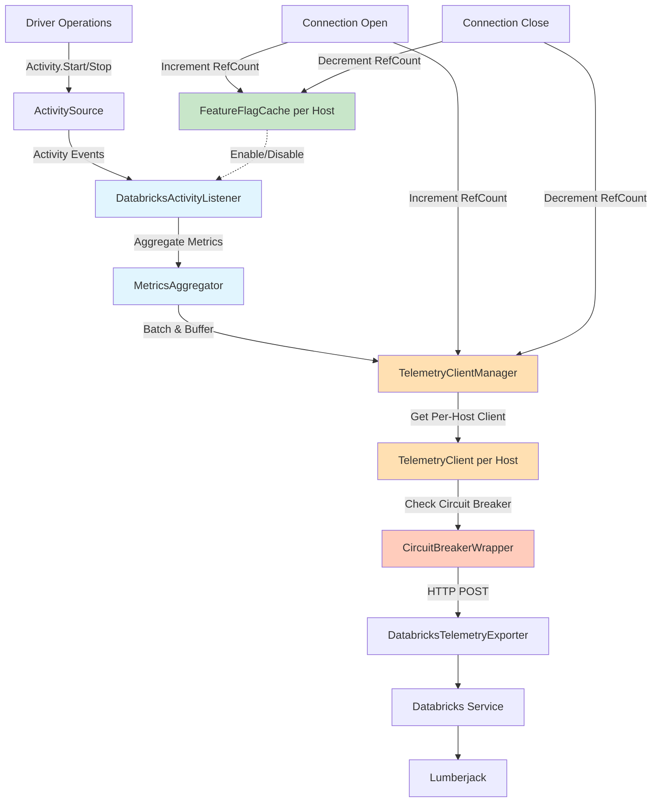
```mermaid
graph TB
    A[Driver Operations] -->|Activity.Start/Stop| B[ActivitySource]
    B -->|Activity Events| C[DatabricksActivityListener]
    C -->|Aggregate Metrics| D[MetricsAggregator]
    D -->|Batch & Buffer| E[TelemetryClientManager]
    E -->|Get Per-Host Client| F[TelemetryClient per Host]
    F -->|Check Circuit Breaker| G[CircuitBreakerWrapper]
    G -->|HTTP POST| H[DatabricksTelemetryExporter]
    H --> I[Databricks Service]
    I --> J[Lumberjack]

    K[FeatureFlagCache per Host] -.->|Enable/Disable| C
    L[Connection Open] -->|Increment RefCount| E
    L -->|Increment RefCount| K
    M[Connection Close] -->|Decrement RefCount| E
    M -->|Decrement RefCount| K

    style C fill:#e1f5fe
    style D fill:#e1f5fe
    style E fill:#ffe0b2
    style F fill:#ffe0b2
    style G fill:#ffccbc
    style K fill:#c8e6c9
```

**Key Components:**
1. **ActivitySource** (existing): Emits activities for all operations
2. **FeatureFlagCache** (new): Per-host caching of feature flags with reference counting
3. **TelemetryClientManager** (new): Manages one telemetry client per host with reference counting
4. **CircuitBreakerWrapper** (new): Protects against failing telemetry endpoint
5. **DatabricksActivityListener** (new): Listens to activities, extracts metrics
6. **MetricsAggregator** (new): Aggregates by statement, batches events
7. **DatabricksTelemetryExporter** (new): Exports to Databricks service

### 2.2 Activity Flow

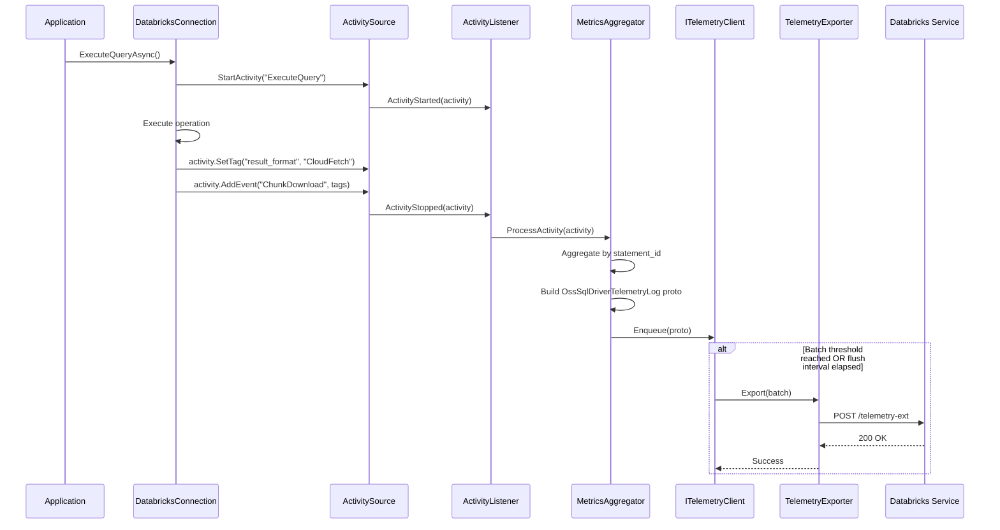
```mermaid
sequenceDiagram
    participant App as Application
    participant Driver as DatabricksConnection
    participant AS as ActivitySource
    participant AL as ActivityListener
    participant MA as MetricsAggregator
    participant TC as ITelemetryClient
    participant Ex as TelemetryExporter
    participant Service as Databricks Service

    App->>Driver: ExecuteQueryAsync()
    Driver->>AS: StartActivity("ExecuteQuery")
    AS->>AL: ActivityStarted(activity)

    Driver->>Driver: Execute operation
    Driver->>AS: activity.SetTag("result_format", "CloudFetch")
    Driver->>AS: activity.AddEvent("ChunkDownload", tags)

    AS->>AL: ActivityStopped(activity)
    AL->>MA: ProcessActivity(activity)
    MA->>MA: Aggregate by statement_id
    MA->>MA: Build OssSqlDriverTelemetryLog proto
    MA->>TC: Enqueue(proto)

    alt Batch threshold reached OR flush interval elapsed
        TC->>Ex: Export(batch)
        Ex->>Service: POST /telemetry-ext
        Service-->>Ex: 200 OK
        Ex-->>TC: Success
    end
```

### 2.3 Activity Hierarchy and Multi-Activity Aggregation

#### Understanding .NET Activity Model

**Key concepts:**
- `ActivityListener` is **global** - it receives callbacks for ALL activities from subscribed ActivitySources
- Each `TraceActivityAsync()` call creates a **new Activity** that starts and stops
- Activities can be **nested** - child activities have a `ParentId` linking to parent
- `AddEvent()` does NOT trigger callbacks - events are stored on the activity and only accessible when it stops
- `ActivityStopped` callback receives the activity with all its tags and events

#### Activities in ADBC Driver

Each method wrapped in `TraceActivityAsync()` creates an activity. Here are the activities in the codebase:

| Activity Name | Parent | Description |
|--------------|--------|-------------|
| `ExecuteQuery` | None (root) | Top-level statement execution |
| `ExecuteUpdate` | None (root) | Top-level update execution |
| `GetCatalogs` | None (root) | Metadata: list catalogs |
| `GetSchemas` | None (root) | Metadata: list schemas |
| `GetTables` | None (root) | Metadata: list tables |
| `GetColumns` | None (root) | Metadata: list columns |
| `DownloadFiles` | ExecuteQuery | CloudFetch download loop |
| `DownloadSingleFile` | DownloadFiles | Single file download |
| `ApplyServerSideProperties` | ExecuteQuery | Server-side property setup |
| `RetryHttpRequest` | Various | HTTP retry wrapper |
| `FetchFeatureFlags` | Various | Feature flag fetch |
| `BackgroundRefresh` | None | Background flag refresh |

#### Activity Hierarchy Example

A single `ExecuteQueryAsync()` call generates multiple activities:

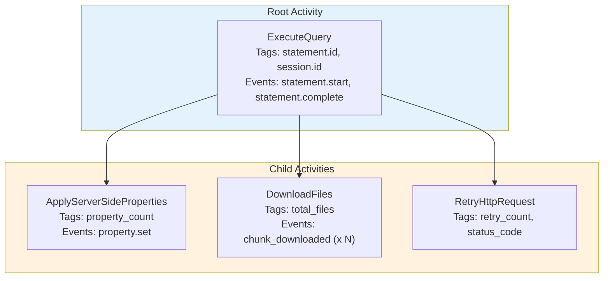
```mermaid
flowchart TD
    subgraph Root["Root Activity"]
        EQ["ExecuteQuery<br/>Tags: statement.id, session.id<br/>Events: statement.start, statement.complete"]
    end

    subgraph Children["Child Activities"]
        ASP["ApplyServerSideProperties<br/>Tags: property_count<br/>Events: property.set"]
        DF["DownloadFiles<br/>Tags: total_files<br/>Events: chunk_downloaded (x N)"]
        RH["RetryHttpRequest<br/>Tags: retry_count, status_code"]
    end

    EQ --> ASP
    EQ --> DF
    EQ --> RH

    style Root fill:#e3f2fd
    style Children fill:#fff3e0
```

#### ActivityListener Callback Sequence

**Important**: The listener receives `ActivityStopped` for EVERY activity, not just root:

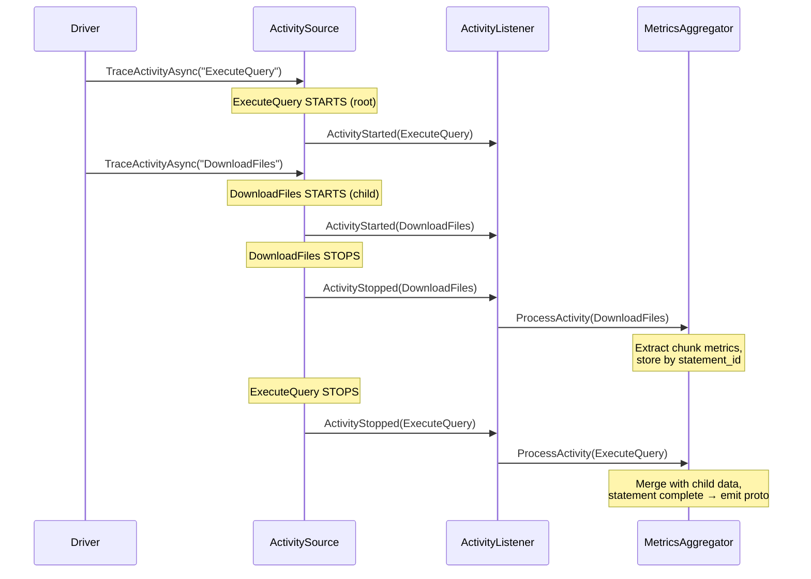
```mermaid
sequenceDiagram
    participant Driver
    participant AS as ActivitySource
    participant AL as ActivityListener
    participant MA as MetricsAggregator

    Driver->>AS: TraceActivityAsync("ExecuteQuery")
    Note over AS: ExecuteQuery STARTS (root)
    AS->>AL: ActivityStarted(ExecuteQuery)

    Driver->>AS: TraceActivityAsync("DownloadFiles")
    Note over AS: DownloadFiles STARTS (child)
    AS->>AL: ActivityStarted(DownloadFiles)

    Note over AS: DownloadFiles STOPS
    AS->>AL: ActivityStopped(DownloadFiles)
    AL->>MA: ProcessActivity(DownloadFiles)
    Note over MA: Extract chunk metrics,<br/>store by statement_id

    Note over AS: ExecuteQuery STOPS
    AS->>AL: ActivityStopped(ExecuteQuery)
    AL->>MA: ProcessActivity(ExecuteQuery)
    Note over MA: Merge with child data,<br/>statement complete → emit proto
```

#### Multi-Activity Aggregation Strategy

Since telemetry data is spread across multiple activities, `MetricsAggregator` must:

1. **Collect from all activities** - Receive `ProcessActivity()` for both parent and children
2. **Key by statement_id** - All activities for same statement share `statement_id` tag
3. **Merge data incrementally** - Each activity adds its tags/events to the context
4. **Emit on root completion** - When root activity stops, all data is aggregated → emit proto

```csharp
internal sealed class MetricsAggregator
{
    private readonly ConcurrentDictionary<string, StatementTelemetryContext> _statements = new();

    public void ProcessActivity(Activity activity)
    {
        var statementId = activity.GetTagItem("statement.id")?.ToString();
        if (string.IsNullOrEmpty(statementId)) return;

        var context = _statements.GetOrAdd(statementId, _ => new StatementTelemetryContext());

        // Merge this activity's data into the context
        context.MergeFrom(activity);

        // Check if this is the root activity completing
        if (IsRootActivity(activity) && activity.Status != ActivityStatusCode.Unset)
        {
            // All child activities have already been processed
            // Now we have complete data → emit proto
            var proto = context.BuildProto();
            _telemetryClient.Enqueue(proto);
            _statements.TryRemove(statementId, out _);
        }
    }

    private bool IsRootActivity(Activity activity)
    {
        // Root activities have no parent OR parent is from different ActivitySource
        return activity.Parent == null ||
               activity.Parent.Source.Name != "Databricks.Adbc.Driver";
    }
}
```

#### Data Merging from Multiple Activities

```csharp
internal class StatementTelemetryContext
{
    // From root ExecuteQuery activity
    public string? SessionId { get; set; }
    public string? StatementId { get; set; }
    public long OperationLatencyMs { get; set; }
    public StatementType StatementType { get; set; }

    // From DownloadFiles child activity
    public ChunkDetails ChunkDetails { get; set; } = new();

    // From polling activities
    public OperationDetail OperationDetail { get; set; } = new();

    public void MergeFrom(Activity activity)
    {
        // Always capture session/statement IDs
        SessionId ??= activity.GetTagItem("session.id")?.ToString();
        StatementId ??= activity.GetTagItem("statement.id")?.ToString();

        // Merge based on activity type
        switch (activity.OperationName)
        {
            case "ExecuteQuery":
            case "ExecuteUpdate":
                OperationLatencyMs = (long)activity.Duration.TotalMilliseconds;
                StatementType = ParseStatementType(activity);
                MergeResultLatency(activity);
                break;

            case "DownloadFiles":
                MergeChunkDetails(activity);
                break;

            case "PollOperationStatus":
                MergePollingMetrics(activity);
                break;
        }
    }

    private void MergeChunkDetails(Activity activity)
    {
        // Extract from activity events
        foreach (var evt in activity.Events.Where(e => e.Name == "cloudfetch.chunk_downloaded"))
        {
            ChunkDetails.TotalChunksIterated++;
            var latency = evt.Tags.FirstOrDefault(t => t.Key == "latency_ms").Value as long? ?? 0;
            ChunkDetails.SumChunksDownloadTimeMillis += latency;
            // Track initial and slowest
            if (ChunkDetails.TotalChunksIterated == 1)
                ChunkDetails.InitialChunkLatencyMillis = latency;
            if (latency > ChunkDetails.SlowestChunkLatencyMillis)
                ChunkDetails.SlowestChunkLatencyMillis = latency;
        }

        // Or from tags if summarized
        if (activity.GetTagItem("cloudfetch.total_chunks") is int total)
            ChunkDetails.TotalChunksPresent = total;
    }
}
```

#### Flush Trigger: When to Emit Proto

The proto is emitted when the **root activity** for a statement stops:

| Trigger | Behavior |
|---------|----------|
| Root activity stops (success) | Emit proto immediately |
| Root activity stops (error) | Emit proto with error_info |
| Connection closes | Flush all pending statement contexts |
| Timeout (optional) | Emit partial proto if statement abandoned |

**Why root activity?**
- All child activities have already stopped (and been processed)
- Child activities stop BEFORE parent (stack unwinding)
- When root stops, we have complete aggregated data

#### Required Activity Tags for Telemetry

**Critical**: .NET Activity tags are NOT inherited by child activities. Each activity must explicitly set the tags needed for routing and aggregation.

**Mandatory tags for ALL activities:**

| Tag | Purpose | Must Be Set By |
|-----|---------|----------------|
| `session.id` | Route to correct aggregator | Parent activity propagates to children |
| `statement.id` | Group activities for same statement | Parent activity propagates to children |

**Activity-specific tags:**

| Activity | Required Tags | Description |
|----------|---------------|-------------|
| `ExecuteQuery` | `session.id`, `statement.id`, `result.format` | Root statement activity |
| `ExecuteUpdate` | `session.id`, `statement.id` | Root update activity |
| `GetCatalogs/Schemas/Tables/Columns` | `session.id`, `statement.id` | Metadata operations |
| `DownloadFiles` | `session.id`, `statement.id`, `cloudfetch.*` | CloudFetch metrics |
| `PollOperationStatus` | `session.id`, `statement.id`, `poll.*` | Polling metrics |

**Tag Propagation Pattern:**

Since child activities don't inherit tags, we must explicitly propagate them:

```csharp
// In root activity (e.g., ExecuteQuery)
return await this.TraceActivityAsync(async activity =>
{
    // Set routing/aggregation tags
    activity?.SetTag("session.id", _connection.SessionId);
    activity?.SetTag("statement.id", statementId);

    // Child activities need these tags too
    await DownloadFilesAsync(activity);  // Pass parent activity
});

// In child activity (e.g., DownloadFiles)
private async Task DownloadFilesAsync(Activity? parentActivity)
{
    return await this.TraceActivityAsync(async activity =>
    {
        // Propagate routing tags from parent
        activity?.SetTag("session.id", parentActivity?.GetTagItem("session.id"));
        activity?.SetTag("statement.id", parentActivity?.GetTagItem("statement.id"));

        // Set child-specific tags
        activity?.SetTag("cloudfetch.total_chunks", totalChunks);
        activity?.SetTag("cloudfetch.initial_latency_ms", initialLatency);
    });
}
```

**Alternative: Use Activity.Current for Propagation**

Since `TraceActivityAsync` sets `Activity.Current`, child activities can read from parent:

```csharp
// In child activity - read from parent via Activity.Current
return await this.TraceActivityAsync(async activity =>
{
    // Get parent's tags via Activity.Current.Parent
    var parent = Activity.Current?.Parent;
    activity?.SetTag("session.id", parent?.GetTagItem("session.id"));
    activity?.SetTag("statement.id", parent?.GetTagItem("statement.id"));

    // Set child-specific tags
    activity?.SetTag("cloudfetch.total_chunks", totalChunks);
});
```

**Implementation Checklist:**

- [ ] Add `session.id` tag to Connection.Open activity
- [ ] Add `statement.id` tag to all statement/metadata activities
- [ ] Propagate `session.id` and `statement.id` to all child activities
- [ ] Add CloudFetch summary tags (`cloudfetch.total_chunks`, `cloudfetch.initial_latency_ms`, etc.)
- [ ] Add polling metrics tags (`poll.count`, `poll.latency_ms`)
- [ ] Verify all activities have routing tags before enabling telemetry

---

## 3. Core Components

### 3.1 FeatureFlagCache (Per-Host)

**Purpose**: Cache **all** feature flag values at the host level to avoid repeated API calls and rate limiting. This is a generic cache that can be used for any driver configuration controlled by server-side feature flags, not just telemetry.

**Location**: `AdbcDrivers.Databricks.FeatureFlagCache` (note: not in Telemetry namespace - this is a general-purpose component)

#### Rationale
- **Generic feature flag support**: Cache returns all flags, allowing any driver feature to be controlled server-side
- **Per-host caching**: Feature flags cached by host (not per connection) to prevent rate limiting
- **Reference counting**: Tracks number of connections per host for proper cleanup
- **Server-controlled TTL**: Refresh interval controlled by server-provided `ttl_seconds` (default: 15 minutes)
- **Background refresh**: Scheduled refresh at server-specified intervals
- **Thread-safe**: Uses ConcurrentDictionary for concurrent access from multiple connections

#### Configuration Priority Order

Feature flags are integrated directly into the existing ADBC driver property parsing logic as an **extra layer** in the property value resolution. The priority order is:

```
1. User-specified properties (highest priority)
2. Feature flags from server
3. Driver default values (lowest priority)
```

**Integration Approach**: Feature flags are merged into the `Properties` dictionary at connection initialization time. This means:
- The existing `Properties.TryGetValue()` pattern continues to work unchanged
- Feature flags are transparently available as properties
- No changes needed to existing property parsing code

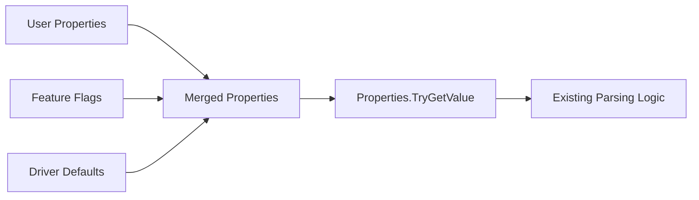
```mermaid
flowchart LR
    A[User Properties] --> D[Merged Properties]
    B[Feature Flags] --> D
    C[Driver Defaults] --> D
    D --> E[Properties.TryGetValue]
    E --> F[Existing Parsing Logic]
```

**Merge Logic** (in `DatabricksConnection` initialization):
```csharp
// Current flow:
// 1. User properties from connection string/config
// 2. Environment properties from DATABRICKS_CONFIG_FILE

// New flow with feature flags:
// 1. User properties from connection string/config (highest priority)
// 2. Feature flags from server (middle priority)
// 3. Environment properties / driver defaults (lowest priority)

private Dictionary<string, string> MergePropertiesWithFeatureFlags(
    Dictionary<string, string> userProperties,
    IReadOnlyDictionary<string, string> featureFlags)
{
    var merged = new Dictionary<string, string>(StringComparer.OrdinalIgnoreCase);

    // Start with feature flags as base (lower priority)
    foreach (var flag in featureFlags)
    {
        // Map feature flag names to property names if needed
        string propertyName = MapFeatureFlagToPropertyName(flag.Key);
        if (propertyName != null)
        {
            merged[propertyName] = flag.Value;
        }
    }

    // Override with user properties (higher priority)
    foreach (var prop in userProperties)
    {
        merged[prop.Key] = prop.Value;
    }

    return merged;
}
```

**Feature Flag to Property Name Mapping**:
```csharp
// Feature flags have long names, map to driver property names
private static readonly Dictionary<string, string> FeatureFlagToPropertyMap = new()
{
    ["databricks.partnerplatform.clientConfigsFeatureFlags.enableTelemetryForAdbc"] = "telemetry.enabled",
    ["databricks.partnerplatform.clientConfigsFeatureFlags.enableCloudFetch"] = "cloudfetch.enabled",
    // ... more mappings
};
```

This approach:
- **Preserves existing code**: All `Properties.TryGetValue()` calls work unchanged
- **Transparent integration**: Feature flags appear as regular properties after merge
- **Clear priority**: User settings always win over server flags
- **Single merge point**: Feature flag integration happens once at connection initialization
- **Fresh values per connection**: Each new connection uses the latest cached feature flag values

#### Per-Connection Property Resolution

Each new connection applies property merging with the **latest** cached feature flag values:

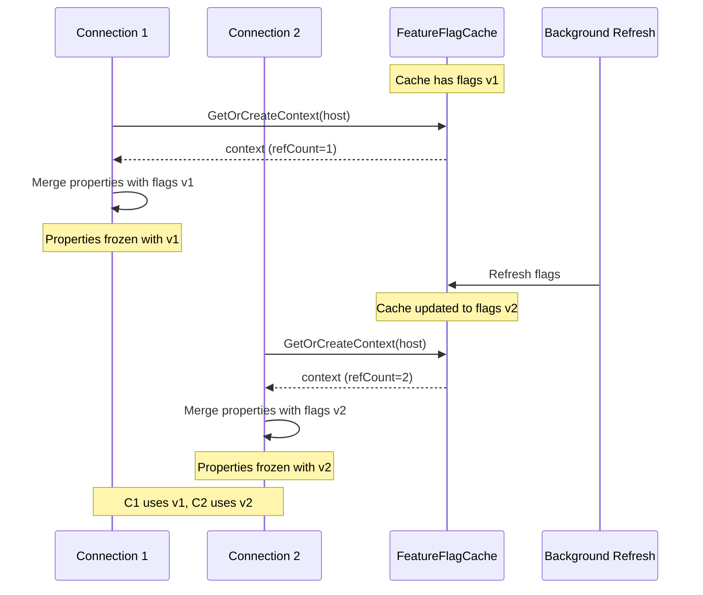
```mermaid
sequenceDiagram
    participant C1 as Connection 1
    participant C2 as Connection 2
    participant FFC as FeatureFlagCache
    participant BG as Background Refresh

    Note over FFC: Cache has flags v1

    C1->>FFC: GetOrCreateContext(host)
    FFC-->>C1: context (refCount=1)
    C1->>C1: Merge properties with flags v1
    Note over C1: Properties frozen with v1

    BG->>FFC: Refresh flags
    Note over FFC: Cache updated to flags v2

    C2->>FFC: GetOrCreateContext(host)
    FFC-->>C2: context (refCount=2)
    C2->>C2: Merge properties with flags v2
    Note over C2: Properties frozen with v2

    Note over C1,C2: C1 uses v1, C2 uses v2
```

**Key Points**:
- **Shared cache, per-connection merge**: The `FeatureFlagCache` is shared (per-host), but property merging happens at each connection initialization
- **Latest values for new connections**: When a new connection is created, it reads the current cached values (which may have been updated by background refresh)
- **Stable within connection**: Once merged, a connection's `Properties` are stable for its lifetime (no mid-connection changes)
- **Background refresh benefits new connections**: The scheduled refresh ensures new connections get up-to-date flag values without waiting for a fetch

#### Feature Flag API

**Endpoint**: `GET /api/2.0/connector-service/feature-flags/OSS_JDBC/{driver_version}`

> **Note**: Currently using the JDBC endpoint (`OSS_JDBC`) until the ADBC endpoint (`OSS_ADBC`) is configured server-side. The feature flag name will still use `enableTelemetryForAdbc` to distinguish ADBC telemetry from JDBC telemetry.

Where `{driver_version}` is the driver version (e.g., `1.0.0`).

**Request Headers**:
- `Authorization`: Bearer token (same as connection auth)
- `User-Agent`: Custom user agent for connector service

**Response Format** (JSON):
```json
{
  "flags": [
    {
      "name": "databricks.partnerplatform.clientConfigsFeatureFlags.enableTelemetryForAdbc",
      "value": "true"
    },
    {
      "name": "databricks.partnerplatform.clientConfigsFeatureFlags.enableCloudFetch",
      "value": "true"
    },
    {
      "name": "databricks.partnerplatform.clientConfigsFeatureFlags.maxDownloadThreads",
      "value": "10"
    }
  ],
  "ttl_seconds": 900
}
```

**Response Fields**:
- `flags`: Array of feature flag entries with `name` and `value` (string). Names can be mapped to driver property names.
- `ttl_seconds`: Server-controlled refresh interval in seconds (default: 900 = 15 minutes)

**JDBC Reference**: See `DatabricksDriverFeatureFlagsContext.java:30-33` for endpoint format.

#### Refresh Strategy

The feature flag cache follows the JDBC driver pattern:

1. **Initial Blocking Fetch**: On connection open, make a blocking HTTP call to fetch all feature flags
2. **Cache All Flags**: Store all returned flags in a local cache (Guava Cache in JDBC, ConcurrentDictionary in C#)
3. **Scheduled Background Refresh**: Start a daemon thread that refreshes flags at intervals based on `ttl_seconds`
4. **Dynamic TTL**: If server returns a different `ttl_seconds`, reschedule the refresh interval

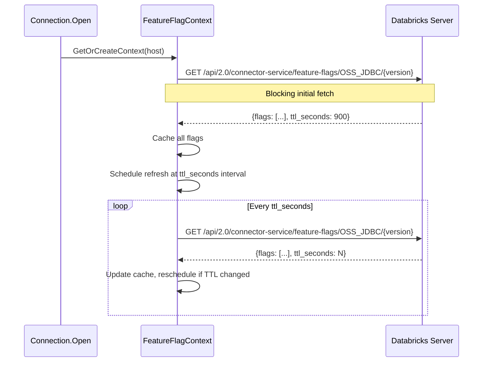
```mermaid
sequenceDiagram
    participant Conn as Connection.Open
    participant FFC as FeatureFlagContext
    participant Server as Databricks Server

    Conn->>FFC: GetOrCreateContext(host)
    FFC->>Server: GET /api/2.0/connector-service/feature-flags/OSS_JDBC/{version}
    Note over FFC,Server: Blocking initial fetch
    Server-->>FFC: {flags: [...], ttl_seconds: 900}
    FFC->>FFC: Cache all flags
    FFC->>FFC: Schedule refresh at ttl_seconds interval

    loop Every ttl_seconds
        FFC->>Server: GET /api/2.0/connector-service/feature-flags/OSS_JDBC/{version}
        Server-->>FFC: {flags: [...], ttl_seconds: N}
        FFC->>FFC: Update cache, reschedule if TTL changed
    end
```

**JDBC Reference**: See `DatabricksDriverFeatureFlagsContext.java:48-58` for initial fetch and scheduling.

#### HTTP Client Pattern

The feature flag cache does **not** use a separate dedicated HTTP client. Instead, it reuses the connection's existing HTTP client infrastructure:

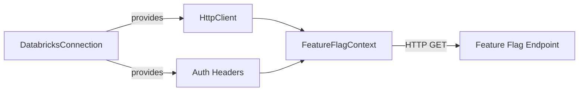
```mermaid
graph LR
    A[DatabricksConnection] -->|provides| B[HttpClient]
    A -->|provides| C[Auth Headers]
    B --> D[FeatureFlagContext]
    C --> D
    D -->|HTTP GET| E[Feature Flag Endpoint]
```

**Key Points**:
1. **Reuse connection's HttpClient**: The `FeatureFlagContext` receives the connection's `HttpClient` (already configured with base address, timeouts, etc.)
2. **Reuse connection's authentication**: Auth headers (Bearer token) come from the connection's authentication mechanism
3. **Custom User-Agent**: Set a connector-service-specific User-Agent header for the feature flag requests

**JDBC Implementation** (`DatabricksDriverFeatureFlagsContext.java:89-105`):
```java
// Get shared HTTP client from connection
IDatabricksHttpClient httpClient =
    DatabricksHttpClientFactory.getInstance().getClient(connectionContext);

// Create request
HttpGet request = new HttpGet(featureFlagEndpoint);

// Set custom User-Agent for connector service
request.setHeader("User-Agent",
    UserAgentManager.buildUserAgentForConnectorService(connectionContext));

// Add auth headers from connection's auth config
DatabricksClientConfiguratorManager.getInstance()
    .getConfigurator(connectionContext)
    .getDatabricksConfig()
    .authenticate()
    .forEach(request::addHeader);
```

**C# Equivalent Pattern**:
```csharp
// In DatabricksConnection - create HttpClient for feature flags
private HttpClient CreateFeatureFlagHttpClient()
{
    var handler = HiveServer2TlsImpl.NewHttpClientHandler(TlsOptions, _proxyConfigurator);
    var httpClient = new HttpClient(handler);

    // Set base address
    httpClient.BaseAddress = new Uri($"https://{_host}");

    // Set auth header (reuse connection's token)
    if (Properties.TryGetValue(SparkParameters.Token, out string? token))
    {
        httpClient.DefaultRequestHeaders.Authorization =
            new AuthenticationHeaderValue("Bearer", token);
    }

    // Set custom User-Agent for connector service
    httpClient.DefaultRequestHeaders.UserAgent.ParseAdd(
        BuildConnectorServiceUserAgent());

    return httpClient;
}

// Pass to FeatureFlagContext
var context = featureFlagCache.GetOrCreateContext(_host, CreateFeatureFlagHttpClient());
```

This approach:
- Avoids duplicating HTTP client configuration
- Ensures consistent authentication across all API calls
- Allows proper resource cleanup when connection closes

#### Interface

```csharp
namespace AdbcDrivers.Databricks
{
    /// <summary>
    /// Singleton that manages feature flag cache per host.
    /// Prevents rate limiting by caching feature flag responses.
    /// This is a generic cache for all feature flags, not just telemetry.
    /// </summary>
    internal sealed class FeatureFlagCache
    {
        private static readonly FeatureFlagCache s_instance = new FeatureFlagCache();
        public static FeatureFlagCache GetInstance() => s_instance;

        /// <summary>
        /// Gets or creates a feature flag context for the host.
        /// Increments reference count.
        /// Makes initial blocking fetch if context is new.
        /// </summary>
        public FeatureFlagContext GetOrCreateContext(string host, HttpClient httpClient, string driverVersion);

        /// <summary>
        /// Decrements reference count for the host.
        /// Removes context and stops refresh scheduler when ref count reaches zero.
        /// </summary>
        public void ReleaseContext(string host);
    }

    /// <summary>
    /// Holds feature flag state and reference count for a host.
    /// Manages background refresh scheduling.
    /// Uses the HttpClient provided by the connection for API calls.
    /// </summary>
    internal sealed class FeatureFlagContext : IDisposable
    {
        /// <summary>
        /// Creates a new context with the given HTTP client.
        /// Makes initial blocking fetch to populate cache.
        /// Starts background refresh scheduler.
        /// </summary>
        /// <param name="host">The Databricks host.</param>
        /// <param name="httpClient">
        /// HttpClient from the connection, pre-configured with:
        /// - Base address (https://{host})
        /// - Auth headers (Bearer token)
        /// - Custom User-Agent for connector service
        /// </param>
        public FeatureFlagContext(string host, HttpClient httpClient);

        public int RefCount { get; }
        public TimeSpan RefreshInterval { get; }  // From server ttl_seconds

        /// <summary>
        /// Gets a feature flag value by name.
        /// Returns null if the flag is not found.
        /// </summary>
        public string? GetFlagValue(string flagName);

        /// <summary>
        /// Checks if a feature flag is enabled (value is "true").
        /// Returns false if flag is not found or value is not "true".
        /// </summary>
        public bool IsFeatureEnabled(string flagName);

        /// <summary>
        /// Gets all cached feature flags as a dictionary.
        /// Can be used to merge with user properties.
        /// </summary>
        public IReadOnlyDictionary<string, string> GetAllFlags();

        /// <summary>
        /// Stops the background refresh scheduler.
        /// </summary>
        public void Shutdown();

        public void Dispose();
    }

    /// <summary>
    /// Response model for feature flags API.
    /// </summary>
    internal sealed class FeatureFlagsResponse
    {
        public List<FeatureFlagEntry>? Flags { get; set; }
        public int? TtlSeconds { get; set; }
    }

    internal sealed class FeatureFlagEntry
    {
        public string Name { get; set; } = string.Empty;
        public string Value { get; set; } = string.Empty;
    }
}
```

#### Usage Example

```csharp
// In DatabricksConnection constructor/initialization
// This runs for EACH new connection, using LATEST cached feature flags

// Step 1: Get or create feature flag context
// - If context exists: returns existing context with latest cached flags
// - If new: creates context, does initial blocking fetch, starts background refresh
var featureFlagCache = FeatureFlagCache.GetInstance();
var featureFlagContext = featureFlagCache.GetOrCreateContext(_host, CreateFeatureFlagHttpClient());

// Step 2: Merge feature flags into properties using LATEST cached values
// Each new connection gets a fresh merge with current flag values
Properties = MergePropertiesWithFeatureFlags(
    userProperties,
    featureFlagContext.GetAllFlags());  // Returns current cached flags

// Step 3: Existing property parsing works unchanged!
// Feature flags are now transparently available as properties
bool IsTelemetryEnabled()
{
    // This works whether the value came from:
    // - User property (highest priority)
    // - Feature flag (merged in)
    // - Or falls back to driver default
    if (Properties.TryGetValue("telemetry.enabled", out var value))
    {
        return bool.TryParse(value, out var result) && result;
    }
    return true; // Driver default
}

// Same pattern for all other properties - no changes needed!
if (Properties.TryGetValue(DatabricksParameters.CloudFetchEnabled, out var cfValue))
{
    // Value could be from user OR from feature flag - transparent!
}
```

**Key Benefits**:
- Existing code like `Properties.TryGetValue()` continues to work unchanged
- Each new connection uses the **latest** cached feature flag values
- Feature flag integration is a one-time merge at connection initialization
- Properties are stable for the lifetime of the connection (no mid-connection changes)

**JDBC Reference**: `DatabricksDriverFeatureFlagsContextFactory.java:27` maintains per-compute (host) feature flag contexts with reference counting. `DatabricksDriverFeatureFlagsContext.java` implements the caching, refresh scheduling, and API calls.

---

### 3.2 TelemetryClientManager and ITelemetryClient (Per-Host)

**Purpose**: Manage one telemetry client per host to prevent rate limiting from concurrent connections.

**Location**: `Apache.Arrow.Adbc.Drivers.Databricks.Telemetry.TelemetryClientManager`

#### Component Ownership Model

Understanding which components are per-connection vs per-host is critical:

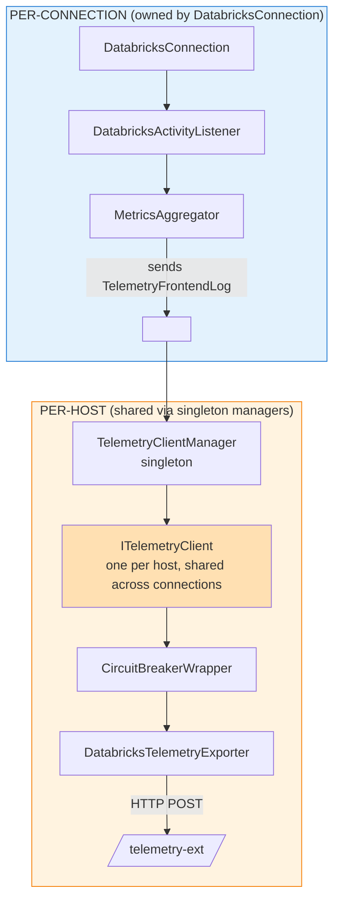
```mermaid
flowchart TB
    subgraph PerConnection["PER-CONNECTION (owned by DatabricksConnection)"]
        direction TB
        DC[DatabricksConnection]
        DC --> DAL[DatabricksActivityListener]
        DAL --> MA[MetricsAggregator]
        MA -->|sends TelemetryFrontendLog| boundary[ ]
    end

    subgraph PerHost["PER-HOST (shared via singleton managers)"]
        direction TB
        TCM[TelemetryClientManager<br/>singleton]
        TCM --> ITC[ITelemetryClient<br/>one per host, shared across connections]
        ITC --> CBW[CircuitBreakerWrapper]
        CBW --> DTE[DatabricksTelemetryExporter]
        DTE -->|HTTP POST| EP[/telemetry-ext/]
    end

    boundary --> TCM

    style PerConnection fill:#e3f2fd,stroke:#1976d2
    style PerHost fill:#fff3e0,stroke:#f57c00
    style ITC fill:#ffe0b2
```

**ITelemetryClient responsibilities:**
- Receives events from multiple MetricsAggregators
- Batches events from all connections to same host
- Single flush timer per host

#### Why Two Levels of Batching?

| Component | Level | Batching Role |
|-----------|-------|---------------|
| **MetricsAggregator** | Per-connection | Aggregates multiple activities for the same `statement_id` into one proto message |
| **ITelemetryClient** | Per-host | Batches proto messages from all connections before HTTP export |

**Example flow with 2 connections:**

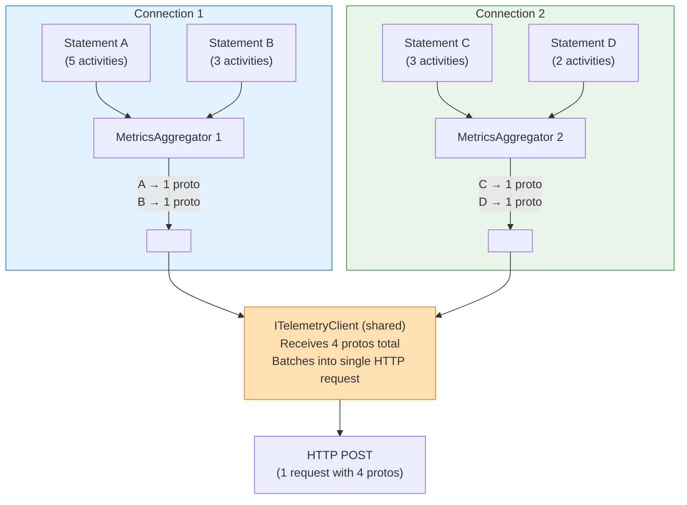
```mermaid
flowchart TB
    subgraph Conn1["Connection 1"]
        S1A["Statement A<br/>(5 activities)"]
        S1B["Statement B<br/>(3 activities)"]
        MA1["MetricsAggregator 1"]
        S1A --> MA1
        S1B --> MA1
        MA1 -->|"A → 1 proto<br/>B → 1 proto"| out1[ ]
    end

    subgraph Conn2["Connection 2"]
        S2C["Statement C<br/>(3 activities)"]
        S2D["Statement D<br/>(2 activities)"]
        MA2["MetricsAggregator 2"]
        S2C --> MA2
        S2D --> MA2
        MA2 -->|"C → 1 proto<br/>D → 1 proto"| out2[ ]
    end

    out1 --> ITC["ITelemetryClient (shared)<br/>Receives 4 protos total<br/>Batches into single HTTP request"]
    out2 --> ITC

    ITC --> HTTP["HTTP POST<br/>(1 request with 4 protos)"]

    style Conn1 fill:#e3f2fd,stroke:#1976d2
    style Conn2 fill:#e8f5e9,stroke:#388e3c
    style ITC fill:#ffe0b2,stroke:#f57c00
```

Without per-host sharing, each connection would make separate HTTP requests, potentially hitting rate limits.

#### Rationale
- **One client per host**: Large customers (e.g., Celonis) open many parallel connections to the same host
- **Prevents rate limiting**: Shared client batches events from all connections, avoiding multiple concurrent flushes
- **Reference counting**: Tracks active connections, only closes client when last connection closes
- **Thread-safe**: Safe for concurrent access from multiple connections
- **Single flush schedule**: One timer per host, not per connection

#### ITelemetryClient Interface

```csharp
namespace AdbcDrivers.Databricks.Telemetry
{
    /// <summary>
    /// Client that receives telemetry events from MetricsAggregators and exports them.
    /// One instance is shared per host via TelemetryClientManager.
    /// </summary>
    internal interface ITelemetryClient : IAsyncDisposable
    {
        /// <summary>
        /// Queue a telemetry log for export. Non-blocking, thread-safe.
        /// Events are batched and flushed periodically or when batch size is reached.
        /// Called by MetricsAggregator when a statement completes.
        /// </summary>
        void Enqueue(TelemetryFrontendLog log);

        /// <summary>
        /// Force flush all pending events immediately.
        /// Called when connection closes to ensure no events are lost.
        /// </summary>
        Task FlushAsync(CancellationToken ct = default);

        /// <summary>
        /// Gracefully close the client. Flushes pending events first.
        /// Called by TelemetryClientManager when reference count reaches zero.
        /// </summary>
        Task CloseAsync();
    }
}
```

#### TelemetryClient Implementation

```csharp
namespace AdbcDrivers.Databricks.Telemetry
{
    /// <summary>
    /// Default implementation that batches events from multiple connections
    /// and exports via HTTP on a timer or when batch size is reached.
    /// </summary>
    internal sealed class TelemetryClient : ITelemetryClient
    {
        private readonly ConcurrentQueue<TelemetryFrontendLog> _queue = new();
        private readonly ITelemetryExporter _exporter;
        private readonly TelemetryConfiguration _config;
        private readonly Timer _flushTimer;
        private readonly SemaphoreSlim _flushLock = new(1, 1);
        private readonly CancellationTokenSource _cts = new();
        private volatile bool _disposed;

        public TelemetryClient(
            ITelemetryExporter exporter,
            TelemetryConfiguration config)
        {
            _exporter = exporter;
            _config = config;

            // Start periodic flush timer (default: every 5 seconds)
            _flushTimer = new Timer(
                OnFlushTimer,
                null,
                _config.FlushIntervalMs,
                _config.FlushIntervalMs);
        }

        /// <summary>
        /// Queue event for batched export. Thread-safe, non-blocking.
        /// </summary>
        public void Enqueue(TelemetryFrontendLog log)
        {
            if (_disposed) return;

            _queue.Enqueue(log);

            // Trigger flush if batch size reached
            if (_queue.Count >= _config.BatchSize)
            {
                _ = FlushAsync(); // Fire-and-forget, errors swallowed
            }
        }

        /// <summary>
        /// Flush all pending events to the exporter.
        /// </summary>
        public async Task FlushAsync(CancellationToken ct = default)
        {
            if (_disposed) return;

            // Prevent concurrent flushes
            if (!await _flushLock.WaitAsync(0, ct))
                return;

            try
            {
                var batch = new List<TelemetryFrontendLog>();

                // Drain queue up to batch size
                while (batch.Count < _config.BatchSize && _queue.TryDequeue(out var log))
                {
                    batch.Add(log);
                }

                if (batch.Count > 0)
                {
                    // Export via circuit breaker → exporter → HTTP
                    await _exporter.ExportAsync(batch, ct);
                }
            }
            catch (Exception ex)
            {
                // Swallow all exceptions per telemetry requirement
                Debug.WriteLine($"[TRACE] TelemetryClient flush error: {ex.Message}");
            }
            finally
            {
                _flushLock.Release();
            }
        }

        /// <summary>
        /// Gracefully close: stop timer, flush remaining events.
        /// </summary>
        public async Task CloseAsync()
        {
            if (_disposed) return;
            _disposed = true;

            try
            {
                // Stop timer
                await _flushTimer.DisposeAsync();

                // Cancel any pending operations
                _cts.Cancel();

                // Final flush of remaining events
                await FlushAsync();
            }
            catch (Exception ex)
            {
                Debug.WriteLine($"[TRACE] TelemetryClient close error: {ex.Message}");
            }
            finally
            {
                _cts.Dispose();
                _flushLock.Dispose();
            }
        }

        public async ValueTask DisposeAsync() => await CloseAsync();

        private void OnFlushTimer(object? state)
        {
            if (_disposed) return;
            _ = FlushAsync(_cts.Token);
        }
    }
}
```

#### TelemetryClientManager Interface

```csharp
namespace AdbcDrivers.Databricks.Telemetry
{
    /// <summary>
    /// Singleton factory that manages one telemetry client per host.
    /// Prevents rate limiting by sharing clients across connections.
    /// </summary>
    internal sealed class TelemetryClientManager
    {
        private static readonly TelemetryClientManager Instance = new();
        public static TelemetryClientManager GetInstance() => Instance;

        private readonly ConcurrentDictionary<string, TelemetryClientHolder> _clients = new();

        /// <summary>
        /// Gets or creates a telemetry client for the host.
        /// Increments reference count. Thread-safe.
        /// </summary>
        public ITelemetryClient GetOrCreateClient(
            string host,
            Func<ITelemetryExporter> exporterFactory,
            TelemetryConfiguration config)
        {
            var holder = _clients.AddOrUpdate(
                host,
                _ => new TelemetryClientHolder(
                    new TelemetryClient(exporterFactory(), config)),
                (_, existing) =>
                {
                    Interlocked.Increment(ref existing._refCount);
                    return existing;
                });

            return holder.Client;
        }

        /// <summary>
        /// Decrements reference count for the host.
        /// Closes and removes client when ref count reaches zero.
        /// </summary>
        public async Task ReleaseClientAsync(string host)
        {
            if (_clients.TryGetValue(host, out var holder))
            {
                var newCount = Interlocked.Decrement(ref holder._refCount);
                if (newCount == 0)
                {
                    if (_clients.TryRemove(host, out var removed))
                    {
                        await removed.Client.CloseAsync();
                    }
                }
            }
        }
    }

    /// <summary>
    /// Holds a telemetry client and its reference count.
    /// </summary>
    internal sealed class TelemetryClientHolder
    {
        internal int _refCount = 1;

        public ITelemetryClient Client { get; }

        public TelemetryClientHolder(ITelemetryClient client)
        {
            Client = client;
        }
    }
}
```

#### Usage in DatabricksConnection

```csharp
public sealed class DatabricksConnection : SparkHttpConnection
{
    private ITelemetryClient? _telemetryClient;
    private MetricsAggregator? _metricsAggregator;
    private DatabricksActivityListener? _activityListener;

    protected override async Task OpenAsyncCore(CancellationToken ct)
    {
        await base.OpenAsyncCore(ct);

        // Get shared telemetry client for this host
        if (_telemetryConfig.Enabled && IsTelemetryFeatureFlagEnabled())
        {
            _telemetryClient = TelemetryClientManager.GetInstance()
                .GetOrCreateClient(
                    _host,
                    () => CreateTelemetryExporter(),  // Factory for lazy creation
                    _telemetryConfig);

            // Create per-connection aggregator that sends to shared client
            _metricsAggregator = new MetricsAggregator(_telemetryClient, _telemetryConfig);

            // Create listener that feeds the aggregator
            _activityListener = new DatabricksActivityListener(_metricsAggregator);
            _activityListener.Start();
        }
    }

    protected override async ValueTask DisposeAsyncCore()
    {
        // Stop listener first
        if (_activityListener != null)
        {
            await _activityListener.StopAsync();
            _activityListener.Dispose();
        }

        // Flush aggregator
        if (_metricsAggregator != null)
        {
            await _metricsAggregator.FlushAsync();
            _metricsAggregator.Dispose();
        }

        // Release shared client (decrements ref count)
        if (_telemetryClient != null)
        {
            await TelemetryClientManager.GetInstance().ReleaseClientAsync(_host);
        }

        await base.DisposeAsyncCore();
    }

    private ITelemetryExporter CreateTelemetryExporter()
    {
        var innerExporter = new DatabricksTelemetryExporter(_httpClient, _host, _telemetryConfig);
        return new CircuitBreakerTelemetryExporter(_host, innerExporter);
    }
}
```

#### Summary: Component Responsibilities

| Component | Level | Responsibility |
|-----------|-------|----------------|
| **DatabricksActivityListener** | Per-connection | Listens to Activity events, forwards to aggregator |
| **MetricsAggregator** | Per-connection | Aggregates activities by `statement_id` into proto messages |
| **ITelemetryClient** | Per-host (shared) | Batches protos from all connections, manages flush timer |
| **CircuitBreakerWrapper** | Per-host (shared) | Protects against endpoint failures |
| **DatabricksTelemetryExporter** | Per-host (shared) | HTTP POST to `/telemetry-ext` |
| **TelemetryClientManager** | Global singleton | Manages per-host clients with reference counting |

**JDBC Reference**: `TelemetryClientFactory.java:27` maintains `ConcurrentHashMap<String, TelemetryClientHolder>` with per-host clients and reference counting. `TelemetryClient.java` implements the batching queue and flush timer.

#### Test Injection Pattern

For integration and E2E tests, we need to inject a custom telemetry exporter to capture telemetry logs without making real HTTP calls. The design supports this through two mechanisms:

**1. Connection-Level Exporter Factory Override**

```csharp
public sealed class DatabricksConnection : SparkHttpConnection
{
    /// <summary>
    /// For testing only: allows injecting a custom exporter factory.
    /// When set, this factory is used instead of the default DatabricksTelemetryExporter.
    /// </summary>
    internal Func<ITelemetryExporter>? TestExporterFactory { get; set; }

    private ITelemetryExporter CreateTelemetryExporter()
    {
        // Use test factory if provided
        if (TestExporterFactory != null)
        {
            return TestExporterFactory();
        }

        // Default: create real exporter with circuit breaker
        var innerExporter = new DatabricksTelemetryExporter(_httpClient, _host, _telemetryConfig);
        return new CircuitBreakerTelemetryExporter(_host, innerExporter);
    }
}
```

**2. TelemetryClientManager Test Instance Replacement**

For tests that need to verify multiple connections share the same client:

```csharp
internal sealed class TelemetryClientManager
{
    private static TelemetryClientManager _instance = new();
    public static TelemetryClientManager Instance => _instance;

    /// <summary>
    /// For testing only: temporarily replaces the singleton instance.
    /// Returns IDisposable that restores the original on dispose.
    /// </summary>
    internal static IDisposable UseTestInstance(TelemetryClientManager testInstance)
    {
        var original = _instance;
        _instance = testInstance;
        return new TestInstanceScope(original);
    }

    private sealed class TestInstanceScope : IDisposable
    {
        private readonly TelemetryClientManager _original;
        public TestInstanceScope(TelemetryClientManager original) => _original = original;
        public void Dispose() => _instance = _original;
    }

    /// <summary>
    /// For testing only: resets all state (clears all clients).
    /// </summary>
    internal void Reset()
    {
        foreach (var host in _clients.Keys.ToList())
        {
            if (_clients.TryRemove(host, out var holder))
            {
                holder.Client.CloseAsync().GetAwaiter().GetResult();
            }
        }
    }
}
```

**3. CreateConnectionWithTelemetry Test Helper**

```csharp
/// <summary>
/// Test helper that creates a connection with injected telemetry exporter.
/// </summary>
internal static class TelemetryTestHelpers
{
    public static async Task<DatabricksConnection> CreateConnectionWithTelemetry(
        ITelemetryExporter mockExporter,
        IReadOnlyDictionary<string, string>? additionalProperties = null)
    {
        // Build connection properties from environment
        var properties = new Dictionary<string, string>
        {
            [DatabricksParameters.HOST] = Environment.GetEnvironmentVariable("DATABRICKS_HOST") ?? "",
            [DatabricksParameters.AUTH_TOKEN] = Environment.GetEnvironmentVariable("DATABRICKS_TOKEN") ?? "",
            [DatabricksParameters.HTTP_PATH] = Environment.GetEnvironmentVariable("DATABRICKS_HTTP_PATH") ?? "",
            [DatabricksParameters.TELEMETRY_ENABLED] = "true"
        };

        // Merge additional properties
        if (additionalProperties != null)
        {
            foreach (var kvp in additionalProperties)
            {
                properties[kvp.Key] = kvp.Value;
            }
        }

        var connection = new DatabricksConnection(properties);

        // Inject the mock exporter factory
        connection.TestExporterFactory = () => mockExporter;

        await connection.OpenAsync();
        return connection;
    }

    /// <summary>
    /// Creates a connection with a capturing exporter for testing.
    /// </summary>
    public static async Task<(DatabricksConnection Connection, List<TelemetryFrontendLog> CapturedLogs)>
        CreateConnectionWithCapturingTelemetry(
            IReadOnlyDictionary<string, string>? additionalProperties = null)
    {
        var capturedLogs = new List<TelemetryFrontendLog>();
        var mockExporter = new CapturingTelemetryExporter(capturedLogs);
        var connection = await CreateConnectionWithTelemetry(mockExporter, additionalProperties);
        return (connection, capturedLogs);
    }
}
```

**Test Flow Diagram:**

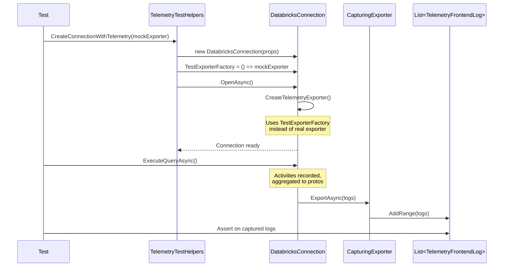
```mermaid
sequenceDiagram
    participant Test
    participant Helper as TelemetryTestHelpers
    participant Conn as DatabricksConnection
    participant Exporter as CapturingExporter
    participant Logs as List<TelemetryFrontendLog>

    Test->>Helper: CreateConnectionWithTelemetry(mockExporter)
    Helper->>Conn: new DatabricksConnection(props)
    Helper->>Conn: TestExporterFactory = () => mockExporter
    Helper->>Conn: OpenAsync()
    Conn->>Conn: CreateTelemetryExporter()
    Note over Conn: Uses TestExporterFactory<br/>instead of real exporter
    Conn-->>Helper: Connection ready

    Test->>Conn: ExecuteQueryAsync()
    Note over Conn: Activities recorded,<br/>aggregated to protos
    Conn->>Exporter: ExportAsync(logs)
    Exporter->>Logs: AddRange(logs)

    Test->>Logs: Assert on captured logs
```

---

### 3.3 Circuit Breaker

**Purpose**: Implement circuit breaker pattern to protect against failing telemetry endpoint.

**Location**: `Apache.Arrow.Adbc.Drivers.Databricks.Telemetry.CircuitBreaker`

#### Rationale
- **Endpoint protection**: The telemetry endpoint itself may fail or become unavailable
- **Not just rate limiting**: Protects against 5xx errors, timeouts, network failures
- **Resource efficiency**: Prevents wasting resources on a failing endpoint
- **Auto-recovery**: Automatically detects when endpoint becomes healthy again

#### States
1. **Closed**: Normal operation, requests pass through
2. **Open**: After threshold failures, all requests rejected immediately (drop events)
3. **Half-Open**: After timeout, allows test requests to check if endpoint recovered

#### Interface

```csharp
namespace AdbcDrivers.Databricks.Telemetry
{
    /// <summary>
    /// Wraps telemetry exporter with circuit breaker pattern.
    /// </summary>
    internal sealed class CircuitBreakerTelemetryExporter : ITelemetryExporter
    {
        public CircuitBreakerTelemetryExporter(string host, ITelemetryExporter innerExporter);

        public Task ExportAsync(
            IReadOnlyList<TelemetryMetric> metrics,
            CancellationToken ct = default);
    }

    /// <summary>
    /// Singleton that manages circuit breakers per host.
    /// </summary>
    internal sealed class CircuitBreakerManager
    {
        private static readonly CircuitBreakerManager Instance = new();
        public static CircuitBreakerManager GetInstance() => Instance;

        public CircuitBreaker GetCircuitBreaker(string host);
    }

    internal sealed class CircuitBreaker
    {
        public CircuitBreakerConfig Config { get; }
        public Task ExecuteAsync(Func<Task> action);
    }

    internal class CircuitBreakerConfig
    {
        public int FailureThreshold { get; set; } = 5; // Open after 5 failures
        public TimeSpan Timeout { get; set; } = TimeSpan.FromMinutes(1); // Try again after 1 min
        public int SuccessThreshold { get; set; } = 2; // Close after 2 successes
    }
}
```

**JDBC Reference**: `CircuitBreakerTelemetryPushClient.java:15` and `CircuitBreakerManager.java:25`

---

### 3.4 DatabricksActivityListener (Global Singleton)

**Purpose**: Listen to Activity events and route them to MetricsAggregator for telemetry processing.

**Location**: `Apache.Arrow.Adbc.Drivers.Databricks.Telemetry.DatabricksActivityListener`

**Scope**: **Global singleton** - One listener receives activities from ALL connections.

#### Why Global?

.NET `ActivityListener` is inherently global - when registered, it receives callbacks for ALL activities from subscribed ActivitySources, regardless of which thread/connection created them.

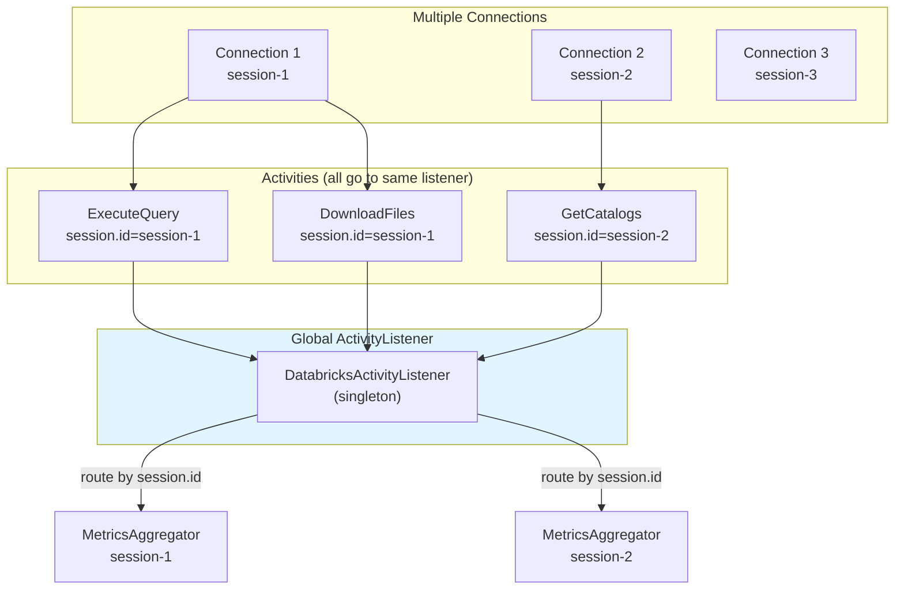
```mermaid
flowchart TB
    subgraph Connections["Multiple Connections"]
        C1["Connection 1<br/>session-1"]
        C2["Connection 2<br/>session-2"]
        C3["Connection 3<br/>session-3"]
    end

    subgraph Activities["Activities (all go to same listener)"]
        A1["ExecuteQuery<br/>session.id=session-1"]
        A2["GetCatalogs<br/>session.id=session-2"]
        A3["DownloadFiles<br/>session.id=session-1"]
    end

    subgraph Listener["Global ActivityListener"]
        AL["DatabricksActivityListener<br/>(singleton)"]
    end

    C1 --> A1
    C1 --> A3
    C2 --> A2

    A1 --> AL
    A2 --> AL
    A3 --> AL

    AL -->|"route by session.id"| MA1["MetricsAggregator<br/>session-1"]
    AL -->|"route by session.id"| MA2["MetricsAggregator<br/>session-2"]

    style Listener fill:#e1f5fe
```

#### Interface

```csharp
namespace AdbcDrivers.Databricks.Telemetry
{
    /// <summary>
    /// Global ActivityListener that receives all Databricks activities.
    /// Routes activities to the appropriate MetricsAggregator based on session_id.
    /// All exceptions are swallowed to prevent impacting driver operations.
    /// </summary>
    public sealed class DatabricksActivityListener : IDisposable
    {
        private static readonly Lazy<DatabricksActivityListener> _instance =
            new(() => new DatabricksActivityListener());

        public static DatabricksActivityListener Instance => _instance.Value;

        // Registry of aggregators by session_id
        private readonly ConcurrentDictionary<string, MetricsAggregator> _aggregators = new();

        private DatabricksActivityListener() { }

        /// <summary>
        /// Register a connection's aggregator. Called on connection open.
        /// </summary>
        public void RegisterAggregator(string sessionId, MetricsAggregator aggregator);

        /// <summary>
        /// Unregister and flush a connection's aggregator. Called on connection close.
        /// </summary>
        public Task UnregisterAggregatorAsync(string sessionId);

        /// <summary>
        /// Start listening to activities (called once at driver initialization).
        /// </summary>
        public void Start();

        public void Dispose();
    }
}
```

#### Activity Listener Configuration

```csharp
private ActivityListener CreateListener()
{
    return new ActivityListener
    {
        // Listen to all Databricks driver activities
        ShouldListenTo = source =>
            source.Name == "Databricks.Adbc.Driver",

        // Receive callbacks when activities stop
        ActivityStopped = OnActivityStopped,

        // Enable recording of all data (tags, events)
        Sample = (ref ActivityCreationOptions<ActivityContext> options) =>
            ActivitySamplingResult.AllDataAndRecorded
    };
}

private void OnActivityStopped(Activity activity)
{
    try
    {
        // Extract session_id to route to correct aggregator
        var sessionId = activity.GetTagItem("session.id")?.ToString();
        if (string.IsNullOrEmpty(sessionId)) return;

        // Route to the connection's aggregator
        if (_aggregators.TryGetValue(sessionId, out var aggregator))
        {
            aggregator.ProcessActivity(activity);
        }
    }
    catch (Exception ex)
    {
        // Swallow all exceptions - never impact driver operation
        Debug.WriteLine($"[TRACE] Telemetry error: {ex.Message}");
    }
}
```

#### Key Behaviors

**Receives ALL Activities**:
- Gets `ActivityStopped` for both parent and child activities
- A single statement execution triggers multiple callbacks (see Section 2.3)
- Must handle activities in any order (children stop before parents)

**Routes by session.id**:
- Each activity has `session.id` tag identifying its connection
- Routes to the correct `MetricsAggregator` for that connection
- Activities without `session.id` are ignored

**Thread Safety**:
- `ConcurrentDictionary` for aggregator registry
- Each `MetricsAggregator` handles its own thread safety
- Callbacks may come from any thread

**Exception Handling**:
- Wraps all callbacks in try-catch
- Never throws exceptions to Activity infrastructure
- Logs at TRACE level only to avoid customer anxiety

---

### 3.5 MetricsAggregator (Per-Connection)

**Purpose**: Aggregate data from MULTIPLE activities into a single proto message per statement.

**Location**: `Apache.Arrow.Adbc.Drivers.Databricks.Telemetry.MetricsAggregator`

**Ownership**: **Per-connection** - Each `DatabricksConnection` owns its own `MetricsAggregator` instance, registered with the global `DatabricksActivityListener`.

#### Core Challenge: Multi-Activity Aggregation

A single statement execution generates MULTIPLE activities (see Section 2.3). Each activity carries different parts of the telemetry data:

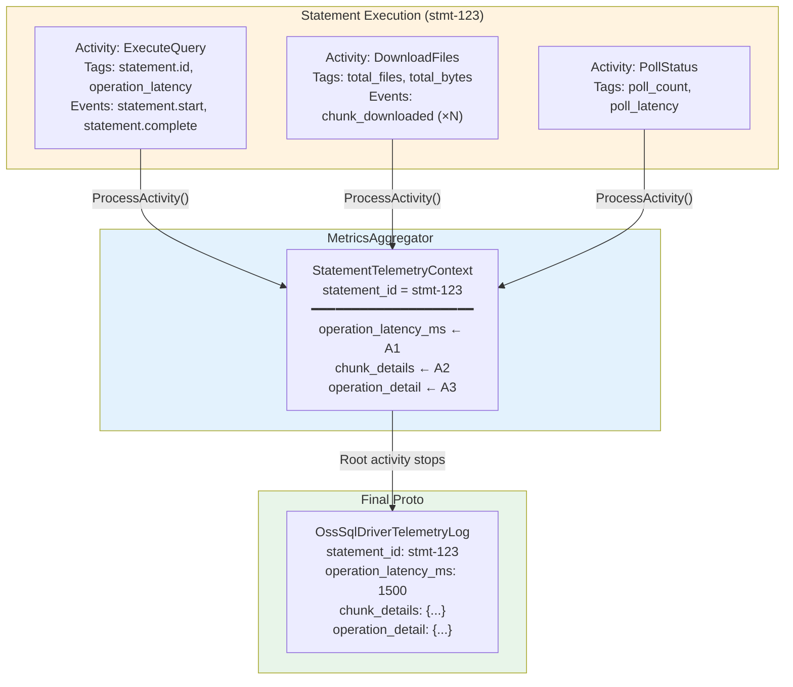
```mermaid
flowchart TB
    subgraph Statement["Statement Execution (stmt-123)"]
        direction TB
        A1["Activity: ExecuteQuery<br/>Tags: statement.id, operation_latency<br/>Events: statement.start, statement.complete"]
        A2["Activity: DownloadFiles<br/>Tags: total_files, total_bytes<br/>Events: chunk_downloaded (×N)"]
        A3["Activity: PollStatus<br/>Tags: poll_count, poll_latency"]
    end

    subgraph Aggregator["MetricsAggregator"]
        CTX["StatementTelemetryContext<br/>statement_id = stmt-123<br/>━━━━━━━━━━━━━━━━━━━━<br/>operation_latency_ms ← A1<br/>chunk_details ← A2<br/>operation_detail ← A3"]
    end

    subgraph Proto["Final Proto"]
        P["OssSqlDriverTelemetryLog<br/>statement_id: stmt-123<br/>operation_latency_ms: 1500<br/>chunk_details: {...}<br/>operation_detail: {...}"]
    end

    A1 -->|"ProcessActivity()"| CTX
    A2 -->|"ProcessActivity()"| CTX
    A3 -->|"ProcessActivity()"| CTX
    CTX -->|"Root activity stops"| P

    style Statement fill:#fff3e0
    style Aggregator fill:#e3f2fd
    style Proto fill:#e8f5e9
```

#### Why Per-Connection?

The global `DatabricksActivityListener` routes activities to aggregators by `session.id`:

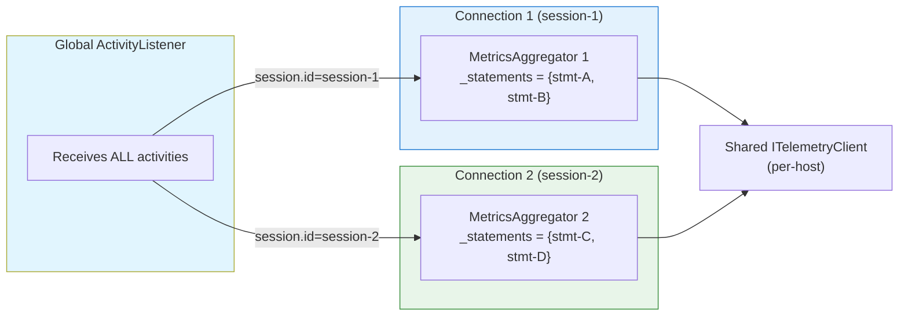
```mermaid
flowchart LR
    subgraph Global["Global ActivityListener"]
        AL["Receives ALL activities"]
    end

    subgraph Conn1["Connection 1 (session-1)"]
        MA1["MetricsAggregator 1<br/>_statements = {stmt-A, stmt-B}"]
    end

    subgraph Conn2["Connection 2 (session-2)"]
        MA2["MetricsAggregator 2<br/>_statements = {stmt-C, stmt-D}"]
    end

    AL -->|"session.id=session-1"| MA1
    AL -->|"session.id=session-2"| MA2

    MA1 --> TC["Shared ITelemetryClient<br/>(per-host)"]
    MA2 --> TC

    style Global fill:#e1f5fe
    style Conn1 fill:#e3f2fd,stroke:#1976d2
    style Conn2 fill:#e8f5e9,stroke:#388e3c
```

Each aggregator:
- Is registered with the global listener on connection open
- Receives only activities for its connection (routed by `session.id`)
- Tracks statement contexts keyed by `statement_id`
- Sends completed protos to the **shared** `ITelemetryClient` (per-host)

**JDBC References**:
- `TelemetryCollector.java:29-30` - Per-statement aggregation using `ConcurrentHashMap<String, StatementTelemetryDetails>`
- `TelemetryEvent.java:8-12` - Both `session_id` and `sql_statement_id` fields in exported events
- See PRs: [#1163](https://github.com/databricks/databricks-jdbc/pull/1163), [#1082](https://github.com/databricks/databricks-jdbc/pull/1082)

#### Interface

```csharp
namespace AdbcDrivers.Databricks.Telemetry
{
    /// <summary>
    /// Per-connection aggregator that collects data from MULTIPLE activities
    /// and creates a single proto message per statement.
    /// </summary>
    internal sealed class MetricsAggregator : IDisposable
    {
        private readonly ITelemetryClient _telemetryClient;  // Shared per-host client
        private readonly TelemetryConfiguration _config;
        private readonly ConcurrentDictionary<string, StatementTelemetryContext> _statements = new();
        private string? _sessionId;
        private DriverSystemConfiguration? _systemConfig;
        private DriverConnectionParameters? _connectionParams;

        public MetricsAggregator(
            ITelemetryClient telemetryClient,
            TelemetryConfiguration config)
        {
            _telemetryClient = telemetryClient;
            _config = config;
        }

        /// <summary>
        /// Process an activity. Called for EVERY activity (parent and children).
        /// Extracts tags/events and merges into the statement context.
        /// If this is a root activity completing, emits the proto.
        /// </summary>
        public void ProcessActivity(Activity activity)
        {
            var statementId = activity.GetTagItem("statement.id")?.ToString();
            if (string.IsNullOrEmpty(statementId)) return;

            // Get or create context for this statement
            var context = _statements.GetOrAdd(statementId,
                _ => new StatementTelemetryContext(_sessionId, _systemConfig, _connectionParams));

            // Merge this activity's data into context
            context.MergeFrom(activity);

            // If this is root activity completing, emit proto
            if (IsRootActivity(activity) && IsActivityComplete(activity))
            {
                EmitProto(statementId, context);
                _statements.TryRemove(statementId, out _);
            }
        }

        /// <summary>
        /// Flush all pending statement contexts. Called on connection close.
        /// </summary>
        public Task FlushAsync(CancellationToken ct = default);

        private bool IsRootActivity(Activity activity)
        {
            // Root = no parent, or parent from different ActivitySource
            return activity.Parent == null ||
                   activity.Parent.Source.Name != "Databricks.Adbc.Driver";
        }

        private bool IsActivityComplete(Activity activity)
        {
            return activity.Status == ActivityStatusCode.Ok ||
                   activity.Status == ActivityStatusCode.Error;
        }
    }
}
```

#### Multi-Activity Processing Flow

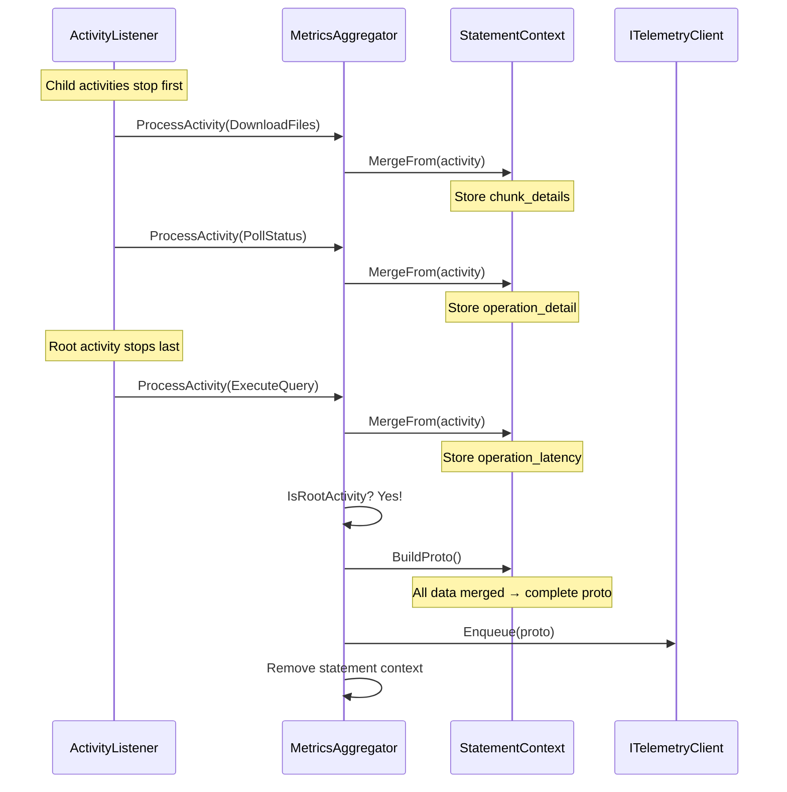
```mermaid
sequenceDiagram
    participant AL as ActivityListener
    participant MA as MetricsAggregator
    participant CTX as StatementContext
    participant TC as ITelemetryClient

    Note over AL: Child activities stop first

    AL->>MA: ProcessActivity(DownloadFiles)
    MA->>CTX: MergeFrom(activity)
    Note over CTX: Store chunk_details

    AL->>MA: ProcessActivity(PollStatus)
    MA->>CTX: MergeFrom(activity)
    Note over CTX: Store operation_detail

    Note over AL: Root activity stops last

    AL->>MA: ProcessActivity(ExecuteQuery)
    MA->>CTX: MergeFrom(activity)
    Note over CTX: Store operation_latency

    MA->>MA: IsRootActivity? Yes!
    MA->>CTX: BuildProto()
    Note over CTX: All data merged → complete proto
    MA->>TC: Enqueue(proto)
    MA->>MA: Remove statement context
```

#### StatementTelemetryContext: Merging Data

```csharp
internal class StatementTelemetryContext
{
    // Merged from various activities
    public string? SessionId { get; set; }
    public string? StatementId { get; set; }
    public long OperationLatencyMs { get; set; }
    public StatementType StatementType { get; set; }
    public ChunkDetails ChunkDetails { get; } = new();
    public OperationDetail OperationDetail { get; } = new();
    public ResultLatency ResultLatency { get; } = new();
    public DriverErrorInfo? ErrorInfo { get; set; }

    /// <summary>
    /// Merge data from an activity based on its operation name.
    /// </summary>
    public void MergeFrom(Activity activity)
    {
        // Always capture IDs
        SessionId ??= activity.GetTagItem("session.id")?.ToString();
        StatementId ??= activity.GetTagItem("statement.id")?.ToString();

        switch (activity.OperationName)
        {
            case "ExecuteQuery":
            case "ExecuteUpdate":
                MergeStatementActivity(activity);
                break;

            case "DownloadFiles":
                MergeChunkDetails(activity);
                break;

            case "PollOperationStatus":
                MergePollingMetrics(activity);
                break;
        }

        // Always check for errors
        if (activity.Status == ActivityStatusCode.Error)
        {
            MergeErrorInfo(activity);
        }
    }

    private void MergeStatementActivity(Activity activity)
    {
        OperationLatencyMs = (long)activity.Duration.TotalMilliseconds;
        StatementType = ParseStatementType(activity);

        // Extract result latency from tags
        if (activity.GetTagItem("result.ready_latency_ms") is long readyLatency)
            ResultLatency.ResultSetReadyLatencyMillis = readyLatency;
    }

    private void MergeChunkDetails(Activity activity)
    {
        // From summary tags (preferred)
        if (activity.GetTagItem("cloudfetch.total_chunks") is int total)
            ChunkDetails.TotalChunksPresent = total;
        if (activity.GetTagItem("cloudfetch.initial_latency_ms") is long initial)
            ChunkDetails.InitialChunkLatencyMillis = initial;
        if (activity.GetTagItem("cloudfetch.slowest_latency_ms") is long slowest)
            ChunkDetails.SlowestChunkLatencyMillis = slowest;

        // Or compute from events
        foreach (var evt in activity.Events.Where(e => e.Name == "cloudfetch.chunk_downloaded"))
        {
            ChunkDetails.TotalChunksIterated++;
            // ... extract and aggregate
        }
    }

    private void MergePollingMetrics(Activity activity)
    {
        if (activity.GetTagItem("poll.count") is int count)
            OperationDetail.NOperationStatusCalls = count;
        if (activity.GetTagItem("poll.total_latency_ms") is long latency)
            OperationDetail.OperationStatusLatencyMillis = latency;
    }
}
```

#### Contracts

**Multi-Activity Aggregation**:
- Receives `ProcessActivity()` for EVERY activity (parent and children)
- All activities for same statement share `statement_id` tag
- Data merged incrementally into `StatementTelemetryContext`
- Proto emitted when ROOT activity completes (all children already processed)

**Session-Level Correlation**:
- `session_id` captured from activities and included in all protos
- Multiple statements from same connection share `session_id`
- Allows correlation of all statements within a connection

**Flush Triggers**:
- **Root activity stops**: Emit proto immediately (all data aggregated)
- **Connection closes**: Flush all pending contexts (via `FlushAsync`)
- **Error in root**: Emit proto with `error_info` populated

**Error Handling**:
- Activity errors (status = Error) captured in `error_info`
- Never throws exceptions
- All exceptions swallowed (logged at TRACE level only)

---

### 3.6 DatabricksTelemetryExporter

**Purpose**: Export aggregated metrics to Databricks telemetry service.

**Location**: `AdbcDrivers.Databricks.Telemetry.DatabricksTelemetryExporter`

**Status**: Implemented (WI-3.4)

#### Interface

```csharp
namespace AdbcDrivers.Databricks.Telemetry
{
    public interface ITelemetryExporter
    {
        /// <summary>
        /// Export telemetry frontend logs to the backend service.
        /// Never throws exceptions (all swallowed and logged at TRACE level).
        /// </summary>
        Task ExportAsync(
            IReadOnlyList<TelemetryFrontendLog> logs,
            CancellationToken ct = default);
    }

    internal sealed class DatabricksTelemetryExporter : ITelemetryExporter
    {
        // Authenticated telemetry endpoint
        internal const string AuthenticatedEndpoint = "/telemetry-ext";

        // Unauthenticated telemetry endpoint
        internal const string UnauthenticatedEndpoint = "/telemetry-unauth";

        public DatabricksTelemetryExporter(
            HttpClient httpClient,
            string host,
            bool isAuthenticated,
            TelemetryConfiguration config);

        public Task ExportAsync(
            IReadOnlyList<TelemetryFrontendLog> logs,
            CancellationToken ct = default);

        // Creates TelemetryRequest wrapper with uploadTime and protoLogs
        internal TelemetryRequest CreateTelemetryRequest(IReadOnlyList<TelemetryFrontendLog> logs);
    }
}
```

**Implementation Details**:
- Creates `TelemetryRequest` with `uploadTime` (Unix ms) and `protoLogs` (JSON-serialized `TelemetryFrontendLog` array)
- Uses `/telemetry-ext` for authenticated requests
- Uses `/telemetry-unauth` for unauthenticated requests
- Implements retry logic for transient failures (configurable via `MaxRetries` and `RetryDelayMs`)
- Uses `ExceptionClassifier` to identify terminal vs retryable errors
- Never throws exceptions (all caught and logged at TRACE level)
- Cancellation is propagated (not swallowed)

---

## 4. Data Collection

### 4.1 Tag Definition System

To ensure maintainability and explicit control over what data is collected and exported, all Activity tags are defined in a centralized tag definition system.

#### Tag Definition Structure

**Location**: `Telemetry/TagDefinitions/`

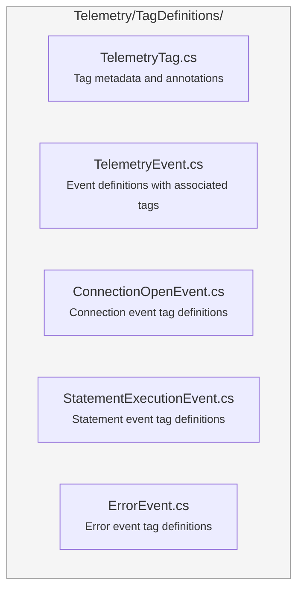
```mermaid
flowchart TD
    subgraph TD["Telemetry/TagDefinitions/"]
        TT["TelemetryTag.cs<br/><small>Tag metadata and annotations</small>"]
        TE["TelemetryEvent.cs<br/><small>Event definitions with associated tags</small>"]
        COE["ConnectionOpenEvent.cs<br/><small>Connection event tag definitions</small>"]
        SEE["StatementExecutionEvent.cs<br/><small>Statement event tag definitions</small>"]
        EE["ErrorEvent.cs<br/><small>Error event tag definitions</small>"]
    end

    style TD fill:#f5f5f5,stroke:#9e9e9e
```

#### TelemetryTag Annotation

**File**: `TagDefinitions/TelemetryTag.cs`

```csharp
namespace AdbcDrivers.Databricks.Telemetry.TagDefinitions
{
    /// <summary>
    /// Defines export scope for telemetry tags.
    /// </summary>
    [Flags]
    internal enum TagExportScope
    {
        None = 0,
        ExportLocal = 1,      // Export to local diagnostics (file listener, etc.)
        ExportDatabricks = 2, // Export to Databricks telemetry service
        ExportAll = ExportLocal | ExportDatabricks
    }

    /// <summary>
    /// Attribute to annotate Activity tag definitions.
    /// </summary>
    [AttributeUsage(AttributeTargets.Field, AllowMultiple = false)]
    internal sealed class TelemetryTagAttribute : Attribute
    {
        public string TagName { get; }
        public TagExportScope ExportScope { get; set; }
        public string? Description { get; set; }
        public bool Required { get; set; }

        public TelemetryTagAttribute(string tagName)
        {
            TagName = tagName;
            ExportScope = TagExportScope.ExportAll;
        }
    }
}
```

#### Event Tag Definitions

**File**: `TagDefinitions/ConnectionOpenEvent.cs`

```csharp
namespace AdbcDrivers.Databricks.Telemetry.TagDefinitions
{
    /// <summary>
    /// Tag definitions for Connection.Open events.
    /// </summary>
    internal static class ConnectionOpenEvent
    {
        public const string EventName = "Connection.Open";

        // Standard tags
        [TelemetryTag("workspace.id",
            ExportScope = TagExportScope.ExportDatabricks,
            Description = "Databricks workspace ID",
            Required = true)]
        public const string WorkspaceId = "workspace.id";

        [TelemetryTag("session.id",
            ExportScope = TagExportScope.ExportDatabricks,
            Description = "Connection session ID",
            Required = true)]
        public const string SessionId = "session.id";

        // Driver configuration tags
        [TelemetryTag("driver.version",
            ExportScope = TagExportScope.ExportAll,
            Description = "ADBC driver version")]
        public const string DriverVersion = "driver.version";

        [TelemetryTag("driver.os",
            ExportScope = TagExportScope.ExportAll,
            Description = "Operating system")]
        public const string DriverOS = "driver.os";

        [TelemetryTag("driver.runtime",
            ExportScope = TagExportScope.ExportAll,
            Description = ".NET runtime version")]
        public const string DriverRuntime = "driver.runtime";

        // Feature flags
        [TelemetryTag("feature.cloudfetch",
            ExportScope = TagExportScope.ExportDatabricks,
            Description = "CloudFetch enabled")]
        public const string FeatureCloudFetch = "feature.cloudfetch";

        [TelemetryTag("feature.lz4",
            ExportScope = TagExportScope.ExportDatabricks,
            Description = "LZ4 compression enabled")]
        public const string FeatureLz4 = "feature.lz4";

        // Sensitive tags - NOT exported to Databricks
        [TelemetryTag("server.address",
            ExportScope = TagExportScope.ExportLocal,
            Description = "Workspace host (local diagnostics only)")]
        public const string ServerAddress = "server.address";

        /// <summary>
        /// Get all tags that should be exported to Databricks.
        /// </summary>
        public static IReadOnlySet<string> GetDatabricksExportTags()
        {
            return new HashSet<string>
            {
                WorkspaceId,
                SessionId,
                DriverVersion,
                DriverOS,
                DriverRuntime,
                FeatureCloudFetch,
                FeatureLz4
            };
        }
    }
}
```

**File**: `TagDefinitions/StatementExecutionEvent.cs`

```csharp
namespace AdbcDrivers.Databricks.Telemetry.TagDefinitions
{
    /// <summary>
    /// Tag definitions for Statement execution events.
    /// </summary>
    internal static class StatementExecutionEvent
    {
        public const string EventName = "Statement.Execute";

        // Statement identification
        [TelemetryTag("statement.id",
            ExportScope = TagExportScope.ExportDatabricks,
            Description = "Statement execution ID",
            Required = true)]
        public const string StatementId = "statement.id";

        [TelemetryTag("session.id",
            ExportScope = TagExportScope.ExportDatabricks,
            Description = "Connection session ID",
            Required = true)]
        public const string SessionId = "session.id";

        // Result format tags
        [TelemetryTag("result.format",
            ExportScope = TagExportScope.ExportDatabricks,
            Description = "Result format: inline, cloudfetch")]
        public const string ResultFormat = "result.format";

        [TelemetryTag("result.chunk_count",
            ExportScope = TagExportScope.ExportDatabricks,
            Description = "Number of CloudFetch chunks")]
        public const string ResultChunkCount = "result.chunk_count";

        [TelemetryTag("result.bytes_downloaded",
            ExportScope = TagExportScope.ExportDatabricks,
            Description = "Total bytes downloaded")]
        public const string ResultBytesDownloaded = "result.bytes_downloaded";

        [TelemetryTag("result.compression_enabled",
            ExportScope = TagExportScope.ExportDatabricks,
            Description = "Compression enabled for results")]
        public const string ResultCompressionEnabled = "result.compression_enabled";

        // Polling metrics
        [TelemetryTag("poll.count",
            ExportScope = TagExportScope.ExportDatabricks,
            Description = "Number of status poll requests")]
        public const string PollCount = "poll.count";

        [TelemetryTag("poll.latency_ms",
            ExportScope = TagExportScope.ExportDatabricks,
            Description = "Total polling latency")]
        public const string PollLatencyMs = "poll.latency_ms";

        // Chunk latency metrics (from CloudFetch download summary)
        [TelemetryTag("chunk.initial_latency_ms",
            ExportScope = TagExportScope.ExportDatabricks,
            Description = "Latency of first chunk download in milliseconds")]
        public const string ChunkInitialLatencyMs = "chunk.initial_latency_ms";

        [TelemetryTag("chunk.slowest_latency_ms",
            ExportScope = TagExportScope.ExportDatabricks,
            Description = "Latency of slowest chunk download in milliseconds")]
        public const string ChunkSlowestLatencyMs = "chunk.slowest_latency_ms";

        // Sensitive tags - NOT exported to Databricks
        [TelemetryTag("db.statement",
            ExportScope = TagExportScope.ExportLocal,
            Description = "SQL query text (local diagnostics only)")]
        public const string DbStatement = "db.statement";

        /// <summary>
        /// Get all tags that should be exported to Databricks.
        /// </summary>
        public static IReadOnlySet<string> GetDatabricksExportTags()
        {
            return new HashSet<string>
            {
                StatementId,
                SessionId,
                ResultFormat,
                ResultChunkCount,
                ResultBytesDownloaded,
                ResultCompressionEnabled,
                PollCount,
                PollLatencyMs,
                ChunkInitialLatencyMs,
                ChunkSlowestLatencyMs
            };
        }
    }
}
```

#### Tag Registry

**File**: `TagDefinitions/TelemetryTagRegistry.cs`

```csharp
namespace AdbcDrivers.Databricks.Telemetry.TagDefinitions
{
    /// <summary>
    /// Central registry for all telemetry tags and events.
    /// </summary>
    internal static class TelemetryTagRegistry
    {
        /// <summary>
        /// Get all tags allowed for Databricks export by event type.
        /// </summary>
        public static IReadOnlySet<string> GetDatabricksExportTags(TelemetryEventType eventType)
        {
            return eventType switch
            {
                TelemetryEventType.ConnectionOpen => ConnectionOpenEvent.GetDatabricksExportTags(),
                TelemetryEventType.StatementExecution => StatementExecutionEvent.GetDatabricksExportTags(),
                TelemetryEventType.Error => ErrorEvent.GetDatabricksExportTags(),
                _ => new HashSet<string>()
            };
        }

        /// <summary>
        /// Check if a tag should be exported to Databricks for a given event type.
        /// </summary>
        public static bool ShouldExportToDatabricks(TelemetryEventType eventType, string tagName)
        {
            var allowedTags = GetDatabricksExportTags(eventType);
            return allowedTags.Contains(tagName);
        }
    }
}
```

#### Usage in Activity Tag Filtering

The `MetricsAggregator` uses the tag registry for filtering:

```csharp
private TelemetryMetric ProcessActivity(Activity activity)
{
    var eventType = DetermineEventType(activity);
    var metric = new TelemetryMetric
    {
        EventType = eventType,
        Timestamp = activity.StartTimeUtc
    };

    // Filter tags using the registry
    foreach (var tag in activity.Tags)
    {
        if (TelemetryTagRegistry.ShouldExportToDatabricks(eventType, tag.Key))
        {
            // Export this tag
            SetMetricProperty(metric, tag.Key, tag.Value);
        }
        // Tags not in registry are silently dropped
    }

    return metric;
}
```

#### Benefits

1. **Centralized Control**: All tags defined in one place
2. **Explicit Export Scope**: Clear annotation of what goes where
3. **Type Safety**: Constants prevent typos
4. **Self-Documenting**: Descriptions embedded in code
5. **Easy Auditing**: Simple to review what data is exported
6. **Future-Proof**: New tags just require adding to definition files

### 4.2 Activity Tags by Event Type

#### Activity Operation Name to MetricType Mapping

The `ActivityListener` maps Activity operation names to Databricks `TelemetryEventType` enum:

| Activity Operation Name | TelemetryEventType | Notes |
|------------------------|-------------------|-------|
| `Connection.Open` | `ConnectionOpen` | Emitted immediately when connection opens |
| `Connection.OpenAsync` | `ConnectionOpen` | Same as above |
| `Statement.Execute` | `StatementExecution` | Main statement execution activity |
| `Statement.ExecuteQuery` | `StatementExecution` | Query execution variant |
| `Statement.ExecuteUpdate` | `StatementExecution` | Update execution variant |
| `CloudFetch.Download` | _(aggregated into parent)_ | Child activity, metrics rolled up to statement |
| `CloudFetch.ChunkDownload` | _(aggregated into parent)_ | Child activity, metrics rolled up to statement |
| `Results.Fetch` | _(aggregated into parent)_ | Child activity, metrics rolled up to statement |
| _(any activity with `error.type` tag)_ | `Error` | Error events based on tag presence |

**Mapping Logic** (in `MetricsAggregator`):
```csharp
private TelemetryEventType DetermineEventType(Activity activity)
{
    // Check for errors first
    if (activity.GetTagItem("error.type") != null)
        return TelemetryEventType.Error;

    // Map based on operation name
    var operationName = activity.OperationName;
    if (operationName.StartsWith("Connection."))
        return TelemetryEventType.ConnectionOpen;

    if (operationName.StartsWith("Statement."))
        return TelemetryEventType.StatementExecution;

    // Default for unknown operations
    return TelemetryEventType.StatementExecution;
}
```

**New Tags for Metrics** (add to existing activities):
- `result.format`: "inline" | "cloudfetch"
- `result.chunk_count`: Number of CloudFetch chunks
- `result.bytes_downloaded`: Total bytes downloaded
- `result.compression_enabled`: true/false
- `poll.count`: Number of status poll requests
- `poll.latency_ms`: Total polling latency

**Driver Configuration Tags** (Connection.Open activity):
- `driver.version`: Driver version string
- `driver.os`: Operating system
- `driver.runtime`: .NET runtime version
- `feature.cloudfetch`: CloudFetch enabled?
- `feature.lz4`: LZ4 decompression enabled?
- `feature.direct_results`: Direct results enabled?

### 4.2 Activity Events for Fine-Grained Data

Use `Activity.AddEvent()` for per-chunk metrics:

```csharp
activity?.AddEvent(new ActivityEvent("CloudFetch.ChunkDownloaded",
    tags: new ActivityTagsCollection
    {
        { "chunk.index", chunkIndex },
        { "chunk.latency_ms", latency.TotalMilliseconds },
        { "chunk.bytes", bytesDownloaded },
        { "chunk.compressed", compressed }
    }));
```

### 4.3 Collection Points

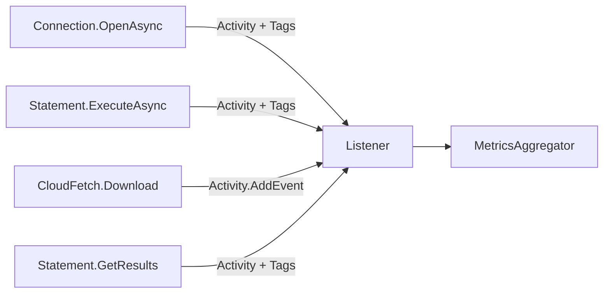
```mermaid
graph LR
    A[Connection.OpenAsync] -->|Activity + Tags| B[Listener]
    C[Statement.ExecuteAsync] -->|Activity + Tags| B
    D[CloudFetch.Download] -->|Activity.AddEvent| B
    E[Statement.GetResults] -->|Activity + Tags| B

    B --> F[MetricsAggregator]
```

**Key Point**: No new instrumentation code! Just add tags to existing activities.

### 4.4 Comprehensive Proto Field Population Guide

This section provides detailed documentation on how every field in the `OssSqlDriverTelemetryLog` proto schema should be populated. The `MetricsAggregator` is responsible for collecting data from Activity tags and converting them to the proto structure.

#### 4.4.1 Proto Schema Overview

The telemetry data is serialized using the proto schema defined in `Telemetry/Proto/sql_driver_telemetry.proto`. The main message is `OssSqlDriverTelemetryLog`:

```protobuf
message OssSqlDriverTelemetryLog {
  string session_id = 1;
  string sql_statement_id = 2;
  DriverSystemConfiguration system_configuration = 3;
  DriverConnectionParameters driver_connection_params = 4;
  string auth_type = 5;
  VolumeOperationEvent vol_operation = 6;
  SqlExecutionEvent sql_operation = 7;
  DriverErrorInfo error_info = 8;
  int64 operation_latency_ms = 9;
}
```

---

#### 4.4.2 Root-Level Fields (OssSqlDriverTelemetryLog)

| Proto Field | Activity Tag | Data Source | Calculation/Notes |
|-------------|--------------|-------------|-------------------|
| `session_id` | `session.id` | `DatabricksConnection` | Thrift session handle converted to string. Set in `HandleOpenSessionResponse()`. |
| `sql_statement_id` | `statement.id` | `DatabricksStatement` | Thrift operation handle GUID. Set when statement execution starts. |
| `auth_type` | `auth.type` | `DatabricksConnection` | Authentication type string. See [Auth Type Mapping](#auth-type-mapping). |
| `operation_latency_ms` | `activity.Duration` | Activity infrastructure | `(long)activity.Duration.TotalMilliseconds` |

**Auth Type Mapping**:

| Authentication Method | `auth_type` Value |
|----------------------|-------------------|
| Personal Access Token | `"pat"` |
| OAuth Client Credentials (M2M) | `"oauth-m2m"` |
| OAuth with Token Exchange | `"oauth-token-exchange"` |
| OAuth Browser-Based | `"oauth-browser"` |
| Azure Managed Identity | `"azure-msi"` |
| GCP Service Account | `"gcp-service-account"` |

**Activity Tag to Set** (in `DatabricksConnection.OpenAsync()`):
```csharp
activity?.SetTag("auth.type", DetermineAuthType());

private string DetermineAuthType()
{
    if (Properties.TryGetValue(SparkParameters.Token, out _))
        return "pat";
    if (Properties.TryGetValue(DatabricksParameters.ClientId, out _))
        return "oauth-m2m";
    // ... other auth type detection
    return "unknown";
}
```

---

#### 4.4.3 DriverSystemConfiguration (Complete Field Mapping)

This message captures driver and system environment information. All fields should be populated from the Connection.Open activity.

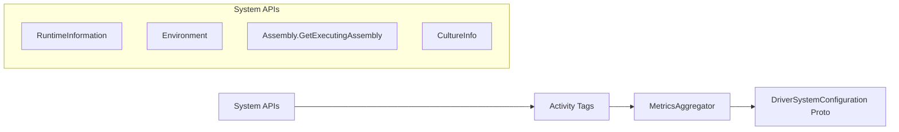
```mermaid
flowchart LR
    A[System APIs] --> B[Activity Tags]
    B --> C[MetricsAggregator]
    C --> D[DriverSystemConfiguration Proto]

    subgraph "System APIs"
        A1[RuntimeInformation]
        A2[Environment]
        A3[Assembly.GetExecutingAssembly]
        A4[CultureInfo]
    end
```

| Proto Field | Activity Tag | Data Source | Calculation |
|-------------|--------------|-------------|-------------|
| `driver_name` | _(hardcoded)_ | - | `"Databricks ADBC Driver"` |
| `driver_version` | `driver.version` | `ApacheUtility.GetAssemblyVersion()` | Already implemented. Returns assembly version string. |
| `runtime_name` | `runtime.name` | `RuntimeInformation.FrameworkDescription` | Extract runtime name (e.g., ".NET", ".NET Framework", ".NET Core") |
| `runtime_version` | `runtime.version` | `RuntimeInformation.FrameworkDescription` | Extract version number (e.g., "8.0.0", "4.7.2") |
| `runtime_vendor` | `runtime.vendor` | _(hardcoded)_ | `"Microsoft"` for .NET |
| `os_name` | `os.name` | `RuntimeInformation.OSDescription` | Full OS description string |
| `os_version` | `os.version` | `Environment.OSVersion.Version.ToString()` | OS version number |
| `os_arch` | `os.arch` | `RuntimeInformation.ProcessArchitecture.ToString()` | "X64", "X86", "Arm64", etc. |
| `client_app_name` | `client.app_name` | Connection properties | From `UserApplicationName` parameter or User-Agent header |
| `locale_name` | `locale.name` | `CultureInfo.CurrentCulture.Name` | e.g., "en-US", "de-DE" |
| `char_set_encoding` | `char_set_encoding` | `Encoding.Default.WebName` | e.g., "utf-8" |
| `process_name` | `process.name` | `Process.GetCurrentProcess().ProcessName` | Calling application process name |

**Implementation - Setting Activity Tags** (in `DatabricksConnection.CreateSessionRequest()`):

```csharp
// Add to existing activity tag setting in CreateSessionRequest()
private void SetSystemConfigurationTags(Activity? activity)
{
    if (activity == null) return;

    // Driver info (already exists)
    activity.SetTag("driver.version", s_assemblyVersion);
    activity.SetTag("driver.name", "Databricks ADBC Driver");

    // Runtime info
    var frameworkDescription = RuntimeInformation.FrameworkDescription;
    activity.SetTag("runtime.name", ExtractRuntimeName(frameworkDescription));
    activity.SetTag("runtime.version", ExtractRuntimeVersion(frameworkDescription));
    activity.SetTag("runtime.vendor", "Microsoft");

    // OS info
    activity.SetTag("os.name", RuntimeInformation.OSDescription);
    activity.SetTag("os.version", Environment.OSVersion.Version.ToString());
    activity.SetTag("os.arch", RuntimeInformation.ProcessArchitecture.ToString());

    // Client info
    activity.SetTag("client.app_name", GetClientAppName());
    activity.SetTag("locale.name", CultureInfo.CurrentCulture.Name);
    activity.SetTag("char_set_encoding", Encoding.Default.WebName);
    activity.SetTag("process.name", GetProcessName());
}

private static string ExtractRuntimeName(string frameworkDescription)
{
    // ".NET 8.0.0" -> ".NET"
    // ".NET Framework 4.7.2" -> ".NET Framework"
    // ".NET Core 3.1.0" -> ".NET Core"
    var match = Regex.Match(frameworkDescription, @"^(\.NET[^\d]*)");
    return match.Success ? match.Groups[1].Value.Trim() : ".NET";
}

private static string ExtractRuntimeVersion(string frameworkDescription)
{
    // ".NET 8.0.0" -> "8.0.0"
    var match = Regex.Match(frameworkDescription, @"(\d+\.\d+\.?\d*)");
    return match.Success ? match.Value : "unknown";
}

private string GetClientAppName()
{
    // Priority: connection property > User-Agent > process name
    if (Properties.TryGetValue("UserApplicationName", out var appName))
        return appName;
    return GetProcessName();
}

private static string GetProcessName()
{
    try
    {
        return Process.GetCurrentProcess().ProcessName;
    }
    catch
    {
        return "unknown";
    }
}
```

**MetricsAggregator Implementation**:

```csharp
private static DriverSystemConfiguration ExtractSystemConfiguration(Activity activity)
{
    return new DriverSystemConfiguration
    {
        DriverName = "Databricks ADBC Driver",
        DriverVersion = GetTagValue(activity, "driver.version") ?? string.Empty,
        RuntimeName = GetTagValue(activity, "runtime.name") ?? ".NET",
        RuntimeVersion = GetTagValue(activity, "runtime.version") ?? string.Empty,
        RuntimeVendor = GetTagValue(activity, "runtime.vendor") ?? "Microsoft",
        OsName = GetTagValue(activity, "os.name") ?? string.Empty,
        OsVersion = GetTagValue(activity, "os.version") ?? string.Empty,
        OsArch = GetTagValue(activity, "os.arch") ?? string.Empty,
        ClientAppName = GetTagValue(activity, "client.app_name") ?? string.Empty,
        LocaleName = GetTagValue(activity, "locale.name") ?? string.Empty,
        CharSetEncoding = GetTagValue(activity, "char_set_encoding") ?? "utf-8",
        ProcessName = GetTagValue(activity, "process.name") ?? string.Empty
    };
}
```

---

#### 4.4.4 DriverConnectionParameters (Complete Field Mapping)

This message captures connection configuration. Fields are populated from `DatabricksConnection` properties during connection open.

| Proto Field | Activity Tag | Data Source | Calculation |
|-------------|--------------|-------------|-------------|
| `http_path` | `connection.http_path` | `Properties[SparkParameters.HttpPath]` | HTTP path for API calls |
| `mode` | `connection.mode` | `Properties[DatabricksParameters.Protocol]` | See [DriverModeType Mapping](#drivermodetype-mapping) |
| `host_info.host_url` | `connection.host` | `Properties[SparkParameters.HostName]` | Base URL without protocol |
| `host_info.port` | `connection.port` | `Properties[SparkParameters.Port]` | Port number (default: 443) |
| `use_proxy` | `connection.use_proxy` | Proxy configuration | `true` if proxy is configured |
| `auth_mech` | `connection.auth_mech` | Authentication config | See [DriverAuthMechType Mapping](#driverauthmechtype-mapping) |
| `auth_flow` | `connection.auth_flow` | Authentication config | See [DriverAuthFlowType Mapping](#driverauthflowtype-mapping) |
| `auth_scope` | `connection.auth_scope` | `Properties["OAuthScope"]` | OAuth scope if applicable |
| `enable_arrow` | `feature.arrow` | _(always true)_ | ADBC always uses Arrow |
| `enable_direct_results` | `feature.direct_results` | `Properties[DatabricksParameters.EnableDirectResults]` | Boolean |
| `rows_fetched_per_block` | `connection.batch_size` | `Properties[SparkParameters.BatchSize]` | Default: 2,000,000 |
| `async_poll_interval_millis` | `connection.poll_interval_ms` | `Properties[DatabricksParameters.AsyncPollIntervalMillis]` | Default: 100ms |
| `socket_timeout` | `connection.socket_timeout` | `Properties[SparkParameters.SocketTimeout]` | Socket timeout in seconds |
| `auto_commit` | `connection.auto_commit` | Connection state | Auto-commit mode setting |
| `enable_complex_datatype_support` | `feature.complex_types` | `Properties["EnableComplexTypes"]` | Complex type support |

**DriverModeType Mapping**:

| Connection Protocol | Proto Enum Value |
|--------------------|------------------|
| `"thrift"` | `DRIVER_MODE_THRIFT` |
| `"sea"` | `DRIVER_MODE_SEA` |
| _(other)_ | `DRIVER_MODE_TYPE_UNSPECIFIED` |

**DriverAuthMechType Mapping**:

| Authentication Type | Proto Enum Value |
|--------------------|------------------|
| PAT (Personal Access Token) | `DRIVER_AUTH_MECH_PAT` |
| OAuth (any flow) | `DRIVER_AUTH_MECH_OAUTH` |
| Other | `DRIVER_AUTH_MECH_OTHER` |

**DriverAuthFlowType Mapping**:

| OAuth Flow | Proto Enum Value |
|------------|------------------|
| Token passthrough | `DRIVER_AUTH_FLOW_TOKEN_PASSTHROUGH` |
| Client credentials (M2M) | `DRIVER_AUTH_FLOW_CLIENT_CREDENTIALS` |
| Browser-based | `DRIVER_AUTH_FLOW_BROWSER_BASED_AUTHENTICATION` |

**Implementation - Setting Activity Tags** (in `DatabricksConnection.HandleOpenSessionResponse()`):

```csharp
private void SetConnectionParameterTags(Activity? activity)
{
    if (activity == null) return;

    // Basic connection info
    activity.SetTag("connection.http_path", Properties.GetValueOrDefault(SparkParameters.HttpPath, ""));
    activity.SetTag("connection.host", _host);
    activity.SetTag("connection.port", Properties.GetValueOrDefault(SparkParameters.Port, "443"));
    activity.SetTag("connection.mode", DetermineDriverMode());

    // Auth configuration
    activity.SetTag("connection.auth_mech", DetermineAuthMech());
    activity.SetTag("connection.auth_flow", DetermineAuthFlow());
    if (Properties.TryGetValue("OAuthScope", out var scope))
        activity.SetTag("connection.auth_scope", scope);

    // Feature flags
    activity.SetTag("feature.arrow", true);
    activity.SetTag("feature.direct_results", _enableDirectResults);
    activity.SetTag("feature.cloudfetch", _useCloudFetch);
    activity.SetTag("feature.lz4", _canDecompressLz4);
    activity.SetTag("feature.complex_types", _enableComplexTypes);

    // Performance settings
    activity.SetTag("connection.batch_size", _batchSize);
    activity.SetTag("connection.poll_interval_ms", _asyncPollIntervalMs);

    // Proxy (only flag, no sensitive details)
    activity.SetTag("connection.use_proxy", _proxyConfigurator != null);
}

private string DetermineDriverMode()
{
    if (Properties.TryGetValue(DatabricksParameters.Protocol, out var protocol))
    {
        return protocol.ToLowerInvariant() switch
        {
            "sea" => "sea",
            _ => "thrift"
        };
    }
    return "thrift";
}

private string DetermineAuthMech()
{
    if (Properties.ContainsKey(SparkParameters.Token))
        return "pat";
    if (Properties.ContainsKey(DatabricksParameters.ClientId))
        return "oauth";
    return "other";
}

private string DetermineAuthFlow()
{
    if (Properties.ContainsKey(SparkParameters.Token))
        return "token_passthrough";
    if (Properties.ContainsKey(DatabricksParameters.ClientId))
        return "client_credentials";
    return "unspecified";
}
```

**MetricsAggregator Implementation**:

```csharp
private static DriverConnectionParameters ExtractConnectionParameters(Activity activity)
{
    var parameters = new DriverConnectionParameters
    {
        HttpPath = GetTagValue(activity, "connection.http_path") ?? string.Empty,
        Mode = ParseDriverMode(GetTagValue(activity, "connection.mode")),
        HostInfo = new HostDetails
        {
            HostUrl = GetTagValue(activity, "connection.host") ?? string.Empty,
            Port = GetTagValueInt(activity, "connection.port", 443)
        },
        UseProxy = GetTagValueBool(activity, "connection.use_proxy"),
        AuthMech = ParseAuthMech(GetTagValue(activity, "connection.auth_mech")),
        AuthFlow = ParseAuthFlow(GetTagValue(activity, "connection.auth_flow")),
        AuthScope = GetTagValue(activity, "connection.auth_scope") ?? string.Empty,
        EnableArrow = GetTagValueBool(activity, "feature.arrow", defaultValue: true),
        EnableDirectResults = GetTagValueBool(activity, "feature.direct_results"),
        RowsFetchedPerBlock = GetTagValueLong(activity, "connection.batch_size", 2000000),
        AsyncPollIntervalMillis = GetTagValueLong(activity, "connection.poll_interval_ms", 100)
    };

    return parameters;
}

private static DriverModeType ParseDriverMode(string? mode)
{
    return mode?.ToLowerInvariant() switch
    {
        "thrift" => DriverModeType.DriverModeThrift,
        "sea" => DriverModeType.DriverModeSea,
        _ => DriverModeType.DriverModeTypeUnspecified
    };
}

private static DriverAuthMechType ParseAuthMech(string? mech)
{
    return mech?.ToLowerInvariant() switch
    {
        "pat" => DriverAuthMechType.DriverAuthMechPat,
        "oauth" => DriverAuthMechType.DriverAuthMechOauth,
        _ => DriverAuthMechType.DriverAuthMechOther
    };
}

private static DriverAuthFlowType ParseAuthFlow(string? flow)
{
    return flow?.ToLowerInvariant() switch
    {
        "token_passthrough" => DriverAuthFlowType.DriverAuthFlowTokenPassthrough,
        "client_credentials" => DriverAuthFlowType.DriverAuthFlowClientCredentials,
        "browser" or "browser_based" => DriverAuthFlowType.DriverAuthFlowBrowserBasedAuthentication,
        _ => DriverAuthFlowType.DriverAuthFlowTypeUnspecified
    };
}
```

---

#### 4.4.5 SqlExecutionEvent (Complete Field Mapping)

This message captures statement execution metrics. Data is collected from statement activities and CloudFetch events.

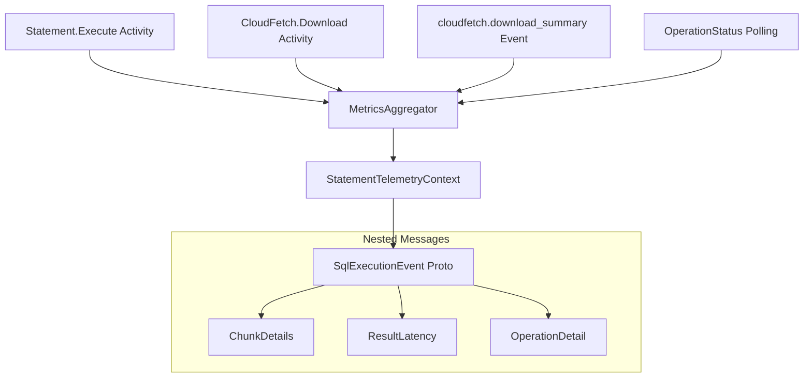
```mermaid
flowchart TD
    A[Statement.Execute Activity] --> B[MetricsAggregator]
    C[CloudFetch.Download Activity] --> B
    D[cloudfetch.download_summary Event] --> B
    E[OperationStatus Polling] --> B

    B --> F[StatementTelemetryContext]
    F --> G[SqlExecutionEvent Proto]

    subgraph "Nested Messages"
        G --> H[ChunkDetails]
        G --> I[ResultLatency]
        G --> J[OperationDetail]
    end
```

| Proto Field | Activity Tag/Event | Data Source | Calculation |
|-------------|-------------------|-------------|-------------|
| `statement_type` | `statement.type` | `DatabricksStatement` | See [StatementType Mapping](#statementtype-mapping) |
| `is_compressed` | `result.compression_enabled` | CloudFetch response | `true` if LZ4 compression used |
| `execution_result` | `result.format` | Result handling | See [ExecutionResultFormat Mapping](#executionresultformat-mapping) |
| `chunk_id` | `chunk.id` | CloudFetch download | Only set for chunk-specific error events |
| `retry_count` | `retry.count` | Retry logic | Number of retry attempts made |

**StatementType Mapping**:

| Operation | Proto Enum Value | Determination |
|-----------|------------------|---------------|
| `ExecuteQuery()` | `STATEMENT_QUERY` | Returns result set |
| `ExecuteUpdate()` | `STATEMENT_UPDATE` | Returns affected rows |
| Catalog operations | `STATEMENT_METADATA` | GetTables, GetColumns, etc. |
| General SQL | `STATEMENT_SQL` | Other SQL execution |

**ExecutionResultFormat Mapping**:

| Result Mode | Proto Enum Value | Determination |
|-------------|------------------|---------------|
| CloudFetch | `EXECUTION_RESULT_EXTERNAL_LINKS` | Results fetched from cloud storage |
| Inline Arrow | `EXECUTION_RESULT_INLINE_ARROW` | Results returned inline in Arrow format |
| Inline JSON | `EXECUTION_RESULT_INLINE_JSON` | Results returned inline as JSON |
| Columnar Inline | `EXECUTION_RESULT_COLUMNAR_INLINE` | Columnar format inline |

**Implementation - Setting Activity Tags** (in `DatabricksStatement`):

```csharp
// In ExecuteQueryAsync or similar
private void SetStatementExecutionTags(Activity? activity, string statementType)
{
    if (activity == null) return;

    activity.SetTag("statement.id", _operationHandle?.ToString() ?? Guid.NewGuid().ToString());
    activity.SetTag("session.id", _connection.SessionId);
    activity.SetTag("statement.type", statementType);
}

// In result handling (after determining result format)
private void SetResultFormatTags(Activity? activity, bool isCloudFetch, bool isCompressed)
{
    if (activity == null) return;

    activity.SetTag("result.format", isCloudFetch ? "cloudfetch" : "inline_arrow");
    activity.SetTag("result.compression_enabled", isCompressed);
}
```

---

#### 4.4.6 ChunkDetails (Complete Field Mapping)

This nested message captures CloudFetch chunk download metrics.

| Proto Field | Activity Event Field | Data Source | Calculation |
|-------------|---------------------|-------------|-------------|
| `initial_chunk_latency_millis` | `initial_chunk_latency_ms` | `CloudFetchDownloader` | Time to download first chunk (ms) |
| `slowest_chunk_latency_millis` | `slowest_chunk_latency_ms` | `CloudFetchDownloader` | Maximum chunk download time (ms) |
| `total_chunks_present` | `total_files` | `CloudFetchDownloader` | Total number of chunks from server |
| `total_chunks_iterated` | `successful_downloads` | `CloudFetchDownloader` | Number of chunks actually consumed |
| `sum_chunks_download_time_millis` | `total_time_ms` | `CloudFetchDownloader` | Total download time for all chunks (ms) |

**Data Collection in CloudFetchDownloader**:

```csharp
// In CloudFetchDownloader - fields for tracking
private long _initialChunkLatencyMs = -1;
private long _slowestChunkLatencyMs = 0;
private long _totalDownloadTimeMs = 0;
private int _successfulDownloads = 0;
private readonly object _metricsLock = new object();

// After each chunk download completes:
private void RecordChunkDownloadMetrics(long downloadLatencyMs)
{
    lock (_metricsLock)
    {
        // Track first chunk latency (only set once)
        if (_initialChunkLatencyMs < 0)
        {
            _initialChunkLatencyMs = downloadLatencyMs;
        }

        // Track max latency for slowest chunk
        if (downloadLatencyMs > _slowestChunkLatencyMs)
        {
            _slowestChunkLatencyMs = downloadLatencyMs;
        }

        // Accumulate total download time
        _totalDownloadTimeMs += downloadLatencyMs;
        _successfulDownloads++;
    }
}

// Emit summary event when download completes:
private void EmitDownloadSummaryEvent(Activity? activity)
{
    if (activity == null) return;

    activity.AddEvent(new ActivityEvent("cloudfetch.download_summary",
        tags: new ActivityTagsCollection
        {
            { "total_files", _totalChunks },
            { "successful_downloads", _successfulDownloads },
            { "failed_downloads", _failedDownloads },
            { "total_bytes", _totalBytesDownloaded },
            { "total_time_ms", _totalDownloadTimeMs },
            { "initial_chunk_latency_ms", _initialChunkLatencyMs > 0 ? _initialChunkLatencyMs : 0 },
            { "slowest_chunk_latency_ms", _slowestChunkLatencyMs }
        }));
}
```

**MetricsAggregator Processing**:

```csharp
private void ProcessCloudFetchSummaryEvent(ActivityEvent evt, StatementTelemetryContext context)
{
    foreach (var tag in evt.Tags)
    {
        switch (tag.Key)
        {
            case "total_files":
                context.TotalChunksPresent = Convert.ToInt32(tag.Value);
                break;
            case "successful_downloads":
                context.TotalChunksIterated = Convert.ToInt32(tag.Value);
                break;
            case "total_time_ms":
                context.SumChunksDownloadTimeMs = Convert.ToInt64(tag.Value);
                break;
            case "initial_chunk_latency_ms":
                context.InitialChunkLatencyMs = Convert.ToInt64(tag.Value);
                break;
            case "slowest_chunk_latency_ms":
                context.SlowestChunkLatencyMs = Convert.ToInt64(tag.Value);
                break;
        }
    }
}

private ChunkDetails CreateChunkDetails(StatementTelemetryContext context)
{
    return new ChunkDetails
    {
        InitialChunkLatencyMillis = context.InitialChunkLatencyMs ?? 0,
        SlowestChunkLatencyMillis = context.SlowestChunkLatencyMs ?? 0,
        TotalChunksPresent = context.TotalChunksPresent ?? 0,
        TotalChunksIterated = context.TotalChunksIterated ?? 0,
        SumChunksDownloadTimeMillis = context.SumChunksDownloadTimeMs ?? 0
    };
}
```

---

#### 4.4.7 ResultLatency (Complete Field Mapping)

This nested message captures timing metrics for result set processing.

| Proto Field | Activity Tag | Data Source | Calculation |
|-------------|--------------|-------------|-------------|
| `result_set_ready_latency_millis` | `result.ready_latency_ms` | Statement execution | Time from execute to first row available (ms) |
| `result_set_consumption_latency_millis` | `result.consumption_latency_ms` | Reader iteration | Time from first row to last row consumed (ms) |

**Data Collection Strategy**:

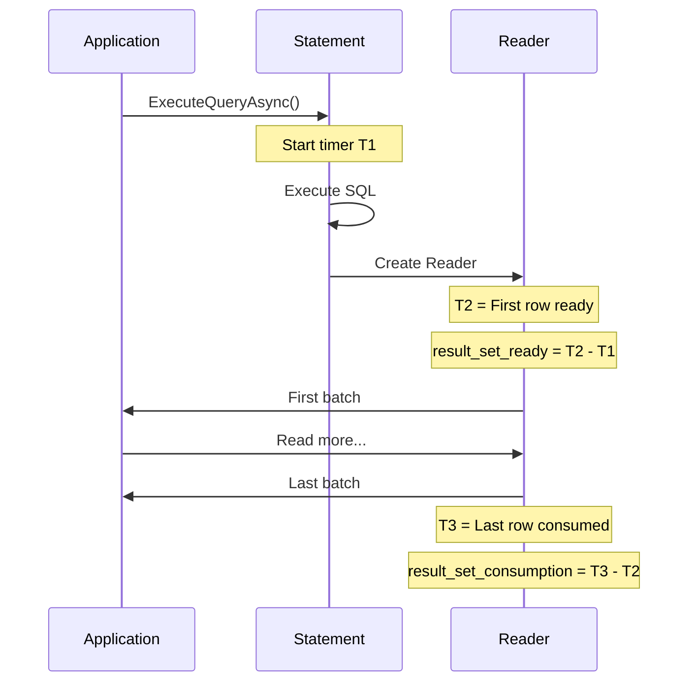
```mermaid
sequenceDiagram
    participant App as Application
    participant Stmt as Statement
    participant Reader as Reader

    App->>Stmt: ExecuteQueryAsync()
    Note over Stmt: Start timer T1
    Stmt->>Stmt: Execute SQL
    Stmt->>Reader: Create Reader
    Note over Reader: T2 = First row ready
    Note over Reader: result_set_ready = T2 - T1

    Reader->>App: First batch
    App->>Reader: Read more...
    Reader->>App: Last batch
    Note over Reader: T3 = Last row consumed
    Note over Reader: result_set_consumption = T3 - T2
```

**Implementation**:

```csharp
// In DatabricksStatement - track execution timing
private Stopwatch _executionStopwatch = new();
private long _resultReadyLatencyMs;

public async Task<IArrowArrayStream> ExecuteQueryAsync()
{
    _executionStopwatch.Restart();

    // ... execute SQL ...

    // Record when result is ready (before creating reader)
    _resultReadyLatencyMs = _executionStopwatch.ElapsedMilliseconds;

    // Create reader
    var reader = CreateReader();

    // Set tag
    Activity.Current?.SetTag("result.ready_latency_ms", _resultReadyLatencyMs);

    return reader;
}

// In DatabricksReader - track consumption timing
private Stopwatch _consumptionStopwatch;
private bool _firstBatchRead = false;

public override async ValueTask<RecordBatch?> ReadNextRecordBatchAsync()
{
    if (!_firstBatchRead)
    {
        _consumptionStopwatch = Stopwatch.StartNew();
        _firstBatchRead = true;
    }

    var batch = await base.ReadNextRecordBatchAsync();

    // If last batch, record consumption time
    if (batch == null && _consumptionStopwatch != null)
    {
        Activity.Current?.SetTag("result.consumption_latency_ms",
            _consumptionStopwatch.ElapsedMilliseconds);
    }

    return batch;
}
```

**MetricsAggregator Processing**:

```csharp
private ResultLatency CreateResultLatency(StatementTelemetryContext context)
{
    return new ResultLatency
    {
        ResultSetReadyLatencyMillis = context.ResultReadyLatencyMs ?? 0,
        ResultSetConsumptionLatencyMillis = context.ResultConsumptionLatencyMs ?? 0
    };
}
```

---

#### 4.4.8 OperationDetail (Complete Field Mapping)

This nested message captures operation polling and type information.

| Proto Field | Activity Tag | Data Source | Calculation |
|-------------|--------------|-------------|-------------|
| `n_operation_status_calls` | `poll.count` | `DatabricksOperationStatusPoller` | Number of GetOperationStatus calls |
| `operation_status_latency_millis` | `poll.latency_ms` | `DatabricksOperationStatusPoller` | Sum of all poll latencies (ms) |
| `operation_type` | `operation.type` | Statement/Catalog operation | See [OperationType Mapping](#operationtype-mapping) |
| `is_internal_call` | `operation.is_internal` | Driver internals | `true` for metadata queries, etc. |

**OperationType Mapping**:

| Driver Operation | Proto Enum Value |
|-----------------|------------------|
| `OpenSession` | `OPERATION_CREATE_SESSION` |
| `CloseSession` | `OPERATION_DELETE_SESSION` |
| `ExecuteStatement` | `OPERATION_EXECUTE_STATEMENT` |
| `ExecuteStatementAsync` | `OPERATION_EXECUTE_STATEMENT_ASYNC` |
| `CloseOperation` | `OPERATION_CLOSE_STATEMENT` |
| `CancelOperation` | `OPERATION_CANCEL_STATEMENT` |
| `GetTypeInfo` | `OPERATION_LIST_TYPE_INFO` |
| `GetCatalogs` | `OPERATION_LIST_CATALOGS` |
| `GetSchemas` | `OPERATION_LIST_SCHEMAS` |
| `GetTables` | `OPERATION_LIST_TABLES` |
| `GetTableTypes` | `OPERATION_LIST_TABLE_TYPES` |
| `GetColumns` | `OPERATION_LIST_COLUMNS` |
| `GetFunctions` | `OPERATION_LIST_FUNCTIONS` |
| `GetPrimaryKeys` | `OPERATION_LIST_PRIMARY_KEYS` |
| `GetImportedKeys` | `OPERATION_LIST_IMPORTED_KEYS` |
| `GetExportedKeys` | `OPERATION_LIST_EXPORTED_KEYS` |
| `GetCrossReference` | `OPERATION_LIST_CROSS_REFERENCES` |

**Data Collection in DatabricksOperationStatusPoller**:

```csharp
// In DatabricksOperationStatusPoller
private int _pollCount = 0;
private long _totalPollLatencyMs = 0;
private readonly object _pollMetricsLock = new object();

public async Task<TGetOperationStatusResp> PollForCompletionAsync(
    TOperationHandle operationHandle,
    CancellationToken cancellationToken)
{
    while (!IsComplete)
    {
        var stopwatch = Stopwatch.StartNew();

        var status = await GetOperationStatusAsync(operationHandle, cancellationToken);

        lock (_pollMetricsLock)
        {
            _pollCount++;
            _totalPollLatencyMs += stopwatch.ElapsedMilliseconds;
        }

        // ... check status and wait ...
    }

    // Emit metrics
    EmitPollMetrics();
}

private void EmitPollMetrics()
{
    Activity.Current?.SetTag("poll.count", _pollCount);
    Activity.Current?.SetTag("poll.latency_ms", _totalPollLatencyMs);
}
```

**MetricsAggregator Processing**:

```csharp
private OperationDetail CreateOperationDetail(StatementTelemetryContext context)
{
    return new OperationDetail
    {
        NOperationStatusCalls = context.PollCount ?? 0,
        OperationStatusLatencyMillis = context.PollLatencyMs ?? 0,
        OperationType = context.OperationType ?? OperationType.OperationTypeUnspecified,
        IsInternalCall = context.IsInternalCall ?? false
    };
}
```

---

#### 4.4.9 DriverErrorInfo (Complete Field Mapping)

This message captures error information when operations fail.

| Proto Field | Activity Tag | Data Source | Calculation |
|-------------|--------------|-------------|-------------|
| `error_name` | `error.type` | Exception type | `exception.GetType().Name` |
| `stack_trace` | _(from exception)_ | Exception message | Truncated to 200 chars (message only, no actual stack trace for privacy) |

**Important**: The `stack_trace` field is used for the truncated error message per the current proto schema. Actual stack traces are not sent for privacy/security reasons.

**Implementation**:

```csharp
// In error handling code
private void RecordError(Activity? activity, Exception exception)
{
    if (activity == null) return;

    activity.SetTag("error.type", exception.GetType().Name);
    activity.SetStatus(ActivityStatusCode.Error, TruncateMessage(exception.Message, 200));
}

private static string TruncateMessage(string message, int maxLength)
{
    if (string.IsNullOrEmpty(message)) return string.Empty;
    return message.Length <= maxLength ? message : message.Substring(0, maxLength);
}

// In MetricsAggregator
private DriverErrorInfo CreateErrorInfo(Exception exception)
{
    return new DriverErrorInfo
    {
        ErrorName = exception.GetType().Name,
        StackTrace = TruncateMessage(exception.Message, 200)
    };
}
```

---

#### 4.4.10 Complete Activity Tag Reference

**Connection-Level Tags** (set during `OpenAsync`):

| Tag Name | Type | Required | Description |
|----------|------|----------|-------------|
| `session.id` | string | Yes | Thrift session handle |
| `auth.type` | string | Yes | Authentication type |
| `driver.version` | string | Yes | Driver version |
| `driver.name` | string | Yes | "Databricks ADBC Driver" |
| `runtime.name` | string | Yes | .NET runtime name |
| `runtime.version` | string | Yes | .NET version |
| `runtime.vendor` | string | No | "Microsoft" |
| `os.name` | string | Yes | OS description |
| `os.version` | string | Yes | OS version |
| `os.arch` | string | Yes | Process architecture |
| `client.app_name` | string | No | Client application name |
| `locale.name` | string | No | Current culture name |
| `char_set_encoding` | string | No | Character encoding |
| `process.name` | string | No | Process name |
| `connection.http_path` | string | Yes | HTTP path |
| `connection.host` | string | Yes | Host URL |
| `connection.port` | string | Yes | Port number |
| `connection.mode` | string | Yes | "thrift" or "sea" |
| `connection.auth_mech` | string | Yes | Auth mechanism |
| `connection.auth_flow` | string | No | OAuth flow type |
| `connection.batch_size` | long | No | Batch size |
| `connection.poll_interval_ms` | long | No | Poll interval |
| `connection.use_proxy` | bool | No | Proxy enabled |
| `feature.arrow` | bool | Yes | Arrow support |
| `feature.direct_results` | bool | Yes | Direct results enabled |
| `feature.cloudfetch` | bool | Yes | CloudFetch enabled |
| `feature.lz4` | bool | Yes | LZ4 decompression enabled |

**Statement-Level Tags** (set during `ExecuteQuery/Update`):

| Tag Name | Type | Required | Description |
|----------|------|----------|-------------|
| `statement.id` | string | Yes | Statement/operation handle |
| `session.id` | string | Yes | Connection session ID |
| `statement.type` | string | Yes | query/update/metadata/sql |
| `operation.type` | string | No | Operation type enum value |
| `operation.is_internal` | bool | No | Internal metadata call |
| `result.format` | string | Yes | cloudfetch/inline_arrow/inline_json |
| `result.compression_enabled` | bool | Yes | LZ4 compression used |
| `result.ready_latency_ms` | long | No | Time to first row |
| `result.consumption_latency_ms` | long | No | Time to consume all rows |
| `poll.count` | int | No | Number of status polls |
| `poll.latency_ms` | long | No | Total poll latency |
| `retry.count` | int | No | Number of retries |
| `error.type` | string | On error | Exception type name |

**Activity Events**:

| Event Name | Tags | Description |
|------------|------|-------------|
| `cloudfetch.download_summary` | `total_files`, `successful_downloads`, `failed_downloads`, `total_bytes`, `total_time_ms`, `initial_chunk_latency_ms`, `slowest_chunk_latency_ms` | Emitted when CloudFetch download completes |

---

#### 4.4.11 MetricsAggregator Complete Implementation

```csharp
private OssSqlDriverTelemetryLog CreateTelemetryEvent(StatementTelemetryContext context)
{
    var telemetryLog = new OssSqlDriverTelemetryLog
    {
        SessionId = context.SessionId ?? string.Empty,
        SqlStatementId = context.StatementId,
        AuthType = context.AuthType ?? string.Empty,
        OperationLatencyMs = context.TotalLatencyMs,

        // System configuration (populated from connection activity)
        SystemConfiguration = context.SystemConfiguration,

        // Connection parameters (populated from connection activity)
        DriverConnectionParams = context.ConnectionParameters,

        // SQL operation details
        SqlOperation = new SqlExecutionEvent
        {
            StatementType = context.StatementType ?? StatementType.StatementTypeUnspecified,
            IsCompressed = context.CompressionEnabled ?? false,
            ExecutionResult = ParseExecutionResult(context.ResultFormat),
            RetryCount = context.RetryCount ?? 0,
            ChunkDetails = new ChunkDetails
            {
                TotalChunksPresent = context.TotalChunksPresent ?? 0,
                TotalChunksIterated = context.TotalChunksIterated ?? 0,
                SumChunksDownloadTimeMillis = context.SumChunksDownloadTimeMs ?? 0,
                InitialChunkLatencyMillis = context.InitialChunkLatencyMs ?? 0,
                SlowestChunkLatencyMillis = context.SlowestChunkLatencyMs ?? 0
            },
            ResultLatency = new ResultLatency
            {
                ResultSetReadyLatencyMillis = context.ResultReadyLatencyMs ?? 0,
                ResultSetConsumptionLatencyMillis = context.ResultConsumptionLatencyMs ?? 0
            },
            OperationDetail = new OperationDetail
            {
                NOperationStatusCalls = context.PollCount ?? 0,
                OperationStatusLatencyMillis = context.PollLatencyMs ?? 0,
                OperationType = context.OperationType ?? OperationType.OperationTypeUnspecified,
                IsInternalCall = context.IsInternalCall ?? false
            }
        }
    };

    // Add error info if present
    if (context.HasError)
    {
        telemetryLog.ErrorInfo = new DriverErrorInfo
        {
            ErrorName = context.ErrorName ?? string.Empty,
            StackTrace = TruncateMessage(context.ErrorMessage, 200)
        };
    }

    return telemetryLog;
}

private static ExecutionResultFormat ParseExecutionResult(string? format)
{
    return format?.ToLowerInvariant() switch
    {
        "cloudfetch" or "external_links" => ExecutionResultFormat.ExecutionResultExternalLinks,
        "arrow" or "inline_arrow" => ExecutionResultFormat.ExecutionResultInlineArrow,
        "json" or "inline_json" => ExecutionResultFormat.ExecutionResultInlineJson,
        "columnar" or "columnar_inline" => ExecutionResultFormat.ExecutionResultColumnarInline,
        _ => ExecutionResultFormat.ExecutionResultFormatUnspecified
    };
}
```

---

#### 4.4.12 StatementTelemetryContext Data Model

The `StatementTelemetryContext` holds all aggregated metrics for a statement:

```csharp
internal sealed class StatementTelemetryContext
{
    // Identifiers
    public string StatementId { get; set; } = string.Empty;
    public string? SessionId { get; set; }
    public string? AuthType { get; set; }

    // System configuration (populated once per connection)
    public DriverSystemConfiguration? SystemConfiguration { get; set; }
    public DriverConnectionParameters? ConnectionParameters { get; set; }

    // Statement execution
    public StatementType? StatementType { get; set; }
    public OperationType? OperationType { get; set; }
    public bool? IsInternalCall { get; set; }
    public string? ResultFormat { get; set; }
    public bool? CompressionEnabled { get; set; }
    public long TotalLatencyMs { get; set; }
    public int? RetryCount { get; set; }

    // Result latency
    public long? ResultReadyLatencyMs { get; set; }
    public long? ResultConsumptionLatencyMs { get; set; }

    // Chunk details (CloudFetch)
    public int? TotalChunksPresent { get; set; }
    public int? TotalChunksIterated { get; set; }
    public long? SumChunksDownloadTimeMs { get; set; }
    public long? InitialChunkLatencyMs { get; set; }
    public long? SlowestChunkLatencyMs { get; set; }

    // Polling metrics
    public int? PollCount { get; set; }
    public long? PollLatencyMs { get; set; }

    // Error info
    public bool HasError { get; set; }
    public string? ErrorName { get; set; }
    public string? ErrorMessage { get; set; }
}
```

---

#### 4.4.13 Summary: Proto Field Coverage

| Proto Message | Field Count | Implemented | Notes |
|---------------|-------------|-------------|-------|
| `OssSqlDriverTelemetryLog` | 9 | 9 (100%) | All root fields covered |
| `DriverSystemConfiguration` | 12 | 12 (100%) | All system info fields |
| `DriverConnectionParameters` | 47 | 15 (32%) | Key fields only; others default |
| `SqlExecutionEvent` | 9 | 9 (100%) | All execution fields |
| `ChunkDetails` | 5 | 5 (100%) | All CloudFetch metrics |
| `ResultLatency` | 2 | 2 (100%) | Both latency fields |
| `OperationDetail` | 4 | 4 (100%) | All operation fields |
| `DriverErrorInfo` | 2 | 2 (100%) | Error name and message |

**Note**: `DriverConnectionParameters` has 47 fields but many are JDBC-specific or not applicable to the ADBC driver. Only relevant fields are populated; others remain at default values.

---

#### 4.4.14 Future Tag Extensions (Deprecated - Replaced by Sections Above)

This section was replaced by the comprehensive field mappings above. All proto fields are now documented with their corresponding Activity tags and data sources.

**Fields Not Currently Mapped** (intentionally omitted):
- `VolumeOperationEvent`: UC Volume operations not yet supported in ADBC driver
- `DriverConnectionParameters` fields specific to JDBC (e.g., `google_service_account`, `jwt_key_file`, etc.)
- `SqlExecutionEvent.java_uses_patched_arrow`: Java-specific, not applicable to C#

---

This concludes Section 4.4. The comprehensive proto field population guide now covers:
1. All root-level fields
2. Complete `DriverSystemConfiguration` mapping
3. Key `DriverConnectionParameters` fields
4. Complete `SqlExecutionEvent` and nested message mappings
5. Activity tag reference table
6. Implementation code examples

---

## 5. Export Mechanism

### 5.1 Export Flow

```mermaid
flowchart TD
    A[Activity Stopped] --> B[ActivityListener]
    B --> C[MetricsAggregator]
    C -->|Buffer & Aggregate| D{Flush Trigger?}

    D -->|Batch Size| E[Create TelemetryMetric]
    D -->|Time Interval| E
    D -->|Connection Close| E

    E --> F[TelemetryExporter]
    F -->|Check Circuit Breaker| G{Circuit Open?}
    G -->|Yes| H[Drop Events]
    G -->|No| I[Serialize to JSON]

    I --> J{Authenticated?}
    J -->|Yes| K[POST /telemetry-ext]
    J -->|No| L[POST /telemetry-unauth]

    K --> M[Databricks Service]
    L --> M
    M --> N[Lumberjack]
```

### 5.2 Data Model

**TelemetryMetric** (aggregated from multiple activities):

```csharp
public sealed class TelemetryMetric
{
    // Common fields
    public string MetricType { get; set; }  // "connection", "statement", "error"
    public DateTimeOffset Timestamp { get; set; }
    public long WorkspaceId { get; set; }

    // Correlation IDs (both included in every event)
    public string SessionId { get; set; }      // Connection-level ID (all statements in connection share this)
    public string StatementId { get; set; }    // Statement-level ID (unique per statement)

    // Statement metrics (aggregated from activities with same statement_id)
    public long ExecutionLatencyMs { get; set; }
    public string ResultFormat { get; set; }
    public int ChunkCount { get; set; }
    public long TotalBytesDownloaded { get; set; }
    public int PollCount { get; set; }

    // Driver config (from connection activity)
    public DriverConfiguration DriverConfig { get; set; }
}
```

**Derived from Activity**:
- `Timestamp`: `activity.StartTimeUtc`
- `ExecutionLatencyMs`: `activity.Duration.TotalMilliseconds`
- `SessionId`: `activity.GetTagItem("session.id")` - Shared across all statements in a connection
- `StatementId`: `activity.GetTagItem("statement.id")` - Unique per statement, used as aggregation key
- `ResultFormat`: `activity.GetTagItem("result.format")`

**Aggregation Pattern** (following JDBC):
- Multiple activities with the same `statement_id` are aggregated into a single `TelemetryMetric`
- The aggregated metric includes both `statement_id` (for statement tracking) and `session_id` (for connection correlation)
- This allows querying: "Show me all statements for session X" or "Show me details for statement Y"

### 5.3 Batching Strategy

Same as original design:
- **Batch size**: Default 100 metrics
- **Flush interval**: Default 5 seconds
- **Force flush**: On connection close

---

## 6. Configuration

### 6.1 Configuration Model

```csharp
public sealed class TelemetryConfiguration
{
    // Enable/disable
    public bool Enabled { get; set; } = true;

    // Batching
    public int BatchSize { get; set; } = 100;
    public int FlushIntervalMs { get; set; } = 5000;

    // Export
    public int MaxRetries { get; set; } = 3;
    public int RetryDelayMs { get; set; } = 100;

    // Circuit breaker
    public bool CircuitBreakerEnabled { get; set; } = true;
    public int CircuitBreakerThreshold { get; set; } = 5;
    public TimeSpan CircuitBreakerTimeout { get; set; } = TimeSpan.FromMinutes(1);

    // Feature flag name to check in the cached flags
    public const string FeatureFlagName =
        "databricks.partnerplatform.clientConfigsFeatureFlags.enableTelemetryForAdbc";

    // Feature flag endpoint (relative to host)
    // {0} = driver version without OSS suffix
    // NOTE: Using OSS_JDBC endpoint until OSS_ADBC is configured server-side
    public const string FeatureFlagEndpointFormat =
        "/api/2.0/connector-service/feature-flags/OSS_JDBC/{0}";
}
```

### 6.2 Initialization

```csharp
// In DatabricksConnection.OpenAsync()
if (_telemetryConfig.Enabled && serverFeatureFlag.Enabled)
{
    _activityListener = new DatabricksActivityListener(
        connection: this,
        exporter: new DatabricksTelemetryExporter(_httpClient, this, _telemetryConfig),
        config: _telemetryConfig);

    _activityListener.Start();
}
```

### 6.3 Feature Flag Integration

```mermaid
flowchart TD
    A[Connection Opens] --> B{Client Config Enabled?}
    B -->|No| C[Telemetry Disabled]
    B -->|Yes| D{Server Feature Flag?}
    D -->|No| C
    D -->|Yes| E[Start ActivityListener]
    E --> F[Collect & Export Metrics]
```

**Priority Order**:
1. Server feature flag (highest)
2. Client connection string
3. Environment variable
4. Default value

---

## 7. Privacy & Compliance

### 7.1 Data Privacy

**Never Collected from Activities**:
- ❌ SQL query text (only statement ID)
- ❌ Query results or data values
- ❌ Table/column names from queries
- ❌ User identities (only workspace ID)

**Always Collected**:
- ✅ Operation latency (from `Activity.Duration`)
- ✅ Error codes (from `activity.GetTagItem("error.type")`)
- ✅ Feature flags (boolean settings)
- ✅ Statement IDs (UUIDs)

### 7.2 Activity Tag Filtering

The listener filters tags using the centralized tag definition system:

```csharp
private TelemetryMetric ProcessActivity(Activity activity)
{
    var eventType = DetermineEventType(activity);
    var metric = new TelemetryMetric { EventType = eventType };

    foreach (var tag in activity.Tags)
    {
        // Use tag registry to determine if tag should be exported
        if (TelemetryTagRegistry.ShouldExportToDatabricks(eventType, tag.Key))
        {
            // Export this tag
            SetMetricProperty(metric, tag.Key, tag.Value);
        }
        // Tags not in registry are silently dropped for Databricks export
        // But may still be exported to local diagnostics if marked ExportLocal
    }

    return metric;
}
```

**Tag Export Examples:**

| Tag Name | ExportLocal | ExportDatabricks | Reason |
|----------|-------------|------------------|--------|
| `statement.id` | ✅ | ✅ | Safe UUID, needed for correlation |
| `result.format` | ✅ | ✅ | Safe enum value |
| `result.chunk_count` | ✅ | ✅ | Numeric metric |
| `driver.version` | ✅ | ✅ | Safe version string |
| `server.address` | ✅ | ❌ | May contain PII (workspace host) |
| `db.statement` | ✅ | ❌ | SQL query text (sensitive) |
| `user.name` | ❌ | ❌ | Personal information |

This approach ensures:
- **Compile-time safety**: Tag names are constants
- **Explicit control**: Each tag's export scope is clearly defined
- **Easy auditing**: Single file to review for compliance
- **Future-proof**: New tags must be added to definitions (prevents accidental leaks)

### 7.3 Compliance

Same as original design:
- **GDPR**: No personal data
- **CCPA**: No personal information
- **SOC 2**: Encrypted in transit
- **Data Residency**: Regional control plane

---

## 8. Error Handling

### 8.1 Exception Swallowing Strategy

**Core Principle**: Every telemetry exception must be swallowed with minimal logging to avoid customer anxiety.

**Rationale** (from JDBC experience):
- Customers become anxious when they see error logs, even if telemetry is non-blocking
- Telemetry failures should never impact the driver's core functionality
- **Critical**: Circuit breaker must catch errors **before** swallowing, otherwise it won't work

#### Logging Levels
- **TRACE**: Use for most telemetry errors (default)
- **DEBUG**: Use only for circuit breaker state changes
- **WARN/ERROR**: Never use for telemetry errors

#### Exception Handling Layers

```mermaid
graph TD
    A[Driver Operation] --> B[Activity Created]
    B --> C[ActivityListener Callback]
    C -->|Try-Catch TRACE| D[MetricsAggregator]
    D -->|Try-Catch TRACE| E[TelemetryClient]
    E --> F[Circuit Breaker]
    F -->|Sees Exception| G{Track Failure}
    G -->|After Tracking| H[Exporter]
    H -->|Try-Catch TRACE| I[HTTP Call]

    C -.->|Exception Swallowed| J[Log at TRACE]
    D -.->|Exception Swallowed| J
    E -.->|Exception Swallowed| J
    F -.->|Circuit Opens| K[Log at DEBUG]
    H -.->|Exception Swallowed| J

    style C fill:#ffccbc
    style D fill:#ffccbc
    style E fill:#ffccbc
    style F fill:#ffccbc
    style H fill:#ffccbc
```

#### Activity Listener Error Handling

```csharp
private void OnActivityStopped(Activity activity)
{
    try
    {
        _aggregator.ProcessActivity(activity);
    }
    catch (Exception ex)
    {
        // Swallow ALL exceptions per requirement
        // Use TRACE level to avoid customer anxiety
        Debug.WriteLine($"[TRACE] Telemetry listener error: {ex.Message}");
    }
}
```

#### MetricsAggregator Error Handling

```csharp
public void ProcessActivity(Activity activity)
{
    try
    {
        // Extract metrics, buffer, flush if needed
    }
    catch (Exception ex)
    {
        Debug.WriteLine($"[TRACE] Telemetry aggregator error: {ex.Message}");
    }
}
```

#### Circuit Breaker Error Handling

**Important**: Circuit breaker MUST see exceptions before they are swallowed!

```csharp
public async Task ExportAsync(IReadOnlyList<TelemetryMetric> metrics)
{
    try
    {
        // Circuit breaker tracks failures BEFORE swallowing
        await _circuitBreaker.ExecuteAsync(async () =>
        {
            await _innerExporter.ExportAsync(metrics);
        });
    }
    catch (CircuitBreakerOpenException)
    {
        // Circuit is open, drop events silently
        Debug.WriteLine($"[DEBUG] Circuit breaker OPEN - dropping telemetry");
    }
    catch (Exception ex)
    {
        // All other exceptions swallowed AFTER circuit breaker saw them
        Debug.WriteLine($"[TRACE] Telemetry export error: {ex.Message}");
    }
}
```

**JDBC Reference**: `TelemetryPushClient.java:86-94` - Re-throws exception if circuit breaker enabled, allowing it to track failures before swallowing.

---

### 8.2 Terminal vs Retryable Exceptions

**Requirement**: Do not flush exceptions immediately when they occur. Flush immediately only for **terminal exceptions**.

#### Exception Classification

**Terminal Exceptions** (flush immediately):
- Authentication failures (401, 403)
- Invalid SQL syntax errors
- Permission denied errors
- Resource not found errors (404)
- Invalid request format errors (400)

**Retryable Exceptions** (buffer until statement completes):
- Network timeouts
- Connection errors
- Rate limiting (429)
- Service unavailable (503)
- Internal server errors (500, 502, 504)

#### Rationale
- Some exceptions are retryable and may succeed on retry
- If a retryable exception is thrown twice but succeeds the third time, we'd flush twice unnecessarily
- Only terminal (non-retryable) exceptions should trigger immediate flush
- Statement completion should trigger flush for accumulated exceptions

#### Exception Classifier

```csharp
internal static class ExceptionClassifier
{
    public static bool IsTerminalException(Exception ex)
    {
        return ex switch
        {
            HttpRequestException httpEx when IsTerminalHttpStatus(httpEx) => true,
            AuthenticationException => true,
            UnauthorizedAccessException => true,
            SqlException sqlEx when IsSyntaxError(sqlEx) => true,
            _ => false
        };
    }

    private static bool IsTerminalHttpStatus(HttpRequestException ex)
    {
        if (ex.StatusCode.HasValue)
        {
            var statusCode = (int)ex.StatusCode.Value;
            return statusCode is 400 or 401 or 403 or 404;
        }
        return false;
    }
}
```

#### Exception Buffering in MetricsAggregator

```csharp
public void RecordException(string statementId, Exception ex)
{
    try
    {
        if (ExceptionClassifier.IsTerminalException(ex))
        {
            // Terminal exception: flush immediately
            var errorMetric = CreateErrorMetric(statementId, ex);
            _ = _telemetryClient.ExportAsync(new[] { errorMetric });
        }
        else
        {
            // Retryable exception: buffer until statement completes
            _statementContexts[statementId].Exceptions.Add(ex);
        }
    }
    catch (Exception aggregatorEx)
    {
        Debug.WriteLine($"[TRACE] Error recording exception: {aggregatorEx.Message}");
    }
}

public void CompleteStatement(string statementId, bool failed)
{
    try
    {
        if (_statementContexts.TryRemove(statementId, out var context))
        {
            // Only flush exceptions if statement ultimately failed
            if (failed && context.Exceptions.Any())
            {
                var errorMetrics = context.Exceptions
                    .Select(ex => CreateErrorMetric(statementId, ex))
                    .ToList();
                _ = _telemetryClient.ExportAsync(errorMetrics);
            }
        }
    }
    catch (Exception ex)
    {
        Debug.WriteLine($"[TRACE] Error completing statement: {ex.Message}");
    }
}
```

#### Usage Example

```csharp
string statementId = GetStatementId();

try
{
    var result = await ExecuteStatementAsync(statementId);
    _aggregator.CompleteStatement(statementId, failed: false);
}
catch (Exception ex)
{
    // Record exception (classified as terminal or retryable)
    _aggregator.RecordException(statementId, ex);
    _aggregator.CompleteStatement(statementId, failed: true);
    throw; // Re-throw for application handling
}
```

---

### 8.3 Failure Modes

| Failure | Behavior |
|---------|----------|
| Listener throws | Caught, logged at TRACE, activity continues |
| Aggregator throws | Caught, logged at TRACE, skip this activity |
| Exporter fails | Circuit breaker tracks failure, then caught and logged at TRACE |
| Circuit breaker open | Drop metrics immediately, log at DEBUG |
| Out of memory | Disable listener, stop collecting |
| Terminal exception | Flush immediately, log at TRACE |
| Retryable exception | Buffer until statement completes |

---

## 9. Graceful Shutdown

**Requirement**: Every telemetry client and HTTP client must be closed gracefully. Maintain reference counting properly to determine when to close shared resources.

### 9.1 Shutdown Sequence

```mermaid
sequenceDiagram
    participant App as Application
    participant Conn as DatabricksConnection
    participant Listener as ActivityListener
    participant Manager as TelemetryClientManager
    participant Client as TelemetryClient (shared)
    participant FFCache as FeatureFlagCache

    App->>Conn: CloseAsync()

    Conn->>Listener: StopAsync()
    Listener->>Listener: Flush pending metrics
    Listener->>Listener: Dispose

    Conn->>Manager: ReleaseClientAsync(host)
    Manager->>Manager: Decrement RefCount

    alt RefCount == 0 (Last Connection)
        Manager->>Client: CloseAsync()
        Client->>Client: Flush pending events
        Client->>Client: Shutdown executor
        Client->>Client: Close HTTP client
    else RefCount > 0 (Other Connections Exist)
        Manager->>Manager: Keep client alive
    end

    Conn->>FFCache: ReleaseContext(host)
    FFCache->>FFCache: Decrement RefCount

    alt RefCount == 0
        FFCache->>FFCache: Remove context
    else RefCount > 0
        FFCache->>FFCache: Keep context
    end
```

### 9.2 Connection Close Implementation

```csharp
public sealed class DatabricksConnection : AdbcConnection
{
    private string? _host;
    private DatabricksActivityListener? _activityListener;

    protected override async ValueTask DisposeAsyncCore()
    {
        if (_host == null) return;

        try
        {
            // Step 1: Stop activity listener and flush pending metrics
            if (_activityListener != null)
            {
                await _activityListener.StopAsync();
                _activityListener.Dispose();
                _activityListener = null;
            }

            // Step 2: Release telemetry client (decrements ref count, closes if last)
            await TelemetryClientManager.GetInstance().ReleaseClientAsync(_host);

            // Step 3: Release feature flag context (decrements ref count)
            FeatureFlagCache.GetInstance().ReleaseContext(_host);
        }
        catch (Exception ex)
        {
            // Swallow all exceptions per requirement
            Debug.WriteLine($"[TRACE] Error during telemetry cleanup: {ex.Message}");
        }

        // Continue with normal connection cleanup
        await base.DisposeAsyncCore();
    }
}
```

### 9.3 TelemetryClient Close Implementation

```csharp
public sealed class TelemetryClient : ITelemetryClient
{
    private readonly ITelemetryExporter _exporter;
    private readonly CancellationTokenSource _cts = new();
    private readonly Task _backgroundFlushTask;

    public async Task CloseAsync()
    {
        try
        {
            // Step 1: Cancel background flush task
            _cts.Cancel();

            // Step 2: Flush all pending metrics synchronously
            await FlushAsync(force: true);

            // Step 3: Wait for background task to complete (with timeout)
            await _backgroundFlushTask.WaitAsync(TimeSpan.FromSeconds(5));
        }
        catch (Exception ex)
        {
            // Swallow per requirement
            Debug.WriteLine($"[TRACE] Error closing telemetry client: {ex.Message}");
        }
        finally
        {
            _cts.Dispose();
        }
    }
}
```

### 9.4 Reference Counting Example

**TelemetryClientHolder with Reference Counting**:

```csharp
// Connection 1 opens
var client1 = TelemetryClientManager.GetInstance()
    .GetOrCreateClient("host1", httpClient, config);
// RefCount for "host1" = 1

// Connection 2 opens (same host)
var client2 = TelemetryClientManager.GetInstance()
    .GetOrCreateClient("host1", httpClient, config);
// RefCount for "host1" = 2
// client1 == client2 (same instance)

// Connection 1 closes
await TelemetryClientManager.GetInstance().ReleaseClientAsync("host1");
// RefCount for "host1" = 1
// Client NOT closed (other connection still using it)

// Connection 2 closes
await TelemetryClientManager.GetInstance().ReleaseClientAsync("host1");
// RefCount for "host1" = 0
// Client IS closed and removed from cache
```

**Same logic applies to FeatureFlagCache**.

### 9.5 Shutdown Contracts

**TelemetryClientManager**:
- `GetOrCreateClient()`: Atomically increments ref count
- `ReleaseClientAsync()`: Atomically decrements ref count, closes client if zero
- Thread-safe for concurrent access

**FeatureFlagCache**:
- `GetOrCreateContext()`: Atomically increments ref count
- `ReleaseContext()`: Atomically decrements ref count, removes context if zero
- Thread-safe for concurrent access

**TelemetryClient.CloseAsync()**:
- Synchronously flushes all pending metrics (blocks until complete)
- Cancels background flush task
- Disposes resources (HTTP client, executors, etc.)
- Never throws exceptions

**JDBC Reference**: `TelemetryClient.java:105-139` - Synchronous close with flush and executor shutdown.

---

## 10. Testing Strategy

### 10.1 Unit Tests

**DatabricksActivityListener Tests**:
- `Listener_FiltersCorrectActivitySource`
- `Listener_ExtractsTagsFromActivity`
- `Listener_HandlesActivityWithoutTags`
- `Listener_DoesNotThrowOnError`
- `Listener_RespectsFeatureFlag`

**MetricsAggregator Tests**:
- `Aggregator_CombinesActivitiesByStatementId`
- `Aggregator_EmitsOnStatementComplete`
- `Aggregator_HandlesConnectionActivity`
- `Aggregator_FlushesOnBatchSize`
- `Aggregator_FlushesOnTimeInterval`

**TelemetryExporter Tests**:
- Same as original design (endpoints, retry, circuit breaker)

**New Component Tests** (per-host management):
- `FeatureFlagCache_CachesPerHost`
- `FeatureFlagCache_ExpiresAfter15Minutes`
- `FeatureFlagCache_RefCountingWorks`
- `TelemetryClientManager_OneClientPerHost`
- `TelemetryClientManager_RefCountingWorks`
- `TelemetryClientManager_ClosesOnLastRelease`
- `CircuitBreaker_OpensAfterFailures`
- `CircuitBreaker_ClosesAfterSuccesses`
- `CircuitBreaker_PerHostIsolation`
- `ExceptionClassifier_IdentifiesTerminal`
- `ExceptionClassifier_IdentifiesRetryable`
- `MetricsAggregator_BuffersRetryableExceptions`
- `MetricsAggregator_FlushesTerminalImmediately`

### 10.2 Integration Tests

**End-to-End with Activity**:
- `ActivityBased_ConnectionOpen_ExportedSuccessfully`
- `ActivityBased_StatementWithChunks_AggregatedCorrectly`
- `ActivityBased_ErrorActivity_CapturedInMetrics`
- `ActivityBased_FeatureFlagDisabled_NoExport`

**Compatibility Tests**:
- `ActivityBased_CoexistsWithOpenTelemetry`
- `ActivityBased_CorrelationIdPreserved`
- `ActivityBased_ParentChildSpansWork`

**New Integration Tests** (production requirements):
- `MultipleConnections_SameHost_SharesClient`
- `FeatureFlagCache_SharedAcrossConnections`
- `CircuitBreaker_StopsFlushingWhenOpen`
- `GracefulShutdown_LastConnection_ClosesClient`
- `TerminalException_FlushedImmediately`
- `RetryableException_BufferedUntilComplete`

### 10.3 Performance Tests

**Overhead Measurement**:
- `ActivityListener_Overhead_LessThan1Percent`
- `MetricExtraction_Completes_UnderOneMicrosecond`

Compare:
- Baseline: Activity with no listener
- With listener but disabled: Should be ~0% overhead
- With listener enabled: Should be < 1% overhead

### 10.4 Test Coverage Goals

| Component | Unit Test Coverage | Integration Test Coverage |
|-----------|-------------------|---------------------------|
| DatabricksActivityListener | > 90% | > 80% |
| MetricsAggregator | > 90% | > 80% |
| TelemetryExporter | > 90% | > 80% |
| Activity Tag Filtering | 100% | N/A |
| FeatureFlagCache | > 90% | > 80% |
| TelemetryClientManager | > 90% | > 80% |
| CircuitBreaker | > 90% | > 80% |
| ExceptionClassifier | 100% | N/A |
| **Proto Field Population** | **100%** | **> 80%** |

---

### 10.5 Proto Field Population Tests

This section covers comprehensive testing for all proto field mappings defined in Section 4.4.

#### 10.5.1 Test Categories

```mermaid
flowchart TD
    A[Proto Field Population Tests] --> B[Unit Tests]
    A --> C[Integration Tests]
    A --> D[Schema Validation Tests]

    B --> B1[Tag to Proto Mapping]
    B --> B2[Enum Conversion]
    B --> B3[System Info Extraction]
    B --> B4[Aggregation Logic]

    C --> C1[End-to-End Flow]
    C --> C2[Real Connection Tests]

    D --> D1[Proto Schema Alignment]
    D --> D2[JSON Serialization]
    D --> D3[Binary Roundtrip]
```

#### 10.5.2 Unit Tests - DriverSystemConfiguration

**File**: `test/Unit/Telemetry/ProtoPopulation/DriverSystemConfigurationTests.cs`

```csharp
public class DriverSystemConfigurationTests : IDisposable
{
    private readonly ActivitySource _activitySource;
    private readonly MockTelemetryExporter _mockExporter;
    private readonly MetricsAggregator _aggregator;

    public DriverSystemConfigurationTests()
    {
        _activitySource = new ActivitySource("TestSource");
        _mockExporter = new MockTelemetryExporter();
        _aggregator = new MetricsAggregator(_mockExporter, new TelemetryConfiguration());

        // Enable activity listening
        ActivitySource.AddActivityListener(new ActivityListener
        {
            ShouldListenTo = _ => true,
            Sample = (ref ActivityCreationOptions<ActivityContext> _) =>
                ActivitySamplingResult.AllDataAndRecorded
        });
    }

    [Fact]
    public void DriverVersion_MapsToProto()
    {
        // Arrange
        using var activity = _activitySource.StartActivity("Connection.Open");
        activity?.SetTag("driver.version", "1.2.3");
        activity?.SetTag("session.id", "test-session");
        activity?.Stop();

        // Act
        _aggregator.ProcessActivity(activity!);
        _aggregator.FlushAsync().Wait();

        // Assert
        var log = _mockExporter.ExportedLogs.First();
        var proto = DeserializeProto(log);
        Assert.Equal("1.2.3", proto.SystemConfiguration.DriverVersion);
    }

    [Fact]
    public void RuntimeInfo_ExtractedFromFrameworkDescription()
    {
        // Arrange
        using var activity = _activitySource.StartActivity("Connection.Open");
        activity?.SetTag("runtime.name", ".NET");
        activity?.SetTag("runtime.version", "8.0.0");
        activity?.SetTag("runtime.vendor", "Microsoft");
        activity?.SetTag("session.id", "test-session");
        activity?.Stop();

        // Act
        _aggregator.ProcessActivity(activity!);
        _aggregator.FlushAsync().Wait();

        // Assert
        var proto = DeserializeProto(_mockExporter.ExportedLogs.First());
        Assert.Equal(".NET", proto.SystemConfiguration.RuntimeName);
        Assert.Equal("8.0.0", proto.SystemConfiguration.RuntimeVersion);
        Assert.Equal("Microsoft", proto.SystemConfiguration.RuntimeVendor);
    }

    [Theory]
    [InlineData("Windows 10.0.19041", "10.0.19041.0", "X64")]
    [InlineData("Linux 5.4.0-1054-azure", "5.4.0", "X64")]
    [InlineData("Darwin 21.6.0", "21.6.0", "Arm64")]
    public void OsInfo_MapsToProto(string osName, string osVersion, string osArch)
    {
        // Arrange
        using var activity = _activitySource.StartActivity("Connection.Open");
        activity?.SetTag("os.name", osName);
        activity?.SetTag("os.version", osVersion);
        activity?.SetTag("os.arch", osArch);
        activity?.SetTag("session.id", "test-session");
        activity?.Stop();

        // Act
        _aggregator.ProcessActivity(activity!);
        _aggregator.FlushAsync().Wait();

        // Assert
        var proto = DeserializeProto(_mockExporter.ExportedLogs.First());
        Assert.Equal(osName, proto.SystemConfiguration.OsName);
        Assert.Equal(osVersion, proto.SystemConfiguration.OsVersion);
        Assert.Equal(osArch, proto.SystemConfiguration.OsArch);
    }

    [Fact]
    public void ClientInfo_MapsToProto()
    {
        // Arrange
        using var activity = _activitySource.StartActivity("Connection.Open");
        activity?.SetTag("client.app_name", "PowerBI");
        activity?.SetTag("locale.name", "en-US");
        activity?.SetTag("char_set_encoding", "utf-8");
        activity?.SetTag("process.name", "PBIDesktop");
        activity?.SetTag("session.id", "test-session");
        activity?.Stop();

        // Act
        _aggregator.ProcessActivity(activity!);
        _aggregator.FlushAsync().Wait();

        // Assert
        var proto = DeserializeProto(_mockExporter.ExportedLogs.First());
        Assert.Equal("PowerBI", proto.SystemConfiguration.ClientAppName);
        Assert.Equal("en-US", proto.SystemConfiguration.LocaleName);
        Assert.Equal("utf-8", proto.SystemConfiguration.CharSetEncoding);
        Assert.Equal("PBIDesktop", proto.SystemConfiguration.ProcessName);
    }

    [Fact]
    public void MissingTags_DefaultToEmptyString()
    {
        // Arrange - activity with minimal tags
        using var activity = _activitySource.StartActivity("Connection.Open");
        activity?.SetTag("session.id", "test-session");
        activity?.Stop();

        // Act
        _aggregator.ProcessActivity(activity!);
        _aggregator.FlushAsync().Wait();

        // Assert - proto fields should be empty, not null
        var proto = DeserializeProto(_mockExporter.ExportedLogs.First());
        Assert.Equal(string.Empty, proto.SystemConfiguration.RuntimeVersion);
        Assert.Equal(string.Empty, proto.SystemConfiguration.OsName);
    }

    public void Dispose() => _activitySource.Dispose();
}
```

#### 10.5.3 Unit Tests - DriverConnectionParameters

**File**: `test/Unit/Telemetry/ProtoPopulation/DriverConnectionParametersTests.cs`

```csharp
public class DriverConnectionParametersTests : IDisposable
{
    // ... similar setup ...

    [Theory]
    [InlineData("thrift", DriverModeType.DriverModeThrift)]
    [InlineData("sea", DriverModeType.DriverModeSea)]
    [InlineData("unknown", DriverModeType.DriverModeTypeUnspecified)]
    [InlineData(null, DriverModeType.DriverModeTypeUnspecified)]
    public void DriverMode_MapsCorrectly(string? tagValue, DriverModeType expected)
    {
        // Arrange
        using var activity = _activitySource.StartActivity("Connection.Open");
        if (tagValue != null)
            activity?.SetTag("connection.mode", tagValue);
        activity?.SetTag("session.id", "test-session");
        activity?.Stop();

        // Act
        _aggregator.ProcessActivity(activity!);
        _aggregator.FlushAsync().Wait();

        // Assert
        var proto = DeserializeProto(_mockExporter.ExportedLogs.First());
        Assert.Equal(expected, proto.DriverConnectionParams.Mode);
    }

    [Theory]
    [InlineData("pat", DriverAuthMechType.DriverAuthMechPat)]
    [InlineData("oauth", DriverAuthMechType.DriverAuthMechOauth)]
    [InlineData("other", DriverAuthMechType.DriverAuthMechOther)]
    public void AuthMech_MapsCorrectly(string tagValue, DriverAuthMechType expected)
    {
        // ... similar test ...
    }

    [Theory]
    [InlineData("token_passthrough", DriverAuthFlowType.DriverAuthFlowTokenPassthrough)]
    [InlineData("client_credentials", DriverAuthFlowType.DriverAuthFlowClientCredentials)]
    [InlineData("browser", DriverAuthFlowType.DriverAuthFlowBrowserBasedAuthentication)]
    public void AuthFlow_MapsCorrectly(string tagValue, DriverAuthFlowType expected)
    {
        // ... similar test ...
    }

    [Fact]
    public void FeatureFlags_MapToBooleans()
    {
        // Arrange
        using var activity = _activitySource.StartActivity("Connection.Open");
        activity?.SetTag("feature.arrow", true);
        activity?.SetTag("feature.direct_results", true);
        activity?.SetTag("connection.use_proxy", false);
        activity?.SetTag("session.id", "test-session");
        activity?.Stop();

        // Act
        _aggregator.ProcessActivity(activity!);
        _aggregator.FlushAsync().Wait();

        // Assert
        var proto = DeserializeProto(_mockExporter.ExportedLogs.First());
        Assert.True(proto.DriverConnectionParams.EnableArrow);
        Assert.True(proto.DriverConnectionParams.EnableDirectResults);
        Assert.False(proto.DriverConnectionParams.UseProxy);
    }

    [Fact]
    public void NumericParameters_MapCorrectly()
    {
        // Arrange
        using var activity = _activitySource.StartActivity("Connection.Open");
        activity?.SetTag("connection.batch_size", 2000000L);
        activity?.SetTag("connection.poll_interval_ms", 100L);
        activity?.SetTag("session.id", "test-session");
        activity?.Stop();

        // Act
        _aggregator.ProcessActivity(activity!);
        _aggregator.FlushAsync().Wait();

        // Assert
        var proto = DeserializeProto(_mockExporter.ExportedLogs.First());
        Assert.Equal(2000000, proto.DriverConnectionParams.RowsFetchedPerBlock);
        Assert.Equal(100, proto.DriverConnectionParams.AsyncPollIntervalMillis);
    }
}
```

#### 10.5.4 Unit Tests - SqlExecutionEvent & Nested Messages

**File**: `test/Unit/Telemetry/ProtoPopulation/SqlExecutionEventTests.cs`

```csharp
public class SqlExecutionEventTests : IDisposable
{
    // ... setup ...

    [Theory]
    [InlineData("cloudfetch", ExecutionResultFormat.ExecutionResultExternalLinks)]
    [InlineData("external_links", ExecutionResultFormat.ExecutionResultExternalLinks)]
    [InlineData("arrow", ExecutionResultFormat.ExecutionResultInlineArrow)]
    [InlineData("inline_arrow", ExecutionResultFormat.ExecutionResultInlineArrow)]
    [InlineData("json", ExecutionResultFormat.ExecutionResultInlineJson)]
    [InlineData("columnar", ExecutionResultFormat.ExecutionResultColumnarInline)]
    public void ExecutionResultFormat_MapsCorrectly(string tagValue, ExecutionResultFormat expected)
    {
        // Arrange
        var statementId = Guid.NewGuid().ToString("N");
        using var activity = _activitySource.StartActivity("Statement.Execute");
        activity?.SetTag("statement.id", statementId);
        activity?.SetTag("session.id", "test-session");
        activity?.SetTag("result.format", tagValue);
        activity?.Stop();

        // Act
        _aggregator.ProcessActivity(activity!);
        _aggregator.CompleteStatement(statementId);
        _aggregator.FlushAsync().Wait();

        // Assert
        var proto = DeserializeProto(_mockExporter.ExportedLogs.First());
        Assert.Equal(expected, proto.SqlOperation.ExecutionResult);
    }

    [Theory]
    [InlineData("query", StatementType.StatementQuery)]
    [InlineData("update", StatementType.StatementUpdate)]
    [InlineData("metadata", StatementType.StatementMetadata)]
    [InlineData("sql", StatementType.StatementSql)]
    public void StatementType_MapsCorrectly(string tagValue, StatementType expected)
    {
        // ... similar test ...
    }

    [Fact]
    public void ChunkDetails_AggregatedFromCloudFetchEvent()
    {
        // Arrange
        var statementId = Guid.NewGuid().ToString("N");
        using var activity = _activitySource.StartActivity("Statement.Execute");
        activity?.SetTag("statement.id", statementId);
        activity?.SetTag("session.id", "test-session");

        // Add CloudFetch summary event
        activity?.AddEvent(new ActivityEvent("cloudfetch.download_summary",
            tags: new ActivityTagsCollection
            {
                { "total_files", 10 },
                { "successful_downloads", 8 },
                { "total_time_ms", 5000L },
                { "initial_chunk_latency_ms", 100L },
                { "slowest_chunk_latency_ms", 800L }
            }));

        activity?.Stop();

        // Act
        _aggregator.ProcessActivity(activity!);
        _aggregator.CompleteStatement(statementId);
        _aggregator.FlushAsync().Wait();

        // Assert
        var proto = DeserializeProto(_mockExporter.ExportedLogs.First());
        Assert.Equal(10, proto.SqlOperation.ChunkDetails.TotalChunksPresent);
        Assert.Equal(8, proto.SqlOperation.ChunkDetails.TotalChunksIterated);
        Assert.Equal(5000, proto.SqlOperation.ChunkDetails.SumChunksDownloadTimeMillis);
        Assert.Equal(100, proto.SqlOperation.ChunkDetails.InitialChunkLatencyMillis);
        Assert.Equal(800, proto.SqlOperation.ChunkDetails.SlowestChunkLatencyMillis);
    }

    [Fact]
    public void InitialChunkLatency_OnlySetOnce()
    {
        // Arrange - simulate multiple chunk downloads
        var statementId = Guid.NewGuid().ToString("N");

        // First activity with initial latency
        using var activity1 = _activitySource.StartActivity("CloudFetch.Download");
        activity1?.SetTag("statement.id", statementId);
        activity1?.SetTag("chunk.initial_latency_ms", 100L);
        activity1?.Stop();
        _aggregator.ProcessActivity(activity1!);

        // Second activity with different latency (should NOT override initial)
        using var activity2 = _activitySource.StartActivity("CloudFetch.Download");
        activity2?.SetTag("statement.id", statementId);
        activity2?.SetTag("chunk.initial_latency_ms", 50L);
        activity2?.Stop();
        _aggregator.ProcessActivity(activity2!);

        // Act
        _aggregator.CompleteStatement(statementId);
        _aggregator.FlushAsync().Wait();

        // Assert - initial should be 100, not 50
        var proto = DeserializeProto(_mockExporter.ExportedLogs.First());
        Assert.Equal(100, proto.SqlOperation.ChunkDetails.InitialChunkLatencyMillis);
    }

    [Fact]
    public void SlowestChunkLatency_TracksMaximum()
    {
        // Arrange - simulate multiple downloads with varying latencies
        var statementId = Guid.NewGuid().ToString("N");
        var latencies = new[] { 100L, 500L, 200L, 800L, 300L };

        foreach (var latency in latencies)
        {
            using var activity = _activitySource.StartActivity("CloudFetch.Download");
            activity?.SetTag("statement.id", statementId);
            activity?.SetTag("chunk.slowest_latency_ms", latency);
            activity?.Stop();
            _aggregator.ProcessActivity(activity!);
        }

        // Act
        _aggregator.CompleteStatement(statementId);
        _aggregator.FlushAsync().Wait();

        // Assert - should be max (800)
        var proto = DeserializeProto(_mockExporter.ExportedLogs.First());
        Assert.Equal(800, proto.SqlOperation.ChunkDetails.SlowestChunkLatencyMillis);
    }

    [Fact]
    public void ResultLatency_MapsCorrectly()
    {
        // Arrange
        var statementId = Guid.NewGuid().ToString("N");
        using var activity = _activitySource.StartActivity("Statement.Execute");
        activity?.SetTag("statement.id", statementId);
        activity?.SetTag("session.id", "test-session");
        activity?.SetTag("result.ready_latency_ms", 150L);
        activity?.SetTag("result.consumption_latency_ms", 3000L);
        activity?.Stop();

        // Act
        _aggregator.ProcessActivity(activity!);
        _aggregator.CompleteStatement(statementId);
        _aggregator.FlushAsync().Wait();

        // Assert
        var proto = DeserializeProto(_mockExporter.ExportedLogs.First());
        Assert.Equal(150, proto.SqlOperation.ResultLatency.ResultSetReadyLatencyMillis);
        Assert.Equal(3000, proto.SqlOperation.ResultLatency.ResultSetConsumptionLatencyMillis);
    }

    [Fact]
    public void OperationDetail_MapsCorrectly()
    {
        // Arrange
        var statementId = Guid.NewGuid().ToString("N");
        using var activity = _activitySource.StartActivity("Statement.Execute");
        activity?.SetTag("statement.id", statementId);
        activity?.SetTag("session.id", "test-session");
        activity?.SetTag("poll.count", 5);
        activity?.SetTag("poll.latency_ms", 500L);
        activity?.SetTag("operation.type", "execute_statement");
        activity?.SetTag("operation.is_internal", false);
        activity?.Stop();

        // Act
        _aggregator.ProcessActivity(activity!);
        _aggregator.CompleteStatement(statementId);
        _aggregator.FlushAsync().Wait();

        // Assert
        var proto = DeserializeProto(_mockExporter.ExportedLogs.First());
        Assert.Equal(5, proto.SqlOperation.OperationDetail.NOperationStatusCalls);
        Assert.Equal(500, proto.SqlOperation.OperationDetail.OperationStatusLatencyMillis);
        Assert.False(proto.SqlOperation.OperationDetail.IsInternalCall);
    }
}
```

#### 10.5.5 Unit Tests - DriverErrorInfo

**File**: `test/Unit/Telemetry/ProtoPopulation/DriverErrorInfoTests.cs`

```csharp
public class DriverErrorInfoTests : IDisposable
{
    [Fact]
    public void ErrorName_MapsFromExceptionType()
    {
        // Arrange
        var statementId = Guid.NewGuid().ToString("N");
        using var activity = _activitySource.StartActivity("Statement.Execute");
        activity?.SetTag("statement.id", statementId);
        activity?.SetTag("session.id", "test-session");
        activity?.SetTag("error.type", "HttpRequestException");
        activity?.SetStatus(ActivityStatusCode.Error, "Connection refused");
        activity?.Stop();

        // Act
        _aggregator.ProcessActivity(activity!);
        _aggregator.FlushAsync().Wait();

        // Assert
        var proto = DeserializeProto(_mockExporter.ExportedLogs.First());
        Assert.Equal("HttpRequestException", proto.ErrorInfo.ErrorName);
    }

    [Fact]
    public void ErrorMessage_TruncatedTo200Chars()
    {
        // Arrange
        var longMessage = new string('x', 500); // 500 chars
        var statementId = Guid.NewGuid().ToString("N");
        using var activity = _activitySource.StartActivity("Statement.Execute");
        activity?.SetTag("statement.id", statementId);
        activity?.SetTag("error.type", "TestException");
        activity?.SetStatus(ActivityStatusCode.Error, longMessage);
        activity?.Stop();

        // Act
        _aggregator.ProcessActivity(activity!);
        _aggregator.FlushAsync().Wait();

        // Assert
        var proto = DeserializeProto(_mockExporter.ExportedLogs.First());
        Assert.Equal(200, proto.ErrorInfo.StackTrace.Length);
    }
}
```

#### 10.5.6 Schema Validation Tests

**File**: `test/Unit/Telemetry/ProtoPopulation/ProtoSchemaValidationTests.cs`

```csharp
public class ProtoSchemaValidationTests
{
    [Fact]
    public void AllProtoFields_HaveCorrespondingActivityTags()
    {
        // This test ensures we don't miss mapping any proto fields
        var protoFields = GetAllProtoFieldPaths<OssSqlDriverTelemetryLog>();
        var documentedTags = GetDocumentedActivityTags();

        foreach (var field in protoFields)
        {
            // Skip intentionally unmapped fields
            if (IsIntentionallyUnmapped(field)) continue;

            Assert.True(documentedTags.ContainsKey(field),
                $"Proto field '{field}' has no documented Activity tag mapping");
        }
    }

    [Fact]
    public void Proto_BinaryRoundtrip_PreservesAllFields()
    {
        // Arrange - create proto with ALL fields populated
        var original = CreateFullyPopulatedProto();

        // Act - serialize and deserialize
        var bytes = original.ToByteArray();
        var deserialized = OssSqlDriverTelemetryLog.Parser.ParseFrom(bytes);

        // Assert - all fields preserved
        Assert.Equal(original.SessionId, deserialized.SessionId);
        Assert.Equal(original.SqlStatementId, deserialized.SqlStatementId);
        Assert.Equal(original.AuthType, deserialized.AuthType);
        Assert.Equal(original.OperationLatencyMs, deserialized.OperationLatencyMs);

        // SystemConfiguration
        Assert.Equal(original.SystemConfiguration.DriverVersion,
            deserialized.SystemConfiguration.DriverVersion);
        Assert.Equal(original.SystemConfiguration.OsName,
            deserialized.SystemConfiguration.OsName);
        // ... assert all fields ...

        // ChunkDetails
        Assert.Equal(original.SqlOperation.ChunkDetails.InitialChunkLatencyMillis,
            deserialized.SqlOperation.ChunkDetails.InitialChunkLatencyMillis);
        // ... assert all fields ...
    }

    [Fact]
    public void Proto_JsonRoundtrip_PreservesAllFields()
    {
        // Arrange
        var original = CreateFullyPopulatedProto();

        // Act
        var json = JsonFormatter.Default.Format(original);
        var deserialized = JsonParser.Default.Parse<OssSqlDriverTelemetryLog>(json);

        // Assert - same as binary roundtrip
        Assert.Equal(original.SessionId, deserialized.SessionId);
        // ...
    }

    private static OssSqlDriverTelemetryLog CreateFullyPopulatedProto()
    {
        return new OssSqlDriverTelemetryLog
        {
            SessionId = "test-session-123",
            SqlStatementId = "stmt-456",
            AuthType = "pat",
            OperationLatencyMs = 1500,
            SystemConfiguration = new DriverSystemConfiguration
            {
                DriverName = "Databricks ADBC Driver",
                DriverVersion = "1.0.0",
                RuntimeName = ".NET",
                RuntimeVersion = "8.0.0",
                RuntimeVendor = "Microsoft",
                OsName = "Windows 10",
                OsVersion = "10.0.19041",
                OsArch = "X64",
                ClientAppName = "TestApp",
                LocaleName = "en-US",
                CharSetEncoding = "utf-8",
                ProcessName = "dotnet"
            },
            DriverConnectionParams = new DriverConnectionParameters
            {
                HttpPath = "/sql/1.0/warehouses/abc123",
                Mode = DriverModeType.DriverModeThrift,
                HostInfo = new HostDetails { HostUrl = "test.cloud.databricks.com", Port = 443 },
                AuthMech = DriverAuthMechType.DriverAuthMechPat,
                EnableArrow = true,
                EnableDirectResults = true,
                RowsFetchedPerBlock = 2000000,
                AsyncPollIntervalMillis = 100
            },
            SqlOperation = new SqlExecutionEvent
            {
                StatementType = StatementType.StatementQuery,
                IsCompressed = true,
                ExecutionResult = ExecutionResultFormat.ExecutionResultExternalLinks,
                RetryCount = 0,
                ChunkDetails = new ChunkDetails
                {
                    TotalChunksPresent = 10,
                    TotalChunksIterated = 10,
                    SumChunksDownloadTimeMillis = 5000,
                    InitialChunkLatencyMillis = 100,
                    SlowestChunkLatencyMillis = 800
                },
                ResultLatency = new ResultLatency
                {
                    ResultSetReadyLatencyMillis = 150,
                    ResultSetConsumptionLatencyMillis = 3000
                },
                OperationDetail = new OperationDetail
                {
                    NOperationStatusCalls = 5,
                    OperationStatusLatencyMillis = 500,
                    OperationType = OperationType.OperationExecuteStatement,
                    IsInternalCall = false
                }
            }
        };
    }
}
```

#### 10.5.7 Integration Tests - End-to-End Proto Population

**File**: `test/E2E/Telemetry/ProtoPopulationE2ETests.cs`

```csharp
[Collection("Databricks")]
public class ProtoPopulationE2ETests : IClassFixture<DatabricksTestEnvironment>
{
    private readonly DatabricksTestEnvironment _env;

    [SkippableFact]
    public async Task RealConnection_PopulatesSystemConfiguration()
    {
        Skip.IfNot(_env.CanConnect, "No connection available");

        // Arrange
        var capturedLogs = new List<TelemetryFrontendLog>();
        var mockExporter = new CapturingTelemetryExporter(capturedLogs);

        // Act
        using var connection = await CreateConnectionWithTelemetry(mockExporter);

        // Assert
        Assert.NotEmpty(capturedLogs);
        var proto = DeserializeProto(capturedLogs.First());

        // Verify system config is populated with real values
        Assert.NotEmpty(proto.SystemConfiguration.DriverVersion);
        Assert.NotEmpty(proto.SystemConfiguration.OsName);
        Assert.NotEmpty(proto.SystemConfiguration.RuntimeVersion);
        Assert.Contains(".NET", proto.SystemConfiguration.RuntimeName);
    }

    [SkippableFact]
    public async Task RealQuery_PopulatesChunkDetails()
    {
        Skip.IfNot(_env.CanConnect, "No connection available");

        // Arrange
        var capturedLogs = new List<TelemetryFrontendLog>();

        // Act
        using var connection = await CreateConnectionWithTelemetry(
            new CapturingTelemetryExporter(capturedLogs));

        // Execute a query that returns multiple chunks (large result)
        using var statement = connection.CreateStatement();
        statement.SqlQuery = "SELECT * FROM samples.nyctaxi.trips LIMIT 100000";
        using var reader = await statement.ExecuteQueryAsync();
        while (await reader.ReadNextRecordBatchAsync() != null) { }

        // Assert
        var statementLog = capturedLogs
            .Select(DeserializeProto)
            .FirstOrDefault(p => !string.IsNullOrEmpty(p.SqlStatementId));

        Assert.NotNull(statementLog);
        Assert.True(statementLog.SqlOperation.ChunkDetails.TotalChunksPresent > 0);
        Assert.True(statementLog.SqlOperation.ChunkDetails.InitialChunkLatencyMillis > 0);
    }

    [SkippableFact]
    public async Task RealQuery_PopulatesPollingMetrics()
    {
        Skip.IfNot(_env.CanConnect, "No connection available");

        // Arrange & Act
        var capturedLogs = new List<TelemetryFrontendLog>();
        using var connection = await CreateConnectionWithTelemetry(
            new CapturingTelemetryExporter(capturedLogs));

        // Execute a long-running query that requires polling
        using var statement = connection.CreateStatement();
        statement.SqlQuery = "SELECT COUNT(*) FROM samples.nyctaxi.trips";
        using var reader = await statement.ExecuteQueryAsync();
        await reader.ReadNextRecordBatchAsync();

        // Assert
        var proto = capturedLogs
            .Select(DeserializeProto)
            .First(p => !string.IsNullOrEmpty(p.SqlStatementId));

        // Should have at least 1 poll call
        Assert.True(proto.SqlOperation.OperationDetail.NOperationStatusCalls >= 1);
        Assert.True(proto.SqlOperation.OperationDetail.OperationStatusLatencyMillis >= 0);
    }
}
```

#### 10.5.8 Test Utilities

**File**: `test/Unit/Telemetry/TestUtilities/TelemetryTestHelpers.cs`

```csharp
internal static class TelemetryTestHelpers
{
    public static OssSqlDriverTelemetryLog DeserializeProto(TelemetryFrontendLog log)
    {
        var json = log.Entry;
        return JsonParser.Default.Parse<OssSqlDriverTelemetryLog>(json);
    }

    public static Activity CreateConnectionActivity(ActivitySource source, string sessionId)
    {
        var activity = source.StartActivity("Connection.Open");
        activity?.SetTag("session.id", sessionId);
        return activity!;
    }

    public static Activity CreateStatementActivity(
        ActivitySource source, string statementId, string sessionId)
    {
        var activity = source.StartActivity("Statement.Execute");
        activity?.SetTag("statement.id", statementId);
        activity?.SetTag("session.id", sessionId);
        return activity!;
    }

    public static void AddCloudFetchSummaryEvent(
        Activity activity, int totalFiles, int successful, long totalTimeMs,
        long initialLatencyMs, long slowestLatencyMs)
    {
        activity.AddEvent(new ActivityEvent("cloudfetch.download_summary",
            tags: new ActivityTagsCollection
            {
                { "total_files", totalFiles },
                { "successful_downloads", successful },
                { "total_time_ms", totalTimeMs },
                { "initial_chunk_latency_ms", initialLatencyMs },
                { "slowest_chunk_latency_ms", slowestLatencyMs }
            }));
    }
}

internal class CapturingTelemetryExporter : ITelemetryExporter
{
    private readonly List<TelemetryFrontendLog> _capturedLogs;

    public CapturingTelemetryExporter(List<TelemetryFrontendLog> capturedLogs)
    {
        _capturedLogs = capturedLogs;
    }

    public Task<bool> ExportAsync(
        IReadOnlyList<TelemetryFrontendLog> logs, CancellationToken ct = default)
    {
        _capturedLogs.AddRange(logs);
        return Task.FromResult(true);
    }
}
```

#### 10.5.9 Test Execution Commands

```bash
# Run all proto population unit tests
dotnet test --filter "FullyQualifiedName~ProtoPopulation"

# Run specific test category
dotnet test --filter "FullyQualifiedName~DriverSystemConfigurationTests"
dotnet test --filter "FullyQualifiedName~SqlExecutionEventTests"

# Run with coverage
dotnet test --filter "FullyQualifiedName~ProtoPopulation" \
    /p:CollectCoverage=true \
    /p:CoverletOutputFormat=lcov

# Run E2E tests (requires Databricks connection)
DATABRICKS_HOST=xxx DATABRICKS_TOKEN=xxx \
    dotnet test --filter "FullyQualifiedName~ProtoPopulationE2ETests"
```

#### 10.5.10 Test Coverage Matrix for Proto Fields

| Proto Message | Field | Unit Test | E2E Test |
|---------------|-------|-----------|----------|
| **OssSqlDriverTelemetryLog** | | | |
| | session_id | ✅ | ✅ |
| | sql_statement_id | ✅ | ✅ |
| | auth_type | ✅ | ✅ |
| | operation_latency_ms | ✅ | ✅ |
| **DriverSystemConfiguration** | | | |
| | driver_name | ✅ | ✅ |
| | driver_version | ✅ | ✅ |
| | runtime_name | ✅ | ✅ |
| | runtime_version | ✅ | ✅ |
| | runtime_vendor | ✅ | - |
| | os_name | ✅ | ✅ |
| | os_version | ✅ | - |
| | os_arch | ✅ | - |
| | client_app_name | ✅ | - |
| | locale_name | ✅ | - |
| | char_set_encoding | ✅ | - |
| | process_name | ✅ | - |
| **DriverConnectionParameters** | | | |
| | http_path | ✅ | ✅ |
| | mode | ✅ | ✅ |
| | auth_mech | ✅ | ✅ |
| | auth_flow | ✅ | - |
| | enable_arrow | ✅ | ✅ |
| | enable_direct_results | ✅ | ✅ |
| | rows_fetched_per_block | ✅ | - |
| | async_poll_interval_millis | ✅ | - |
| **SqlExecutionEvent** | | | |
| | statement_type | ✅ | ✅ |
| | is_compressed | ✅ | ✅ |
| | execution_result | ✅ | ✅ |
| | retry_count | ✅ | - |
| **ChunkDetails** | | | |
| | total_chunks_present | ✅ | ✅ |
| | total_chunks_iterated | ✅ | ✅ |
| | sum_chunks_download_time_millis | ✅ | ✅ |
| | initial_chunk_latency_millis | ✅ | ✅ |
| | slowest_chunk_latency_millis | ✅ | ✅ |
| **ResultLatency** | | | |
| | result_set_ready_latency_millis | ✅ | - |
| | result_set_consumption_latency_millis | ✅ | - |
| **OperationDetail** | | | |
| | n_operation_status_calls | ✅ | ✅ |
| | operation_status_latency_millis | ✅ | ✅ |
| | operation_type | ✅ | - |
| | is_internal_call | ✅ | - |
| **DriverErrorInfo** | | | |
| | error_name | ✅ | - |
| | stack_trace | ✅ | - |

---

## 11. Alternatives Considered

### 11.1 Alternative 1: Separate Telemetry System

**Description**: Create a dedicated telemetry collection system parallel to Activity infrastructure, with explicit TelemetryCollector and TelemetryExporter classes.

**Approach**:
- Add `TelemetryCollector.RecordXXX()` calls at each driver operation
- Maintain separate `TelemetryEvent` data model
- Export via dedicated `TelemetryExporter`
- Manual correlation with distributed traces

**Pros**:
- Independent from Activity API
- Direct control over data collection
- Matches JDBC driver design pattern

**Cons**:
- Duplicate instrumentation at every operation point
- Two parallel data models (Activity + TelemetryEvent)
- Manual correlation between traces and metrics required
- Higher maintenance burden (two systems)
- Increased code complexity

**Why Not Chosen**: The driver already has comprehensive Activity instrumentation. Creating a parallel system would duplicate this effort and increase maintenance complexity without providing significant benefits.

---

### 11.2 Alternative 2: OpenTelemetry Metrics API Directly

**Description**: Use OpenTelemetry's Metrics API (`Meter` and `Counter`/`Histogram`) directly in driver code.

**Approach**:
- Create `Meter` instance for the driver
- Add `Counter.Add()` and `Histogram.Record()` calls at each operation
- Export via OpenTelemetry SDK to Databricks backend

**Pros**:
- Industry standard metrics API
- Built-in aggregation and export
- Native OTEL ecosystem support

**Cons**:
- Still requires separate instrumentation alongside Activity
- Introduces new dependency (OpenTelemetry.Api.Metrics)
- Metrics and traces remain separate systems
- Manual correlation still needed
- Databricks export requires custom OTLP exporter

**Why Not Chosen**: This still creates duplicate instrumentation points. The Activity-based approach allows us to derive metrics from existing Activity data, avoiding code duplication.

---

### 11.3 Alternative 3: Log-Based Metrics

**Description**: Write structured logs at key operations and extract metrics from logs.

**Approach**:
- Use `ILogger` to log structured events
- Include metric-relevant fields (latency, result format, etc.)
- Backend log processor extracts metrics from log entries

**Pros**:
- Simple implementation (just logging)
- No new infrastructure needed
- Flexible data collection

**Cons**:
- High log volume (every operation logged)
- Backend processing complexity
- Delayed metrics (log ingestion lag)
- No built-in aggregation
- Difficult to correlate with distributed traces
- Privacy concerns (logs may contain sensitive data)

**Why Not Chosen**: Log-based metrics are inefficient and lack the structure needed for real-time aggregation. They also complicate privacy compliance.

---

### 11.4 Why Activity-Based Approach Was Chosen

The Activity-based design was selected because it:

**1. Leverages Existing Infrastructure**
- Driver already has comprehensive Activity instrumentation
- No new instrumentation points needed
- Reuses Activity's built-in timing and correlation

**2. Single Source of Truth**
- Activity serves as the data model for both traces and metrics
- Automatic correlation between distributed traces and telemetry metrics
- Consistent data across all observability signals

**3. Minimal Code Changes**
- Only requires adding tags to existing activities
- No duplicate instrumentation code
- Lower maintenance burden

**4. Standards-Based**
- Activity is .NET's standard distributed tracing API
- Works seamlessly with OpenTelemetry ecosystem
- Compatible with existing APM tools

**5. Performance Efficient**
- ActivityListener has minimal overhead
- No duplicate timing or data collection
- Non-blocking by design

**6. Simplicity**
- Easier to understand (one system vs two)
- Easier to test (single instrumentation path)
- Easier to maintain (single codebase)

**Trade-offs Accepted**:
- Coupling to Activity API (acceptable - it's .NET standard)
- Activity tag size limits (adequate for our metrics needs)
- Requires understanding Activity API (but provides better developer experience overall)

---

## 12. Implementation Checklist

### Phase 1: Feature Flag Cache & Per-Host Management
- [ ] Create `FeatureFlagCache` singleton with per-host contexts (in `Apache.Arrow.Adbc.Drivers.Databricks` namespace, not Telemetry)
- [ ] Make cache generic - return all flags, not just telemetry-specific ones
- [ ] Implement `FeatureFlagContext` with reference counting
- [ ] Implement `GetFlagValue(string)` and `GetAllFlags()` methods for generic flag access
- [ ] Implement API call to `/api/2.0/connector-service/feature-flags/OSS_JDBC/{version}` (use JDBC endpoint initially)
- [ ] Parse `FeatureFlagsResponse` with `flags` array and `ttl_seconds`
- [ ] Implement initial blocking fetch on context creation
- [ ] Implement background refresh scheduler using server-provided `ttl_seconds`
- [ ] Add `Shutdown()` method to stop scheduler and cleanup
- [ ] Implement configuration priority: user properties > feature flags > driver defaults
- [ ] Create `TelemetryClientManager` singleton
- [ ] Implement `TelemetryClientHolder` with reference counting
- [ ] Add unit tests for cache behavior and reference counting
- [ ] Add unit tests for background refresh scheduling
- [ ] Add unit tests for configuration priority order

**Code Guidelines**:
- Avoid `#if` preprocessor directives - write code compatible with all target .NET versions (netstandard2.0, net472, net8.0)
- Use polyfills or runtime checks instead of compile-time conditionals where needed

### Phase 2: Circuit Breaker
- [ ] Create `CircuitBreaker` class with state machine
- [ ] Create `CircuitBreakerManager` singleton (per-host breakers)
- [ ] Create `CircuitBreakerTelemetryExporter` wrapper
- [ ] Configure failure thresholds and timeouts
- [ ] Add DEBUG logging for state transitions
- [ ] Add unit tests for circuit breaker logic

### Phase 3: Exception Handling
- [ ] Create `ExceptionClassifier` for terminal vs retryable
- [ ] Update `MetricsAggregator` to buffer retryable exceptions
- [ ] Implement immediate flush for terminal exceptions
- [ ] Wrap all telemetry code in try-catch blocks
- [ ] Replace all logging with TRACE/DEBUG levels only
- [ ] Ensure circuit breaker sees exceptions before swallowing
- [ ] Add unit tests for exception classification

### Phase 4: Tag Definition System
- [ ] Create `TagDefinitions/TelemetryTag.cs` (attribute and enums)
- [ ] Create `TagDefinitions/ConnectionOpenEvent.cs` (connection tag definitions)
- [ ] Create `TagDefinitions/StatementExecutionEvent.cs` (statement tag definitions)
- [ ] Create `TagDefinitions/ErrorEvent.cs` (error tag definitions)
- [ ] Create `TagDefinitions/TelemetryTagRegistry.cs` (central registry)
- [ ] Add unit tests for tag registry

### Phase 5: Core Implementation
- [ ] Create `DatabricksActivityListener` class
- [ ] Create `MetricsAggregator` class (with exception buffering)
- [x] Create `DatabricksTelemetryExporter` class (WI-3.4)
- [ ] Add necessary tags to existing activities (using defined constants)
- [ ] Update connection to use per-host management

### Phase 6: Integration
- [ ] Update `DatabricksConnection.OpenAsync()` to use managers
- [ ] Implement graceful shutdown in `DatabricksConnection.CloseAsync()`
- [ ] Add configuration parsing from connection string
- [ ] Wire up feature flag cache

### Phase 7: Testing
- [ ] Unit tests for all new components
- [ ] Integration tests for per-host management
- [ ] Integration tests for circuit breaker
- [ ] Integration tests for graceful shutdown
- [ ] Performance tests (overhead measurement)
- [ ] Load tests with many concurrent connections

### Phase 8: Documentation
- [ ] Update Activity instrumentation docs
- [ ] Document new activity tags
- [ ] Update configuration guide
- [ ] Add troubleshooting guide

---

## 13. Open Questions

### 13.1 Activity Tag Naming Conventions

**Question**: Should we use OpenTelemetry semantic conventions for tag names?

**Recommendation**: Yes, use OTEL conventions where applicable:
- `db.statement.id` instead of `statement.id`
- `http.response.body.size` instead of `bytes_downloaded`
- `error.type` instead of `error_code`

This ensures compatibility with OTEL ecosystem.

### 13.2 Statement Completion Detection

**Question**: How do we know when a statement is complete for aggregation?

**Options**:
1. **Activity completion**: When statement activity stops (recommended)
2. **Explicit marker**: Call `CompleteStatement(id)` explicitly
3. **Timeout-based**: Emit after N seconds of inactivity

**Recommendation**: Use activity completion - cleaner and automatic.

### 13.3 Performance Impact on Existing Activity Users

**Question**: Will adding tags impact applications that already use Activity for tracing?

**Answer**: Minimal impact:
- Tags are cheap (< 1μs to set)
- Listener is optional (only activated when telemetry enabled)
- Activity overhead already exists

### 13.4 Feature Flag Endpoint Migration

**Question**: When should we migrate from `OSS_JDBC` to `OSS_ADBC` endpoint?

**Current State**: The ADBC driver currently uses the JDBC feature flag endpoint (`/api/2.0/connector-service/feature-flags/OSS_JDBC/{version}`) because the ADBC endpoint is not yet configured on the server side.

**Migration Plan**:
1. Server team configures the `OSS_ADBC` endpoint with appropriate feature flags
2. Update `TelemetryConfiguration.FeatureFlagEndpointFormat` to use `OSS_ADBC`
3. Coordinate with server team on feature flag name (`enableTelemetryForAdbc`)

**Tracking**: Create a follow-up ticket to track this migration once server-side support is ready.

---

## 14. References

### 14.1 Related Documentation

- [.NET Activity API](https://learn.microsoft.com/en-us/dotnet/core/diagnostics/distributed-tracing)
- [OpenTelemetry .NET](https://opentelemetry.io/docs/languages/net/)
- [ActivityListener Documentation](https://learn.microsoft.com/en-us/dotnet/api/system.diagnostics.activitylistener)

### 14.2 Existing Code References

**ADBC Driver**:
- `ActivityTrace.cs`: Existing Activity helper
- `DatabricksAdbcActivitySource`: Existing ActivitySource
- Connection/Statement activities: Already instrumented

**JDBC Driver** (reference implementation):
- `TelemetryClient.java:15`: Main telemetry client with batching and flush
- `TelemetryClientFactory.java:27`: Per-host client management with reference counting
- `TelemetryClientHolder.java:5`: Reference counting holder
- `CircuitBreakerTelemetryPushClient.java:15`: Circuit breaker wrapper
- `CircuitBreakerManager.java:25`: Per-host circuit breaker management
- `TelemetryPushClient.java:86-94`: Exception re-throwing for circuit breaker
- `TelemetryHelper.java:45-46,77`: Feature flag name and checking
- `DatabricksDriverFeatureFlagsContextFactory.java`: Per-host feature flag cache with reference counting
- `DatabricksDriverFeatureFlagsContext.java:30-33`: Feature flag API endpoint format
- `DatabricksDriverFeatureFlagsContext.java:48-58`: Initial fetch and background refresh scheduling
- `DatabricksDriverFeatureFlagsContext.java:89-140`: HTTP call and response parsing
- `FeatureFlagsResponse.java`: Response model with `flags` array and `ttl_seconds`

---

## Summary

This **Activity-based telemetry design** provides an efficient approach to collecting driver metrics by:

1. **Leveraging existing infrastructure**: Extends the driver's comprehensive Activity instrumentation
2. **Single instrumentation point**: Uses Activity as the unified data model for both tracing and metrics
3. **Standard .NET patterns**: Built on Activity/ActivityListener APIs that are platform standards
4. **Minimal code changes**: Only requires adding tags to existing activities
5. **Seamless integration**: Works natively with OpenTelemetry and APM tools

**Key Aggregation Pattern** (following JDBC):
- **Aggregate by `statement_id`**: Multiple activities for the same statement are aggregated together (chunk downloads, polls, etc.)
- **Include `session_id` in exports**: Each exported event contains both `statement_id` (unique per statement) and `session_id` (shared across all statements in a connection)
- **Enable multi-level correlation**: This allows correlation at both statement level ("show me all activities for statement X") and session level ("show me all statements for connection Y")
- **Reference implementation**: See JDBC `TelemetryCollector.java` which uses `ConcurrentHashMap<String, StatementTelemetryDetails>` for per-statement aggregation while including session_id in exported `TelemetryEvent` objects

This design enables the Databricks ADBC driver to collect valuable usage metrics while maintaining code simplicity, high performance, and full compatibility with the .NET observability ecosystem.
