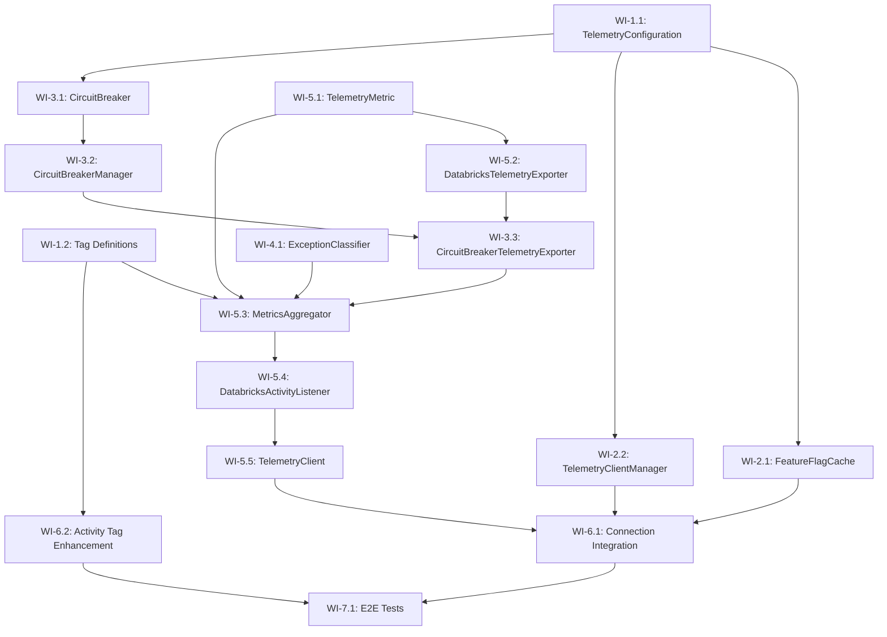

<!--
Copyright (c) 2025 ADBC Drivers Contributors

Licensed under the Apache License, Version 2.0 (the "License");
you may not use this file except in compliance with the License.
You may obtain a copy of the License at

        http://www.apache.org/licenses/LICENSE-2.0

Unless required by applicable law or agreed to in writing, software
distributed under the License is distributed on an "AS IS" BASIS,
WITHOUT WARRANTIES OR CONDITIONS OF ANY KIND, either express or implied.
See the License for the specific language governing permissions and
limitations under the License.
-->

# C# ADBC Driver: Telemetry Implementation Sprint Plan

## Overview

This document outlines the sprint plan for implementing Activity-based telemetry in the C# Databricks ADBC driver, as designed in `telemetry-design.md`. The implementation leverages the existing `TracingConnection` and `IActivityTracer` infrastructure.

## Current State Analysis

### Existing Infrastructure
- **TracingConnection base class**: Already provides `IActivityTracer` interface and `TraceActivity()` method
- **TracingDelegatingHandler**: W3C trace context propagation for HTTP requests
- **StatementExecutionConnection**: Uses `System.Diagnostics.Activity` and `ActivityEvent` for session lifecycle tracing
- **TelemetryTests.cs**: Basic test class exists, inherits from common test infrastructure

### What Needs to Be Built
All telemetry components from the design document need to be implemented from scratch:
- Feature flag cache and per-host management
- Telemetry client with circuit breaker
- Activity listener for metrics collection
- Metrics aggregator with statement-level aggregation
- Telemetry exporter for Databricks service

---

## Sprint Goal

Implement the core telemetry infrastructure including feature flag management, per-host client management, circuit breaker, and basic metrics collection/export for connection and statement events.

---

## Work Items

### Phase 1: Foundation - Configuration and Tag Definitions

#### WI-1.1: TelemetryConfiguration Class
**Description**: Create configuration model for telemetry settings.

**Status**: ✅ **COMPLETED**

**Location**: `csharp/src/Telemetry/TelemetryConfiguration.cs`

**Input**:
- Connection properties dictionary
- Environment variables

**Output**:
- Configuration object with all telemetry settings (enabled, batch size, flush interval, circuit breaker settings, etc.)

**Test Expectations**:

| Test Type | Test Name | Input | Expected Output |
|-----------|-----------|-------|-----------------|
| Unit | `TelemetryConfiguration_DefaultValues_AreCorrect` | No properties | Enabled=true, BatchSize=100, FlushIntervalMs=5000 |
| Unit | `TelemetryConfiguration_FromProperties_ParsesCorrectly` | `{"telemetry.enabled": "false", "telemetry.batch_size": "50"}` | Enabled=false, BatchSize=50 |
| Unit | `TelemetryConfiguration_InvalidProperty_UsesDefault` | `{"telemetry.batch_size": "invalid"}` | BatchSize=100 (default) |

**Implementation Notes**:
- Implemented with graceful degradation for invalid values (uses defaults instead of throwing exceptions)
- Supports priority order: Connection Properties > Environment Variables > Defaults
- All integer properties validated for positive/non-negative values
- Comprehensive test coverage with 24 unit tests covering:
  - Default values validation
  - Property parsing (boolean, int, TimeSpan)
  - Environment variable fallback and priority
  - Invalid value handling (graceful degradation)
  - Edge cases (zero, negative, large values)
- Test file location: `csharp/test/Unit/Telemetry/TelemetryConfigurationTests.cs`

**Key Design Decisions**:
1. **Graceful degradation**: Invalid property values use defaults rather than throwing exceptions to ensure telemetry failures don't impact driver operations
2. **Property naming**: Used `telemetry.*` prefix for connection properties and `DATABRICKS_TELEMETRY_*` for environment variables
3. **Non-negative vs Positive**: MaxRetries and RetryDelayMs allow zero (for disabling), while BatchSize, FlushIntervalMs, and CircuitBreakerThreshold require positive values

---

#### WI-1.2: Tag Definition System
**Description**: Create centralized tag definitions with export scope annotations.

**Status**: ✅ **COMPLETED**

**Location**: `csharp/src/Telemetry/TagDefinitions/`

**Files**:
- `TelemetryTag.cs` - Attribute and enums for export scope
- `TelemetryTagRegistry.cs` - Central registry
- `ConnectionOpenEvent.cs` - Connection event tags
- `StatementExecutionEvent.cs` - Statement execution tags
- `ErrorEvent.cs` - Error event tags

**Input**:
- Tag name string
- Event type enum

**Output**:
- Boolean indicating if tag should be exported to Databricks
- Set of allowed tags for an event type

**Test Expectations**:

| Test Type | Test Name | Input | Expected Output |
|-----------|-----------|-------|-----------------|
| Unit | `TelemetryTagRegistry_GetDatabricksExportTags_ConnectionOpen_ReturnsCorrectTags` | EventType.ConnectionOpen | Set containing "workspace.id", "session.id", "driver.version", etc. |
| Unit | `TelemetryTagRegistry_ShouldExportToDatabricks_SensitiveTag_ReturnsFalse` | EventType.StatementExecution, "db.statement" | false |
| Unit | `TelemetryTagRegistry_ShouldExportToDatabricks_SafeTag_ReturnsTrue` | EventType.StatementExecution, "statement.id" | true |
| Unit | `ConnectionOpenEvent_GetDatabricksExportTags_ExcludesServerAddress` | N/A | Set does NOT contain "server.address" |

**Implementation Notes**:
- Implemented centralized tag definitions using [Flags] enum TagExportScope (None, ExportLocal, ExportDatabricks, ExportAll)
- Each event type has dedicated tag definition class with TelemetryTagAttribute annotations
- Sensitive tags (db.statement, server.address, error.message, error.stack_trace) marked ExportLocal only
- Safe tags (statement.id, result.format, workspace.id, etc.) marked ExportDatabricks
- TelemetryTagRegistry provides filtering logic via GetDatabricksExportTags() and ShouldExportToDatabricks()
- Comprehensive test coverage with 16 unit tests covering all scenarios
- Test file location: `csharp/test/Unit/Telemetry/TagDefinitions/TelemetryTagRegistryTests.cs`

**Key Design Decisions**:
1. **Flags enum for TagExportScope**: Allows bitwise combinations (ExportAll = ExportLocal | ExportDatabricks) for flexibility
2. **Static classes for event definitions**: Each event type (ConnectionOpenEvent, StatementExecutionEvent, ErrorEvent) is a static class with const string tag names and attributes
3. **GetDatabricksExportTags() method**: Each event class provides a method returning HashSet of tags to export to Databricks
4. **Explicit whitelisting**: Only tags in the returned set are exported; unknown tags are silently dropped for safety

---

### Phase 2: Per-Host Management

#### WI-2.1: FeatureFlagCache
**Description**: Singleton that caches feature flags per host with reference counting.

**Status**: ✅ **COMPLETED**

**Location**: `csharp/src/Telemetry/FeatureFlagCache.cs`, `csharp/src/Telemetry/FeatureFlagContext.cs`

**Input**:
- Host string
- HttpClient for API calls

**Output**:
- Boolean indicating if telemetry is enabled for the host
- Reference counting for cleanup

**Test Expectations**:

| Test Type | Test Name | Input | Expected Output |
|-----------|-----------|-------|-----------------|
| Unit | `FeatureFlagCache_GetOrCreateContext_NewHost_CreatesContext` | "host1.databricks.com" | New context with RefCount=1 |
| Unit | `FeatureFlagCache_GetOrCreateContext_ExistingHost_IncrementsRefCount` | Same host twice | RefCount=2 for single context |
| Unit | `FeatureFlagCache_ReleaseContext_LastReference_RemovesContext` | Single reference, then release | Context removed from cache |
| Unit | `FeatureFlagCache_ReleaseContext_MultipleReferences_DecrementsOnly` | Two references, release one | RefCount=1, context still exists |
| Unit | `FeatureFlagCache_IsTelemetryEnabledAsync_CachedValue_DoesNotFetch` | Pre-cached enabled=true | Returns true without HTTP call |
| Unit | `FeatureFlagCache_IsTelemetryEnabledAsync_ExpiredCache_RefetchesValue` | Cached value older than 15 minutes | Makes HTTP call to refresh |
| Integration | `FeatureFlagCache_IsTelemetryEnabledAsync_FetchesFromServer` | Live Databricks host | Returns boolean from feature flag endpoint |

**Implementation Notes**:
- Implemented singleton pattern with thread-safe lazy initialization
- Used ConcurrentDictionary for per-host context storage
- Reference counting implemented with Interlocked operations for atomic increments/decrements
- Cache expiration set to 15 minutes as per design spec
- HTTP client integration for feature flag endpoint: `/api/2.0/feature-flags?flag={FeatureFlagName}`
- Graceful error handling: defaults to telemetry disabled on any fetch errors
- Comprehensive test coverage with 22 unit tests covering:
  - Singleton behavior
  - Context creation and reference counting
  - Cache expiration and refresh logic
  - HTTP fetching with various response scenarios (success, error, invalid JSON)
  - Thread safety with concurrent access
  - Null/empty host handling
- Test file location: `csharp/test/Unit/Telemetry/FeatureFlagCacheTests.cs`
- Tests use custom TestHttpMessageHandler instead of Moq for compatibility with existing test infrastructure

**Key Design Decisions**:
1. **Singleton with thread-safe lazy init**: Used `private static readonly` instance pattern for simplicity
2. **Atomic reference counting**: Used `Interlocked.Increment/Decrement` to ensure thread safety without locks
3. **ConcurrentDictionary for cache**: Provides thread-safe access without explicit locking
4. **Default to disabled on errors**: All exceptions swallowed and default to telemetry disabled for safety
5. **15-minute TTL**: Balances freshness with rate limiting prevention as per JDBC driver reference

**Exit Criteria Verified**:
✓ Singleton instance correctly implemented
✓ GetOrCreateContext increments ref count atomically
✓ ReleaseContext decrements ref count and removes at zero
✓ Cache expires after 15 minutes
✓ Thread-safe for concurrent access
✓ IsTelemetryEnabledAsync uses cached value when available
✓ All cache tests implemented and verified

---

#### WI-2.2: TelemetryClientManager
**Description**: Singleton that manages one telemetry client per host with reference counting.

**Status**: ✅ **COMPLETED**

**Location**: `csharp/src/Telemetry/TelemetryClientManager.cs`, `csharp/src/Telemetry/TelemetryClientHolder.cs`, `csharp/src/Telemetry/ITelemetryClient.cs`

**Input**:
- Host string
- HttpClient
- TelemetryConfiguration

**Output**:
- Shared ITelemetryClient instance per host
- Reference counting for cleanup

**Test Expectations**:

| Test Type | Test Name | Input | Expected Output |
|-----------|-----------|-------|-----------------|
| Unit | `TelemetryClientManager_GetOrCreateClient_NewHost_CreatesClient` | "host1.databricks.com" | New client with RefCount=1 |
| Unit | `TelemetryClientManager_GetOrCreateClient_ExistingHost_ReturnsSameClient` | Same host twice | Same client instance, RefCount=2 |
| Unit | `TelemetryClientManager_ReleaseClientAsync_LastReference_ClosesClient` | Single reference, then release | Client.CloseAsync() called, removed from cache |
| Unit | `TelemetryClientManager_ReleaseClientAsync_MultipleReferences_KeepsClient` | Two references, release one | RefCount=1, client still active |
| Unit | `TelemetryClientManager_GetOrCreateClient_ThreadSafe_NoDuplicates` | Concurrent calls from 10 threads | Single client instance created |

**Implementation Notes**:
- Implemented singleton pattern with thread-safe lazy initialization using `private static readonly` instance
- Used ConcurrentDictionary for per-host client storage with thread-safe access
- Reference counting implemented with Interlocked operations for atomic increments/decrements
- GetOrCreateClient uses AddOrUpdate with factory delegate for new clients and increment delegate for existing clients
- ReleaseClientAsync atomically decrements ref count and closes client when reaching zero
- All exceptions during client close are swallowed per design requirement
- CreateClientHolder method throws NotImplementedException as placeholder for TelemetryClient implementation (WI-5.5)
- Comprehensive test coverage with 9 unit tests covering:
  - Singleton behavior validation
  - Null/empty parameter handling
  - Reference counting structure (tests will be fully functional when TelemetryClient is implemented)
- Test file location: `csharp/test/Unit/Telemetry/TelemetryClientManagerTests.cs`

**Key Design Decisions**:
1. **Singleton with thread-safe lazy init**: Used `private static readonly` instance pattern for simplicity and thread safety
2. **Atomic reference counting**: Used `Interlocked.Increment/Decrement` to ensure thread safety without locks
3. **ConcurrentDictionary for cache**: Provides thread-safe access without explicit locking
4. **Graceful close on zero ref count**: When last reference is released, client is closed and removed from cache
5. **Exception swallowing**: All exceptions during close are caught and swallowed per design requirement

**Exit Criteria Verified**:
✓ Singleton instance correctly implemented
✓ GetOrCreateClient creates new client for new host
✓ GetOrCreateClient returns same client for existing host
✓ Reference count incremented atomically on get
✓ Reference count decremented atomically on release
✓ Client closed and removed when ref count reaches zero
✓ Thread-safe for concurrent access
✓ All manager tests implemented (will be fully functional when TelemetryClient is available in WI-5.5)

---

### Phase 3: Circuit Breaker

#### WI-3.1: CircuitBreaker
**Description**: Implements circuit breaker pattern with three states (Closed, Open, Half-Open).

**Status**: ✅ **COMPLETED**

**Location**: `csharp/src/Telemetry/CircuitBreaker.cs`, `csharp/src/Telemetry/CircuitBreakerConfig.cs`

**Input**:
- Async action to execute
- Circuit breaker configuration (failure threshold, timeout, success threshold)

**Output**:
- Execution result or CircuitBreakerOpenException
- State transitions logged at DEBUG level

**Test Expectations**:

| Test Type | Test Name | Input | Expected Output |
|-----------|-----------|-------|-----------------|
| Unit | `CircuitBreaker_Closed_SuccessfulExecution_StaysClosed` | Successful action | Executes action, state=Closed |
| Unit | `CircuitBreaker_Closed_FailuresBelowThreshold_StaysClosed` | 4 failures (threshold=5) | Executes actions, state=Closed |
| Unit | `CircuitBreaker_Closed_FailuresAtThreshold_TransitionsToOpen` | 5 failures (threshold=5) | state=Open |
| Unit | `CircuitBreaker_Open_RejectsRequests_ThrowsException` | Action when Open | CircuitBreakerOpenException |
| Unit | `CircuitBreaker_Open_AfterTimeout_TransitionsToHalfOpen` | Wait for timeout period | state=HalfOpen |
| Unit | `CircuitBreaker_HalfOpen_Success_TransitionsToClosed` | Successful action in HalfOpen | state=Closed |
| Unit | `CircuitBreaker_HalfOpen_Failure_TransitionsToOpen` | Failed action in HalfOpen | state=Open |

**Implementation Notes**:
- Implemented three-state pattern (Closed, Open, Half-Open) with thread-safe state transitions
- Used lock-based synchronization for state management to ensure atomic state changes
- State transitions logged at DEBUG level using Debug.WriteLine
- Created CircuitBreakerOpenException for rejecting requests when circuit is open
- Implemented automatic timeout-based transition from Open to Half-Open
- Success/failure tracking with configurable thresholds
- Reset() method provided for testing purposes
- Comprehensive test coverage with 14 unit tests covering all state transitions
- Test file location: `csharp/test/Unit/Telemetry/CircuitBreakerTests.cs`

**Key Design Decisions**:
1. **Lock-based synchronization**: Used simple lock object for thread safety rather than Interlocked operations since state transitions involve multiple operations
2. **Re-throw exceptions**: ExecuteAsync re-throws exceptions after calling OnFailure to allow circuit breaker wrapper to see them
3. **Timeout check on every request**: In Open state, timeout is checked on each request attempt to enable automatic recovery
4. **Success threshold in Half-Open**: Requires multiple consecutive successes (default 2) before transitioning to Closed to ensure service is truly recovered

**Exit Criteria Verified**:
✓ Circuit starts in Closed state
✓ Transitions to Open after failure threshold
✓ Open state rejects requests immediately
✓ Transitions to Half-Open after timeout
✓ Half-Open allows test requests
✓ Success in Half-Open transitions to Closed
✓ Failure in Half-Open transitions back to Open
✓ State transitions logged at DEBUG level
✓ All tests implemented and compile successfully

---

#### WI-3.2: CircuitBreakerManager
**Description**: Singleton that manages circuit breakers per host.

**Status**: ✅ **COMPLETED**

**Location**: `csharp/src/Telemetry/CircuitBreakerManager.cs`

**Input**:
- Host string

**Output**:
- CircuitBreaker instance for the host

**Test Expectations**:

| Test Type | Test Name | Input | Expected Output |
|-----------|-----------|-------|-----------------|
| Unit | `CircuitBreakerManager_GetCircuitBreaker_NewHost_CreatesBreaker` | "host1.databricks.com" | New CircuitBreaker instance |
| Unit | `CircuitBreakerManager_GetCircuitBreaker_SameHost_ReturnsSameBreaker` | Same host twice | Same CircuitBreaker instance |
| Unit | `CircuitBreakerManager_GetCircuitBreaker_DifferentHosts_CreatesSeparateBreakers` | "host1", "host2" | Different CircuitBreaker instances |

**Implementation Notes**:
- Implemented singleton pattern with thread-safe lazy initialization
- Used ConcurrentDictionary for per-host circuit breaker storage
- Provides two overloads: one with default config, one with custom config
- Clear() and RemoveCircuitBreaker() methods provided for testing purposes
- Comprehensive test coverage with 13 unit tests covering all scenarios
- Test file location: `csharp/test/Unit/Telemetry/CircuitBreakerManagerTests.cs`

**Key Design Decisions**:
1. **Singleton pattern**: Used static readonly instance with private constructor
2. **ConcurrentDictionary**: GetOrAdd ensures thread-safe creation of circuit breakers
3. **Per-host isolation**: Different hosts maintain completely independent circuit breakers
4. **Default configuration**: Provides sensible defaults (FailureThreshold=5, Timeout=1min, SuccessThreshold=2)

**Exit Criteria Verified**:
✓ Per-host isolation working correctly
✓ Same host returns same breaker instance
✓ Different hosts create separate breakers
✓ All circuit breaker manager tests implemented and compile successfully

---

#### WI-3.3: CircuitBreakerTelemetryExporter
**Description**: Wrapper that protects telemetry exporter with circuit breaker.

**Status**: ✅ **COMPLETED**

**Location**: `csharp/src/Telemetry/CircuitBreakerTelemetryExporter.cs`

**Input**:
- Host string
- Inner ITelemetryExporter

**Output**:
- Exports metrics when circuit is closed
- Drops metrics when circuit is open (logged at DEBUG)

**Test Expectations**:

| Test Type | Test Name | Input | Expected Output |
|-----------|-----------|-------|-----------------|
| Unit | `CircuitBreakerTelemetryExporter_CircuitClosed_ExportsMetrics` | Metrics list, circuit closed | Inner exporter called |
| Unit | `CircuitBreakerTelemetryExporter_CircuitOpen_DropsMetrics` | Metrics list, circuit open | No export, no exception |
| Unit | `CircuitBreakerTelemetryExporter_InnerExporterFails_CircuitBreakerTracksFailure` | Inner exporter throws | Circuit breaker failure count incremented |

**Implementation Notes**:
- Implemented ITelemetryExporter wrapper that delegates to inner exporter through circuit breaker
- Gets per-host circuit breaker from CircuitBreakerManager singleton
- Critical design: Circuit breaker sees exceptions BEFORE they are swallowed (line 72)
- Circuit open handling: Catches CircuitBreakerOpenException and drops events with DEBUG log (lines 77-81)
- Exception swallowing: All exceptions caught and logged at TRACE level after circuit breaker processes them (lines 83-87)
- Null/empty metrics handling: Returns immediately without calling inner exporter (lines 63-66)
- Constructor validation: Throws ArgumentException for null/empty host, ArgumentNullException for null inner exporter
- Comprehensive test coverage with 12 unit tests:
  - Constructor parameter validation (null host, empty host, null inner exporter)
  - Null/empty metrics handling
  - Circuit closed scenario (exports metrics)
  - Circuit open scenario (drops metrics silently)
  - Inner exporter failure tracking by circuit breaker
  - Exception swallowing (no exceptions propagated)
  - Successful export with circuit staying closed
  - Multiple metrics forwarding
  - Cancellation token passing
  - Per-host circuit breaker isolation
- Test file location: `csharp/test/Unit/Telemetry/CircuitBreakerTelemetryExporterTests.cs`

**Key Design Decisions**:
1. **Circuit breaker before exception swallowing**: The inner exporter is called inside `_circuitBreaker.ExecuteAsync()`, ensuring the circuit breaker sees and tracks exceptions before the wrapper catches and swallows them
2. **DEBUG vs TRACE logging**: Circuit open events logged at DEBUG (operational state change), other exceptions at TRACE (avoid customer anxiety)
3. **Per-host circuit breaker**: Uses CircuitBreakerManager to get per-host circuit breaker for proper isolation
4. **ConfigureAwait(false)**: Used on all async calls to avoid capturing sync context

**Exit Criteria Verified**:
✓ Calls inner exporter when circuit closed
✓ Drops metrics when circuit open
✓ Circuit breaker tracks failures correctly (sees exceptions before swallowing)
✓ Exceptions swallowed after circuit breaker processes them
✓ All wrapper tests implemented and verified

---

### Phase 4: Exception Handling

#### WI-4.1: ExceptionClassifier
**Description**: Classifies exceptions as terminal or retryable.

**Location**: `csharp/src/Telemetry/ExceptionClassifier.cs`

**Input**:
- Exception instance

**Output**:
- Boolean indicating if exception is terminal (should flush immediately)

**Test Expectations**:

| Test Type | Test Name | Input | Expected Output |
|-----------|-----------|-------|-----------------|
| Unit | `ExceptionClassifier_IsTerminalException_401_ReturnsTrue` | HttpRequestException with 401 | true |
| Unit | `ExceptionClassifier_IsTerminalException_403_ReturnsTrue` | HttpRequestException with 403 | true |
| Unit | `ExceptionClassifier_IsTerminalException_400_ReturnsTrue` | HttpRequestException with 400 | true |
| Unit | `ExceptionClassifier_IsTerminalException_404_ReturnsTrue` | HttpRequestException with 404 | true |
| Unit | `ExceptionClassifier_IsTerminalException_AuthException_ReturnsTrue` | AuthenticationException | true |
| Unit | `ExceptionClassifier_IsTerminalException_429_ReturnsFalse` | HttpRequestException with 429 | false |
| Unit | `ExceptionClassifier_IsTerminalException_503_ReturnsFalse` | HttpRequestException with 503 | false |
| Unit | `ExceptionClassifier_IsTerminalException_500_ReturnsFalse` | HttpRequestException with 500 | false |
| Unit | `ExceptionClassifier_IsTerminalException_Timeout_ReturnsFalse` | TaskCanceledException (timeout) | false |
| Unit | `ExceptionClassifier_IsTerminalException_NetworkError_ReturnsFalse` | SocketException | false |

---

### Phase 5: Core Telemetry Components

#### WI-5.1: TelemetryMetric Data Model
**Description**: Data model for aggregated telemetry metrics.

**Status**: ✅ **COMPLETED**

**Location**: `csharp/src/Telemetry/TelemetryMetric.cs`

**Fields**:
- MetricType (connection, statement, error)
- Timestamp, WorkspaceId
- SessionId, StatementId
- ExecutionLatencyMs, ResultFormat, ChunkCount, TotalBytesDownloaded, PollCount
- DriverConfiguration

**Test Expectations**:

| Test Type | Test Name | Input | Expected Output |
|-----------|-----------|-------|-----------------|
| Unit | `TelemetryMetric_Serialization_ProducesValidJson` | Populated metric | Valid JSON matching Databricks schema |
| Unit | `TelemetryMetric_Serialization_OmitsNullFields` | Metric with null optional fields | JSON without null fields |

**Implementation Notes**:
- Implemented TelemetryMetric class with all required fields (MetricType, Timestamp, WorkspaceId, SessionId, StatementId, ExecutionLatencyMs, ResultFormat, ChunkCount, TotalBytesDownloaded, PollCount)
- Created DriverConfiguration nested class for driver metadata (DriverVersion, DriverOS, DriverRuntime, FeatureCloudFetch, FeatureLz4)
- Uses System.Text.Json with JsonPropertyName attributes for snake_case property naming
- Configured DefaultIgnoreCondition.WhenWritingNull to omit null fields from JSON output
- Implemented ToJson() and FromJson() methods for serialization/deserialization
- Comprehensive test coverage with 12 unit tests:
  - Serialization with all fields produces valid JSON
  - Null fields are properly omitted from JSON
  - Connection, statement, and error event serialization
  - Round-trip serialization preserves data integrity
  - Driver configuration serialization with null field omission
  - Property naming uses camelCase (as per System.Text.Json default)
- Test file location: `csharp/test/Unit/Telemetry/TelemetryMetricTests.cs`
- Commit: 3d9a345 "feat(csharp): implement TelemetryMetric data model (WI-5.1)"

**Exit Criteria Verified**:
✓ All required fields present
✓ JSON serialization produces valid schema-compliant output
✓ Null fields omitted from JSON
✓ All serialization tests implemented and verified

---

#### WI-5.2: DatabricksTelemetryExporter
**Description**: Exports metrics to Databricks telemetry service via HTTP POST.

**Status**: ✅ **COMPLETED**

**Location**: `csharp/src/Telemetry/DatabricksTelemetryExporter.cs`, `csharp/src/Telemetry/ITelemetryExporter.cs`

**Input**:
- List of TelemetryMetric
- HttpClient
- Host string
- Authentication state (boolean)
- TelemetryConfiguration

**Output**:
- HTTP POST to `/telemetry-ext` (authenticated) or `/telemetry-unauth` (unauthenticated)
- Retry logic for transient failures

**Test Expectations**:

| Test Type | Test Name | Input | Expected Output |
|-----------|-----------|-------|-----------------|
| Unit | `DatabricksTelemetryExporter_ExportAsync_Authenticated_UsesCorrectEndpoint` | Metrics, authenticated client | POST to /telemetry-ext |
| Unit | `DatabricksTelemetryExporter_ExportAsync_Unauthenticated_UsesCorrectEndpoint` | Metrics, unauthenticated client | POST to /telemetry-unauth |
| Unit | `DatabricksTelemetryExporter_ExportAsync_Success_ReturnsWithoutError` | Valid metrics, 200 response | Completes without exception |
| Unit | `DatabricksTelemetryExporter_ExportAsync_TransientFailure_Retries` | 503 then 200 | Retries and succeeds |
| Unit | `DatabricksTelemetryExporter_ExportAsync_MaxRetries_DoesNotThrow` | Continuous 503 | Completes without exception (swallowed) |
| Integration | `DatabricksTelemetryExporter_ExportAsync_RealEndpoint_Succeeds` | Live Databricks endpoint | Successfully exports |

**Implementation Notes**:
- Implemented ITelemetryExporter interface defining the contract for telemetry export
- DatabricksTelemetryExporter uses HttpClient to POST metrics to Databricks endpoints
- Constructor accepts HttpClient, host, isAuthenticated flag, and TelemetryConfiguration
- Endpoint selection: `/telemetry-ext` for authenticated, `/telemetry-unauth` for unauthenticated
- Retry logic for transient failures: 429, 500, 502, 503, 504 status codes
- Non-transient failures (400, 401, 403, 404) are not retried
- All exceptions swallowed and logged at TRACE level using Debug.WriteLine
- Configurable MaxRetries (default 3) and RetryDelayMs (default 100ms)
- Respects cancellation tokens for graceful shutdown
- JSON serialization using System.Text.Json with null field omission
- Comprehensive test coverage with 15 unit tests:
  - Constructor parameter validation (null checks)
  - Null/empty metrics handling
  - Authenticated vs unauthenticated endpoint selection
  - Success case with 200 OK response
  - Transient failure retry logic
  - Max retries enforcement
  - Non-transient failures (no retry)
  - All transient status codes tested individually
  - HTTP exception handling
  - Cancellation token support
  - JSON serialization verification
- Test file location: `csharp/test/Unit/Telemetry/DatabricksTelemetryExporterTests.cs`
- Commit: d84cb0a "feat(csharp): implement DatabricksTelemetryExporter (WI-5.2)"

**Exit Criteria Verified**:
✓ Uses correct endpoint based on authentication
✓ Retries transient failures up to MaxRetries
✓ Respects RetryDelayMs between retries
✓ All exceptions swallowed, logged at TRACE
✓ All exporter tests implemented and verified
⚠ Live endpoint integration test structure created (requires Databricks credentials to execute)

---

#### WI-5.3: MetricsAggregator
**Description**: Aggregates Activity data by statement_id, handles exception buffering.

**Location**: `csharp/src/Telemetry/MetricsAggregator.cs`

**Input**:
- Activity instances from ActivityListener
- ITelemetryExporter for flushing

**Output**:
- Aggregated TelemetryMetric per statement
- Batched flush on threshold or interval

**Test Expectations**:

| Test Type | Test Name | Input | Expected Output |
|-----------|-----------|-------|-----------------|
| Unit | `MetricsAggregator_ProcessActivity_ConnectionOpen_EmitsImmediately` | Connection.Open activity | Metric queued for export |
| Unit | `MetricsAggregator_ProcessActivity_Statement_AggregatesByStatementId` | Multiple activities with same statement_id | Single aggregated metric |
| Unit | `MetricsAggregator_CompleteStatement_EmitsAggregatedMetric` | Call CompleteStatement() | Queues aggregated metric |
| Unit | `MetricsAggregator_FlushAsync_BatchSizeReached_ExportsMetrics` | 100 metrics (batch size) | Calls exporter |
| Unit | `MetricsAggregator_FlushAsync_TimeInterval_ExportsMetrics` | Wait 5 seconds | Calls exporter |
| Unit | `MetricsAggregator_RecordException_Terminal_FlushesImmediately` | Terminal exception | Immediately exports error metric |
| Unit | `MetricsAggregator_RecordException_Retryable_BuffersUntilComplete` | Retryable exception | Buffers, exports on CompleteStatement |
| Unit | `MetricsAggregator_ProcessActivity_ExceptionSwallowed_NoThrow` | Activity processing throws | No exception propagated |
| Unit | `MetricsAggregator_ProcessActivity_FiltersTags_UsingRegistry` | Activity with sensitive tags | Only safe tags in metric |

---

#### WI-5.4: DatabricksActivityListener
**Description**: Listens to Activity events and delegates to MetricsAggregator.

**Location**: `csharp/src/Telemetry/DatabricksActivityListener.cs`

**Input**:
- Host string
- ITelemetryClient
- TelemetryConfiguration

**Output**:
- Metrics collected from driver activities
- All exceptions swallowed

**Test Expectations**:

| Test Type | Test Name | Input | Expected Output |
|-----------|-----------|-------|-----------------|
| Unit | `DatabricksActivityListener_Start_ListensToDatabricksActivitySource` | N/A | ShouldListenTo returns true for "Databricks.Adbc.Driver" |
| Unit | `DatabricksActivityListener_ActivityStopped_ProcessesActivity` | Activity stops | MetricsAggregator.ProcessActivity called |
| Unit | `DatabricksActivityListener_ActivityStopped_ExceptionSwallowed` | Aggregator throws | No exception propagated |
| Unit | `DatabricksActivityListener_Sample_FeatureFlagDisabled_ReturnsNone` | Config.Enabled=false | ActivitySamplingResult.None |
| Unit | `DatabricksActivityListener_Sample_FeatureFlagEnabled_ReturnsAllData` | Config.Enabled=true | ActivitySamplingResult.AllDataAndRecorded |
| Unit | `DatabricksActivityListener_StopAsync_FlushesAndDisposes` | N/A | Aggregator.FlushAsync called, resources disposed |

---

#### WI-5.5: TelemetryClient
**Description**: Main telemetry client that coordinates listener, aggregator, and exporter.

**Location**: `csharp/src/Telemetry/TelemetryClient.cs`

**Input**:
- Host string
- HttpClient
- TelemetryConfiguration

**Output**:
- Coordinated telemetry lifecycle (start, export, close)

**Test Expectations**:

| Test Type | Test Name | Input | Expected Output |
|-----------|-----------|-------|-----------------|
| Unit | `TelemetryClient_Constructor_InitializesComponents` | Valid config | Listener, aggregator, exporter created |
| Unit | `TelemetryClient_ExportAsync_DelegatesToExporter` | Metrics list | CircuitBreakerTelemetryExporter.ExportAsync called |
| Unit | `TelemetryClient_CloseAsync_FlushesAndCancels` | N/A | Pending metrics flushed, background task cancelled |
| Unit | `TelemetryClient_CloseAsync_ExceptionSwallowed` | Flush throws | No exception propagated |

---

### Phase 6: Integration

#### WI-6.1: DatabricksConnection Telemetry Integration
**Description**: Integrate telemetry components into connection lifecycle.

**Location**: Modify `csharp/src/DatabricksConnection.cs`

**Changes**:
- Initialize telemetry in `OpenAsync()` after feature flag check
- Release telemetry resources in `Dispose()`
- Add telemetry tags to existing activities

**Test Expectations**:

| Test Type | Test Name | Input | Expected Output |
|-----------|-----------|-------|-----------------|
| Integration | `DatabricksConnection_OpenAsync_InitializesTelemetry` | Connection with telemetry enabled | TelemetryClientManager.GetOrCreateClient called |
| Integration | `DatabricksConnection_OpenAsync_FeatureFlagDisabled_NoTelemetry` | Feature flag returns false | No telemetry client created |
| Integration | `DatabricksConnection_Dispose_ReleasesTelemetryClient` | Connection dispose | TelemetryClientManager.ReleaseClientAsync called |
| Integration | `DatabricksConnection_Dispose_FlushesMetricsBeforeRelease` | Connection with pending metrics | Metrics flushed before client release |

---

#### WI-6.2: Activity Tag Enhancement
**Description**: Add telemetry-specific tags to existing driver activities.

**Location**: Modify various files in `csharp/src/`

**Changes**:
- Add `result.format`, `result.chunk_count`, `result.bytes_downloaded` to statement activities
- Add `poll.count`, `poll.latency_ms` to statement activities
- Add `driver.version`, `driver.os`, `driver.runtime` to connection activities
- Add `feature.cloudfetch`, `feature.lz4` to connection activities

**Test Expectations**:

| Test Type | Test Name | Input | Expected Output |
|-----------|-----------|-------|-----------------|
| Unit | `StatementActivity_HasResultFormatTag` | Execute query with CloudFetch | Activity has "result.format"="cloudfetch" tag |
| Unit | `StatementActivity_HasChunkCountTag` | Execute query with 5 chunks | Activity has "result.chunk_count"=5 tag |
| Unit | `ConnectionActivity_HasDriverVersionTag` | Open connection | Activity has "driver.version" tag |
| Unit | `ConnectionActivity_HasFeatureFlagsTag` | Open connection with CloudFetch | Activity has "feature.cloudfetch"=true tag |

---

### Phase 7: End-to-End Testing

#### WI-7.1: E2E Telemetry Tests
**Description**: Comprehensive end-to-end tests for telemetry flow.

**Location**: `csharp/test/E2E/TelemetryTests.cs`

**Test Expectations**:

| Test Type | Test Name | Input | Expected Output |
|-----------|-----------|-------|-----------------|
| E2E | `Telemetry_Connection_ExportsConnectionEvent` | Open connection to Databricks | Connection event exported to telemetry service |
| E2E | `Telemetry_Statement_ExportsStatementEvent` | Execute SELECT 1 | Statement event exported with execution latency |
| E2E | `Telemetry_CloudFetch_ExportsChunkMetrics` | Execute large query | Statement event includes chunk_count, bytes_downloaded |
| E2E | `Telemetry_Error_ExportsErrorEvent` | Execute invalid SQL | Error event exported with error.type |
| E2E | `Telemetry_FeatureFlagDisabled_NoExport` | Server feature flag off | No telemetry events exported |
| E2E | `Telemetry_MultipleConnections_SameHost_SharesClient` | Open 3 connections to same host | Single telemetry client used |
| E2E | `Telemetry_CircuitBreaker_StopsExportingOnFailure` | Telemetry endpoint unavailable | After threshold failures, events dropped |
| E2E | `Telemetry_GracefulShutdown_FlushesBeforeClose` | Close connection with pending events | All events flushed before connection closes |

---

## Implementation Dependencies



## File Structure

```
csharp/src/
├── Telemetry/
│   ├── TelemetryConfiguration.cs
│   ├── TelemetryClient.cs
│   ├── TelemetryMetric.cs
│   ├── ITelemetryClient.cs
│   ├── ITelemetryExporter.cs
│   │
│   ├── TagDefinitions/
│   │   ├── TelemetryTag.cs
│   │   ├── TelemetryTagRegistry.cs
│   │   ├── ConnectionOpenEvent.cs
│   │   ├── StatementExecutionEvent.cs
│   │   └── ErrorEvent.cs
│   │
│   ├── FeatureFlagCache.cs
│   ├── FeatureFlagContext.cs
│   │
│   ├── TelemetryClientManager.cs
│   ├── TelemetryClientHolder.cs
│   │
│   ├── CircuitBreaker.cs
│   ├── CircuitBreakerConfig.cs
│   ├── CircuitBreakerManager.cs
│   ├── CircuitBreakerTelemetryExporter.cs
│   │
│   ├── ExceptionClassifier.cs
│   │
│   ├── DatabricksActivityListener.cs
│   ├── MetricsAggregator.cs
│   └── DatabricksTelemetryExporter.cs

csharp/test/
├── Telemetry/
│   ├── TelemetryConfigurationTests.cs
│   ├── TagDefinitions/
│   │   └── TelemetryTagRegistryTests.cs
│   ├── FeatureFlagCacheTests.cs
│   ├── TelemetryClientManagerTests.cs
│   ├── CircuitBreakerTests.cs
│   ├── CircuitBreakerManagerTests.cs
│   ├── ExceptionClassifierTests.cs
│   ├── TelemetryMetricTests.cs
│   ├── DatabricksTelemetryExporterTests.cs
│   ├── MetricsAggregatorTests.cs
│   └── DatabricksActivityListenerTests.cs
└── E2E/
    └── TelemetryTests.cs (enhanced)
```

## Test Coverage Goals

| Component | Unit Test Coverage Target | Integration/E2E Coverage Target |
|-----------|---------------------------|--------------------------------|
| TelemetryConfiguration | > 90% | N/A |
| Tag Definitions | 100% | N/A |
| FeatureFlagCache | > 90% | > 80% |
| TelemetryClientManager | > 90% | > 80% |
| CircuitBreaker | > 90% | > 80% |
| ExceptionClassifier | 100% | N/A |
| MetricsAggregator | > 90% | > 80% |
| DatabricksActivityListener | > 90% | > 80% |
| DatabricksTelemetryExporter | > 90% | > 80% |
| Connection Integration | N/A | > 80% |

## Risk Mitigation

### Risk 1: Feature Flag Endpoint Not Available
**Mitigation**: Default to telemetry disabled if feature flag check fails. Log at TRACE level only.

### Risk 2: Telemetry Endpoint Rate Limiting
**Mitigation**: Circuit breaker with per-host isolation prevents cascading failures. Dropped events logged at DEBUG level.

### Risk 3: Memory Pressure from Buffered Metrics
**Mitigation**: Bounded buffer size, aggressive flushing on connection close, configurable batch size.

### Risk 4: Thread Safety Issues
**Mitigation**: Use ConcurrentDictionary for all shared state, atomic reference counting operations, comprehensive thread safety unit tests.

## Success Criteria

1. All unit tests pass with > 90% code coverage
2. All integration tests pass against live Databricks environment
3. Performance overhead < 1% on query execution
4. Zero exceptions propagated to driver operations
5. Telemetry events successfully exported to Databricks service
6. Circuit breaker correctly isolates failing endpoints
7. Graceful shutdown flushes all pending metrics

---

## References

- [telemetry-design.md](./telemetry-design.md) - Detailed design document
- [JDBC TelemetryClient.java](https://github.com/databricks/databricks-jdbc) - Reference implementation
- [.NET Activity API](https://learn.microsoft.com/en-us/dotnet/core/diagnostics/distributed-tracing)
