<!--
Copyright (c) 2025 ADBC Drivers Contributors

Licensed under the Apache License, Version 2.0 (the "License");
you may not use this file except in compliance with the License.
You may obtain a copy of the License at

        http://www.apache.org/licenses/LICENSE-2.0

Unless required by applicable law or agreed to in writing, software
distributed under the License is distributed on an "AS IS" BASIS,
WITHOUT WARRANTIES OR CONDITIONS OF ANY KIND, either express or implied.
See the License for the specific language governing permissions and
limitations under the License.
-->

# C# ADBC Driver: Telemetry Implementation Sprint Plan

## Overview

This document outlines the sprint plan for implementing Activity-based telemetry in the C# Databricks ADBC driver, as designed in `telemetry-design.md`. The implementation leverages the existing `TracingConnection` and `IActivityTracer` infrastructure.

## Current State Analysis

### Existing Infrastructure
- **TracingConnection base class**: Already provides `IActivityTracer` interface and `TraceActivity()` method
- **TracingDelegatingHandler**: W3C trace context propagation for HTTP requests
- **StatementExecutionConnection**: Uses `System.Diagnostics.Activity` and `ActivityEvent` for session lifecycle tracing
- **TelemetryTests.cs**: Basic test class exists, inherits from common test infrastructure

### Implementation Status (Verified from Code)

| Work Item | Status | Location |
|-----------|--------|----------|
| WI-1.1: TelemetryConfiguration | ✅ **COMPLETED** | `src/Telemetry/TelemetryConfiguration.cs` |
| WI-1.1 Tests | ✅ **COMPLETED** | `test/Unit/Telemetry/TelemetryConfigurationTests.cs` |
| WI-1.2: Tag Definition System | ❌ NOT STARTED | - |
| WI-1.3: ExceptionClassifier | ❌ NOT STARTED | - |
| WI-2.x: Per-Host Management | ❌ NOT STARTED | - |
| WI-3.x: Circuit Breaker | ❌ NOT STARTED | - |
| WI-5.x: Core Components | ❌ NOT STARTED | - |
| WI-6.x: Integration | ❌ NOT STARTED | - |
| WI-7.x: E2E Tests | ❌ NOT STARTED | Only stub class exists |

### What Needs to Be Built
All telemetry components from the design document need to be implemented from scratch:
- Feature flag cache and per-host management
- Telemetry client with circuit breaker
- Activity listener for metrics collection
- Metrics aggregator with statement-level aggregation
- Telemetry exporter for Databricks service
- Data models (TelemetryEvent, TelemetryFrontendLog, TelemetryRequest)

---

## Sprint Goal

Implement the core telemetry infrastructure including feature flag management, per-host client management, circuit breaker, and basic metrics collection/export for connection and statement events.

**Key Milestones:**
1. **Phase 1**: Foundation (Configuration ✅, Tag Definitions)
2. **Phase 2**: Data Models + Exporter (combined for iterative validation)
3. **Phase 3**: Exception Handling
4. **Phase 4**: Circuit Breaker
5. **Phase 5**: Per-Host Management
6. **Phase 6**: Core Components (Aggregator, Listener, TelemetryClient)
7. **Phase 7**: 🚧 **E2E GATE** - All dedicated E2E tests MUST pass before proceeding
8. **Phase 8**: Integration with DatabricksConnection
9. **Phase 9**: Full Integration E2E Tests

**Data Model Update:** This sprint uses the JDBC-compatible data model (`TelemetryRequest`, `TelemetryFrontendLog`, `TelemetryEvent`) instead of the original `TelemetryMetric` to ensure backend compatibility.

---

## Work Items

### Phase 1: Foundation - Configuration and Tag Definitions

#### WI-1.1: TelemetryConfiguration Class
**Description**: Create configuration model for telemetry settings.

**Status**: ✅ **COMPLETED**

**Location**: `csharp/src/Telemetry/TelemetryConfiguration.cs`

**Input**:
- Connection properties dictionary
- Environment variables

**Output**:
- Configuration object with all telemetry settings (enabled, batch size, flush interval, circuit breaker settings, etc.)

**Test Expectations**:

| Test Type | Test Name | Input | Expected Output |
|-----------|-----------|-------|-----------------|
| Unit | `TelemetryConfiguration_DefaultValues_AreCorrect` | No properties | Enabled=true, BatchSize=100, FlushIntervalMs=5000 |
| Unit | `TelemetryConfiguration_FromProperties_ParsesCorrectly` | `{"telemetry.enabled": "false", "telemetry.batch_size": "50"}` | Enabled=false, BatchSize=50 |
| Unit | `TelemetryConfiguration_InvalidProperty_UsesDefault` | `{"telemetry.batch_size": "invalid"}` | BatchSize=100 (default) |

**Implementation Notes**:
- Implemented with graceful degradation for invalid values (uses defaults instead of throwing exceptions)
- Supports priority order: Connection Properties > Environment Variables > Defaults
- All integer properties validated for positive/non-negative values
- Comprehensive test coverage with 24 unit tests covering:
  - Default values validation
  - Property parsing (boolean, int, TimeSpan)
  - Environment variable fallback and priority
  - Invalid value handling (graceful degradation)
  - Edge cases (zero, negative, large values)
- Test file location: `csharp/test/Unit/Telemetry/TelemetryConfigurationTests.cs`

**Key Design Decisions**:
1. **Graceful degradation**: Invalid property values use defaults rather than throwing exceptions to ensure telemetry failures don't impact driver operations
2. **Property naming**: Used `telemetry.*` prefix for connection properties and `DATABRICKS_TELEMETRY_*` for environment variables
3. **Non-negative vs Positive**: MaxRetries and RetryDelayMs allow zero (for disabling), while BatchSize, FlushIntervalMs, and CircuitBreakerThreshold require positive values

---

#### WI-1.2: Tag Definition System
**Description**: Create centralized tag definitions with export scope annotations.

**Status**: ❌ **NOT STARTED**

**Location**: `csharp/src/Telemetry/TagDefinitions/`

**Files**:
- `TelemetryTag.cs` - Attribute and enums for export scope
- `TelemetryTagRegistry.cs` - Central registry
- `ConnectionOpenEvent.cs` - Connection event tags
- `StatementExecutionEvent.cs` - Statement execution tags
- `ErrorEvent.cs` - Error event tags

**Input**:
- Tag name string
- Event type enum

**Output**:
- Boolean indicating if tag should be exported to Databricks
- Set of allowed tags for an event type

**Test Expectations**:

| Test Type | Test Name | Input | Expected Output |
|-----------|-----------|-------|-----------------|
| Unit | `TelemetryTagRegistry_GetDatabricksExportTags_ConnectionOpen_ReturnsCorrectTags` | EventType.ConnectionOpen | Set containing "workspace.id", "session.id", "driver.version", etc. |
| Unit | `TelemetryTagRegistry_ShouldExportToDatabricks_SensitiveTag_ReturnsFalse` | EventType.StatementExecution, "db.statement" | false |
| Unit | `TelemetryTagRegistry_ShouldExportToDatabricks_SafeTag_ReturnsTrue` | EventType.StatementExecution, "statement.id" | true |
| Unit | `ConnectionOpenEvent_GetDatabricksExportTags_ExcludesServerAddress` | N/A | Set does NOT contain "server.address" |

---

### Phase 2: Data Models + Exporter (Combined)

> **Priority**: Implement data models and exporter together to validate the JSON format against the real Databricks endpoint. This enables early E2E testing and iteration on the data model until it matches what the backend expects.

#### WI-2.1: Telemetry Data Models & Exporter
**Description**: Data models for telemetry following JDBC driver format, combined with the HTTP exporter to validate the format against real endpoints.

**Status**: ❌ **NOT STARTED**

**Location**:
- `csharp/src/Telemetry/Models/` - Data model classes
- `csharp/src/Telemetry/DatabricksTelemetryExporter.cs` - HTTP exporter

**Data Model Files**:
- `TelemetryRequest.cs` - Top-level wrapper with uploadTime and protoLogs array
- `TelemetryFrontendLog.cs` - Individual log entry with workspace_id, context, entry
- `TelemetryEvent.cs` - Core telemetry data (session_id, statement_id, system_configuration, etc.)
- `FrontendLogContext.cs` - Context wrapper
- `TelemetryClientContext.cs` - Client context (timestamp, user_agent)
- `FrontendLogEntry.cs` - Entry wrapper (contains sql_driver_log)
- `DriverSystemConfiguration.cs` - Driver and system info
- `DriverConnectionParameters.cs` - Connection parameters
- `SqlExecutionEvent.cs` - Statement execution details
- `DriverErrorInfo.cs` - Error information

**Exporter Responsibilities**:
- Creates TelemetryRequest wrapper with uploadTime and protoLogs array
- JSON serializes each TelemetryFrontendLog and adds to protoLogs
- HTTP POST to `/telemetry-ext` (authenticated) or `/telemetry-unauth` (unauthenticated)
- Retry logic for transient failures

**Test Expectations**:

| Test Type | Test Name | Input | Expected Output |
|-----------|-----------|-------|-----------------|
| Unit | `TelemetryRequest_Serialization_ProducesValidJson` | Populated request | Valid JSON with uploadTime and protoLogs |
| Unit | `TelemetryFrontendLog_Serialization_MatchesJdbcFormat` | Populated log | JSON matching JDBC driver format |
| Unit | `TelemetryEvent_Serialization_OmitsNullFields` | Event with null optional fields | JSON without null fields |
| Unit | `TelemetryRequest_ProtoLogs_ContainsSerializedStrings` | Multiple events | protoLogs array contains JSON strings |
| Unit | `DatabricksTelemetryExporter_ExportAsync_Authenticated_UsesCorrectEndpoint` | Events, authenticated client | POST to /telemetry-ext |
| Unit | `DatabricksTelemetryExporter_ExportAsync_Unauthenticated_UsesCorrectEndpoint` | Events, unauthenticated client | POST to /telemetry-unauth |
| Unit | `DatabricksTelemetryExporter_ExportAsync_Success_ReturnsWithoutError` | Valid events, 200 response | Completes without exception |
| Unit | `DatabricksTelemetryExporter_ExportAsync_TransientFailure_Retries` | 503 then 200 | Retries and succeeds |
| Unit | `DatabricksTelemetryExporter_ExportAsync_MaxRetries_DoesNotThrow` | Continuous 503 | Completes without exception (swallowed) |
| **E2E** | `TelemetryExporter_ExportAsync_RealEndpoint_ReturnsSuccess` | Valid TelemetryRequest | HTTP 200 from real endpoint |
| **E2E** | `TelemetryExporter_ExportAsync_ProtoLogsFormat_MatchesJdbcDriver` | TelemetryFrontendLog | Request body accepted by backend |

**Development Approach**:
1. Start with minimal data model based on JDBC driver format
2. Implement exporter with basic HTTP POST
3. Run E2E test against real endpoint
4. Iterate on data model until backend accepts the payload
5. Add remaining fields once basic format is validated

---

### Phase 3: Exception Handling

#### WI-3.1: ExceptionClassifier
**Description**: Classifies exceptions as terminal or retryable.

**Status**: ❌ **NOT STARTED**

**Location**: `csharp/src/Telemetry/ExceptionClassifier.cs`

**Input**:
- Exception instance

**Output**:
- Boolean indicating if exception is terminal (should flush immediately)

**Test Expectations**:

| Test Type | Test Name | Input | Expected Output |
|-----------|-----------|-------|-----------------|
| Unit | `ExceptionClassifier_IsTerminalException_401_ReturnsTrue` | HttpRequestException with 401 | true |
| Unit | `ExceptionClassifier_IsTerminalException_403_ReturnsTrue` | HttpRequestException with 403 | true |
| Unit | `ExceptionClassifier_IsTerminalException_400_ReturnsTrue` | HttpRequestException with 400 | true |
| Unit | `ExceptionClassifier_IsTerminalException_404_ReturnsTrue` | HttpRequestException with 404 | true |
| Unit | `ExceptionClassifier_IsTerminalException_AuthException_ReturnsTrue` | AuthenticationException | true |
| Unit | `ExceptionClassifier_IsTerminalException_429_ReturnsFalse` | HttpRequestException with 429 | false |
| Unit | `ExceptionClassifier_IsTerminalException_503_ReturnsFalse` | HttpRequestException with 503 | false |
| Unit | `ExceptionClassifier_IsTerminalException_500_ReturnsFalse` | HttpRequestException with 500 | false |
| Unit | `ExceptionClassifier_IsTerminalException_Timeout_ReturnsFalse` | TaskCanceledException (timeout) | false |
| Unit | `ExceptionClassifier_IsTerminalException_NetworkError_ReturnsFalse` | SocketException | false |

---

### Phase 4: Circuit Breaker

#### WI-4.1: CircuitBreaker
**Description**: Implements circuit breaker pattern with three states (Closed, Open, Half-Open).

**Status**: ❌ **NOT STARTED**

**Location**: `csharp/src/Telemetry/CircuitBreaker.cs`

**Input**:
- Async action to execute
- Circuit breaker configuration (failure threshold, timeout, success threshold)

**Output**:
- Execution result or CircuitBreakerOpenException
- State transitions logged at DEBUG level

**Test Expectations**:

| Test Type | Test Name | Input | Expected Output |
|-----------|-----------|-------|-----------------|
| Unit | `CircuitBreaker_Closed_SuccessfulExecution_StaysClosed` | Successful action | Executes action, state=Closed |
| Unit | `CircuitBreaker_Closed_FailuresBelowThreshold_StaysClosed` | 4 failures (threshold=5) | Executes actions, state=Closed |
| Unit | `CircuitBreaker_Closed_FailuresAtThreshold_TransitionsToOpen` | 5 failures (threshold=5) | state=Open |
| Unit | `CircuitBreaker_Open_RejectsRequests_ThrowsException` | Action when Open | CircuitBreakerOpenException |
| Unit | `CircuitBreaker_Open_AfterTimeout_TransitionsToHalfOpen` | Wait for timeout period | state=HalfOpen |
| Unit | `CircuitBreaker_HalfOpen_Success_TransitionsToClosed` | Successful action in HalfOpen | state=Closed |
| Unit | `CircuitBreaker_HalfOpen_Failure_TransitionsToOpen` | Failed action in HalfOpen | state=Open |

---

#### WI-4.2: CircuitBreakerManager
**Description**: Singleton that manages circuit breakers per host.

**Status**: ❌ **NOT STARTED**

**Location**: `csharp/src/Telemetry/CircuitBreakerManager.cs`

**Input**:
- Host string

**Output**:
- CircuitBreaker instance for the host

**Test Expectations**:

| Test Type | Test Name | Input | Expected Output |
|-----------|-----------|-------|-----------------|
| Unit | `CircuitBreakerManager_GetCircuitBreaker_NewHost_CreatesBreaker` | "host1.databricks.com" | New CircuitBreaker instance |
| Unit | `CircuitBreakerManager_GetCircuitBreaker_SameHost_ReturnsSameBreaker` | Same host twice | Same CircuitBreaker instance |
| Unit | `CircuitBreakerManager_GetCircuitBreaker_DifferentHosts_CreatesSeparateBreakers` | "host1", "host2" | Different CircuitBreaker instances |

---

#### WI-4.3: CircuitBreakerTelemetryExporter
**Description**: Wrapper that protects telemetry exporter with circuit breaker.

**Status**: ❌ **NOT STARTED**

**Location**: `csharp/src/Telemetry/CircuitBreakerTelemetryExporter.cs`

**Input**:
- Host string
- Inner ITelemetryExporter

**Output**:
- Exports events when circuit is closed
- Drops events when circuit is open (logged at DEBUG)

**Test Expectations**:

| Test Type | Test Name | Input | Expected Output |
|-----------|-----------|-------|-----------------|
| Unit | `CircuitBreakerTelemetryExporter_CircuitClosed_ExportsEvents` | Events list, circuit closed | Inner exporter called |
| Unit | `CircuitBreakerTelemetryExporter_CircuitOpen_DropsEvents` | Events list, circuit open | No export, no exception |
| Unit | `CircuitBreakerTelemetryExporter_InnerExporterFails_CircuitBreakerTracksFailure` | Inner exporter throws | Circuit breaker failure count incremented |

---

### Phase 5: Per-Host Management

#### WI-5.1: FeatureFlagCache
**Description**: Singleton that caches feature flags per host with reference counting.

**Status**: ❌ **NOT STARTED**

**Location**: `csharp/src/Telemetry/FeatureFlagCache.cs`

**Input**:
- Host string
- HttpClient for API calls

**Output**:
- Boolean indicating if telemetry is enabled for the host
- Reference counting for cleanup

**Test Expectations**:

| Test Type | Test Name | Input | Expected Output |
|-----------|-----------|-------|-----------------|
| Unit | `FeatureFlagCache_GetOrCreateContext_NewHost_CreatesContext` | "host1.databricks.com" | New context with RefCount=1 |
| Unit | `FeatureFlagCache_GetOrCreateContext_ExistingHost_IncrementsRefCount` | Same host twice | RefCount=2 for single context |
| Unit | `FeatureFlagCache_ReleaseContext_LastReference_RemovesContext` | Single reference, then release | Context removed from cache |
| Unit | `FeatureFlagCache_ReleaseContext_MultipleReferences_DecrementsOnly` | Two references, release one | RefCount=1, context still exists |
| Unit | `FeatureFlagCache_IsTelemetryEnabledAsync_CachedValue_DoesNotFetch` | Pre-cached enabled=true | Returns true without HTTP call |
| Unit | `FeatureFlagCache_IsTelemetryEnabledAsync_ExpiredCache_RefetchesValue` | Cached value older than 15 minutes | Makes HTTP call to refresh |

---

#### WI-5.2: TelemetryClientManager
**Description**: Singleton that manages one telemetry client per host with reference counting.

**Status**: ❌ **NOT STARTED**

**Location**: `csharp/src/Telemetry/TelemetryClientManager.cs`

**Input**:
- Host string
- HttpClient
- TelemetryConfiguration

**Output**:
- Shared ITelemetryClient instance per host
- Reference counting for cleanup

**Test Expectations**:

| Test Type | Test Name | Input | Expected Output |
|-----------|-----------|-------|-----------------|
| Unit | `TelemetryClientManager_GetOrCreateClient_NewHost_CreatesClient` | "host1.databricks.com" | New client with RefCount=1 |
| Unit | `TelemetryClientManager_GetOrCreateClient_ExistingHost_ReturnsSameClient` | Same host twice | Same client instance, RefCount=2 |
| Unit | `TelemetryClientManager_ReleaseClientAsync_LastReference_ClosesClient` | Single reference, then release | Client.CloseAsync() called, removed from cache |
| Unit | `TelemetryClientManager_ReleaseClientAsync_MultipleReferences_KeepsClient` | Two references, release one | RefCount=1, client still active |
| Unit | `TelemetryClientManager_GetOrCreateClient_ThreadSafe_NoDuplicates` | Concurrent calls from 10 threads | Single client instance created |

---

### Phase 6: Core Telemetry Components

#### WI-6.1: MetricsAggregator
**Description**: Aggregates Activity data by statement_id, handles exception buffering, creates TelemetryEvent objects.

**Status**: ❌ **NOT STARTED**

**Location**: `csharp/src/Telemetry/MetricsAggregator.cs`

**Input**:
- Activity instances from ActivityListener
- ITelemetryExporter for flushing

**Output**:
- Aggregated TelemetryEvent per statement
- Batched flush on threshold or interval

**Test Expectations**:

| Test Type | Test Name | Input | Expected Output |
|-----------|-----------|-------|-----------------|
| Unit | `MetricsAggregator_ProcessActivity_ConnectionOpen_EmitsImmediately` | Connection.Open activity | TelemetryEvent queued for export |
| Unit | `MetricsAggregator_ProcessActivity_Statement_AggregatesByStatementId` | Multiple activities with same statement_id | Single aggregated TelemetryEvent |
| Unit | `MetricsAggregator_CompleteStatement_EmitsAggregatedEvent` | Call CompleteStatement() | Queues aggregated TelemetryEvent |
| Unit | `MetricsAggregator_FlushAsync_BatchSizeReached_ExportsEvents` | 100 events (batch size) | Calls exporter |
| Unit | `MetricsAggregator_FlushAsync_TimeInterval_ExportsEvents` | Wait 5 seconds | Calls exporter |
| Unit | `MetricsAggregator_RecordException_Terminal_FlushesImmediately` | Terminal exception | Immediately exports error event |
| Unit | `MetricsAggregator_RecordException_Retryable_BuffersUntilComplete` | Retryable exception | Buffers, exports on CompleteStatement |
| Unit | `MetricsAggregator_ProcessActivity_ExceptionSwallowed_NoThrow` | Activity processing throws | No exception propagated |
| Unit | `MetricsAggregator_ProcessActivity_FiltersTags_UsingRegistry` | Activity with sensitive tags | Only safe tags in TelemetryEvent |
| Unit | `MetricsAggregator_WrapInFrontendLog_CreatesValidStructure` | TelemetryEvent | TelemetryFrontendLog with correct workspace_id, context, entry |

---

#### WI-6.2: DatabricksActivityListener
**Description**: Listens to Activity events and delegates to MetricsAggregator.

**Status**: ❌ **NOT STARTED**

**Location**: `csharp/src/Telemetry/DatabricksActivityListener.cs`

**Input**:
- Host string
- ITelemetryClient
- TelemetryConfiguration

**Output**:
- Metrics collected from driver activities
- All exceptions swallowed

**Test Expectations**:

| Test Type | Test Name | Input | Expected Output |
|-----------|-----------|-------|-----------------|
| Unit | `DatabricksActivityListener_Start_ListensToDatabricksActivitySource` | N/A | ShouldListenTo returns true for "Databricks.Adbc.Driver" |
| Unit | `DatabricksActivityListener_ActivityStopped_ProcessesActivity` | Activity stops | MetricsAggregator.ProcessActivity called |
| Unit | `DatabricksActivityListener_ActivityStopped_ExceptionSwallowed` | Aggregator throws | No exception propagated |
| Unit | `DatabricksActivityListener_Sample_FeatureFlagDisabled_ReturnsNone` | Config.Enabled=false | ActivitySamplingResult.None |
| Unit | `DatabricksActivityListener_Sample_FeatureFlagEnabled_ReturnsAllData` | Config.Enabled=true | ActivitySamplingResult.AllDataAndRecorded |
| Unit | `DatabricksActivityListener_StopAsync_FlushesAndDisposes` | N/A | Aggregator.FlushAsync called, resources disposed |

---

#### WI-6.3: TelemetryClient
**Description**: Main telemetry client that coordinates listener, aggregator, and exporter.

**Status**: ❌ **NOT STARTED**

**Location**: `csharp/src/Telemetry/TelemetryClient.cs`

**Input**:
- Host string
- HttpClient
- TelemetryConfiguration

**Output**:
- Coordinated telemetry lifecycle (start, export, close)

**Test Expectations**:

| Test Type | Test Name | Input | Expected Output |
|-----------|-----------|-------|-----------------|
| Unit | `TelemetryClient_Constructor_InitializesComponents` | Valid config | Listener, aggregator, exporter created |
| Unit | `TelemetryClient_ExportAsync_DelegatesToExporter` | Events list | CircuitBreakerTelemetryExporter.ExportAsync called |
| Unit | `TelemetryClient_CloseAsync_FlushesAndCancels` | N/A | Pending events flushed, background task cancelled |
| Unit | `TelemetryClient_CloseAsync_ExceptionSwallowed` | Flush throws | No exception propagated |

---

### Phase 7: 🚧 E2E GATE - Dedicated Telemetry E2E Tests

> **CRITICAL**: All E2E tests in this phase MUST pass before proceeding to Phase 8 (Integration). This ensures the telemetry components work correctly in isolation before integrating with the main driver workflow.

#### WI-7.1: TelemetryClient Standalone E2E Tests
**Description**: End-to-end tests for the TelemetryClient in isolation, without full driver integration.

**Status**: ❌ **NOT STARTED**

**Location**: `csharp/test/E2E/Telemetry/TelemetryClientE2ETests.cs`

**Test Expectations**:

| Test Type | Test Name | Input | Expected Output |
|-----------|-----------|-------|-----------------|
| E2E | `TelemetryClient_ExportSingleEvent_SucceedsAgainstRealEndpoint` | Single TelemetryFrontendLog | HTTP 200 from telemetry endpoint |
| E2E | `TelemetryClient_ExportBatch_SucceedsAgainstRealEndpoint` | Batch of 10 events | HTTP 200, all events exported |
| E2E | `TelemetryClient_Authenticated_UsesCorrectEndpoint` | Authenticated HttpClient | Uses /telemetry-ext endpoint |
| E2E | `TelemetryClient_CircuitBreaker_OpensAfterFailures` | Mock endpoint returning 500 | Circuit opens after threshold |
| E2E | `TelemetryClient_CircuitBreaker_RecoverAfterTimeout` | Failed then healthy endpoint | Circuit closes after recovery |
| E2E | `TelemetryClient_GracefulClose_FlushesAllPending` | Pending events, then close | All events exported before close completes |

---

#### WI-7.2: FeatureFlagCache E2E Tests
**Description**: End-to-end tests for feature flag fetching from real Databricks endpoint.

**Status**: ❌ **NOT STARTED**

**Location**: `csharp/test/E2E/Telemetry/FeatureFlagCacheE2ETests.cs`

**Test Expectations**:

| Test Type | Test Name | Input | Expected Output |
|-----------|-----------|-------|-----------------|
| E2E | `FeatureFlagCache_FetchFromRealEndpoint_ReturnsBoolean` | Valid Databricks host | Returns true or false |
| E2E | `FeatureFlagCache_CachesValue_DoesNotRefetchWithinTTL` | Same host twice | Only one HTTP call made |
| E2E | `FeatureFlagCache_InvalidHost_ReturnsDefaultFalse` | Invalid host | Returns false (telemetry disabled) |
| E2E | `FeatureFlagCache_RefCountingWorks_CleanupAfterRelease` | GetOrCreate then Release | Context removed when RefCount=0 |

---

#### WI-7.3: Per-Host Management E2E Tests
**Description**: End-to-end tests for TelemetryClientManager per-host client sharing.

**Status**: ❌ **NOT STARTED**

**Location**: `csharp/test/E2E/Telemetry/TelemetryClientManagerE2ETests.cs`

**Test Expectations**:

| Test Type | Test Name | Input | Expected Output |
|-----------|-----------|-------|-----------------|
| E2E | `TelemetryClientManager_SameHost_ReturnsSameClient` | Two GetOrCreate for same host | Same ITelemetryClient instance |
| E2E | `TelemetryClientManager_DifferentHosts_ReturnsDifferentClients` | GetOrCreate for host1, host2 | Different ITelemetryClient instances |
| E2E | `TelemetryClientManager_LastRelease_ClosesClient` | Single GetOrCreate then Release | Client closed and removed |
| E2E | `TelemetryClientManager_ConcurrentAccess_ThreadSafe` | 10 concurrent GetOrCreate calls | Single client created, RefCount=10 |

---

### Phase 8: Integration with DatabricksConnection

> **Prerequisite**: All Phase 7 E2E GATE tests must pass before starting this phase.

#### WI-8.1: DatabricksConnection Telemetry Integration
**Description**: Integrate telemetry components into connection lifecycle.

**Status**: ❌ **NOT STARTED**

**Location**: Modify `csharp/src/DatabricksConnection.cs`

**Changes**:
- Initialize telemetry in `OpenAsync()` after feature flag check
- Release telemetry resources in `Dispose()`
- Add telemetry tags to existing activities

**Test Expectations**:

| Test Type | Test Name | Input | Expected Output |
|-----------|-----------|-------|-----------------|
| Integration | `DatabricksConnection_OpenAsync_InitializesTelemetry` | Connection with telemetry enabled | TelemetryClientManager.GetOrCreateClient called |
| Integration | `DatabricksConnection_OpenAsync_FeatureFlagDisabled_NoTelemetry` | Feature flag returns false | No telemetry client created |
| Integration | `DatabricksConnection_Dispose_ReleasesTelemetryClient` | Connection dispose | TelemetryClientManager.ReleaseClientAsync called |
| Integration | `DatabricksConnection_Dispose_FlushesMetricsBeforeRelease` | Connection with pending metrics | Metrics flushed before client release |

---

#### WI-8.2: Activity Tag Enhancement
**Description**: Add telemetry-specific tags to existing driver activities.

**Status**: ❌ **NOT STARTED**

**Location**: Modify various files in `csharp/src/`

**Changes**:
- Add `result.format`, `result.chunk_count`, `result.bytes_downloaded` to statement activities
- Add `poll.count`, `poll.latency_ms` to statement activities
- Add `driver.version`, `driver.os`, `driver.runtime` to connection activities
- Add `feature.cloudfetch`, `feature.lz4` to connection activities

**Test Expectations**:

| Test Type | Test Name | Input | Expected Output |
|-----------|-----------|-------|-----------------|
| Unit | `StatementActivity_HasResultFormatTag` | Execute query with CloudFetch | Activity has "result.format"="cloudfetch" tag |
| Unit | `StatementActivity_HasChunkCountTag` | Execute query with 5 chunks | Activity has "result.chunk_count"=5 tag |
| Unit | `ConnectionActivity_HasDriverVersionTag` | Open connection | Activity has "driver.version" tag |
| Unit | `ConnectionActivity_HasFeatureFlagsTag` | Open connection with CloudFetch | Activity has "feature.cloudfetch"=true tag |

---

### Phase 9: Full Integration End-to-End Testing

#### WI-9.1: E2E Telemetry Tests (Full Integration)
**Description**: Comprehensive end-to-end tests for telemetry flow integrated with DatabricksConnection.

**Status**: ❌ **NOT STARTED**

**Location**: `csharp/test/E2E/TelemetryTests.cs`

**Test Expectations**:

| Test Type | Test Name | Input | Expected Output |
|-----------|-----------|-------|-----------------|
| E2E | `Telemetry_Connection_ExportsConnectionEvent` | Open connection to Databricks | Connection event exported to telemetry service |
| E2E | `Telemetry_Statement_ExportsStatementEvent` | Execute SELECT 1 | Statement event exported with execution latency |
| E2E | `Telemetry_CloudFetch_ExportsChunkMetrics` | Execute large query | Statement event includes chunk_count, bytes_downloaded |
| E2E | `Telemetry_Error_ExportsErrorEvent` | Execute invalid SQL | Error event exported with error.type |
| E2E | `Telemetry_FeatureFlagDisabled_NoExport` | Server feature flag off | No telemetry events exported |
| E2E | `Telemetry_MultipleConnections_SameHost_SharesClient` | Open 3 connections to same host | Single telemetry client used |
| E2E | `Telemetry_CircuitBreaker_StopsExportingOnFailure` | Telemetry endpoint unavailable | After threshold failures, events dropped |
| E2E | `Telemetry_GracefulShutdown_FlushesBeforeClose` | Close connection with pending events | All events flushed before connection closes |

---

## Implementation Dependencies

```mermaid
graph TD
    WI_1_1[WI-1.1: TelemetryConfiguration ✅] --> WI_2_1[WI-2.1: Data Models + Exporter]
    WI_1_2[WI-1.2: Tag Definitions] --> WI_6_1[WI-6.1: MetricsAggregator]

    WI_2_1 --> WI_2_1_E2E[Phase 2 E2E: Validate Format]
    WI_2_1_E2E --> WI_3_1[WI-3.1: ExceptionClassifier]

    WI_1_1 --> WI_4_1[WI-4.1: CircuitBreaker]
    WI_4_1 --> WI_4_2[WI-4.2: CircuitBreakerManager]
    WI_4_2 --> WI_4_3[WI-4.3: CircuitBreakerTelemetryExporter]
    WI_2_1 --> WI_4_3

    WI_1_1 --> WI_5_1[WI-5.1: FeatureFlagCache]
    WI_1_1 --> WI_5_2[WI-5.2: TelemetryClientManager]

    WI_3_1 --> WI_6_1
    WI_4_3 --> WI_6_1
    WI_6_1 --> WI_6_2[WI-6.2: ActivityListener]
    WI_6_2 --> WI_6_3[WI-6.3: TelemetryClient]

    WI_5_1 --> WI_7[Phase 7: 🚧 E2E GATE]
    WI_5_2 --> WI_7
    WI_6_3 --> WI_7

    WI_7 --> WI_8_1[WI-8.1: Connection Integration]
    WI_7 --> WI_8_2[WI-8.2: Activity Tags]

    WI_8_1 --> WI_9_1[WI-9.1: Full Integration E2E]
    WI_8_2 --> WI_9_1

    style WI_1_1 fill:#90EE90
    style WI_2_1_E2E fill:#87CEEB
    style WI_7 fill:#FFD700
```



**Legend:**
- 🟢 Green: Completed
- 🔵 Blue: Early E2E validation (Phase 2 - data model validation)
- 🟡 Yellow: Critical path (Phase 7 E2E GATE - must pass before integration)

## File Structure

```
csharp/src/
├── Telemetry/
│   ├── TelemetryConfiguration.cs          ✅ COMPLETED
│   ├── TelemetryClient.cs
│   ├── ITelemetryClient.cs
│   ├── ITelemetryExporter.cs
│   │
│   ├── Models/                            # NEW: Data models matching JDBC format
│   │   ├── TelemetryRequest.cs            # Top-level wrapper with uploadTime, protoLogs
│   │   ├── TelemetryFrontendLog.cs        # Individual log entry
│   │   ├── TelemetryEvent.cs              # Core telemetry data (was TelemetryMetric)
│   │   ├── FrontendLogContext.cs          # Context wrapper
│   │   ├── TelemetryClientContext.cs      # Client context (timestamp, user_agent)
│   │   ├── FrontendLogEntry.cs            # Entry wrapper (contains sql_driver_log)
│   │   ├── DriverSystemConfiguration.cs   # Driver and system info
│   │   ├── DriverConnectionParameters.cs  # Connection parameters
│   │   ├── SqlExecutionEvent.cs           # Statement execution details
│   │   └── DriverErrorInfo.cs             # Error information
│   │
│   ├── TagDefinitions/
│   │   ├── TelemetryTag.cs
│   │   ├── TelemetryTagRegistry.cs
│   │   ├── ConnectionOpenEvent.cs
│   │   ├── StatementExecutionEvent.cs
│   │   └── ErrorEvent.cs
│   │
│   ├── FeatureFlagCache.cs
│   ├── FeatureFlagContext.cs
│   │
│   ├── TelemetryClientManager.cs
│   ├── TelemetryClientHolder.cs
│   │
│   ├── CircuitBreaker.cs
│   ├── CircuitBreakerConfig.cs
│   ├── CircuitBreakerManager.cs
│   ├── CircuitBreakerTelemetryExporter.cs
│   │
│   ├── ExceptionClassifier.cs
│   │
│   ├── DatabricksActivityListener.cs
│   ├── MetricsAggregator.cs
│   └── DatabricksTelemetryExporter.cs

csharp/test/
├── Unit/
│   └── Telemetry/
│       ├── TelemetryConfigurationTests.cs  ✅ COMPLETED
│       ├── Models/
│       │   ├── TelemetryRequestTests.cs
│       │   ├── TelemetryFrontendLogTests.cs
│       │   └── TelemetryEventTests.cs
│       ├── TagDefinitions/
│       │   └── TelemetryTagRegistryTests.cs
│       ├── FeatureFlagCacheTests.cs
│       ├── TelemetryClientManagerTests.cs
│       ├── CircuitBreakerTests.cs
│       ├── CircuitBreakerManagerTests.cs
│       ├── ExceptionClassifierTests.cs
│       ├── DatabricksTelemetryExporterTests.cs
│       ├── MetricsAggregatorTests.cs
│       └── DatabricksActivityListenerTests.cs
└── E2E/
    ├── Telemetry/                         # NEW: Dedicated E2E tests before integration
    │   ├── TelemetryClientE2ETests.cs
    │   ├── TelemetryExporterE2ETests.cs
    │   ├── FeatureFlagCacheE2ETests.cs
    │   └── TelemetryClientManagerE2ETests.cs
    └── TelemetryTests.cs                  # Full integration tests
```

## Test Coverage Goals

| Component | Unit Test Coverage Target | E2E Gate (Phase 7) | Full Integration E2E (Phase 9) |
|-----------|---------------------------|-------------------|-------------------------------|
| TelemetryConfiguration | > 90% ✅ | N/A | N/A |
| Data Models + Exporter (Phase 2) | > 90% | > 80% | N/A |
| Tag Definitions | 100% | N/A | N/A |
| ExceptionClassifier | 100% | N/A | N/A |
| CircuitBreaker | > 90% | > 80% | N/A |
| FeatureFlagCache | > 90% | > 80% | N/A |
| TelemetryClientManager | > 90% | > 80% | N/A |
| MetricsAggregator | > 90% | > 80% | N/A |
| DatabricksActivityListener | > 90% | > 80% | N/A |
| TelemetryClient (standalone) | > 90% | > 80% | N/A |
| Connection Integration | N/A | N/A | > 80% |
| Full Pipeline | N/A | N/A | > 80% |

## Risk Mitigation

### Risk 1: Feature Flag Endpoint Not Available
**Mitigation**: Default to telemetry disabled if feature flag check fails. Log at TRACE level only.

### Risk 2: Telemetry Endpoint Rate Limiting
**Mitigation**: Circuit breaker with per-host isolation prevents cascading failures. Dropped events logged at DEBUG level.

### Risk 3: Memory Pressure from Buffered Metrics
**Mitigation**: Bounded buffer size, aggressive flushing on connection close, configurable batch size.

### Risk 4: Thread Safety Issues
**Mitigation**: Use ConcurrentDictionary for all shared state, atomic reference counting operations, comprehensive thread safety unit tests.

## Success Criteria

1. All unit tests pass with > 90% code coverage
2. **Phase 2 E2E tests validate data model against real Databricks endpoint**
3. **All Phase 7 E2E GATE tests pass before starting Phase 8 (Integration)**
4. All Phase 9 full integration tests pass against live Databricks environment
5. Performance overhead < 1% on query execution
6. Zero exceptions propagated to driver operations
7. Telemetry events successfully exported to Databricks service (JDBC-compatible format)
8. Circuit breaker correctly isolates failing endpoints
9. Graceful shutdown flushes all pending events
10. Per-host client sharing works correctly for multiple connections

---

## References

- [telemetry-design.md](./telemetry-design.md) - Detailed design document
- [JDBC TelemetryClient.java](https://github.com/databricks/databricks-jdbc) - Reference implementation
- [.NET Activity API](https://learn.microsoft.com/en-us/dotnet/core/diagnostics/distributed-tracing)
