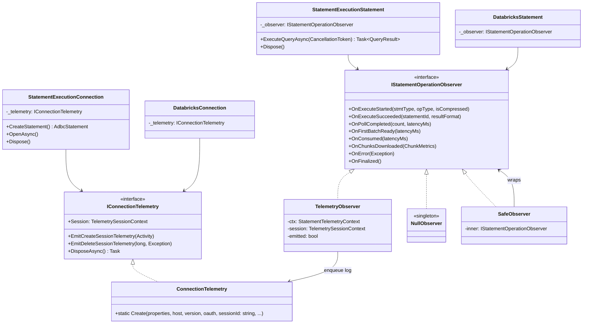
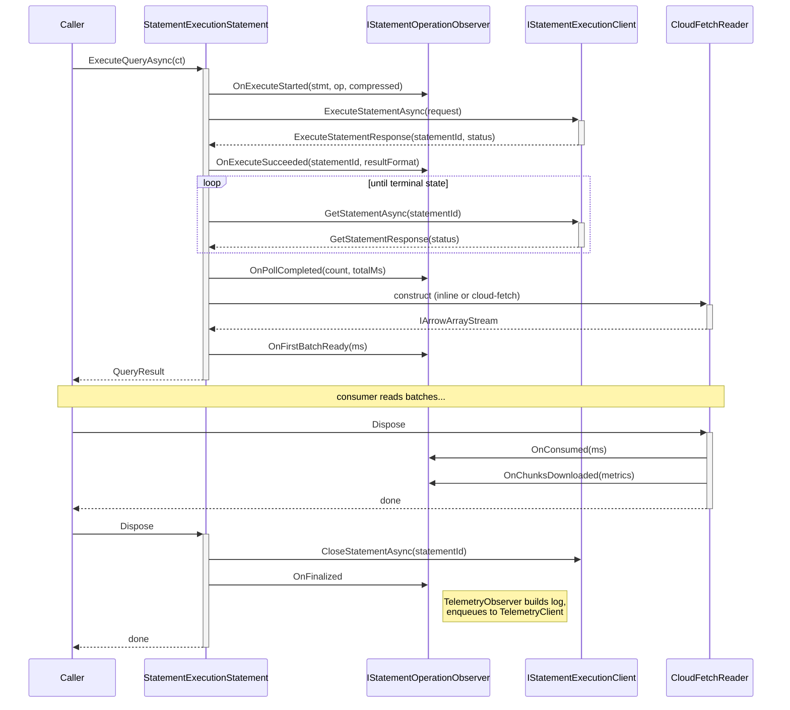
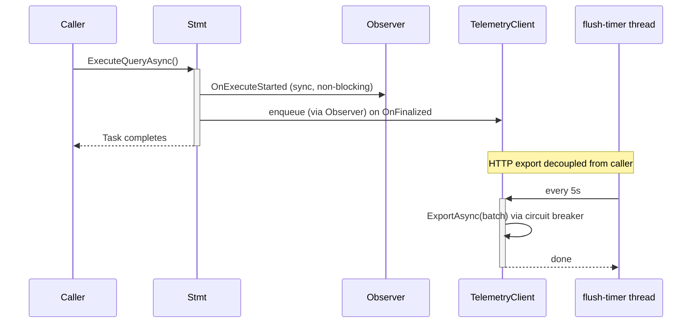

# PECO-3022 — SEA Telemetry Integration Design

**Status:** Draft
**Author:** Jade Wang
**Related:** [`fix-telemetry-gaps-design.md`](./fix-telemetry-gaps-design.md), [`csharp/doc/telemetry-design.md`](../../csharp/doc/telemetry-design.md)
**Jira:** [PECO-3022](https://databricks.atlassian.net/browse/PECO-3022)

---

## 1. Summary

Today the C# ADBC Databricks driver emits client telemetry only on the Thrift code path. When a connection is opened with `adbc.databricks.protocol=rest` (the Statement Execution API / SEA backend), **zero telemetry is produced** — no session events, no per-statement operation events, no error events, no chunk metrics. SEA traffic is invisible to the existing `eng_lumberjack` driver-telemetry pipeline.

This design closes that gap by introducing a small **observer interface** (`IStatementOperationObserver`) between the statement classes and the telemetry implementation, refactoring `ConnectionTelemetry.Create` to be protocol-agnostic, and wiring observer callbacks at the SEA hookpoints. All existing telemetry infrastructure (`TelemetryClient`, `TelemetryClientManager`, `CircuitBreakerTelemetryExporter`, `DatabricksTelemetryExporter`, `FeatureFlagCache`) is reused as-is.

---

## 2. Goals and Non-Goals

### Goals

- SEA path emits the same set of telemetry events as the Thrift path: `CREATE_SESSION`, per-statement operation event, `DELETE_SESSION`, error events.
- Telemetry records carry `driver_connection_params.mode = DRIVER_MODE_SEA`, enabling backend dashboards to distinguish transports.
- Statement classes have no direct dependency on telemetry types — they call observer methods in their own language ("OnExecuteStarted", "OnPollCompleted").
- Telemetry must never throw to the driver caller (fail-open contract enforced by the observer interface).
- No new connection-string options; no new feature flags.

### Non-Goals

- Fixing the other Thrift-side gaps catalogued in [`fix-telemetry-gaps-design.md`](./fix-telemetry-gaps-design.md) (workspace_id, auth_type, metadata-ops instrumentation, retry_count, etc.). These are tracked in the existing gap-fix workstream and will land separately.
- Changing the proto schema (`OssSqlDriverTelemetryLog`) or the transport endpoint.
- Adding OpenTelemetry tracing — the observer interface is designed to admit a future `TracingObserver` impl, but that is out of scope here.

---

## 3. Current State

| Aspect | Thrift path | SEA path |
|---|---|---|
| Connection class | `DatabricksConnection : SparkHttpConnection : … : TracingConnection` | `StatementExecutionConnection : TracingConnection` |
| Statement class | `DatabricksStatement : SparkStatement : HiveServer2Statement : TracingStatement` | `StatementExecutionStatement : TracingStatement` |
| Connection telemetry field | `_telemetry : IConnectionTelemetry` (created in `InitializeTelemetry`, line 724) | none |
| Session lifecycle events | `EmitCreateSessionTelemetry` / `EmitDeleteSessionTelemetry` | none |
| Per-statement context | `private CreateTelemetryContext()` / `private EmitTelemetry()` hooks | none |
| Result reader | `DatabricksCompositeReader` wraps inline + cloud-fetch | direct `CloudFetchReader` (no composite wrapper) |
| Chunk metrics source | `CloudFetchDownloader` (shared, has `Stopwatch` instrumentation) | same `CloudFetchDownloader` (shared) |
| `DriverMode` | hardcoded `Thrift` in `ConnectionTelemetry.BuildDriverConnectionParams` (lines 458, 642) | n/a — no telemetry initialized |

The two connection/statement hierarchies are **disjoint siblings** under `TracingConnection`/`TracingStatement`. C# single inheritance + the Apache common base classes (which we do not own) make a shared base class impractical. Reuse must come through composition.

---

## 4. Architecture

### 4.1 Component overview



### 4.2 Reused as-is

These components already exist for the Thrift path and are protocol-agnostic. They are reused with no changes:

- `TelemetryClient` / `ITelemetryClient` — per-host batched enqueue + flush
- `TelemetryClientManager` — global singleton, ref-counted client-per-host
- `CircuitBreakerTelemetryExporter` / `CircuitBreaker` / `CircuitBreakerManager`
- `DatabricksTelemetryExporter` — HTTP POST to `/telemetry-ext` / `/telemetry-unauth`
- `FeatureFlagCache` / `FeatureFlagContext` — per-host singleton, controls enable/disable
- `TelemetrySessionContext` / `StatementTelemetryContext` — data containers
- `TelemetryConfiguration` — batch size, flush interval, circuit-breaker thresholds

### 4.3 New components

- **`IStatementOperationObserver`** — small interface, ~8 methods, fail-open contract.
- **`TelemetryObserver`** — default implementation that translates observer calls into `StatementTelemetryContext` mutations and enqueues a `OssSqlDriverTelemetryLog` on finalize.
- **`NullObserver`** — singleton no-op, used as the default field value so callsites never need null checks.
- **`SafeObserver`** (optional) — decorator that swallows any exception thrown by an inner observer. Belt-and-suspenders.

### 4.4 Modified components

- **`ConnectionTelemetry.Create`** — signature change: accept `string sessionId` instead of `TSessionHandle? sessionHandle`. Thrift caller converts at the boundary.
- **`ConnectionTelemetry.BuildDriverConnectionParams`** — new `DriverMode mode` parameter. Caller sets `Thrift` or `Sea`. Removes the hardcoded `DriverMode.Types.Type.Thrift` at lines 458 and 642.
- **`StatementExecutionConnection`** — adds `_telemetry: IConnectionTelemetry` field, calls `InitializeTelemetry` in `OpenAsync`, emits `CREATE_SESSION` on success, emits `DELETE_SESSION` and disposes in `Dispose`.
- **`StatementExecutionStatement`** — adds `_observer: IStatementOperationObserver` field, calls observer methods at lifecycle hookpoints.
- **`DatabricksStatement`** — private telemetry hooks replaced with `_observer` field calls. Behaviorally identical; this is mechanical refactor.

---

## 5. Public Interfaces

### 5.1 `IStatementOperationObserver`

```csharp
internal interface IStatementOperationObserver
{
    // Contract: implementations MUST NOT throw. All methods are fail-open.
    // Contract: methods may be called from any thread; implementations must be thread-safe.
    // Contract: OnFinalized() is the terminal call; subsequent calls are no-ops.

    void OnExecuteStarted(Statement.Types.Type stmtType, Operation.Types.Type opType, bool isCompressed);
    void OnExecuteSucceeded(string statementId, ExecutionResult.Types.Format resultFormat);
    void OnPollCompleted(int count, long latencyMs);
    void OnFirstBatchReady(long latencyMs);
    void OnConsumed(long latencyMs);
    void OnChunksDownloaded(ChunkMetrics metrics);
    void OnError(Exception ex);
    void OnFinalized();
}
```

**Why these methods (and not others):** they mirror the existing Thrift integration points enumerated in `csharp/doc/telemetry-design.md` §5.2, restated in the caller's language rather than the proto's.

### 5.2 Refactored `ConnectionTelemetry.Create`

```csharp
public static IConnectionTelemetry Create(
    IReadOnlyDictionary<string, string> properties,
    string host,
    string assemblyVersion,
    IOAuthTokenProvider? oauthTokenProvider,
    string sessionId,                          // CHANGED: was TSessionHandle? sessionHandle
    DriverMode.Types.Type mode,                // NEW: Thrift or Sea
    bool enableDirectResults,
    bool useDescTableExtended,
    int connectTimeoutMilliseconds,
    Activity? activity);
```

Thrift caller converts at the boundary: `sessionHandle.SessionId.Guid.ToString()`. SEA caller passes its `_sessionId` directly.

### 5.3 `IConnectionTelemetry` — no surface change

The interface itself is unchanged; only the static factory above is modified. The fail-open contract on existing methods (`EmitCreateSessionTelemetry`, `EmitDeleteSessionTelemetry`, `EmitOperationTelemetry`, `DisposeAsync`) is **strengthened in documentation** to match the observer's: these methods must never throw to the caller. Today they happen to already swallow via internal try/catch; this design makes that contractually required.

---

## 6. Integration Points (SEA)

| Hookpoint | Class.Method | Observer call |
|---|---|---|
| Statement created | `StatementExecutionConnection.CreateStatement` | constructor injects `_observer` from session |
| Execute issued | `StatementExecutionStatement.ExecuteQueryInternalAsync` (line 323) — before `_client.ExecuteStatementAsync` (line 345) | `OnExecuteStarted(stmtType, opType, compressed)` |
| Execute returned | `StatementExecutionStatement.ExecuteQueryInternalAsync` — after response received | `OnExecuteSucceeded(statementId, resultFormat)` |
| Each poll iteration | `StatementExecutionStatement.PollUntilCompleteAsync` (line 453) — after each `_client.GetStatementAsync` | accumulate count/ms; emit `OnPollCompleted` once on terminal state |
| First batch ready | `StatementExecutionStatement.CreateCloudFetchReader` (line 542) for cloud-fetch path; `InlineArrowStreamReader` ctor for inline | `OnFirstBatchReady(latencyMs)` |
| Results consumed | reader Dispose (cloud-fetch reader or inline) | `OnConsumed(latencyMs)`; `OnChunksDownloaded(metrics)` for cloud-fetch |
| Error in any of the above | `StatementExecutionStatement.ExecuteQueryInternalAsync` catch block | `OnError(ex)` |
| Statement dispose | `StatementExecutionStatement.Dispose` (line 817) | `OnFinalized()` |
| Session open | `StatementExecutionConnection.OpenAsync` (line 373) — after `CreateSessionAsync` succeeds | `_telemetry.EmitCreateSessionTelemetry(activity)` |
| Session close | `StatementExecutionConnection.Dispose` (line 895) — after `DeleteSessionAsync` | `_telemetry.EmitDeleteSessionTelemetry(elapsedMs, error)`; `await _telemetry.DisposeAsync()` |

---

## 7. SEA Execute Flow (Sequence)



---

## 8. Result-Format Mapping

SEA does not expose a typed `ResultFormat` field on the statement — it uses a wire-level disposition string. The mapper:

| Wire `disposition` (request) | Wire `format` (request) | Actual result | Proto `ExecutionResult.Format` |
|---|---|---|---|
| `INLINE` | `ARROW_STREAM` | inline attachment | `INLINE_ARROW` |
| `EXTERNAL_LINKS` | `ARROW_STREAM` | external_links populated | `EXTERNAL_LINKS` |
| `INLINE_OR_EXTERNAL_LINKS` (default) | `ARROW_STREAM` | manifest indicates external_links | `EXTERNAL_LINKS` |
| `INLINE_OR_EXTERNAL_LINKS` (default) | `ARROW_STREAM` | inline attachment | `INLINE_ARROW` |

Implemented as a static helper `SeaResultFormatMapper.Map(disposition, manifest, response)` called once at `OnExecuteSucceeded` time. No need to peek inside the reader.

---

## 9. Chunk Metrics

SEA's cloud-fetch path uses the **same shared `CloudFetchDownloader`** as Thrift (Stopwatch instrumentation already present at lines 316, 499, 550, 712, 788, 809). The chunk-aggregation work to surface a `ChunkMetrics` value from `CloudFetchReader` is **shared with the gap-fix workstream** — both Thrift and SEA depend on it.

**Dependency:** This design assumes the gap-fix's `CloudFetchDownloader → ChunkMetrics → CloudFetchReader.GetChunkMetrics()` plumbing lands first or concurrently. If gap-fix is delayed, the SEA implementation can ship with `OnChunksDownloaded(ChunkMetrics.Empty)` and backfill metrics in a follow-up — the proto fields are nullable.

---

## 10. `DriverMode.Sea` Wiring (Cross-Cutting)

The only cross-cutting change pulled into this design. Two existing callsites in `ConnectionTelemetry.cs` hardcode `Mode = DriverMode.Types.Type.Thrift`:
- line 458 (in `BuildDriverConnectionParams` static method)
- line 642 (in `Create` factory)

Change: thread a `DriverMode.Types.Type mode` parameter through these two methods. Thrift call site passes `Thrift`; SEA call site passes `Sea`. This is the minimum change needed for SEA telemetry to be distinguishable; deferring it would silently mislabel SEA records as Thrift.

---

## 11. Concurrency and Thread Safety

### Observer contract

- **Methods are thread-safe.** `TelemetryObserver` internally uses interlocked operations on the `emitted` flag and lock-free writes to scalar context fields. The underlying `StatementTelemetryContext` is single-statement scope and reads happen only at `OnFinalized` time on the calling thread.
- **All methods are non-blocking.** `OnFinalized` enqueues to a `BlockingCollection<TelemetryFrontendLog>` (existing `TelemetryClient`); the actual HTTP export runs on a background timer thread owned by `TelemetryClient`.
- **`OnFinalized` is idempotent.** Multiple calls (e.g. error + dispose paths both calling it) result in exactly one enqueue.

### Async patterns



### Connection-level concurrency

`IConnectionTelemetry.DisposeAsync` is called from `StatementExecutionConnection.Dispose` synchronously (consistent with existing Thrift pattern): `_telemetry.DisposeAsync().AsTask().Wait(TimeSpan.FromSeconds(5))`. This flushes any pending events with a hard timeout so connection-close cannot hang on a stuck exporter.

---

## 12. Error Handling and Failure Modes

### Fail-open contract

Every method on `IStatementOperationObserver` and `IConnectionTelemetry` must swallow all exceptions. Callsites contain **zero try/catch around observer/telemetry calls** — the contract pushes that concern into the implementations exactly once.

**Implementation pattern:** `TelemetryObserver` uses a single private helper rather than per-method try/catch boilerplate, keeping method bodies as one-line action delegates:

```csharp
private static void Safe(Action action) {
    try { action(); }
    catch (Exception ex) { Log.Trace(ex, "telemetry observer suppressed exception"); }
}

public void OnExecuteStarted(Statement.Types.Type stmt, Operation.Types.Type op, bool compressed) =>
    Safe(() => {
        _ctx.StatementType = stmt;
        _ctx.OperationType = op;
        _ctx.IsCompressed   = compressed;
    });

public void OnPollCompleted(int count, long latencyMs) =>
    Safe(() => {
        _ctx.PollCount     = count;
        _ctx.PollLatencyMs = latencyMs;
    });
```

This concentrates the try/catch in exactly one place per observer impl. The tiny per-call lambda allocation is acceptable — these methods are called O(1) times per statement.

The optional `SafeObserver` decorator is available for future third-party observer implementations that may not honor the contract; it wraps any inner observer with a defensive try/catch per method.

### Circuit breaker reuse

The existing `CircuitBreakerTelemetryExporter` is reused unchanged. Behavior in failure:

| Scenario | Behavior |
|---|---|
| Single export fails | Logged at `TRACE`, batch dropped, next batch attempted |
| 5 consecutive failures | Circuit opens; subsequent enqueue → drop; circuit-breaker event sent to server |
| 60 seconds elapsed | Circuit half-opens; 2 consecutive successes close it |
| `OperationCanceledException` | Propagated (caller cancellation), not counted as failure |

### NullObserver default

`StatementExecutionStatement._observer` defaults to `NullObserver.Instance` — never null. If `TelemetrySessionContext` is null (telemetry disabled by feature flag or property), the statement constructor leaves `_observer` as `NullObserver`. Callsites never check for null.

### Connection telemetry initialization failure

If `ConnectionTelemetry.Create` throws during `OpenAsync` (e.g. feature-flag fetch fails), the exception is caught locally in `StatementExecutionConnection`, logged at `TRACE`, and `_telemetry` is set to a `NullConnectionTelemetry` singleton (already exists for Thrift). The connection open succeeds; only telemetry is disabled for the connection.

---

## 13. Configuration

No new configuration parameters. All existing knobs apply unchanged:

| Parameter | Type | Default | Description |
|---|---|---|---|
| `adbc.databricks.telemetry.enabled` | bool | `true` | Driver-side opt-out |
| `adbc.databricks.client_app_name` | string | `null` | Reported in `system_configuration.client_app_name` |

**Server-side feature flag:** `databricks.partnerplatform.clientConfigsFeatureFlags.enableTelemetryForAdbc` (existing). Disabled flag → no events emitted for either transport.

**Priority:** user property > server feature flag > driver default (`true`).

---

## 14. Alternatives Considered

### A. Pure inheritance (have SEA classes inherit from `DatabricksStatement`/`DatabricksConnection`)
**Rejected.** Would drag the entire Thrift base chain (`TCLIService` client, `TSessionHandle`, Hive polling, Thrift transport) into SEA. SEA would be typed as a Thrift class while overriding half of it to no-op. Semantically wrong.

### B. Extract a shared base above both (`DatabricksTelemetryAwareConnection : TracingConnection`)
**Rejected.** Would need to sit between `TracingConnection` and `HiveServer2Connection`. We don't own `HiveServer2Connection`'s parent — it's in the Apache Arrow common package. Blocked structurally.

### C. Decorator at the `AdbcConnection` boundary
**Rejected.** Would wrap the connection externally and intercept ADBC calls. The deep telemetry signals (chunk timing, poll count, first-batch latency, result-format inference) live inside the statement classes — a wrapper from outside cannot see them. You'd still need internal hooks, so you'd pay double.

### D. Static `TelemetryHelper` (as `fix-telemetry-gaps-design.md` proposed)
**Rejected in favor of observer.** Static functions force every callsite to thread `(ctx, session)` parameters. Observer's instance shape gives one-line callsites (`_observer.OnPollCompleted(...)`). Test seam is also cleaner (inject a fake observer vs. mock static methods). Same reuse, better ergonomics. The static-helper proposal in the gap-fix doc is superseded by this design for the new SEA work.

### E. Instance-based `StatementTelemetryEmitter` (intermediate option)
**Rejected in favor of observer.** Emitter's interface is shaped around telemetry's data model (`RecordExecuted`, `RecordPolled`). Observer's interface is shaped around the statement's lifecycle (`OnExecuteStarted`, `OnPollCompleted`). The observer shape decouples statement classes from telemetry types and admits future non-telemetry observers (tracing, audit) without changing statement code. The extra layer of indirection is justified by this decoupling.

---

## 15. Test Strategy

### Unit tests

**`IStatementOperationObserver` implementations:**
- `NullObserver_AllMethods_AreNoOps`
- `NullObserver_IsSingleton`
- `SafeObserver_PropagatesNormalCallsToInner`
- `SafeObserver_SwallowsExceptionsFromInner_LogsAtTrace`
- `TelemetryObserver_OnExecuteStarted_PopulatesContext`
- `TelemetryObserver_OnExecuteSucceeded_RecordsStatementId`
- `TelemetryObserver_OnFinalized_EnqueuesExactlyOnce`
- `TelemetryObserver_OnFinalized_CalledTwice_EnqueuesOnce`
- `TelemetryObserver_OnError_RecordsErrorAndFinalizes`
- `TelemetryObserver_AllMethods_NeverThrow_WhenContextCorrupted`
- `TelemetryObserver_OnChunksDownloaded_MergesIntoChunkDetails`

**`ConnectionTelemetry.Create` refactor:**
- `Create_AcceptsStringSessionId`
- `Create_ThriftMode_SetsDriverModeThrift`
- `Create_SeaMode_SetsDriverModeSea`
- `Create_ThrowingHttpClient_ReturnsNullConnectionTelemetry`

**`SeaResultFormatMapper`:**
- `Map_InlineDisposition_ReturnsInlineArrow`
- `Map_ExternalLinksDisposition_ReturnsExternalLinks`
- `Map_AutoDisposition_WithInlineResult_ReturnsInlineArrow`
- `Map_AutoDisposition_WithExternalLinks_ReturnsExternalLinks`

### Integration tests (SEA path, against a real or mocked SQL warehouse)

- `Sea_ExecuteQuery_EmitsTelemetryWithStatementId`
- `Sea_ExecuteQuery_WithSyntaxError_EmitsErrorTelemetry`
- `Sea_ExecuteQuery_CloudFetch_RecordsChunkMetrics`
- `Sea_ExecuteQuery_InlineResults_RecordsInlineFormat`
- `Sea_OpenConnection_EmitsCreateSession`
- `Sea_CloseConnection_EmitsDeleteSessionAndFlushes`
- `Sea_TelemetryDisabledByFeatureFlag_EmitsZeroEvents`
- `Sea_TelemetryDisabledByProperty_EmitsZeroEvents`
- `Sea_TelemetryExporterFails_DoesNotAffectQueryExecution`
- `Sea_TelemetryRecord_HasDriverModeSea` (parity check vs Thrift's `DRIVER_MODE_THRIFT`)
- `Sea_ConcurrentStatements_EachEmitsExactlyOneRecord`

### Cross-transport regression

- `Thrift_Telemetry_StillEmitsAfterRefactor` — confirm the `string sessionId` refactor and `_observer` field substitution on `DatabricksStatement` produce byte-identical telemetry to current main.
- `Thrift_DriverMode_StillReportedAsThrift` — confirm the new `mode` parameter defaults / passes through correctly.

---

## 16. Rollout

### Dependencies

- **Gap-fix `ChunkMetrics` plumbing** (`CloudFetchDownloader → CloudFetchReader.GetChunkMetrics()`) — shared with this design's `OnChunksDownloaded` callsite. If not ready, ship with `ChunkMetrics.Empty`; backfill in follow-up. Proto fields are nullable.
- **No backend changes required.** The telemetry endpoint, proto schema, and `DriverMode.Sea` enum value already exist (`sql_driver_telemetry.proto:338-344`).

### PR sequencing

1. Refactor `ConnectionTelemetry.Create` signature (string sessionId, `DriverMode mode` param). Thrift call site updates only. Verifies no behavioral change.
2. Introduce `IStatementOperationObserver`, `TelemetryObserver`, `NullObserver`, `SafeObserver`. No callers yet.
3. Refactor `DatabricksStatement` to use `_observer` field instead of private hooks. Mechanical; behavior unchanged.
4. Wire telemetry into `StatementExecutionConnection` (`_telemetry`, `OpenAsync`, `Dispose`).
5. Wire telemetry into `StatementExecutionStatement` (`_observer` field + hookpoint calls).
6. Add `SeaResultFormatMapper`.
7. Add integration tests against a real SQL warehouse.

Each PR is independently reviewable and revertible. Steps 1–3 land in any order; 4–6 depend on 1–3; 7 depends on 4–6.

### Backward compatibility

- Connection-string options: unchanged.
- Proto schema: unchanged.
- Public ADBC API: unchanged.
- Thrift telemetry output: byte-identical (verified by regression test above).

---

## 17. Open Questions

1. **Polling-granularity semantics:** Thrift `PollCount` counts `GetOperationStatusAsync` calls. SEA `PollCount` will count `GetStatementAsync` calls. These are semantically equivalent (both are status-polls during async execution) but the wire shapes differ. Confirm with the telemetry consumer team that this is acceptable; otherwise introduce a separate `sea_poll_count` field.
2. **`is_internal_call` for SEA `USE SCHEMA`:** SEA does not have a separate `SetSchema` method (uses statement execution). Should `is_internal_call=true` propagate the same way it does (or will, post gap-fix) for Thrift? Suggest defer to follow-up.
3. **`operation_type` for SEA:** Always `EXECUTE_STATEMENT_ASYNC` (SEA is always async on the wire). Confirm this matches the telemetry consumer team's expectation, or whether we should map specifically (`EXECUTE_STATEMENT` for sync-emulated paths).
