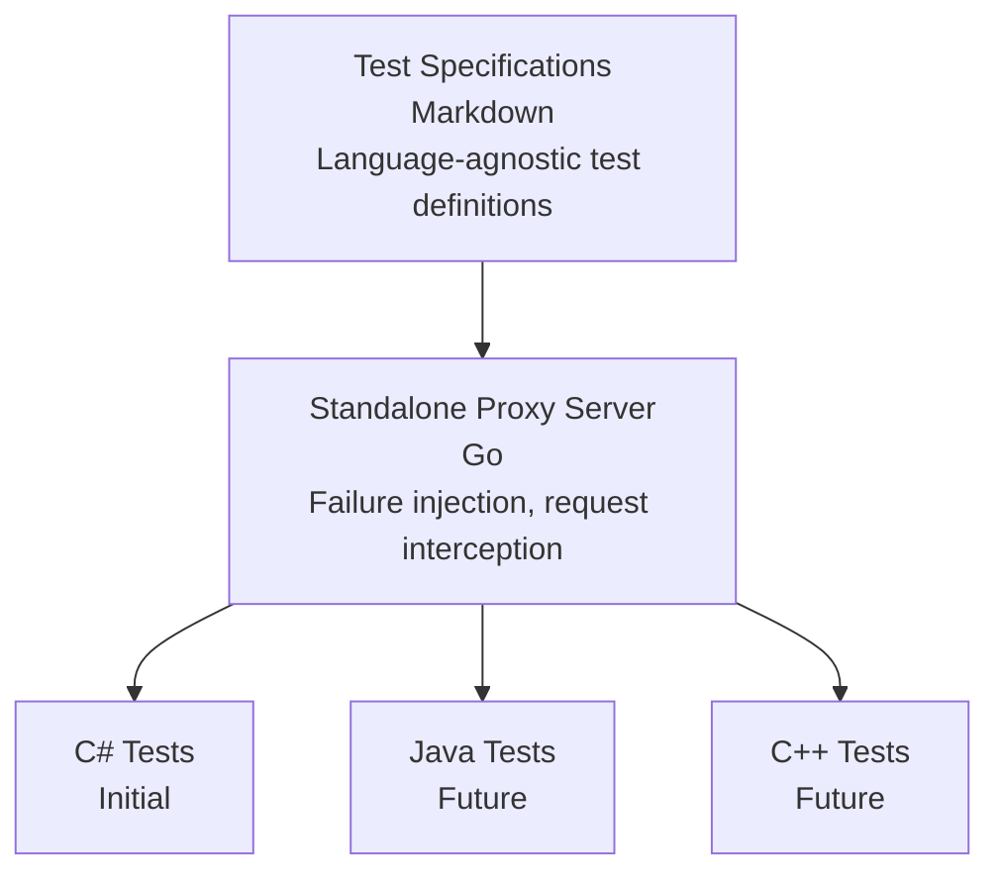

# Thrift Protocol Test Suite

## Overview

This directory contains the design and specifications for a comprehensive test suite that validates ADBC driver implementations against the Databricks Thrift protocol.

**Status**: Design Phase
**Initial Target**: C# ADBC Driver (this repository)
**Future Targets**: Java (JDBC), C++ (ODBC), Go (ADBC) drivers

## Quick Links

- **[Design Document](./design.md)** - Full design, architecture, and implementation plan
- **[Test Specifications](./specs/)** - Detailed test case specifications (to be created)

## Relationship to Existing Validation

This test suite is complementary to the existing [ADBC Driver Validation](https://github.com/adbc-drivers/validation) suite:

**Existing Validation Suite** (Python/pytest):
- Focuses on ADBC API feature validation
- Tests SQL query correctness and data type support
- Language-agnostic test definitions with driver-specific overrides
- Validates ADBC compliance across different databases

**This Thrift Protocol Test Suite**:
- Focuses on Databricks Thrift protocol compliance
- Tests protocol-specific features (CloudFetch, Direct Results, Arrow streaming)
- Tests failure scenarios with proxy-based injection
- Validates driver behavior under error conditions

Both suites serve different purposes and can coexist. Future consideration: Thrift protocol tests could potentially be contributed to the validation repository.

## What's in This Test Suite?

### 300 Test Cases Across 16 Categories

| Category | Tests | Priority | Description |
|----------|-------|----------|-------------|
| Session Lifecycle | 15 | Critical | OpenSession, CloseSession, timeouts |
| Statement Execution | 25 | Critical | Sync/async execution, cancellation |
| Metadata Operations | 40 | High | GetCatalogs, GetSchemas, GetTables, etc. |
| Arrow Format | 20 | High | Arrow IPC, compression, type handling |
| CloudFetch | 20 | Critical | Cloud storage results, link expiration |
| Direct Results | 15 | High | TSparkDirectResults optimization |
| Parameterized Queries | 20 | High | Named/positional parameters |
| Result Fetching | 15 | High | Pagination, cursor management |
| Error Handling | 30 | Critical | Error codes, recovery, retries |
| Timeout & Cleanup | 12 | Medium | Session/operation timeouts |
| Concurrency | 15 | Medium | Thread safety, parallel operations |
| Protocol Versions | 12 | Medium | Version negotiation, compatibility |
| Security | 15 | High | Authentication, authorization |
| Performance | 10 | Low | Limits, batch sizes |
| Edge Cases | 36 | Medium | NULL handling, empty results, etc. |

**Total: ~300 test cases**

## Architecture



### Key Components

1. **Test Specifications** (`specs/` directory)
   - Language-agnostic test case definitions
   - Clear test steps and expected behavior
   - Shared by all driver implementations

2. **Proxy Server** (`../../test-infrastructure/proxy-server/`)
   - Standalone Go application
   - Intercepts and modifies Thrift requests/responses
   - Injects failures for testing error scenarios
   - Used by all language implementations

3. **C# Test Implementation** (`../../csharp/test/ThriftProtocol/`)
   - xUnit-based test suite
   - Follows test specifications
   - Initial reference implementation

## Why This Design?

### Language-Agnostic

Different drivers use different languages:
- **C# ADBC**: This repository
- **Java JDBC**: Separate repository
- **C++ ODBC**: Separate repository
- **Go driver**: Databricks Go driver

By keeping specifications language-agnostic, we ensure:
- ✅ Consistent behavior across all drivers
- ✅ Shared understanding of Thrift protocol
- ✅ Easier review and maintenance
- ✅ Single source of truth for protocol compliance

### Standalone Proxy Server

Testing failure scenarios (expired CloudFetch links, network timeouts, etc.) requires:
- Intercepting real Thrift traffic
- Modifying responses on-the-fly
- Injecting controlled failures

A standalone proxy server:
- ✅ Works with all programming languages
- ✅ Single implementation to maintain
- ✅ Configuration-driven (no code changes)
- ✅ Easy to run in CI/CD

### Extractable Design

This test infrastructure is designed to be extracted to a common repository:

**Now**:
```
adbc-drivers/databricks/
├── docs/designs/thrift-protocol-tests/
└── test-infrastructure/proxy-server/
```

**Future**:
```
github.com/databricks/thrift-test-infrastructure/
├── specs/              # Test specifications
├── proxy-server/       # Standalone proxy
└── examples/
    ├── csharp/
    ├── java/
    └── cpp/
```

## Getting Started

### For Implementers (Future)

1. **Read Test Specifications**
   - Each spec describes test steps clearly
   - Expected behavior is defined
   - Implementation notes provided

2. **Set Up Proxy Server**
   ```bash
   cd test-infrastructure/proxy-server
   go run main.go --config proxy-config.yaml
   ```

3. **Implement Tests in Your Language**
   - Follow test specifications
   - Use your language's test framework
   - Connect to proxy for failure testing

## Implementation Status

- [x] Design document
- [ ] Test specifications (16 documents)
- [ ] Proxy server implementation
- [ ] C# test implementation
- [ ] Java test implementation (future)
- [ ] C++ test implementation (future)
- [ ] Go test implementation (future)

## Contributing

When contributing test specifications:
1. Follow the template in the design doc
2. Keep specifications language-agnostic
3. Include clear test steps and expected behavior
4. Add implementation notes for tricky cases
5. Consider all target languages (C#, Java, C++, Go)
