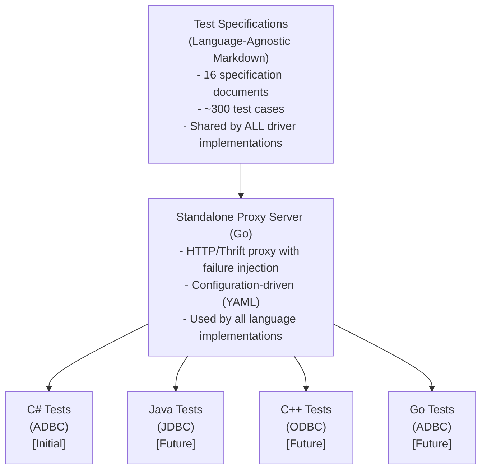

# ADBC Driver Thrift Protocol Test Suite - Design Document

**Version**: 1.0
**Last Updated**: 2024-12-16
**Author**: PECO Team
**Status**: Draft for Review
**Repository**: adbc-drivers/databricks (C# ADBC Driver)

---

## Table of Contents

1. [Overview](#overview)
2. [Goals and Non-Goals](#goals-and-non-goals)
3. [Background](#background)
4. [Architecture](#architecture)
5. [Multi-Language Strategy](#multi-language-strategy)
6. [Test Specification Structure](#test-specification-structure)
7. [Test Framework Design](#test-framework-design)
8. [Implementation Plan](#implementation-plan)
9. [Test Categories](#test-categories)
10. [Key Design Decisions](#key-design-decisions)
11. [Alternatives Considered](#alternatives-considered)
12. [Security and Privacy](#security-and-privacy)
13. [Rollout and Testing](#rollout-and-testing)

---

## Overview

This design proposes a comprehensive test suite for ADBC (Arrow Database Connectivity) drivers that use the Databricks Thrift protocol. The test suite will verify driver behavior across all Thrift operations, with emphasis on Databricks-specific extensions like CloudFetch, Arrow streaming, and parameterized queries.

**Initial Implementation**: C# ADBC Driver (this repository)
**Future Support**: Java (JDBC), C++ (ODBC), Go (ADBC), Python drivers

### Problem Statement

Currently, driver testing is fragmented:
- **Runtime tests (941 tests)**: Focus on ThriftServer behavior, not driver compliance
- **ADBC tests**: Basic E2E tests in Go driver, missing systematic coverage in C# driver
- **No cross-driver validation**: Each driver (ADBC C#, ADBC Go, JDBC, ODBC) implements tests independently
- **Missing failure scenarios**: No systematic testing of error conditions, timeouts, expired links

This leads to:
- Bugs discovered late in development
- Inconsistent behavior across drivers
- Difficulty validating new Thrift protocol versions
- No standardized way to test failure scenarios

### Proposed Solution

Create a **comprehensive, driver-agnostic test specification** with:
1. **Test Specification Documents** (language-agnostic): ~300 test cases across 16 categories
2. **Standalone Proxy Server** (Go): Shared infrastructure for failure injection
3. **Language-Specific Test Implementations**: C# tests (initial), Java/C++/Go (future)
4. **Extractable Design**: Easy to move to common repository for all drivers

---

## Goals and Non-Goals

### Goals

- ✅ **Comprehensive Coverage**: All Thrift operations, protocol versions, Databricks extensions
- ✅ **Driver Behavior Focus**: Test what drivers send/receive, not server implementation
- ✅ **Language-Agnostic Specs**: Common test cases described in markdown, implemented per language
- ✅ **Failure Scenario Testing**: Expired links, network errors, timeouts, retries
- ✅ **Extractable**: Easy to move to common repo when ready

### Non-Goals

- ❌ **Server-side testing**: Use existing runtime tests for ThriftServer behavior
- ❌ **Performance benchmarking**: Focus on correctness, not performance optimization
- ❌ **Load testing**: Basic concurrency only, not large-scale load tests
- ❌ **Protocol design**: Test existing protocol, not propose new features

---

## Background

### Thrift Protocol Overview

The Databricks Thrift protocol extends Apache Hive's HiveServer2 protocol:

```
Hive Protocol V1-V10 → Spark Protocol V1-V9 → Databricks Extensions
                                                ├─ CloudFetch
                                                ├─ Direct Results
                                                ├─ Arrow Streaming
                                                └─ Parameterized Queries
```

**Key Operations (20 RPCs):**
- Session: OpenSession, CloseSession, GetInfo
- Execution: ExecuteStatement, GetOperationStatus, CancelOperation, CloseOperation
- Results: GetResultSetMetadata, FetchResults
- Metadata: GetCatalogs, GetSchemas, GetTables, GetColumns, GetFunctions, etc.

**Databricks Extensions:**
- **TSparkDirectResults**: Shortcut to fetch results in OpenSession response
- **CloudFetch (V3+)**: Fetch results from cloud storage (S3/Azure/GCS)
- **Arrow Streaming (V5+)**: Columnar results with compression (V6+)
- **Parameterized Queries (V8+)**: Named/positional parameters

### Current Test Coverage Analysis

**C# ADBC Driver Tests:**
- E2E tests: Basic connection, statement execution, CloudFetch
- Unit tests: Configuration, retry logic, Thrift error handling
- **Coverage Gaps:**
  - ❌ Systematic metadata operation testing
  - ❌ Parameterized query validation
  - ❌ Protocol version negotiation
  - ❌ Failure scenarios (expired links, network timeouts)
  - ❌ Concurrent operation handling

**Go ADBC Driver Tests (reference):**
- integration_e2e_test.go: Basic E2E ✅
- cloudfetch_e2e_test.go: CloudFetch happy path ✅
- ipc_reader_test.go: Arrow parsing ✅
- Similar coverage gaps as C# driver

---

## Architecture

### High-Level Architecture



### Component Responsibilities

| Component | Responsibility | Language | Location |
|-----------|---------------|----------|----------|
| **Test Specifications** | Document test cases, expected behavior | Markdown | `docs/designs/thrift-protocol-tests/specs/` |
| **Proxy Server** | Failure injection, request interception | Go | `test-infrastructure/proxy-server/` |
| **C# Test Suite** | C#-specific test implementation | C# | `csharp/test/ThriftProtocol/` |
| **Test Helpers** | C#-specific utilities, assertions | C# | `csharp/ThriftTestHelpers/` |

---

## Multi-Language Strategy

### Design Principles

1. **Specifications are language-agnostic**: Written in markdown with clear test steps
2. **Proxy server is standalone**: Single Go implementation serves all drivers
3. **Implementations are language-specific**: Each driver implements tests in their language
4. **Validation is consistent**: All drivers should pass same test scenarios

### Example: Cross-Language Test Implementation

**Specification** (shared):
```markdown
## TEST-SESSION-001: Basic OpenSession
1. Create OpenSession request with valid credentials
2. Set client protocol to V9
3. Call OpenSession
4. Verify sessionHandle is valid
5. Verify protocol version negotiation
```

**C# Implementation**:
```csharp
[Fact]
public async Task TestSessionBasicOpen()
{
    using var driver = new DatabricksDriver();
    using var database = driver.Open(testConfig);
    using var connection = await database.OpenAsync();
    Assert.NotNull(connection);
}
```

**Java Implementation** (future):
```java
@Test
public void testSessionBasicOpen() {
    try (Connection conn = DriverManager.getConnection(url, props)) {
        assertNotNull(conn);
    }
}
```

### Extractability Path

**Phase 1**: Within this repository
```
adbc-drivers/databricks/
├── docs/designs/thrift-protocol-tests/  # Extractable specs
└── test-infrastructure/                 # Extractable proxy
```

**Phase 2**: Extract to common repository (future)
```
github.com/databricks/thrift-test-infrastructure/
├── specs/              # Test specifications
├── proxy-server/       # Standalone proxy
└── examples/
    ├── csharp/         # C# implementation example
    ├── java/           # Java implementation example
    └── cpp/            # C++ implementation example
```

---

## Test Specification Structure

Test specifications follow a modular structure with clear navigation:

### Directory Structure

```
docs/designs/thrift-protocol-tests/
├── README.md                           # Test suite overview
├── design.md                           # This document
└── specs/
    ├── 01-strategy.md                  # Test strategy and setup
    ├── 02-session-lifecycle.md         # 15 tests
    ├── 03-statement-execution.md       # 25 tests
    ├── 04-metadata-operations.md       # 40 tests
    ├── 05-arrow-format.md              # 20 tests
    ├── 06-cloudfetch.md                # 20 tests
    ├── 07-direct-results.md            # 15 tests
    ├── 08-parameterized-queries.md     # 20 tests
    ├── 09-result-fetching.md           # 15 tests
    ├── 10-error-handling.md            # 30 tests
    ├── 11-timeout-cleanup.md           # 12 tests
    ├── 12-concurrency.md               # 15 tests
    ├── 13-protocol-versions.md         # 12 tests
    ├── 14-security.md                  # 15 tests
    ├── 15-performance.md               # 10 tests
    └── 16-edge-cases.md                # 36 tests
```

**Total: ~300 test cases**

### Test Specification Template

Each test follows this format:

```markdown
## TEST-{CATEGORY}-{NUMBER}: {Test Name}
**Priority**: Critical | High | Medium | Low
**Protocol Version**: All | V5+ | V9+
**Estimated Time**: < 5s | < 30s | < 2m

### Description
Brief description of what this test validates.

### Test Steps
1. First step
2. Second step
3. Third step

### Expected Behavior
- Expected outcome 1
- Expected outcome 2

### C# Implementation Notes
Specific guidance for C# implementation

### Validation Checklist
- [ ] Validation point 1
- [ ] Validation point 2
```

---

## Test Framework Design

### Standalone Proxy Server

The proxy server is a standalone Go application that:
- Forwards requests to real Thrift server
- Intercepts and modifies requests/responses
- Injects failures based on configuration
- Logs all traffic for debugging

**Configuration Example**:
```yaml
# proxy-config.yaml
proxy:
  listen_port: 8080
  target_server: "https://workspace.databricks.com"

failure_scenarios:
  - name: "cloudfetch_link_expired"
    trigger: "after_requests"
    count: 1
    action: "expire_cloud_link"

  - name: "network_timeout"
    trigger: "operation_type"
    operation: "ExecuteStatement"
    action: "delay"
    duration: "30s"
```

**Usage**:
```bash
# Start proxy server
cd test-infrastructure/proxy-server
go run main.go --config proxy-config.yaml

# Tests connect to proxy instead of real server
export DATABRICKS_HOST="localhost:8080"
dotnet test
```

### C# Test Structure

```
csharp/
├── test/
│   ├── ThriftProtocol/                # New: Protocol tests
│   │   ├── ThriftProtocolTestBase.cs  # Base class with proxy setup
│   │   ├── SessionTests.cs
│   │   ├── StatementExecutionTests.cs
│   │   ├── CloudFetchTests.cs
│   │   └── ... (13 more test files)
│   └── ThriftTestHelpers/             # New: Test utilities
│       ├── ProxyConfiguration.cs
│       ├── ThriftAssertions.cs
│       └── TestFixtures.cs
```

**Base Test Class**:
```csharp
public abstract class ThriftProtocolTestBase : IDisposable
{
    protected string ProxyUrl =>
        Environment.GetEnvironmentVariable("THRIFT_PROXY_URL")
        ?? "http://localhost:8080";

    protected DatabricksDriver CreateTestDriver()
    {
        return new DatabricksDriver();
    }

    protected Dictionary<string, string> GetTestConfig()
    {
        return new Dictionary<string, string>
        {
            ["uri"] = ProxyUrl,
            ["adbc.spark.auth_type"] = "oauth",
            ["adbc.spark.oauth.access_token"] = GetTestToken()
        };
    }
}
```

---

## Implementation Plan

### Phase 1: Foundation & Design (Weeks 1-2)

**Deliverables:**
1. ✅ Test specification documents (Parts 1-16)
2. ✅ Design document (this document)
3. ✅ Directory structure
4. Proxy server basic implementation
5. CI integration setup

**Tasks:**
- [ ] Write 16 test specification documents
- [ ] Implement standalone proxy server in Go
- [ ] Create C# test base classes
- [ ] Set up GitHub Actions workflow

### Phase 2: Critical Tests - C# (Weeks 3-4)

**Focus:** Session, Statement Execution, CloudFetch

**Deliverables:**
- 60 tests implemented in C# and passing
- Session lifecycle tests (15 tests)
- Statement execution tests (25 tests)
- CloudFetch tests with failure scenarios (20 tests)

### Phase 3: Metadata & Arrow - C# (Weeks 5-6)

**Focus:** Metadata operations, Arrow streaming

**Deliverables:**
- 60 additional tests (120 total)
- Metadata operation tests (40 tests)
- Arrow format tests (20 tests)

### Phase 4: Advanced Features - C# (Weeks 7-8)

**Focus:** Parameterized queries, Direct results, Error handling

**Deliverables:**
- 65 additional tests (185 total)

### Phase 5: Robustness & Edge Cases - C# (Weeks 9-10)

**Focus:** Concurrency, timeouts, edge cases

**Deliverables:**
- 115 additional tests (300 total)
- Full C# implementation complete

### Phase 6: Cross-Driver Expansion (Future)

**Goal:** Adapt test suite for Java (JDBC), C++ (ODBC), Go (ADBC) drivers

**Approach:**
- Tests follow same specifications
- Each language implements in their test framework
- Shared proxy server infrastructure
- Cross-driver consistency validation

---

## Test Categories

### Overview

| Part | Category | Test Count | Priority |
|------|----------|------------|----------|
| 1 | Test Strategy & Setup | - | Critical |
| 2 | Session Lifecycle | 15 | Critical |
| 3 | Statement Execution | 25 | Critical |
| 4 | Metadata Operations | 40 | High |
| 5 | Arrow Format | 20 | High |
| 6 | CloudFetch Results | 20 | Critical |
| 7 | Direct Results | 15 | High |
| 8 | Parameterized Queries | 20 | High |
| 9 | Result Fetching | 15 | High |
| 10 | Error Handling | 30 | Critical |
| 11 | Timeout & Cleanup | 12 | Medium |
| 12 | Concurrency | 15 | Medium |
| 13 | Protocol Versions | 12 | Medium |
| 14 | Security | 15 | High |
| 15 | Performance | 10 | Low |
| 16 | Edge Cases | 36 | Medium |

**Total: ~300 test cases**

(Detailed descriptions of each category omitted for brevity - see original design doc)

---

## Key Design Decisions

### Decision 1: Language-Agnostic Specifications

**Rationale:**
- Multiple driver implementations (C#, Java, C++, Go)
- Ensures consistent behavior across drivers
- Reduces duplicate design effort
- Easier to review and maintain

**Implementation:**
- Specifications in markdown
- Language-specific implementations
- Shared validation checklist

### Decision 2: Standalone Proxy Server (Go)

**Rationale:**
- Single implementation serves all drivers
- Go provides excellent HTTP/networking support
- Lightweight and fast
- Easy to containerize for CI

**Alternatives Considered:**
- C# proxy: Would require other drivers to run .NET runtime
- Java proxy: Heavy JVM dependency
- Python proxy: Performance concerns

### Decision 3: Start with C# Implementation

**Rationale:**
- This repository is C# ADBC driver
- Provides working reference for other languages
- Can validate spec quality before wider rollout
- Establishes patterns for future implementations

**Future Rollout:**
1. C# ADBC (Weeks 1-10)
2. Go ADBC (adapt from C# learnings)
3. Java JDBC (similar to C# patterns)
4. C++ ODBC (adapted patterns)

### Decision 4: Extractable by Design

**Rationale:**
- Test infrastructure should be reusable
- Avoid lock-in to specific repository
- Enable common test framework for all drivers
- Reduce maintenance burden

**Extraction Path:**
- Phase 1: Develop in C# ADBC repo
- Phase 2: Extract specs + proxy to common repo
- Phase 3: Provide language-specific examples

---

## Alternatives Considered

### Alternative 1: Mock Server Instead of Proxy

**Considered:** Implement mock Thrift server that simulates responses

**Rejected Because:**
- Want to test against **real** Thrift server behavior
- Mock server requires duplicating server logic
- Proxy provides better integration testing
- Proxy can still inject failures in real interactions

**Note:** Proxy server can operate in "standalone mock mode" if needed

### Alternative 2: Separate Test Suite Per Driver

**Considered:** Each driver implements tests independently

**Rejected Because:**
- Leads to inconsistent behavior across drivers
- Duplicate effort for similar tests
- Harder to ensure feature parity
- No shared validation of Thrift protocol compliance

### Alternative 3: Implement Everything in One Language

**Considered:** Write all tests in C# and use language bindings

**Rejected Because:**
- C++ ODBC driver can't easily call C# code
- Java JDBC driver would need complex interop
- Each driver has different test frameworks
- Language-native tests are easier to maintain

---

## Security and Privacy

### Security Considerations

1. **Test Credentials:**
   - Use dedicated test accounts with minimal privileges
   - Store credentials in CI secrets, never in code
   - Rotate credentials regularly

2. **Proxy Server Security:**
   - Proxy should not log sensitive data (tokens, credentials)
   - Use TLS for proxy-to-server communication
   - Validate all configuration inputs

3. **CloudFetch URLs:**
   - Test that expired URLs cannot be reused
   - Validate URL expiration enforcement
   - Test presigned URL security

### Privacy Considerations

1. **Test Data:**
   - Use synthetic data only
   - No PII in test datasets
   - Clean up test data after execution

2. **Logging:**
   - Redact credentials in test logs
   - Avoid logging sensitive query content
   - Proxy logs should be sanitized

---

## Rollout and Testing

### Rollout Plan

**Phase 1: C# Implementation (Weeks 1-10)**
- Implement in adbc-drivers/databricks repository
- Run in CI for all PRs
- Validate against dev/staging environments

**Phase 2: Stabilization (Weeks 11-12)**
- Fix issues discovered during implementation
- Optimize test execution time
- Improve documentation

**Phase 3: Cross-Driver Rollout (Future)**
- Adapt for Go ADBC driver
- Adapt for Java JDBC driver
- Adapt for C++ ODBC driver
- Consider extraction to common repository

### Success Metrics

| Metric | Target | Measurement |
|--------|--------|-------------|
| Test Coverage | 300 tests implemented | Test count |
| Pass Rate | > 95% on every PR | CI dashboard |
| Execution Time | < 30 minutes full suite | CI metrics |
| Bug Detection | Catch 90% of driver bugs | Incident analysis |
| Cross-Driver Consistency | < 5% behavioral differences | Comparison reports |

---

## Next Steps

1. **Review and Approval** (Week 0):
   - Technical review from team
   - Security review for test credentials
   - Architecture review for multi-language design

2. **Write Specifications** (Weeks 1-2):
   - Create 16 test specification documents
   - Write README for test suite
   - Document proxy server interface

3. **Implement Proxy Server** (Weeks 1-2):
   - Basic HTTP proxy functionality
   - Configuration-driven failure injection
   - Request/response logging

4. **Begin C# Implementation** (Week 3):
   - Set up test project structure
   - Implement base test classes
   - Start with critical tests (Session, CloudFetch)

---

## Appendix A: Repository Structure

```
adbc-drivers/databricks/
├── docs/
│   └── designs/
│       └── thrift-protocol-tests/
│           ├── README.md
│           ├── design.md (this file)
│           └── specs/
│               ├── 01-strategy.md
│               └── ... (15 more)
│
├── test-infrastructure/
│   ├── README.md
│   └── proxy-server/
│       ├── main.go
│       ├── proxy.go
│       ├── config.yaml
│       └── README.md
│
└── csharp/
    ├── test/
    │   ├── ThriftProtocol/
    │   │   ├── SessionTests.cs
    │   │   └── ... (14 more)
    │   └── ThriftTestHelpers/
    │       ├── ThriftProtocolTestBase.cs
    │       └── ...
    └── ...
```

---

## Appendix B: References

- Original Design Doc: `/Users/e.wang/Documents/dev/universe/peco/docs/designs/adbc-thrift-test-suite-design.md`
- C# ADBC Driver: `csharp/src/`
- Existing C# Tests: `csharp/test/E2E/`, `csharp/test/Unit/`
- Go ADBC Tests (reference): `csharp/arrow-adbc/go/adbc/driver/databricks/`
- Apache Arrow ADBC Spec: https://arrow.apache.org/adbc/

---

**Document Status**: Ready for Review
**Reviewers**: Team Leads, Architecture Review
**Next Action**: Create 16 test specification documents in `specs/` directory
