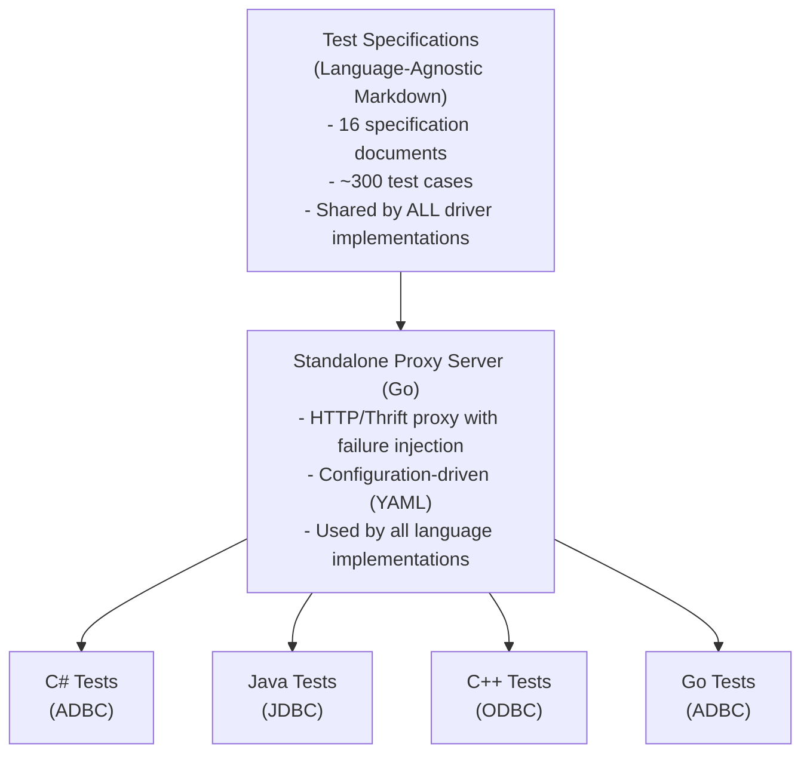

# ADBC Driver Thrift Protocol Test Suite - Design Document

**Version**: 1.0
**Last Updated**: 2024-12-16
**Author**: PECO Team
**Status**: Draft for Review
**Repository**: adbc-drivers/databricks (C# ADBC Driver)

---

## Table of Contents

1. [Overview](#overview)
2. [Goals and Non-Goals](#goals-and-non-goals)
3. [Background](#background)
4. [Architecture](#architecture)
5. [Multi-Language Strategy](#multi-language-strategy)
6. [Test Specification Structure](#test-specification-structure)
7. [Test Framework Design](#test-framework-design)
8. [Implementation Plan](#implementation-plan)
9. [Test Categories](#test-categories)
10. [Key Design Decisions](#key-design-decisions)
11. [Alternatives Considered](#alternatives-considered)
12. [Security and Privacy](#security-and-privacy)
13. [Rollout and Testing](#rollout-and-testing)

---

## Overview

This design proposes a comprehensive test suite for ADBC (Arrow Database Connectivity) drivers that use the Databricks Thrift protocol. The test suite will verify driver behavior across all Thrift operations, with emphasis on Databricks-specific extensions like CloudFetch, Arrow streaming, and parameterized queries.

**Initial Implementation**: C# ADBC Driver (this repository)
**Future Support**: Java (JDBC), C++ (ODBC), Go (ADBC), Python drivers

### Problem Statement

Currently, driver testing is fragmented:
- **Runtime tests (941 tests)**: Focus on ThriftServer behavior, not driver compliance
- **ADBC tests**: Basic E2E tests in Go driver, missing systematic coverage in C# driver
- **No cross-driver validation**: Each driver (ADBC C#, ADBC Go, JDBC, ODBC) implements tests independently
- **Missing failure scenarios**: No systematic testing of error conditions, timeouts, expired links

This leads to:
- Bugs discovered late in development
- Inconsistent behavior across drivers
- Difficulty validating new Thrift protocol versions
- No standardized way to test failure scenarios

### Proposed Solution

Create a **comprehensive, driver-agnostic test specification** with:
1. **Test Specification Documents** (language-agnostic): ~300 test cases across 16 categories
2. **Standalone Proxy Server** (Go): Shared infrastructure for failure injection
3. **Language-Specific Test Implementations**: C# tests (initial), Java/C++/Go (future)
4. **Extractable Design**: Easy to move to common repository for all drivers

---

## Goals and Non-Goals

### Goals

- ✅ **Comprehensive Coverage**: All Thrift operations, protocol versions, Databricks extensions
- ✅ **Driver Behavior Focus**: Test what drivers send/receive, not server implementation
- ✅ **Language-Agnostic Specs**: Common test cases described in markdown, implemented per language
- ✅ **Failure Scenario Testing**: Expired links, network errors, timeouts, retries
- ✅ **Extractable**: Easy to move to common repo when ready

### Non-Goals

- ❌ **Server-side testing**: Use existing runtime tests for ThriftServer behavior
- ⏸️ **Performance benchmarking**: Focus on correctness first; performance tests can be added later
- ❌ **Load testing**: Basic concurrency only, not large-scale load tests
- ❌ **Protocol design**: Test existing protocol, not propose new features

---

## Background

### Thrift Protocol Overview

The Databricks Thrift protocol extends Apache Hive's HiveServer2 protocol:

```
Hive Protocol V1-V10 → Spark Protocol V1-V9 → Databricks Extensions
                                                ├─ CloudFetch
                                                ├─ Direct Results
                                                ├─ Arrow Streaming
                                                └─ Parameterized Queries
```

**Key Operations (20 RPCs):**
- Session: OpenSession, CloseSession, GetInfo
- Execution: ExecuteStatement, GetOperationStatus, CancelOperation, CloseOperation
- Results: GetResultSetMetadata, FetchResults
- Metadata: GetCatalogs, GetSchemas, GetTables, GetColumns, GetFunctions, etc.

**Databricks Extensions:**
- **TSparkDirectResults**: Shortcut to fetch results in OpenSession response
- **CloudFetch (V3+)**: Fetch results from cloud storage (S3/Azure/GCS)
- **Arrow Streaming (V5+)**: Columnar results with compression (V6+)
- **Parameterized Queries (V8+)**: Named/positional parameters

### Current Test Coverage Analysis

**C# ADBC Driver Tests:**
- E2E tests: Basic connection, statement execution, CloudFetch
- Unit tests: Configuration, retry logic, Thrift error handling
- **Coverage Gaps:**
  - ❌ Systematic metadata operation testing
  - ❌ Parameterized query validation
  - ❌ Protocol version negotiation
  - ❌ Failure scenarios (expired links, network timeouts)
  - ❌ Concurrent operation handling

**Go ADBC Driver Tests (reference):**
- integration_e2e_test.go: Basic E2E ✅
- cloudfetch_e2e_test.go: CloudFetch happy path ✅
- ipc_reader_test.go: Arrow parsing ✅
- Similar coverage gaps as C# driver

---

## Architecture

### High-Level Architecture



### Component Responsibilities

| Component | Responsibility | Language | Location |
|-----------|---------------|----------|----------|
| **Test Specifications** | Document test cases, expected behavior | Markdown | `docs/designs/thrift-protocol-tests/specs/` |
| **Proxy Server** | Failure injection, request interception | Go | `test-infrastructure/proxy-server/` |
| **C# Test Suite** | C#-specific test implementation | C# | `csharp/test/ThriftProtocol/` |
| **Test Helpers** | C#-specific utilities, assertions | C# | `csharp/ThriftTestHelpers/` |

---

## Multi-Language Strategy

### Design Principles

1. **Specifications are language-agnostic**: Written in markdown with clear test steps
2. **Proxy server is standalone**: Single Go implementation serves all drivers
3. **Implementations are language-specific**: Each driver implements tests in their language
4. **Validation is consistent**: All drivers should pass same test scenarios

### Example: Cross-Language Test Implementation

**Specification Options:**

We support two specification formats to avoid AI code generation dependency:

**Option 1: Structured JSON/YAML** (Machine-readable, tool-friendly):
```yaml
# test-session-001.yaml
test_id: TEST-SESSION-001
name: Basic OpenSession
category: session_lifecycle
priority: critical
protocol_version: all

setup:
  - create_test_config:
      auth_type: oauth
      protocol_version: 9

steps:
  - action: open_session
    params:
      credentials: "{{test_credentials}}"
      client_protocol: 9

  - action: assert_not_null
    target: session_handle

  - action: assert_protocol_negotiated
    expected_version: 9

cleanup:
  - action: close_session
```

**Option 2: Markdown** (Human-readable, documentation-friendly):
```markdown
## TEST-SESSION-001: Basic OpenSession
1. Create OpenSession request with valid credentials
2. Set client protocol to V9
3. Call OpenSession
4. Verify sessionHandle is valid
5. Verify protocol version negotiation
```

**Recommendation**: Use **YAML for test definitions** (machine-readable) with **Markdown for documentation**. This allows:
- Code generation tools to parse YAML and generate language-specific tests
- Humans to read Markdown documentation
- Validation tools to check test completeness

**C# Implementation**:
```csharp
[Fact]
public async Task TestSessionBasicOpen()
{
    using var driver = new DatabricksDriver();
    using var database = driver.Open(testConfig);
    using var connection = await database.OpenAsync();
    Assert.NotNull(connection);
}
```

**Java Implementation** (future):
```java
@Test
public void testSessionBasicOpen() {
    try (Connection conn = DriverManager.getConnection(url, props)) {
        assertNotNull(conn);
    }
}
```

### Extractability Path

**Phase 1**: Within this repository
```
adbc-drivers/databricks/
├── docs/designs/thrift-protocol-tests/  # Extractable specs
└── test-infrastructure/                 # Extractable proxy
```

**Phase 2**: Extract to common repository (future)
```
github.com/databricks/thrift-test-infrastructure/
├── specs/              # Test specifications
├── proxy-server/       # Standalone proxy
└── examples/
    ├── csharp/         # C# implementation example
    ├── java/           # Java implementation example
    └── cpp/            # C++ implementation example
```

---

## Test Specification Structure

Test specifications follow a modular structure with clear navigation:

### Directory Structure

```
docs/designs/thrift-protocol-tests/
├── README.md                           # Test suite overview
├── design.md                           # This document
└── specs/
    ├── 01-strategy.md                  # Test strategy and setup
    ├── 02-session-lifecycle.md         # 15 tests
    ├── 03-statement-execution.md       # 25 tests
    ├── 04-metadata-operations.md       # 40 tests
    ├── 05-arrow-format.md              # 20 tests
    ├── 06-cloudfetch.md                # 20 tests
    ├── 07-direct-results.md            # 15 tests
    ├── 08-parameterized-queries.md     # 20 tests
    ├── 09-result-fetching.md           # 15 tests
    ├── 10-error-handling.md            # 30 tests
    ├── 11-timeout-cleanup.md           # 12 tests
    ├── 12-concurrency.md               # 15 tests
    ├── 13-protocol-versions.md         # 12 tests
    ├── 14-security.md                  # 15 tests
    ├── 15-performance.md               # 10 tests
    └── 16-edge-cases.md                # 36 tests
```

**Total: ~300 test cases**

### Test Specification Template

Each test follows this format:

```markdown
## TEST-{CATEGORY}-{NUMBER}: {Test Name}
**Priority**: Critical | High | Medium | Low
**Protocol Version**: All | V5+ | V9+
**Estimated Time**: < 5s | < 30s | < 2m

### Description
Brief description of what this test validates.

### Test Steps
1. First step
2. Second step
3. Third step

### Expected Behavior
- Expected outcome 1
- Expected outcome 2

### C# Implementation Notes
Specific guidance for C# implementation

### Validation Checklist
- [ ] Validation point 1
- [ ] Validation point 2
```

---

## Test Framework Design

### Standalone Proxy Server

The proxy server is a standalone Go application that:
- Forwards requests to real Thrift server
- Intercepts and modifies requests/responses
- Injects failures based on configuration
- Logs all traffic for debugging

**Failure Injection Approaches:**

We support two approaches for failure injection, similar to how mocking frameworks work:

**Approach 1: Configuration-Based (YAML)**
- ✅ Simple for static test scenarios
- ✅ Easy to version control and review
- ✅ No code changes needed for new scenarios
- ❌ Less flexible for dynamic scenarios

**Approach 2: API-Based (Programmatic)**
- ✅ More flexible for complex/dynamic scenarios
- ✅ Can adjust failures during test execution
- ✅ Better for stateful failure sequences
- ❌ Requires code changes for new scenarios

**Recommendation**: **Hybrid approach** - YAML defines scenarios, API controls them:
1. **YAML**: Define all possible failure scenarios (version controlled, reviewable)
2. **HTTP API**: Enable/disable scenarios dynamically per test (no server restart needed)

This avoids the complexity of restarting the proxy server for each test case.

**Example - YAML Configuration**:
```yaml
# proxy-config.yaml
proxy:
  listen_port: 8080
  target_server: "https://workspace.databricks.com"
  log_requests: true
  log_level: "debug"

# Production-validated failure scenarios based on real customer issues
failure_scenarios:
  # === CloudFetch Failures ===

  - name: "cloudfetch_expired_link"
    jira: "PECOBLR-1131"
    description: "OSS JDBC driver incorrectly refetching expired CloudFetch links"
    operation: "CloudFetchDownload"
    action: "expire_cloud_link"

  - name: "cloudfetch_azure_403"
    jira: "ES-1624602"
    description: "Intermittent 403 from Azure for CloudFetch URLs"
    operation: "CloudFetchDownload"
    action: "return_error"
    error_code: 403
    error_message: "[FILES_API_AZURE_FORBIDDEN]"

  - name: "cloudfetch_ttl_future"
    jira: "ES-1654890"
    description: "Clock skew causes TTL_IN_THE_FUTURE error"
    operation: "CloudFetchDownload"
    action: "return_error"
    error_code: 500
    error_message: "FILES_API_ERROR_TTL_IN_THE_FUTURE"

  - name: "cloudfetch_timeout"
    jira: "BL-13239"
    description: "Queries timing out during Cloud Fetch process"
    operation: "CloudFetchDownload"
    action: "delay"
    duration: "65s"

  - name: "cloudfetch_write_failed"
    jira: "ES-1539484"
    description: "Server-side failure writing results to cloud storage"
    operation: "ExecuteStatement"
    action: "return_error"
    error_message: "[QUERY_RESULT_WRITE_TO_CLOUD_STORE_FAILED]"

  - name: "cloudfetch_ssl_cert_error"
    jira: "PECO-2719"
    description: "SSL certificate validation failure for cloud storage URLs"
    operation: "CloudFetchDownload"
    action: "ssl_error"
    error_type: "certificate_validation_failed"

  # === Connection Reset Errors ===

  - name: "tls_handshake_timeout"
    jira: "BL-14202"
    description: "TLS handshake exceeds 5s before connection closed"
    action: "ssl_error"
    error_type: "handshake_timeout"

  - name: "connection_reset_during_fetch"
    jira: "BL-13580"
    description: "Connection reset when fetching large results via JDBC"
    operation: "FetchResults"
    action: "close_connection"

  - name: "ssl_connection_reset"
    jira: "ES-1657027"
    description: "javax.net.ssl.SSLException: Connection reset"
    action: "ssl_error"
    error_type: "connection_reset"

  - name: "jetty_connection_draining"
    jira: "ES-1498241"
    description: "Connection reset during Jetty/Armeria server draining"
    action: "close_connection"

  # === Session Management Failures ===

  - name: "session_timeout_premature"
    jira: "ES-1661289"
    description: "Session expires prematurely"
    action: "invalidate_session"

  - name: "invalid_session_handle"
    jira: "ES-610899"
    description: "Session invalidated but client unaware"
    operation: "GetOperationStatus"
    action: "return_error"
    error_message: "Invalid SessionHandle"

  - name: "session_terminated_active_query"
    jira: "XTA-11040"
    description: "Unexpected session termination with active queries"
    operation: "GetOperationStatus"
    action: "return_error"
    error_message: "Session terminated with active queries"

  - name: "dbr_cp_session_mismatch"
    jira: "SC-207685"
    description: "DBR session timeout (1h) vs CP session timeout (8h) mismatch"
    action: "invalidate_session"

  # === Protocol & Data Format Issues ===

  - name: "direct_results_exceed_maxrows"
    jira: "PECO-2524"
    description: "DirectResults returns more rows than MaxRows setting"
    operation: "OpenSession"
    action: "modify_response"
    field: "directResults"
    modification: "exceed_maxrows"

  - name: "retry_limit_exceeded"
    jira: "BL-14014"
    description: "Unable to continue fetch after reconnect"
    action: "return_error"
    error_message: "Unable to continue fetch after reconnect. Retry limit exceeded"

  - name: "communication_link_failure"
    jira: "ES-1559149"
    description: "General communication link failure with Simba driver"
    action: "close_connection"

  # === Rate Limiting & Resource Issues ===

  - name: "sqlgw_scheduler_timeout"
    description: "SQLGW scheduler timeout for long-running queries"
    operation: "ExecuteStatement"
    action: "delay"
    duration: "61s"

  - name: "rate_limit_retry_timeout"
    description: "Rate limit retry timeout exceeded"
    action: "return_error"
    error_message: "RateLimitRetryTimeout exceeded"

  # === Network-Level Failures ===

  - name: "network_timeout"
    description: "Generic network timeout during request"
    operation: "ExecuteStatement"
    action: "delay"
    duration: "35s"

  - name: "partial_response"
    description: "Response truncated mid-stream"
    action: "close_connection"
```

**Example - API-Based (Programmatic)**:

For dynamic scenarios, the proxy server exposes an HTTP API:

```csharp
// C# test using programmatic failure injection
[Fact]
public async Task TestCloudFetchRetryAfterExpiration()
{
    // Configure proxy via HTTP API
    var proxyClient = new ProxyControlClient("http://localhost:8081");

    // Set up failure scenario programmatically
    await proxyClient.ConfigureFailure(new FailureScenario
    {
        Name = "cloudfetch_expire_on_first_attempt",
        Trigger = new AfterRequestsTrigger { Count = 1 },
        Action = new ExpireCloudLinkAction(),
        Duration = TimeSpan.FromMinutes(5)  // Auto-clear after 5 min
    });

    // Run test
    using var driver = CreateTestDriver();
    var result = await driver.ExecuteQuery("SELECT * FROM large_table");

    // Verify driver correctly retries with new link
    Assert.True(result.Success);

    // Clear failure scenario
    await proxyClient.ClearFailures();
}

// Go test using API
func TestSessionTimeoutRecovery(t *testing.T) {
    proxy := NewProxyClient("http://localhost:8081")

    // Dynamic failure that changes based on state
    proxy.ConfigureFailure(&FailureScenario{
        Name: "session_expire_after_operations",
        Trigger: &OperationCountTrigger{Count: 10},
        Action: &InvalidateSessionAction{},
    })

    // Test automatically cleaned up via defer
    defer proxy.ClearFailures()

    // Run test...
}
```

**Proxy API Endpoints**:
```bash
# Enable a scenario defined in YAML (recommended)
POST /api/v1/scenarios/{name}/enable

# Disable a scenario
POST /api/v1/scenarios/{name}/disable

# List all defined scenarios (from YAML)
GET /api/v1/scenarios

# List currently active scenarios
GET /api/v1/scenarios/active

# Create a custom failure scenario on-the-fly (advanced)
POST /api/v1/failures
{
  "name": "custom_failure",
  "trigger": {...},
  "action": {...}
}

# Clear all active failures/scenarios
DELETE /api/v1/scenarios/active
```

**Recommended Workflow (Hybrid Approach)**:

**Step 1**: Start proxy ONCE with all scenario definitions
```bash
# All scenarios defined in YAML, but none are active initially
cd test-infrastructure/proxy-server
go run main.go --config all-scenarios.yaml --api-port 8081

# Proxy runs on :8080 (for Thrift traffic)
# API runs on :8081 (for control)
```

**Step 2**: Tests control failures via API (no restart needed)
```csharp
// C# test - CloudFetchTests.cs
[Fact]
public async Task TestCloudFetchExpiredLinkRetry()
{
    var proxy = new ProxyControlClient("http://localhost:8081");

    // Enable specific failure scenario from YAML
    await proxy.EnableScenario("cloudfetch_expired_link");

    try
    {
        using var driver = CreateTestDriver();

        // Proxy will now inject the failure
        var result = await driver.ExecuteQuery("SELECT * FROM large_table");

        // Verify driver correctly retried
        Assert.NotNull(result);
        Assert.True(result.RowCount > 0);
    }
    finally
    {
        // Clean up - disable scenario for next test
        await proxy.DisableScenario("cloudfetch_expired_link");
    }
}

[Fact]
public async Task TestSessionTimeout()
{
    var proxy = new ProxyControlClient("http://localhost:8081");

    // Different test, different scenario - same proxy server!
    await proxy.EnableScenario("session_timeout_premature");

    try
    {
        // Test session timeout handling...
    }
    finally
    {
        await proxy.DisableScenario("session_timeout_premature");
    }
}
```

**Key Advantages**:
- ✅ **No proxy restart** between tests
- ✅ **YAML defines scenarios** (version controlled, reviewed)
- ✅ **API controls activation** (flexible, per-test)
- ✅ **Clean test isolation** (enable/disable per test)
- ✅ **Fast test execution** (no startup overhead)

**Failure Scenario Summary**:

The proxy server configuration includes **24 production-validated failure scenarios** based on real customer issues from Databricks JIRA tickets. These scenarios are organized by category:

| Category | Scenarios | Key JIRA References |
|----------|-----------|---------------------|
| **CloudFetch Failures** | 6 | PECOBLR-1131, ES-1624602, BL-13239 |
| **Connection Reset** | 4 | BL-13580, BL-14202, ES-1657027 |
| **Session Management** | 4 | ES-610899, ES-1661289, XTA-11040 |
| **Protocol Issues** | 3 | PECO-2524, BL-14014, ES-1559149 |
| **Rate Limiting** | 2 | - |
| **Network Failures** | 2 | - |
| **Total** | **21** | - |

**Recommended Scenarios to Implement First:**

1. **cloudfetch_expired_link** (PECOBLR-1131)
   - Most common CloudFetch issue affecting OSS JDBC driver

2. **connection_reset_during_fetch** (BL-13580)
   - Causes data loss in large result sets

3. **invalid_session_handle** (ES-610899)
   - Leads to query failures when session is invalidated

4. **cloudfetch_timeout** (BL-13239)
   - Queries timeout without clear error message

5. **cloudfetch_azure_403** (ES-1624602)
   - Azure-specific issue affecting many customers

**Implementation Notes:**
- Each scenario includes a JIRA reference for traceability to production issues
- Scenarios activate deterministically when enabled via API (no random probability)
- Tests control when failures occur for reproducible results

### C# Test Structure

```
csharp/
├── test/
│   ├── ThriftProtocol/                # New: Protocol tests
│   │   ├── ThriftProtocolTestBase.cs  # Base class with proxy setup
│   │   ├── SessionTests.cs
│   │   ├── StatementExecutionTests.cs
│   │   ├── CloudFetchTests.cs
│   │   └── ... (13 more test files)
│   └── ThriftTestHelpers/             # New: Test utilities
│       ├── ProxyConfiguration.cs
│       ├── ThriftAssertions.cs
│       └── TestFixtures.cs
```

**Base Test Class**:
```csharp
public abstract class ThriftProtocolTestBase : IDisposable
{
    protected string ProxyUrl =>
        Environment.GetEnvironmentVariable("THRIFT_PROXY_URL")
        ?? "http://localhost:8080";

    protected DatabricksDriver CreateTestDriver()
    {
        return new DatabricksDriver();
    }

    protected Dictionary<string, string> GetTestConfig()
    {
        return new Dictionary<string, string>
        {
            ["uri"] = ProxyUrl,
            ["adbc.spark.auth_type"] = "oauth",
            ["adbc.spark.oauth.access_token"] = GetTestToken()
        };
    }
}
```

---

## Implementation Plan

### 2-Week Sprint: Foundation & Critical Tests

**Sprint Goals:**
1. ✅ Design document (this document)
2. ✅ Directory structure
3. Test specification documents (critical categories)
4. Proxy server MVP implementation
5. C# critical test implementation (~60 tests)
6. CI integration setup

**Week 1: Foundation**
- [ ] Write test specifications for critical categories (Session, Statement, CloudFetch)
- [ ] Implement proxy server MVP with basic failure injection
- [ ] Create C# test base classes and helpers
- [ ] Set up GitHub Actions workflow

**Week 2: Critical Tests**
- [ ] Implement Session lifecycle tests (15 tests)
- [ ] Implement Statement execution tests (25 tests)
- [ ] Implement CloudFetch tests with proxy (20 tests)
- [ ] Validate CI pipeline with critical tests

**Future Sprints:**
- Additional test categories (Metadata, Arrow, Parameterized Queries, etc.)
- Complete test specification documents (remaining categories)
- Advanced proxy features
- Cross-driver expansion

### Cross-Driver Expansion (Future)

**Goal:** Adapt test suite for Java (JDBC), C++ (ODBC), Go (ADBC) drivers

**Approach:**
- Tests follow same specifications
- Each language implements in their test framework
- Shared proxy server infrastructure
- Cross-driver consistency validation

---

## Test Categories

### Overview

| Part | Category | Test Count | Priority |
|------|----------|------------|----------|
| 1 | Test Strategy & Setup | - | Critical |
| 2 | Session Lifecycle | 15 | Critical |
| 3 | Statement Execution | 25 | Critical |
| 4 | Metadata Operations | 40 | High |
| 5 | Arrow Format | 20 | High |
| 6 | CloudFetch Results | 20 | Critical |
| 7 | Direct Results | 15 | High |
| 8 | Parameterized Queries | 20 | High |
| 9 | Result Fetching | 15 | High |
| 10 | Error Handling | 30 | Critical |
| 11 | Timeout & Cleanup | 12 | Medium |
| 12 | Concurrency | 15 | Medium |
| 13 | Protocol Versions | 12 | Medium |
| 14 | Security | 15 | High |
| 15 | Performance | 10 | Low |
| 16 | Edge Cases | 36 | Medium |

**Total: ~300 test cases**

(Detailed descriptions of each category omitted for brevity - see original design doc)

---

## Key Design Decisions

### Decision 1: Language-Agnostic Specifications

**Rationale:**
- Multiple driver implementations (C#, Java, C++, Go)
- Ensures consistent behavior across drivers
- Reduces duplicate design effort
- Easier to review and maintain

**Implementation:**
- Specifications in markdown
- Language-specific implementations
- Shared validation checklist

### Decision 2: Standalone Proxy Server (Go)

**Rationale:**
- Single implementation serves all drivers
- Go provides excellent HTTP/networking support
- Lightweight and fast
- Easy to containerize for CI

**Alternatives Considered:**
- C# proxy: Would require other drivers to run .NET runtime
- Java proxy: Heavy JVM dependency
- Python proxy: Performance concerns

### Decision 3: Start with C# Implementation

**Rationale:**
- This repository is C# ADBC driver
- Provides working reference for other languages
- Can validate spec quality before wider rollout
- Establishes patterns for future implementations

**Future Rollout:**
1. C# ADBC (initial 2-week sprint, then iterative)
2. Go ADBC (adapt from C# learnings)
3. Java JDBC (similar to C# patterns)
4. C++ ODBC (adapted patterns)

### Decision 4: Extractable by Design

**Rationale:**
- Test infrastructure should be reusable
- Avoid lock-in to specific repository
- Enable common test framework for all drivers
- Reduce maintenance burden

**Extraction Path:**
- Phase 1: Develop in C# ADBC repo
- Phase 2: Extract specs + proxy to common repo
- Phase 3: Provide language-specific examples

---

## Alternatives Considered

### Alternative 1: Mock Server Instead of Proxy

**Considered:** Implement mock Thrift server that simulates responses

**Rejected Because:**
- Want to test against **real** Thrift server behavior
- Mock server requires duplicating server logic
- Proxy provides better integration testing
- Proxy can still inject failures in real interactions

**Note:** Proxy server can operate in "standalone mock mode" if needed

### Alternative 2: Separate Test Suite Per Driver

**Considered:** Each driver implements tests independently

**Rejected Because:**
- Leads to inconsistent behavior across drivers
- Duplicate effort for similar tests
- Harder to ensure feature parity
- No shared validation of Thrift protocol compliance

### Alternative 3: Implement Everything in One Language

**Considered:** Write all tests in C# and use language bindings

**Rejected Because:**
- C++ ODBC driver can't easily call C# code
- Java JDBC driver would need complex interop
- Each driver has different test frameworks
- Language-native tests are easier to maintain

---

## Security and Privacy

### Security Considerations

1. **Test Credentials:**
   - Use dedicated test accounts with minimal privileges
   - Store credentials in CI secrets, never in code
   - Rotate credentials regularly

2. **Proxy Server Security:**
   - Proxy should not log sensitive data (tokens, credentials)
   - Use TLS for proxy-to-server communication
   - Validate all configuration inputs

3. **CloudFetch URLs:**
   - Test that expired URLs cannot be reused
   - Validate URL expiration enforcement
   - Test presigned URL security

### Privacy Considerations

1. **Test Data:**
   - Use synthetic data only
   - No PII in test datasets
   - Clean up test data after execution

2. **Logging:**
   - Redact credentials in test logs
   - Avoid logging sensitive query content
   - Proxy logs should be sanitized

---

## Rollout and Testing

### Rollout Plan

**Phase 1: C# Initial Sprint (2 weeks)**
- Implement critical tests in adbc-drivers/databricks repository
- Set up CI pipeline
- Validate against dev/staging environments

**Phase 2: Iterative Expansion**
- Add remaining test categories sprint by sprint
- Fix issues discovered during implementation
- Optimize test execution time
- Improve documentation

**Phase 3: Cross-Driver Rollout (Future)**
- Adapt for Go ADBC driver
- Adapt for Java JDBC driver
- Adapt for C++ ODBC driver
- Consider extraction to common repository

### Success Metrics

| Metric | Target | Measurement |
|--------|--------|-------------|
| Test Coverage | 300 tests implemented | Test count |
| Pass Rate | > 95% on every PR | CI dashboard |
| Execution Time | < 30 minutes full suite | CI metrics |
| Bug Detection | Catch 90% of driver bugs | Incident analysis |
| Cross-Driver Consistency | < 5% behavioral differences | Comparison reports |

---

## Next Steps

1. **Review and Approval**:
   - Technical review from team
   - Security review for test credentials
   - Architecture review for multi-language design

2. **Sprint Planning** (2-week sprint):
   - **Week 1**: Foundation setup
     - Write test specifications for critical categories
     - Implement proxy server MVP
     - Set up C# test infrastructure
   - **Week 2**: Critical tests implementation
     - Session lifecycle tests
     - Statement execution tests
     - CloudFetch tests with proxy

3. **Follow-up Sprints**:
   - Additional test categories
   - Complete specification documents
   - Cross-driver expansion

---

## Appendix A: Repository Structure

```
adbc-drivers/databricks/
├── docs/
│   └── designs/
│       └── thrift-protocol-tests/
│           ├── README.md
│           ├── design.md (this file)
│           └── specs/
│               ├── 01-strategy.md
│               └── ... (15 more)
│
├── test-infrastructure/
│   ├── README.md
│   └── proxy-server/
│       ├── main.go
│       ├── proxy.go
│       ├── config.yaml
│       └── README.md
│
└── csharp/
    ├── test/
    │   ├── ThriftProtocol/
    │   │   ├── SessionTests.cs
    │   │   └── ... (14 more)
    │   └── ThriftTestHelpers/
    │       ├── ThriftProtocolTestBase.cs
    │       └── ...
    └── ...
```

---

## Appendix B: References

- Original Design Doc: `/Users/e.wang/Documents/dev/universe/peco/docs/designs/adbc-thrift-test-suite-design.md`
- C# ADBC Driver: `csharp/src/`
- Existing C# Tests: `csharp/test/E2E/`, `csharp/test/Unit/`
- Go ADBC Tests (reference): `csharp/arrow-adbc/go/adbc/driver/databricks/`
- Apache Arrow ADBC Spec: https://arrow.apache.org/adbc/

---

**Document Status**: Ready for Review
**Reviewers**: Team Leads, Architecture Review
**Next Action**: Create 16 test specification documents in `specs/` directory
