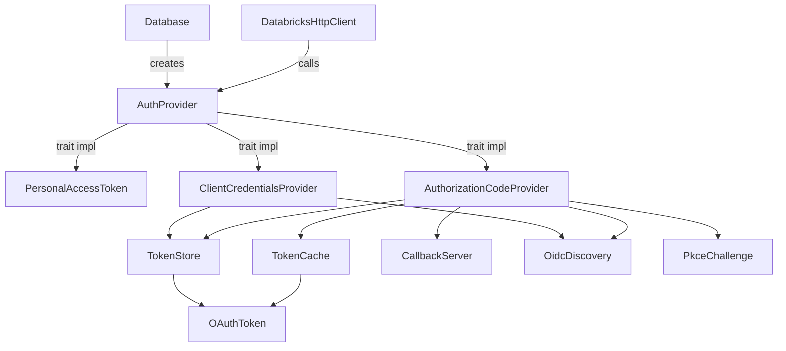
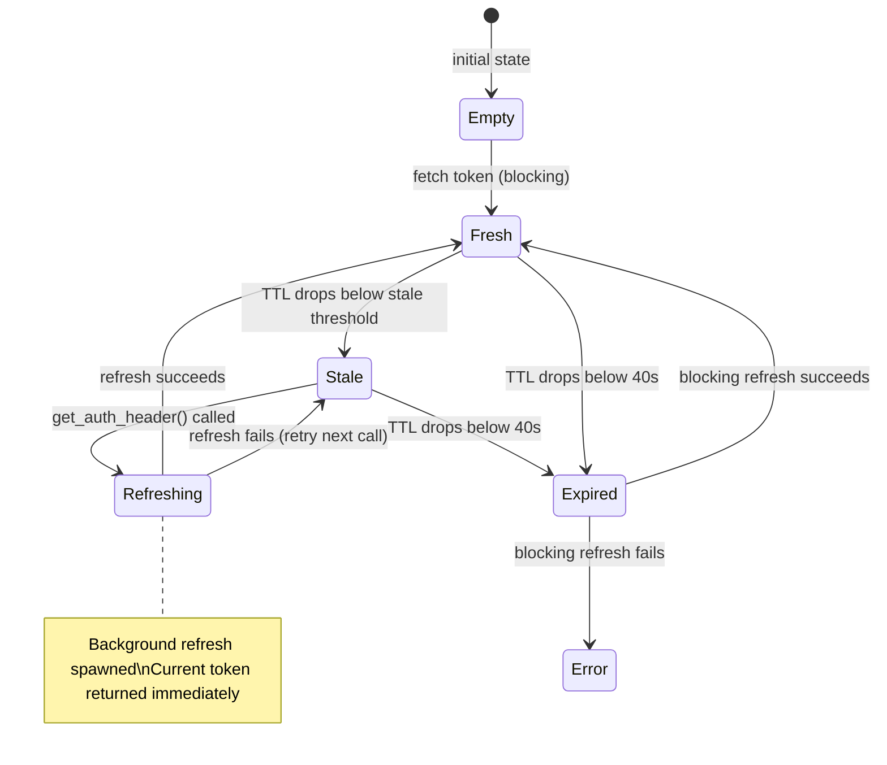
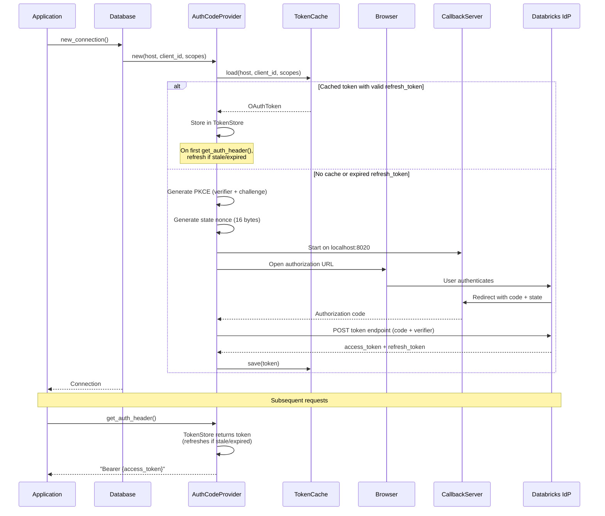
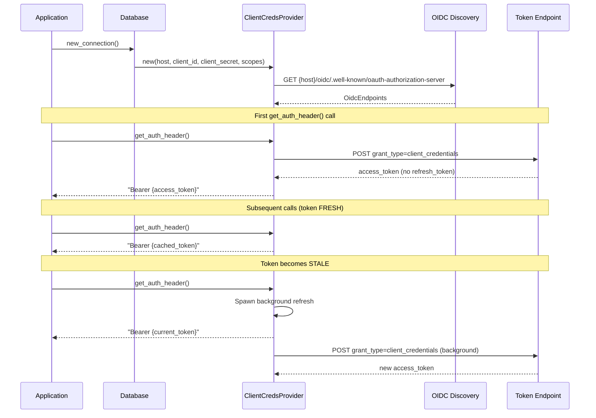
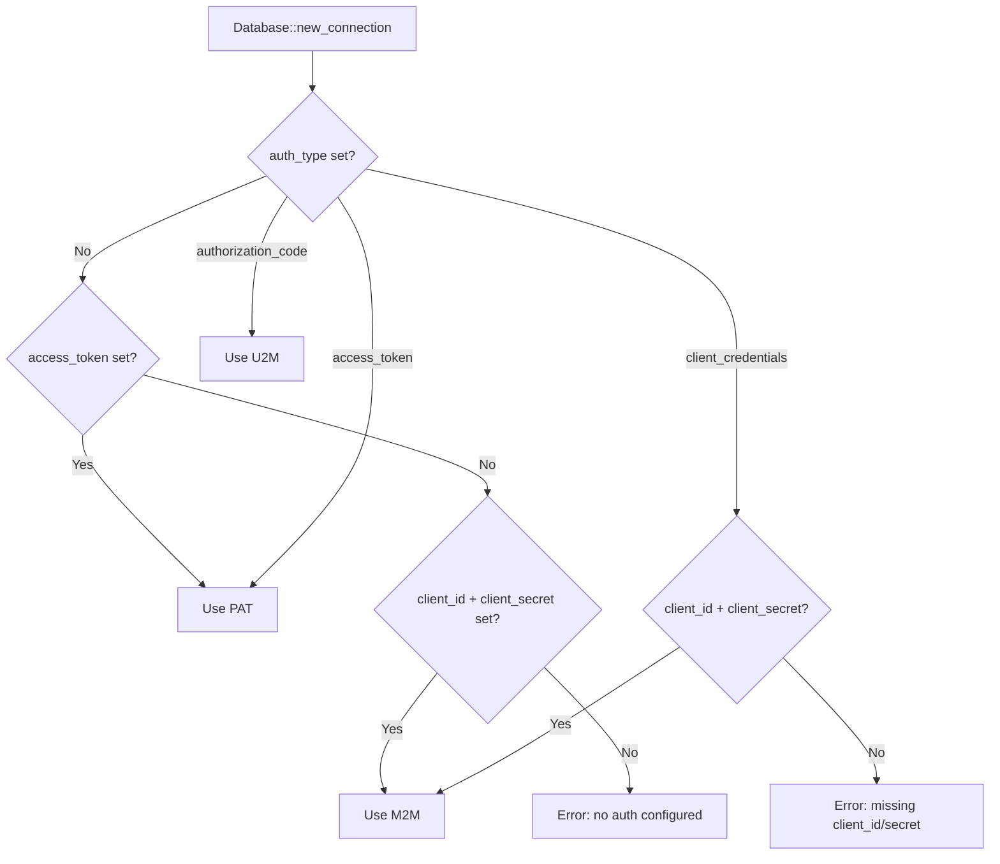

# OAuth Authentication Design: U2M and M2M Flows

## Overview

This document describes the design for adding OAuth 2.0 authentication to the Databricks Rust ADBC driver, covering:

- **U2M (User-to-Machine)**: Authorization Code flow with PKCE for interactive browser-based login
- **M2M (Machine-to-Machine)**: Client Credentials flow for service principal authentication
- **Shared infrastructure**: Token management, refresh, caching, and OIDC discovery

The Python Databricks SDK (`databricks-sdk-python`) serves as the reference implementation.

### Motivation

The driver currently only supports Personal Access Token (PAT) authentication. OAuth support is required for:
- Service principal authentication (M2M) in production workloads
- Interactive user authentication (U2M) for development and BI tools
- Parity with the Python, Java, and Go Databricks SDKs

---

## Architecture

### Module Structure



### File Layout

```
src/auth/
  mod.rs              -- AuthProvider trait, re-exports (existing, modified)
  pat.rs              -- PersonalAccessToken (existing, unchanged)
  oauth/
    mod.rs            -- Module root, re-exports
    token.rs          -- OAuthToken struct, expiry/stale logic
    token_store.rs    -- Thread-safe token container with refresh state machine
    oidc.rs           -- OIDC endpoint discovery
    pkce.rs           -- PKCE verifier/challenge generation
    cache.rs          -- File-based token persistence
    callback.rs       -- Localhost HTTP server for U2M browser redirect
    m2m.rs            -- ClientCredentialsProvider (implements AuthProvider)
    u2m.rs            -- AuthorizationCodeProvider (implements AuthProvider)
```

---

## Interfaces and Contracts

### AuthProvider Trait (existing, unchanged)

```rust
pub trait AuthProvider: Send + Sync + Debug {
    fn get_auth_header(&self) -> Result<String>;
}
```

**Contract:**
- Called on every HTTP request attempt (including retries)
- Must return a valid `"Bearer {access_token}"` string
- Must be thread-safe (`Send + Sync`)
- May block briefly for token refresh; must not block indefinitely

### OAuthToken

```rust
pub struct OAuthToken {
    pub access_token: String,
    pub token_type: String,
    pub refresh_token: Option<String>,
    pub expires_at: DateTime<Utc>,
    pub scopes: Vec<String>,
}
```

**Contract:**
- `is_expired()`: Returns true when `expires_at - 40s < now` (40s buffer matches Python SDK; Azure rejects tokens within 30s of expiry)
- `is_stale()`: Returns true when remaining TTL < `min(TTL * 0.5, 20 minutes)` (dynamic stale window matching Python SDK)
- Serializable to/from JSON for disk caching

### OidcEndpoints

```rust
pub struct OidcEndpoints {
    pub authorization_endpoint: String,
    pub token_endpoint: String,
}
```

Discovered via `GET {host}/oidc/.well-known/oauth-authorization-server`.

### PkceChallenge

```rust
pub(crate) struct PkceChallenge {
    pub verifier: String,    // 32 random bytes, base64url, no padding
    pub challenge: String,   // SHA256(verifier), base64url, no padding
}
```

**Contract:**
- Uses S256 challenge method per RFC 7636
- `verifier`: 32 cryptographically random bytes, base64url-encoded without `=` padding
- `challenge`: SHA-256 hash of the UTF-8 encoded verifier, base64url-encoded without `=` padding

---

## Token Refresh State Machine



**Stale threshold:** `min(remaining_TTL * 0.5, 20 minutes)` -- computed dynamically when token is acquired.

### TokenStore

```rust
pub(crate) struct TokenStore {
    token: RwLock<Option<OAuthToken>>,
    refreshing: AtomicBool,
}
```

**Contract:**
- `get_or_refresh(refresh_fn)`: Returns a valid token. If STALE, spawns background refresh via `std::thread::spawn` and returns current token. If EXPIRED, blocks caller until refresh completes.
- Thread-safe: `RwLock` for read-heavy access, `AtomicBool` to prevent concurrent refresh.
- Only one refresh runs at a time; concurrent callers receive the current (stale) token.

---

## U2M Flow (Authorization Code + PKCE)



### CallbackServer

```rust
pub(crate) struct CallbackServer { /* ... */ }

impl CallbackServer {
    pub fn redirect_uri(&self) -> String;
    pub async fn wait_for_code(
        &self,
        expected_state: &str,
        timeout: Duration,
    ) -> Result<String>;
}
```

**Contract:**
- Binds to `localhost:{port}` (default 8020)
- Validates `state` parameter matches expected value (CSRF protection)
- Returns HTML response "You can close this tab" to the browser
- Times out after configurable duration (default: 120s)
- Returns the authorization code extracted from the callback query parameters

### Token Exchange (U2M)

Authorization code exchange request:
```
POST {token_endpoint}
Content-Type: application/x-www-form-urlencoded

grant_type=authorization_code
&code={authorization_code}
&code_verifier={pkce_verifier}
&redirect_uri=http://localhost:8020
&client_id={client_id}
```

Token refresh request:
```
POST {token_endpoint}
Content-Type: application/x-www-form-urlencoded

grant_type=refresh_token
&refresh_token={refresh_token}
&client_id={client_id}
```

---

## M2M Flow (Client Credentials)



### Token Exchange (M2M)

```
POST {token_endpoint}
Content-Type: application/x-www-form-urlencoded
Authorization: Basic base64({client_id}:{client_secret})

grant_type=client_credentials
&scope={scopes}
```

**Contract:**
- M2M tokens have no `refresh_token`; re-authentication uses the same client credentials
- No disk caching for M2M (credentials are always available; tokens are short-lived)
- Token endpoint discovered via OIDC, or overridden with `databricks.oauth.token_endpoint`

---

## Token Cache (U2M only)

**Location:** `~/.config/databricks-adbc/oauth/`

**Filename:** `SHA256(json({"host": ..., "client_id": ..., "scopes": [...]}))).json`

**File permissions:** `0o600` (owner read/write only)

```rust
pub(crate) struct TokenCache { /* ... */ }

impl TokenCache {
    pub fn load(host: &str, client_id: &str, scopes: &[String]) -> Option<OAuthToken>;
    pub fn save(host: &str, client_id: &str, scopes: &[String], token: &OAuthToken) -> Result<()>;
}
```

**Contract:**
- Cache is separate from the Python SDK cache (`~/.config/databricks-sdk-py/oauth/`). Cross-SDK cache sharing is fragile and not worth the compatibility risk.
- Cache I/O errors are logged as warnings but never block authentication.
- Tokens are saved after every successful acquisition or refresh.
- On load, expired tokens with a valid `refresh_token` are still returned (refresh will be attempted).

---

## Configuration Options

| Option | Type | Default | Required | Description |
|--------|------|---------|----------|-------------|
| `databricks.auth_type` | String | `"access_token"` | No | Auth method: `"access_token"`, `"client_credentials"`, `"authorization_code"` |
| `databricks.access_token` | String | -- | PAT only | Personal access token (existing) |
| `databricks.oauth.client_id` | String | `"databricks-cli"` (U2M) | M2M: yes, U2M: no | OAuth client ID |
| `databricks.oauth.client_secret` | String | -- | M2M: yes | OAuth client secret |
| `databricks.oauth.scopes` | String | `"all-apis offline_access"` (U2M), `"all-apis"` (M2M) | No | Space-separated OAuth scopes |
| `databricks.oauth.token_endpoint` | String | Auto-discovered via OIDC | No | Override OIDC-discovered token endpoint |
| `databricks.oauth.redirect_port` | String | `"8020"` | No | Localhost port for U2M callback server |

### Auth Type Selection Logic



When `auth_type` is not explicitly set, the driver infers the auth method from which credentials are provided. This matches the Python SDK's auto-detection behavior.

---

## Concurrency Model

### Sync/Async Bridge

The `AuthProvider::get_auth_header()` trait method is synchronous, but OAuth token fetches require HTTP calls (async via `reqwest`).

**Approach:** OAuth providers use a dedicated `reqwest::Client` (separate from `DatabricksHttpClient`) and bridge to async:
- Inside a tokio runtime (which the driver always has): use `tokio::task::block_in_place` + `Handle::block_on`
- For background stale-refresh: use `std::thread::spawn` with a captured `tokio::runtime::Handle`

**Why a separate reqwest::Client?** `DatabricksHttpClient` calls `auth_provider.get_auth_header()` on every request. If the OAuth provider used `DatabricksHttpClient` to fetch tokens, it would create a circular dependency. Token endpoints use HTTP Basic auth (`base64(client_id:client_secret)`) or form-encoded `client_id`, not Bearer tokens.

### Thread Safety

| Component | Mechanism | Guarantee |
|-----------|-----------|-----------|
| `TokenStore.token` | `std::sync::RwLock` | Multiple readers, single writer |
| `TokenStore.refreshing` | `AtomicBool` | Lock-free single-refresh coordination |
| `TokenCache` file I/O | File-level atomicity | Write to temp file, then rename |
| `CallbackServer` | Single-use, owned by provider | No concurrent access |

---

## Error Handling

| Scenario | Error Kind | Behavior |
|----------|-----------|----------|
| Missing `client_id` or `client_secret` for M2M | `invalid_argument()` | Fail at `new_connection()` |
| OIDC discovery HTTP failure | `io()` | Fail at provider creation |
| Token endpoint returns error | `io()` | Fail at `get_auth_header()` |
| Browser callback timeout (120s) | `io()` | Fail at provider creation |
| User denies consent in browser | `io()` | Fail at provider creation with IdP error message |
| Refresh token expired (U2M) | Falls through to browser | Re-launches browser flow |
| Token cache read/write failure | Logged as warning | Never blocks auth flow |
| Callback port already in use | `io()` | Fail at provider creation |

---

## Changes to Existing Code

### `src/auth/mod.rs`

- Remove `pub use oauth::OAuthCredentials`
- Add `pub use oauth::{ClientCredentialsProvider, AuthorizationCodeProvider}`

### `src/database.rs`

**New fields on `Database`:**
```rust
auth_type: Option<String>,
oauth_client_id: Option<String>,
oauth_client_secret: Option<String>,
oauth_scopes: Option<String>,
oauth_token_endpoint: Option<String>,
oauth_redirect_port: Option<u16>,
```

**Modified `new_connection()`:** Replace hardcoded PAT creation with auth provider factory:

```rust
let auth_provider: Arc<dyn AuthProvider> = match self.resolved_auth_type() {
    AuthType::AccessToken => {
        let token = self.access_token.as_ref()
            .ok_or_else(|| /* error */)?;
        Arc::new(PersonalAccessToken::new(token))
    }
    AuthType::ClientCredentials => {
        let client_id = self.oauth_client_id.as_ref()
            .ok_or_else(|| /* error */)?;
        let client_secret = self.oauth_client_secret.as_ref()
            .ok_or_else(|| /* error */)?;
        Arc::new(ClientCredentialsProvider::new(/* ... */)?)
    }
    AuthType::AuthorizationCode => {
        Arc::new(AuthorizationCodeProvider::new(/* ... */)?)
    }
};
```

**`access_token` becomes optional:** Only required when `auth_type` is `access_token`.

### `Cargo.toml`

New dependencies:
```toml
sha2 = "0.10"       # SHA-256 for PKCE and cache keys
rand = "0.8"         # Cryptographic random for PKCE verifier and state
url = "2"            # URL parsing/building for auth URLs
open = "5"           # Cross-platform browser launch
dirs = "5"           # Cross-platform config directory (~/.config/)
```

---

## Alternatives Considered

### 1. Reuse Python SDK's token cache directory
**Rejected.** Cross-SDK cache sharing is fragile -- different serialization formats, token field naming, and security implications. Each SDK/driver should manage its own cache. The JSON format is compatible enough to enable future sharing if explicitly desired.

### 2. Make AuthProvider trait async
**Rejected.** Would require changes across the entire call chain (`DatabricksHttpClient`, `SeaClient`, `Connection`, `Statement`). The sync interface with internal async bridge is simpler, matches how the Python SDK wraps async refresh behind a sync API, and `block_in_place` is efficient in a tokio multi-threaded runtime.

### 3. Use `oauth2` crate
**Rejected.** The `oauth2` Rust crate provides OAuth protocol types but doesn't handle OIDC discovery, token caching, or the specific Databricks token endpoint behavior. The additional abstraction layer adds complexity without reducing the implementation surface significantly. The Python, Java, and Go SDKs all implement OAuth from scratch for the same reasons.

### 4. Single OAuthProvider struct handling both U2M and M2M
**Rejected.** U2M and M2M have fundamentally different flows (browser vs. direct token exchange), different refresh strategies (refresh_token vs. re-authenticate), and different caching needs (disk cache vs. none). Separate types are clearer and match the Python SDK's `SessionCredentials` vs `ClientCredentials` split.

---

## New Dependencies

| Crate | Version | Purpose | Size Impact |
|-------|---------|---------|-------------|
| `sha2` | 0.10 | SHA-256 for PKCE challenge and cache keys | ~50KB |
| `rand` | 0.8 | Cryptographic random bytes for PKCE and state | Already transitive dep |
| `url` | 2 | URL parsing/construction for auth URLs | ~100KB |
| `open` | 5 | Cross-platform `open::that(url)` for browser launch | ~10KB |
| `dirs` | 5 | Cross-platform `config_dir()` for cache path | ~15KB |

---

## Test Strategy

### Unit Tests

**token.rs:**
- `test_token_fresh_not_expired` -- token with >20min TTL is not stale or expired
- `test_token_stale_threshold` -- token within stale window is stale but not expired
- `test_token_expired_within_buffer` -- token within 40s of expiry is expired
- `test_token_serialization_roundtrip` -- JSON serialize/deserialize preserves all fields

**pkce.rs:**
- `test_pkce_verifier_length` -- verifier is base64url of 32 bytes
- `test_pkce_challenge_is_sha256` -- challenge = SHA256(verifier) base64url no padding
- `test_pkce_no_padding` -- no `=` characters in verifier or challenge

**oidc.rs:**
- `test_discover_workspace_endpoints` -- mock well-known endpoint, verify parsed endpoints
- `test_discover_invalid_response` -- malformed JSON returns error
- `test_discover_http_error` -- 404/500 returns descriptive error

**cache.rs:**
- `test_cache_key_deterministic` -- same inputs produce same filename
- `test_cache_save_load_roundtrip` -- save then load returns same token
- `test_cache_missing_file` -- load returns None for nonexistent cache
- `test_cache_file_permissions` -- saved file has 0o600 permissions
- `test_cache_corrupted_file` -- malformed JSON returns None (not error)

**token_store.rs:**
- `test_store_fresh_token_no_refresh` -- FRESH token returned without calling refresh
- `test_store_expired_triggers_blocking_refresh` -- EXPIRED token blocks and refreshes
- `test_store_concurrent_refresh_single_fetch` -- multiple threads, only one refresh runs
- `test_store_stale_returns_current_token` -- STALE returns current token immediately

**callback.rs:**
- `test_callback_captures_code` -- simulated HTTP GET with code/state returns code
- `test_callback_validates_state` -- mismatched state returns error
- `test_callback_timeout` -- no callback within timeout returns error

**m2m.rs:**
- `test_m2m_token_exchange` -- mock token endpoint, verify grant_type and auth header
- `test_m2m_auto_refresh` -- expired token triggers new client_credentials exchange
- `test_m2m_oidc_discovery` -- discovers token endpoint before exchange

**u2m.rs:**
- `test_u2m_refresh_token_flow` -- mock token endpoint with grant_type=refresh_token
- `test_u2m_cache_hit` -- cached token skips browser flow
- `test_u2m_cache_miss_with_expired_refresh` -- falls through to browser flow

### Integration Tests

- `test_m2m_end_to_end` -- real Databricks workspace with service principal credentials (requires env vars, `#[ignore]` by default)
- `test_u2m_end_to_end` -- manual test only (`#[ignore]`), requires interactive browser

---

## Implementation Phases

| Phase | Scope | Dependencies |
|-------|-------|-------------|
| **1. Foundation** | `token.rs`, `pkce.rs`, `oidc.rs`, `cache.rs`, Cargo.toml updates | None |
| **2. M2M** | `token_store.rs`, `m2m.rs`, `oauth/mod.rs` | Phase 1 |
| **3. U2M** | `callback.rs`, `u2m.rs` | Phase 1 + 2 |
| **4. Integration** | `database.rs` changes, `auth/mod.rs` re-exports, config options | Phase 1 + 2 + 3 |
