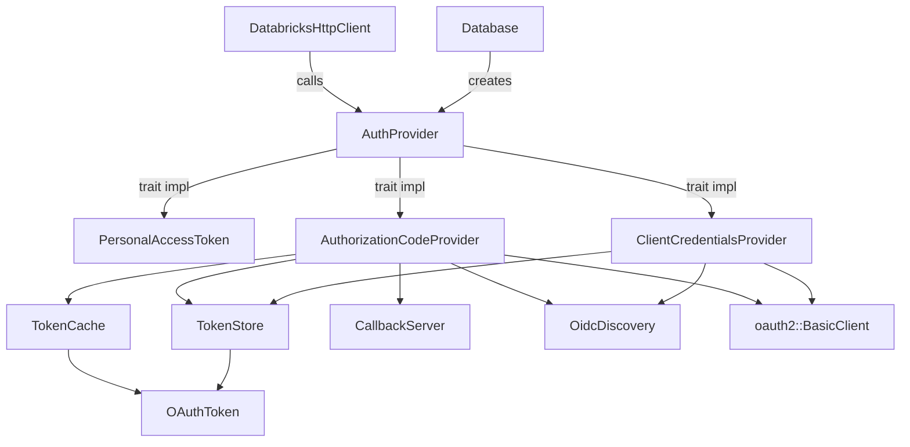
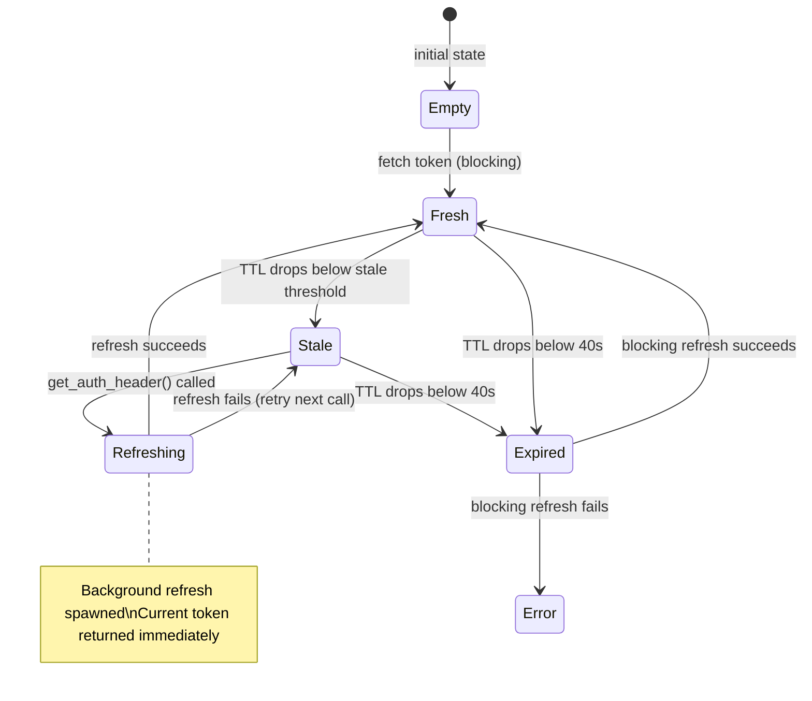
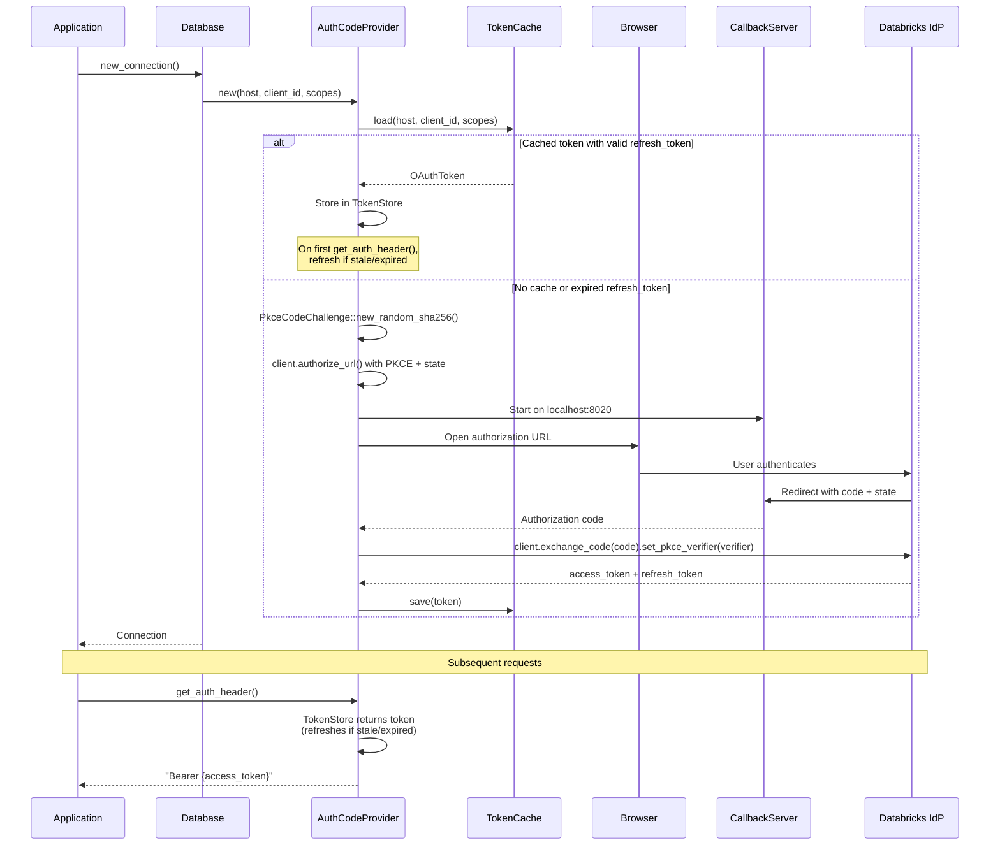
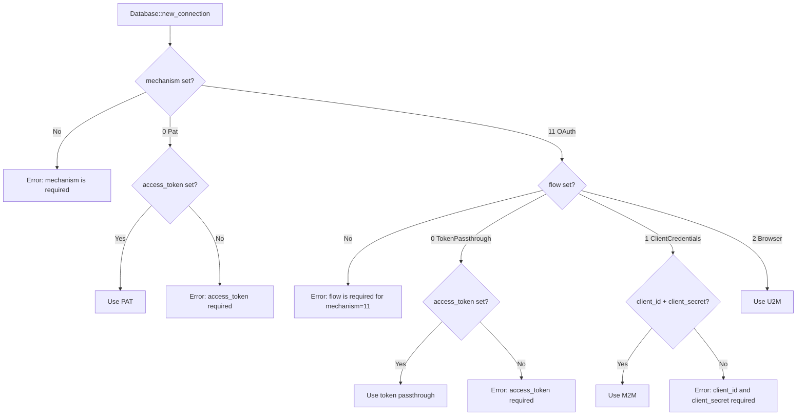

# OAuth Authentication Design: U2M and M2M Flows

## Overview

This document describes the design for adding OAuth 2.0 authentication to the Databricks Rust ADBC driver, covering:

- **U2M (User-to-Machine)**: Authorization Code flow with PKCE for interactive browser-based login
- **M2M (Machine-to-Machine)**: Client Credentials flow for service principal authentication
- **Shared infrastructure**: Token management, refresh, caching, and OIDC discovery

The Python Databricks SDK (`databricks-sdk-python`) serves as the reference implementation.

### Motivation

The driver currently only supports Personal Access Token (PAT) authentication. OAuth support is required for:
- Service principal authentication (M2M) in production workloads
- Interactive user authentication (U2M) for development and BI tools
- Parity with the Python, Java, and Go Databricks SDKs

---

## Architecture

### Module Structure



### File Layout

```
src/auth/
  mod.rs              -- AuthProvider trait, re-exports (existing, modified)
  pat.rs              -- PersonalAccessToken (existing, unchanged)
  oauth/
    mod.rs            -- Module root, re-exports
    token.rs          -- OAuthToken struct, expiry/stale logic
    token_store.rs    -- Thread-safe token container with refresh state machine
    oidc.rs           -- OIDC endpoint discovery
    cache.rs          -- File-based token persistence
    callback.rs       -- Localhost HTTP server for U2M browser redirect
    m2m.rs            -- ClientCredentialsProvider (implements AuthProvider)
    u2m.rs            -- AuthorizationCodeProvider (implements AuthProvider)
```

> **Note:** No `pkce.rs` -- PKCE generation is handled by the `oauth2` crate's
> `PkceCodeChallenge::new_random_sha256()` method.

---

## Interfaces and Contracts

### AuthProvider Trait (existing, unchanged)

```rust
pub trait AuthProvider: Send + Sync + Debug {
    fn get_auth_header(&self) -> Result<String>;
}
```

**Contract:**
- Called on every HTTP request attempt (including retries)
- Must return a valid `"Bearer {access_token}"` string
- Must be thread-safe (`Send + Sync`)
- May block briefly for token refresh; must not block indefinitely

### OAuthToken

```rust
pub struct OAuthToken {
    pub access_token: String,
    pub token_type: String,
    pub refresh_token: Option<String>,
    pub expires_at: DateTime<Utc>,
    pub scopes: Vec<String>,
}
```

**Contract:**
- `is_expired()`: Returns true when `expires_at - 40s < now` (40s buffer matches Python SDK; Azure rejects tokens within 30s of expiry)
- `is_stale()`: Returns true when remaining TTL < `min(TTL * 0.5, 20 minutes)` (dynamic stale window matching Python SDK)
- Serializable to/from JSON for disk caching

### OidcEndpoints

```rust
pub struct OidcEndpoints {
    pub authorization_endpoint: String,
    pub token_endpoint: String,
}
```

Discovered via `GET {host}/oidc/.well-known/oauth-authorization-server`.

### Usage of the `oauth2` Crate

Both U2M and M2M providers use [`oauth2::BasicClient`](https://docs.rs/oauth2/latest/oauth2/struct.Client.html) for protocol-level operations. The crate handles:

- **PKCE generation**: `PkceCodeChallenge::new_random_sha256()` generates the verifier/challenge pair (RFC 7636 S256)
- **Authorization URL construction**: `client.authorize_url(...)` with state, scopes, and PKCE challenge
- **Token exchange**: `client.exchange_code(code).set_pkce_verifier(verifier)` for U2M
- **Client credentials exchange**: `client.exchange_client_credentials()` for M2M
- **Refresh token exchange**: `client.exchange_refresh_token(refresh_token)` for U2M
- **HTTP client integration**: Pluggable async HTTP client via `oauth2::reqwest::async_http_client`

The `oauth2::BasicClient` is constructed from OIDC-discovered endpoints:

```rust
let client = BasicClient::new(ClientId::new(client_id))
    .set_client_secret(ClientSecret::new(client_secret))  // M2M only
    .set_auth_uri(AuthUrl::new(endpoints.authorization_endpoint)?)
    .set_token_uri(TokenUrl::new(endpoints.token_endpoint)?)
    .set_redirect_uri(RedirectUrl::new(redirect_uri)?);    // U2M only
```

**What the `oauth2` crate does NOT handle** (we implement ourselves):
- OIDC endpoint discovery (`oidc.rs`)
- Token lifecycle management -- FRESH/STALE/EXPIRED state machine (`token_store.rs`)
- File-based token caching (`cache.rs`)
- Browser launch and localhost callback server (`callback.rs`)
- Integration with the driver's `AuthProvider` trait

---

## Token Refresh State Machine



**Stale threshold:** `min(remaining_TTL * 0.5, 20 minutes)` -- computed dynamically when token is acquired.

### TokenStore

```rust
pub(crate) struct TokenStore {
    token: RwLock<Option<OAuthToken>>,
    refreshing: AtomicBool,
}
```

**Contract:**
- `get_or_refresh(refresh_fn)`: Returns a valid token. If STALE, spawns background refresh via `std::thread::spawn` and returns current token. If EXPIRED, blocks caller until refresh completes.
- Thread-safe: `RwLock` for read-heavy access, `AtomicBool` to prevent concurrent refresh.
- Only one refresh runs at a time; concurrent callers receive the current (stale) token.

---

## U2M Flow (Authorization Code + PKCE)



### CallbackServer

```rust
pub(crate) struct CallbackServer { /* ... */ }

impl CallbackServer {
    pub fn redirect_uri(&self) -> String;
    pub async fn wait_for_code(
        &self,
        expected_state: &str,
        timeout: Duration,
    ) -> Result<String>;
}
```

**Contract:**
- Binds to `localhost:{port}` (default 8020)
- Validates `state` parameter matches expected value (CSRF protection)
- Returns HTML response "You can close this tab" to the browser
- Times out after configurable duration (default: 120s)
- Returns the authorization code extracted from the callback query parameters

### Token Exchange (U2M)

Both exchanges are handled by the `oauth2` crate, routed through `DatabricksHttpClient`:

```rust
// Custom HTTP client function that routes through DatabricksHttpClient::execute_without_auth()
let http_fn = |request: oauth2::HttpRequest| {
    let http_client = http_client.clone();
    async move { http_client.execute_without_auth(request.into()).await }
};

// Authorization code exchange (with PKCE verifier)
let token_response = client
    .exchange_code(AuthorizationCode::new(code))
    .set_pkce_verifier(pkce_verifier)
    .request_async(&http_fn)
    .await?;

// Refresh token exchange
let token_response = client
    .exchange_refresh_token(&RefreshToken::new(refresh_token))
    .request_async(&http_fn)
    .await?;
```

The `oauth2` crate constructs the correct `POST` request with `grant_type`, `code_verifier`, `redirect_uri`, `client_id`, and `refresh_token` parameters. We use `execute_without_auth()` since the `oauth2` crate adds its own auth (Basic or form-encoded) -- this avoids the circular `get_auth_header()` call.

---

## M2M Flow (Client Credentials)


### Token Exchange (M2M)

```rust
let token_response = client
    .exchange_client_credentials()
    .add_scope(Scope::new("all-apis".to_string()))
    .request_async(&http_fn)  // routes through DatabricksHttpClient::execute_without_auth()
    .await?;
```

The `oauth2` crate sends `POST {token_endpoint}` with `grant_type=client_credentials`, `Authorization: Basic base64(client_id:client_secret)`, and the requested scopes. The request goes through `DatabricksHttpClient::execute_without_auth()` to get retry logic and connection pooling.

**Contract:**
- M2M tokens have no `refresh_token`; re-authentication uses the same client credentials
- No disk caching for M2M (credentials are always available; tokens are short-lived)
- Token endpoint discovered via OIDC, or overridden with `databricks.oauth.token_endpoint`

---

## Token Cache (U2M only)

**Location:** `~/.config/databricks-adbc/oauth/`

**Filename:** `SHA256(json({"host": ..., "client_id": ..., "scopes": [...]}))).json`

**File permissions:** `0o600` (owner read/write only)

```rust
pub(crate) struct TokenCache { /* ... */ }

impl TokenCache {
    pub fn load(host: &str, client_id: &str, scopes: &[String]) -> Option<OAuthToken>;
    pub fn save(host: &str, client_id: &str, scopes: &[String], token: &OAuthToken) -> Result<()>;
}
```

**Contract:**
- Cache is separate from the Python SDK cache (`~/.config/databricks-sdk-py/oauth/`). Cross-SDK cache sharing is fragile and not worth the compatibility risk.
- Cache I/O errors are logged as warnings but never block authentication.
- Tokens are saved after every successful acquisition or refresh.
- On load, expired tokens with a valid `refresh_token` are still returned (refresh will be attempted).

---

## Configuration Options

Following the Databricks ODBC driver's two-level authentication scheme, configuration uses `AuthMech` (mechanism) and `Auth_Flow` (OAuth flow type) as the primary selectors. Both are **required** -- no auto-detection.

### Rust Enums

```rust
/// Authentication mechanism -- top-level selector.
/// Config values match the ODBC driver's AuthMech numeric codes.
#[derive(Debug, Clone, PartialEq)]
#[repr(u8)]
pub enum AuthMechanism {
    /// Personal access token (no OAuth). Config value: 0
    Pat = 0,
    /// OAuth 2.0 -- requires AuthFlow to select the specific flow. Config value: 11
    OAuth = 11,
}

/// OAuth authentication flow -- selects the specific OAuth grant type.
/// Config values match the ODBC driver's Auth_Flow numeric codes.
/// Only applicable when AuthMechanism is OAuth.
#[derive(Debug, Clone, PartialEq)]
#[repr(u8)]
pub enum AuthFlow {
    /// Use a pre-obtained OAuth access token directly. Config value: 0
    TokenPassthrough = 0,
    /// M2M: client credentials grant for service principals. Config value: 1
    ClientCredentials = 1,
    /// U2M: browser-based authorization code + PKCE. Config value: 2
    Browser = 2,
}
```

### Authentication Selection

| Option | Type | Values | Required | Description |
|--------|------|--------|----------|-------------|
| `databricks.auth.mechanism` | Int/String | `0` (PAT), `11` (OAuth) | **Yes** | Authentication mechanism (matches ODBC `AuthMech`) |
| `databricks.auth.flow` | Int/String | `0` (token passthrough), `1` (client credentials), `2` (browser) | **Yes** (when mechanism=`11`) | OAuth flow type (matches ODBC `Auth_Flow`) |

**Values aligned with ODBC driver:**

| `mechanism` | `flow` | ODBC `AuthMech` | ODBC `Auth_Flow` | Description |
|-------------|--------|-----------------|-------------------|-------------|
| `0` | -- | -- | -- | Personal access token |
| `11` | `0` | 11 | 0 | Pre-obtained OAuth access token |
| `11` | `1` | 11 | 1 | M2M: service principal |
| `11` | `2` | 11 | 2 | U2M: browser-based auth code + PKCE |

### Credential and OAuth Options

| Option | Type | Default | Required For | Description |
|--------|------|---------|-------------|-------------|
| `databricks.access_token` | String | -- | mechanism=`0`, flow=`0` | Access token (PAT or OAuth) |
| `databricks.auth.client_id` | String | `"databricks-cli"` (flow=`2`) | flow=`1` (required), flow=`2` (optional) | OAuth client ID |
| `databricks.auth.client_secret` | String | -- | flow=`1` | OAuth client secret |
| `databricks.auth.scopes` | String | `"all-apis offline_access"` (flow=`2`), `"all-apis"` (flow=`1`) | No | Space-separated OAuth scopes |
| `databricks.auth.token_endpoint` | String | Auto-discovered via OIDC | No | Override OIDC-discovered token endpoint |
| `databricks.auth.redirect_port` | String | `"8020"` | No | Localhost port for browser callback server |

### Auth Selection Logic



Both `mechanism` and `flow` are mandatory -- no auto-detection. This makes configuration explicit and predictable, matching the ODBC driver's approach where `AuthMech` and `Auth_Flow` are always specified.

---

## Concurrency Model

### Sync/Async Bridge

The `AuthProvider::get_auth_header()` trait method is synchronous, but OAuth token fetches require HTTP calls (async via `reqwest`).

**Approach:** OAuth providers reuse `DatabricksHttpClient` for all HTTP calls (including token endpoint requests), bridged to the sync `get_auth_header()`:
- Inside a tokio runtime (which the driver always has): use `tokio::task::block_in_place` + `Handle::block_on`
- For background stale-refresh: use `std::thread::spawn` with a captured `tokio::runtime::Handle`

**Avoiding circular dependency with `DatabricksHttpClient`:**

`DatabricksHttpClient` currently requires an `AuthProvider` at construction time and calls `get_auth_header()` on every `execute()` call. This creates a circular dependency if the OAuth provider also needs the HTTP client to fetch tokens. The solution is a two-phase initialization:

1. **Decouple auth from HTTP client construction.** Change `DatabricksHttpClient` to accept `auth_provider` via `OnceLock<Arc<dyn AuthProvider>>` (matching the existing `SeaClient` pattern for `reader_factory`). The client is created first without auth.
2. **OAuth providers use `execute_without_auth()`** for token endpoint calls. Token endpoints authenticate via form-encoded `client_id`/`client_secret` or `Authorization: Basic` header -- not Bearer tokens. The OAuth provider manually adds these credentials to the request before calling `execute_without_auth()`.
3. **Auth provider is set on the HTTP client after creation.**

```rust
// In database.rs new_connection():
// 1. Create HTTP client (no auth yet)
let http_client = Arc::new(DatabricksHttpClient::new(self.http_config.clone())?);

// 2. Create auth provider based on mechanism + flow enums
//    (see database.rs section below for full match logic)
let auth_provider: Arc<dyn AuthProvider> = /* match on AuthMechanism/AuthFlow */;

// 3. Set auth on HTTP client
http_client.set_auth_provider(auth_provider);
```

This gives us a single HTTP client with shared retry logic, timeouts, and connection pooling for both API calls and token endpoint calls.

**Changes to `DatabricksHttpClient`:**

```rust
pub struct DatabricksHttpClient {
    client: Client,
    config: HttpClientConfig,
    auth_provider: OnceLock<Arc<dyn AuthProvider>>,  // was: Arc<dyn AuthProvider>
}

impl DatabricksHttpClient {
    pub fn new(config: HttpClientConfig) -> Result<Self>;  // no auth_provider param
    pub fn set_auth_provider(&self, provider: Arc<dyn AuthProvider>);
    pub fn auth_header(&self) -> Result<String>;  // reads from OnceLock, errors if not set
}
```

### Thread Safety

| Component | Mechanism | Guarantee |
|-----------|-----------|-----------|
| `TokenStore.token` | `std::sync::RwLock` | Multiple readers, single writer |
| `TokenStore.refreshing` | `AtomicBool` | Lock-free single-refresh coordination |
| `TokenCache` file I/O | File-level atomicity | Write to temp file, then rename |
| `CallbackServer` | Single-use, owned by provider | No concurrent access |

---

## Error Handling

| Scenario | Error Kind | Behavior |
|----------|-----------|----------|
| Missing `databricks.auth.mechanism` | `invalid_argument()` | Fail at `new_connection()` |
| Missing `databricks.auth.flow` when mechanism=`11` | `invalid_argument()` | Fail at `new_connection()` |
| Invalid numeric value for mechanism or flow | `invalid_argument()` | Fail at `set_option()` |
| Missing `client_id` or `client_secret` for flow=`1` | `invalid_argument()` | Fail at `new_connection()` |
| Missing `access_token` for mechanism=`0` or flow=`0` | `invalid_argument()` | Fail at `new_connection()` |
| OIDC discovery HTTP failure | `io()` | Fail at provider creation |
| Token endpoint returns error | `io()` | Fail at `get_auth_header()` |
| Browser callback timeout (120s) | `io()` | Fail at provider creation |
| User denies consent in browser | `io()` | Fail at provider creation with IdP error message |
| Refresh token expired (U2M) | Falls through to browser | Re-launches browser flow |
| Token cache read/write failure | Logged as warning | Never blocks auth flow |
| Callback port already in use | `io()` | Fail at provider creation |

---

## Changes to Existing Code

### `src/client/http.rs`

- Change `auth_provider` field from `Arc<dyn AuthProvider>` to `OnceLock<Arc<dyn AuthProvider>>`
- Remove `auth_provider` from `new()` constructor
- Add `set_auth_provider(&self, provider: Arc<dyn AuthProvider>)` method
- `auth_header()` reads from `OnceLock`, returns error if not yet set
- `execute()` unchanged (still calls `auth_header()`)
- `execute_without_auth()` unchanged (still skips auth)

### `src/auth/mod.rs`

- Remove `pub use oauth::OAuthCredentials`
- Add `pub use oauth::{ClientCredentialsProvider, AuthorizationCodeProvider}`

### `src/database.rs`

**New fields on `Database`:**
```rust
auth_mechanism: Option<AuthMechanism>,
auth_flow: Option<AuthFlow>,
auth_client_id: Option<String>,
auth_client_secret: Option<String>,
auth_scopes: Option<String>,
auth_token_endpoint: Option<String>,
auth_redirect_port: Option<u16>,
```

`set_option` parses numeric config values into the enums:
```rust
"databricks.auth.mechanism" => {
    let v = Self::parse_int_option(&value)
        .ok_or_else(|| /* error: expected integer */)?;
    self.auth_mechanism = Some(AuthMechanism::try_from(v)?);  // 0 -> Pat, 11 -> OAuth
}
"databricks.auth.flow" => {
    let v = Self::parse_int_option(&value)
        .ok_or_else(|| /* error: expected integer */)?;
    self.auth_flow = Some(AuthFlow::try_from(v)?);  // 0 -> TokenPassthrough, 1 -> ClientCredentials, 2 -> Browser
}
```

**Modified `new_connection()`:** Two-phase initialization with enum matching:

```rust
// Phase 1: Create HTTP client (no auth yet)
let http_client = Arc::new(DatabricksHttpClient::new(self.http_config.clone())?);

// Phase 2: Create auth provider based on mechanism + flow
let mechanism = self.auth_mechanism.as_ref()
    .ok_or_else(|| /* error: databricks.auth.mechanism is required */)?;

let auth_provider: Arc<dyn AuthProvider> = match mechanism {
    AuthMechanism::Pat => {
        let token = self.access_token.as_ref()
            .ok_or_else(|| /* error: access_token required for mechanism=0 */)?;
        Arc::new(PersonalAccessToken::new(token))
    }
    AuthMechanism::OAuth => {
        let flow = self.auth_flow.as_ref()
            .ok_or_else(|| /* error: databricks.auth.flow required when mechanism=11 */)?;
        match flow {
            AuthFlow::TokenPassthrough => {
                let token = self.access_token.as_ref()
                    .ok_or_else(|| /* error: access_token required for flow=0 */)?;
                Arc::new(PersonalAccessToken::new(token))
            }
            AuthFlow::ClientCredentials => Arc::new(
                ClientCredentialsProvider::new(host, client_id, client_secret, http_client.clone())?
            ),
            AuthFlow::Browser => Arc::new(
                AuthorizationCodeProvider::new(host, client_id, http_client.clone())?
            ),
        }
    }
};

// Phase 3: Wire auth into HTTP client
http_client.set_auth_provider(auth_provider);
```

**`access_token` becomes optional:** Only required when mechanism=`0` (Pat) or flow=`0` (TokenPassthrough).

### `Cargo.toml`

New dependencies:
```toml
oauth2 = "5"         # OAuth 2.0 protocol (PKCE, token exchange, client credentials)
sha2 = "0.10"        # SHA-256 for token cache key generation
open = "5"           # Cross-platform browser launch
dirs = "5"           # Cross-platform config directory (~/.config/)
```

---

## Alternatives Considered

### 1. Reuse Python SDK's token cache directory
**Rejected.** Cross-SDK cache sharing is fragile -- different serialization formats, token field naming, and security implications. Each SDK/driver should manage its own cache. The JSON format is compatible enough to enable future sharing if explicitly desired.

### 2. Make AuthProvider trait async
**Rejected.** Would require changes across the entire call chain (`DatabricksHttpClient`, `SeaClient`, `Connection`, `Statement`). The sync interface with internal async bridge is simpler, matches how the Python SDK wraps async refresh behind a sync API, and `block_in_place` is efficient in a tokio multi-threaded runtime.

### 3. Implement OAuth protocol from scratch (no `oauth2` crate)
**Rejected.** While the Python, Java, and Go SDKs implement OAuth from scratch, the Rust ecosystem has a mature, well-maintained `oauth2` crate (87M+ downloads) that handles PKCE generation, authorization URL construction, token exchange, client credentials flow, and refresh token flow with strongly-typed APIs. Using it eliminates ~200 lines of hand-rolled protocol code, reduces risk of spec compliance bugs, and provides free support for edge cases like token response parsing. We still implement OIDC discovery, token lifecycle management, caching, and the browser callback server ourselves.

### 4. Separate `reqwest::Client` for token endpoint calls
**Rejected.** An earlier design proposed using a standalone `reqwest::Client` for OAuth token endpoint calls to avoid a circular dependency with `DatabricksHttpClient`. This would duplicate retry logic, timeout configuration, and connection pooling. Instead, we use two-phase initialization (HTTP client created first, auth provider set later via `OnceLock`) and route token endpoint calls through `execute_without_auth()`. This gives a single HTTP client with unified behavior.

### 5. Single OAuthProvider struct handling both U2M and M2M
**Rejected.** U2M and M2M have fundamentally different flows (browser vs. direct token exchange), different refresh strategies (refresh_token vs. re-authenticate), and different caching needs (disk cache vs. none). Separate types are clearer and match the Python SDK's `SessionCredentials` vs `ClientCredentials` split.

---

## New Dependencies

| Crate | Version | Purpose | Size Impact |
|-------|---------|---------|-------------|
| `oauth2` | 5 | OAuth 2.0 protocol: PKCE, token exchange, client credentials, refresh | ~200KB (brings `url`, `sha2`, `rand` as transitive deps) |
| `open` | 5 | Cross-platform `open::that(url)` for browser launch | ~10KB |
| `dirs` | 5 | Cross-platform `config_dir()` for cache path | ~15KB |
| `sha2` | 0.10 | SHA-256 for token cache key generation | Already transitive dep via `oauth2` |

---

## Test Strategy

### Unit Tests

**token.rs:**
- `test_token_fresh_not_expired` -- token with >20min TTL is not stale or expired
- `test_token_stale_threshold` -- token within stale window is stale but not expired
- `test_token_expired_within_buffer` -- token within 40s of expiry is expired
- `test_token_serialization_roundtrip` -- JSON serialize/deserialize preserves all fields

**oidc.rs:**
- `test_discover_workspace_endpoints` -- mock well-known endpoint, verify parsed endpoints
- `test_discover_invalid_response` -- malformed JSON returns error
- `test_discover_http_error` -- 404/500 returns descriptive error

**cache.rs:**
- `test_cache_key_deterministic` -- same inputs produce same filename
- `test_cache_save_load_roundtrip` -- save then load returns same token
- `test_cache_missing_file` -- load returns None for nonexistent cache
- `test_cache_file_permissions` -- saved file has 0o600 permissions
- `test_cache_corrupted_file` -- malformed JSON returns None (not error)

**token_store.rs:**
- `test_store_fresh_token_no_refresh` -- FRESH token returned without calling refresh
- `test_store_expired_triggers_blocking_refresh` -- EXPIRED token blocks and refreshes
- `test_store_concurrent_refresh_single_fetch` -- multiple threads, only one refresh runs
- `test_store_stale_returns_current_token` -- STALE returns current token immediately

**callback.rs:**
- `test_callback_captures_code` -- simulated HTTP GET with code/state returns code
- `test_callback_validates_state` -- mismatched state returns error
- `test_callback_timeout` -- no callback within timeout returns error

**m2m.rs:**
- `test_m2m_token_exchange` -- mock token endpoint, verify grant_type and auth header
- `test_m2m_auto_refresh` -- expired token triggers new client_credentials exchange
- `test_m2m_oidc_discovery` -- discovers token endpoint before exchange

**u2m.rs:**
- `test_u2m_refresh_token_flow` -- mock token endpoint with grant_type=refresh_token
- `test_u2m_cache_hit` -- cached token skips browser flow
- `test_u2m_cache_miss_with_expired_refresh` -- falls through to browser flow

### Integration Tests

- `test_m2m_end_to_end` -- real Databricks workspace with service principal credentials (requires env vars, `#[ignore]` by default)
- `test_u2m_end_to_end` -- manual test only (`#[ignore]`), requires interactive browser

---

## Implementation Phases

| Phase | Scope | Dependencies |
|-------|-------|-------------|
| **1. Foundation** | `token.rs`, `oidc.rs`, `cache.rs`, Cargo.toml updates (`oauth2`, `sha2`, `open`, `dirs`) | None |
| **2. M2M** | `token_store.rs`, `m2m.rs`, `oauth/mod.rs` | Phase 1 |
| **3. U2M** | `callback.rs`, `u2m.rs` | Phase 1 + 2 |
| **4. Integration** | `database.rs` changes, `auth/mod.rs` re-exports, config options | Phase 1 + 2 + 3 |
