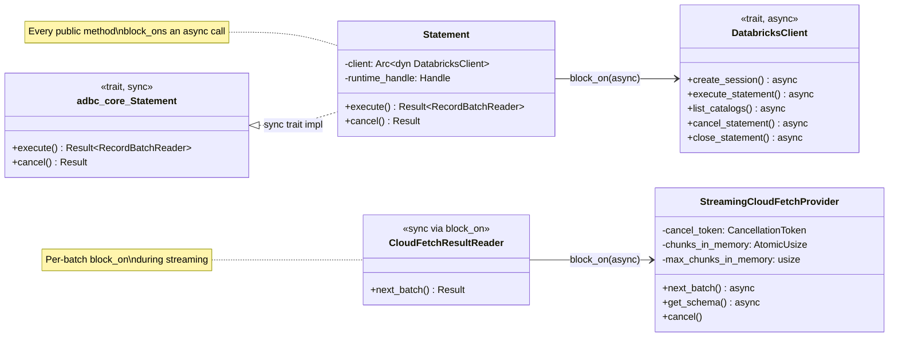
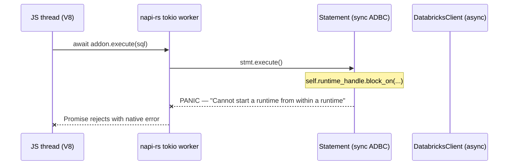
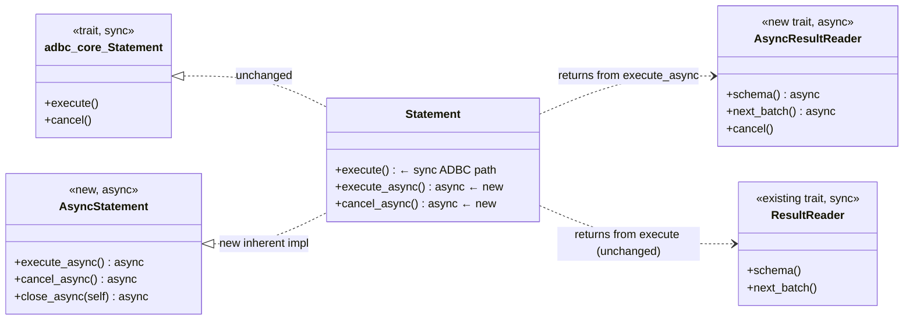
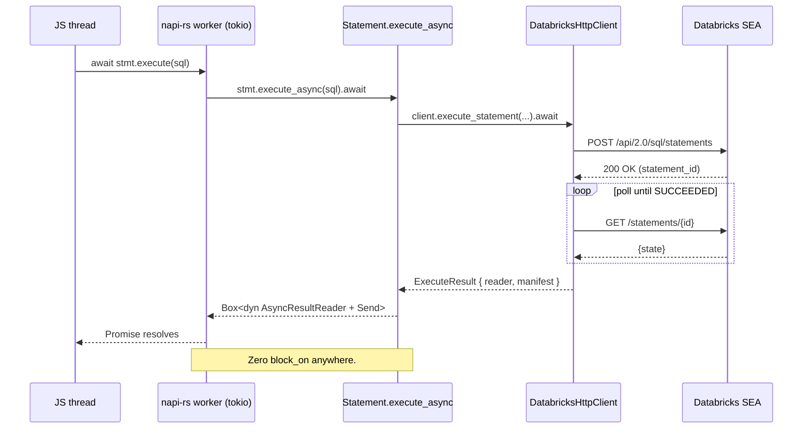
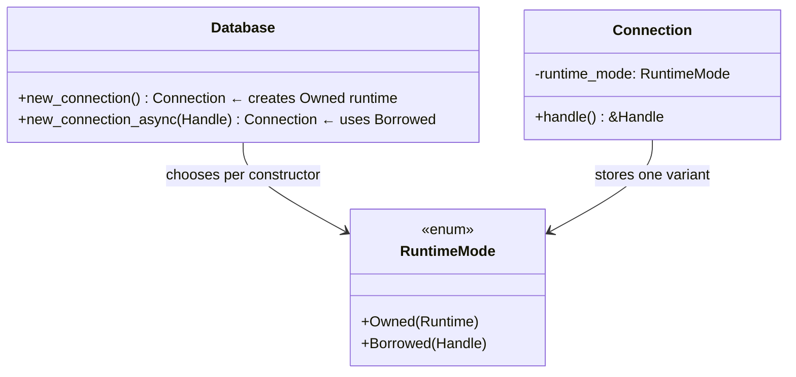
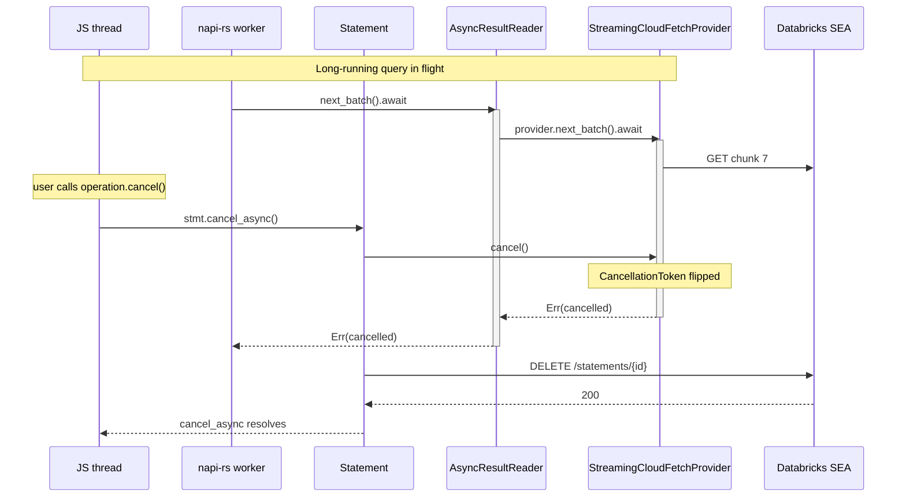
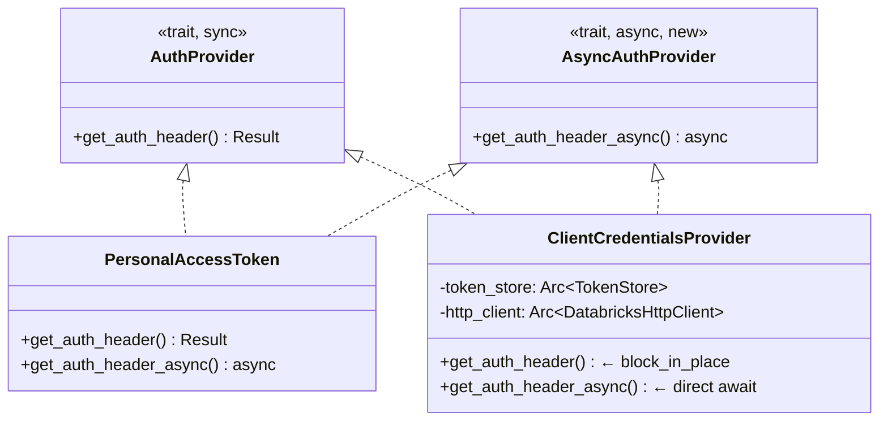
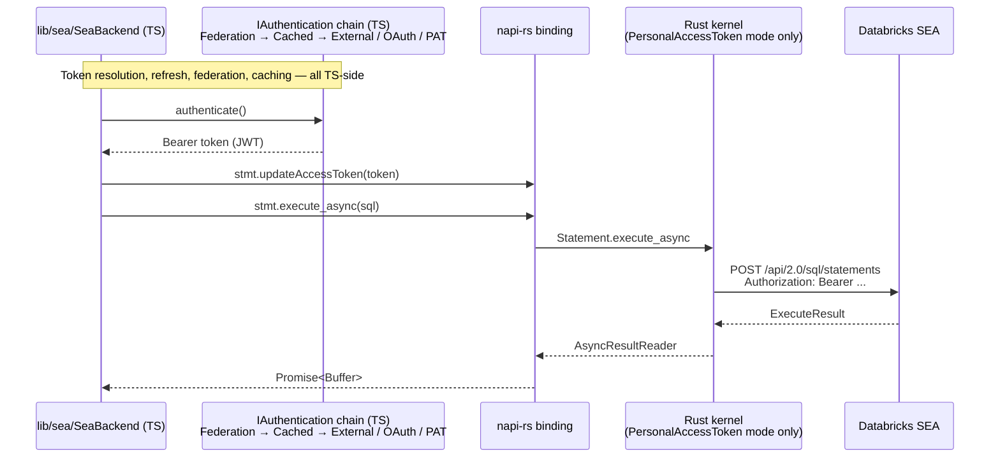

# Rust Kernel — Async Public API Design

**Status:** Proposed
**Scope:** `rust/` (Databricks ADBC Rust driver)
**Author:** (to be filled in on PR)
**Ticket:** (associate with Jira ticket before submitting PR)

---

## 1. Summary

This design proposes adding a **parallel, native-async public API** to the `databricks-adbc` Rust kernel. The existing synchronous ADBC trait surface (which the ODBC C++ driver consumes via a C FFI) remains byte-identical. The new async surface unlocks a Node.js binding (and future Python/JNI bindings) that cannot tolerate the `block_on` / `block_in_place` bridges currently used everywhere sync-public-wraps-async-internal.

**One-sentence framing:** publish the async layer that already exists inside the kernel, as an additive public contract, without touching the sync layer ODBC depends on.

---

## 2. Context & Motivation

### 2.1 Why this design exists

Databricks is adding SEA support to the Node.js SQL driver (`databricks-sql-nodejs`). The chosen strategy is a napi-rs native addon that wraps this Rust kernel — the same kernel ODBC uses. This gives one implementation of SEA protocol logic across all native clients.

The kernel today cannot be consumed by napi-rs as-is. Every public method is `sync-wrapping-async-with-block_on`. Calling such a method from a napi-rs `#[napi] async fn` (which itself runs on napi-rs's shared tokio runtime) triggers nested-runtime panics or deadlocks.

### 2.2 Goals

1. Expose an async public API on `Driver`, `Database`, `Connection`, `Statement`, and the result-reader layer.
2. Allow napi-rs to drive the kernel with **zero `block_on` on its caller thread**.
3. Preserve the existing ADBC trait implementations and the C FFI surface **byte-identically**.
4. Support runtime sharing: the napi-rs addon provides its own `tokio::runtime::Handle`; the kernel uses it instead of creating a per-connection Runtime.
5. Maintain backward compatibility for ODBC, JDBC, Python ADBC, and any other existing consumers.

### 2.3 Non-goals

- Rewriting the sync ADBC surface.
- Changing the C FFI at `src/ffi/*.rs` or the header `include/databricks_metadata_ffi.h`.
- Exposing async through the C FFI (C has no `async`; ODBC continues to consume sync).
- Adding new protocol features (SEA extensions, new auth types, new result formats).
- Refactoring the internal async machinery — it works; we're just publishing it.

---

## 3. Current state

### 3.1 Architectural pattern today



**What's already async internally:**

- `DatabricksClient` trait — `#[async_trait]` over all SEA RPCs (`execute_statement`, `list_catalogs`, etc.).
- `StreamingCloudFetchProvider` — async, with a `CancellationToken`, memory-bounded concurrency (atomic counter + max), and parallel chunk downloads.
- `ChunkLinkFetcher` trait — `#[async_trait]`.
- `ChunkDownloader` — async, uses tokio HTTP concurrency.
- `DatabricksHttpClient` — async, full retry policy, token refresh.
- OAuth `ClientCredentialsProvider::new` and `AuthorizationCodeProvider::new` — async constructors.
- `TokenStore` — Fresh/Stale/Expired state machine, background refresh via `spawn_blocking`, atomic coordination.

**Where async is hidden behind sync:**

| Layer | File | Sites |
|---|---|---|
| `Statement` ADBC impl | `src/statement.rs` | execute (142), cancel (188), Drop (201) |
| `Connection` ADBC impl | `src/connection.rs` | create_session (98), list_catalogs (233), list_schemas (248), list_tables (264, 292, 396), list_columns (331, 420), Drop (514) |
| `Database::new_connection` | `src/database.rs` | Runtime::new (821), M2M auth init (859), U2M auth init (891) |
| `CloudFetchResultReader` | `src/reader/mod.rs` | schema (319), next_batch (323) |
| `AuthProvider::get_auth_header` | `src/auth/oauth/m2m.rs` / `u2m.rs` | `block_in_place + Handle::current().block_on(...)` on every call that needs refresh |

**Runtime ownership:** `Connection` today owns a `tokio::runtime::Runtime` (not a `Handle`). Each connection creates its own thread pool.

### 3.2 Why this is incompatible with napi-rs



napi-rs's `#[napi] async fn` schedules futures onto its own tokio runtime's worker threads. When the kernel's sync method calls `block_on` on that same thread, tokio detects re-entrance and panics. `block_in_place` (used by auth) doesn't panic but starves the worker pool.

---

## 4. Proposed architecture

### 4.1 Dual-surface contract



Two surfaces on the same structs. The sync surface preserves every existing behavior; the async surface is purely additive.

### 4.2 End-to-end async flow



### 4.3 Runtime ownership



- **Owned mode** — ODBC path. `Database::new_connection` creates a `Runtime`, hands it to `Connection`. Today's behavior, unchanged.
- **Borrowed mode** — Node path. `Database::new_connection_async(handle)` stores a `Handle`. No Runtime created; napi-rs's runtime drives everything.

---

## 5. Interface specifications

All signatures below are **inherent methods** (not trait methods) on the existing structs, unless explicitly marked as a new trait. This keeps the sync ADBC traits untouched.

### 5.1 Database — async constructors

```rust
impl Database {
    /// Construct a Connection using the caller's tokio runtime handle.
    /// Replaces the internal `Runtime::new()` + auth `block_on` path.
    ///
    /// Contract:
    /// - Awaits auth provider construction (no block_on).
    /// - Awaits session creation (no block_on).
    /// - Connection stores the handle in Borrowed mode.
    /// - Drop on the resulting Connection is spawn-and-forget (§6.3).
    pub async fn new_connection_async(
        &self,
        handle: tokio::runtime::Handle,
    ) -> Result<Connection>;
}
```

### 5.2 Connection — async constructor + async metadata mirrors

```rust
impl Connection {
    pub(crate) async fn new_async(
        config: ConnectionConfig,
        handle: tokio::runtime::Handle,
    ) -> crate::Result<Self>;

    pub async fn list_catalogs_async(&self) -> Result<ExecuteResult>;

    pub async fn list_schemas_async(
        &self,
        catalog: Option<&str>,
        schema_pattern: Option<&str>,
    ) -> Result<ExecuteResult>;

    pub async fn list_tables_async(
        &self,
        catalog: Option<&str>,
        schema_pattern: Option<&str>,
        table_pattern: Option<&str>,
        table_types: Option<&[&str]>,
    ) -> Result<ExecuteResult>;

    pub async fn list_columns_async(
        &self,
        catalog: &str,
        schema_pattern: Option<&str>,
        table_pattern: Option<&str>,
        column_pattern: Option<&str>,
    ) -> Result<ExecuteResult>;

    pub async fn get_objects_async(
        &self,
        depth: ObjectDepth,
        catalog: Option<&str>,
        db_schema: Option<&str>,
        table_name: Option<&str>,
        table_type: Option<Vec<&str>>,
        column_name: Option<&str>,
    ) -> Result<Box<dyn AsyncResultReader + Send>>;

    pub async fn get_table_schema_async(
        &self,
        catalog: Option<&str>,
        db_schema: Option<&str>,
        table_name: &str,
    ) -> Result<Schema>;

    pub async fn get_info_async(
        &self,
        codes: Option<HashSet<InfoCode>>,
    ) -> Result<Box<dyn AsyncResultReader + Send>>;

    /// Deterministic async shutdown. Preferred over Drop for the async path.
    pub async fn close_async(self) -> Result<()>;
}
```

**Contract for every `*_async` method:**
- Must not call `block_on` or `block_in_place` anywhere in its call chain.
- Must be `Send` (the returned Future is `Send`; can be `tokio::spawn`ed).
- Safe to invoke concurrently from any tokio runtime.
- Auth header fetching on the `DatabricksHttpClient` goes through the new async auth path (§7).

### 5.3 Statement — async methods

```rust
impl Statement {
    /// Execute and return an async reader. No block_on.
    pub async fn execute_async(
        &mut self,
    ) -> Result<Box<dyn AsyncResultReader + Send>>;

    /// Fire the CancellationToken and issue DELETE /statements/{id}.
    pub async fn cancel_async(&mut self) -> Result<()>;

    /// Explicit deterministic close. Sets an internal `closed` flag so Drop skips I/O.
    pub async fn close_async(self) -> Result<()>;
}
```

### 5.4 AsyncResultReader — new trait

```rust
#[async_trait]
pub trait AsyncResultReader: Send {
    /// Returns the Arrow schema. May wait on the first batch if the reader
    /// has not yet observed it (CloudFetch).
    async fn schema(&self) -> Result<SchemaRef>;

    /// Returns the next batch, or None at end-of-stream.
    /// Respects the reader's CancellationToken.
    async fn next_batch(&mut self) -> Result<Option<RecordBatch>>;

    /// Synchronous cancel — flips the CancellationToken.
    /// Safe to call from any thread at any time, including mid-`next_batch`.
    fn cancel(&self);
}
```

**Contract:**

- `schema()`: idempotent; safe to call before, during, or after `next_batch()`.
- `next_batch()`: returns `Ok(None)` once at EOS; subsequent calls also return `Ok(None)`.
- `cancel()`: after call, subsequent `next_batch()` returns an error whose `to_adbc()` yields a cancelled status. Does not block.
- Dropping the reader before EOS releases all in-memory chunks and in-flight downloads.

**Concrete implementations shipped with the kernel:**

| Impl | Wraps | Notes |
|---|---|---|
| `AsyncCloudFetchResultReader` | `Arc<StreamingCloudFetchProvider>` | Delegates to existing `pub async fn next_batch` — no block_on. Inherits CancellationToken + memory-bounded concurrency. |
| `AsyncInlineArrowReader` | `InlineArrowProvider` | Inline bytes parsed in constructor; `next_batch` is a trivial `async { pop_front() }`. |
| `AsyncEmptyReader` | schema only | For zero-row queries (e.g., `SELECT ... WHERE 1=0`). |

### 5.5 AsyncAuthProvider — new trait

```rust
#[async_trait]
pub trait AsyncAuthProvider: Send + Sync + std::fmt::Debug {
    /// Async auth header retrieval. Must not block_in_place.
    async fn get_auth_header_async(&self) -> Result<String>;
}
```

**Concrete impls:**

- `PersonalAccessToken` — trivially `async { Ok(format!("Bearer {}", self.token)) }`.
- `ClientCredentialsProvider` — uses the existing TokenStore state machine; calls its existing async refresh path directly (no `block_in_place`).
- `AuthorizationCodeProvider` — same.

**Contract:** every type that implements `AuthProvider` (sync) also implements `AsyncAuthProvider`. The two methods return identical values for the same state; they differ only in how they wait.

### 5.6 DatabricksHttpClient — async auth path

`DatabricksHttpClient` must be able to fetch auth headers asynchronously when driven from an async context. Add an internal branch that uses `AsyncAuthProvider::get_auth_header_async` when the caller is async; keep the sync path for sync callers.

No public API change here — it's an internal wiring tweak. Called out because `block_in_place` today lives inside the HTTP client's outbound request path (via the sync `AuthProvider`), and a genuinely async Node call must avoid it.

### 5.7 ExecuteResult — shape preserved

```rust
pub struct ExecuteResult {
    pub reader: Box<dyn ResultReader + Send>,           // sync; existing
    pub async_reader: Option<Box<dyn AsyncResultReader + Send>>, // new; async
    pub manifest: Option<ResultManifest>,
    pub statement_id: String,
}
```

Async callers populate `async_reader`, sync callers populate `reader`. An internal helper can synthesize the sync reader from the async one (wrapping with `block_on`) for the sync code path, preserving byte-identical behavior for ODBC.

---

## 6. Concurrency model

### 6.1 Thread safety

| Type | Guarantee |
|---|---|
| `Arc<Connection>` | Shared across threads. All `*_async` methods are `&self`, safe to invoke concurrently. |
| `Statement` | `Send` but not `Sync`; one active consumer per statement (mirrors current semantics). |
| `Box<dyn AsyncResultReader>` | `Send` but not `Sync`; single-consumer. |
| `Arc<dyn DatabricksClient>` | `Send + Sync`; already today. |
| `Arc<dyn AsyncAuthProvider>` | `Send + Sync`; new, same semantics as sync trait. |

### 6.2 Backpressure

Already implemented inside `StreamingCloudFetchProvider`:

- `chunks_in_memory: AtomicUsize` tracks outstanding downloaded-but-unconsumed chunks.
- `max_chunks_in_memory: usize` caps it.
- `schedule_downloads()` breaks early when the cap is reached.
- `next_batch()` decrements the counter as the consumer drains.

**No new code needed.** Exposing the async surface gives callers direct access to this mechanism — a slow napi-rs consumer naturally parks the kernel's producer without any additional wiring.

### 6.3 Cancellation



**Flow:**
1. `cancel_async` flips the shared `CancellationToken` (sync) *and* issues the kernel-side DELETE RPC (async).
2. Any in-flight `next_batch()` on an `AsyncResultReader` observes the token at its next `.await` checkpoint and returns an error.
3. Existing `CancellationToken` instrumentation inside `StreamingCloudFetchProvider::next_batch`, `wait_for_chunk`, `download_chunk_with_retry` handles this today — we just expose the trigger.

**Caveat:** cooperative cancellation only fires at `.await` boundaries. Synchronous CPU chunks between awaits (Arrow decode, LZ4 decompress) run to completion. Typical SEA workloads have frequent awaits; not expected to be a problem in practice.

### 6.4 Drop semantics

```mermaid
stateDiagram-v2
    [*] --> Active
    Active --> Closed: close_async().await
    Active --> DroppedOwnedRT: drop (RuntimeMode::Owned)
    Active --> DroppedBorrowedRT: drop (RuntimeMode::Borrowed)
    Closed --> [*]: Drop runs but skips I/O

    DroppedOwnedRT --> [*]: block_on(delete_session)
    DroppedBorrowedRT --> [*]: handle.spawn(delete_session)
```

- **Owned mode** (ODBC): Drop keeps today's `runtime.block_on(delete_session())`. Zero change.
- **Borrowed mode** (Node): Drop spawns cleanup onto the borrowed `Handle` and returns immediately. JS thread is never blocked.
- **Explicit `close_async`**: sets a `closed: bool` flag. Drop observes it and skips all I/O — avoids double-close.

### 6.5 Runtime re-entrance safety

Every `*_async` method must be safe to call from:
- A fresh tokio runtime (Rust application using the kernel directly).
- A napi-rs worker on a shared tokio runtime.
- A `tokio::spawn`ed task from inside another `*_async` method (reentrancy via fanout).

The only requirement on the caller is that a tokio runtime is entered. There is no assumption about runtime flavor, worker count, or thread-local state.

---

## 7. Authentication

### 7.1 Sync vs async provider parity



Every concrete auth type implements both traits. TokenStore's existing state machine (Fresh/Stale/Expired + background refresh) is untouched — it's already async-native internally.

### 7.2 External token injection (future extension, non-blocking)

Out of scope for this design. A follow-up design may add a `TokenProvider` callback mechanism so the Node binding can push externally-resolved tokens (PAT from env, externally-issued JWT, federation). Sketch:

```rust
#[async_trait]
pub trait ExternalTokenSource: Send + Sync {
    async fn fetch_token(&self) -> Result<String>;
}
```

Mentioned here only so the async API shape doesn't preclude it.

---

## 8. What doesn't change (compatibility guarantees)

The following surfaces are **byte-identical** after this change:

| Surface | File | Guarantee |
|---|---|---|
| `impl adbc_core::Driver for Driver` | `src/driver.rs` | Unchanged — no I/O |
| `impl adbc_core::Database for Database` | `src/database.rs` | `new_connection()` body unchanged |
| `impl adbc_core::Connection for Connection` | `src/connection.rs` | All trait bodies unchanged; still `block_on` internally |
| `impl adbc_core::Statement for Statement` | `src/statement.rs` | Same |
| `ResultReader` trait and all impls | `src/reader/mod.rs` | Unchanged |
| `ResultReaderAdapter` | `src/reader/mod.rs` | Unchanged — Arrow `RecordBatchReader` remains sync |
| C FFI — `extern "C"` functions | `src/ffi/*.rs` | Zero change |
| C header | `include/databricks_metadata_ffi.h` | Zero change |
| `[lib] crate-type = ["lib", "cdylib", "staticlib"]` | `Cargo.toml` | Zero change |
| ABI and binary layout | | ODBC keeps linking against the same symbols |

**Verification:** the existing ODBC integration test suite (in the `../../databricks-odbc` repo) must pass unchanged against a kernel built from this branch. This is the tripwire.

---

## 9. Feature flag strategy

Add a Cargo feature `async-api` that gates the new surface:

```toml
[features]
default = ["async-api"]
async-api = []           # can be disabled to shave binary size for pure-ODBC consumers
metadata-ffi = []        # existing — no change
```

Rationale for enabling by default: the async surface adds ~50 KB to the compiled library but enables all non-ODBC consumers. Disabling is available for downstream packagers who want minimal surface.

---

## 10. Phased implementation plan

Each phase is an atomic, independently-testable step. Dependencies are explicit.

### Phase 1 — Runtime ownership refactor

- Introduce `RuntimeMode` enum with `Owned(Runtime)` and `Borrowed(Handle)` variants.
- Replace `runtime: tokio::runtime::Runtime` field on `Connection` with `runtime_mode: RuntimeMode`.
- Every existing `self.runtime.block_on(...)` call site becomes `self.runtime_mode.block_on(...)` (delegates appropriately).
- `new_with_runtime` continues to build `Owned` mode; no observable behavior change.

**Exit:** every existing test passes. `cargo clippy --all-targets -- -D warnings` clean.

### Phase 2 — Async auth providers

- Define `AsyncAuthProvider` trait (§5.5).
- Implement for `PersonalAccessToken`, `ClientCredentialsProvider`, `AuthorizationCodeProvider`.
- Add `DatabricksHttpClient::auth_header_async(&self) -> Result<String>` internal method that dispatches to `AsyncAuthProvider` when wired.
- Sync `AuthProvider` path unchanged (still uses `block_in_place`).

**Exit:** a `#[tokio::test]` verifies each async auth impl returns the same header as the sync one.

### Phase 3 — Async constructors

- `Connection::new_async(config, handle) -> Result<Self>` — mirror of `new_with_runtime` with `.await` substituted, stores `RuntimeMode::Borrowed(handle)`.
- `Database::new_connection_async(&self, handle) -> Result<Connection>` — builds auth provider async, then `Connection::new_async`.
- OAuth provider construction uses existing `pub async fn new_with_full_config` directly (no block_on).

**Exit:** a `#[tokio::test]` constructs a Connection against a live warehouse (gated on env vars, `#[ignore]` by default) via `new_connection_async`.

### Phase 4 — Async metadata methods on Connection

- Add inherent `*_async` methods (§5.2): `list_catalogs_async`, `list_schemas_async`, `list_tables_async`, `list_columns_async`, `get_table_schema_async`, `get_info_async`, `get_objects_async`.
- Each body is the existing ADBC trait body with `.await` substituted for `block_on(...)`.
- ADBC trait impls unchanged.

**Exit:** parity test — each async method returns identical content to its sync counterpart.

### Phase 5 — AsyncResultReader trait + impls

- Define `AsyncResultReader` trait (§5.4).
- Implement `AsyncCloudFetchResultReader` — wraps `Arc<StreamingCloudFetchProvider>`, delegates directly (no block_on).
- Implement `AsyncInlineArrowReader` — wraps `InlineArrowProvider`, trivial async shims.
- Implement `AsyncEmptyReader`.
- Factory: `ResultReaderFactory::create_async(...)` — decides inline-vs-cloudfetch from response.
- Augment `ExecuteResult` with optional `async_reader` field.

**Exit:** a `#[tokio::test]` executes a query via `execute_async`, iterates with `next_batch`, asserts row content matches the sync path.

### Phase 6 — Async Statement methods

- Add `execute_async`, `cancel_async`, `close_async` (§5.3).
- `execute_async` body: `self.client.execute_statement(...).await` → wrap result in `AsyncResultReader`.
- `cancel_async`: flip local `CancellationToken` + issue `client.cancel_statement(...).await`.
- `close_async(self)`: sets `closed: bool`, calls `client.close_statement(...).await`.

**Exit:** cancellation test — issue long query, call `cancel_async`, confirm next-batch returns cancelled error promptly.

### Phase 7 — Drop semantics

- `Connection::drop`: branch on `runtime_mode`. Owned → today's `block_on`. Borrowed → `handle.spawn(cleanup_future)`.
- `Statement::drop`: same pattern. Skip if `closed` flag is set.
- Add a smoke test: spawn 100 Connections in Borrowed mode, drop them all, assert the tokio runtime processes the spawned cleanup within a timeout.

**Exit:** process exits cleanly under napi-rs-like usage patterns.

### Phase 8 — Integration with napi-rs spike

- In the `databricks-sql-nodejs` worktree, build a minimal napi-rs crate that:
  - Depends on this kernel via path dep.
  - Exposes `#[napi] async fn execute(sql: String) -> Buffer` that serializes the first batch to Arrow IPC and returns.
- Write a Node harness that calls it against a live warehouse, measures event-loop delay via `perf_hooks.monitorEventLoopDelay`.

**Exit:** E2E `SELECT 1` through napi-rs; max event-loop delay < 20 ms during the call.

### Phase 9 — Documentation & release prep

- Update `src/lib.rs` rustdoc module overview.
- Add `examples/async_query.rs` demonstrating `Database::new_connection_async`.
- CHANGELOG entry under "Added — async public API (behind `async-api` feature flag, enabled by default)."
- Ensure `cargo test` (all features) green; `cargo test --no-default-features` green.

---

## 11. Testing strategy

### Unit tests (per phase)

- `RuntimeMode_dispatches_correctly_to_Owned`
- `RuntimeMode_dispatches_correctly_to_Borrowed`
- `PersonalAccessToken_async_matches_sync`
- `ClientCredentialsProvider_async_matches_sync`
- `TokenStore_async_refresh_no_block_in_place`
- `AsyncInlineArrowReader_yields_all_batches`
- `AsyncCloudFetchResultReader_respects_cancel_token`
- `Connection_new_async_constructs_without_block_on`
- `Statement_cancel_async_fires_token_and_issues_delete`

### Integration tests (live warehouse, `#[ignore]`)

- `async_select_one_returns_one_row`
- `async_metadata_catalogs_matches_sync`
- `async_large_query_streams_without_oom`
- `async_cancel_interrupts_long_query_promptly`
- `async_auth_m2m_refreshes_expired_token`

### Parity tests (run against live warehouse, both backends)

- Same SQL → same row content via sync ADBC path and async path.
- Same metadata query → identical ExecuteResult shape.

### ODBC compatibility verification

- Run the existing `databricks-odbc` test suite against a locally-built kernel from this branch. Must pass unchanged. This is the single most important regression gate.

### Benchmarks (informational, not gates)

- Throughput of `AsyncCloudFetchResultReader` on a 1M-row query, async path vs sync path. Expect approximate parity.
- Event-loop delay during streaming in the napi-rs spike.

---

## 12. Edge cases & failure modes

| Scenario | Current (sync) behavior | Async behavior |
|---|---|---|
| Network failure during `execute` | block_on returns Err; caller handles | Future resolves to Err; caller handles |
| Token expiry mid-stream | HTTP retry fires with refreshed token | Same — async auth path also goes through TokenStore |
| Consumer stops iterating mid-stream | Sync reader dropped → block_on(close) | Async reader dropped → spawn(close) on borrowed runtime |
| `cancel_async` during a `block_on` poll | N/A — there is no poll | CancellationToken observed at next `.await`; typically within tens of ms for SEA |
| Drop on JS thread (Borrowed mode) | N/A | spawn(cleanup); JS thread never blocked |
| Kernel crate with `async-api` disabled | N/A | New async symbols not compiled; ADBC/ODBC path byte-identical |
| Nested tokio runtime (caller in sync context calls async path) | N/A | Caller must enter a runtime; Owned mode's `block_on` remains the sync bridge |
| CPU-bound work inside `next_batch` (LZ4, Arrow decode) | Blocks caller's thread | Blocks a tokio worker; recommend `spawn_blocking` for large batches if profiling shows pool starvation |

---

## 13. Configuration

| Config | Scope | Default | Purpose |
|---|---|---|---|
| Cargo feature `async-api` | Compile-time | enabled | Gate the new public surface |
| `RuntimeMode` | Per-Connection | `Owned` when built via ADBC path; `Borrowed` when built via `new_connection_async` | Selects runtime ownership |
| `max_chunks_in_memory` | `CloudFetchConfig` | existing default | Backpressure cap (unchanged) |
| `cloudfetch_parallelism` | `CloudFetchConfig` | existing default | Per-statement download concurrency (unchanged) |

No new user-facing configuration is introduced. All knobs are existing.

---

## 14. Alternatives considered

### A. Make the ADBC trait implementations themselves async

**Rejected.** The `adbc_core` traits are defined as sync by the ADBC spec. Changing them would break every ADBC consumer (ODBC, Python ADBC, JDBC-via-ADBC). This is a multi-project breaking change we cannot unilaterally make.

### B. Remove `block_on` from existing sync methods entirely

**Rejected.** The sync ADBC methods are consumed by sync-only C++/C callers that cannot `.await`. Removing the bridge would force those callers to build their own runtime — worse ergonomics than today.

### C. Separate crate for the async surface

**Rejected.** The async methods share all state (client, session, runtime handle) with the sync methods. Splitting into two crates would require lifting every shared type into a third "core" crate and adding `pub` exposures that feel arbitrary. The inherent-impl approach on the same structs is cleaner.

### D. Replace the internal Runtime with a lazy singleton

**Rejected in this scope.** Would be a separate improvement to the sync path. Orthogonal to exposing async.

### E. Expose the async surface via a C FFI for future WASM/Python

**Rejected for this scope.** C has no `async`. Any async FFI requires either callback-based continuations (huge surface churn) or caller-side `block_on` (pointless). Each language binding (napi-rs, PyO3, JNI) speaks directly to the Rust-native async API.

---

## 15. Open questions

1. **Does `async-api` stay on by default, or opt-in?**
   - Recommendation: on. Removes a foot-gun for downstream consumers who would otherwise see "symbol not found" for async methods they expected.

2. **Should `ExecuteResult` carry both `reader` and `async_reader`, or use an enum?**
   - Recommendation: both as `Option`, as sketched in §5.7. Allows zero-cost upgrade paths and is simpler for consumers to inspect.

3. **Do we need `tokio::sync::Mutex` vs `std::sync::Mutex` anywhere in the new code?**
   - Recommendation: std::sync::Mutex for state held briefly (< 1 µs); tokio::sync::Mutex for any guard held across `.await`. Decide per site during implementation.

4. **Should the async auth trait supersede the sync one eventually?**
   - Recommendation: no. Sync trait stays forever — it's the ADBC contract. Async trait is additive.

5. **What's the upstream coordination plan?**
   - Need to raise this as an RFC-style discussion with the `adbc-drivers/databricks` maintainers before opening a 700-line PR. The design itself is conservative; the coordination overhead is mostly social.

---

## 16. Review focus areas

Reviewers, please focus on:

1. **ADBC compatibility guarantee (§8).** Does the plan actually leave ODBC byte-identical? Anything I missed?
2. **Runtime ownership model (§4.3, §6.5).** Is the `Owned | Borrowed` enum the right abstraction, or should we just allow `Database` to take an optional `Handle` and always use Borrowed when provided?
3. **AsyncResultReader shape (§5.4).** Does this trait cover every real consumer need? Any missing methods (size hints, row counts, schema metadata propagation)?
4. **Drop semantics (§6.4).** Is "spawn-and-forget in Borrowed mode" acceptable, or do we need a stronger guarantee (e.g., a reaper task that awaits all outstanding cleanups on kernel shutdown)?
5. **Feature flag default (§9, question 1).** On or off?
6. **Upstream coordination (question 5).** Who owns talking to the kernel maintainers, and on what timeline?

---

## 17. Appendix: file-by-file change map

| File | Change |
|---|---|
| `src/lib.rs` | Add `pub use` for async traits; add module-level rustdoc |
| `src/driver.rs` | No change |
| `src/database.rs` | Add `pub async fn new_connection_async` |
| `src/connection.rs` | Replace `runtime` field with `runtime_mode` enum; add ~7 `pub async fn` methods; update Drop |
| `src/statement.rs` | Add 3 `pub async fn` methods; add `closed` flag; update Drop |
| `src/reader/mod.rs` | Add `AsyncResultReader` trait; add async impls for CloudFetch, Inline, Empty; update factory |
| `src/auth/mod.rs` | Add `AsyncAuthProvider` trait |
| `src/auth/pat.rs` | Implement `AsyncAuthProvider` (trivial) |
| `src/auth/oauth/m2m.rs` | Implement `AsyncAuthProvider`; route through existing TokenStore without `block_in_place` |
| `src/auth/oauth/u2m.rs` | Same |
| `src/client/http.rs` | Add internal async auth-header path |
| `src/ffi/*.rs` | No change |
| `Cargo.toml` | Add `async-api` feature (enabled by default) |
| `tests/` | Add async integration tests (gated on env + `#[ignore]`) |
| `examples/async_query.rs` | New example |

Estimated net addition: ~700 LOC. Estimated net deletion: ~0 LOC.

---

## 18. Auth + TLS integration addendum

Added after initial design circulated. A deep audit of how the Node driver's auth/transport layer interacts with the proposed kernel async surface surfaced five concrete gaps that the original §7 (Authentication) understated. This addendum documents them and proposes additive kernel changes beyond the core async exposure.

### 18.1 Responsibility split — Node resolves, Rust consumes

The Node binding will use the kernel **exclusively in access-token (PAT) mode**. All OAuth flows, federation, external-token callbacks, custom `IAuthentication` subclasses, and token caching stay in TypeScript — where they already exist in the Thrift driver and do not need reimplementing.



**Invariant:** the kernel's OAuth providers (`ClientCredentialsProvider`, `AuthorizationCodeProvider`) are never constructed by the Node binding. Only `PersonalAccessToken` is used. This avoids:

- Duplicate OAuth flows in Rust and TS.
- Port collision between the two U2M callback servers (both bind localhost port 8030 by default).
- Duplicate token caches on disk with divergent content.

### 18.2 Kernel gap — `PersonalAccessToken` needs interior mutability

`src/client/http.rs:272-280` uses `OnceLock::set()` for auth-provider installation — second call returns `Err` and today's code panics. Combined with `PersonalAccessToken::token: String` being immutable, this means the Node binding **cannot rotate the bearer token after construction**. Every OAuth token expiry would require tearing down the kernel `Connection` — unusable for long-lived sessions.

**Proposed kernel change:**

```rust
// src/auth/pat.rs (new)
pub struct PersonalAccessToken {
    token: Arc<RwLock<String>>,
}

impl PersonalAccessToken {
    pub fn new(token: impl Into<String>) -> Self {
        Self { token: Arc::new(RwLock::new(token.into())) }
    }

    /// Atomically replace the held token. Safe to call from any thread
    /// concurrently with `get_auth_header` calls.
    pub fn update_token(&self, new_token: impl Into<String>) {
        *self.token.write().unwrap() = new_token.into();
    }
}

impl AuthProvider for PersonalAccessToken {
    fn get_auth_header(&self) -> Result<String> {
        Ok(format!("Bearer {}", self.token.read().unwrap()))
    }
}
```

Same addition on `AsyncAuthProvider` impl. Zero change to the trait signatures.

**Estimated cost:** ~20 LOC.

### 18.3 Token-refresh strategy across the FFI

With §18.2 in place, the Node binding drives token freshness with two mechanisms:

1. **Pre-emptive push (primary).** After resolving a token via `IAuthentication`, TS parses the JWT `exp` claim and starts a timer for `exp − 30s`. On fire: re-authenticate, call `nativeConnection.updateAccessToken(fresh)`. Same cadence used by the Thrift driver's `CachedTokenProvider`.
2. **401 retry (safety net).** If the kernel returns a status-401 error (observable via `napi::Error` mapping), the TS wrapper re-authenticates and retries the operation once. Safe for idempotent metadata ops (`list_catalogs`, etc.); **not** invoked for `execute_statement` — a re-executed query could double-apply side effects.

**CloudFetch chunk downloads use presigned URLs** and require no `Authorization` header, so mid-stream expiry of the Databricks-issued bearer token does not break in-flight downloads. Only the statement-polling loop inside Rust is affected, and that loop picks up the fresh token on its next HTTP request because `get_auth_header()` reads from the `RwLock` on every call.

### 18.4 TLS trust store — the biggest behavioral divergence

The Node driver and the Rust kernel load trust anchors from **different sources**:

| Aspect | Node driver today | Rust kernel |
|---|---|---|
| TLS backend | Node's built-in OpenSSL | `reqwest` + `native-tls` (`Cargo.toml:42`) |
| Default trust anchors | Node's bundled Mozilla CA list | OS system store (macOS Keychain / Linux `/etc/ssl/certs` / Windows SChannel) |
| `NODE_EXTRA_CA_CERTS` env var | Automatically appended | **Ignored** |
| `ca` ConnectionOption | `Buffer \| string` — used as full replacement | **Not supported** (kernel accepts file path only) |
| Config field | `ca` (in-memory) | `TlsConfig.trusted_certificate_path` (file path) |
| `rejectUnauthorized` default | **`false`** (permissive, see §18.4.1) | `true` (strict) |

**Failure scenarios that break users migrating Thrift → SEA:**

1. Corporate MITM proxy with `NODE_EXTRA_CA_CERTS=/etc/corp-ca.pem` — Thrift works, SEA fails with cert verification error.
2. User passes `ca: fs.readFileSync('cert.pem')` as Buffer — Thrift works, SEA fails because kernel expects a file path.
3. CA trusted in Keychain (macOS enterprise auto-installed) but not in Node's bundle — Thrift fails, SEA works (opposite divergence).

**Required changes:**

1. **Node binding (TS side):**
   - New `ConnectionOptions.caPath: string` — forwarded to Rust's `trusted_certificate_path`.
   - When user supplies in-memory `ca: Buffer | string`, serialize to a securely-created temp file (`0o600`, auto-cleanup on process exit) and pass the path through.
   - When `NODE_EXTRA_CA_CERTS` is set and `useSEA: true`, emit a warning: *"SEA backend uses a separate TLS trust store; NODE_EXTRA_CA_CERTS is not applied. Use `caPath` option instead."*
   - Forward `rejectUnauthorized: false` through to Rust's `allow_self_signed=true` + `allow_hostname_mismatch=true` (both already in `TlsConfig`).

2. **Kernel change (separate PR, outside this design):**
   - Add `reqwest::Certificate::from_pem(bytes: &[u8])` support so `TlsConfig` can accept in-memory CA bytes, not just file paths. Removes the temp-file dance on the TS side.

#### 18.4.1 `rejectUnauthorized: false` as the Thrift default

`lib/connection/connections/HttpConnection.ts` sets `rejectUnauthorized: false` unconditionally today. That means **the Thrift driver disables server cert verification by default**. Surprising but documented behavior.

To preserve parity, the SEA path must match this default. Flag for discussion with reviewers: do we take this opportunity to introduce a `strictTls: boolean` option (default `false` for parity, move to `true` in a later major) so users who've been unknowingly running without verification can opt into strict mode?

### 18.5 mTLS — a hard gap

| | Node driver today | Rust kernel |
|---|---|---|
| Client certificate | Supported (`cert`/`key`/`pfx`/`passphrase`) | **Not supported** |
| TLS backend hook | `tls.createSecureContext` | `reqwest::Identity` — not currently wired in |

Any user relying on mTLS under Thrift cannot migrate to SEA until the kernel adds client-cert support. **Proposed as a known limitation for the initial SEA GA**, tracked as a separate kernel issue:

> Add `TlsConfig.client_identity_pem_path: Option<String>` (and the corresponding in-memory variant) routed into `reqwest::Identity::from_pem` and `ClientBuilder::identity(identity)`.

Estimated kernel cost: ~30 LOC. Not included in this design's scope.

### 18.6 Proxy divergence

| Aspect | Node | Rust |
|---|---|---|
| HTTP proxy | ✓ (via `proxy-agent`) | ✓ |
| HTTPS proxy | ✓ | ✓ |
| SOCKS4 / SOCKS5 | ✓ | **✗** |
| `HTTP_PROXY`/`HTTPS_PROXY`/`NO_PROXY` env | ✓ | ✓ |
| Basic-auth credentials | ✓ | ✓ |
| ConnectionOption config | `proxy: { protocol, host, port, auth }` | `ProxyConfig { url, username, password, bypass_hosts }` |

**Required:** the SeaBackend must marshal the Node `proxy` ConnectionOption into the kernel's `ProxyConfig`. For `protocol: 'socks4' | 'socks5'`, fail fast with a clear error message at `DBSQLClient.connect()` — do not silently fall back to direct connection.

### 18.7 User-Agent passthrough

Current kernel default at `HttpClientConfig::user_agent`:

```
Databricks JDBC Driver/14.8.1 JDK/11.0.16 ADBC/1.2.0
```

A comment in `src/client/http.rs` explains this masquerade triggers Databricks server-side INLINE_OR_EXTERNAL_LINKS disposition. But it misrepresents the client — customer analytics dashboards would categorize every SEA-path query from Node as JDBC-from-JVM, breaking attribution.

**Required:**

1. `HttpClientConfig::user_agent` must be a public settable field.
2. The Node binding passes `NodejsDatabricksSqlConnector/{version} napi ({nodeVersion}, {os})` derived from the existing `lib/utils/buildUserAgentString.ts` helper.

Flag for reviewers: should the kernel default remain the JDBC masquerade, or move to `DatabricksADBC/{version}` once the server-side disposition-triggering logic no longer depends on UA sniffing?

### 18.8 Read timeout default

`HttpClientConfig::read_timeout` defaults to **60 seconds**. This aborts any SEA statement polling loop where the query runs longer than a minute — i.e., the exact workloads SEA exists to serve (large warehouse queries that run tens of seconds to minutes).

**Required:** the Node binding must override this to a value driven by `ConnectionOptions.socketTimeout` (or a new `requestTimeout`) with a floor of 15 minutes. Document the setting prominently.

### 18.9 Updated open questions

In addition to §15's six questions, add:

7. **Mutable `PersonalAccessToken` on the main design PR or a separate kernel PR?**
   - Recommendation: separate kernel PR (small, focused, orthogonal). This design PR references it as a prerequisite.

8. **`strictTls` default — match Thrift's permissive default, or make SEA strict from day one?**
   - Recommendation: match for v1. Introduce strict-by-default in a later major.

9. **User-Agent kernel default — keep the JDBC masquerade, or switch to ADBC branding?**
   - Needs confirmation from server-side team about whether UA sniffing is still load-bearing for disposition.

10. **mTLS gap — known-limitation for SEA v1, or block GA?**
    - Recommendation: known-limitation. File a kernel issue and communicate clearly.

11. **Migration warning for `NODE_EXTRA_CA_CERTS` users — runtime log, or fail-fast with documentation link?**
    - Recommendation: warn-and-proceed at connect time; add to migration docs.

### 18.10 Updated file-by-file change map

Additions to §17:

| File | Change |
|---|---|
| `src/auth/pat.rs` | `PersonalAccessToken` gains `Arc<RwLock<String>>` token + `update_token(&self, String)` setter |
| `src/client/http.rs` | `user_agent` made public-settable on `HttpClientConfig` (no default change for this PR) |
| `src/client/http.rs` | **(separate PR)** `TlsConfig` gains in-memory CA bytes support via `Certificate::from_pem(&[u8])` |
| `src/client/http.rs` | **(separate PR)** `TlsConfig` gains `client_identity_pem_path` for mTLS |

Updated LOC estimate for this design: still ~700 LOC net additive. Separate kernel PRs for in-memory CA + mTLS add another ~60 LOC combined.

### 18.11 Updated phased plan

Insert between §10 Phase 2 (Async auth providers) and Phase 3 (Async constructors):

**Phase 2b — Mutable PersonalAccessToken + `update_token` setter.**

- Change `PersonalAccessToken::token` to `Arc<RwLock<String>>`.
- Add `update_token` method.
- Verify `get_auth_header` / `get_auth_header_async` read from the lock on every call (not cached).
- Unit test: concurrent `update_token` + `get_auth_header_async` calls produce a consistent view (never a half-updated token).

**Exit:** a stress test firing `update_token` at 100 Hz while 10 concurrent tasks call `get_auth_header_async` observes no torn reads and no performance cliff.

### 18.12 Updated review focus areas

Added to §16:

7. **Mutable PAT approach (§18.2).** Is `Arc<RwLock<String>>` the right primitive, or would a simpler `ArcSwap<String>` (lock-free) be preferable given the read-heavy access pattern?
8. **TLS temp-file bridge (§18.4).** Should we accept the temp-file hack for in-memory CA certs in v1 and fix properly in a follow-up, or gate SEA behind the kernel supporting in-memory bytes from day one?
9. **`rejectUnauthorized: false` parity (§18.4.1).** Ship permissive-by-default (mirroring Thrift), or take the migration as an opportunity to flip to strict?

---

## 19. Validation pass — Apache ADBC Node driver manager (`@apache-arrow/adbc-driver-manager`)

Added after the initial two sections circulated. PR review feedback pointed at the existing Apache Arrow Node binding as a potential alternative to building our own. While we are not adopting the Apache package for v1 (see §19.7), reading its implementation reveals several concrete patterns that either **validate** our design or **should be adopted**, plus a few places where we **deliberately diverge**.

Source: `apache/arrow-adbc/javascript/` on main as of April 2026. Package `@apache-arrow/adbc-driver-manager@0.24.0`.

### 19.1 Architectural summary of the Apache binding

- **napi-rs 3.0** with `napi = "3.0.0"` and `napi-derive = "3.0.0"`.
- **No tokio dependency.** Uses napi-rs's `AsyncTask` trait (older libuv-worker-pool model) instead of `#[napi] async fn` with a tokio runtime.
- **Synchronous Rust layer.** Every method's `compute()` runs on a libuv worker, calls blocking ADBC C API via `adbc_driver_manager`, returns a value; `resolve()` / `reject()` run on the JS thread.
- **Arrow IPC bytes** as the wire format between Rust and JS — same choice we made in §5.4/§18. Confirmed correct.
- **`Option<Arc<T>>` / `Option<Arc<Mutex<T>>>`** for stateful fields with explicit `close()` = `take()`.
- **Structured `AdbcError`** JS class with `code` / `vendorCode` / `sqlState` propagation across the thread boundary.
- **Node 22+ required**, 5-platform matrix (no musl-linux).

### 19.2 Patterns to adopt verbatim

#### 19.2.1 Structured error class with preserved SQLSTATE

Apache defines a JS `AdbcError extends Error` with fields `code`, `vendorCode`, `sqlState`. Our design's §6 mentioned `SeaError extends HiveDriverError` — we should carry the same fields.

**More importantly**, their Rust side solves a footgun that we would otherwise hit. Per `src/lib.rs:45-50`:

> *Using `env.throw()` in `reject()` creates a pending V8 exception that escapes as an uncaughtException instead of rejecting the Promise.*

Their fix: capture the raw ADBC error during `compute()` into a field on the Task struct, then reconstruct a structured JS Error object during `reject()` using `env.create_error` + `set_named_property`. Never touches `env.throw`.

Pattern to adopt:

```rust
pub struct ExecuteTask {
    statement: Arc<Mutex<Statement>>,
    captured_err: Option<KernelError>,   // ← captured during compute
}

impl Task for ExecuteTask {
    fn compute(&mut self) -> Result<Self::Output> {
        match real_work() {
            Err(e) => {
                self.captured_err = Some(e.clone());   // stash for reject
                Err(to_basic_napi_err(e))
            }
            Ok(v) => Ok(v),
        }
    }

    fn reject(&mut self, env: Env, err: Error) -> Result<Self::JsValue> {
        if let Some(kernel_err) = self.captured_err.take() {
            Err(build_structured_js_error(env, kernel_err))  // structured JS Error
        } else {
            Err(err)
        }
    }
}
```

Our design doc §5 must reference this pattern in every `AsyncTask` we define. Otherwise we ship reject logic that produces uncaughtExceptions instead of Promise rejections — a classic napi-rs production bug.

#### 19.2.2 `Option<Arc<T>>` state with `close() = take()`

Apache's state model is uniform:

```rust
#[napi]
pub struct _NativeAdbcDatabase {
    inner: Option<Arc<CoreDatabase>>,
}

#[napi]
impl _NativeAdbcDatabase {
    #[napi]
    pub fn close(&mut self) -> Result<()> {
        self.inner.take();
        Ok(())
    }
}
```

Every method starts with `let db = self.inner.as_ref().ok_or_else(closed_err)?;` — returns "Object is closed" on post-close usage. AsyncTasks clone the `Arc` into their own state, so a dropped JS wrapper doesn't kill an in-flight task.

**Adopt verbatim.** Replace our design's Drop-spawn-cleanup pattern (§6.4) with this `Option<Arc<...>>` convention where it makes sense (most of our types). Keep spawn-cleanup only for Statement's `close_statement` where the kernel RPC genuinely needs to be issued.

#### 19.2.3 Raw native classes prefixed with underscore; TS wrapper mandatory

Apache exports `_NativeAdbcDatabase`, `_NativeAdbcConnection`, `_NativeAdbcStatement`, `_NativeAdbcResultIterator` — all `_`-prefixed. The user-facing classes are hand-written TS (`lib/index.ts`) that wrap each raw class, promote errors, add convenience methods, and expose a clean API.

Our §17 change map already has `lib/sea/SeaBackend.ts` and friends. What we should explicitly adopt:

- Raw napi classes named `SeaNativeDatabase`, `SeaNativeConnection`, etc. — never exported from `@databricks/sql` directly.
- `SeaBackend` (TS) wraps them, error-promotes, provides the `IBackend` surface that `DBSQLClient` already consumes.
- Users of `@databricks/sql` never see a napi class or a napi method. The DBSQLClient facade stays identical.

This is the translation-layer pattern we already discussed — Apache validates it by ending up with the same structure.

#### 19.2.4 `Symbol.asyncDispose` support

Apache's TS classes implement `[Symbol.asyncDispose]` that calls `close()`. Enables `using` / `await using` syntax:

```ts
{
    await using session = await client.openSession();
    // ... use session ...
}   // close() called automatically
```

Adopt for our `DBSQLClient`, `DBSQLSession`, `DBSQLOperation`. Low cost (one method per class), high ergonomic value, and matches TC39 explicit resource management. Falls back gracefully on pre-Node-21 runtimes via a `Symbol.asyncDispose ?? Symbol('Symbol.asyncDispose')` guard that Apache also uses.

#### 19.2.5 String-keyed option maps

Apache: `HashMap<String, String>` for database, connection, statement options. ADBC-spec-aligned.

Our SEA path has similar needs (connection params, statement hints). Adopt `HashMap<String, String>` on the Rust side for config options. Map to `Record<string, string>` in TS.

### 19.3 Patterns to deliberately diverge from

#### 19.3.1 Streaming granularity — batch-at-a-time, not drain-into-one-buffer

Apache's `AdbcResultIteratorCore::next()` drains the entire Arrow `RecordBatchReader` on the first call, serializes to one Arrow IPC stream buffer, returns it. `exhausted` flag prevents subsequent calls from returning anything.

```rust
// Apache's approach (paraphrased from client.rs:421):
pub fn next(&mut self) -> Result<Option<Vec<u8>>> {
    if self.exhausted { return Ok(None); }
    self.exhausted = true;

    let mut output = Vec::new();
    let mut writer = StreamWriter::try_new(&mut output, &schema)?;
    for batch in self.reader.by_ref() {
        writer.write(&batch?)?;
    }
    writer.finish()?;
    Ok(Some(output))
}
```

**This is fundamentally incompatible with our workload.** Databricks EXTERNAL_LINKS queries return GBs across hundreds of chunks. Draining all batches into one Buffer would OOM V8 at ~500 MB.

**Our divergence:** `AsyncResultReader::next_batch()` returns **one batch per call**. Our §5.4 already specifies this — validated by the Apache pattern being *wrong* for our scale.

Trade-off we accept: more FFI roundtrips (one per batch). Amortized over the network fetch time per batch (10s–100s of ms), the napi overhead (microseconds) is negligible.

#### 19.3.2 `AsyncTask` + libuv worker pool vs `#[napi] async fn` + tokio

Apache uses `AsyncTask`. Our design proposes `#[napi] async fn`. Both are valid napi-rs patterns — they differ in where the work actually runs:

| | Apache: `AsyncTask` | Us: `#[napi] async fn` |
|---|---|---|
| Run location | libuv worker thread pool | napi-rs's shared tokio runtime |
| Concurrency limit | `UV_THREADPOOL_SIZE` (default 4) | tokio workers (default `num_cpus`) |
| Kernel's async ops | N/A — kernel is sync | `.await` directly |
| Best for | Sync Rust work | Async Rust work |

Apache's kernel is sync (the ADBC C API is sync). Our kernel will be async (per this entire design doc). Using `AsyncTask` + `block_on` would:

- Block a libuv worker for the duration of each query.
- Still require a tokio runtime inside the kernel anyway (for HTTP).
- Re-introduce the nested-runtime risk we designed §4.3 to avoid.

**We stay with `#[napi] async fn` + napi-rs's tokio integration.** Apache's choice is correct for their context; ours is correct for ours. This is not a contradiction — they're different constraints.

However, there's a real open question: **is our proposed Borrowed-mode runtime (§4.3) the right way to share tokio between napi-rs and the kernel?** Apache sidesteps the question by not having tokio at all. We can't.

Open Question #12 (new): should the kernel in Borrowed mode use napi-rs's shared runtime (via `Handle::current()` inside a napi-rs async context), or a dedicated secondary tokio runtime inside the binding?

#### 19.3.3 Unbounded `std::sync::mpsc` for ingestion streaming

Apache's `push_batch` from JS sends into an unbounded `std::sync::mpsc::Sender<Vec<u8>>`. Comment explicitly notes: *"Unbounded channel: a bounded channel would block the JS main thread."*

Our use case is the reverse direction — kernel produces batches, JS consumes. Backpressure should be applied inside the kernel (already done via `chunks_in_memory: AtomicUsize` in `StreamingCloudFetchProvider` — §6.2). JS consumer pacing naturally back-pressures via `await next_batch()`.

We do NOT need an mpsc channel in the napi-rs binding for result streaming. For parameter bind-stream (the reverse direction), we might adopt Apache's unbounded-mpsc pattern — open for design in a future phase, not included in v1.

#### 19.3.4 Node 22+ requirement

Apache: `"engines": { "node": ">=22.0.0" }`. Justified by `Symbol.asyncDispose` stabilization and napi-rs 3.0 API.

**We cannot take this.** `@databricks/sql` today supports Node 14+. Forcing Node 22+ would break most enterprise users on LTS release trains. We'll target Node 16+ for the SEA path (still a bump, but survivable); async-dispose gets a conditional polyfill as Apache does.

#### 19.3.5 Platform matrix excludes musl

Apache: `darwin-arm64`, `darwin-x64`, `linux-arm64-gnu`, `linux-x64-gnu`, `win32-x64-msvc` — no musl.

**We include `linux-x64-musl`.** Alpine is a common deployment target in Kubernetes; our Thrift driver "just works" on Alpine (pure JS). Excluding musl in the SEA path would be a behavioral regression.

#### 19.3.6 No `cancel()` method

Apache exposes no cancel. ADBC's C API has limited cancellation semantics; they don't work around it.

Our design explicitly defines `cancel_async` (§5.3, §6.3). This is mandatory for SEA — long-running queries on shared warehouses MUST be cancellable to avoid quota impact.

### 19.4 Validation of existing design decisions

Reading the Apache binding confirmed several choices in our design are correct:

| Our design says | Apache does | Conclusion |
|---|---|---|
| Arrow IPC bytes as FFI wire format (§3.3) | Same | ✓ Validated |
| `Box<dyn AsyncResultReader + Send>` returned from execute (§5.3) | `_NativeAdbcResultIterator` wrapping `Arc<Mutex<...>>` | ✓ Same shape |
| Structured JS error with `sqlState` (§18.8) | `AdbcError` class with `sqlState` | ✓ Validated |
| TS wrapper over raw napi classes (§4.4, §17) | `lib/index.ts` wraps `_Native*` classes | ✓ Validated |
| `IBackend` / `SeaBackend` two-layer split | Same two-layer split | ✓ Validated |
| Arrow schema exposure via serialized Arrow IPC | Same approach | ✓ Validated |

### 19.5 New findings that sharpen our plan

- **napi-rs 3.0.x**, not 2.x, is the target version. Many newer patterns (better `Buffer` ownership, improved `Task` trait) depend on 3.0. Pin `napi = "3.0"` and `napi-derive = "3.0"` in our binding's `Cargo.toml`.
- **`arrow-ipc` crate (not `arrow`)** for the stream-writer pattern. Confirms our §3.1 analysis that we want fine-grained Arrow deps, not the full `arrow` feature flag.
- **`napi-build = "2"`** in build-dependencies. Required for the napi-rs 3.x codegen setup.

### 19.6 Capture-then-reject error pattern — explicit addition to §5

Update §5.5 (`AsyncAuthProvider`) and all AsyncTask-backed methods in §5.2–§5.4 to require the capture-then-reject pattern described in §19.2.1. Every async method's Task impl must have a `captured_err` field and a `reject` impl that builds the structured JS error. This is non-negotiable; getting it wrong produces uncaughtExceptions in production instead of Promise rejections.

### 19.7 Why we still don't adopt the Apache package

Even after this analysis validates most of our design, three reasons block adopting Apache's npm directly:

1. **ADBC-compliance coupling.** The Apache driver manager can only load drivers via the ADBC C ABI. If the Databricks kernel ever diverges from ADBC (an active internal discussion — see §18 and the PR conversation thread), the driver manager path breaks. Our custom binding is immune (§19.3).

2. **Alpha status.** `"APIs may change without notice"` is documented in their README. Acceptable for a reference implementation, not for production Databricks driver.

3. **Node 22+ requirement.** Breaks our existing user base on Node 14+/16+/18+/20+. Non-negotiable for v1.

4. **Auth feature gap.** ADBC's options-based auth model covers ~30% of our auth surface (§18.2); the rest (federation, external callbacks, custom `IAuthentication`) requires custom TS-side resolution and kernel-side token mutability — neither exposed via the driver manager's generic API.

We remain **aligned with Apache's design choices** at the binding layer (error shape, state model, TS wrapper pattern, Arrow IPC format, Symbol.asyncDispose) while building our own napi-rs crate that fits our constraints.

### 19.8 Updated open questions

Added to §15:

12. **Runtime model for Borrowed mode (§19.3.2).** Should the Borrowed `Handle` be napi-rs's shared tokio runtime (simpler, but couples lifecycle), or a secondary tokio runtime owned by our napi-rs crate (more isolated, but doubles runtime count)?
13. **Capture-then-reject error pattern** (§19.2.1, §19.6). Codify as mandatory in the binding style guide, or let each AsyncTask author decide?

### 19.9 Updated file-by-file change map

Additions to §17 (the Node binding repo, `databricks-sql-nodejs`, not the kernel):

| File | Change |
|---|---|
| `native/Cargo.toml` | `napi = "3.0"`, `napi-derive = "3.0"`, `napi-build = "2"`; `arrow-ipc`, `arrow-array`, `arrow-schema` >=53.1.0; no `tokio` direct dep (rely on napi-rs's); `adbc-databricks` kernel as path/git dep with async features |
| `native/src/lib.rs` | Raw napi classes `_NativeSeaDatabase`, `_NativeSeaConnection`, `_NativeSeaStatement`, `_NativeSeaResultIterator` — all with `Option<Arc<...>>` state and `close() = take()` |
| `native/src/error.rs` | `build_sea_err(env, kernel_err) -> napi::Error` using `create_error` + `set_named_property` pattern; companion `capture_sea_err` / `reject_sea` helpers per §19.2.1 |
| `lib/sea/SeaError.ts` | `SeaError extends HiveDriverError` with `code`, `vendorCode`, `sqlState`; `fromError()` static to promote raw napi errors |
| `lib/sea/SeaBackend.ts` | Wraps `_Native*` classes; never exports them |
| All exported classes | Implement `[Symbol.asyncDispose]` with graceful fallback for pre-Node-21 |

### 19.10 Summary

Apache's implementation is the single best reference we have for napi-rs bindings over ADBC-shaped APIs. Reading it:

- **Validated** our Arrow-IPC-bytes choice, our two-layer TS wrapper, our structured-error shape, our state-model direction.
- **Exposed a footgun** (using `env.throw` in reject) with a clean fix to adopt.
- **Highlighted real divergences** (streaming granularity, async vs sync Rust layer, Node version floor, musl support, cancel semantics) — each with a clear reason for our path.
- **Strengthened** the case for building our own napi-rs binding rather than adopting theirs, on four independent grounds (§19.7).

Net effect on this design: refinement, not redirection. Two new open questions, an additional style-guide requirement (capture-then-reject), and concrete pins for versions and patterns. No phase in §10 needs to shift.

---

**End of design.**
