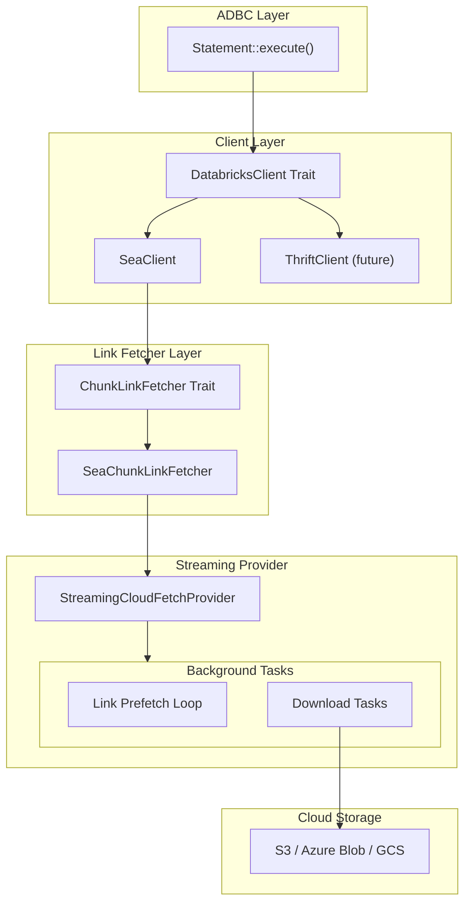
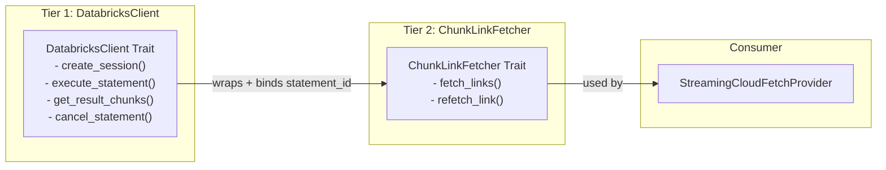
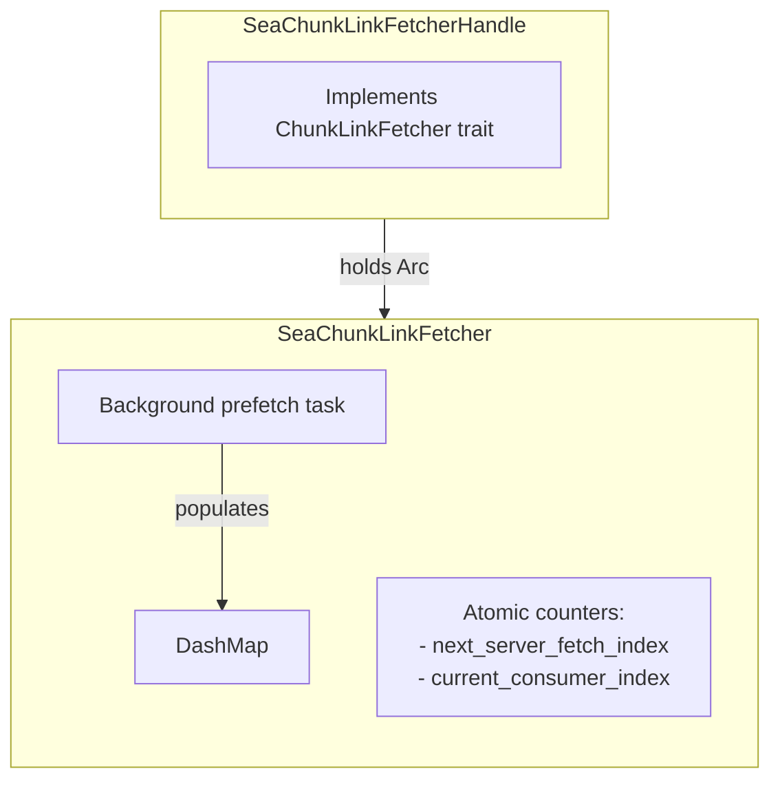
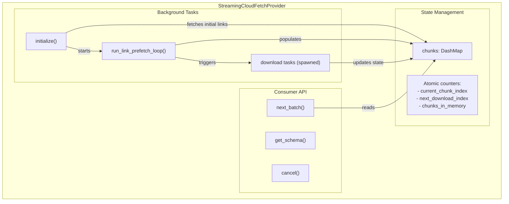
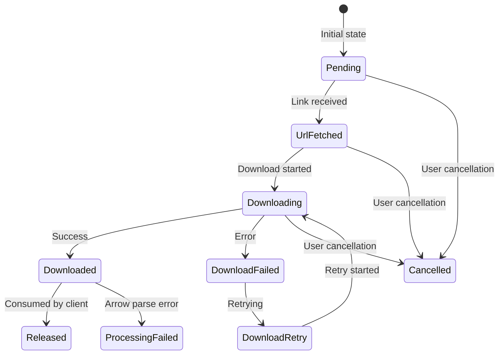
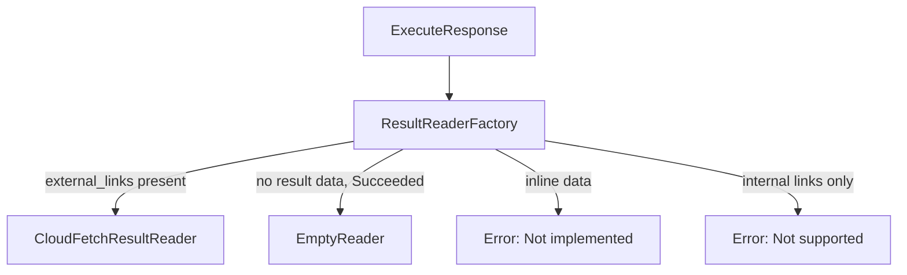
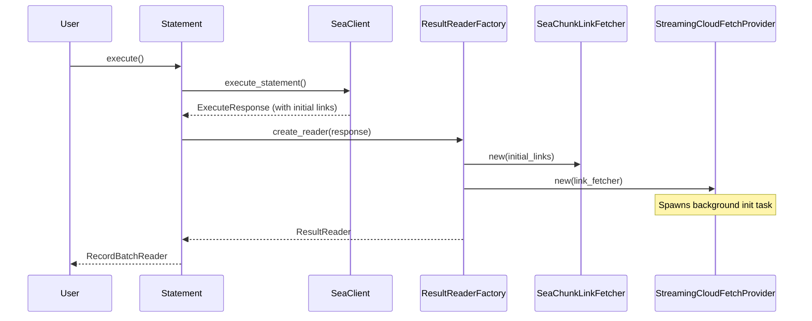
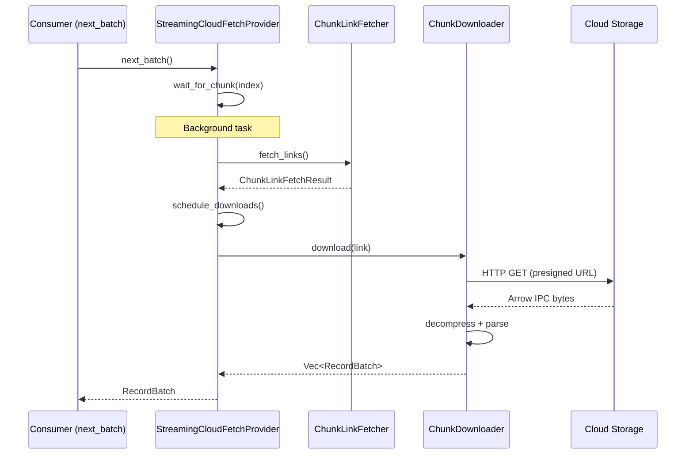

<!--
  Copyright (c) 2025 ADBC Drivers Contributors

  Licensed under the Apache License, Version 2.0 (the "License");
  you may not use this file except in compliance with the License.
  You may obtain a copy of the License at

          http://www.apache.org/licenses/LICENSE-2.0

  Unless required by applicable law or agreed to in writing, software
  distributed under the License is distributed on an "AS IS" BASIS,
  WITHOUT WARRANTIES OR CONDITIONS OF ANY KIND, either express or implied.
  See the License for the specific language governing permissions and
  limitations under the License.
-->

# CloudFetch Architecture for Rust ADBC Driver

## Overview

This document describes the CloudFetch implementation in the Rust ADBC driver using the **streaming approach** for **SEA (Statement Execution API) mode only**. The implementation is based on the reference Databricks JDBC driver's `StreamingChunkProvider` architecture.

CloudFetch enables efficient downloading of Arrow-formatted query results directly from cloud storage (S3, Azure Blob, GCS) instead of through the Databricks server, significantly improving performance for large result sets.

---

## Architecture

### High-Level Flow



### Two-Tier Client Abstraction

Following the Databricks JDBC driver pattern, we use two abstraction layers:



**Why two tiers?**
- `DatabricksClient` is stateless regarding any particular statement
- `ChunkLinkFetcher` is statement-scoped, binding a client to a specific `statement_id`
- Different backends use different continuation mechanisms (SEA uses `chunk_index`, Thrift uses `row_offset`)
- `StreamingCloudFetchProvider` depends only on `ChunkLinkFetcher`, not the full client
- Link caching and prefetching are handled entirely within the fetcher (separation of concerns)

---

## Component Responsibilities

### DatabricksClient Trait

**File:** `src/client/mod.rs`

Abstract interface for Databricks backends. Enables swapping between SEA (REST) and Thrift (future).

| Method | Purpose |
|--------|---------|
| `create_session()` | Create a new session with catalog/schema context |
| `delete_session()` | Close a session |
| `execute_statement()` | Execute SQL within a session |
| `get_statement_status()` | Poll statement status (async execution) |
| `get_result_chunks()` | Fetch chunk links for CloudFetch |
| `cancel_statement()` | Cancel a running statement |
| `close_statement()` | Release server resources |

### SeaClient

**File:** `src/client/sea.rs`

Implements `DatabricksClient` for the Databricks SQL Statement Execution API (REST).

| Endpoint | Purpose |
|----------|---------|
| `POST /api/2.0/sql/sessions` | Create session |
| `DELETE /api/2.0/sql/sessions/{id}` | Delete session |
| `POST /api/2.0/sql/statements` | Execute statement |
| `GET /api/2.0/sql/statements/{id}` | Get status |
| `GET /api/2.0/sql/statements/{id}/result/chunks` | Fetch chunk links |
| `POST /api/2.0/sql/statements/{id}/cancel` | Cancel |
| `DELETE /api/2.0/sql/statements/{id}` | Close |

### ChunkLinkFetcher Trait

**File:** `src/reader/cloudfetch/link_fetcher.rs`

Statement-scoped abstraction for fetching chunk links. Wraps `DatabricksClient` and binds it to a specific statement.

| Method | Purpose |
|--------|---------|
| `fetch_links(chunk_index, row_offset)` | Fetch next batch of links |
| `refetch_link(chunk_index, row_offset)` | Refetch a specific expired link |

### SeaChunkLinkFetcher + Handle

**File:** `src/reader/cloudfetch/link_fetcher.rs`

SEA implementation with caching and proactive prefetching.



**Key behaviors:**
- Caches fetched links in `DashMap` for instant retrieval
- Proactively prefetches links when consumer approaches prefetch boundary
- Uses `total_chunk_count` from manifest to detect end-of-stream
- Handle pattern enables `Arc<Self>` for spawning background tasks

### ChunkDownloader

**File:** `src/reader/cloudfetch/chunk_downloader.rs`

Downloads Arrow data from cloud storage presigned URLs.

**Responsibilities:**
- HTTP GET to presigned URL with custom headers
- LZ4 decompression (if enabled)
- Arrow IPC stream parsing into RecordBatches
- Download speed monitoring and warning logging

### StreamingCloudFetchProvider

**File:** `src/reader/cloudfetch/streaming_provider.rs`

Orchestrates link fetching and chunk downloading. Main component.



**Key behaviors:**
- On creation, spawns background task that fetches initial links and starts prefetch loop
- Memory-bounded: `chunks_in_memory` counter limits concurrent downloads + buffered chunks
- Uses `Notify` signals for coordination (no polling)
- Supports cancellation via `CancellationToken`

### Chunk State Machine



### ResultReaderFactory

**File:** `src/reader/mod.rs`

Factory that creates the appropriate reader based on response type.



**Uses:**
- `ResultReader` trait for abstraction
- `ResultReaderAdapter` to convert to Arrow's `RecordBatchReader`
- `CloudFetchResultReader` wraps `StreamingCloudFetchProvider`
- `EmptyReader` for valid queries returning zero rows

### Arrow Parser

**File:** `src/reader/cloudfetch/arrow_parser.rs`

Parses CloudFetch responses (Arrow IPC streaming format, optionally LZ4 compressed).

**Flow:** Raw bytes → LZ4 decompress (if needed) → Arrow IPC StreamReader → Vec<RecordBatch>

---

## Configuration

### CloudFetchConfig Defaults

| Setting | Default | Description |
|---------|---------|-------------|
| `link_prefetch_window` | 128 | Chunks to prefetch ahead (matches JDBC) |
| `max_chunks_in_memory` | 16 | Max concurrent downloads + buffered (matches JDBC) |
| `max_retries` | 5 | Download retry attempts |
| `retry_delay` | 1.5s | Delay between retries |
| `chunk_ready_timeout` | 30s | Timeout waiting for chunk |
| `speed_threshold_mbps` | 0.1 | Log warning if slower |
| `enabled` | true | CloudFetch enabled |

### ADBC Options

Set via `Database::set_option()`:

| Option Key | Type | Default |
|------------|------|---------|
| `databricks.cloudfetch.enabled` | bool | true |
| `databricks.cloudfetch.link_prefetch_window` | usize | 128 |
| `databricks.cloudfetch.max_chunks_in_memory` | usize | 16 |
| `databricks.cloudfetch.max_retries` | u32 | 5 |
| `databricks.cloudfetch.retry_delay_ms` | u64 | 1500 |
| `databricks.cloudfetch.chunk_ready_timeout_ms` | u64 | 30000 |
| `databricks.cloudfetch.speed_threshold_mbps` | f64 | 0.1 |

---

## Data Flow

### Statement Execution



### Chunk Download Flow



---

## File Structure

```
rust/src/
├── types/
│   ├── mod.rs
│   ├── sea.rs              # SEA API request/response types
│   └── cloudfetch.rs       # CloudFetchConfig, CloudFetchLink, ChunkState, ChunkEntry
├── client/
│   ├── mod.rs              # DatabricksClient trait, SessionInfo, ExecuteResponse
│   ├── http.rs             # DatabricksHttpClient
│   └── sea.rs              # SeaClient
├── reader/
│   ├── mod.rs              # ResultReaderFactory, ResultReader trait, adapters
│   └── cloudfetch/
│       ├── mod.rs
│       ├── arrow_parser.rs     # parse_cloudfetch_response()
│       ├── link_fetcher.rs     # ChunkLinkFetcher trait, SeaChunkLinkFetcher
│       ├── chunk_downloader.rs # ChunkDownloader
│       └── streaming_provider.rs # StreamingCloudFetchProvider
├── statement.rs            # Uses ResultReaderFactory
├── connection.rs           # Creates session, holds clients
└── database.rs             # CloudFetch options, creates clients
```

---

## Key Design Decisions

### 1. Separation of Concerns

- **Link fetching**: `ChunkLinkFetcher` handles all link-related concerns (caching, prefetching, API calls)
- **Downloading**: `ChunkDownloader` handles HTTP, decompression, parsing
- **Orchestration**: `StreamingCloudFetchProvider` coordinates but doesn't know implementation details
- **Reader creation**: `ResultReaderFactory` decides which reader to create

### 2. Async Runtime Strategy

- Use `tokio` runtime internally
- Block on async in ADBC trait methods (ADBC is sync)
- Keep `StreamingCloudFetchProvider` fully async
- Use `runtime_handle.block_on()` for sync-to-async bridging

### 3. Memory Management

- `chunks_in_memory` atomic counter limits memory usage
- Counter controls both downloads in flight AND buffered chunks
- Release chunks immediately after consumption
- No caching - pure streaming model

### 4. Concurrency Control

- `DashMap` for lock-free concurrent chunk access
- Atomic counters for position tracking
- `Notify` signals for coordination (not polling)
- `CancellationToken` for clean shutdown

### 5. Error Handling

- Retry transient failures (network, timeouts)
- Refetch expired links automatically (30s buffer)
- Propagate fatal errors to consumer via `prefetch_error`

### 6. Compression

- Only LZ4_FRAME supported
- Uses `lz4_flex::frame::FrameDecoder`
- Codec determined from `ResultManifest.result_compression`

---

## Known Limitations

1. **Compression**: Only LZ4_FRAME supported. Other codecs will fail.
2. **Internal links**: Not supported (require CloudFetch external links).
3. **Inline results**: Not supported (`data_array` in response).
4. **Thrift backend**: Not yet implemented.

---

## References

- [ADBC Core Rust Documentation](https://docs.rs/adbc_core/)
- [Apache Arrow IPC Format](https://arrow.apache.org/docs/format/Columnar.html#ipc-streaming-format)
- [Databricks SQL Statement Execution API](https://docs.databricks.com/api/workspace/statementexecution)
- Databricks JDBC Driver (internal reference)
