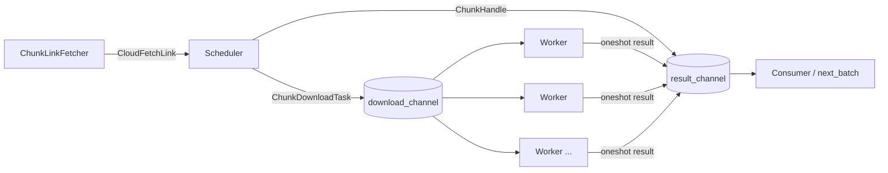
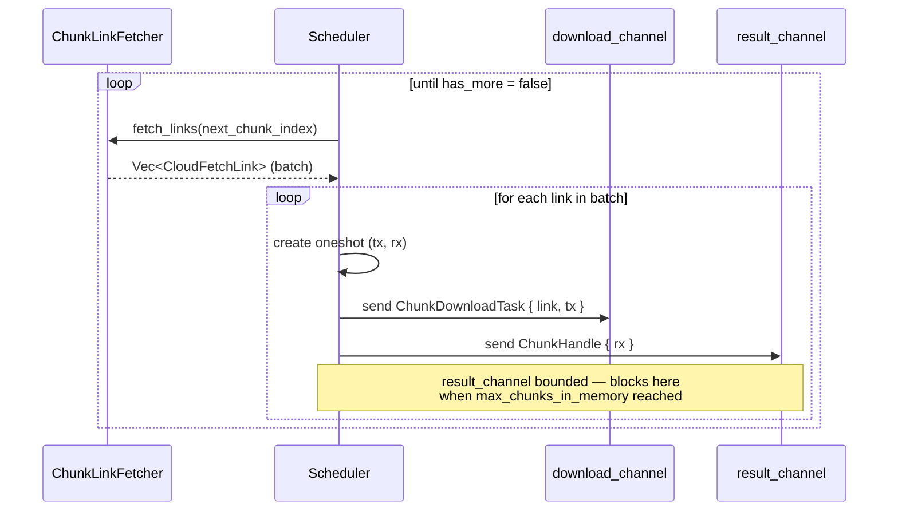
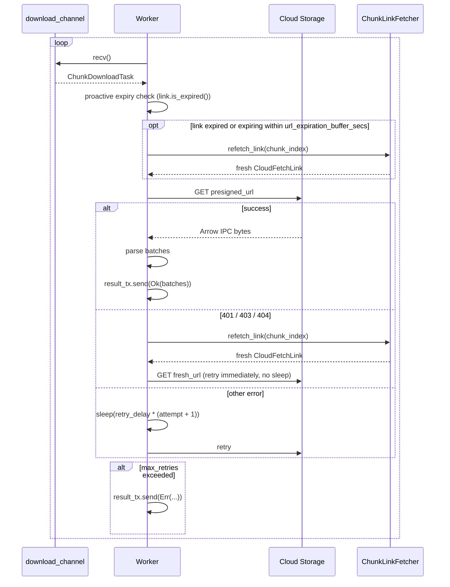
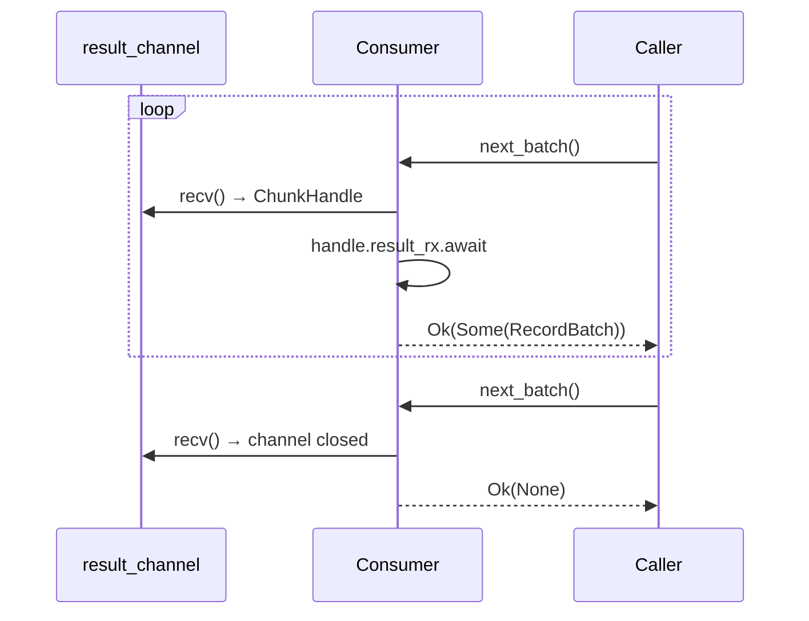

# CloudFetch Pipeline Redesign: DashMap → Channel-Based Pipeline

**Status:** Proposed
**Scope:** `rust/src/reader/cloudfetch/streaming_provider.rs` and supporting types
**Reference implementation:** `csharp/src/Reader/CloudFetch/`

---

## Problem Statement

The current `StreamingCloudFetchProvider` uses a single `DashMap<i64, ChunkEntry>` as the
central coordination point for three unrelated concerns:

| Field on `ChunkEntry` | Role |
|---|---|
| `link: Option<CloudFetchLink>` | Presigned URL storage |
| `state: ChunkState` | Download state machine |
| `batches: Option<Vec<RecordBatch>>` | Result buffering (potentially 100 MB+) |

Combining these into one shared concurrent map creates compounding problems:

1. **Lock discipline burden.** DashMap shard locks must not be held across `.await` points or
   the task deadlocks itself. Every read-then-write sequence requires an explicit drop-guard
   pattern and careful review.

2. **Unnatural indirection for URL refresh.** When a 401/403/404 occurs, the code cannot call
   `refetch_link().await` while holding `get_mut()`. The workaround requires a two-`get_mut`
   dance with explicit scope comments explaining why.

3. **Large data in a concurrent map.** `ChunkEntry` derives `Clone` but holds
   `Option<Vec<RecordBatch>>`. An accidental clone copies hundreds of megabytes. The map was
   designed for fast keyed lookup, not result storage.

4. **Poll-based consumer synchronisation.** `wait_for_chunk` loops on a `Notify`, checking
   state on every wakeup. This is a workaround for the absence of a direct completion signal
   from download task to consumer.

The C# driver avoids all of these by giving each chunk its own self-contained object that flows
through two channels. This document proposes the same structure for Rust.

---

## Proposed Design

### Pipeline Overview



**Two channels replace the DashMap:**

- **`download_channel`** — scheduler pushes `ChunkDownloadTask` items; download workers pull
  from it. Unbounded (backpressure is applied via `result_channel`).
- **`result_channel`** — scheduler pushes `ChunkHandle` items *in chunk-index order*, bounded
  to `max_chunks_in_memory`. The consumer reads from it in order and awaits each handle.

Items are enqueued to `result_channel` by the scheduler before the download starts, preserving
sequential ordering even when downloads complete out of order. This matches the C# pattern in
`CloudFetchDownloader.cs` (result enqueued before download task is awaited).

---

## Key Types

### `ChunkDownloadTask`

Sent through `download_channel`. Owned entirely by the download worker — no shared state.

```rust
struct ChunkDownloadTask {
    chunk_index: i64,
    link: CloudFetchLink,
    result_tx: oneshot::Sender<Result<Vec<RecordBatch>>>,
}
```

### `ChunkHandle`

Sent through `result_channel` in scheduler (chunk-index) order. The consumer awaits the
embedded receiver to get the downloaded batches.

```rust
struct ChunkHandle {
    chunk_index: i64,
    result_rx: oneshot::Receiver<Result<Vec<RecordBatch>>>,
}
```

Mirrors C#'s `IDownloadResult` with its `DownloadCompletedTask` (`TaskCompletionSource`).

---

## Component Responsibilities

### Scheduler (replaces `schedule_downloads`)



- `fetch_links()` returns a **batch** of `CloudFetchLink` values (`Vec<CloudFetchLink>`), not a
  single link. The scheduler iterates the batch and creates one oneshot pair per link.
- `SeaChunkLinkFetcher` caches and prefetches links internally; the scheduler simply consumes
  what `fetch_links()` returns, advancing `next_chunk_index` after each batch.
- Creates a `oneshot` channel pair per chunk.
- Sends `ChunkDownloadTask` to `download_channel` and `ChunkHandle` to `result_channel`.
- The bounded `result_channel` provides backpressure automatically — no manual
  `chunks_in_memory` counter or `AtomicUsize` needed.

### Download Worker (replaces `download_chunk_with_retry`)

Each worker is a long-lived `tokio::spawn` task that loops over `download_channel`.



The worker owns `ChunkDownloadTask` outright. URL refresh mutates a local `link` variable —
no map lookup, no lock, no guard. Mirrors C#'s `DownloadFileAsync` directly.

**Proactive expiry check** (C# parity — `IsExpiredOrExpiringSoon`): before the first HTTP
request for each chunk, the worker checks `link.is_expired()` using the
`url_expiration_buffer_secs` buffer. If the link is already expired or will expire within that
window, it is refetched immediately before the download attempt begins. This avoids a
guaranteed 401/403 failure that would otherwise cost one retry.

**Retry sleep** matches C#'s `Task.Delay(_retryDelayMs * (retry + 1))`: linear backoff
(`retry_delay * (attempt + 1)`), not constant and not exponential.

**Retry contract:**

| Error type | Sleep before retry | Counts against `max_retries` | Counts against `max_refresh_retries` |
|---|---|---|---|
| Network / 5xx | Yes — `retry_delay * (attempt + 1)` | Yes | No |
| 401 / 403 / 404 | No | Yes | Yes |
| Link proactively expired | No | No | Yes |

### Consumer (replaces `wait_for_chunk` + `next_batch`)



`wait_for_chunk` and its `Notify`-based polling loop are replaced by a single `.await` on
the `oneshot::Receiver`. No state check, no timeout loop, no `chunk_state_changed` signal.

---

## Struct Changes

### `StreamingCloudFetchProvider` (after)

```rust
pub struct StreamingCloudFetchProvider {
    // Pipeline output — consumer reads ChunkHandles in order
    result_rx: Mutex<mpsc::Receiver<ChunkHandle>>,

    // Schema (extracted from first batch)
    schema: OnceLock<SchemaRef>,

    // Batch buffer (drains current ChunkHandle before advancing)
    batch_buffer: Mutex<VecDeque<RecordBatch>>,

    // Cancellation
    cancel_token: CancellationToken,
}
```

**Removed entirely:**

| Field | Replaced by |
|---|---|
| `chunks: Arc<DashMap<i64, ChunkEntry>>` | `download_channel` + `result_channel` |
| `chunks_in_memory: AtomicUsize` | Bounded `result_channel` capacity |
| `max_chunks_in_memory: usize` | `mpsc::channel(max_chunks_in_memory)` bound |
| `chunk_state_changed: Arc<Notify>` | `oneshot` receivers per chunk |
| `next_download_index: AtomicI64` | Sequential counter owned by scheduler task |
| `current_chunk_index: AtomicI64` | Implicit in sequential `result_rx.recv()` calls |
| `end_of_stream: AtomicBool` | Implicit when `result_rx` returns `None` |

### `ChunkEntry` / `ChunkState` (types.rs)

Both types are no longer needed and can be deleted. The equivalent state lives on
`ChunkDownloadTask` (pre-download) and `ChunkHandle` (post-download).

---

## Concurrency Model

| Component | Concurrency primitive | Reason |
|---|---|---|
| Scheduler | Single `tokio::spawn` task | Sequential chunk ordering required |
| Download workers | N `tokio::spawn` tasks sharing `download_channel` | Parallel downloads |
| Consumer | Caller's task (no spawn) | Sequential result consumption |
| `result_channel` | Bounded `mpsc` (capacity = `max_chunks_in_memory`) | Backpressure without manual counter |
| URL refresh in worker | Local variable mutation | No shared state — no lock needed |

**Thread safety:** No shared mutable state between components. Each `ChunkDownloadTask` is
owned by exactly one worker at a time. Each `ChunkHandle` is owned by the consumer.

---

## Error Handling

| Scenario | Behaviour |
|---|---|
| Download fails after `max_retries` | `result_tx.send(Err(...))` — consumer gets error on `result_rx.await` |
| URL refresh fails after `max_refresh_retries` | Same as above |
| `refetch_link()` itself returns error | Propagated via `result_tx.send(Err(...))` |
| Cancellation during sleep | `tokio::select\!` on `cancel_token.cancelled()` interrupts sleep |
| Cancellation during `result_rx.await` | Consumer selects on `cancel_token.cancelled()` |
| Scheduler exits (all chunks sent) | `download_channel` sender drops → workers drain then exit |
| All workers exit | `oneshot` senders drop → `result_rx.await` returns `Err(RecvError)` |

---

## Configuration

Three fields are **added** to `CloudFetchConfig` (matching C# `CloudFetchConfiguration`), one
field is **removed**, and two defaults are **corrected** to match C#.

### Fields Added

| Field | Type | Default | C# equivalent | Purpose |
|---|---|---|---|---|
| `max_refresh_retries` | `u32` | `3` | `MaxUrlRefreshAttempts = 3` | Max URL refresh attempts before terminal error |
| `num_download_workers` | `usize` | `3` | `ParallelDownloads = 3` | Number of parallel download worker tasks |
| `url_expiration_buffer_secs` | `u32` | `60` | `UrlExpirationBufferSeconds = 60` | Seconds before expiry to trigger proactive refresh |

> `LINK_EXPIRY_BUFFER_SECS` (currently hardcoded to `30`) is replaced by the configurable
> `url_expiration_buffer_secs` (default `60`, matching C#).

### Field Removed

| Field | Reason |
|---|---|
| `chunk_ready_timeout` | Served only the `wait_for_chunk` Notify poll loop, which is deleted. The oneshot-based consumer resolves immediately on success, error, or sender drop — no timeout guard is needed. C# has no equivalent "wait for chunk" timeout for the same reason: `TaskCompletionSource` always completes. |

### Fields Unchanged

| Field | Old use | New use | Default change? |
|---|---|---|---|
| `max_chunks_in_memory` | Manual `AtomicUsize` counter | `mpsc::channel(max_chunks_in_memory)` capacity bound | No |
| `max_retries` | Per-download retry limit | Unchanged | **Yes: 5 → 3** (align with C# `MaxRetries = 3`) |
| `retry_delay` | Constant sleep | Linear backoff: `retry_delay * (attempt + 1)` — matches C# `RetryDelayMs * (retry + 1)` | **Yes: 1500ms → 500ms** (align with C# `RetryDelayMs = 500`) |
| `link_prefetch_window` | Background prefetch ahead of consumer | Unchanged — owned by `SeaChunkLinkFetcher` | No |
| `speed_threshold_mbps` | Download speed warning | Unchanged | No |
| `enabled` | CloudFetch enable flag | Unchanged | No |

---

## Alternatives Considered

### Keep DashMap, fix lock discipline incrementally

Viable short-term (demonstrated by the current PR patches). Does not address Arrow data living
in a concurrent map, and the lock discipline comments must be maintained indefinitely.

### Keep DashMap, add `Arc<OnceLock<...>>` per entry for result delivery

Would replace `Notify`-based polling with a future-based signal but still stores Arrow data in
the map and retains the URL/lock complexity.

### Use `tokio::sync::RwLock<HashMap>` instead of `DashMap`

Trades shard-level locking for a single lock. Simpler discipline but higher contention; does not
address the root issue of co-locating three concerns in one structure.

---

## Test Strategy

### Unit Tests

- `scheduler_sends_handles_in_chunk_index_order` — verify `result_channel` receives handles in sequence
- `scheduler_processes_batch_links` — `fetch_links()` returns 3 links; verify all 3 tasks enqueued in order
- `worker_retries_on_transient_error` — mock downloader fails N times then succeeds
- `worker_uses_linear_backoff` — verify sleep duration is `retry_delay * (attempt + 1)`, not constant
- `worker_refetches_url_on_401_403_404` — mock downloader returns auth error; verify `refetch_link` called inline
- `worker_no_sleep_on_auth_error` — verify auth error does not sleep before refetch
- `worker_gives_up_after_max_refresh_retries` — verify terminal error propagated via `result_tx`
- `worker_proactively_refreshes_expiring_url` — link expires within `url_expiration_buffer_secs`; verify `refetch_link` called before first HTTP request
- `backpressure_blocks_scheduler_at_capacity` — full `result_channel` blocks scheduler, not consumer

### Integration Tests

- `end_to_end_sequential_consumption` — all chunks downloaded and read in order
- `end_to_end_cancellation_mid_stream` — cancel during active download, no deadlock or panic
- `end_to_end_401_recovery` — presigned URL expires mid-stream, driver refetches and continues
