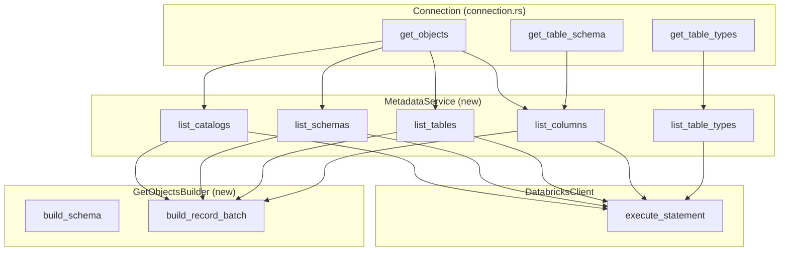
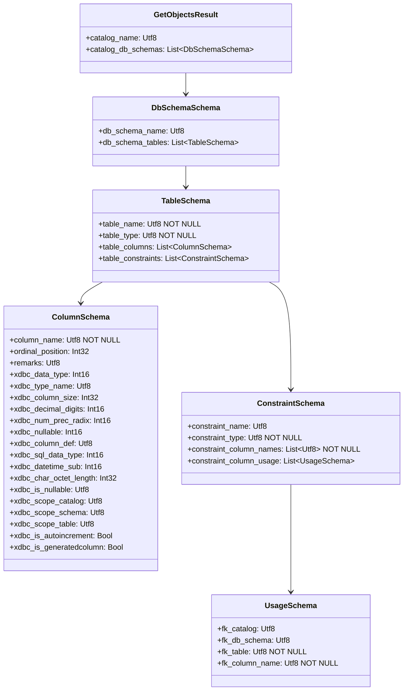
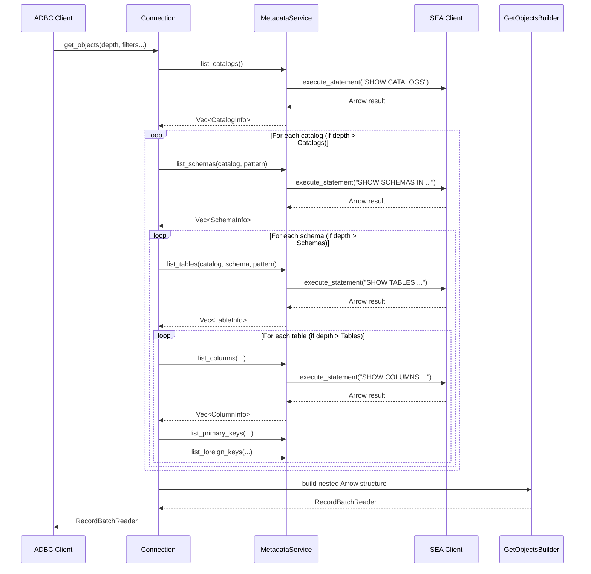
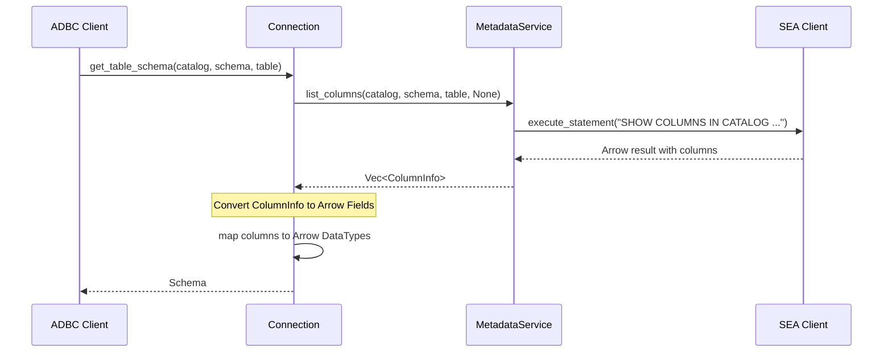

# Connection Interface Metadata Implementation Design

## Overview

This design document outlines the implementation plan for the missing ADBC Connection interface methods in the Databricks Rust ADBC driver. The implementation follows the patterns established in the `databricks-jdbc` SEA (Statement Execution API) implementation.

## Scope

The following Connection interface methods need implementation:

| Method | Priority | Description |
|--------|----------|-------------|
| `get_objects()` | High | Return catalog/schema/table/column metadata |
| `get_table_schema()` | High | Return Arrow schema for a specific table |
| `get_table_types()` | Medium | Return supported table types |
| `read_partition()` | Low | Read a specific partition (for partitioned execution) |
| `get_statistics()` | Low | Return table statistics |
| `get_statistic_names()` | Low | Return available statistic names |

**Out of Scope:**
- `rollback()` - Databricks SQL is auto-commit only (intentional limitation)
- `commit()` - Already implemented (returns Ok)

---

## Architecture

### High-Level Design

The implementation uses SQL-based metadata queries executed via the existing SEA client, following the same pattern as the `databricks-jdbc` driver.



---

## Detailed Design

### 1. SQL Commands for Metadata

Based on the `databricks-jdbc` implementation (`CommandConstants.java`), the following SQL commands will be used:

| Operation | SQL Command | Filters |
|-----------|-------------|---------|
| List Catalogs | `SHOW CATALOGS` | None |
| List Schemas | `SHOW SCHEMAS IN \`{catalog}\`` | `LIKE '{pattern}'` |
| List Schemas (all) | `SHOW SCHEMAS IN ALL CATALOGS` | `LIKE '{pattern}'` |
| List Tables | `SHOW TABLES IN CATALOG \`{catalog}\`` | `SCHEMA LIKE`, `LIKE` |
| List Tables (all) | `SHOW TABLES IN ALL CATALOGS` | `SCHEMA LIKE`, `LIKE` |
| List Columns | `SHOW COLUMNS IN CATALOG \`{catalog}\`` | `SCHEMA LIKE`, `TABLE LIKE`, `LIKE` |
| List Primary Keys | `SHOW KEYS IN CATALOG \`{catalog}\` IN SCHEMA \`{schema}\` IN TABLE \`{table}\`` | None |
| List Foreign Keys | `SHOW FOREIGN KEYS IN CATALOG \`{catalog}\` IN SCHEMA \`{schema}\` IN TABLE \`{table}\`` | None |

### 2. New Module Structure

```
rust/src/
├── connection.rs        # Updated with metadata implementations
├── metadata/            # NEW module
│   ├── mod.rs          # Module exports
│   ├── service.rs      # MetadataService - executes metadata SQL
│   ├── builder.rs      # GetObjectsBuilder - builds Arrow results
│   ├── schemas.rs      # Arrow schema definitions for ADBC results
│   └── sql.rs          # SQL command building (like CommandBuilder.java)
```

### 3. MetadataService Interface

```rust
/// Service for executing metadata queries via SEA.
pub struct MetadataService {
    client: Arc<dyn DatabricksClient>,
    session_id: String,
    runtime: tokio::runtime::Handle,
}

impl MetadataService {
    /// List all catalogs.
    pub fn list_catalogs(&self) -> Result<Vec<CatalogInfo>>;

    /// List schemas, optionally filtered by catalog and pattern.
    pub fn list_schemas(
        &self,
        catalog: Option<&str>,
        schema_pattern: Option<&str>,
    ) -> Result<Vec<SchemaInfo>>;

    /// List tables, optionally filtered.
    pub fn list_tables(
        &self,
        catalog: Option<&str>,
        schema_pattern: Option<&str>,
        table_pattern: Option<&str>,
        table_types: Option<&[&str]>,
    ) -> Result<Vec<TableInfo>>;

    /// List columns, optionally filtered.
    pub fn list_columns(
        &self,
        catalog: Option<&str>,
        schema_pattern: Option<&str>,
        table_pattern: Option<&str>,
        column_pattern: Option<&str>,
    ) -> Result<Vec<ColumnInfo>>;

    /// List table types (static).
    pub fn list_table_types(&self) -> Vec<String>;

    /// List primary keys for a table.
    pub fn list_primary_keys(
        &self,
        catalog: &str,
        schema: &str,
        table: &str,
    ) -> Result<Vec<PrimaryKeyInfo>>;

    /// List foreign keys for a table.
    pub fn list_foreign_keys(
        &self,
        catalog: &str,
        schema: &str,
        table: &str,
    ) -> Result<Vec<ForeignKeyInfo>>;
}
```

### 4. Data Structures

```rust
/// Catalog information from SHOW CATALOGS.
#[derive(Debug, Clone)]
pub struct CatalogInfo {
    pub catalog_name: String,
}

/// Schema information from SHOW SCHEMAS.
#[derive(Debug, Clone)]
pub struct SchemaInfo {
    pub catalog_name: String,
    pub schema_name: String,
}

/// Table information from SHOW TABLES.
#[derive(Debug, Clone)]
pub struct TableInfo {
    pub catalog_name: String,
    pub schema_name: String,
    pub table_name: String,
    pub table_type: String,
    pub remarks: Option<String>,
}

/// Column information from SHOW COLUMNS.
#[derive(Debug, Clone)]
pub struct ColumnInfo {
    pub catalog_name: String,
    pub schema_name: String,
    pub table_name: String,
    pub column_name: String,
    pub ordinal_position: i32,
    pub data_type: String,
    pub type_name: String,
    pub column_size: Option<i32>,
    pub decimal_digits: Option<i16>,
    pub num_prec_radix: Option<i16>,
    pub nullable: i16,          // 0=no nulls, 1=nullable, 2=unknown
    pub remarks: Option<String>,
    pub column_def: Option<String>,
    pub is_nullable: String,    // "YES", "NO", ""
    pub is_autoincrement: Option<bool>,
    pub is_generatedcolumn: Option<bool>,
}

/// Primary key information.
#[derive(Debug, Clone)]
pub struct PrimaryKeyInfo {
    pub catalog_name: String,
    pub schema_name: String,
    pub table_name: String,
    pub column_name: String,
    pub key_seq: i16,
    pub pk_name: Option<String>,
}

/// Foreign key information.
#[derive(Debug, Clone)]
pub struct ForeignKeyInfo {
    pub pk_catalog: String,
    pub pk_schema: String,
    pub pk_table: String,
    pub pk_column: String,
    pub fk_catalog: String,
    pub fk_schema: String,
    pub fk_table: String,
    pub fk_column: String,
    pub key_seq: i16,
    pub fk_name: Option<String>,
    pub pk_name: Option<String>,
}
```

### 5. get_objects Implementation

The `get_objects` method must return a nested Arrow structure as defined by the ADBC spec.



**Implementation Strategy:**

```rust
impl Connection {
    fn get_objects(
        &self,
        depth: ObjectDepth,
        catalog: Option<&str>,
        db_schema: Option<&str>,
        table_name: Option<&str>,
        table_type: Option<Vec<&str>>,
        column_name: Option<&str>,
    ) -> Result<impl RecordBatchReader + Send> {
        let metadata_service = MetadataService::new(
            self.client.clone(),
            self.session_id.clone(),
            self.runtime.handle().clone(),
        );

        // Step 1: Get catalogs
        let catalogs = metadata_service.list_catalogs()?;
        let catalogs = filter_by_pattern(catalogs, catalog);

        // Step 2: Based on depth, fetch additional metadata
        let mut builder = GetObjectsBuilder::new();

        for cat in catalogs {
            builder.add_catalog(&cat.catalog_name);

            if matches!(depth, ObjectDepth::Catalogs) {
                continue;
            }

            // Get schemas for this catalog
            let schemas = metadata_service.list_schemas(
                Some(&cat.catalog_name),
                db_schema,
            )?;

            for schema in schemas {
                builder.add_schema(&cat.catalog_name, &schema.schema_name);

                if matches!(depth, ObjectDepth::Schemas) {
                    continue;
                }

                // Get tables
                let tables = metadata_service.list_tables(
                    Some(&cat.catalog_name),
                    Some(&schema.schema_name),
                    table_name,
                    table_type.as_deref(),
                )?;

                for table in tables {
                    builder.add_table(
                        &cat.catalog_name,
                        &schema.schema_name,
                        &table,
                    );

                    if matches!(depth, ObjectDepth::Tables) {
                        continue;
                    }

                    // Get columns
                    let columns = metadata_service.list_columns(
                        Some(&cat.catalog_name),
                        Some(&schema.schema_name),
                        Some(&table.table_name),
                        column_name,
                    )?;

                    for col in columns {
                        builder.add_column(
                            &cat.catalog_name,
                            &schema.schema_name,
                            &table.table_name,
                            &col,
                        );
                    }

                    // Get constraints (primary keys, foreign keys)
                    let pks = metadata_service.list_primary_keys(
                        &cat.catalog_name,
                        &schema.schema_name,
                        &table.table_name,
                    ).unwrap_or_default();

                    let fks = metadata_service.list_foreign_keys(
                        &cat.catalog_name,
                        &schema.schema_name,
                        &table.table_name,
                    ).unwrap_or_default();

                    builder.add_constraints(
                        &cat.catalog_name,
                        &schema.schema_name,
                        &table.table_name,
                        &pks,
                        &fks,
                    );
                }
            }
        }

        Ok(builder.build())
    }
}
```

### 6. get_table_schema Implementation

```rust
impl Connection {
    fn get_table_schema(
        &self,
        catalog: Option<&str>,
        db_schema: Option<&str>,
        table_name: &str,
    ) -> Result<Schema> {
        let metadata_service = MetadataService::new(
            self.client.clone(),
            self.session_id.clone(),
            self.runtime.handle().clone(),
        );

        // Get columns for the specific table
        let columns = metadata_service.list_columns(
            catalog,
            db_schema,
            Some(table_name),
            None, // all columns
        )?;

        if columns.is_empty() {
            return Err(DatabricksErrorHelper::not_found()
                .message(format!("Table not found: {}", table_name))
                .to_adbc());
        }

        // Convert to Arrow schema
        let fields: Vec<Field> = columns
            .iter()
            .map(|col| {
                let arrow_type = databricks_type_to_arrow(&col.type_name);
                let nullable = col.nullable != 0;
                Field::new(&col.column_name, arrow_type, nullable)
            })
            .collect();

        Ok(Schema::new(fields))
    }
}
```

### 7. get_table_types Implementation

The table types are static values based on what Databricks supports:

```rust
impl Connection {
    fn get_table_types(&self) -> Result<impl RecordBatchReader + Send> {
        // Static list of table types supported by Databricks
        // From databricks-jdbc MetadataResultConstants.java
        let table_types = vec![
            "SYSTEM TABLE",
            "TABLE",
            "VIEW",
            "METRIC_VIEW",
        ];

        let schema = Arc::new(Schema::new(vec![
            Field::new("table_type", DataType::Utf8, false),
        ]));

        let array = StringArray::from(table_types);
        let batch = RecordBatch::try_new(
            schema.clone(),
            vec![Arc::new(array)],
        )?;

        Ok(RecordBatchIterator::new(
            vec![Ok(batch)].into_iter(),
            schema,
        ))
    }
}
```

### 8. SQL Command Builder

```rust
/// Builds SQL commands for metadata queries.
pub struct SqlCommandBuilder {
    catalog: Option<String>,
    schema_pattern: Option<String>,
    table_pattern: Option<String>,
    column_pattern: Option<String>,
}

impl SqlCommandBuilder {
    pub fn new() -> Self {
        Self {
            catalog: None,
            schema_pattern: None,
            table_pattern: None,
            column_pattern: None,
        }
    }

    pub fn with_catalog(mut self, catalog: Option<&str>) -> Self {
        self.catalog = catalog.map(|s| s.to_string());
        self
    }

    pub fn with_schema_pattern(mut self, pattern: Option<&str>) -> Self {
        self.schema_pattern = pattern.map(|p| Self::jdbc_to_sql_pattern(p));
        self
    }

    pub fn with_table_pattern(mut self, pattern: Option<&str>) -> Self {
        self.table_pattern = pattern.map(|p| Self::jdbc_to_sql_pattern(p));
        self
    }

    pub fn with_column_pattern(mut self, pattern: Option<&str>) -> Self {
        self.column_pattern = pattern.map(|p| Self::jdbc_to_sql_pattern(p));
        self
    }

    /// Convert JDBC/ADBC pattern (% and _) to SQL LIKE pattern.
    fn jdbc_to_sql_pattern(pattern: &str) -> String {
        // JDBC uses % for multi-char wildcard, _ for single char
        // SQL LIKE uses the same, but we need to escape backticks
        pattern.replace('`', "``")
    }

    /// Escape identifier for use in SQL (backtick-quote).
    fn escape_identifier(name: &str) -> String {
        format!("`{}`", name.replace('`', "``"))
    }

    pub fn build_show_catalogs(&self) -> String {
        "SHOW CATALOGS".to_string()
    }

    pub fn build_show_schemas(&self) -> String {
        let mut sql = match &self.catalog {
            Some(cat) if !cat.is_empty() && cat != "%" => {
                format!("SHOW SCHEMAS IN {}", Self::escape_identifier(cat))
            }
            _ => "SHOW SCHEMAS IN ALL CATALOGS".to_string(),
        };

        if let Some(ref pattern) = self.schema_pattern {
            sql.push_str(&format!(" LIKE '{}'", pattern));
        }

        sql
    }

    pub fn build_show_tables(&self) -> String {
        let mut sql = match &self.catalog {
            Some(cat) if !cat.is_empty() && cat != "%" => {
                format!("SHOW TABLES IN CATALOG {}", Self::escape_identifier(cat))
            }
            _ => "SHOW TABLES IN ALL CATALOGS".to_string(),
        };

        if let Some(ref pattern) = self.schema_pattern {
            sql.push_str(&format!(" SCHEMA LIKE '{}'", pattern));
        }

        if let Some(ref pattern) = self.table_pattern {
            sql.push_str(&format!(" LIKE '{}'", pattern));
        }

        sql
    }

    pub fn build_show_columns(&self) -> Result<String> {
        let catalog = self.catalog.as_ref()
            .ok_or_else(|| DatabricksErrorHelper::invalid_argument()
                .message("Catalog is required for SHOW COLUMNS"))?;

        let mut sql = format!(
            "SHOW COLUMNS IN CATALOG {}",
            Self::escape_identifier(catalog)
        );

        if let Some(ref pattern) = self.schema_pattern {
            sql.push_str(&format!(" SCHEMA LIKE '{}'", pattern));
        }

        if let Some(ref pattern) = self.table_pattern {
            sql.push_str(&format!(" TABLE LIKE '{}'", pattern));
        }

        if let Some(ref pattern) = self.column_pattern {
            sql.push_str(&format!(" LIKE '{}'", pattern));
        }

        Ok(sql)
    }

    pub fn build_show_primary_keys(
        catalog: &str,
        schema: &str,
        table: &str,
    ) -> String {
        format!(
            "SHOW KEYS IN CATALOG {} IN SCHEMA {} IN TABLE {}",
            Self::escape_identifier(catalog),
            Self::escape_identifier(schema),
            Self::escape_identifier(table)
        )
    }

    pub fn build_show_foreign_keys(
        catalog: &str,
        schema: &str,
        table: &str,
    ) -> String {
        format!(
            "SHOW FOREIGN KEYS IN CATALOG {} IN SCHEMA {} IN TABLE {}",
            Self::escape_identifier(catalog),
            Self::escape_identifier(schema),
            Self::escape_identifier(table)
        )
    }
}
```

### 9. Type Mapping

Databricks types need to be mapped to Arrow types and XDBC type codes:

```rust
/// Map Databricks SQL type name to Arrow DataType.
pub fn databricks_type_to_arrow(type_name: &str) -> DataType {
    let type_upper = type_name.to_uppercase();
    let base_type = type_upper.split('(').next().unwrap_or(&type_upper).trim();

    match base_type {
        "BOOLEAN" | "BOOL" => DataType::Boolean,
        "TINYINT" | "BYTE" => DataType::Int8,
        "SMALLINT" | "SHORT" => DataType::Int16,
        "INT" | "INTEGER" => DataType::Int32,
        "BIGINT" | "LONG" => DataType::Int64,
        "FLOAT" | "REAL" => DataType::Float32,
        "DOUBLE" => DataType::Float64,
        "DECIMAL" | "DEC" | "NUMERIC" => {
            // Parse precision and scale from DECIMAL(p,s)
            let (precision, scale) = parse_decimal_params(type_name);
            DataType::Decimal128(precision, scale)
        }
        "STRING" | "VARCHAR" | "CHAR" | "TEXT" => DataType::Utf8,
        "BINARY" | "VARBINARY" => DataType::Binary,
        "DATE" => DataType::Date32,
        "TIMESTAMP" | "TIMESTAMP_NTZ" => DataType::Timestamp(TimeUnit::Microsecond, None),
        "TIMESTAMP_LTZ" => DataType::Timestamp(TimeUnit::Microsecond, Some("UTC".into())),
        "INTERVAL" => DataType::Interval(IntervalUnit::DayTime),
        "ARRAY" => DataType::Utf8, // Represented as JSON string
        "MAP" => DataType::Utf8,   // Represented as JSON string
        "STRUCT" => DataType::Utf8, // Represented as JSON string
        "VOID" | "NULL" => DataType::Null,
        _ => DataType::Utf8, // Default fallback
    }
}

/// Map Databricks type to XDBC/JDBC type code.
pub fn databricks_type_to_xdbc(type_name: &str) -> i16 {
    let type_upper = type_name.to_uppercase();
    let base_type = type_upper.split('(').next().unwrap_or(&type_upper).trim();

    match base_type {
        "BOOLEAN" | "BOOL" => -7,      // JDBC BIT
        "TINYINT" | "BYTE" => -6,      // JDBC TINYINT
        "SMALLINT" | "SHORT" => 5,     // JDBC SMALLINT
        "INT" | "INTEGER" => 4,        // JDBC INTEGER
        "BIGINT" | "LONG" => -5,       // JDBC BIGINT
        "FLOAT" | "REAL" => 6,         // JDBC FLOAT
        "DOUBLE" => 8,                  // JDBC DOUBLE
        "DECIMAL" | "DEC" | "NUMERIC" => 3, // JDBC DECIMAL
        "STRING" | "TEXT" => -1,       // JDBC LONGVARCHAR
        "VARCHAR" => 12,               // JDBC VARCHAR
        "CHAR" => 1,                   // JDBC CHAR
        "BINARY" | "VARBINARY" => -3,  // JDBC VARBINARY
        "DATE" => 91,                  // JDBC DATE
        "TIMESTAMP" | "TIMESTAMP_NTZ" | "TIMESTAMP_LTZ" => 93, // JDBC TIMESTAMP
        "ARRAY" => 2003,               // JDBC ARRAY
        "MAP" => 2000,                 // JDBC JAVA_OBJECT
        "STRUCT" => 2002,              // JDBC STRUCT
        _ => 12,                       // Default to VARCHAR
    }
}
```

---

## Sequence Diagrams

### get_objects Flow



### get_table_schema Flow



---

## Error Handling

| Scenario | Error Code | Message |
|----------|------------|---------|
| Table not found | `NOT_FOUND` | "Table not found: {name}" |
| Catalog required but not provided | `INVALID_ARGUMENT` | "Catalog is required for SHOW COLUMNS" |
| Permission denied | `UNAUTHORIZED` | Propagate server error |
| Query execution failed | `INTERNAL` | "Failed to execute metadata query: {details}" |
| Invalid pattern | `INVALID_ARGUMENT` | "Invalid search pattern: {pattern}" |

---

## Configuration Options

No new configuration options are required. The implementation uses the existing:
- `DatabricksClient` for query execution
- Session ID for context
- Existing timeout and retry settings

---

## Test Strategy

### Unit Tests

- `test_sql_command_builder_show_catalogs`
- `test_sql_command_builder_show_schemas_with_catalog`
- `test_sql_command_builder_show_schemas_all_catalogs`
- `test_sql_command_builder_show_tables_with_patterns`
- `test_sql_command_builder_show_columns`
- `test_sql_command_builder_escape_identifiers`
- `test_type_mapping_databricks_to_arrow`
- `test_type_mapping_databricks_to_xdbc`
- `test_get_objects_builder_catalogs_only`
- `test_get_objects_builder_full_depth`

### Integration Tests

- `test_get_objects_catalogs_depth`
- `test_get_objects_schemas_depth`
- `test_get_objects_tables_depth`
- `test_get_objects_columns_depth`
- `test_get_objects_with_catalog_filter`
- `test_get_objects_with_schema_pattern`
- `test_get_objects_with_table_type_filter`
- `test_get_table_schema_existing_table`
- `test_get_table_schema_nonexistent_table`
- `test_get_table_types`

---

## Implementation Plan

### Phase 1: Foundation (High Priority) ✅ COMPLETED

1. ✅ Create `metadata/` module structure
2. ✅ Implement `SqlCommandBuilder`
3. ✅ Implement `MetadataService` with basic query execution
4. ✅ Add data structures for metadata results

### Phase 2: get_table_types (Medium Priority) ✅ COMPLETED

1. ✅ Implement static `get_table_types()` method
2. ✅ Add unit tests

### Phase 3: get_table_schema (High Priority) ✅ COMPLETED

1. ✅ Implement `list_columns()` in MetadataService
2. ✅ Implement type mapping functions
3. ✅ Implement `get_table_schema()` in Connection
4. ✅ Add unit and integration tests

### Phase 4: get_objects (High Priority) ✅ COMPLETED

1. ✅ Implement `GetObjectsBuilder` for nested Arrow construction
2. ✅ Implement `list_catalogs()`, `list_schemas()`, `list_tables()`
3. ✅ Implement `list_primary_keys()`, `list_foreign_keys()`
4. ✅ Implement `get_objects()` with depth handling
5. ✅ Add unit and integration tests

### Phase 5: Statistics (Low Priority)

1. Implement `get_statistic_names()` (return empty or driver-specific stats)
2. Implement `get_statistics()` (if Databricks provides table statistics)

### Phase 6: read_partition (Low Priority)

1. Design partition serialization format
2. Implement `read_partition()` for CloudFetch links

#### Partition Descriptor Design (Implemented)

The partition descriptor uses JSON serialization for easy debugging and introspection.

**Data Structures:**

```rust
/// CloudFetch link information for a partition.
pub struct CloudFetchLinkInfo {
    pub url: String,
    pub expiration: DateTime<Utc>,  // Serialized as Unix timestamp
    pub row_offset: i64,
    pub row_count: i64,
    pub byte_count: i64,
    pub http_headers: HashMap<String, String>,
}

/// Partition descriptor for read_partition().
pub struct PartitionDescriptor {
    pub statement_id: String,
    pub chunk_index: i64,
    pub link_info: CloudFetchLinkInfo,
}
```

**JSON Format Example:**

```json
{
  "statement_id": "01234567-89ab-cdef-0123-456789abcdef",
  "chunk_index": 0,
  "link_info": {
    "url": "https://storage.example.com/chunk0",
    "expiration": 4102444800,
    "row_offset": 0,
    "row_count": 1000,
    "byte_count": 50000,
    "http_headers": {"x-custom": "value"}
  }
}
```

**Key Methods:**

- `PartitionDescriptor::serialize() -> Result<Vec<u8>>` - Convert to JSON bytes
- `PartitionDescriptor::deserialize(bytes: &[u8]) -> Result<Self>` - Parse from JSON bytes
- `PartitionDescriptor::is_expired() -> bool` - Check if link is expired (with 30s safety buffer)
- `PartitionDescriptor::from_cloudfetch_link(statement_id, link) -> Self` - Create from CloudFetchLink

---

## Alternatives Considered

### Alternative 1: Use INFORMATION_SCHEMA Queries

**Approach:** Query `information_schema.tables`, `information_schema.columns` directly instead of SHOW commands.

**Pros:**
- Standard SQL approach
- More filtering options

**Cons:**
- Different catalogs have different information_schema locations (Unity Catalog vs Hive Metastore)
- More complex query building
- JDBC driver already uses SHOW commands successfully

**Decision:** Use SHOW commands to match JDBC driver behavior.

### Alternative 2: Add Dedicated Metadata API Endpoints

**Approach:** Add new methods to `DatabricksClient` trait for metadata operations.

**Pros:**
- Cleaner separation of concerns
- Could use REST API endpoints if available

**Cons:**
- Databricks SQL doesn't have dedicated metadata REST endpoints
- Would duplicate SEA query execution logic

**Decision:** Reuse existing `execute_statement()` method.

---

## Dependencies

- `arrow-array` - For building Arrow arrays
- `arrow-schema` - For Arrow schema definitions
- Existing `DatabricksClient` trait
- Existing `ResultReaderFactory` for parsing results

---

## References

- [ADBC Specification - Connection Interface](https://arrow.apache.org/adbc/current/format/specification.html)
- [databricks-jdbc CommandConstants.java](~/databricks-jdbc/src/main/java/com/databricks/jdbc/dbclient/impl/common/CommandConstants.java)
- [databricks-jdbc MetadataResultConstants.java](~/databricks-jdbc/src/main/java/com/databricks/jdbc/common/MetadataResultConstants.java)
- [databricks-jdbc CommandBuilder.java](~/databricks-jdbc/src/main/java/com/databricks/jdbc/dbclient/impl/sqlexec/CommandBuilder.java)
- [Databricks SQL Statement Execution API](https://docs.databricks.com/api/workspace/statementexecution)
