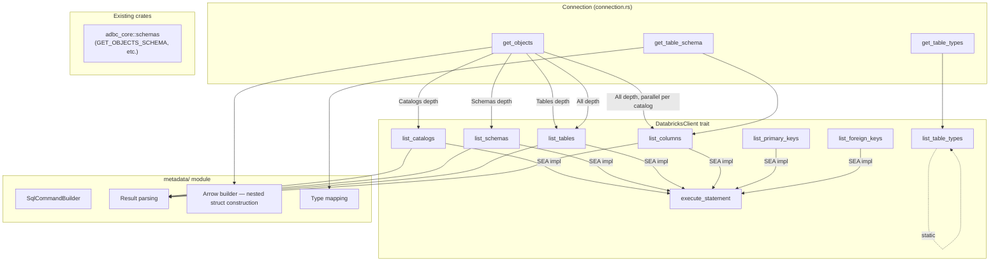
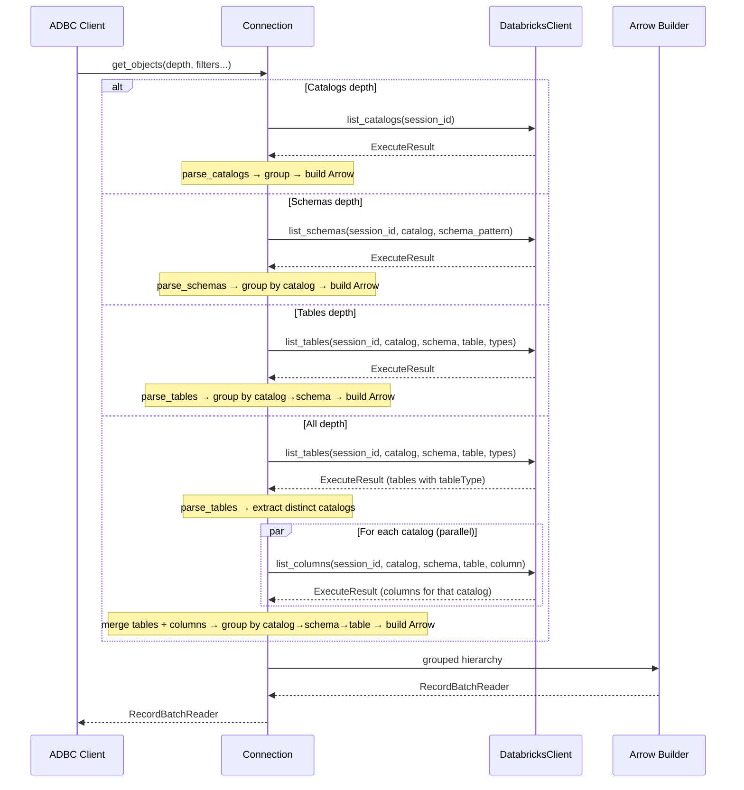
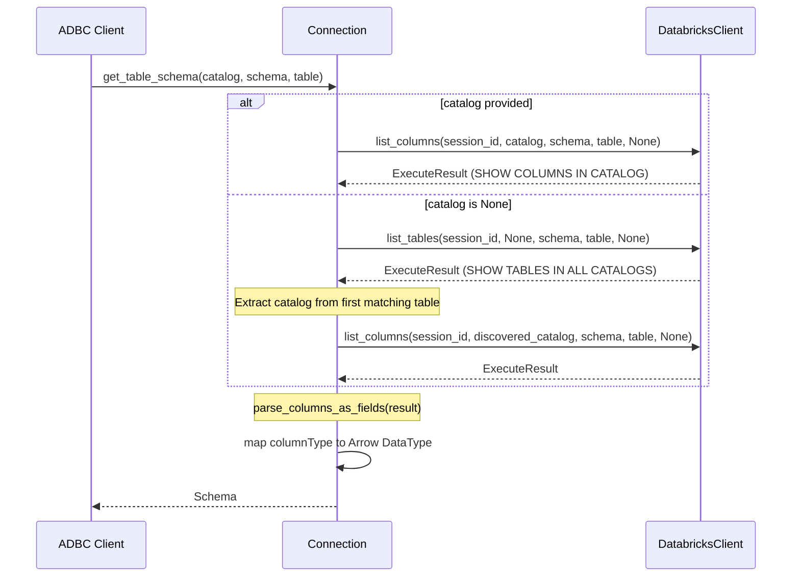

<!--
  Copyright (c) 2025 ADBC Drivers Contributors

  Licensed under the Apache License, Version 2.0 (the "License");
  you may not use this file except in compliance with the License.
  You may obtain a copy of the License at

          http://www.apache.org/licenses/LICENSE-2.0

  Unless required by applicable law or agreed to in writing, software
  distributed under the License is distributed on an "AS IS" BASIS,
  WITHOUT WARRANTIES OR CONDITIONS OF ANY KIND, either express or implied.
  See the License for the specific language governing permissions and
  limitations under the License.
-->

# Connection Interface Metadata Implementation Design

## Overview

This design document outlines the implementation plan for the missing ADBC Connection interface methods in the Databricks Rust ADBC driver. The implementation builds on the [client refactor](client-refactor-design.md) where `execute_statement` returns `ExecuteResult { statement_id, reader }` with polling and reader creation internal to the client.

## Scope

The following Connection interface methods need implementation:

| Method | Priority | Description |
|--------|----------|-------------|
| `get_objects()` | High | Return catalog/schema/table/column metadata |
| `get_table_schema()` | High | Return Arrow schema for a specific table |
| `get_table_types()` | Medium | Return supported table types |

**Out of Scope:**
- `read_partition()` - Deferred to a future design
- `get_statistics()` / `get_statistic_names()` - Deferred to a future design

---

## Architecture

### High-Level Design

Metadata methods are added to the `DatabricksClient` trait. The SEA implementation builds SHOW SQL commands and calls `self.execute_statement()` internally — zero duplication of polling or reader logic. A future Thrift implementation would use native RPCs instead.

**`get_objects` uses a single-query-per-depth strategy** to minimize server round trips. Instead of the driverbase `GetObjectsImpl` fan-out (which makes N×M calls for N catalogs × M schemas), we issue one SHOW query at the requested depth and build the nested Arrow hierarchy from the flat result set.

#### Required fields vs available data per depth

**Catalogs depth** — needs: `catalog_name`

| Required ADBC field | Source query | Source column | Notes |
|---------------------|-------------|---------------|-------|
| `catalog_name` | `SHOW CATALOGS` | `catalog` | Direct match |
| `catalog_db_schemas` | — | — | null at this depth |

**Schemas depth** — needs: `catalog_name`, `db_schema_name`

| Required ADBC field | Source query | Source column | Notes |
|---------------------|-------------|---------------|-------|
| `catalog_name` | `SHOW SCHEMAS IN ALL CATALOGS` | `catalog` | Direct match |
| `db_schema_name` | `SHOW SCHEMAS IN ALL CATALOGS` | `databaseName` | Direct match |
| `db_schema_tables` | — | — | null at this depth |

**Tables depth** — needs: `catalog_name`, `db_schema_name`, `table_name`, `table_type`

| Required ADBC field | Source query | Source column | Notes |
|---------------------|-------------|---------------|-------|
| `catalog_name` | `SHOW TABLES IN ALL CATALOGS` | `catalogName` | Direct match |
| `db_schema_name` | `SHOW TABLES IN ALL CATALOGS` | `namespace` | Direct match |
| `table_name` | `SHOW TABLES IN ALL CATALOGS` | `tableName` | Direct match |
| `table_type` | `SHOW TABLES IN ALL CATALOGS` | `tableType` | Direct match (empty string for hive_metastore) |
| `table_columns` | — | — | null at this depth |
| `table_constraints` | — | — | null at this depth |

**All depth** — needs: all of Tables + `column_name` + xdbc fields

| Required ADBC field | Source query | Source column | Notes |
|---------------------|-------------|---------------|-------|
| `catalog_name` | `SHOW TABLES IN ALL CATALOGS` | `catalogName` | From tables query |
| `db_schema_name` | `SHOW TABLES IN ALL CATALOGS` | `namespace` | From tables query |
| `table_name` | `SHOW TABLES IN ALL CATALOGS` | `tableName` | From tables query |
| `table_type` | `SHOW TABLES IN ALL CATALOGS` | `tableType` | From tables query (**not in SHOW COLUMNS**) |
| `column_name` | `SHOW COLUMNS IN CATALOG <cat>` | `col_name` | Direct match |
| `ordinal_position` | `SHOW COLUMNS IN CATALOG <cat>` | `ordinalPosition` | Direct match (Int32) |
| `remarks` | `SHOW COLUMNS IN CATALOG <cat>` | `remarks` | Direct match |
| `xdbc_data_type` | `SHOW COLUMNS IN CATALOG <cat>` | `columnType` | Mapped via `databricks_type_to_xdbc()` |
| `xdbc_type_name` | `SHOW COLUMNS IN CATALOG <cat>` | `columnType` | Direct use of Databricks type string |
| `xdbc_column_size` | `SHOW COLUMNS IN CATALOG <cat>` | `columnSize` | Direct match (Int32, nullable) |
| `xdbc_decimal_digits` | `SHOW COLUMNS IN CATALOG <cat>` | `decimalDigits` | Direct match (Int32, nullable) |
| `xdbc_num_prec_radix` | `SHOW COLUMNS IN CATALOG <cat>` | `radix` | Direct match (Int32, nullable) |
| `xdbc_nullable` | `SHOW COLUMNS IN CATALOG <cat>` | `isNullable` | Map "true"→1, "false"→0 |
| `xdbc_column_def` | — | — | Not available, null |
| `xdbc_sql_data_type` | `SHOW COLUMNS IN CATALOG <cat>` | `columnType` | Mapped via `databricks_type_to_xdbc()` |
| `xdbc_datetime_sub` | — | — | Not available, null |
| `xdbc_char_octet_length` | — | — | Not available, null |
| `xdbc_is_nullable` | `SHOW COLUMNS IN CATALOG <cat>` | `isNullable` | Direct use ("true"/"false") |
| `xdbc_scope_catalog` | — | — | Not available, null |
| `xdbc_scope_schema` | — | — | Not available, null |
| `xdbc_scope_table` | — | — | Not available, null |
| `xdbc_is_autoincrement` | `SHOW COLUMNS IN CATALOG <cat>` | `isAutoIncrement` | Map "YES"→true, else false |
| `xdbc_is_generatedcolumn` | `SHOW COLUMNS IN CATALOG <cat>` | `isGenerated` | Map "YES"→true, else false |
| `table_constraints` | — | — | Empty list (follow-up: populate from `SHOW KEYS`/`SHOW FOREIGN KEYS`) |

**`get_table_schema`** — needs: `column_name`, `column_type`, `is_nullable`

| Required Arrow field | Source query | Source column | Notes |
|---------------------|-------------|---------------|-------|
| field name | `SHOW COLUMNS IN CATALOG <cat>` | `col_name` | Direct match |
| field data type | `SHOW COLUMNS IN CATALOG <cat>` | `columnType` | Mapped via `databricks_type_to_arrow()` |
| field nullable | `SHOW COLUMNS IN CATALOG <cat>` | `isNullable` | "true" → nullable |

**`get_table_types`** — static, no query needed

| Required ADBC field | Source | Notes |
|---------------------|--------|-------|
| `table_type` | Hardcoded list | `["SYSTEM TABLE", "TABLE", "VIEW", "METRIC_VIEW"]` |

For `All` depth, `SHOW COLUMNS IN ALL CATALOGS` is not yet available server-side, so we fan out one `SHOW COLUMNS IN CATALOG <cat>` per catalog in parallel. Each columns result already contains `catalogName`, `namespace`, `tableName` so we can group into the hierarchy. We also need `SHOW TABLES` for the `tableType` field which columns don't return.

Connection calls the `client.list_*()` methods, iterates the returned reader to parse results, groups them into a hierarchy, and builds the ADBC-spec nested Arrow response. Connection is backend-agnostic.



**Key design decisions:**
- **Single-query-per-depth for `get_objects`.** Instead of driverbase's hierarchical fan-out (`GetObjectsImpl`), we query at the exact depth and build the nested Arrow struct ourselves. This reduces `O(catalogs × schemas)` calls to `O(1)` for Catalogs/Schemas/Tables depth, and `O(catalogs)` for All depth.
- **No `driverbase::GetObjectsImpl`.** We build the nested Arrow structure directly. The driverbase approach makes one callback per (catalog, schema) pair which is too many round trips.
- **No `MetadataService` layer.** Metadata methods live directly on `DatabricksClient`, so SEA calls `self.execute_statement()` and Thrift calls native RPCs.
- **No caching.** Each call executes a fresh query, matching JDBC behavior and ADBC spec (which is silent on caching).
- **Connection is backend-agnostic.** It calls `client.list_catalogs()` etc. without knowing whether SQL or native RPCs are used underneath.

---

## Detailed Design

### 1. SQL Commands for Metadata

Based on the `databricks-jdbc` implementation (`CommandConstants.java`) and verified against a live Databricks endpoint:

| Operation | SQL Command | Filters |
|-----------|-------------|---------|
| List Catalogs | `SHOW CATALOGS` | None |
| List Schemas | `SHOW SCHEMAS IN \`{catalog}\`` | `LIKE '{pattern}'` |
| List Schemas (all) | `SHOW SCHEMAS IN ALL CATALOGS` | `LIKE '{pattern}'` |
| List Tables | `SHOW TABLES IN CATALOG \`{catalog}\`` | `SCHEMA LIKE`, `LIKE` |
| List Tables (all) | `SHOW TABLES IN ALL CATALOGS` | `SCHEMA LIKE`, `LIKE` |
| List Columns | `SHOW COLUMNS IN CATALOG \`{catalog}\`` | `SCHEMA LIKE`, `TABLE LIKE`, `LIKE` |
| List Primary Keys | `SHOW KEYS IN CATALOG \`{catalog}\` IN SCHEMA \`{schema}\` IN TABLE \`{table}\`` | None |
| List Foreign Keys | `SHOW FOREIGN KEYS IN CATALOG \`{catalog}\` IN SCHEMA \`{schema}\` IN TABLE \`{table}\`` | None |

**Verified result schemas (from live queries):**

| Query | Result Columns |
|-------|---------------|
| `SHOW CATALOGS` | `catalog: Utf8` |
| `SHOW SCHEMAS IN ALL CATALOGS` | `databaseName: Utf8`, `catalog: Utf8` |
| `SHOW SCHEMAS IN \`catalog\`` | `databaseName: Utf8` (**no `catalog` column** — see note below) |
| `SHOW TABLES IN ALL CATALOGS` | `namespace: Utf8`, `tableName: Utf8`, `isTemporary: Boolean`, `information: Utf8?`, `catalogName: Utf8`, `tableType: Utf8`, `remarks: Utf8?` |
| `SHOW COLUMNS IN CATALOG <cat>` | `col_name: Utf8`, `catalogName: Utf8?`, `namespace: Utf8`, `tableName: Utf8`, `columnType: Utf8`, `columnSize: Int32?`, `decimalDigits: Int32?`, `radix: Int32?`, `isNullable: Utf8?`, `remarks: Utf8?`, `ordinalPosition: Int32?`, `isAutoIncrement: Utf8?`, `isGenerated: Utf8?` |

**Notes:**
- **`SHOW SCHEMAS` schema varies by syntax:** `SHOW SCHEMAS IN ALL CATALOGS` returns both `databaseName` and `catalog` columns, but `SHOW SCHEMAS IN \`catalog\`` returns **only** `databaseName` (no `catalog` column). The parser handles this by accepting a fallback catalog parameter — when the `catalog` column is absent, it uses the catalog that was passed to `list_schemas`. This matches the JDBC driver behavior (`MetadataResultSetBuilder.getRowsForSchemas`, lines 1148-1156). `SHOW TABLES` and `SHOW COLUMNS` do not have this issue — the `IN CATALOG` syntax always returns the full column set.
- `SHOW COLUMNS IN ALL CATALOGS` is **not yet available** server-side (syntax error). For now, we fan out `SHOW COLUMNS IN CATALOG <cat>` per catalog in parallel. When the command is added, we can switch to a single call.
- `SHOW TABLE TYPES` does **not exist**. Table types are hardcoded based on what Databricks supports.
- `SHOW TABLES` returns `tableType` which is empty string (`""`) for `hive_metastore` tables (typed as `"UNKNOWN"` in remarks). For Unity Catalog tables it returns `"TABLE"`, `"VIEW"`, etc.

### 2. DatabricksClient Trait — Metadata Methods

Metadata methods are added to the existing `DatabricksClient` trait. Each returns `ExecuteResult` — the same type returned by `execute_statement`. Connection reads the `ExecuteResult.reader` to parse results.

`list_table_types` is the exception — it returns a static list and doesn't need async/SQL.

```rust
#[async_trait]
pub trait DatabricksClient: Send + Sync + Debug {
    // --- Existing methods (from client refactor) ---
    async fn create_session(...) -> Result<SessionInfo>;
    async fn delete_session(&self, session_id: &str) -> Result<()>;
    async fn execute_statement(&self, session_id: &str, sql: &str, params: &ExecuteParams) -> Result<ExecuteResult>;
    async fn get_result_chunks(&self, statement_id: &str, chunk_index: i64, row_offset: i64) -> Result<ChunkLinkFetchResult>;
    async fn cancel_statement(&self, statement_id: &str) -> Result<()>;
    async fn close_statement(&self, statement_id: &str) -> Result<()>;

    // --- New metadata methods ---

    /// List all catalogs.
    async fn list_catalogs(&self, session_id: &str) -> Result<ExecuteResult>;

    /// List schemas, optionally filtered by catalog and pattern.
    /// When catalog is None or wildcard, uses "SHOW SCHEMAS IN ALL CATALOGS".
    async fn list_schemas(
        &self,
        session_id: &str,
        catalog: Option<&str>,
        schema_pattern: Option<&str>,
    ) -> Result<ExecuteResult>;

    /// List tables, optionally filtered.
    /// When catalog is None or wildcard, uses "SHOW TABLES IN ALL CATALOGS".
    async fn list_tables(
        &self,
        session_id: &str,
        catalog: Option<&str>,
        schema_pattern: Option<&str>,
        table_pattern: Option<&str>,
        table_types: Option<&[&str]>,
    ) -> Result<ExecuteResult>;

    /// List columns for a specific catalog, optionally filtered by patterns.
    /// Catalog is required — `SHOW COLUMNS IN ALL CATALOGS` is not yet available server-side.
    async fn list_columns(
        &self,
        session_id: &str,
        catalog: &str,
        schema_pattern: Option<&str>,
        table_pattern: Option<&str>,
        column_pattern: Option<&str>,
    ) -> Result<ExecuteResult>;

    /// List primary keys for a specific table.
    async fn list_primary_keys(
        &self,
        session_id: &str,
        catalog: &str,
        schema: &str,
        table: &str,
    ) -> Result<ExecuteResult>;

    /// List foreign keys for a specific table.
    async fn list_foreign_keys(
        &self,
        session_id: &str,
        catalog: &str,
        schema: &str,
        table: &str,
    ) -> Result<ExecuteResult>;

    /// List supported table types (static, no SQL executed).
    fn list_table_types(&self) -> Vec<String>;
}
```

### 3. SeaClient Implementation

Each metadata method in SeaClient builds a SHOW SQL command and calls `self.execute_statement()`:

```rust
impl DatabricksClient for SeaClient {
    async fn list_catalogs(&self, session_id: &str) -> Result<ExecuteResult> {
        let sql = SqlCommandBuilder::new().build_show_catalogs();
        self.execute_statement(session_id, &sql, &ExecuteParams::default()).await
    }

    async fn list_schemas(
        &self,
        session_id: &str,
        catalog: Option<&str>,
        schema_pattern: Option<&str>,
    ) -> Result<ExecuteResult> {
        let sql = SqlCommandBuilder::new()
            .with_catalog(catalog)
            .with_schema_pattern(schema_pattern)
            .build_show_schemas();
        self.execute_statement(session_id, &sql, &ExecuteParams::default()).await
    }

    async fn list_tables(
        &self,
        session_id: &str,
        catalog: Option<&str>,
        schema_pattern: Option<&str>,
        table_pattern: Option<&str>,
        table_types: Option<&[&str]>,
    ) -> Result<ExecuteResult> {
        let sql = SqlCommandBuilder::new()
            .with_catalog(catalog)
            .with_schema_pattern(schema_pattern)
            .with_table_pattern(table_pattern)
            .build_show_tables();
        // Note: table_types filtering is done client-side after fetching
        self.execute_statement(session_id, &sql, &ExecuteParams::default()).await
    }

    async fn list_columns(
        &self,
        session_id: &str,
        catalog: &str,
        schema_pattern: Option<&str>,
        table_pattern: Option<&str>,
        column_pattern: Option<&str>,
    ) -> Result<ExecuteResult> {
        let sql = SqlCommandBuilder::new()
            .with_catalog(Some(catalog))
            .with_schema_pattern(schema_pattern)
            .with_table_pattern(table_pattern)
            .with_column_pattern(column_pattern)
            .build_show_columns()?;
        self.execute_statement(session_id, &sql, &ExecuteParams::default()).await
    }

    async fn list_primary_keys(
        &self,
        session_id: &str,
        catalog: &str,
        schema: &str,
        table: &str,
    ) -> Result<ExecuteResult> {
        let sql = SqlCommandBuilder::build_show_primary_keys(catalog, schema, table);
        self.execute_statement(session_id, &sql, &ExecuteParams::default()).await
    }

    async fn list_foreign_keys(
        &self,
        session_id: &str,
        catalog: &str,
        schema: &str,
        table: &str,
    ) -> Result<ExecuteResult> {
        let sql = SqlCommandBuilder::build_show_foreign_keys(catalog, schema, table);
        self.execute_statement(session_id, &sql, &ExecuteParams::default()).await
    }

    fn list_table_types(&self) -> Vec<String> {
        vec![
            "SYSTEM TABLE".to_string(),
            "TABLE".to_string(),
            "VIEW".to_string(),
            "METRIC_VIEW".to_string(),
        ]
    }
}
```

### 4. New Module Structure

```
rust/src/
├── connection.rs        # Updated with metadata implementations
├── metadata/            # NEW module
│   ├── mod.rs          # Module exports
│   ├── sql.rs          # SqlCommandBuilder (like CommandBuilder.java)
│   ├── parse.rs        # Parse ExecuteResult reader into intermediate structs
│   ├── builder.rs      # Build nested Arrow structs for get_objects response
│   └── type_mapping.rs # Databricks type → Arrow/XDBC type mapping
```

**Reused from existing crates:**
- **`adbc_core::schemas`** — Provides `GET_OBJECTS_SCHEMA`, `GET_TABLE_TYPES_SCHEMA`, etc. as static `LazyLock` definitions. We use the schema; we build the data ourselves.

**Not used:**
- ~~`driverbase::get_objects::GetObjectsImpl`~~ — Its hierarchical fan-out (one callback per catalog×schema pair) makes `O(catalogs × schemas)` calls. We query at the exact depth instead (`O(1)` for Catalogs/Schemas/Tables, `O(catalogs)` for All) and build the nested Arrow struct ourselves.

### 5. Result Parsing (`parse.rs`)

`execute_statement` (and thus `list_*`) returns `ExecuteResult` with a `Box<dyn ResultReader>`. Parse functions read batches from the reader and return intermediate structs that `builder.rs` uses to construct the nested Arrow response.

Column names below match the verified result schemas from live queries.

```rust
/// Parsed catalog info from SHOW CATALOGS.
pub struct CatalogInfo {
    pub catalog_name: String,
}

/// Parsed schema info from SHOW SCHEMAS IN ALL CATALOGS.
pub struct SchemaInfo {
    pub catalog_name: String,       // "catalog" column
    pub schema_name: String,        // "databaseName" column
}

/// Parsed table info from SHOW TABLES IN ALL CATALOGS.
pub struct TableInfo {
    pub catalog_name: String,       // "catalogName" column
    pub schema_name: String,        // "namespace" column
    pub table_name: String,         // "tableName" column
    pub table_type: String,         // "tableType" column
    pub remarks: Option<String>,    // "remarks" column
}

/// Parsed column info from SHOW COLUMNS IN CATALOG <cat>.
pub struct ColumnInfo {
    pub catalog_name: String,       // "catalogName" column
    pub schema_name: String,        // "namespace" column
    pub table_name: String,         // "tableName" column
    pub column_name: String,        // "col_name" column
    pub column_type: String,        // "columnType" column
    pub column_size: Option<i32>,   // "columnSize" column
    pub decimal_digits: Option<i32>,// "decimalDigits" column
    pub radix: Option<i32>,         // "radix" column
    pub is_nullable: Option<String>,// "isNullable" column
    pub remarks: Option<String>,    // "remarks" column
    pub ordinal_position: Option<i32>, // "ordinalPosition" column
    pub is_auto_increment: Option<String>, // "isAutoIncrement" column
    pub is_generated: Option<String>,      // "isGenerated" column
}

/// Parse catalogs from SHOW CATALOGS result.
pub fn parse_catalogs(result: ExecuteResult) -> Result<Vec<CatalogInfo>> {
    // Reads "catalog" column
}

/// Parse schemas from SHOW SCHEMAS result.
/// Works for both "SHOW SCHEMAS IN ALL CATALOGS" (has `catalog` column) and
/// "SHOW SCHEMAS IN `catalog`" (missing `catalog` column — uses fallback).
pub fn parse_schemas(result: ExecuteResult, fallback_catalog: Option<&str>) -> Result<Vec<SchemaInfo>> {
    // Reads "databaseName" column; reads "catalog" column if present, else uses fallback_catalog
}

/// Parse tables from SHOW TABLES result.
/// Works for both "SHOW TABLES IN ALL CATALOGS" and "SHOW TABLES IN CATALOG `catalog`".
pub fn parse_tables(result: ExecuteResult) -> Result<Vec<TableInfo>> {
    // Reads "catalogName", "namespace", "tableName", "tableType", "remarks" columns
}

/// Parse columns from SHOW COLUMNS result.
pub fn parse_columns(result: ExecuteResult) -> Result<Vec<ColumnInfo>> {
    // Reads all 13 columns from SHOW COLUMNS result
}

/// Parse columns directly into Arrow Fields for get_table_schema.
/// Uses "col_name", "columnType", and "isNullable" to build the schema.
pub fn parse_columns_as_fields(result: ExecuteResult) -> Result<Vec<Field>> {
    let mut fields = Vec::new();
    let mut reader = result.reader;

    loop {
        match reader.next_batch()? {
            Some(batch) => {
                let name_col = get_string_column(&batch, "col_name")?;
                let type_col = get_string_column(&batch, "columnType")?;
                let nullable_col = get_optional_string_column(&batch, "isNullable")?;

                for i in 0..batch.num_rows() {
                    let arrow_type = databricks_type_to_arrow(type_col.value(i));
                    let nullable = nullable_col
                        .map(|c| c.value(i) == "true" || c.value(i) == "YES")
                        .unwrap_or(true);
                    fields.push(Field::new(name_col.value(i), arrow_type, nullable));
                }
            }
            None => break,
        }
    }
    Ok(fields)
}
```

### 6. get_objects Implementation

`get_objects` uses a **single-query-per-depth** strategy. We issue one SHOW query at the requested depth, parse the flat result into intermediate structs, group them into a hierarchy, and build the nested Arrow struct ourselves.

The nested Arrow schema is defined in `adbc_core::schemas::GET_OBJECTS_SCHEMA`.

```rust
impl Connection {
    fn get_objects(
        &self,
        depth: ObjectDepth,
        catalog: Option<&str>,
        db_schema: Option<&str>,
        table_name: Option<&str>,
        table_type: Option<Vec<&str>>,
        column_name: Option<&str>,
    ) -> Result<impl RecordBatchReader + Send> {
        match depth {
            ObjectDepth::Catalogs => {
                // One query: SHOW CATALOGS
                let result = self.runtime.block_on(
                    self.client.list_catalogs(&self.session_id)
                ).map_err(|e| e.to_adbc())?;
                let catalogs = parse_catalogs(result).map_err(|e| e.to_adbc())?;

                // Filter by catalog pattern (client-side)
                let catalogs = filter_by_pattern(catalogs, catalog, |c| &c.catalog_name);

                build_get_objects_catalogs(catalogs)
            }

            ObjectDepth::Schemas => {
                // One query: SHOW SCHEMAS IN ALL CATALOGS (or IN `catalog` if filtered)
                let result = self.runtime.block_on(
                    self.client.list_schemas(&self.session_id, catalog, db_schema)
                ).map_err(|e| e.to_adbc())?;
                let schemas = parse_schemas(result).map_err(|e| e.to_adbc())?;

                // Group by catalog → Vec<(catalog, Vec<schema>)>
                let grouped = group_schemas_by_catalog(schemas);
                build_get_objects_schemas(grouped)
            }

            ObjectDepth::Tables => {
                // One query: SHOW TABLES IN ALL CATALOGS (or IN CATALOG `catalog` if filtered)
                let result = self.runtime.block_on(
                    self.client.list_tables(
                        &self.session_id, catalog, db_schema, table_name, table_type.as_deref(),
                    )
                ).map_err(|e| e.to_adbc())?;
                let tables = parse_tables(result).map_err(|e| e.to_adbc())?;

                // Group by catalog → schema → Vec<table>
                let grouped = group_tables_by_catalog_schema(tables);
                build_get_objects_tables(grouped)
            }

            ObjectDepth::All => {
                // Step 1: SHOW TABLES IN ALL CATALOGS (for table_type)
                let tables_result = self.runtime.block_on(
                    self.client.list_tables(
                        &self.session_id, catalog, db_schema, table_name, table_type.as_deref(),
                    )
                ).map_err(|e| e.to_adbc())?;
                let tables = parse_tables(tables_result).map_err(|e| e.to_adbc())?;

                // Step 2: Get distinct catalogs from tables result
                let catalogs: Vec<String> = tables.iter()
                    .map(|t| t.catalog_name.clone())
                    .collect::<HashSet<_>>()
                    .into_iter()
                    .collect();

                // Step 3: SHOW COLUMNS IN CATALOG <cat> — parallel, one per catalog
                let columns = self.runtime.block_on(async {
                    let mut handles = Vec::new();
                    for cat in &catalogs {
                        let client = self.client.clone();
                        let session_id = self.session_id.clone();
                        let cat = cat.clone();
                        let schema_pattern = db_schema.map(|s| s.to_string());
                        let table_pattern = table_name.map(|s| s.to_string());
                        let col_pattern = column_name.map(|s| s.to_string());

                        handles.push(tokio::spawn(async move {
                            client.list_columns(
                                &session_id,
                                &cat,
                                schema_pattern.as_deref(),
                                table_pattern.as_deref(),
                                col_pattern.as_deref(),
                            ).await
                        }));
                    }

                    let mut all_columns = Vec::new();
                    for handle in handles {
                        let result = handle.await.map_err(|e| /* join error */)?;
                        let cols = parse_columns(result?)?;
                        all_columns.extend(cols);
                    }
                    Ok::<_, crate::error::Error>(all_columns)
                }).map_err(|e| e.to_adbc())?;

                // Step 4: Group tables + columns into hierarchy, build nested Arrow
                let grouped = group_tables_and_columns(tables, columns);
                build_get_objects_all(grouped)
            }
        }
    }
}
```

### 6a. Arrow Builder (`builder.rs`)

Builds the nested Arrow struct required by `get_objects`. Each function produces a `RecordBatchReader` with the `GET_OBJECTS_SCHEMA` schema.

The hierarchy is: `catalog → db_schema → table → column/constraint`.

```rust
use adbc_core::schemas::GET_OBJECTS_SCHEMA;

/// Grouped hierarchy types used by the builder.
pub struct CatalogNode {
    pub catalog_name: String,
    pub schemas: Option<Vec<SchemaNode>>,  // None at Catalogs depth
}

pub struct SchemaNode {
    pub schema_name: String,
    pub tables: Option<Vec<TableNode>>,    // None at Schemas depth
}

pub struct TableNode {
    pub table_name: String,
    pub table_type: String,
    pub columns: Option<Vec<ColumnInfo>>,  // None at Tables depth
    // constraints: follow-up
}

/// Build get_objects result at Catalogs depth.
/// catalog_db_schemas list is null for each catalog.
pub fn build_get_objects_catalogs(
    catalogs: Vec<CatalogInfo>,
) -> Result<impl RecordBatchReader + Send> { ... }

/// Build get_objects result at Schemas depth.
/// db_schema_tables list is null for each schema.
pub fn build_get_objects_schemas(
    catalogs: Vec<CatalogNode>,
) -> Result<impl RecordBatchReader + Send> { ... }

/// Build get_objects result at Tables depth.
/// table_columns and table_constraints are null for each table.
pub fn build_get_objects_tables(
    catalogs: Vec<CatalogNode>,
) -> Result<impl RecordBatchReader + Send> { ... }

/// Build get_objects result at All depth.
/// Includes columns (with xdbc fields from SHOW COLUMNS data).
/// Constraints are empty (follow-up to populate from list_primary_keys/list_foreign_keys).
pub fn build_get_objects_all(
    catalogs: Vec<CatalogNode>,
) -> Result<impl RecordBatchReader + Send> { ... }
```

The builder uses Arrow struct/list builders (`StructBuilder`, `ListBuilder`) to construct the deeply nested schema. Each depth function appends null for the levels below it (matching the ADBC spec behavior for truncated depth).

**Note:** Constraints (primary/foreign keys) are not populated in the initial implementation. This can be a follow-up — it would require calling `list_primary_keys` / `list_foreign_keys` per table at `All` depth.

### 7. get_table_schema Implementation

```rust
impl Connection {
    fn get_table_schema(
        &self,
        catalog: Option<&str>,
        db_schema: Option<&str>,
        table_name: &str,
    ) -> Result<Schema> {
        // SHOW COLUMNS IN CATALOG `{cat}` requires a catalog.
        // If catalog is not provided, we need to determine it first.
        let catalog = match catalog {
            Some(c) => c.to_string(),
            None => {
                // Try to find the table by querying tables across all catalogs
                let result = self.runtime.block_on(
                    self.client.list_tables(
                        &self.session_id,
                        None,           // all catalogs
                        db_schema,
                        Some(table_name),
                        None,
                    )
                ).map_err(|e| e.to_adbc())?;
                let tables = parse_tables(result).map_err(|e| e.to_adbc())?;
                tables.first()
                    .map(|t| t.catalog_name.clone())
                    .ok_or_else(|| DatabricksErrorHelper::not_found()
                        .message(format!("Table not found: {}", table_name))
                        .to_adbc())?
            }
        };

        let result = self.runtime.block_on(
            self.client.list_columns(
                &self.session_id,
                &catalog,
                db_schema,
                Some(table_name),
                None, // all columns
            )
        ).map_err(|e| e.to_adbc())?;
        let fields = parse_columns_as_fields(result).map_err(|e| e.to_adbc())?;

        if fields.is_empty() {
            return Err(DatabricksErrorHelper::not_found()
                .message(format!("Table not found: {}", table_name))
                .to_adbc());
        }

        Ok(Schema::new(fields))
    }
}
```

**Note:** Since `SHOW COLUMNS IN ALL CATALOGS` doesn't exist yet, `list_columns` always requires a catalog. When catalog is not provided, we first run `SHOW TABLES IN ALL CATALOGS` to discover which catalog the table is in.

### 8. get_table_types Implementation

The table types are static values based on what Databricks supports. Uses `adbc_core::schemas::GET_TABLE_TYPES_SCHEMA` for the schema:

```rust
use adbc_core::schemas::GET_TABLE_TYPES_SCHEMA;

impl Connection {
    fn get_table_types(&self) -> Result<impl RecordBatchReader + Send> {
        let table_types = self.client.list_table_types();

        let array = StringArray::from(table_types);
        let batch = RecordBatch::try_new(
            GET_TABLE_TYPES_SCHEMA.clone(),
            vec![Arc::new(array)],
        )?;

        Ok(RecordBatchIterator::new(
            vec![Ok(batch)].into_iter(),
            GET_TABLE_TYPES_SCHEMA.clone(),
        ))
    }
}
```

### 9. SQL Command Builder

```rust
/// Builds SQL commands for metadata queries.
pub struct SqlCommandBuilder {
    catalog: Option<String>,
    schema_pattern: Option<String>,
    table_pattern: Option<String>,
    column_pattern: Option<String>,
}

impl SqlCommandBuilder {
    pub fn new() -> Self {
        Self {
            catalog: None,
            schema_pattern: None,
            table_pattern: None,
            column_pattern: None,
        }
    }

    pub fn with_catalog(mut self, catalog: Option<&str>) -> Self {
        self.catalog = catalog.map(|s| s.to_string());
        self
    }

    pub fn with_schema_pattern(mut self, pattern: Option<&str>) -> Self {
        self.schema_pattern = pattern.map(|p| Self::jdbc_to_sql_pattern(p));
        self
    }

    pub fn with_table_pattern(mut self, pattern: Option<&str>) -> Self {
        self.table_pattern = pattern.map(|p| Self::jdbc_to_sql_pattern(p));
        self
    }

    pub fn with_column_pattern(mut self, pattern: Option<&str>) -> Self {
        self.column_pattern = pattern.map(|p| Self::jdbc_to_sql_pattern(p));
        self
    }

    /// Convert JDBC/ADBC pattern (% and _) to SQL LIKE pattern.
    /// TODO: Handle escaping of literal % and _ characters.
    fn jdbc_to_sql_pattern(pattern: &str) -> String {
        // JDBC uses % for multi-char wildcard, _ for single char
        // SQL LIKE uses the same, but we need to escape backticks
        pattern.replace('`', "``")
    }

    /// Escape identifier for use in SQL (backtick-quote).
    fn escape_identifier(name: &str) -> String {
        format!("`{}`", name.replace('`', "``"))
    }

    /// Returns true if the value is None, empty, or a wildcard ("%" or "*").
    fn is_null_or_wildcard(value: &Option<String>) -> bool {
        match value {
            None => true,
            Some(v) => v.is_empty() || v == "%" || v == "*",
        }
    }

    pub fn build_show_catalogs(&self) -> String {
        "SHOW CATALOGS".to_string()
    }

    pub fn build_show_schemas(&self) -> String {
        let mut sql = if Self::is_null_or_wildcard(&self.catalog) {
            "SHOW SCHEMAS IN ALL CATALOGS".to_string()
        } else {
            format!(
                "SHOW SCHEMAS IN {}",
                Self::escape_identifier(self.catalog.as_ref().unwrap())
            )
        };

        if let Some(ref pattern) = self.schema_pattern {
            sql.push_str(&format!(" LIKE '{}'", pattern));
        }

        sql
    }

    pub fn build_show_tables(&self) -> String {
        let mut sql = if Self::is_null_or_wildcard(&self.catalog) {
            "SHOW TABLES IN ALL CATALOGS".to_string()
        } else {
            format!(
                "SHOW TABLES IN CATALOG {}",
                Self::escape_identifier(self.catalog.as_ref().unwrap())
            )
        };

        if let Some(ref pattern) = self.schema_pattern {
            sql.push_str(&format!(" SCHEMA LIKE '{}'", pattern));
        }

        if let Some(ref pattern) = self.table_pattern {
            sql.push_str(&format!(" LIKE '{}'", pattern));
        }

        sql
    }

    /// Build SHOW COLUMNS command. Requires a catalog — `SHOW COLUMNS IN ALL CATALOGS`
    /// is not yet available server-side. Callers must provide a catalog.
    pub fn build_show_columns(&self) -> Result<String> {
        let catalog = self.catalog.as_ref().ok_or_else(|| {
            DatabricksErrorHelper::invalid_argument()
                .message("catalog is required for SHOW COLUMNS (ALL CATALOGS not yet supported)")
        })?;

        let mut sql = format!(
            "SHOW COLUMNS IN CATALOG {}",
            Self::escape_identifier(catalog)
        );

        if let Some(ref pattern) = self.schema_pattern {
            sql.push_str(&format!(" SCHEMA LIKE '{}'", pattern));
        }

        if let Some(ref pattern) = self.table_pattern {
            sql.push_str(&format!(" TABLE LIKE '{}'", pattern));
        }

        if let Some(ref pattern) = self.column_pattern {
            sql.push_str(&format!(" LIKE '{}'", pattern));
        }

        Ok(sql)
    }

    pub fn build_show_primary_keys(
        catalog: &str,
        schema: &str,
        table: &str,
    ) -> String {
        format!(
            "SHOW KEYS IN CATALOG {} IN SCHEMA {} IN TABLE {}",
            Self::escape_identifier(catalog),
            Self::escape_identifier(schema),
            Self::escape_identifier(table)
        )
    }

    pub fn build_show_foreign_keys(
        catalog: &str,
        schema: &str,
        table: &str,
    ) -> String {
        format!(
            "SHOW FOREIGN KEYS IN CATALOG {} IN SCHEMA {} IN TABLE {}",
            Self::escape_identifier(catalog),
            Self::escape_identifier(schema),
            Self::escape_identifier(table)
        )
    }
}
```

### 10. Type Mapping

Databricks types need to be mapped to Arrow types and XDBC type codes:

```rust
/// Map Databricks SQL type name to Arrow DataType.
pub fn databricks_type_to_arrow(type_name: &str) -> DataType {
    let type_upper = type_name.to_uppercase();
    let base_type = type_upper.split('(').next().unwrap_or(&type_upper).trim();

    match base_type {
        "BOOLEAN" | "BOOL" => DataType::Boolean,
        "TINYINT" | "BYTE" => DataType::Int8,
        "SMALLINT" | "SHORT" => DataType::Int16,
        "INT" | "INTEGER" => DataType::Int32,
        "BIGINT" | "LONG" => DataType::Int64,
        "FLOAT" | "REAL" => DataType::Float32,
        "DOUBLE" => DataType::Float64,
        "DECIMAL" | "DEC" | "NUMERIC" => {
            // Parse precision and scale from DECIMAL(p,s)
            let (precision, scale) = parse_decimal_params(type_name);
            DataType::Decimal128(precision, scale)
        }
        "STRING" | "VARCHAR" | "CHAR" | "TEXT" => DataType::Utf8,
        "BINARY" | "VARBINARY" => DataType::Binary,
        "DATE" => DataType::Date32,
        "TIMESTAMP" | "TIMESTAMP_NTZ" => DataType::Timestamp(TimeUnit::Microsecond, None),
        "TIMESTAMP_LTZ" => DataType::Timestamp(TimeUnit::Microsecond, Some("UTC".into())),
        "INTERVAL" => DataType::Interval(IntervalUnit::DayTime),
        "ARRAY" => DataType::Utf8, // Represented as JSON string
        "MAP" => DataType::Utf8,   // Represented as JSON string
        "STRUCT" => DataType::Utf8, // Represented as JSON string
        "VOID" | "NULL" => DataType::Null,
        _ => DataType::Utf8, // Default fallback
    }
}

/// Map Databricks type to XDBC/JDBC type code.
pub fn databricks_type_to_xdbc(type_name: &str) -> i16 {
    let type_upper = type_name.to_uppercase();
    let base_type = type_upper.split('(').next().unwrap_or(&type_upper).trim();

    match base_type {
        "BOOLEAN" | "BOOL" => -7,      // JDBC BIT
        "TINYINT" | "BYTE" => -6,      // JDBC TINYINT
        "SMALLINT" | "SHORT" => 5,     // JDBC SMALLINT
        "INT" | "INTEGER" => 4,        // JDBC INTEGER
        "BIGINT" | "LONG" => -5,       // JDBC BIGINT
        "FLOAT" | "REAL" => 6,         // JDBC FLOAT
        "DOUBLE" => 8,                  // JDBC DOUBLE
        "DECIMAL" | "DEC" | "NUMERIC" => 3, // JDBC DECIMAL
        "STRING" | "TEXT" => -1,       // JDBC LONGVARCHAR
        "VARCHAR" => 12,               // JDBC VARCHAR
        "CHAR" => 1,                   // JDBC CHAR
        "BINARY" | "VARBINARY" => -3,  // JDBC VARBINARY
        "DATE" => 91,                  // JDBC DATE
        "TIMESTAMP" | "TIMESTAMP_NTZ" | "TIMESTAMP_LTZ" => 93, // JDBC TIMESTAMP
        "ARRAY" => 2003,               // JDBC ARRAY
        "MAP" => 2000,                 // JDBC JAVA_OBJECT
        "STRUCT" => 2002,              // JDBC STRUCT
        _ => 12,                       // Default to VARCHAR
    }
}
```

---

## Sequence Diagrams

### get_objects Flow (single-query-per-depth)



### get_table_schema Flow



---

## Error Handling

| Scenario | Behavior | Details |
|----------|----------|---------|
| Table not found | Error | `NOT_FOUND`: "Table not found: {name}" |
| Permission denied on catalog/schema | Log + skip | Warning logged, that catalog/schema omitted from results |
| Query execution failed for specific object | Log + skip | Warning logged, continue with remaining objects |
| All queries failed | Error | `INTERNAL`: "Failed to execute metadata query: {details}" |
| Timeout on metadata fetch | Error | Propagated from `execute_statement` polling timeout |

---

## Configuration Options

No new configuration options are required. The implementation uses the existing:
- `DatabricksClient` for query execution (with `DatabricksClientConfig` for polling/CloudFetch)
- Session ID for context

Timeouts are handled by the existing `DatabricksClientConfig.poll_timeout` in `execute_statement`.

---

## Test Strategy

### Unit Tests

- `test_sql_command_builder_show_catalogs`
- `test_sql_command_builder_show_schemas_with_catalog`
- `test_sql_command_builder_show_schemas_all_catalogs`
- `test_sql_command_builder_show_schemas_null_or_wildcard`
- `test_sql_command_builder_show_tables_with_patterns`
- `test_sql_command_builder_show_columns_requires_catalog`
- `test_sql_command_builder_show_columns_with_patterns`
- `test_sql_command_builder_escape_identifiers`
- `test_type_mapping_databricks_to_arrow`
- `test_type_mapping_databricks_to_xdbc`
- `test_parse_catalogs_from_reader` (mock reader)
- `test_parse_schemas_from_reader` (mock reader)
- `test_parse_tables_from_reader` (mock reader)
- `test_parse_columns_from_reader` (mock reader)
- `test_parse_columns_as_fields` (mock reader)
- `test_build_get_objects_catalogs_depth` (builder unit test)
- `test_build_get_objects_schemas_depth` (builder unit test)
- `test_build_get_objects_tables_depth` (builder unit test)
- `test_build_get_objects_all_depth` (builder unit test)
- `test_group_schemas_by_catalog`
- `test_group_tables_by_catalog_schema`

### Integration Tests

- `test_get_objects_catalogs_depth`
- `test_get_objects_schemas_depth`
- `test_get_objects_tables_depth`
- `test_get_objects_columns_depth`
- `test_get_objects_with_catalog_filter`
- `test_get_objects_with_schema_pattern`
- `test_get_objects_with_table_type_filter`
- `test_get_table_schema_existing_table`
- `test_get_table_schema_nonexistent_table`
- `test_get_table_schema_without_catalog` (discovers catalog via list_tables)
- `test_get_table_types`

---

## Implementation Plan

### Phase 1: Foundation

1. Create `metadata/` module structure (`mod.rs`, `sql.rs`, `parse.rs`, `builder.rs`, `type_mapping.rs`)
2. Implement `SqlCommandBuilder` with wildcard detection (`is_null_or_wildcard`)
3. Note: `build_show_columns` returns `Result` since catalog is required
4. Add unit tests for SQL building

### Phase 2: DatabricksClient metadata methods + result parsing

1. Add metadata method signatures to `DatabricksClient` trait (`list_columns` takes `&str` catalog, not `Option`)
2. Implement SEA versions in `SeaClient` (each builds SQL, calls `self.execute_statement()`)
3. Implement result parsing from `ExecuteResult` reader to intermediate structs (`parse.rs`)
4. Parse functions use verified column names: `catalog`, `databaseName`, `catalogName`, `namespace`, `tableName`, `tableType`, `col_name`, `columnType`, etc.
5. Add mock-client unit tests

### Phase 3: get_table_types

1. Implement `get_table_types()` in Connection using `client.list_table_types()` and `adbc_core::schemas::GET_TABLE_TYPES_SCHEMA`
2. Add unit tests

### Phase 4: get_table_schema

1. Implement type mapping functions (`databricks_type_to_arrow`, `databricks_type_to_xdbc`) in `type_mapping.rs`
2. Implement `get_table_schema()` in Connection
3. When catalog is None, discover it via `list_tables` first
4. Add unit and integration tests

### Phase 5: get_objects — Arrow builder

1. Implement `builder.rs` — nested Arrow struct construction for each depth level
2. Implement grouping helpers (`group_schemas_by_catalog`, `group_tables_by_catalog_schema`, etc.)
3. Add builder unit tests with synthetic data

### Phase 6: get_objects — Connection integration ✅

1. Implement `get_objects()` in Connection with single-query-per-depth strategy
2. Catalogs/Schemas/Tables depth: one SHOW query → parse → group → build Arrow
3. All depth: `list_tables` + parallel `list_columns` per catalog → merge → build Arrow
4. Add unit tests with mock client for each depth level

**Implementation notes:**
- Added `filter_by_pattern()` helper with `like_match()` for client-side catalog pattern filtering (SHOW CATALOGS has no LIKE clause). Uses simple recursive matching for `%` and `_` wildcards without regex dependency.
- Table type filtering is client-side via `retain()` on parsed tables with case-insensitive comparison.
- `ObjectDepth::Columns` is treated identically to `ObjectDepth::All` (per ADBC spec).
- Each `build_get_objects_*` returns a different `impl RecordBatchReader` opaque type; unified via `collect_reader()` helper that collects batches into a concrete `RecordBatchIterator` type.
- Parallel column fetching uses `tokio::spawn` per catalog with `JoinHandle` collection.

---

## Alternatives Considered

### Alternative 1: Use INFORMATION_SCHEMA Queries

**Approach:** Query `information_schema.tables`, `information_schema.columns` directly instead of SHOW commands.

**Pros:**
- Standard SQL approach
- More filtering options

**Cons:**
- Different catalogs have different information_schema locations (Unity Catalog vs Hive Metastore)
- More complex query building
- JDBC driver already uses SHOW commands successfully

**Decision:** Use SHOW commands to match JDBC driver behavior.

### Alternative 2: Separate MetadataService Layer

**Approach:** Add a `MetadataService` struct between Connection and `DatabricksClient` that holds `Arc<dyn DatabricksClient>` and calls `execute_statement()`.

**Pros:**
- Keeps `DatabricksClient` trait smaller

**Cons:**
- SEA implementation would duplicate the `execute_statement()` → reader → parse flow — the whole point of the client refactor was to avoid consumer-side duplication
- Doesn't work cleanly for Thrift, which uses native RPCs, not SQL — `MetadataService` would need to become a trait itself, or the Thrift backend would bypass it entirely
- Extra indirection for no gain

**Decision:** Metadata methods go directly on `DatabricksClient`. SEA calls `self.execute_statement()`, Thrift calls native RPCs. Connection is backend-agnostic.

### Alternative 3: Cache Metadata Results

**Approach:** Add an LRU cache or time-based cache for metadata query results.

**Pros:**
- Faster repeated calls
- Reduces load on the server

**Cons:**
- ADBC spec provides no guidance on caching semantics
- JDBC driver does not cache metadata
- Risk of returning stale data in dynamic environments
- Cache invalidation complexity

**Decision:** No caching. Execute fresh queries on every call, matching JDBC behavior.

### Alternative 4: Use driverbase::GetObjectsImpl (hierarchical fan-out)

**Approach:** Implement `driverbase::get_objects::GetObjectsImpl` with 4 callbacks (`get_catalogs`, `get_db_schemas`, `get_tables`, `get_columns`), let driverbase handle the Arrow construction.

**Pros:**
- Less code — driverbase handles nested Arrow struct building
- Simple callback-per-level model

**Cons:**
- Makes `O(catalogs × schemas)` server calls — driverbase iterates each catalog, then each schema within, calling our callback each time
- Sequential execution (driverbase's `BatchIterator` is a synchronous `Iterator`)
- Can't leverage `SHOW TABLES IN ALL CATALOGS` (which returns all tables across all catalogs in one call)
- For a workspace with 30 catalogs × 250 schemas, that's 30 `SHOW SCHEMAS` + 7500 `SHOW TABLES` calls vs our single `SHOW TABLES IN ALL CATALOGS`

**Decision:** Build nested Arrow ourselves with single-query-per-depth strategy. One server call for Catalogs/Schemas/Tables depth, `O(catalogs)` calls for All depth (parallel).

## Dependencies

- `adbc_core::schemas` - `GET_OBJECTS_SCHEMA`, `GET_TABLE_TYPES_SCHEMA`, etc. (already a dependency)
- `arrow-array` - For building Arrow arrays (already a dependency)
- `arrow-schema` - For Arrow schema definitions (already a dependency)
- `log` - For warning-level logging on partial failures
- Existing `DatabricksClient` trait (with `ExecuteResult` from client refactor)
- Existing `ResultReader` trait for reading results
- Existing `tokio` runtime (already a dependency)

---

## References

- [Client refactor design](client-refactor-design.md)
- [ADBC Specification - Connection Interface](https://arrow.apache.org/adbc/current/format/specification.html)
- [databricks-jdbc CommandConstants.java](~/databricks-jdbc/src/main/java/com/databricks/jdbc/dbclient/impl/common/CommandConstants.java)
- [databricks-jdbc MetadataResultConstants.java](~/databricks-jdbc/src/main/java/com/databricks/jdbc/common/MetadataResultConstants.java)
- [databricks-jdbc CommandBuilder.java](~/databricks-jdbc/src/main/java/com/databricks/jdbc/dbclient/impl/sqlexec/CommandBuilder.java)
- [databricks-jdbc DatabricksMetadataSdkClient.java](~/databricks-jdbc/src/main/java/com/databricks/jdbc/dbclient/impl/sqlexec/DatabricksMetadataSdkClient.java)
- [databricks-jdbc JdbcThreadUtils.java](~/databricks-jdbc/src/main/java/com/databricks/jdbc/common/util/JdbcThreadUtils.java)
- [Databricks SQL Statement Execution API](https://docs.databricks.com/api/workspace/statementexecution)
