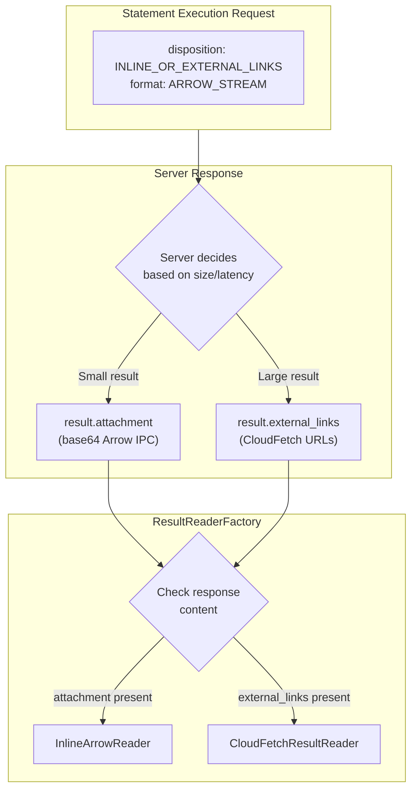
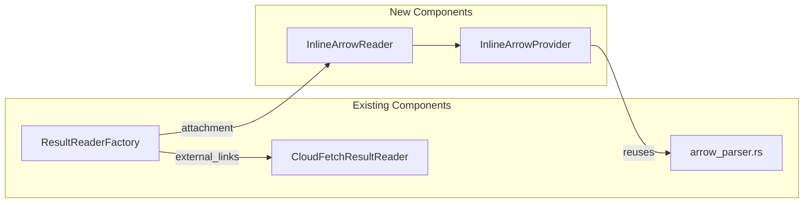
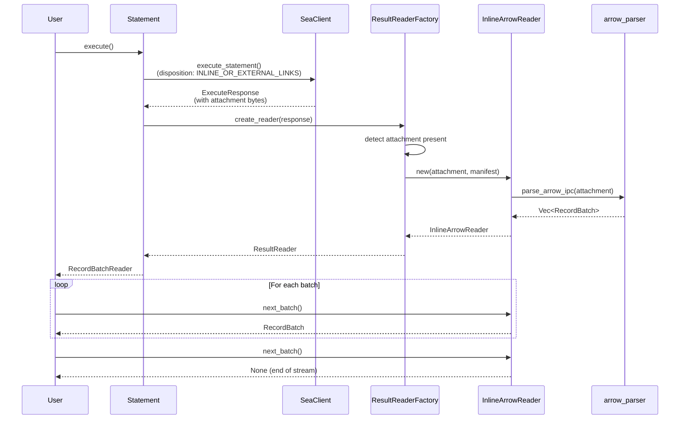
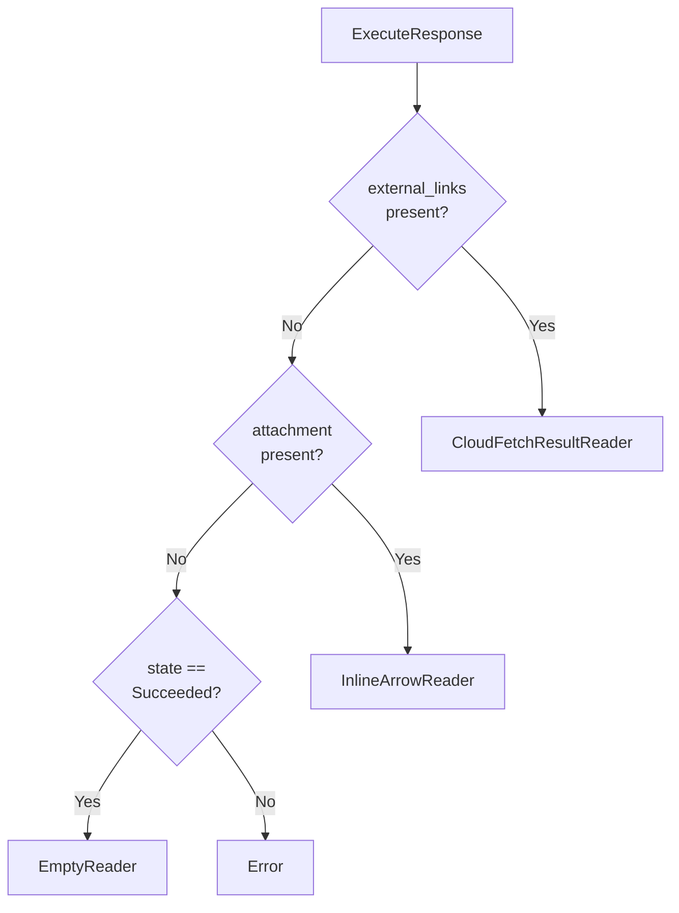
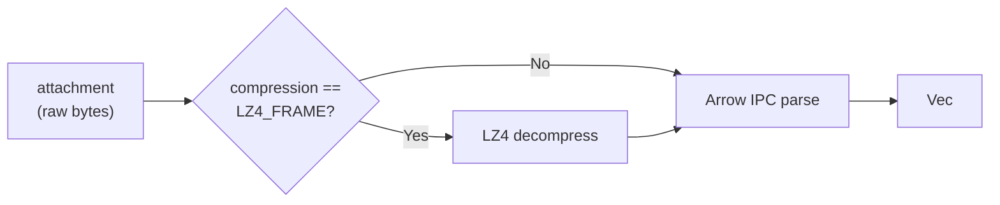

<!--
  Copyright (c) 2025 ADBC Drivers Contributors

  Licensed under the Apache License, Version 2.0 (the "License");
  you may not use this file except in compliance with the License.
  You may obtain a copy of the License at

          http://www.apache.org/licenses/LICENSE-2.0

  Unless required by applicable law or agreed to in writing, software
  distributed under the License is distributed on an "AS IS" BASIS,
  WITHOUT WARRANTIES OR CONDITIONS OF ANY KIND, either express or implied.
  See the License for the specific language governing permissions and
  limitations under the License.
-->

# Inline Arrow Results Design for Rust ADBC Driver

## Overview

This document describes the implementation of inline Arrow results in the Rust ADBC driver for SEA (Statement Execution API) mode. Inline results provide a lower-latency path for small query results by embedding Arrow IPC data directly in the API response, avoiding the overhead of CloudFetch (presigned URL generation, separate HTTP downloads).

The driver will support the `INLINE_OR_EXTERNAL_LINKS` disposition, allowing the server to dynamically choose between inline and CloudFetch based on result size and latency characteristics.

---

## Architecture

### High-Level Decision Flow



### Component Integration



---

## Data Flow

### Inline Arrow Result Processing



---

## Component Design

### ResultData Changes

The `ResultData` struct needs an `attachment` field for inline Arrow data:

```rust
/// Result data from a chunk fetch or initial execution response.
pub struct ResultData {
    // ... existing fields ...

    /// Inline Arrow IPC data (base64-decoded by serde)
    /// Present when server returns inline results instead of CloudFetch
    #[serde(default, with = "base64_bytes")]
    pub attachment: Option<Vec<u8>>,
}
```

**Note:** The SEA API returns the attachment as base64-encoded bytes. We use a custom serde deserializer to decode it.

### ExecuteResult Changes

Update `ExecuteResult` to track inline Arrow data:

```rust
pub struct ExecuteResult {
    // ... existing fields ...

    /// Inline Arrow IPC data (decoded from base64)
    pub inline_arrow_data: Option<Vec<u8>>,
}
```

### InlineArrowProvider

Single-chunk provider that holds pre-parsed Arrow batches:

```rust
/// Provider for inline Arrow results.
///
/// Unlike CloudFetch, inline results are:
/// - Always a single chunk
/// - Already present in the response (no download needed)
/// - Typically smaller datasets
pub struct InlineArrowProvider {
    /// Pre-parsed record batches from the inline attachment
    batches: VecDeque<RecordBatch>,

    /// Schema extracted from the first batch
    schema: Option<SchemaRef>,

    /// Whether all batches have been consumed
    exhausted: bool,
}
```

**Interface:**

```rust
impl InlineArrowProvider {
    /// Create provider from raw Arrow IPC bytes.
    ///
    /// Decompresses (if needed) and parses Arrow IPC stream.
    pub fn new(
        attachment: Vec<u8>,
        compression: CompressionCodec,
    ) -> Result<Self>;

    /// Get the schema of the result set.
    pub fn schema(&self) -> Option<&SchemaRef>;

    /// Get the next record batch, or None if exhausted.
    pub fn next_batch(&mut self) -> Result<Option<RecordBatch>>;
}
```

### InlineArrowReader

Wrapper implementing `ResultReader` trait:

```rust
/// Reader for inline Arrow results.
struct InlineArrowReader {
    provider: InlineArrowProvider,
}

impl ResultReader for InlineArrowReader {
    fn schema(&self) -> Result<SchemaRef>;
    fn next_batch(&mut self) -> Result<Option<RecordBatch>>;
}
```

### ResultReaderFactory Changes

Update the factory to detect and handle inline Arrow data:



**Decision Logic:**

```rust
pub fn create_reader(&self, statement_id: &str, response: &ExecuteResponse)
    -> Result<Box<dyn ResultReader + Send>>
{
    if let Some(ref result) = response.result {
        // Priority 1: CloudFetch (external links)
        if let Some(ref external_links) = result.external_links {
            if !external_links.is_empty() {
                return self.create_cloudfetch_reader(...);
            }
        }

        // Priority 2: Inline Arrow (attachment)
        if let Some(ref attachment) = result.inline_arrow_data {
            if !attachment.is_empty() {
                return self.create_inline_reader(attachment, response);
            }
        }

        // Internal links not supported
        if result.next_chunk_internal_link.is_some() {
            return Err(...);
        }
    }

    // No result data - empty result or error state
    match response.status.state {
        StatementState::Succeeded => Ok(Box::new(EmptyReader::new(schema))),
        // ... error handling
    }
}
```

---

## Compression Handling

Inline Arrow data may be compressed using LZ4_FRAME, indicated by `manifest.result_compression`:



The Arrow parser function was renamed from `parse_cloudfetch_response` to `parse_arrow_ipc` to reflect its general-purpose use:

```rust
impl InlineArrowProvider {
    pub fn new(attachment: Vec<u8>, compression: CompressionCodec) -> Result<Self> {
        // Reuse shared Arrow IPC parser (same format as CloudFetch)
        let batches = parse_arrow_ipc(&attachment, compression)?;

        let schema = batches.first().map(|b| b.schema());

        Ok(Self {
            batches: VecDeque::from(batches),
            schema,
        })
    }
}
```

---

## Configuration

### Disposition Mode

Add configuration option for disposition mode:

| Option Key | Type | Default | Description |
|------------|------|---------|-------------|
| `databricks.disposition` | String | `INLINE_OR_EXTERNAL_LINKS` | Result disposition mode |

**Valid values:**
- `EXTERNAL_LINKS` - Always use CloudFetch (current behavior)
- `INLINE_OR_EXTERNAL_LINKS` - Let server choose based on result characteristics

### No Inline-Specific Configuration

Inline results require no special configuration beyond disposition mode:
- No prefetch window (single chunk)
- No memory limits (data already in response)
- No download parallelism (no download needed)

---

## File Structure

```
rust/src/
├── types/
│   └── sea.rs                    # Add attachment field to ResultData
├── client/
│   ├── mod.rs                    # Update ExecuteResult with inline_arrow_data
│   └── sea.rs                    # Parse attachment from response
├── reader/
│   ├── mod.rs                    # Update ResultReaderFactory
│   ├── inline/                   # NEW: Inline results module
│   │   ├── mod.rs
│   │   └── provider.rs           # InlineArrowProvider
│   └── cloudfetch/
│       └── arrow_parser.rs       # Reused for parsing
└── database.rs                   # Add disposition option
```

---

## Serde Base64 Deserialization

The SEA API returns the `attachment` field as a base64-encoded string. We need custom serde handling:

```rust
mod base64_bytes {
    use base64::{engine::general_purpose::STANDARD, Engine};
    use serde::{Deserialize, Deserializer};

    pub fn deserialize<'de, D>(deserializer: D) -> Result<Option<Vec<u8>>, D::Error>
    where
        D: Deserializer<'de>,
    {
        let opt: Option<String> = Option::deserialize(deserializer)?;
        match opt {
            Some(s) => STANDARD
                .decode(&s)
                .map(Some)
                .map_err(serde::de::Error::custom),
            None => Ok(None),
        }
    }
}
```

---

## Error Handling

### Parse Errors

If Arrow IPC parsing fails, propagate error to caller:

```rust
impl InlineArrowProvider {
    pub fn new(attachment: Vec<u8>, compression: CompressionCodec) -> Result<Self> {
        let batches = parse_arrow_ipc(&attachment, compression)
            .map_err(|e| DatabricksErrorHelper::io()
                .message(format!("Failed to parse inline Arrow data: {}", e)))?;
        // ...
    }
}
```

### Empty Attachment

Handle edge case of empty attachment:

```rust
if attachment.is_empty() {
    return Ok(Self {
        batches: VecDeque::new(),
        schema: None,
        exhausted: true,
    });
}
```

---

## Differences from CloudFetch

| Aspect | Inline Arrow | CloudFetch |
|--------|--------------|------------|
| **Data location** | In response `attachment` field | Remote URLs in `external_links` |
| **Chunks** | Single chunk | Multiple chunks |
| **Network calls** | None (data in response) | HTTP GET per chunk |
| **Memory management** | All data loaded at once | Streaming with memory bounds |
| **Prefetching** | Not needed | Link and download prefetching |
| **Use case** | Small, fast results | Large result sets |

---

## Test Strategy

### Unit Tests

- `InlineArrowProvider` creation with valid Arrow IPC data
- `InlineArrowProvider` creation with LZ4-compressed data
- `InlineArrowProvider` batch iteration
- `InlineArrowProvider` with empty attachment
- `ResultReaderFactory` correctly routes to inline reader
- Base64 deserialization of attachment field

### Integration Tests

- End-to-end query with inline results
- Query that returns CloudFetch with `INLINE_OR_EXTERNAL_LINKS`
- Mixed workload (some inline, some CloudFetch)

---

## Implementation Status

All phases have been implemented:

### Phase 1: Core Types and Parsing ✅
1. Added `attachment` field to `ResultData` with custom base64 serde deserializer
2. Updated `ExecuteResultData` with `inline_arrow_data: Option<Vec<u8>>`
3. Updated `SeaClient::convert_result_data()` to extract attachment
4. Added `base64` dependency to `Cargo.toml`

### Phase 2: Arrow Parser Refactoring & Inline Provider ✅
1. Renamed `parse_cloudfetch_response` to `parse_arrow_ipc` (shared by both CloudFetch and inline)
2. Created `reader/inline/mod.rs` module
3. Implemented `InlineArrowProvider` in `reader/inline/provider.rs`
4. Implemented `InlineArrowReader` wrapper in `reader/mod.rs`

### Phase 3: Factory Integration ✅
1. Updated `ResultReaderFactory::create_reader()` decision logic
2. Added `create_inline_reader()` method
3. Removed "not implemented" error for inline results

### Phase 4: Testing ✅
1. Unit tests for `InlineArrowProvider` (uncompressed, compressed, multiple batches, empty, invalid)
2. Unit tests for base64 deserialization of attachment field
3. All 62 tests passing

---

## References

- [CloudFetch Implementation Plan](./cloudfetch-implementation-plan.md)
- [Databricks SQL Statement Execution API](https://docs.databricks.com/api/workspace/statementexecution)
- [Apache Arrow IPC Format](https://arrow.apache.org/docs/format/Columnar.html#ipc-streaming-format)
- Databricks JDBC Driver `InlineChunkProvider` implementation
