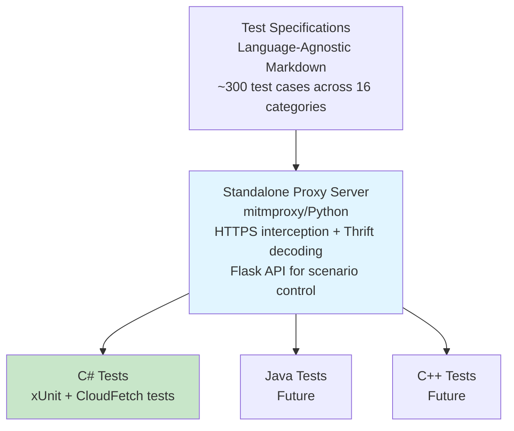

# Test Infrastructure

This directory contains shared test infrastructure for validating ADBC driver implementations against the Databricks Thrift protocol.

## Overview

The test infrastructure enables comprehensive testing of driver behavior including:
- **Protocol compliance**: All Thrift operations (Session, Statement, Metadata, Results)
- **Databricks extensions**: CloudFetch, Direct Results, Arrow streaming, Parameterized queries
- **Failure scenarios**: Expired links, network timeouts, connection resets, SSL errors
- **Error handling**: Retry logic, error recovery, session management

**Initial Target**: C# ADBC Driver (this repository)
**Future Targets**: Java (JDBC), C++ (ODBC), Go (ADBC) drivers

## Quick Links

- **[Design Document](../docs/designs/thrift-protocol-tests/design.md)** - Full architecture, rationale, and implementation plan
- **[Proxy Configuration Schema](../docs/designs/thrift-protocol-tests/proxy-config-schema.md)** - YAML configuration reference
- **[Proxy Server README](./proxy-server/README.md)** - How to use the mitmproxy-based test server

## Architecture



## Directory Structure

```
test-infrastructure/
├── README.md                           # This file
├── proxy-server/                       # Standalone proxy implementation
│   ├── README.md                       # Proxy usage documentation
│   ├── mitmproxy_addon.py             # Main proxy implementation
│   ├── thrift_decoder.py              # Thrift protocol decoder
│   └── requirements.txt               # Python dependencies
└── tests/
    └── csharp/                        # C# test implementation
        ├── CloudFetchTests.cs         # CloudFetch failure tests
        ├── ProxyTestBase.cs           # Base class for proxy tests
        ├── ProxyServerManager.cs      # Proxy lifecycle management
        ├── ProxyControlClient.cs      # OpenAPI-generated client
        └── ProxyTests.csproj          # Test project
```

## Components

### 1. Proxy Server (Python/mitmproxy)

A standalone HTTPS/Thrift proxy that enables failure injection testing:

**Key Features:**
- **HTTPS Interception**: Full man-in-the-middle for CloudFetch downloads from cloud storage (S3, Azure Blob, GCS)
- **Thrift Protocol Decoding**: Tracks and verifies all Thrift RPC calls
- **Flask Control API**: REST API on port 18081 for programmatic scenario control
- **Production-Validated Scenarios**: 10+ failure scenarios based on real customer issues

**Why mitmproxy?**
- Battle-tested HTTPS interception used by security researchers worldwide
- Built-in TLS certificate generation and management
- Rich Python ecosystem for extension (Flask API, Thrift parsing)
- Excellent HTTP/2 and WebSocket support for future needs

See [proxy-server/README.md](./proxy-server/README.md) for usage details.

### 2. Test Specifications

Language-agnostic test case definitions that describe:
- Test steps and expected behavior
- Thrift protocol interactions
- Failure scenarios and recovery strategies
- Implementation notes for edge cases

**Planned: ~300 test cases across 16 categories:**

| Category | Tests | Priority | Description |
|----------|-------|----------|-------------|
| Session Lifecycle | 15 | Critical | OpenSession, CloseSession, timeouts |
| Statement Execution | 25 | Critical | Sync/async execution, cancellation |
| Metadata Operations | 40 | High | GetCatalogs, GetSchemas, GetTables, etc. |
| Arrow Format | 20 | High | Arrow IPC, compression, type handling |
| CloudFetch | 20 | Critical | Cloud storage results, link expiration |
| Direct Results | 15 | High | TSparkDirectResults optimization |
| Parameterized Queries | 20 | High | Named/positional parameters |
| Result Fetching | 15 | High | Pagination, cursor management |
| Error Handling | 30 | Critical | Error codes, recovery, retries |
| Timeout & Cleanup | 12 | Medium | Session/operation timeouts |
| Concurrency | 15 | Medium | Thread safety, parallel operations |
| Protocol Versions | 12 | Medium | Version negotiation, compatibility |
| Security | 15 | High | Authentication, authorization |
| Performance | 10 | Low | Limits, batch sizes |
| Edge Cases | 36 | Medium | NULL handling, empty results, etc. |

### 3. C# Test Implementation

xUnit-based tests in `tests/csharp/` that:
- Inherit from `ProxyTestBase` for automatic proxy management
- Use `ProxyControlClient` to enable/disable failure scenarios
- Verify driver behavior using Thrift call tracking
- Run in CI via GitHub Actions

**Example Test Pattern:**
```csharp
[Fact]
public async Task CloudFetchExpiredLink_RefreshesLinkViaFetchResults()
{
    // 1. Establish baseline without failure
    int baselineFetchResults = await ControlClient.CountThriftMethodCallsAsync("FetchResults");

    // 2. Enable failure scenario
    await ControlClient.EnableScenarioAsync("cloudfetch_expired_link");

    // 3. Execute query
    var result = await statement.ExecuteQuery();

    // 4. Verify driver recovered correctly
    int actualFetchResults = await ControlClient.CountThriftMethodCallsAsync("FetchResults");
    Assert.Equal(baselineFetchResults + 1, actualFetchResults); // Driver refreshed link
}
```

## Design Philosophy

### Language-Agnostic

Different drivers use different languages (C#, Java, C++, Go). By keeping specifications and proxy server language-agnostic:
- ✅ Ensures consistent behavior across all drivers
- ✅ Single source of truth for protocol compliance
- ✅ Easier to review and maintain
- ✅ Reduces duplicate effort

### Standalone Proxy

Testing failure scenarios requires intercepting real traffic and modifying it. A standalone proxy:
- ✅ Works with all programming languages
- ✅ Single implementation to maintain
- ✅ Easy to run in CI/CD
- ✅ Supports both HTTP (Thrift) and HTTPS (CloudFetch)

### Extractable Design

This infrastructure is designed to be extracted to a common repository in the future:

**Current**:
```
adbc-drivers/databricks/
├── docs/designs/thrift-protocol-tests/
└── test-infrastructure/
```

**Future**:
```
github.com/databricks/thrift-test-infrastructure/
├── specs/              # Test specifications
├── proxy-server/       # Standalone proxy
├── docs/              # Design documents
└── examples/
    ├── csharp/        # C# implementation example
    ├── java/          # Java implementation example
    └── cpp/           # C++ implementation example
```

## Getting Started

### Prerequisites

- Python 3.11+ (for proxy server)
- mitmproxy (`pip install mitmproxy`)
- .NET 8.0+ (for C# tests)

### Running Tests Locally

1. **Install proxy dependencies**:
   ```bash
   pip install -r test-infrastructure/proxy-server/requirements.txt
   ```

2. **Run tests** (proxy starts automatically):
   ```bash
   cd test-infrastructure/tests/csharp
   dotnet test
   ```

The `ProxyTestBase` class handles:
- Starting/stopping mitmproxy automatically
- Configuring driver to route through proxy
- Setting up TLS certificate trust
- Resetting scenario state between tests

### Running Proxy Manually

For debugging or development:

```bash
cd test-infrastructure/proxy-server
mitmdump -s mitmproxy_addon.py --listen-port 18080 --set api_port=18081

# In another terminal:
curl http://localhost:18081/scenarios  # List available scenarios
```

See [proxy-server/README.md](./proxy-server/README.md) for detailed usage.

## Relationship to Other Test Suites

This test suite is complementary to existing validation:

**[ADBC Driver Validation](https://github.com/adbc-drivers/validation)** (Python/pytest):
- Focuses on ADBC API feature validation
- Tests SQL query correctness and data type support
- Language-agnostic test definitions
- Validates ADBC compliance across different databases

**This Thrift Protocol Test Suite**:
- Focuses on Databricks Thrift protocol compliance
- Tests protocol-specific features (CloudFetch, Direct Results, Arrow streaming)
- Tests failure scenarios with proxy-based injection
- Validates driver behavior under error conditions

Both suites serve different purposes and coexist. Future consideration: Thrift protocol tests could be contributed to the validation repository.

## CI Integration

Tests run automatically in GitHub Actions:
- Triggered on PR/push to affected paths
- Python dependencies installed via pip
- mitmproxy certificates auto-generated and trusted
- Test results uploaded as artifacts

See `.github/workflows/proxy-tests.yml` for configuration.

## Contributing

When contributing:

1. **Test Specifications**: Follow template in design doc, keep language-agnostic
2. **Proxy Scenarios**: Add to `mitmproxy_addon.py` with JIRA reference if based on real issue
3. **C# Tests**: Inherit from `ProxyTestBase`, use baseline comparison pattern
4. **Documentation**: Update this README and proxy README as needed

## References

- [Design Document](../docs/designs/thrift-protocol-tests/design.md) - Full architecture and rationale
- [Proxy Configuration Schema](../docs/designs/thrift-protocol-tests/proxy-config-schema.md) - YAML reference
- [PR #74](https://github.com/adbc-drivers/databricks/pull/74) - Initial design proposal
- [ADBC Specification](https://arrow.apache.org/adbc/) - Arrow Database Connectivity standard
