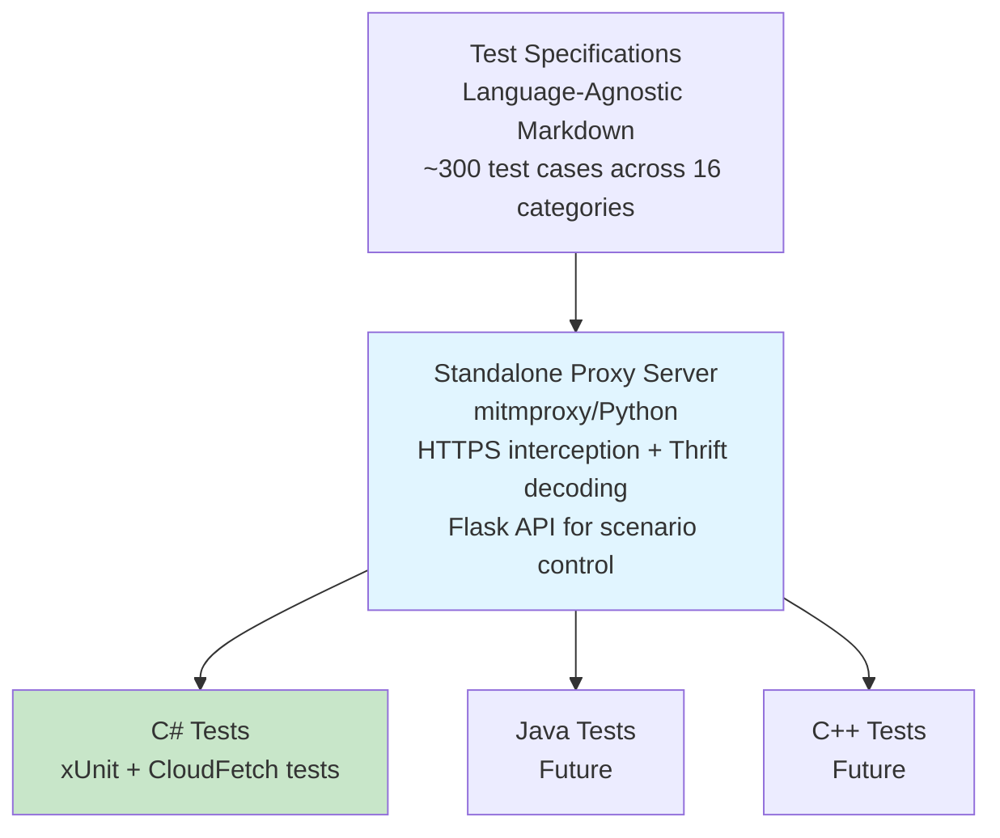

# Test Infrastructure

This directory contains shared test infrastructure for validating ADBC driver implementations against the Databricks Thrift protocol.

## Overview

The test infrastructure enables comprehensive testing of driver behavior including:
- **Protocol compliance**: All Thrift operations (Session, Statement, Metadata, Results)
- **Databricks extensions**: CloudFetch, Direct Results, Arrow streaming, Parameterized queries
- **Failure scenarios**: Expired links, network timeouts, connection resets, SSL errors
- **Error handling**: Retry logic, error recovery, session management

**Initial Target**: C# ADBC Driver (this repository)
**Future Targets**: Java (JDBC), C++ (ODBC), Go (ADBC) drivers

## Goals and Non-Goals

### Goals

- ✅ **Comprehensive Coverage**: All Thrift operations, protocol versions, Databricks extensions
- ✅ **Driver Behavior Focus**: Test what drivers send/receive, not server implementation
- ✅ **Language-Agnostic Specs**: Common test cases described in markdown, implemented per language
- ✅ **Failure Scenario Testing**: Expired links, network errors, timeouts, retries
- ✅ **Extractable**: Easy to move to common repo when ready

### Non-Goals

- ❌ **Server-side testing**: Use existing runtime tests for ThriftServer behavior
- ⏸️ **Performance benchmarking**: Focus on correctness first; performance tests can be added later
- ❌ **Load testing**: Basic concurrency only, not large-scale load tests
- ❌ **Protocol design**: Test existing protocol, not propose new features

## Background

### Thrift Protocol Overview

The Databricks Thrift protocol extends Apache Hive's HiveServer2 protocol:

```
Hive Protocol V1-V10 → Spark Protocol V1-V9 → Databricks Extensions
                                                ├─ CloudFetch
                                                ├─ Direct Results
                                                ├─ Arrow Streaming
                                                └─ Parameterized Queries
```

**Key Operations (20 RPCs):**
- **Session**: OpenSession, CloseSession, GetInfo
- **Execution**: ExecuteStatement, GetOperationStatus, CancelOperation, CloseOperation
- **Results**: GetResultSetMetadata, FetchResults
- **Metadata**: GetCatalogs, GetSchemas, GetTables, GetColumns, GetFunctions, GetTypeInfo, GetPrimaryKeys, GetCrossReference

**Databricks Extensions:**
- **TSparkDirectResults**: Shortcut to fetch results in OpenSession response
- **CloudFetch (V3+)**: High-performance result retrieval directly from cloud storage (S3/Azure Blob/GCS)
- **Arrow Streaming (V5+)**: Columnar results with compression (V6+)
- **Parameterized Queries (V8+)**: Named and positional parameters

### Current Test Coverage

**C# ADBC Driver:**
- ✅ E2E tests: Basic connection, statement execution, CloudFetch happy path
- ✅ Unit tests: Configuration, retry logic, Thrift error handling
- ❌ **Coverage Gaps:**
  - Systematic metadata operation testing
  - Parameterized query validation
  - Protocol version negotiation
  - Failure scenarios (expired links, network timeouts, connection resets)
  - Concurrent operation handling
  - Direct results optimization

**This test infrastructure aims to close these gaps systematically.**

## Quick Links

- **[Test Specifications](./specs/README.md)** - Language-agnostic YAML test definitions
- **[Proxy Server README](./proxy-server/README.md)** - How to use the mitmproxy-based test server and Flask API

## Architecture



## Directory Structure

```
test-infrastructure/
├── README.md                           # This file
├── specs/                              # Language-agnostic test specifications
│   ├── README.md                       # How to use YAML specs
│   └── cloudfetch.yaml                # CloudFetch test specs (3 tests)
├── proxy-server/                       # Standalone proxy implementation
│   ├── README.md                       # Proxy usage documentation
│   ├── mitmproxy_addon.py             # Main proxy implementation
│   ├── thrift_decoder.py              # Thrift protocol decoder
│   └── requirements.txt               # Python dependencies
└── tests/
    └── csharp/                        # C# test implementation
        ├── CloudFetchTests.cs         # CloudFetch failure tests
        ├── ProxyTestBase.cs           # Base class for proxy tests
        ├── ProxyServerManager.cs      # Proxy lifecycle management
        ├── ProxyControlClient.cs      # OpenAPI-generated client
        └── ProxyTests.csproj          # Test project
```

## Components

### 1. Test Specifications (YAML)

Language-agnostic test definitions in machine-readable YAML format:
- **Single source of truth** for test behavior across all driver implementations
- **Maps directly to proxy scenarios** for easy implementation
- **Includes test steps and assertions** that any language can follow
- **Tracks implementation status** across C#, Java, C++, Go

**Example structure:**
```yaml
tests:
  - id: CLOUDFETCH-001
    name: Expired Link Recovery
    proxy_scenario: cloudfetch_expired_link
    steps:
      - action: establish_baseline
        execute_query: "SELECT * FROM table"
        measure:
          - thrift_method: FetchResults
            save_as: baseline_count
      - action: enable_failure_scenario
        scenario: cloudfetch_expired_link
      - action: execute_test
        execute_query: "SELECT * FROM table"
    assertions:
      - type: query_succeeds
      - type: thrift_call_count
        method: FetchResults
        expected: baseline_count + 1
```

See [specs/README.md](./specs/README.md) for full documentation.

**Planned Test Suites (~300 test cases across 16 categories):**

| Category | Tests | Priority | Description |
|----------|-------|----------|-------------|
| Session Lifecycle | 15 | Critical | OpenSession, CloseSession, timeouts |
| Statement Execution | 25 | Critical | Sync/async execution, cancellation |
| Metadata Operations | 40 | High | GetCatalogs, GetSchemas, GetTables, etc. |
| Arrow Format | 20 | High | Arrow IPC, compression, type handling |
| CloudFetch | 20 | Critical | Cloud storage results, link expiration (3 implemented ✅) |
| Direct Results | 15 | High | TSparkDirectResults optimization |
| Parameterized Queries | 20 | High | Named/positional parameters |
| Result Fetching | 15 | High | Pagination, cursor management |
| Error Handling | 30 | Critical | Error codes, recovery, retries |
| Timeout & Cleanup | 12 | Medium | Session/operation timeouts |
| Concurrency | 15 | Medium | Thread safety, parallel operations |
| Protocol Versions | 12 | Medium | Version negotiation, compatibility |
| Security | 15 | High | Authentication, authorization |
| Performance | 10 | Low | Limits, batch sizes |
| Edge Cases | 36 | Medium | NULL handling, empty results, etc. |

### 2. Proxy Server (Python/mitmproxy)

A standalone HTTPS/Thrift proxy that enables failure injection testing:

**Key Features:**
- **HTTPS Interception**: Full man-in-the-middle for CloudFetch downloads from cloud storage (S3, Azure Blob, GCS)
- **Thrift Protocol Decoding**: Tracks and verifies all Thrift RPC calls
- **Flask Control API**: REST API on port 18081 for programmatic scenario control
- **Production-Validated Scenarios**: 10+ failure scenarios based on real customer issues

**Why mitmproxy?**
- Battle-tested HTTPS interception used by security researchers worldwide
- Built-in TLS certificate generation and management
- Rich Python ecosystem for extension (Flask API, Thrift parsing)
- Excellent HTTP/2 and WebSocket support for future needs

See [proxy-server/README.md](./proxy-server/README.md) for usage details.

### 3. C# Test Implementation

xUnit-based tests in `tests/csharp/` that:
- Inherit from `ProxyTestBase` for automatic proxy management
- Use `ProxyControlClient` to enable/disable failure scenarios
- Verify driver behavior using Thrift call tracking
- Run in CI via GitHub Actions

**Example Test Pattern:**
```csharp
[Fact]
public async Task CloudFetchExpiredLink_RefreshesLinkViaFetchResults()
{
    // 1. Establish baseline without failure
    int baselineFetchResults = await ControlClient.CountThriftMethodCallsAsync("FetchResults");

    // 2. Enable failure scenario
    await ControlClient.EnableScenarioAsync("cloudfetch_expired_link");

    // 3. Execute query
    var result = await statement.ExecuteQuery();

    // 4. Verify driver recovered correctly
    int actualFetchResults = await ControlClient.CountThriftMethodCallsAsync("FetchResults");
    Assert.Equal(baselineFetchResults + 1, actualFetchResults); // Driver refreshed link
}
```

## Design Philosophy

### Language-Agnostic

Different drivers use different languages (C#, Java, C++, Go). By keeping specifications and proxy server language-agnostic:
- ✅ Ensures consistent behavior across all drivers
- ✅ Single source of truth for protocol compliance
- ✅ Easier to review and maintain
- ✅ Reduces duplicate effort

### Standalone Proxy

Testing failure scenarios requires intercepting real traffic and modifying it. A standalone proxy:
- ✅ Works with all programming languages
- ✅ Single implementation to maintain
- ✅ Easy to run in CI/CD
- ✅ Supports both HTTP (Thrift) and HTTPS (CloudFetch)

### Extractable Design

This infrastructure is designed to be extracted to a common repository in the future:

**Current**:
```
adbc-drivers/databricks/
└── test-infrastructure/
```

**Future**:
```
github.com/databricks/thrift-test-infrastructure/
├── specs/              # Test specifications
├── proxy-server/       # Standalone proxy
├── docs/              # Design documents
└── examples/
    ├── csharp/        # C# implementation example
    ├── java/          # Java implementation example
    └── cpp/           # C++ implementation example
```

## Implementation Plan

### Phased Approach

**Phase 1: Foundation Infrastructure**
- Design document and architecture definition
- Directory structure (`test-infrastructure/` with `proxy-server/` and `tests/`)
- Proxy server implementation (mitmproxy-based) with:
  - HTTPS/Thrift traffic interception
  - Flask control API for scenario management
  - Failure injection capabilities
  - Thrift protocol decoder for call verification
- C# test infrastructure:
  - Base classes for proxy-based tests
  - Proxy lifecycle management
  - Control API client
- CI/CD integration with GitHub Actions

**Phase 2: Critical Test Categories**
- CloudFetch failure scenarios (expired links, HTTP errors, timeouts, connection resets)
- Session lifecycle tests (open/close, expiration, invalidation)
- Statement execution tests (query execution, cancellation, timeouts)
- Basic error handling validation

**Phase 3: Comprehensive Coverage**
- Metadata operations (catalogs, schemas, tables, columns, functions)
- Arrow format validation (schemas, batches, compression)
- Direct results testing
- Parameterized query validation
- Result fetching edge cases

**Phase 4: Advanced Scenarios**
- Concurrency and thread safety
- Protocol version negotiation
- Security testing (authentication, authorization)
- Performance regression detection
- Edge cases and corner scenarios

**Phase 5: Cross-Driver Expansion**
- Adapt specifications for Java JDBC driver
- Adapt specifications for C++ ODBC driver
- Adapt specifications for Go ADBC driver
- Consider extraction to common repository

## Key Design Decisions

### Why Language-Agnostic Specifications?

Multiple driver implementations exist (C#, Java, C++, Go). Language-agnostic specifications ensure:
- Consistent behavior across all drivers
- Single source of truth for protocol compliance
- Easier review and maintenance
- Reduced duplicate effort

### Why mitmproxy Over Alternatives?

**Chosen: mitmproxy/Python**

Rationale:
- **HTTPS Interception**: CloudFetch downloads happen over HTTPS to cloud storage (S3, Azure Blob, GCS), requiring full HTTPS man-in-the-middle capability. mitmproxy is battle-tested for this.
- **Certificate Management**: Built-in TLS certificate generation and trust chain handling
- **Protocol Support**: Excellent HTTP/1.1, HTTP/2, and WebSocket support
- **Rich Ecosystem**: Python ecosystem for extension (Flask API, Thrift parsing)
- **Development Speed**: Fast prototyping and iteration
- **Industry Standard**: Used by security researchers and QA teams worldwide

**Alternatives Considered:**
- **Go proxy**: Would need custom HTTPS interception; complex certificate management
- **C# proxy**: Other drivers would need .NET runtime
- **Java proxy**: Heavy JVM dependency, less mature HTTPS interception libraries
- **Custom solution**: Would replicate what mitmproxy already provides

### Why Start with C# Implementation?

- This repository is the C# ADBC driver
- Provides working reference for other languages
- Validates spec quality before wider rollout
- Establishes patterns for future implementations

## Alternatives Considered

### Alternative 1: Mock Server Instead of Proxy

**Considered:** Implement mock Thrift server that simulates responses

**Rejected Because:**
- Want to test against **real** Thrift server behavior
- Mock server requires duplicating server logic
- Proxy provides better integration testing
- Proxy can still inject failures in real interactions

**Note:** Proxy server can operate in "standalone mock mode" if needed

### Alternative 2: Separate Test Suite Per Driver

**Considered:** Each driver implements tests independently

**Rejected Because:**
- Leads to inconsistent behavior across drivers
- Duplicate effort for similar tests
- Harder to ensure feature parity
- No shared validation of Thrift protocol compliance

### Alternative 3: Implement Everything in One Language

**Considered:** Write all tests in C# and use language bindings

**Rejected Because:**
- C++ ODBC driver can't easily call C# code
- Java JDBC driver would need complex interop
- Each driver has different test frameworks
- Language-native tests are easier to maintain

## Getting Started

### Prerequisites

- Python 3.11+ (for proxy server)
- mitmproxy (`pip install mitmproxy`)
- .NET 8.0+ (for C# tests)

### Running Tests Locally

1. **Install proxy dependencies**:
   ```bash
   pip install -r test-infrastructure/proxy-server/requirements.txt
   ```

2. **Run tests** (proxy starts automatically):
   ```bash
   cd test-infrastructure/tests/csharp
   dotnet test
   ```

The `ProxyTestBase` class handles:
- Starting/stopping mitmproxy automatically
- Configuring driver to route through proxy
- Setting up TLS certificate trust
- Resetting scenario state between tests

### Running Proxy Manually

For debugging or development:

```bash
cd test-infrastructure/proxy-server
mitmdump -s mitmproxy_addon.py --listen-port 18080 --set api_port=18081

# In another terminal:
curl http://localhost:18081/scenarios  # List available scenarios
```

See [proxy-server/README.md](./proxy-server/README.md) for detailed usage.

## Relationship to Other Test Suites

This test suite is complementary to existing validation:

**[ADBC Driver Validation](https://github.com/adbc-drivers/validation)** (Python/pytest):
- Focuses on ADBC API feature validation
- Tests SQL query correctness and data type support
- Language-agnostic test definitions
- Validates ADBC compliance across different databases

**This Thrift Protocol Test Suite**:
- Focuses on Databricks Thrift protocol compliance
- Tests protocol-specific features (CloudFetch, Direct Results, Arrow streaming)
- Tests failure scenarios with proxy-based injection
- Validates driver behavior under error conditions

Both suites serve different purposes and coexist. Future consideration: Thrift protocol tests could be contributed to the validation repository.

## CI Integration

Tests run automatically in GitHub Actions:
- Triggered on PR/push to affected paths
- Python dependencies installed via pip
- mitmproxy certificates auto-generated and trusted
- Test results uploaded as artifacts

See `.github/workflows/proxy-tests.yml` for configuration.

## Contributing

When contributing:

1. **Test Specifications**: Follow template in design doc, keep language-agnostic
2. **Proxy Scenarios**: Add to `mitmproxy_addon.py` with JIRA reference if based on real issue
3. **C# Tests**: Inherit from `ProxyTestBase`, use baseline comparison pattern
4. **Documentation**: Update this README and proxy README as needed

## References

- [PR #74](https://github.com/adbc-drivers/databricks/pull/74) - Initial design proposal
- [ADBC Specification](https://arrow.apache.org/adbc/) - Arrow Database Connectivity standard
- [mitmproxy Documentation](https://docs.mitmproxy.org/) - HTTPS proxy documentation
